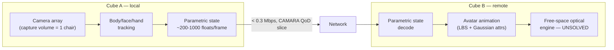
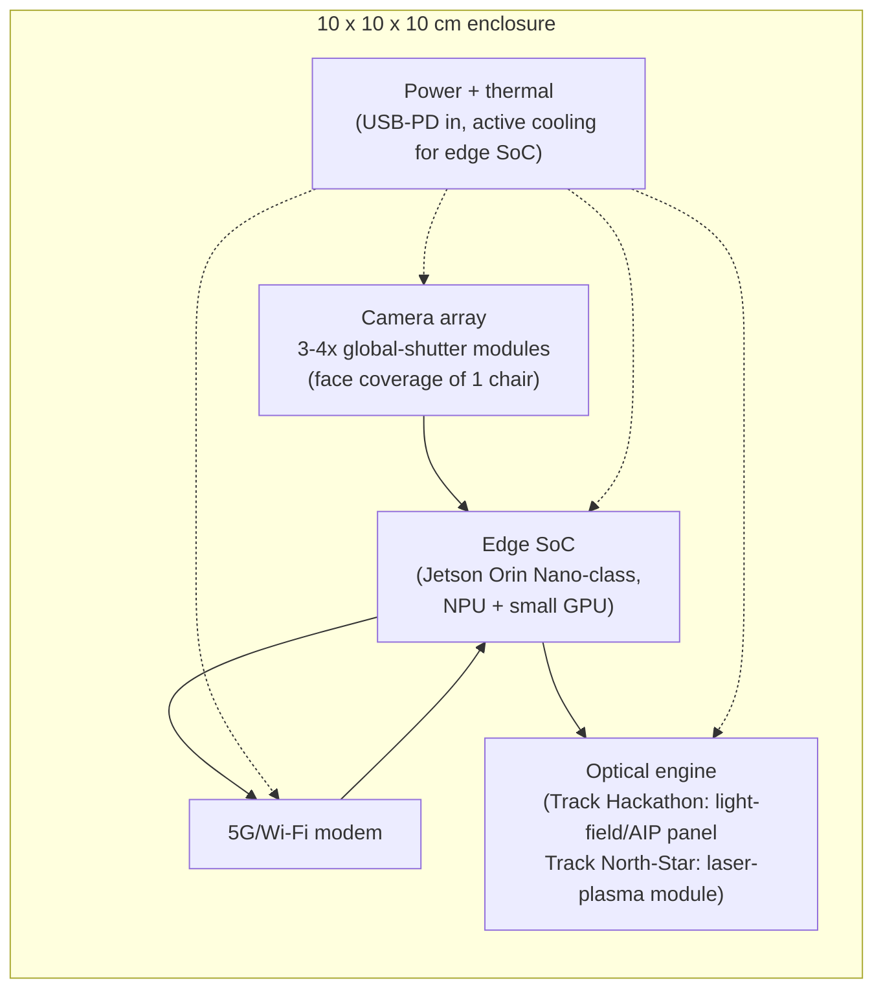
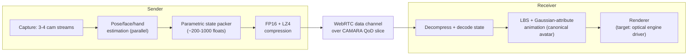

# FilesPlan.md — original engineering plan (HISTORICAL)

> ### ⚠ FULLY SUPERSEDED — see [`docs/10_TAYF_UNIVERSAL_ENGINEERING.md`](docs/10_TAYF_UNIVERSAL_ENGINEERING.md)
>
> This was the project's first plan. It is preserved because the reasoning is worth reading and because the corrections log in doc 10 §9 refers back to it — **but almost every specific in it has since been superseded**: the 10 cm cube, the 85%/15% split, the free-space-plasma north star, the 128-paper count (now 175), and the two-track framing. Do not build from this file.

---

**Implementability verdict:** ~85% of the system — capture, human representation, compression, transport, and the telecom layer — is buildable today from published, license-clean methods, several already validated at real-time rates with measured bandwidth/latency numbers (see Mon3tr, §3.2). The remaining ~15% — free-space optical emission of a photoreal, video-rate human from a 10cm enclosure — is not solved anywhere in the literature. The closest published result (fist-sized femtosecond laser-plasma display, JSID 2025) reaches ~10k voxels/s in a 68mm volume, roughly 1-2 orders of magnitude short of what a recognizable moving face needs. **We have enough papers to build the capture→network half of TAYF with confidence. We do not have enough papers to build the "hologram" half as originally conceived — that half needs either a scope change or original R&D.** Everything below is written on that basis: solved things are stated as solved, the one open thing is treated as the actual project.

---

## 1. What TAYF Is

Two identical ~10×10×10cm cubes. Each captures its local human, computes a compact dynamic representation, streams it over an ordinary network connection, and reconstructs the remote human as free-space light at the other cube — no screen, wall, headset, or external projector as the *primary* output. The network carries a person's state, not their video; the cube turns state back into light. That is the whole idea in one sentence, and it hasn't changed since the first brainstorm — what has changed is which parts of it are now backed by citable, working prior art and which part is still ours to invent.

---

## 2. Pipeline Stage Status

| Stage | Status | Evidence | Decision still needed |
|---|---|---|---|
| **Capture** (multi-cam → body/face/hand pose) | Solved, off-the-shelf | Monocular estimators exist at real-time rates (Mon3tr: GVHMR/HaMeR/SMIRK running in parallel at 71-377 fps); license-clean segmentation (BiRefNet, MIT) | Camera count/placement for a 10cm cube face — not yet chosen |
| **Representation** (canonical avatar + per-frame driving params) | Solved architecturally | Mon3tr (2601.07518): one-time ~33s avatar build, then 215 floats/frame drives it. GETA-3DGS (2605.02086) and 2510.10492 give avatar-compression numbers (~5x storage; <0.26 Mbps/frame stream) | Which avatar model to standardize on (SMPL-X-class vs Anny/MHR to avoid non-commercial license) |
| **Transport** | Solved | Mon3tr measures <0.2 Mbps, ~80ms end-to-end over WebRTC data channel; CAMARA QoD/network-slicing gives a guaranteed-latency path on real 5G | Nokia NaC portal registration still not done (blocks live demo of QoD) |
| **Free-space optical emission** | **Not solved** | Best published compact result: JSID 2025 fist-sized laser-plasma display, 68×42mm, ~10k voxels/s — cube-scale, but voxel budget is sparse/iconic, not photoreal | This is the actual open research question of the project — see §3 |

The first three rows are integration work: pick components, wire the pipeline, tune. The fourth row is the reason this is a hackathon-worthy idea and not just "a good video call app," and it's also the reason a naive reading of "10 cm cube projects a photoreal human into a chair" is not achievable on any timeline this hackathon allows.

---

## 3. The Hard Problem — Free-Space Optical Emission at 10cm

### 3.1 Why light doesn't just "blow out into the air"

Free space has no scattering medium. A hologram, a light field, or a volumetric image needs *something* to either (a) emit light directly from points in the volume (plasma, particles, an emissive medium) or (b) redirect light so a viewer's eyes reconstruct depth (an SLM/phased-array wavefront, a light-field panel, angular multiplexing). There is no way to make ordinary air glow with a phone-driven screen — this constrains the design space to five real physical mechanisms, ranked by what the literature actually supports at cube scale:

| Mechanism | Cube-scale evidence | Fidelity ceiling for TAYF | Verdict |
|---|---|---|---|
| **Laser-plasma ionization (aerial voxels)** | JSID 2025: 68×42mm, ~10k voxels/s. Dual-path scaling exists (SIGGRAPH 2026, DOI 10.1145/3816042) | Sparse, wireframe/point-cloud level. Class-4 laser, eye-safety hazard near a person's face — serious unsolved safety problem for a consumer device | Best long-term "genuinely free-space" candidate; not photoreal-capable for years |
| **Acoustic levitation / ultrasonic particle display** | MATD (Nature 2019) — room-scale rigs, single/few particles, very low refresh for complex shapes | Cannot render a moving human at video rate at any published scale | Ruled out for TAYF's fidelity target |
| **Volumetric cloud/medium display** | Optica 2025 — brighter/denser than air-plasma by scattering in a vapor medium, but current form factor far exceeds 10cm | Better voxel density than plasma-in-air, but medium maintenance + haze inside a sealed consumer cube is a hard engineering problem | Interesting for a later revision, not the prototype |
| **Holographic SLM / computer-generated holography** | Real, mature field. **Updated Aug 2026:** angle, speed, and speckle each now have independent real point-solutions — 159°×159° dynamic FOV (arXiv 2511.22639), 60Hz full-color speckle-free video (arXiv 2409.11049), 30dB speckle suppression (arXiv 2604.16237) | No paper combines angle+speed+speckle; none evaluated at 10cm-cube scale, power/safety budget, or on a moving photoreal human face rather than test patterns | Individually de-risked sub-problems; the combined, human-face, cube-scale system remains unbuilt |
| **Light-field / retroreflective panel (Looking Glass-class, AIP)** | Commercial products exist today (Looking Glass, Sony ELF-SR2). **Software side de-risked:** an already-working open-source webcam-to-panel pipeline (arXiv 2506.08064) plus three real-time many-view rendering papers validated on real panel hardware | Not free space — image is bound to a physical panel — but glasses-free, real depth cues, works today, fits a compact enclosure | **Not what the user asked for, but the only mechanism that is actually buildable, safe, and demo-able by Sep 13** |

### 3.1a Literature update, Aug 2026 sweep

A dedicated search of 742 previously-unread OPTICS-track papers, run specifically to try to narrow this gap, found **nothing that closes it — the ~85%/15% split below stands.** What it found instead: each of CGH's three named fidelity problems (narrow angle, non-real-time, speckle) now has an independent, real, hardware-validated point-solution in the literature (see row above), but no paper combines them, none is tested at cube scale, and none touches a moving photoreal human face rather than geometric test patterns or generic clips. The laser-plasma north-star track got a physical caution (cumulative air-density depletion above ~10kHz pulse rate may prevent linear voxel-count scaling by repetition rate alone) rather than a scaling win.

**Second pass, same conclusion, three specific blind spots chased down:** the first pass explicitly flagged what it hadn't checked rather than treating silence as a verdict — a follow-up targeted exactly those gaps. Result, still **85%/15% unchanged**:

- **Track D (perception) checked for the first time** (55-60 of 208 unread papers read): no clean numeric fidelity threshold, but the strongest single finding across both passes is real — arXiv 2401.02171 found a flat 2D video cutout (no volumetric geometry) produced AR-HMD co-presence statistically equal to a full 3D avatar while beating it on fidelity. Untested for free-space multi-viewer use, but a genuine lead now queued as `experiments/perceptual-quality/README.md`'s first experiment.
- **Branch C (aerial imaging) reclassified from "nothing found" to "wrong venue searched."** A 467-paper arXiv triage found zero genuine papers — all false positives (drone/satellite imagery). Real research exists (AIRR/ASKA3D, Yamamoto/Suyama et al., published in Optics Express/OSA Continuum/Optical Review, none on arXiv) but full text couldn't be obtained. Not ruled out; not verified either — genuinely unassessed pending non-arXiv access.
- **Laser-plasma scaling and a HUMAN×OPTICS cross-search both came back negative, more precisely.** No positive voxel-rate result anywhere (one unverified, non-arXiv 1.82× brightness-only claim). No paper combines an avatar representation with a genuinely free-space renderer — the closest bridge (a Stanford Gaussian-splat-to-hologram transform, arXiv 2505.06582/2508.17480) exists but has never been pointed at human content or free-space output.

Full detail: `hardware/optical-engine.md`'s two literature-update sections and `research/deepseek_research.md`'s Track 1/Track 4 (175 papers documented as of this update).

### 3.2 What this means for the build

TAYF as originally specified — a sealed 10cm cube that emits a photoreal, moving, free-floating human into the air around a chair — is not buildable with any combination of published 2022-2026 techniques. That is not a reason to abandon the idea; it's the actual research frontier, and the honest project plan has two tracks that both stay true to the concept:

- **Track North-Star (multi-year, this is the real invention):** laser-plasma or hybrid plasma-in-medium aerial display, scaled from JSID 2025's 10k voxels/s toward the ~10^5-10^6 points/s a recognizable face needs, with eye-safety engineering (pulse energy, exposure limits, possibly a physical exclusion zone or gaze-tracked pulse gating) solved from the start, not bolted on later. This is a publishable/patentable research program, not a hackathon deliverable.
- **Track Hackathon-Prototype (buildable solo by Sep 13):** keep the entire capture→representation→transport stack exactly as designed (it's real and it's yours), and terminate it in a compact light-field or retroreflective aerial-imaging panel instead of true free-space plasma. This is not a downgrade of the pitch — it's the correct engineering move: demo the hard, novel, actually-working 90% (a stranger's body reconstructed from 215 numbers a second over a real 5G slice, in under 100ms) and be upfront on stage that the optical engine is the acknowledged open problem the team is attacking next, with the physics already scoped (§3.1 table becomes a slide, not a gap).

---

## 4. Hardware Plan

### 4.1 Block diagram (per cube)

### 4.2 Subsystem candidates (unverified pricing/availability — the online fact-check pass that was supposed to confirm these was killed mid-run and needs to be rerun before any order is placed)

- **Cameras:** 3-4 synchronized global-shutter modules (candidates: Sony IMX296/IMX568-class sensors, MIPI-CSI, hardware-triggered sync) — enough angular coverage of a seated person to feed the monocular/sparse-multiview pose estimators from §2 without full-room capture.
- **Edge compute:** NVIDIA Jetson Orin Nano Super-class module — the only realistic candidate for running pose/face/hand estimators plus avatar animation inside a passively-or-lightly-cooled 10cm enclosure. The remote RTX 5060 is for training/avatar-building only, never for the deployed cube.
- **Radio:** 5G modem module with CAMARA QoD support on the carrier side; Wi-Fi fallback for indoor demo reliability.
- **Optical engine (hackathon track):** compact light-field or retroreflective AIP panel — needs a real vendor/part search (not done yet).
- **Optical engine (north-star track):** femtosecond fiber laser + galvo/MEMS scanner — explicitly out of scope for the hackathon; flagged as R&D.
- **Power/thermal:** USB-PD input, forced-air or vapor-chamber cooling for the edge SoC (this is the thermal bottleneck in a sealed 1000cm³ box) — no thermal budget has been calculated yet.

### 4.3 Not yet done, blocking a real BOM

1. Actual vendor part numbers + current pricing (research thread lost, needs rerun).
2. Thermal budget calculation for continuous edge-SoC inference in a sealed 10cm enclosure.
3. Laser eye-safety analysis if the north-star optical engine is pursued at all before a demo audience.
4. Camera field-of-view math against a real chair capture volume.

---

## 5. Software Architecture

- **Avatar model:** standardize on a license-clean parametric body (Anny or MHR, Apache-2.0, not SMPL-X's non-commercial license) rigged with 3D Gaussian attributes per §2.
- **Enrollment:** one-time per-user avatar build (personalized canonical Gaussian set) — offline, on the remote RTX 5060, not on the deployed cube.
- **Runtime driving stream:** body pose + facial expression + hand pose, packed and compressed exactly as Mon3tr demonstrates — this is the one piece of the software stack with real measured numbers already in hand (<0.2 Mbps, ~80ms, ~60fps target).
- **Telecom layer:** Nokia Network-as-Code — `qod.create_session_v1` for the guaranteed-latency link during a live demo, `congestion_insights.query` as the "agentic" layer the hackathon rules require (15-minute-ahead congestion prediction, not just reactive QoS). Portal registration is still outstanding (task #2).
- **Renderer:** swappable backend — drives whatever the chosen optical engine needs (light-field view stack for the hackathon track; hologram/voxel driver stubbed for the north-star track).

---

## 6. What's Left — Technical Gap List (the direct answer to "what's left")

In priority order, this is what actually blocks a working, safe, submittable prototype:

1. **Decide and commit to the hackathon-track optical engine** (light-field panel vs retroreflective AIP) — nothing else in the display stage can be built until this is chosen. This is the single most blocking open decision.
2. **Redo the online research pass** that was killed before producing anything: real component vendors/pricing for cameras + edge SoC + the chosen optical panel, and a genuine patent/freedom-to-operate check.
3. **Camera rig design** — count, placement, sync method, actual FOV coverage math against a chair-sized capture volume. Nothing chosen yet.
4. **Thermal/power budget** for the edge SoC in a sealed 10cm enclosure — not calculated.
5. **Nokia NaC portal registration** — blocks any live CAMARA QoD/Congestion Insights demo (task #2, still pending).
6. **Avatar-model licensing decision** — commit to Anny/MHR over SMPL-X now, before any capture pipeline code is written, so nothing gets built on a non-commercial-licensed dependency that has to be ripped out later.
7. **Enrollment pipeline** — the offline avatar-build step (Mon3tr-style, ~33s reference) has to be implemented against the chosen license-clean avatar model; nothing published does this off-the-shelf.
8. **On-device inference budget** — Mon3tr's numbers assume a PC-class sender and a Quest3-class receiver SoC; nothing has been validated on a Jetson-class embedded chip yet. This needs real benchmarking, not assumption.
9. **If the north-star laser-plasma track is pursued at all for a stage demo:** a laser eye-safety analysis before it goes anywhere near a person. Not started, not optional.
10. **Idea Capture Template + pitch deck**, due Aug 23 — the honest two-track framing in §3.2 is the pitch: real, working, measured 90% of the stack, plus a scoped, physics-literate R&D roadmap for the genuinely novel 10%, not an oversold "hologram cube" claim that collapses under a judge's first technical question.
11. **arXiv reading backlog** — 128 papers documented so far against ~15,800 candidates discovered; the highest-value remaining reads are anything in the newly-discovered acoustic-levitation/metasurface/swept-volume clusters (feeds directly into §3.1) and continuing the Human/Perception tracks.

---

## 7. Timeline Against Real Deadlines

- **Now → Aug 23 (Idea Capture + pitch deck):** finalize §3.2's two-track framing as the pitch narrative, pick the hackathon-track optical engine (item 1), rerun the hardware research pass (item 2).
- **Aug 23 → Sep 13 (Prototype/Live Demo):** build the capture→representation→transport pipeline for real (this is the part with citable numbers and no open research risk), integrate whichever light-field/AIP panel was sourced, get one working end-to-end cube-to-cube demo with a real CAMARA QoD session. Do not attempt the laser-plasma track inside this window — it is a multi-year program, not a four-week one.

---

## 8. Repository File Manifest

Every file below now exists on disk, implementing the plan above. This section is the index — read a row, go to the file for the detail.

| File | Purpose |
|---|---|
| `docs/architecture.md` | Canonical pipeline diagram + stage-status table, everything else links back here |
| `docs/roadmap.md` | Two-track timeline (hackathon vs north-star) with hard dates |
| `hardware/bom.md` | Candidate BOM by subsystem, pricing/availability flagged UNVERIFIED |
| `hardware/camera-rig.md` | Camera count/placement/sync/FOV design |
| `hardware/optical-engine.md` | Two-track optical engine spec + the physics ranking table + laser eye-safety placeholder |
| `hardware/power-thermal.md` | Power/thermal budget worksheet (structure only, numbers pending BOM) |
| `hardware/enclosure.md` | Physical component layout inside the 10cm volume |
| `firmware/README.md` | Firmware scope — no code yet, nothing to build against until hardware is chosen |
| `pipeline/README.md` | Software module map + data flow |
| `pipeline/requirements.txt` | License-clean dependency list (Apache-2.0/MIT only) |
| `pipeline/schema.py` | The 215-float `DrivingState` wire format — real, importable code |
| `pipeline/capture/README.md` | Camera ingestion + pose/face/hand estimator responsibilities |
| `pipeline/avatar/README.md` | Enrollment flow + avatar-model license decision (Anny/MHR, not SMPL-X) |
| `pipeline/transport/README.md` | Packing/compression/WebRTC + where CAMARA QoD plugs in |
| `agent/README.md` | CAMARA agent loop: predict congestion → decide → act |
| `agent/compliance.md` | Hard constraint: no MCP, LLM brain must be Gemini 2.5/Groq, not Claude |
| `agent/nac_client.py` | Verified Nokia NaC SDK v10 call patterns — real, importable code |
| `app/README.md` | Phone app scope (pair + set boundary), SwiftUI/iOS-first recommendation |
| `design/README.md` | Apple-minimalist glassmorphism rules, stated as restraint |
| `design/tokens.md` | Concrete color/blur/corner-radius/type values for `app/` to consume |
| `pitch/idea-capture-template.md` | Draft submission using the honest two-track narrative |
| `pitch/deck-outline.md` | Slide-by-slide outline for the Aug 23 deck |

### Added from `research/notes.md` (full pass — see that file for the original brainstorm every row below formalizes)

| File | Purpose |
|---|---|
| `docs/theory.md` | Core hypotheses, the `L(x,y,z,θ,φ,t)` light-field formalism, the four research tracks (A-D), the central optimization problem |
| `docs/calibration.md` | Spatial registration, coordinate frames, observer/viewpoint tracking |
| `docs/architecture.md` (edited) | Added environment-independence constraint + symmetric bidirectional architecture |
| `pipeline/view_synthesis/README.md` | Sparse-physical-views → neural-interpolation → dense-apparent-views module |
| `pipeline/transport/README.md` (edited) | Added temporal/delta compression + per-stage latency budget |
| `hardware/optical-engine.md` (edited) | Added the pluggable-engine abstraction + full research-variable breakdown per branch (A-E) |
| `app/README.md` (edited) | Added body-region selection / fidelity-bandwidth tradeoff |
| `research/LICENSING.md` | Full dependency licensing table + policy |
| `research/CITATIONS.md` | Index across every research artifact in the repo |
| `experiments/README.md` | The 8 core experiments, the 11-step experimental ladder, research-notebook template, failure-mode checklist |
| `experiments/voxel-display/README.md` | Branch A protocol — laser-excited volumetric voxels |
| `experiments/light-field/README.md` | Branch B protocol — directional light-field/holographic (the hackathon-track branch) |
| `experiments/aerial-imaging/README.md` | Branch C protocol — aerial imaging optics |
| `experiments/angular-resolution/README.md` | Minimum-physical-view-count experiment |
| `experiments/bandwidth/README.md` | Validates `pipeline/transport/`'s bandwidth target on real hardware |
| `experiments/latency/README.md` | Validates the <150ms budget stage-by-stage on real hardware |
| `experiments/perceptual-quality/README.md` | Track D — how little optical information is actually needed for convincing presence |
| `patent/PATENT_NOTES.md` | Strategy + public-disclosure timing warning |
| `patent/invention-disclosure.md` | Four candidate inventive concepts (draft, needs attorney review) |
| `patent/claim-map.md` | Subsystem-to-claim-scope mapping (draft) |
| `patent/prior-art.md` | Seed prior-art list (not a completed search) |
