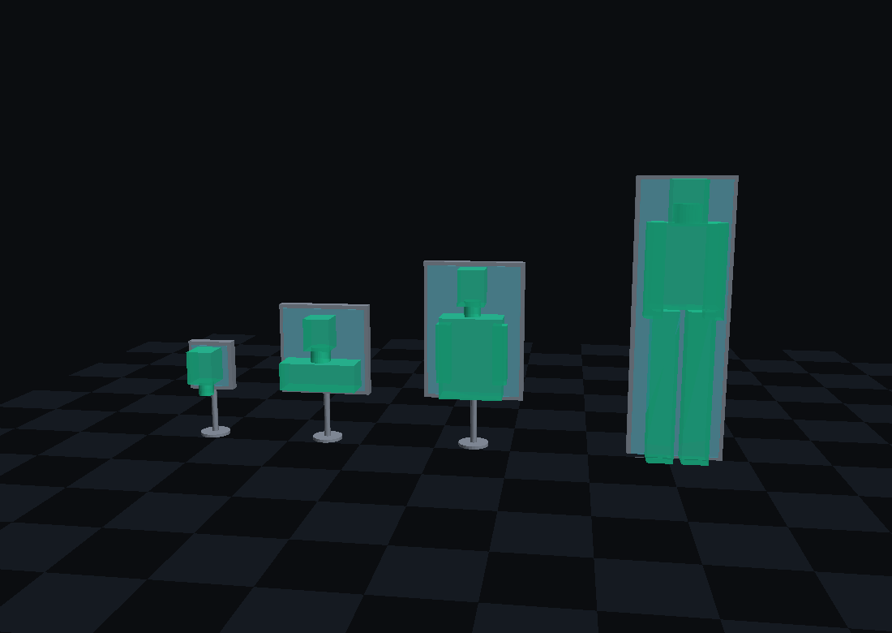
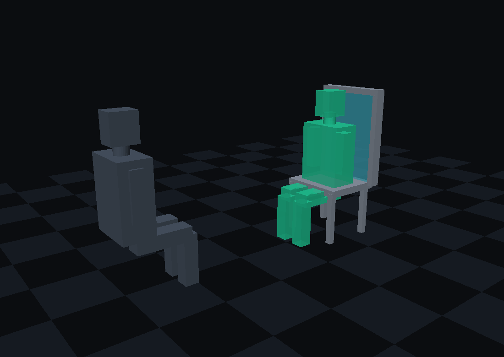

# TAYF (طيف)

**Two devices exchange a person as 215 numbers a second, and rebuild them as light standing in the air at the other end.** No screen carrying the image, no headset, no glasses, nothing worn, nothing else to buy — and no moving parts.

*Four devices at true scale. Each plate is exactly as tall as the figure in front of it. That is the law the whole project runs on.*

---

## Start here

**→ [`docs/10_TAYF_UNIVERSAL_ENGINEERING.md`](docs/10_TAYF_UNIVERSAL_ENGINEERING.md)**

One document, 59,000 words: first principles to part numbers, every load-bearing claim tagged by how much it is actually trusted. Everything else in this repository is either a source for it or a detail beneath it.

---

## What it is

Each device watches its local human with cameras, reduces them to a **215-float driving state**, ships it at **~0.1 Mbps**, and the far device animates a pre-enrolled avatar and forms it as a **real image floating in open air**.

The optical engine is **AIRR** — Aerial Imaging by Retro-Reflection. Three static sheets and a display panel: a source, a beamsplitter, a retroreflector. Nothing spins, scans, levitates or flies. The only thing that changes is which pixels are lit.

| | |
|---|---|
| Wire rate | **0.104 Mbps** measured — 130–1900× less than volumetric streaming |
| Latency | **126 ms** against the 150 ms conversational threshold |
| Viewing angle | **170°** measured (Yamamoto 2017, `10.11370/isj.56.341`) |
| Moving parts | **none** |
| Safety | no laser above indicator level, no plasma, no ultrasound |

## The three laws

Every dimension in the project falls out of three geometric facts. They are not technology limits; they are statements about where light can go.

1. **Clipping** — an image *in your space* cannot exceed the aperture. `W ≤ D`. A 10 cm device floats a 10 cm object. *(Smalley et al., Nature 553, 486 — matter at the image point is the sole exception.)*
2. **Portal** — an image *beyond* the device may exceed it without limit. `W = D·(b/a)`. A 50 cm disc shows a car at 9 m, or a bus at 24 m.
3. **Presence is an angle** — the device must subtend the same angle as the subject. A face at 1 m is only **12.6°**, which is why small devices are not useless.

## The devices

| Form | Aperture | Shows |
|---|---|---|
| Desk slab | 20 × 20 cm | upper body at 1.2 m |
| Folio *(folds to a book)* | A4 | upper body / face |
| Disc | 50 cm | head and shoulders |
| **Chair** | 55 × 80 cm | a person sitting in the chair |
| Mirror | 55 × 175 cm | a full standing person |
| Command table | 150 × 150 cm horizontal | terrain, viewed from all sides |

All six are modelled to true scale in [`models/`](models/); renders in `models/png/`. Rebuild with `python3 models/render_png.py` — pure standard library, no dependencies.

## What is solved, and what is not

**Solved and measured:** capture, avatar representation, compression, transport, the CAMARA network layer, and the optical mechanism.

**Not yet measured:** **η_RR**, the retroreflector return efficiency — aerial-image cd/m² per source cd/m². Every brightness and panel-power figure in the project rests on it, no published source states it, and one afternoon with a spot luminance meter closes it. It is the single highest-value measurement available.

**Not buildable by anyone:** a 10 cm cube putting a whole standing person in your chair. Six independent physical laws forbid it — clipping, nitrogen's spin selection rule, the plasma power wall, numerical aperture, Bjerknes collapse, and pulmonary toxicology. Each was tested rather than assumed; each is written up in §9 of the universal document so nobody re-treads them.

## Repository

| Path | Contents |
|---|---|
| [`docs/10_...`](docs/10_TAYF_UNIVERSAL_ENGINEERING.md) | **The universal document — start here** |
| `docs/01`–`09` | Detail specs: spec, optics, capture, hardware, IP, plan, simulation, designs |
| `docs/sections/` | Section sources; the universal doc rebuilds from these |
| `models/` | 3D models of all six devices, renderer, viewer |
| `simulation/` | Wave-optics propagator (passes 9/9 against analytic results), thermal model |
| `pipeline/` | Capture → avatar → view synthesis → transport, incl. `schema.py` |
| `agent/` | Nokia Network-as-Code / CAMARA layer, and its compliance constraints |
| `hardware/` · `firmware/` · `app/` · `design/` | Subsystem specs |
| `experiments/` | Physical validation programme, seven branches |
| `patent/` | Prior art and IP notes *(draft — not legal advice)* |
| `research/` | **175 papers** deep-read across four tracks, plus licensing, citations, and `METHODOLOGY.md` |

**[`research/METHODOLOGY.md`](research/METHODOLOGY.md) is worth reading on its own.** It records the research rules this project earned by breaking them — chief among them that surveying literature by keyword search returns confident false negatives about exactly the ideas you failed to anticipate. A keyword sweep here returned 467 drone photographs for "aerial" while the decade-long research programme the project actually needed sat in an open-access journal the search never reached.

## Status

Solo project. Nothing ordered, nothing fabricated. The next step is **V0 — a 50 cm static disc**, which validates the entire optical family with no hinge, no fold, and no moving parts, and which yields the η_RR measurement everything else is waiting on.

## Licence

Undecided. See [`research/LICENSING.md`](research/LICENSING.md) for the third-party dependency table — SMPL-X and its derivatives are excluded as non-commercial, and several estimator licences remain unverified.
