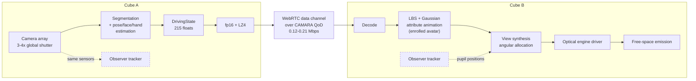
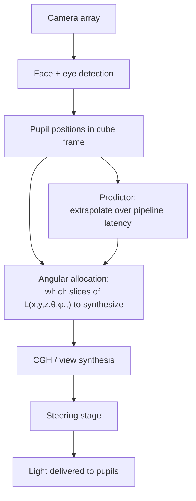

# 01 — TAYF System Master Specification

**Status:** authoritative. Where this document and any other file disagree, this document wins and the other file is a bug.
**Last major revision:** 2026-08-15, following the first-principles feasibility pass (§4) that materially changed the project's conclusions.

---

## 0. The one-paragraph version

TAYF is a pair of identical ~10×10×10 cm devices. Each captures its local human with a camera array, reduces them to a ~215-float/frame parametric state (~0.12–0.21 Mbps), ships that over an ordinary network, and reconstructs the remote human as free-space light at the far end — no screen, headset, or external projector in the primary output path. The capture→representation→transport chain is solved and buildable from published, license-clean components. The free-space optical engine is the open problem. **The central result of this specification is that the optical problem is substantially smaller than this project previously believed, and the thermal problem is substantially larger.**

---

## 1. Hard constraints vs. adjustable parameters

The single most common failure mode in a project like this is treating every requirement as equally rigid, discovering something is impossible, and abandoning the whole concept. Separate them explicitly.

### 1.1 Hard constraints (violating these means it isn't TAYF)

| # | Constraint | Why it is load-bearing |
|---|---|---|
| H1 | Output is free-space or self-contained — no external screen, wall, projector, or headset required | This is the entire differentiation. A screen-based version is a video call. |
| H2 | Endpoints are symmetric — Cube A = Cube B | Makes it a communication endpoint, not a capture rig plus a display. |
| H3 | Transmission carries person-state, not pixels or geometry | The ~1000× bandwidth argument and the whole architecture depend on it. |
| H4 | End-to-end latency ≤ 150 ms one-way | ITU-T G.114 conversational threshold. Above this it stops feeling like presence. |
| H5 | Eye-safe under all foreseeable use and failure modes | Non-negotiable for a device that sits at face height near a person. |
| H6 | No mandatory external infrastructure (tracking rigs, capture booths, special chairs) | Environment independence — `research/notes.md` §17. |

### 1.2 Adjustable parameters (negotiable under evidence)

| # | Parameter | Nominal | Realistic range | What forces movement |
|---|---|---|---|---|
| A1 | Enclosure edge length | 100 mm | 100–250 mm | **Thermal (§5). This is the parameter under the most pressure.** |
| A2 | Simultaneous observers | 1 | 1–2 tracked | Optical SBP budget (§4) |
| A3 | Angular coverage | tracked pupils | 2 pupils → ±20° broadcast | Whether head-tracking is permitted in the architecture |
| A4 | Apparent subject | head + shoulders | head → full body | Optical and thermal budget |
| A5 | Frame rate | 60 fps | 30–90 fps | Compute and modulator bandwidth |
| A6 | Photorealism | photoreal head | wireframe → photoreal | Which optical mechanism wins |
| A7 | Power delivery | USB-PD tethered | tethered / battery | Thermal, and whether portability matters |

**A1 is the parameter to spend first.** The 10 cm figure was an aesthetic starting point, not a physics-derived requirement. §5 shows it is the binding constraint on the entire system, and §4 shows the optics do *not* require it to move. If something must give, it is the edge length — not H1.

---

## 2. Functional requirements

**FR-1 Capture.** Acquire sufficient information to reconstruct the local human's body pose, facial expression, and hand/finger articulation, within a user-defined capture volume, without room-scale infrastructure.

**FR-2 Enrollment.** Build a persistent, personalized avatar once (offline, off-device), separating persistent identity (shape, face, skin, hair, clothing) from dynamic state.

**FR-3 Encode.** Reduce each frame to a compact parametric driving state (§7.1) and compress it.

**FR-4 Transport.** Deliver that state to the far endpoint within the latency budget (§6), with graceful degradation when network conditions fall short.

**FR-5 Reconstruct.** Animate the enrolled avatar from the received driving state on the receiving cube.

**FR-6 Emit.** Convert the animated avatar into free-space light such that a human observer perceives a remote person present in the local space.

**FR-7 Register.** Maintain a spatial coordinate frame so the apparent remote human occupies a stable, intended position and scale.

**FR-8 Track.** Estimate observer position to drive the optical engine's angular allocation (§4.4 — this is load-bearing, not an optimization).

**FR-9 Be symmetric.** Do FR-1 through FR-8 in both directions simultaneously.

---

## 3. End-to-end architecture

The dashed observer-tracker path is the architecturally significant detail: **the same camera array that captures the local user for transmission also locates that user's pupils for the local optical engine.** Capture and display share one sensor set. §4.4 shows this is what makes the optical budget close.

### 3.1 Stage status

| Stage | Status | Evidence | Detail doc |
|---|---|---|---|
| Capture | Solved | Monocular estimators at 71–377 fps (Mon3tr, arXiv 2601.07518) | `03_...TRANSPORT.md` |
| Representation | Solved | 215 floats/frame drives a personalized avatar; ~33 s one-time build | `03_...TRANSPORT.md` |
| Transport | Solved | <0.2 Mbps, ~80 ms measured end-to-end over WebRTC | `03_...TRANSPORT.md` |
| Optical emission | **Open — but bounded (§4)** | See the SBP analysis; the gap is ~1.3–1.7× broadcast, or 5.6× *surplus* if head-tracked | `02_...OPTICAL_ENGINEERING.md` |
| Thermal | **Open — now the binding constraint (§5)** | ~12–21 W total passive budget vs. 7–15 W for the SoC alone | `04_...HARDWARE...md` |

---

## 4. Optical budget — the core analysis

This section supersedes every earlier statement in this repository about the optical engine being short by "orders of magnitude." That framing was wrong because it never computed the actual requirement.

### 4.1 What the display must produce

The optical engine's job is to synthesize a light field

**L(x, y, z, θ, φ, t)**

— radiance as a function of position, direction, and time. It does *not* need to fill that function everywhere. It needs to fill it only where an observer's pupil actually is. This is the "limited light" principle from `docs/theory.md`, and §4.4 turns it from a philosophical observation into a 58× budget reduction.

### 4.2 Required space-bandwidth product

Space-bandwidth product (SBP) = number of independently controllable resolvable elements = (spatial samples) × (angular samples).

Assumptions, all stated so they can be attacked:
- Viewing distance **d = 1.0 m** (seated conversational distance)
- Human foveal acuity **1 arcmin** = 2.909×10⁻⁴ rad
- Head width **0.25 m** → subtends 14.3°
- Smooth motion parallax requires view separation ≤ pupil diameter, **6 mm** → 6.0 mrad at 1 m

Lateral resolvable points across a head: 0.25 / (1.0 × 2.909×10⁻⁴) = **859**
Spatial samples (859²) = **7.39×10⁵**

| Angular coverage | Views | Required SBP |
|---|---|---|
| ±10° | 58 | 4.28×10⁷ |
| **±20°** | **116** | **8.57×10⁷** |
| ±30° | 175 | 1.29×10⁸ |

### 4.3 What hardware supplies

SBP_available = (modulator pixels) × (time-multiplex factor at 60 Hz output)

| Modulator | Pixels | Refresh | Mux | SBP | % of ±20° need |
|---|---|---|---|---|---|
| 4K LCoS phase | 8.29×10⁶ | 60 Hz | 1× | 8.29×10⁶ | 9.7% |
| Holoeye GAEA (4160×2464) | 1.03×10⁷ | 60 Hz | 1× | 1.03×10⁷ | 11.9% |
| TI DLP MEMS phase (1920×1080) | 2.07×10⁶ | 1440 Hz | 24× | 4.98×10⁷ | **58%** |
| 4K LCoS, 8× multiplexed | 8.29×10⁶ | 480 Hz | 8× | 6.64×10⁷ | **77%** |

**The broadcast gap is 1.3–1.7×, not orders of magnitude.** That is a normal engineering shortfall, closeable by a modest increase in modulator pixel count or refresh rate — both of which are on active commercial improvement curves.

### 4.4 The head-tracked collapse — the central architectural result

The ±20°/116-view requirement assumes the display must serve every direction in the room simultaneously, on the chance someone is looking from there. That is a broadcast architecture, and it is wasteful in exactly the way `docs/theory.md` predicted.

The cube already knows where the observer is: **its cameras are pointed at them, because it is capturing them for transmission.** Serving only the pupils that actually exist:

| Architecture | Views served | Required SBP | 4K LCoS @60 Hz margin |
|---|---|---|---|
| Broadcast ±20° | 116 | 8.57×10⁷ | 0.10× (10× short) |
| Broadcast ±10° | 58 | 4.28×10⁷ | 0.19× (5× short) |
| **Tracked, 1 observer (2 pupils)** | **2** | **1.48×10⁶** | **5.61× surplus** |
| Tracked, 2 observers (4 pupils) | 4 | 2.96×10⁶ | 2.81× surplus |

**A 58× reduction, turning a 10× deficit into a 5.6× surplus on commodity hardware.** The same collapse applies to compute: hologram synthesis drops from 5.14 Gpx/s (broadcast) to **0.089 Gpx/s** (tracked) — which matters enormously against §5's power budget.

### 4.5 The 10 cm aperture is not the constraint

Theoretical ceiling of an aperture, SBP_max = A·Ω/λ² (A = 0.01 m², λ = 550 nm):

| Angular coverage | Ω (sr) | SBP_max |
|---|---|---|
| ±20° | 0.379 | 1.25×10¹⁰ |
| ±45° | 1.840 | 6.08×10¹⁰ |
| ±90° | 6.283 | 2.08×10¹¹ |

Against the ±20° broadcast requirement of 8.57×10⁷, a 10 cm aperture has **145× headroom**. Against the tracked requirement, ~8400×. **Nothing about the 10 cm form factor limits the optics.** The modulator limits the optics. This is the most important correction in this document: the cube size was never the optical problem.

### 4.6 What this does not solve

Stated plainly, because §4.4 is the kind of result that invites overclaiming:

1. **Steering range.** The grating equation (sin θ_max = λ/2p) caps diffraction angle by pixel pitch: 8 µm → ±2.0°, 3.74 µm → ±4.2°, 1 µm → ±16.0°, 0.5 µm → ±33.4°. Covering 30 cm of natural head sway at 1 m needs ±17.2° of steering, which commodity SLM pitches **cannot** deliver alone. This requires either a separate coarse steering stage (MEMS/galvo), or a metasurface pixel-interpolator of the kind demonstrated in arXiv 2511.22639 (159°×159° FOV at 60 Hz — real, hardware-validated). This is the principal unsolved optical sub-problem.
2. **Multi-observer.** Tracked architecture serves 1–2 people. A walk-around-it demo is a different, much harder machine.
3. **Real-time hologram synthesis** at 0.089 Gpx/s still needs a fast CGH method — achievable per arXiv 2409.11049 (60 Hz full-colour, speckle-free), not free.
4. **Tracking latency** enters the motion-to-photon budget (§6) and has no margin to waste.
5. **Thermal (§5) is untouched by any of this.**

### 4.7 Laser-plasma, for comparison

Voxel rate required vs. the JSID 2025 baseline (~10⁴ voxels/s):

| Target | Points | @30 fps | vs. baseline |
|---|---|---|---|
| Sparse wireframe head | 5×10³ | 1.5×10⁵ /s | **15×** |
| Dense point cloud head | 5×10⁴ | 1.5×10⁶ /s | 150× |
| Eye-resolution head | 7.39×10⁵ | 2.22×10⁷ /s | 2216× |

A sparse, iconic, genuinely-floating-in-air head is 15× away — not absurd. A photoreal one is 2216× away, and two independent physical effects push back on naive scaling (cumulative air-density depletion above ~10 kHz, arXiv 2501.10198; and energy-splitting in multi-spot parallelism). Laser-plasma stays the north-star track, not the prototype.

---

## 5. Power and thermal budget — the actual binding constraint

Sealed enclosure, edge L, surface area 6L², natural convection h ≈ 8 W/m²K, emissivity 0.9, ambient 25 °C.

Q_total = h·A·ΔT + εσA(T_s⁴ − T_amb⁴)

| ΔT | Surface temp | Convection | Radiation | **Total** |
|---|---|---|---|---|
| 15 K | 40 °C | 7.20 W | 5.24 W | **12.44 W** |
| 25 K | 50 °C | 12.00 W | 9.18 W | **21.18 W** |
| 35 K | 60 °C (too hot to hold) | 16.80 W | 13.50 W | 30.30 W |

Against that budget: Jetson Orin Nano **7–15 W**, Orin NX **10–25 W** — before cameras, modem, SLM, laser, or optics.

**At a defensible 40 °C surface, the entire cube has ~12.4 W and the SoC alone can consume all of it.** This, not the optical engine, is what threatens the 10 cm form factor. Options, in order of preference:

1. **Grow the enclosure.** Q scales as L². 150 mm → 28 W at ΔT=15 K; 200 mm → 50 W. Parameter A1 exists for exactly this.
2. **Cut compute.** §4.4's tracked architecture already removes 58× of hologram synthesis load — this is a thermal result as much as an optical one.
3. **Forced air.** Raises h several-fold, costs acoustic noise next to a conversation, adds a moving part.
4. **Duty-cycle.** Conversations are bursty; sustained vs. peak budgets differ.
5. **Offload.** The far cube renders; some work could move to a tethered base or the network. Weakens H1's self-containment claim — use last.

**Design rule: no component enters the BOM without a power number, and the running total is checked against 12.4 W at every review.**

---

## 6. Latency budget

Target ≤150 ms one-way (H4). Reference: Mon3tr measures ~80 ms end-to-end on PC-class sender + Quest3-class receiver.

| Stage | Allocation | Notes |
|---|---|---|
| Capture + exposure | 8–16 ms | 60 fps frame interval |
| Segmentation + pose/face/hand | 20–30 ms | Dominant sender cost; unvalidated on Jetson-class |
| Encode + pack | 2–5 ms | 868 B/frame, trivial |
| Network | 20–60 ms | CAMARA QoD-managed; the variable the agent layer defends |
| Decode | 2–5 ms | |
| Avatar animation | 8–15 ms | LBS + Gaussian attributes |
| **Observer tracking** | **5–10 ms** | **New — enters the loop because of §4.4** |
| View synthesis + CGH | 10–20 ms | 0.089 Gpx/s tracked |
| Optical emission | 1–16 ms | Modulator-dependent |
| **Total** | **76–177 ms** | Upper end violates H4 — no stage has slack |

Two independent perceptual findings give useful margin guidance: audiovisual desync is noticeable beyond ~50 ms lead / ~220 ms lag, and viewers preferred *expressive* motion with 100 ms desync over precisely-timed flat motion by 82.6% (arXiv 2503.20308). **If a tradeoff is forced, spend latency to preserve motion expressiveness rather than the reverse.**

---

## 7. Bandwidth budget

### 7.1 Wire format

215 floats/frame: body pose 75 + facial expression 50 + hand pose 90. Packed with an fp64 timestamp = 868 bytes/frame raw. Defined in `pipeline/schema.py` — both endpoints import it; nothing redefines the packet shape.

| Encoding | @60 fps |
|---|---|
| fp32 | 0.413 Mbps |
| fp16 | 0.206 Mbps |
| fp16 + LZ4 (~0.6×) | **0.124 Mbps** |
| *Volumetric/point-cloud streaming, for reference* | *20–300 Mbps* |

That ratio — roughly 10²–10³ — is the architectural argument for parametric transmission, and it is measured, not projected.

### 7.2 Non-runtime transfers

Canonical avatar payload moves once per enrolled user per device pair, not per frame. Compressible ~5× (arXiv 2605.02086). It is a session-setup cost, not a bandwidth cost.

---

## 8. Spatial, angular, and apparent-size requirements

| Quantity | Requirement | Source |
|---|---|---|
| Spatial resolution at 1 m | ≥859 points across a head (1 arcmin) | §4.2 |
| Angular sampling | ≤6 mrad (pupil-limited) | §4.2 |
| Steering range | ±17.2° to cover 30 cm head sway at 1 m | §4.6 |
| Depth range | ≥0.3 m around the apparent subject | Seated conversational geometry |
| Apparent size | Life-size head/shoulders | Life-size placement measurably drives co-presence (arXiv 2401.02171) |
| Frame rate | ≥30 fps, target 60 fps | Below 30 the motion reads as broken |
| Brightness | Visible against normal indoor ambient (~200–500 lux) | Radiance budget in `02_...OPTICAL_ENGINEERING.md` |

**Physical optical volume is decoupled from apparent image size.** The cube does not need to contain a head-sized emissive volume; magnification, aerial imaging, or wavefront reconstruction can produce a large apparent image from a small engine. Preserving that decoupling is a design requirement, not an optimization.

---

## 9. Observer / viewpoint model

Given §4.4's dependence on tracking, the observer model is a first-class part of the specification.

- **Tracking volume:** seated observer, ±0.3 m lateral, 0.6–1.5 m from the cube.
- **Required accuracy:** pupil localization to better than one pupil diameter (6 mm) at 1 m ≈ 6 mrad.
- **Prediction is mandatory.** With 76–177 ms of pipeline latency, tracking must extrapolate; at a natural 0.2 m/s head sway, 100 ms of latency is 20 mm of error — over three pupil diameters. **Untracked prediction error, not tracking accuracy, is the likely failure mode.**
- **Graceful degradation:** on tracking loss, widen to a fixed broadcast cone at reduced fidelity rather than dropping output.

---

## 10. Mathematical system model

**Capture.** Frames I₁..I_k(t) → estimator E → driving state **s**(t) ∈ ℝ²¹⁵.

**Transport.** ŝ(t) = D(C(s(t))) where C = fp16+LZ4, D its inverse; delivered at t + τ_net.

**Animation.** Canonical Gaussians {μ_c, Σ_c, c, α} deformed by LBS transform **A**(ŝ):
- position: μ_t = **A**μ_c + **b**
- covariance: **Σ_t = A Σ_c Aᵀ** ← the term that makes clothing/geometry rotate correctly rather than merely translate

**Emission.** Target light field L(x,y,z,θ,φ,t). With observer pupils P = {p₁..p_n}, the engine synthesizes only

L|_P = { L(x,y,z,θ,φ,t) : (θ,φ) subtends some p_i ∈ P }

**|L|_P| / |L| ≈ n/116 for the ±20° broadcast case — the formal statement of §4.4's 58× saving.**

**Optimization.** Maximize perceived presence Ψ subject to:
SBP ≤ SBP_available · (mux factor) · (perceptual allocation gain) ; P_total ≤ 12.4 W ; τ_e2e ≤ 150 ms ; bitrate ≤ 0.3 Mbps ; volume ≤ L³ ; exposure ≤ MPE.

Perceptual allocation gain is real and large: concentrating 80% of budget into the 20% of solid angle containing face and hands yields ~16× relative density where it matters. Ψ itself remains unquantified — that is Track D's job (`experiments/perceptual-quality/README.md`), and it is the weakest term in this model.

---

## 11. System-level tradeoffs

| Trade | Cheap side | Expensive side | Current call |
|---|---|---|---|
| Tracked vs. broadcast | Tracked: 58× less SBP and compute | Broadcast: any viewer, any position | **Tracked.** Enables everything else. Accept 1–2 observers. |
| Enclosure size | Larger: thermal headroom (L²) | 100 mm: the original aesthetic | **Let A1 move.** 10 cm was never physics-derived. |
| Photoreal vs. iconic | Iconic: 15× from plasma baseline | Photoreal: 2216× | Photoreal via panel/holography; iconic is plasma's only near-term option |
| Uniform vs. perceptual allocation | Perceptual: ~16× on what matters | Uniform: simpler | **Perceptual**, everywhere |
| On-cube vs. offloaded compute | Offload: thermal relief | On-cube: satisfies H1 | On-cube for runtime; enrollment always offloaded |
| Latency vs. expressiveness | Expressiveness (82.6% preference) | Sub-50 ms precision | **Expressiveness** |

---

## 12. Definition of success and failure

### 12.1 Success

**Minimum viable (hackathon-track, Sep 13 2026).** Two endpoints; a person captured at one appears reconstructed at the other from parametric state alone; measured <0.3 Mbps and <150 ms over a live CAMARA QoD session; output on a compact light-field/AIP panel; observer sees correct depth. Not free-space — and said plainly.

**Full concept.** All of the above, output genuinely free-space, apparent life-size head/shoulders, stable under natural head motion, recognizable identity to a familiar viewer, within thermal and eye-safety limits, in an enclosure at or near A1.

**Scientific.** A defensible answer to: *can a compact optical-computational device generate enough controlled free-space light-field information for a human to perceive a remote person as present?* §4 argues the answer is plausibly yes for a tracked single observer — **this is now a testable claim, not a hope.**

### 12.2 Failure — declare it honestly, in these cases

- **F1** Tracked SBP requirement cannot be met on any modulator that fits the power budget → the free-space concept is not viable at this scale; ship the panel version and say so.
- **F2** Thermal cannot be closed at any enclosure size that remains a table object (>250 mm) → the form factor is wrong, not the idea.
- **F3** Motion-to-photon with tracking prediction cannot stay under 150 ms → the image will lag and break presence; tracked architecture fails and broadcast is unaffordable.
- **F4** Eye safety cannot be closed for the chosen emission mechanism → that mechanism is dead regardless of every other result.
- **F5** Perceptual testing (Track D) shows identity/presence collapses at any achievable fidelity → the optical target was mis-set and the whole budget chain needs rederiving.

**None of these is currently demonstrated.** F2 is the nearest to biting.

---

## 13. Where the risk actually is

Reordered by this specification's analysis, against the project's prior beliefs:

| Rank | Risk | Prior belief | Now |
|---|---|---|---|
| 1 | **Thermal at 10 cm** | Minor packaging detail | **Binding constraint on the form factor (§5)** |
| 2 | **Steering range vs. pixel pitch** | Not identified | **The real unsolved optical sub-problem (§4.6)** |
| 3 | Tracking prediction under latency | Not identified | Likely failure mode of the tracked architecture (§9) |
| 4 | Jetson-class inference performance | Flagged | Unchanged — still unvalidated |
| 5 | Perceptual thresholds (Ψ unquantified) | Understudied | Unchanged — must be measured in-house (§10) |
| 6 | **Raw optical SBP** | **Believed hopeless** | **Not the problem (§4.4–4.5)** |

---

## 14. Document map

| Doc | Scope |
|---|---|
| **01 (this)** | Constraints, requirements, budgets, system model, success/failure |
| `02_FREE_SPACE_OPTICAL_ENGINEERING.md` | Optical physics, mechanisms, layouts that fit, eye safety |
| `03_HUMAN_CAPTURE_REPRESENTATION_AND_TRANSPORT.md` | Capture, avatar, compression, network, models and licenses |
| `04_CUBE_HARDWARE_AND_PROTOTYPE_ENGINEERING.md` | Components, PCB, mechanics, BOM, prototype ladder |
| `05_RESEARCH_PRIOR_ART_AND_PATENT_ARCHITECTURE.md` | Prior art, overlap matrix, inventive concepts |
| `06_MASTER_RESEARCH_AND_BUILD_PLAN.md` | Dependency graph, go/no-go gates, milestones |
| `07_HARDWARE_SIMULATION_PLAN.md` | What to simulate before buying anything |
| `research/deepseek_research.md` | 175 deep-read papers, four tracks |
| `FilesPlan.md` | Original plan; superseded by this document where they differ |
