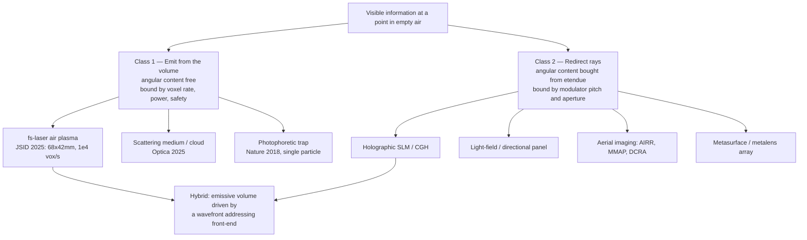
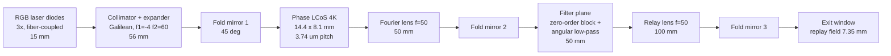
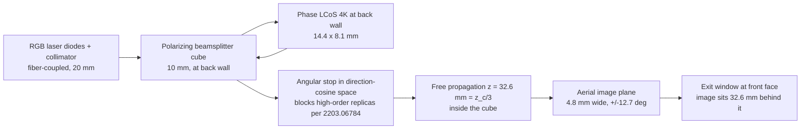
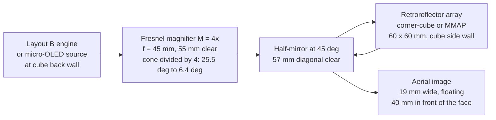
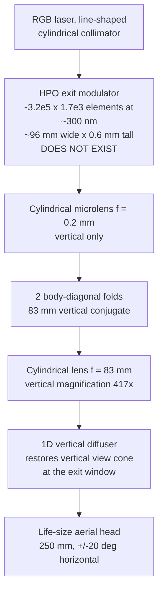
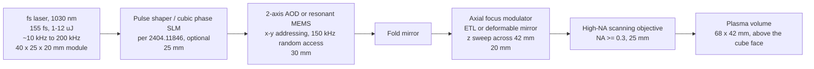
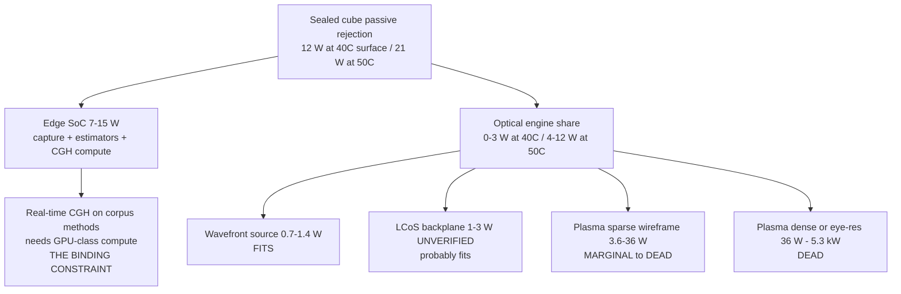

# Free-Space Optical Engineering for TAYF

> ### ⚠ SUPERSEDED IN PART — read [`docs/10_TAYF_UNIVERSAL_ENGINEERING.md`](10_TAYF_UNIVERSAL_ENGINEERING.md) first
>
> This document predates the current design and is kept as a **detail source and historical record**, not as a specification. Where it disagrees with document 10, document 10 wins. Specifically superseded:
> - **The device is not a 10 cm cube.** It is a family of flat apertures (20 cm slab → A4 folio → 50 cm disc → chair → mirror), sized by the aperture law. Depth is dead weight; every form is a slab.
> - **The engine is static AIRR optics**, selected. Free-space plasma, acoustic and photophoretic routes were all evaluated and ruled out with quantitative reasons (doc 10 §9).
> - **The "~85% / ~15%" framing is retired.** It described a problem that no longer exists in that shape.
> - **Viewing angle is 170°**, measured (Yamamoto 2017, `10.11370/isj.56.341`) — not the ±20–30° stated in earlier revisions, which belongs to a different mechanism.
> - **Transport is delta + int8 at 0.104 Mbps**, measured — not fp16 + LZ4, whose assumed 0.6× ratio was tested and found to *expand* the payload.


**Scope.** This document is the physics and engineering analysis of TAYF's one open track: making a remote human visible as light in empty air, from a device whose external envelope is 100 × 100 × 100 mm. Tracks A (representation) and B (transport) are closed — Mon3tr's 215 floats/frame at <0.2 Mbps (arXiv 2601.07518) settles them. This is Track C, plus the parts of Track D (perception) that set numeric requirements on Track C.

**Reading order.** §1 establishes what the physics permits. §2 builds the two accounting systems (space-bandwidth product and étendue) that every candidate must be scored against. §3 and §4 are the demand and supply numbers. §5 is the geometric constraint that SBP accounting alone hides. §6 scores every mechanism. §7–§9 are the radiance, layout, thermal and safety budgets. §10 is the comparison table, §11 the parts lists, §12 the falsification plan.

**Citation discipline.** This project has been burned by a fabricated citation. Every arXiv ID in this document was read out of `research/deepseek_research.md` Track 1 and is present there verbatim; non-arXiv sources come from `research/arxiv/online_findings.md` and carry that file's own verification status. Anything I could not verify is marked **UNVERIFIED** inline. Every number I computed myself is shown with its formula and inputs so it can be re-derived and, if wrong, corrected. Constants taken from standards or textbooks rather than from this repo's corpus are marked as such.

**Headline result.** The space-bandwidth gap between what a human head needs and what a modulator can supply is **1.3–1.7×, not orders of magnitude**. The aperture is not the limit — a 100 mm aperture has 145× headroom at ±20°. What actually blocks a life-size free-space head is neither of those: it is **étendue placement** — the modulator's information is delivered at 14 mm × ±4.2°, and the target needs it at 250 mm × ±20°. That is an 82× one-dimensional Lagrange expansion, and it maps onto one concrete device requirement: an exit aperture with **~220–350 nm pitch spanning ~100 mm, i.e. ~3×10⁵ elements across**. No such device exists. The nearest (Swave HXR, sub-300 nm pitch, 2.56×10⁸ pixels) has the right pitch on a ~4.8 mm die — 20× short in linear extent while *exceeding* the mode-count requirement by 3×. That reframes the open problem from "we need more pixels" to "we need the same pixels spread across a 100 mm face."

---

## §1 — What physics permits in empty air

### 1.1 The two mechanism classes, and only two

To make a point in empty space appear luminous to an observer, the light arriving at that observer's pupil must appear to originate there. There are exactly two ways to arrange that:

1. **Emit from the volume.** Put something at (x,y,z) that radiates. Air itself does not radiate; it must be excited (femtosecond-laser plasma), replaced by a scatterer (particle, droplet, cloud medium), or a scatterer must be transported there (photophoretic trap). The emitted light is genuinely omnidirectional, so *the display's angular content is free*. This is the decisive structural advantage of the class.
2. **Redirect rays so the eye reconstructs depth.** Do not put anything at (x,y,z); instead shape the wavefront leaving a surface such that the ray bundle reaching the pupil is indistinguishable from one that came from (x,y,z). Holographic SLMs, light-field panels, integral imaging, and aerial-imaging retroreflectors all live here. The angular content is *not* free — it is bought out of a conserved quantity (§2.2), and that is where every architecture in this class dies or survives.

Everything in `hardware/optical-engine.md`'s ranked table is one of these two. There is no third class.

### 1.2 Why a projector cannot do this — quantitatively

`docs/theory.md` states the qualitative version: a projector performs `image → photons → surface`. The quantitative version is sharper and worth stating because it also bounds the "just project into haze" idea.

**(a) Rank in angle.** A projector's output field is, at any point in space, a single ray direction — the line from that point back to the projection pupil. In `L(x,y,z,θ,φ,t)` terms the projector supplies a function that is **rank-1 in (θ,φ)**: one direction per spatial point, with an angular spread set by the projector pupil divided by throw distance (a 5 mm pupil at 500 mm throw = 10 mrad ≈ 0.57°). §3 shows TAYF needs rank ≥ 116 in the horizontal angle alone. No amount of brightness or resolution changes a rank-1 field into a rank-116 one.

**(b) Air does not scatter enough to be a screen.** Rayleigh scattering coefficient of standard sea-level air at 550 nm is β ≈ 1.2×10⁻⁵ m⁻¹ *(textbook/standard-atmosphere value, not from this repo's corpus — treat as order-of-magnitude)*. Over the cube's own 0.1 m of internal path:

```
fraction scattered = 1 − exp(−βL) ≈ βL = 1.2e-5 × 0.1 = 1.2e-6
```

§7 shows a visible face needs ≈ 3.8 lm delivered to the observer. Sourcing that from Rayleigh scatter requires 3.8 / 1.2×10⁻⁶ ≈ **3.2 million lumens** in the beam, and it would be scattered into 4π rather than toward the viewer, costing another ~30×. This is not a factor-of-two argument; it is six to eight orders of magnitude, and it holds regardless of laser technology. **Clean air cannot be a projection medium.** This is why the emissive class must *create* a scatterer (plasma, particle) or import one (Optica 2025 cloud-medium display, DOI 10.1364/optica.562854), and why "the phone blows the shape into the air" is not a mechanism.

For calibration: a light indoor haze at β ≈ 0.01 m⁻¹ gives 10⁻³ over 0.1 m — a factor of 830 better, still requiring ~3800 lm and destroying the see-through property. That is the entire design rationale of medium-based volumetric displays, and it is why they are a different product, not a different tuning of the same one.

### 1.3 The consequence for TAYF's architecture

The emissive class is étendue-free and rate-bound. The wavefront class is rate-adequate and étendue-bound. These are *complementary* failure modes, which is the single most useful structural fact in this document and the reason §10's comparison table is organized the way it is.



---

## §2 — The two accounting systems

Every candidate must survive two independent audits. They are not the same audit, they do not give the same number, and §5 explains exactly why.

### 2.1 Space-bandwidth product — counting modes

SBP is the count of independently controllable degrees of freedom a display delivers per frame. For a pixelated modulator it equals the pixel count; for a light field it equals (spatial samples) × (angular samples). Time multiplexing genuinely adds modes as long as the eye integrates them within one flicker-fusion period:

```
SBP_supply = N_pixels × M_timemux ,   M_timemux = f_device / f_display
SBP_demand = N_spatial × N_views
```

This is the accounting the verified figures in §3 and §4 use. It answers: *do we have enough independent handles?*

### 2.2 Étendue — counting phase-space volume

Étendue G = A·Ω (m²·sr) is conserved through any lossless passive optical system. It is the geometric expression of the same mode count:

```
SBP_max = A · Ω / λ²
```

**Consistency check that validates the whole framework.** Take a 4K LCoS at 3.74 µm pitch: A = (3840 × 3.74 µm) × (2160 × 3.74 µm) = 14.36 mm × 8.08 mm = 1.160×10⁻⁴ m². Its maximum diffraction half-angle (§2.3) is 4.217°, so the square angular extent is Ω = (2 × 4.217° in rad)² = (0.14719)² = 0.021665 sr. Then

```
SBP_max = 1.160e-4 × 0.021665 / (550e-9)² = 2.513e-6 / 3.025e-13 = 8.31e6
```

which is the panel's 3840 × 2160 = 8.29×10⁶ pixel count to within 0.2%. **Étendue accounting and pixel counting are the same accounting.** Any candidate that appears to beat this identity is either time-multiplexing (adding modes over time), or wrong.

Note on convention: the verified étendue-ceiling figures in §4.3 use the circular-cone solid angle Ω = 2π(1−cos θ), which is the conservative choice; the square-cone convention used just above for a rectangular modulator gives a larger number (for ±20°: 1.61×10¹⁰ vs 1.25×10¹⁰). Both appear in this document, labelled, and the conservative figure is used for all headline claims.

It answers a different question from SBP: *can those handles be placed at the (position, direction) coordinates the observer needs?* §5 shows the answer can be no even when §2.1 says yes.

### 2.3 The grating equation — why pixel pitch drives field of view

A pixelated phase modulator of pitch p is a programmable grating whose finest writable period is 2p (Nyquist: you need at least two pixels to define one fringe). The first-order diffraction angle of a grating of period Λ = 2p is

```
sin θ_max = λ / (2p)
```

Worked, at λ = 550 nm:

| Pitch p | λ/2p | θ_max (half-angle) | Full diffracted cone 2θ_max | Representative device |
|---|---|---|---|---|
| 8.0 µm | 0.034375 | **1.97°** | 3.94° | Holoeye PLUTO (2203.06784, 2204.10587, 2206.02221) |
| 3.74 µm | 0.073529 | **4.22°** | 8.43° | 4K-class LCoS |
| 1.00 µm | 0.275 | **15.96°** | 31.9° | no commercial visible SLM at this pitch |
| 0.350 µm | 0.7857 | **51.8°** | 103.6° | required for a life-size aerial head (§5.4) |
| 0.300 µm | 0.9167 | **66.4°** | 132.8° | Swave HXR class (vendor claim, UNVERIFIED) |

Two things follow immediately. First, **pixel pitch and only pixel pitch sets the native angular field of a wavefront display** — pixel *count* sets image size and resolution, pitch sets angle, and they are independent knobs. Second, the 8 µm devices that dominate the CGH literature are structurally incapable of more than ~4° of native viewing cone, which is exactly what arXiv 2203.06784 measures (4.2° at the critical distance) and what arXiv 2305.05196 and 2511.22639 are both attempts to escape.

Sanity check against a vendor claim: Swave's stated "160° FOV at blue" with "sub-300 nm pitch" (online_findings E8, trade-press source, UNVERIFIED) implies, at λ = 450 nm, a pitch of p = λ / (2 sin 80°) = 450 / 1.970 = **228 nm**. That is consistent with "sub-300 nm" but only at the aggressive end of it. The claim is internally coherent; it is not independently verified here.

### 2.4 Nyquist angular sampling — how many views is "enough"

Views must be spaced closely enough that a moving pupil never falls between them. The standard design convention is one view per pupil diameter at the viewing plane; a 6 mm pupil at 1 m gives an angular view separation of

```
δu = 6 mm / 1000 mm = 6 mrad = 0.344°
```

**This is the convention behind all verified view counts in §3.** A strict Nyquist reading — two samples per pupil so that the pupil always integrates a smooth blend rather than a hard boundary — halves δu to 3 mrad and doubles every view count and every SBP demand figure (±20° would become 232 views, SBP 1.72×10⁸). Which convention is correct is a Track D question that the perception literature does not currently answer (`experiments/perceptual-quality/README.md`); this document uses the verified 6 mrad figures throughout and flags the 2× exposure.

### 2.5 Diffraction at the exit aperture — not a constraint

Angular resolution of an aperture of diameter D is the Rayleigh criterion θ = 1.22 λ/D. For the eye's 1 arcmin = 2.909×10⁻⁴ rad requirement:

```
D_min = 1.22 × 550e-9 / 2.909e-4 = 2.31 mm
```

**Any exit aperture wider than 2.3 mm is diffraction-adequate.** The cube's 100 mm face gives 1.22λ/D = 6.71×10⁻⁶ rad = 1.38 arcsec, 43× finer than the eye can use. Diffraction is not on the list of things that stop TAYF. This is worth stating explicitly because "diffraction limit" is frequently invoked as a hand-wave objection to compact holography; here it is quantitatively irrelevant.

---

## §3 — Demand: what one human head costs

All figures in this section are the project's verified calculations. Derivations are shown so they can be re-checked.

### 3.1 Spatial demand

Eye resolution 1 arcmin at 1 m viewing distance:

```
δ = 1 arcmin = (1/60)° = 2.909e-4 rad  →  δ·d = 2.909e-4 × 1000 mm = 0.291 mm
N_lateral = 250 mm (head bounding extent) / 0.291 mm = 859 resolvable points
N_spatial = 859² = 7.39e5 spatial points
```

(859² = 737,881; the working figure 7.39×10⁵ is the rounded value used throughout this project and is retained for consistency with `docs/theory.md` and the project's other calculations.)

### 3.2 Angular demand and total SBP

With δu = 6 mrad (§2.4):

| Horizontal view cone | Total angle (rad) | N_views = angle/6 mrad | SBP = 7.39e5 × N_views |
|---|---|---|---|
| ±10° | 0.34907 | **58** | **4.30×10⁷** |
| ±20° | 0.69813 | **116** | **8.59×10⁷** |
| ±30° | 1.04720 | **175** | **1.29×10⁸** |

**±20° / 116 views / 8.59×10⁷ is the working requirement for the rest of this document.** It corresponds to two seated people at a table with normal head movement; ±10° is a single fixed viewer; ±30° is a small group.

### 3.3 What Track D says about relaxing this

The demand figures assume the observer resolves the image at the eye's limit and that parallax is required. Two findings in the corpus attack that assumption from opposite directions and neither is settled:

- **arXiv 2401.02171** (AR-HMD study, cited via `docs/theory.md` and `hardware/optical-engine.md`): a life-size, correctly-placed **flat 2D video cutout** — zero volumetric structure, zero parallax — produced co-presence statistically indistinguishable from a rigged 3D avatar (5.2 vs 5.3 on a 7-point scale) while beating it on fidelity (5.1 vs 3.7, p<.001). If this generalizes to free space, N_views collapses toward 1 and the SBP demand collapses by ~116×, to 7.39×10⁵ — which every device in §4 already exceeds. The study used a single tracked viewpoint in a headset; it says nothing about simultaneous multi-viewer free space. This is the single highest-leverage untested hypothesis in the project.
- **arXiv 2509.17748** (same route): observers are hardest on avatars of people they know — TAYF's actual use case. This pushes the *fidelity* requirement up even if it pushes the *parallax* requirement down.

Design consequence: build the optical engine so that view count is a runtime parameter, not a fabrication constant. §11's prototypes all preserve that.

---

## §4 — Supply: what modulators actually deliver

### 4.1 SBP supply (verified)

SBP_supply = N_pixels × (device rate / 60 Hz display rate):

| Device | Pixels | Rate | M | SBP_supply | % of ±20° need (8.59e7) | Shortfall |
|---|---|---|---|---|---|---|
| 4K LCoS @ 60 Hz | 8.29×10⁶ | 60 Hz | 1 | **8.29×10⁶** | 9.7% | 10.4× |
| Holoeye GAEA 4160×2464 @ 60 Hz | 1.03×10⁷ | 60 Hz | 1 | **1.03×10⁷** | 12% | 8.3× |
| TI DLP MEMS phase 1920×1080 @ 1440 Hz | 2.07×10⁶ | 1440 Hz | 24 | **4.98×10⁷** | 58% | **1.7×** |
| 4K LCoS, 8× multiplexed @ 480 Hz | 8.29×10⁶ | 480 Hz | 8 | **6.64×10⁷** | 77% | **1.3×** |

**This is the finding that overturns the project's earlier pessimism.** The mode-count gap between the best available modulator configuration and a full human head at ±20° is a factor of 1.3–1.7 — one device generation, or one more multiplexing factor, or two tiled panels. It is not the "orders of magnitude" the project previously assumed.

Three qualifications, all material:

1. **The 4K @ 480 Hz row is a projection, not a purchasable part.** Nematic LCoS phase modulators are millisecond-class; GAEA is 60 Hz (2409.11049 drives it at 60 Hz per color, 180 Hz color-cycling). The fast devices in the corpus are lower-resolution: ferroelectric-LC binary at 1440 Hz (2205.05144, 1280×1024, 13.6 µm) and 4.5 kHz (2206.09155, ForthDD SXGA-R5, 40 µs switching), and the TI DLP MEMS phase device at 1440 Hz with only 4-bit phase (2205.02367). **A 4K-resolution, ≥480 Hz, ≥4-bit phase modulator is the single most valuable missing component in this entire project.**
2. **The DLP row's 4-bit quantization is not free.** arXiv 2205.02367 exists precisely because standard CGH algorithms collapse on 16-level phase; it recovers the loss with quantization-aware optimization plus time-multiplexing (8 sub-frames of 1440 Hz → ~180 Hz effective). Take the 4.98×10⁷ as achievable *only* with that class of algorithm in the loop.
3. **Phase-only modulation costs π/4.** arXiv 2403.15265 gives the closed form: ideal complex modulation gives enhancement ⟨η⟩ = N over N controlled segments; phase-only gives ⟨η⟩ = (π/4)(N−1)+1, an intrinsic 0.785 factor. This is an efficiency loss, not a mode-count loss, so it hits §7's radiance budget rather than these SBP figures.

### 4.2 Time multiplexing is the cheapest lever and it is under-exploited

The M column above is the only term in SBP_supply that is not set by silicon lithography. The corpus contains four independent demonstrations that it is real and usable:

- **2205.02367** — 8 sub-frames at 1440 Hz, still 180 Hz effective, on commercial TI DLP hardware.
- **2306.12031** — "FLASH focusing" trades spatial DOF for temporal DOF explicitly (DOF_spatial × κ = N × M), turning a ~24 kHz DMD into an effective 31 MHz 1D modulator, measured at 32.5 ns on/off. Energy efficiency is ~10⁻⁵ and it needs a fixed scattering medium in the path, so it is a technique to borrow, not an architecture to adopt.
- **2601.08906** — RIPA, 44 ns rise time, >10⁷ effective frames/s arbitrary 2D beam addressing. Real and measured, but ~9–11 resolved spots, no z mechanism, multi-metre path with piezo stabilization. Watch-list, per `experiments/voxel-display/README.md` question 7.
- **2511.03860** — 74 fs all-optical metasurface reconfiguration. Establishes that switching speed per se is not the physical bottleneck; the bottleneck is *addressing architecture* (the content is written by a second structured pump beam, which relocates the problem rather than solving it).

Reading across these: raw modulation speed is available at 10³–10⁷× video rate. What is not available is **fast × high-pixel-count × electrically addressed × visible × phase** in one device. That intersection, not any individual axis, is the missing part.

### 4.3 Étendue ceiling of the aperture (verified) — the aperture is not the limit

SBP_max = A·Ω/λ² with A = 0.01 m² (the full 100 × 100 mm face), λ = 550 nm, Ω = 2π(1−cos θ):

| View cone | Ω (sr) | SBP_max = A·Ω/λ² | Ratio to ±20° demand (8.59e7) |
|---|---|---|---|
| ±20° | 0.37890 | **1.25×10¹⁰** | **145× headroom** |
| ±45° | 1.84031 | **6.08×10¹⁰** | 708× |
| ±90° (hemisphere) | 6.28319 | **2.08×10¹¹** | 2420× |

**The 10 cm aperture has 145× more mode capacity than a human head at ±20° requires.** The cube is not too small. The modulator is too small — and, as §5 shows, in the wrong place in phase space.

### 4.4 The complementary-failure table

Computing G = A·Ω and G/λ² for each architecture class exposes the structure of the whole design space:

| Architecture | A (m²) | Ω (sr) | G = A·Ω (m²·sr) | Capacity G/λ² | Modes actually delivered | Verdict |
|---|---|---|---|---|---|---|
| 4K LCoS, 3.74 µm | 1.16×10⁻⁴ | 0.0217 | 2.52×10⁻⁶ | 8.3×10⁶ | 8.3×10⁶ | **étendue-poor, capacity-saturated** |
| Looking Glass Go, 6″, ±29° | ~9.6×10⁻³ | 0.788 | 7.6×10⁻³ | 2.5×10¹⁰ | 3.69×10⁶ (1440×2560) | **étendue-rich, mode-poor** |
| 10 cm cube face at ±20° | 1.0×10⁻² | 0.379 | 3.79×10⁻³ | 1.25×10¹⁰ | — (ceiling) | headroom 145× |
| Head at 1 m, ±20° (demand) | — | — | 2.60×10⁻⁵ | — | 8.59×10⁷ required | — |

(Panel area from the 6″ diagonal at 9:16, vendor spec via online_findings E17; Ω from the stated 58° cone.)

The commercial light-field panel has **292× more étendue than the requirement and 23× too few modes**. The SLM has **enough modes within 1.3× and 10.3× too little étendue**. Neither failure is fundamental; they are opposite. **The winning architecture is whatever couples panel-class étendue to SLM-class mode count** — which is a precise, buildable statement of what §6's hybrids must achieve, and it is the technical thesis of this document.

---

## §5 — The constraint SBP accounting hides: Lagrange placement

> **⚠ ARCHITECTURE CAVEAT added 2026-08-15 — read before using this section's headline number.**
>
> Everything below is correct arithmetic **for the broadcast architecture** (display fills ±20° simultaneously, no observer tracking). TAYF does not use that architecture — `docs/01_SYSTEM_MASTER_SPEC.md` §4.4 specifies eye-tracked pupil serving.
>
> Recomputing §5.1's `N_x = 4·y·u/λ` with u set by a single 6 mm pupil at 1 m (u = 3.0 mrad) rather than by a ±20° cone gives **N_x = 2,727 for a 250 mm head+shoulders — which a 4K panel (3,840) exceeds by 1.41×.** The broadcast figure of 3.17×10⁵ and the tracked figure of 2,727 differ by 116×, exactly the view count, because the Lagrange requirement scales linearly with angular coverage.
>
> So **the "82× short" headline does not apply to the architecture this project is building.** The étendue-expander component specified in §5.4 is required for broadcast; it is not on the tracked design's critical path. §5 remains the correct reference for *why* broadcast is unaffordable and for the 4f-layout rejection (f = 680 mm), both of which stand.
>
> A separate geometric limit that this section does not cover, and which turns out to be the one that actually bounds the original product vision, is documented in `docs/01_SYSTEM_MASTER_SPEC.md` §4.3b: light reaches the eye only through the aperture, so W_visible = D·(b/a). A 100 mm aperture can show a life-size head only if it appears ~1.5 m *behind* the cube, and can float at most a ~100 mm object *in front* of itself.

### 5.1 The invariant

For a paraxial system the Lagrange (optical) invariant y·u is conserved: half-image-height times half-angle is fixed. For a modulator of N_x pixels at pitch p, half-width y = N_x p/2 and half-angle u = λ/(2p), so

```
y · u = (N_x p / 2) × (λ / 2p) = N_x λ / 4
```

**The pitch cancels.** The Lagrange product of a wavefront display depends only on its pixel count across one dimension and the wavelength. This is exact, checkable, and it is the most useful single equation in this document.

At λ = 550 nm:

| Device | N_x | y·u = N_x λ/4 (mm·rad) | Image half-width at ±20° | Half-angle for a 250 mm image |
|---|---|---|---|---|
| 1920 (DLP phase, FLC SXGA) | 1920 | 0.264 | 0.76 mm | 0.121° |
| 3840 (4K LCoS) | 3840 | 0.528 | 1.51 mm | 0.242° |
| 7680 (8K LCoS) | 7680 | 1.056 | 3.03 mm | 0.484° |
| 16000 (Swave HXR, inferred) | 16000 | 2.200 | 6.30 mm | 1.01° |
| **Required: 250 mm at ±20°** | **3.17×10⁵** | **43.6** | 125 mm | 20° |

```
Required N_x = 4 × (0.125 m × 0.34907 rad) / 550e-9 = 4 × 0.043634 / 5.5e-7 = 3.17e5
```

**317,000 pixels across.** A 4K panel is 82× short of that; Swave's inferred 16,000 across is 19.8× short. That is the number that does not appear anywhere in the SBP accounting.

### 5.2 The same constraint, stated as replay-field size

An equivalent and more directly checkable form: the Fresnel replay field of a modulator of pitch p at propagation distance z has lateral extent

```
W_image = λ z / p
```

For a 3.74 µm pitch at λ = 550 nm, the largest image formable **anywhere inside the cube** (z ≤ 100 mm) is

```
W_image = 550e-9 × 0.100 / 3.74e-6 = 14.7 mm
```

To make a 250 mm image at z = 100 mm requires p = λz/W = 550e-9 × 0.1 / 0.25 = **220 nm**. The independent marginal-ray derivation gives a compatible answer: a 100 mm aperture forming a 250 mm image at 100 mm standoff needs marginal rays at atan(125/100) = 51.3°, hence p ≤ λ/(2 sin 51.3°) = **352 nm**. The two derivations bracket the requirement at **220–350 nm pitch over a ~100 mm aperture**, i.e. 2.9×10⁵ to 4.5×10⁵ elements across. They agree within 1.6×, which is as close as two different criteria for "image fills the aperture" should be expected to land.

Corollary worth stating because it kills an obvious architecture: a **Fourier-transform (4f) layout** producing a 100 mm image from a 3.74 µm SLM needs focal length f = W·p/λ = 0.1 × 3.74×10⁻⁶ / 5.5×10⁻⁷ = **680 mm**. §8 shows 680 mm is foldable into 100 mm only with four folds along body diagonals, and the result would still be a 100 mm image at a sub-degree view cone. The classic 4f holographic projector is the wrong architecture for this envelope, and the reason is arithmetic, not engineering taste.

### 5.3 Reconciling §4 (1.3× short) with §5 (82× short)

These are not contradictory and the reconciliation is the point.

- **SBP counts modes.** Modes are conserved. 4K @ 480 Hz × 8 supplies 6.64×10⁷ against 8.59×10⁷ demanded: 1.3× short. True.
- **Lagrange counts geometry.** It says those modes currently sit at (14.4 mm, ±4.2°) and must be moved to (250 mm, ±20°).
- **Étendue expansion moves modes; it does not create them.** A lenslet array, engineered diffuser, or static metasurface interpolator converts *surplus spatial resolution* into *angular spread* at fixed mode count. The surplus is real: the display's diffraction-limited spot is ~λ-scale while the eye only resolves 0.291 mm at 1 m — a 528× linear surplus of resolution available to spend.

So the honest statement is: **after a perfect étendue expander, the residual gap is exactly the mode-count gap of §4.** The 82× Lagrange shortfall is not an additional physical barrier; it is a specification for a physical component that must exist in the optical train and currently does not, at this scale, in the visible. The two accountings agree — 8.59×10⁷ / 8.29×10⁶ = 10.4×, matching the verified "4K @ 60 Hz = 9.7% of need" row to within rounding — once the expander is assumed ideal.

This is why arXiv **2511.22639** (159.4° × 159.2° metasurface meta-projector) matters and also why it is over-read in the current `hardware/optical-engine.md`. It is exactly an étendue expander: a 2000×2000 LCoS optically compressed onto a static 6000×6000 TiO₂ metasurface at 249.3 nm pitch, measured 45.1% total diffraction efficiency, 60 Hz dynamic playback. But the metasurface is static and passive — it interpolates, it does not add information. The dynamic mode count remains the SLM's 4×10⁶. Spending it across ±79.7° means:

```
resolvable spatial points = 4e6 / N_views
at ±20° (116 views): 4e6 / 116 = 34,500 = 186 × 186 spatial points
```

against the 859 × 859 requirement. **The meta-projector buys angle by spending resolution, at a fixed mode budget.** That is the correct reading, it does not diminish the result (it is the right kind of component), and it is the mechanism by which every wide-FOV compact holographic claim in this literature should be audited.

### 5.4 The device specification that falls out

Putting §5.1–§5.3 together gives a single, concrete target for whoever builds the north-star exit aperture:

| Parameter | Required | Best available | Gap |
|---|---|---|---|
| Pitch | 220–350 nm | 300 nm (Swave, UNVERIFIED vendor) | met |
| Elements across | 2.9×10⁵–4.5×10⁵ | 1.6×10⁴ (inferred from 2.56×10⁸ px) | **~20× linear** |
| Aperture width | ~100 mm | ~4.8 mm (inferred: √2.56e8 × 300 nm) | **~20×** |
| Dynamic mode count | 8.59×10⁷ | 2.56×10⁸ | **3× surplus** |
| Étendue G | 1.5×10⁻² m²·sr (250 mm × ±20°h × ±10°v) | 8.7×10⁻⁵ m²·sr | **175×** |

The Swave die-size and étendue figures are my inference from two vendor-stated numbers (256M pixels, sub-300 nm pitch) reported in trade press — **UNVERIFIED**, and flagged as such in `research/arxiv/online_findings.md` E8/E9 as well. If the inference is right, it says something surprising and useful: **the hard part is not making enough pixels small enough. It is spreading them over 100 mm.** A 20× linear scale-up of an existing CMOS-fabricated phase-change modulator is a manufacturing programme with a known shape, which is a materially different problem from the one the project thought it had.

An HPO (horizontal-parallax-only) variant relaxes this substantially and is the realistic near-term form: the vertical dimension can be handled by anamorphic expansion plus a 1D vertical diffuser, so N_y need only resolve 859 vertical points rather than supply vertical angle. That reduces the device from ~9×10¹⁰ elements (full parallax) to ~3.17×10⁵ × ~1.7×10³ ≈ **5.4×10⁸ elements** — about 2× the Swave chip's pixel count, at 20× its linear extent in one axis only. §8's Layout D is built around exactly this.

---

## §6 — Mechanism-by-mechanism feasibility

Each subsection gives the mechanism's governing equation, its calculated bound inside a 10 cm cube, the corpus evidence, and a verdict. Bounds are computed here unless marked verified.

### 6.1 Femtosecond-laser plasma / air excitation (Branch A)

**Mechanism.** Focus a femtosecond pulse tightly enough that peak intensity at focus exceeds the air-breakdown threshold; the resulting micro-plasma radiates broadband visible light omnidirectionally. Baseline: JSID 2025 (DOI 10.1002/jsid.2025), 1030 nm Yb:KGW, 155 fs, ~10 kHz, **68 mm lateral × 42 mm axial, ~10⁴ voxels/s** — the closest published free-space result at cube scale. The dual-path scaling system is DOI 10.1145/3816042 (SIGGRAPH 2026); the historical ceiling is Fairy Lights (arXiv 1506.06668) at ~2×10⁵ dots/s with a 200 kHz laser plus SLM-shaped holographic focus points, including a published touch-safety protocol.

**Voxel-rate demand (verified):**

| Content tier | Points | @30 fps | vs 10⁴ vox/s baseline |
|---|---|---|---|
| Sparse wireframe head | 5×10³ | 1.5×10⁵ vox/s | **15×** |
| Dense point cloud | 5×10⁴ | 1.5×10⁶ vox/s | **150×** |
| Eye-resolution surface | 7.39×10⁵ | 2.22×10⁷ vox/s | **2216×** |

**Pulse energy per voxel (computed).** Air breakdown requires ~10¹³–10¹⁴ W/cm² at focus *(standard air-breakdown range; textbook value, not from this corpus)*. For a 10 µm focal spot (area π(5 µm)² = 7.854×10⁻⁷ cm²) and 155 fs pulses:

```
P_peak = 1e13 W/cm² × 7.854e-7 cm² = 7.85e6 W
E_pulse = 7.85e6 × 155e-15 s = 1.22 µJ        (at 1e14: 12.2 µJ)
```

**Average optical power and electrical load (computed).** Taking a femtosecond Yb fibre amplifier wall-plug efficiency of 5% *(typical; not from this corpus — treat as ±2×)*:

| Voxel rate | Optical avg @1.22 µJ | Electrical @5% | Optical avg @12.2 µJ | Electrical @5% |
|---|---|---|---|---|
| 10⁴ /s (JSID baseline) | 0.012 W | 0.24 W | 0.12 W | 2.4 W |
| 1.5×10⁵ /s (wireframe) | 0.18 W | **3.6 W** | 1.8 W | **36 W** |
| 1.5×10⁶ /s (point cloud) | 1.8 W | **36 W** | 18 W | 360 W |
| 2.22×10⁷ /s (eye-res) | 26.6 W | **533 W** | 266 W | 5.3 kW |

Against §9's ceiling (12 W total at 40 °C surface, 21 W at 50 °C, shared with a 7–15 W SoC):

- **Sparse wireframe is thermally feasible at the low breakdown threshold (3.6 W) and dead at the high one (36 W).** The threshold uncertainty is the whole verdict; measuring it for the actual focusing geometry is the single highest-value first experiment for this branch.
- **Dense point cloud (36–360 W) exceeds the cube's entire thermal budget by 2–20×.**
- **Eye-resolution plasma (533 W – 5.3 kW) is 25–250× outside the envelope and no plausible laser efficiency improvement closes it.** A 100× wall-plug efficiency gain does not exist; fs amplifiers are already within an order of magnitude of their quantum-defect limit.

**Two independent physical reasons rate-scaling is worse than linear:**

1. **arXiv 2501.10198** (measured, 1 kHz–100 kHz, 1.03 µm, 273 µJ, 50 fs): below ~10 kHz each filament's deposited heat fully diffuses before the next pulse (density recovers to 99.9%); above ~10 kHz a stationary density-depletion well forms (density stays at ~92% between pulses at 100 kHz), so every subsequent pulse ionizes already-perturbed air with an altered nonlinear index. **JSID's 10 kHz baseline sits exactly at this crossover.** Pushing toward 10⁵–10⁶ voxels/s runs directly into it.
2. **Multi-spot parallelism trades brightness for count**, not throughput — splitting one laser's energy across N simultaneous CGH-multiplexed spots divides per-voxel energy by N (patent-literature background, per `experiments/voxel-display/README.md`; no arXiv source).

**One unverified brightness lead:** Tsai, Kumagai, Quan, Luo, Hayasaki, *Applied Optics* **65**, G69–G74 (2026) — reportedly 1.82× per-voxel brightness via genetic-algorithm pulse shaping. Journal-only, not on arXiv, **UNVERIFIED beyond its abstract**. It is a brightness fix, not a rate fix, and does not bear on either scaling obstacle.

**Beam-shaping controllability is real.** arXiv 2404.11846 demonstrates SLM-imprinted cubic phase ψ(R) = −C R³/w³ (C = 2π…16π) producing abruptly-autofocusing beams that extend the two-colour dephasing length ~5× to ~3 mm and give a 17-fold on-axis directionality enhancement. That is THz-band physics, not visible voxel brightness, but it establishes that filament location and coupling are controllable by wavefront shaping — the knob a compact engine would need.

**Verdict.** Structurally the most attractive mechanism (étendue-free, omnidirectional, no view-count problem at all) and the only one that produces literal free-space light today at cube scale. Bounded by thermal load, not by optics. **Feasible ceiling inside a 10 cm sealed cube: sparse wireframe at ~10⁵ voxels/s, conditional on the low end of the breakdown-threshold range.** That is a recognizable head outline with eye and mouth landmarks at 30 fps — not a photoreal face, and per arXiv 2401.02171's finding it may be the wrong thing to spend the budget on anyway. Eye safety is Class 4 by construction (§9.3) and blocks all powered work.

### 6.2 Holographic SLM / CGH (Branch D)

**Mechanism.** Phase-only (or complex) modulation of a coherent wavefront so that free-space propagation reconstructs the target field. Governing constraints already derived: sin θ_max = λ/2p (§2.3), y·u = N_x λ/4 (§5.1), W_image = λz/p (§5.2), z_c = NΔx²/λ.

**The critical distance is a startling fit.** From arXiv 2203.06784, the critical distance beyond which diffraction-limited resolution is lost is z_c = NΔx²/λ. For a 4K LCoS at 3.74 µm and 550 nm:

```
z_c = 3840 × (3.74e-6)² / 550e-9 = 3840 × 1.3988e-11 / 5.5e-7 = 0.0977 m = 97.7 mm
```

**The critical distance of a 4K SLM at green is 98 mm — the cube's internal dimension, to within 2%.** This is coincidence, but it is a useful one: it means a lensless Fresnel architecture with the SLM at the back wall and the image at the front face is naturally matched, requiring no relay optics at all (§8, Layout B).

Verification of the formula against the source paper: for its 1920 × 8 µm × 473 nm system, z_c = 1920 × 6.4×10⁻¹¹ / 4.73×10⁻⁷ = 260 mm, giving NA = NΔx/2z = 0.0296 and viewing angle 2 sin⁻¹(NA) = 3.39° against the paper's measured 4.2°; at z_c/2, 6.78° against the measured 7.7°. Agreement within ~15%, consistent with the paper's own definition differences. The formula is sound.

**The enhanced-NA trade (arXiv 2305.05196, 2203.06784).** Placing the image closer than z_c deliberately undersamples, preserving aliased high-order replicas that carry genuine high-spatial-frequency content; viewing angle scales as z_c/z. For our 4K panel:

| Image distance z | NA = NΔx/2z | Viewing cone 2 sin⁻¹(NA) | Replay field W = λz/p |
|---|---|---|---|
| z_c = 97.7 mm | 0.0735 | **8.43°** | 14.4 mm |
| z_c/2 = 48.8 mm | 0.147 | **16.9°** | 7.2 mm |
| z_c/3 = 32.6 mm | 0.221 | **25.5°** | 4.8 mm |

At z = z_c the viewing cone equals the native grating-equation limit (8.43°, §2.3) exactly — as it must. The trade is strictly conserved: **angle × image size is invariant**, which is §5.1 restated. Enhanced-NA is a repositioning of the same Lagrange product, not an escape from it, and the corpus entry for 2305.05196 correctly flags that it was verified only at millimetre propagation distances.

**What the recent literature has genuinely fixed, and what it has not:**

| Sub-problem | Best corpus result | What it does not do |
|---|---|---|
| Narrow FOV | **2511.22639**: 159.4°×159.2° measured, 45.1% efficiency, 60 Hz dynamic, static TiO₂ metasurface + LCoS | Monochromatic; 8.39 mm→95 mm benchtop; precomputed playback; spends resolution for angle (§5.3) |
| Generation speed | **2409.11049** HoloTile RGB: 60 Hz/colour full-colour speckle-free video on a GAEA 2.1, >100× faster than conventional CGH | Output is a discretized pseudo-pixel grid; 2D video clips, not volumetric faces |
| Generation speed, measured objects | **2601.00630**: 28 fps, 1.24 s latency, real moving objects (three dice, z = 0 and 250 mm), reference-free wavefront measurement | 4× RTX A6000, 1 Gbps LAN, ~4 MB/frame, full optical bench, 36 µm-pitch SLM, monochromatic |
| Speckle | **2604.16237** Ellipsography: ~30 dB PSNR, +10 dB over prior best real-display method, joint phase+polarization | ~2.2 s/frame, non-standard cascaded 4f polarization optics |
| Speckle (cheaper) | **2401.12537** Motion Hologram: +10 dB simulated, +3.9–4.8 dB measured, one SLM one laser | Requires precise synchronized mechanical SLM translation; offline RL/SGD per scene |
| Speckle (hardware) | **2309.10816** Multisource: 36 sources, 29.4 dB, >10 dB over single-source, near-uniform eyebox | Two synchronized SLMs at Δz ≥ 2πp/(λΔm); doubles path complexity |
| Resolution scaling | **2404.10777** Divide-Conquer-Merge: 66 fps at 1080p, 8K training/inference on one RTX 3090 | 66 fps and 8K do not compound; 2D/near-eye oriented |
| Colour from one frame | **2303.11287**: simultaneous RGB from one SLM pattern, exploiting φ_λ = 2πd·n(λ)/λ dispersion; needs ~8π phase range at ≥6 bits/2π | Depth replicas at z₀λ_g/λ_r must be suppressed; over-determined |
| Colour, single layer | **2411.19445**: 60 Hz full-colour from one hologram layer, 3× conventional time-division RGB; fabricated binary DOE ~30% vs 40.5% theoretical | Fixed magnification, single depth plane per design |
| Multiplane crosstalk | **2506.08253**: closed-form per-point kinoforms on a ~10 kHz DMD; 100 µm transverse point separation, real 3D solids | Monochromatic 637 nm, geometric solids, no voxels/s figure reported |
| Realistic defocus | **2205.07030**: quantized depth planes + focus-weighted loss L = m₀L2 + m₁L2(M⊙·) with m₀=1.0, m₁=2.1 | 57 s and 4623 MB per 8-plane full-colour frame on an RTX 3070 |
| Path-length collapse | **2211.02784**: 1.15 mm glass waveguide replaces all projection optics, per-pixel depth to infinity, 7×5° FOV, 7 mm steerable eyebox, sub-arcminute resolution, >3× Strehl gain | Pupil-forming near-eye; produces an eyebox, not a free-space image |
| Passive SBP multiplication | **2206.07281**: jointly-trained low-res encoder + passive diffractive decoder, k=8 SR with L=5 layers, ~16× SBP increase, 8/6-bit phase robust (2-bit fails) | THz proof-of-concept, monochrome, cm-scale layers, content-matched training |
| Free-space multiplane, screenless | **2512.20464**: PLUTO-2.1 encoder + LUNA static diffractive decoder, 650 nm, 10 cm spacing; 4 planes at Δz = 3λ, 22.5 dB PSNR; scales to 28 slices at Δz = 1λ | 32×32 demonstrated content; efficiency 0.0005–35% with speckle/leakage rising sharply above ~10%; 2D-per-plane, not angular |
| Angle multiplexing | **2206.07859** Holo-Printing: 25 angle-multiplexed grayscale channels in a 5×5 order array, 8-channel video at ~10 fps | Needs 4f filtering; zero-order contamination; metasurface versions static |
| Gaussian-to-hologram bridge | **2505.06582 / 2508.17480** (Stanford): closed-form 2D-Gaussian→hologram with correct occlusion — methodologically the exact missing link from `pipeline/avatar/`'s representation | Never pointed at human content by its authors; 2508.17480 explicitly near-eye; 2505.06582's target **UNVERIFIED** but same lab |

**Verdict.** Every named sub-problem — angle, speed, speckle, colour, resolution — has an independent, real, measured point solution. **No paper combines them, none is evaluated at 10 cm-cube integration, none has been run on a moving photoreal face, and the closest content in the entire corpus is three dice, a swimming dolphin, and a dragon.** The mode-count gap is 1.3–1.7× (§4.1); the placement gap is the §5.4 device. This is the branch where the physics permits success and the integration has never been attempted.

### 6.3 Light-field / directional emission (Branch B)

**Mechanism.** A 2D emitter behind a lenticular, parallax-barrier, or tilted-lens array routes each subpixel into one angular zone. Étendue-rich, mode-poor (§4.4).

**Bound (computed).** For a panel of total pixel count P driving N_v views, spatial resolution per view is P/N_v. For the closest commercial form factor to TAYF, the Looking Glass Go (6″, 1440×2560 = 3.686×10⁶ px, up to 100 views, 58° cone, 60 Hz — vendor spec, online_findings E17):

```
per-view spatial resolution = 3.686e6 / 100 = 36,864 = 192 × 192
SBP delivered = 3.69e6 = 4.3% of the ±20° demand (8.59e7) → 23× short
against its own ±29° cone (169 views × 7.39e5 = 1.25e8) → 34× short
```

A 4K-class panel at the same 100 views gives 8.29×10⁶ → 10.4× short. **To hit 8.59×10⁷ at 116 views requires a 7.39×10⁵-pixel-per-view panel × 116 = an 8.6×10⁷-pixel panel** — roughly a 10K × 8.6K display, at 6 inches, i.e. ~0.4 µm pixel pitch. That is the same device requirement as §5.4, arrived at from the opposite direction, which is a good sign that the analysis is consistent.

**Software is fully de-risked; optics are not.** Four independent corpus results:

- **2508.18540** — 228 fps for 45-view 512×910 quilts on a single RTX 5090, on an actual commercial LFD; >60 fps at 90+ views; up to 22× speedup via single-pass MPI plane-sweep from 3DGS or sparse-voxel input.
- **2605.04509** CoherentRaster — 87.7 fps at 2K (|V_k| = 8) vs 5.8 fps per-view 3DGS baseline, PSNR 51.94 dB; 55.6 fps at 4K.
- **2601.19901** LFDPR — validated on a real tilted-lens prototype (3840×2160, 345×194 mm, 0.09 mm pitch, ~479 lenses across), up to 8× faster than multiview rendering, per-view buffer 2.63 → 1.32 MB.
- **2506.08064** — an already-working open-source webcam → MiDaS depth → view synthesis → Looking Glass Portrait pipeline at 10 Hz on a laptop, explicitly naming video conferencing. MiDaS inference is >50% of runtime; the naive CUDA backend was *slower* than CPU (160 vs 100 ms).
- **2606.10550** LentiAvatar — 32 views over ±25° at 960×540 composed to a 3840×2160 lenticular raster in ~18 ms on an RTX 4090; the bottleneck was the 109 ms face tracker until distilled to 4.7 ms (38.5 fps). Its finding that **avatar quality under oblique viewing, not raster throughput, is the limiter** is a direct warning for any multi-view free-space engine.
- **2407.14053** DirectL — ray-order rendering plus subpixel repurposing, 40× over render-then-interlace, ≥25 fps on a 48-view 2K LFD; formalizes the interlacing map v = ⌊N_v(x_offset/L_x)⌋ with x_offset = (3y + 3x tan α + k − K_offset) mod L_x.
- **2204.00884** — wave-optics eye model predicting that **2×2 viewpoints within a 3 mm pupil already give small, near-constant accommodation error**; higher viewpoint density mainly widens depth of field. Simulation only, but it directly attacks §2.4's view-count convention from below.

**Verdict.** Buildable today, bound to a physical panel, honestly not free space. `hardware/optical-engine.md`'s designation of this as the hackathon track is correct and the corpus now supports it end-to-end on the software side. It does not advance Track C. Its value to Track C is as an instrument: it is the cheapest apparatus for measuring the Track D view-count threshold that would let every other branch relax its requirements by up to 116×.

### 6.4 Aerial imaging — Fresnel / AIRR / retroreflective (Branch C)

**Status: UNASSESSED, and the reason is a venue artifact, not physics.** A 467-paper triage of every "aerial"-tagged corpus entry plus a full 15,783-paper keyword sweep for retroreflective/catadioptric/Fresnel/AIRR/ASKA3D/corner-cube found **zero genuine aerial-display-optics papers on arXiv** — all were drone/satellite/remote-sensing false positives. The real literature (Aerial Imaging by Retro-Reflection, Yamamoto/Suyama et al., Utsunomiya University, commercialized as ASKA3D) is in Optics Express, OSA Continuum, and Optical Review, which arXiv does not mirror; full text was JS-gated, login-walled, or 403'd. **No AIRR magnification, brightness, or resolution figure in this document is verified.**

**What can nonetheless be derived without the literature.** AIRR forms a real aerial image by retroreflection through a beamsplitter. Retroreflection is **unit magnification by construction** — the retroreflector returns each ray antiparallel, so the aerial image is the same size as the source, mirrored about the beamsplitter plane. Therefore:

```
W_aerial_image ≤ W_source ≤ 100 mm  (the cube's own face)
```

**An AIRR stage inside a 10 cm cube cannot produce an image larger than 10 cm, ever, at 1:1.** A 250 mm head requires either a 250 mm source (impossible) or a magnifying stage — and magnification M divides the angular range by M (§5.1's invariant applies to any passive imaging system): magnifying a 100 mm source to 250 mm costs 2.5× of view cone. That is a cheap trade if the starting cone is wide (a panel's ±29° becomes ±11.6°) and a fatal one if it is narrow (an SLM's ±4.2° becomes ±1.7°).

**The path-length problem.** AIRR's classic geometry places source and image at equal optical distances from the beamsplitter. For a floating image 100 mm in front of the cube's face, the source must sit 100 mm behind the beamsplitter — i.e. the beamsplitter is at the face, the source at the back wall, and the retroreflector fills the remaining wall. That is a 100 mm folded path with a 45° beamsplitter of clear aperture ≥ 100√2 = 141 mm diagonal, **which does not fit inside a 100 mm cube.** Reducing the float distance to 40 mm gives a beamsplitter diagonal of 57 mm and does fit (§8, Layout C), producing a ≤60 mm aerial image floating 40 mm off the face. That is the honest Branch C bound: **a ~60 mm aerial image at ~40 mm standoff.**

**Named leads for whoever gets journal access** (all from `research/arxiv/online_findings.md`, verified at DOI/record level only, content **UNVERIFIED**):

| Source | Why it matters |
|---|---|
| DOI 10.1007/s10043-026-01034-w (Optical Review 2026) | Analytic line-spread-function model for AIRR — gives closed-form blur/PSF vs geometry, i.e. whether mm-scale eye/mouth features survive |
| DOI 10.1007/s10043-026-01038-6 (Optical Review 2026) | Differentiable AIRR renderer — enables software pre-distortion to cancel the optical transfer function |
| DOI 10.3390/jimaging11030075 (J. Imaging 2025) | MMAP ghost-image and chromatic-artifact suppression; MMAP plates are mm-thin and see-through, unlike classic AIRR rigs |
| PMC12111977 (2025) | End-to-end integral-photography capture → MMAP aerial display of a human head, **with measured misalignment tolerances** — the closest published analogue to TAYF's whole architecture |
| PubMed 34807179 (2021) | DCRA + volume-hologram mirrors: Bragg-condition ghost suppression plus dispersion compensation, see-through |
| ITE Tech. Rep. 2025-07-24 / 2026-07-31 (Uchida, NIPPON SIGNAL; Suyama & Yamamoto) | Ultra-thin corner-cube prism array — mm-thick aerial optics, the only variant that plausibly leaves cube volume for the source |
| "Reducing thickness of long-distance aerial display system in AIRR using Fresnel lens", Optical Review 2023 | Verbatim this branch's thickness question |
| "Improved resolution for aerial imaging by retro-reflection with two transparent spheres", Optical Review 2022 | Verbatim this branch's resolution question |

**Verdict.** The only branch whose verdict is genuinely unknown for procedural rather than physical reasons. Its derivable ceiling (≤60 mm image, ≤1:1 without an angle-costing magnifier) makes it a *magnification and relay* stage for another mechanism rather than a display in itself — which is exactly how §8's Layout C uses it. **Action: institutional or document-delivery access to Optics Express, OSA Continuum, and Optical Review for the Yamamoto/Suyama line. Another arXiv sweep will return zero regardless of search terms.**

### 6.5 Metasurfaces and metalens arrays

**Mechanism.** Subwavelength scatterers imposing arbitrary per-element phase, either static (fabricated) or reconfigurable (liquid crystal, phase-change, electro-optic, all-optical).

**The static case works and is the most useful near-term component.** 2511.22639's TiO₂ interpolator (6000×6000 at 249.3 nm, 45.1% efficiency) is the étendue expander §5.3 requires, at 1.5 mm aperture. 2512.20464's passive diffractive decoder does depth-selective free-space routing after training. 2206.07281's passive decoder multiplies SBP ~16×. 2411.19445's fabricated binary DOE reaches ~30% against a 40.5% theoretical maximum. **Static metasurfaces are a component TAYF should design in; the design tooling is also solved** — 2512.12625 inverse-designs aperiodic metasurfaces up to 25,000×25,000 elements (>20,000λ, centimetre scale) at <3% error via a 2-layer MLP over a 5-layer (11×11) neighbourhood, 5000× faster than FDTD, with a U-Net inverse module mapping target field → geometry in 43–45 s for 1000×1000; 2601.01221 replaces Gerchberg-Saxton with a physics-informed network at ~0.5–1 s inference vs 3.4–44 s (THz band).

**The reconfigurable case does not work yet, and the corpus is unusually clear about why.** Ranked by the axis each device wins on:

| Device | Speed | Wavelength | Addressability | Blocking limitation |
|---|---|---|---|---|
| **2501.06102** POH quasi-BIC, JRD1 chromophore | **3.6 GHz**, 4 Gb/s eye diagrams | 1510 nm | 3 diffraction orders only | Not a 2D image; NIR; visible EO polymers are stated future work |
| **2511.03860** a-Si Mie Kerr, Q=370 | **74 fs** | 1304.5 nm | ±13° steering | Content is written by a *second structured pump beam* — relocates the addressing problem |
| **2303.14066** TiO₂ + 500–830 nm LC | 10 kHz drive tested | **650 nm visible** | 96 individually addressed 1 µm electrodes, 1.72π continuous, >50% reflectance, <3 V, ~22° FOV, ~50% order efficiency | 96-pixel *linear* array; no path shown to 2D megapixel scale |
| **2510.00950** GST/SiO₂ 200 nm cell | thermal (unmeasured) | 1550 nm | >180° phase at −6 dB | Thermally driven; µs–ms at best; cycling fatigue |
| **2206.07628** Sb₂S₃ Huygens | furnace 320 °C / laser pulses | **680–705 nm visible** | 2π phase, 8-level CGH, ~17% steering efficiency at 14° | Seconds-to-minutes switching; 2.5× efficiency loss on crystallization |
| **2310.04409** BEOL plasmonic nanorod + LC in 65 nm CMOS | **27.5 µs rise / 30.4 µs decay, 36 kHz** | 700 nm | single pixel | Proof-of-concept single device, narrow-band |
| **2301.00245** azopolymer photo-morphing | **100–120 s/frame** | visible | rewritable, η = 0.60, T = 0.96 | 9–10 orders of magnitude too slow |
| **2210.06941** varactor space-time metasurface | 1 kHz | 11 GHz | 400 elements, 3-bit | Microwave; 1 kHz is already too slow at λ = 27 mm |

**2301.00593**'s taxonomy states the conclusion the individual papers imply: a reconfigurable free-space engine is a bit-budget allocation across the five modulatable wave dimensions (φ, E₀, |p⟩, k, ω), and in the THz/optical bands "no lumped switch is available" — the meta-atom must double as the switch. Its open-challenges list (efficiency, switching speed, grating lobes, independent addressing) is the clearest single-sentence confirmation in the corpus that **no reconfigurable metasurface technology reaches video-rate wide-FOV visible operation.**

The one CMOS-manufacturability signal worth tracking is 2310.04409 (τ = (γ/κ)d²/((ΔU/U_th)²−1), effective cell thickness d_eff ≈ 55 nm giving ~100× the speed of commercial LC) combined with the Swave HXR platform's claim of phase-change pixels in a standard CMOS BEOL process — because §5.4 says the problem is *area*, and area is exactly what a CMOS process scales.

**Verdict.** Static metasurfaces: adopt now as the étendue-expansion and SBP-multiplication element. Reconfigurable metasurfaces: not a candidate for the modulator itself on any timeline this project can plan against.

### 6.6 Beam steering and scanning

For the emissive branch, voxel rate is (scan rate) × (duty), so the steering mechanism sets the achievable rate directly:

| Mechanism | Random-access rate | Achievable voxel rate | Corpus evidence |
|---|---|---|---|
| Galvanometer (raster) | ~1–10 kHz | ~10⁴/s | JSID 2025 baseline class |
| Resonant MEMS | ~20–30 kHz (one axis, sinusoidal) | ~10⁴–10⁵/s raster only | — |
| Acousto-optic deflector | ~µs access | ~10⁵–10⁶/s random access | — |
| DMD + line-scan (FLASH) | 31 MHz measured, 32.5 ns on/off | 10⁶+/s but needs a fixed scattering medium; η ≈ 10⁻⁵ | **2306.12031** |
| RIPA frequency-addressed | 44 ns rise, >10⁷ effective fps | 10⁷/s in principle | **2601.08906** — ~9–11 spots demonstrated, no z axis, multi-metre path |
| CGH multiplexed spots | SLM-rate × N spots | parallel but energy-divided | **2506.08253** (10 kHz DMD, closed-form kinoforms) |

Reading: the **1.5×10⁵ voxels/s sparse-wireframe target of §6.1 requires ~150 kHz random access**, which rules out galvanometers for arbitrary point ordering and puts AODs at the low end of adequate. Rate is not the binding constraint for Branch A; §6.1's thermal arithmetic is. Above ~10⁵/s the constraint is thermal and gas-dynamic (2501.10198), not scanner technology.

### 6.7 Folded optics and path collapse

Not a display mechanism but a hard enabling requirement — §5.2 shows a naive Fourier layout needs 680 mm inside a 100 mm box. Techniques, with their real costs:

| Technique | Path multiplier | Cost | Source |
|---|---|---|---|
| Planar zig-zag (45° mirrors, face-parallel) | 90 mm per segment | ~25 mm of corner per fold at a 15 mm beam | — |
| Face-diagonal folding | 127 mm per segment | tighter mechanical tolerance, non-orthogonal mounts | — |
| Body-diagonal folding | 156 mm per segment | 3D alignment, hardest to build and calibrate | — |
| Catadioptric "pancake" (polarization-folded) | **3× within one gap** — a 25 mm gap yields 75 mm | ≤25% throughput (two passes of a 50/50 beamsplitter); ghost images | VR-optics standard practice |
| Pupil-replicating waveguide | replaces projection optics entirely at **1.15 mm thickness** | pupil-forming: produces an eyebox, not a free-space image; 7×5° FOV | **2211.02784** |
| TIR prism / total-internal-reflection block | 2–3 folds with no external mirror mounts | index-matched assembly, weight | — |

**Fold-count arithmetic.** With n_segments = ⌈L_path / L_seg⌉ and n_folds = n_segments − 1, and a de-rated L_seg = 65 mm (90 mm clear internal minus ~25 mm of corner volume per fold at a 15 mm beam):

| Required path | Folds at 90 mm ideal | Folds at 65 mm de-rated | Folds on body diagonal (156 mm) |
|---|---|---|---|
| 200 mm | 2 | 3 | 1 |
| 300 mm | 3 | 4 | 1 |
| 400 mm | 4 | 6 | 2 |
| 680 mm (4f Fourier, §5.2) | 7 | 10 | 4 |

**Answer to "how many folds to get 200–400 mm into 100 mm": two to four planar folds, or one to two body-diagonal folds.** 680 mm is technically foldable at four body-diagonal folds and should still be rejected — four folds of a 15 mm beam at 98% reflectivity costs 8% of the light, every fold is an alignment degree of freedom that must survive thermal cycling in a sealed consumer product, and the result is a 100 mm image at a sub-degree cone. Fold to 200–300 mm; redesign anything that needs more.

Note on immersion: putting the path in glass does **not** help. Fresnel propagation over physical distance d in index n is equivalent to free-space propagation over d/n, so a given diffraction distance requires n·d of physical glass — 1.5× *worse*. And the diffraction angle gains nothing: n sin θ_glass = sin θ_air = λ/2p by Snell's law on exit. High-index immersion is a dead end for this problem and is worth recording so nobody re-derives it.

---

## §7 — Radiance budget: how much light must reach the eye

### 7.1 The target luminance

The reference is a real human face in the room the cube sits in. For a diffuse (Lambertian) surface of reflectance ρ under illuminance E, luminance is L = Eρ/π. For a 500 lux office and skin reflectance ρ ≈ 0.35:

```
L_face = 500 × 0.35 / π = 55.7 cd/m²
```

**A real face in a normally lit room is ~56 cd/m².** A reconstruction at 100–200 cd/m² reads as clearly present without looking like a lamp; below ~30 cd/m² it washes out. Design target: **L = 200 cd/m²**, with 56 cd/m² as the "matches a real face" floor.

### 7.2 Flux delivered to the observer

Luminous flux emitted by an image of area A into a solid angle Ω at luminance L is Φ = L·A·Ω. Take A_face = 0.05 m² (a head-and-shoulders frontal silhouette, ~250 × 300 mm at ~0.6 fill) and Ω = 0.379 sr (±20°):

```
Φ (at 56 cd/m²)  = 55.7 × 0.05 × 0.379 = 1.06 lm
Φ (at 200 cd/m²) = 200  × 0.05 × 0.379 = 3.79 lm
```

**The entire free-space image needs 1–4 lumens.** For calibration: a phone screen emits 0.01 m² × 500 cd/m² × π sr ≈ 15.7 lm; a 500 lm projector is a low-end pico model. **The optical output requirement is trivially small.** This is not intuitive and it is important: brightness is not what stops TAYF.

### 7.3 Source power for the wavefront branch

Luminous efficacy of an RGB-laser white must be computed, not assumed. Using V(λ)·683 lm/W for typical laser lines and Rec.709 luminance weights (Y_R = 0.21, Y_G = 0.72, Y_B = 0.07):

| Line | V(λ) | Efficacy = 683·V(λ) | Luminance share | Optical W per lm = Y/efficacy |
|---|---|---|---|---|
| 638 nm | ≈0.265 | 181 lm/W | 0.21 | 1.16×10⁻³ |
| 520 nm | ≈0.710 | 485 lm/W | 0.72 | 1.48×10⁻³ |
| 450 nm | ≈0.038 | 26 lm/W | 0.07 | 2.69×10⁻³ |
| | | | **Σ = 5.33×10⁻³ W/lm** | **→ 188 lm/W** |

*(V(λ) values are the CIE photopic luminosity function — standard reference data, not from this repo's corpus.)*

```
Optical power at the exit  = 3.79 lm / 188 lm/W = 20.2 mW
```

End-to-end optical efficiency of a phase-only CGH engine, built from corpus-measured terms:

| Loss term | Factor | Source |
|---|---|---|
| Phase-only vs complex modulation | 0.785 (π/4) | **2403.15265**, closed form |
| Diffraction efficiency into signal order | 0.30–0.45 | **2511.22639** 45.1% measured; **2411.19445** ~30% fabricated binary |
| Fill factor + backplane reflectivity | ~0.80 | **2204.10587** notes 66% SLM reflectivity as a resolution-limiting term and recommends dielectric-coated >97% panels |
| Relay/fold optics, 3 surfaces | ~0.90 | — |
| Zero-order block + higher-order loss | ~0.70 | **2203.06784** angular filtering in direction-cosine space |
| **Product** | **0.12–0.18** | |

```
Laser optical power required = 20.2 mW / 0.15 = 135 mW
Electrical at 10–20% wall-plug (single-transverse-mode RGB) = 0.7–1.4 W
```

**A holographic engine bright enough to show a face at 200 cd/m² over ±20° draws under 1.5 W of laser electrical power.** Compare §9's 12–21 W envelope. The optical source is not a thermal problem; the CGH compute is (§9.2).

### 7.4 Source power for the emissive branch

Plasma voxels emit into 4π and are drawn sequentially, so the eye integrates over the frame. Per-voxel time-averaged flux to match a 200 cd/m² apparent surface, for a 0.5 mm voxel (projected area A_v = π(0.25 mm)² = 1.963×10⁻⁷ m²):

```
I_v = L·A_v = 200 × 1.963e-7 = 3.93e-5 cd
Φ_v = 4π · I_v = 4.94e-4 lm per voxel, time-averaged
5000 voxels: Φ_total = 2.47 lm      (consistent with §7.2's 1–4 lm, as it must be)
```

The killer is conversion efficiency, not flux. §6.1's arithmetic gives 0.18 W of *optical pulse energy* for 1.5×10⁵ voxels/s at the low breakdown threshold. Converting 2.47 lm to radiometric equivalent at 550 nm (2.47/683 = 3.6 mW) implies a **plasma-to-visible conversion of ~2%** at that operating point — which is plausible for air plasma but is **UNVERIFIED**: no corpus source gives a measured luminous conversion efficiency for femtosecond air-plasma voxels. That number is the second-highest-value measurement for Branch A after the breakdown threshold, because together they determine whether §6.1's 3.6 W or 36 W figure is the real one.

### 7.5 What the budget rules out and rules in

- **Ambient contrast, not source power, is the real brightness problem for the emissive branch.** Plasma voxels are self-luminous points against a see-through background; the background is the user's actual room at 500 lux. There is no black level and no aperture to control it. Wavefront and aerial branches have the same issue in a milder form.
- **The 1–4 lm figure means an LED- or laser-diode-class source suffices for every wavefront branch.** No branch of this project is blocked on optical power.
- **Efficiency matters for thermal and safety reasons, not brightness reasons.** §9 is where the light budget actually bites.

---

## §8 — Concrete optical layouts that fit in 100 mm

**Envelope assumptions used throughout.** External 100 × 100 × 100 mm; 2 mm wall; 96 mm internal; 90 mm usable clear dimension after mounts. The optical engine is assumed to get roughly half the internal volume (≈ 90 × 90 × 45 mm) with the SoC, cameras, radio, and thermal mass taking the rest — `hardware/power-thermal.md` cannot confirm this split until the BOM closes, so treat the volume split as a design assumption, not a measurement.

### Layout A — Folded 4f CGH engine (the conventional design, included to show why it loses)



Unfolded path ≈ 15 + 56 + 50 + 50 + 100 = **271 mm**; three folds at de-rated 65 mm segments would need four, so this is a 4-fold design in practice. Result: a **7.35 mm image** (W = λf/p = 550 nm × 50 mm / 3.74 µm) at **±4.2°**. Scaling the Fourier lens to make a 100 mm image needs f = 680 mm (§5.2). **Reject.** Recorded because it is the layout most people draw first.

### Layout B — Lensless enhanced-NA Fresnel engine (the one that actually fits)

The critical-distance coincidence of §6.2 (z_c = 97.7 mm for a 4K panel at green) means the cube's own depth is the natural propagation distance. No Fourier lens, no relay, no filter plane beyond a simple aperture stop.



| z | Viewing cone | Replay field | Fits? |
|---|---|---|---|
| 97.7 mm (z_c) | 8.43° | 14.4 mm | yes, exactly fills the cube depth |
| 48.8 mm | 16.9° | 7.2 mm | yes |
| 32.6 mm | 25.5° | 4.8 mm | yes |

**Total optical path: 20 mm illumination + 10 mm beamsplitter + 33–98 mm propagation = 63–128 mm, zero to one fold.** This is the only layout in this section that fits comfortably, and it fits because it does no imaging at all. Its output is a 5–14 mm image — a *thumbnail*, not a head. It is nonetheless the correct first prototype (§11), because it isolates exactly one variable: whether a phase modulator in a sealed 10 cm enclosure can form a stable, speckle-managed, colour-correct free-space image of a face at all.

### Layout C — Aerial-imaging relay stage (Branch C, magnifying Layout B)

AIRR/MMAP is unit magnification (§6.4), so this layout uses it as a *relocation* stage — moving Layout B's image from inside the cube to a plane floating in front of it — with a Fresnel or catadioptric magnifier taking the size up at a proportional cost in angle.



Geometry check: for a float distance of 40 mm the half-mirror must be 40 mm behind the exit plane at 45°, giving a required clear diagonal of 40√2 = 57 mm — fits. At 100 mm float the diagonal becomes 141 mm and **does not fit**, which is the hard bound of §6.4. Path: 45 mm (Fresnel conjugate) + 40 mm (half-mirror to retroreflector) + 40 mm (return) = **125 mm, one effective fold**.

Every number in this layout's optical performance — retroreflector efficiency, MMAP ghost level, chromatic dispersion, achievable LSF — is **UNVERIFIED** pending the journal access listed in §6.4. The *geometry* is verified by construction; the *image quality* is not.

### Layout D — Anamorphic HPO engine (the north-star layout §5.4 implies)

If the exit aperture must be ~100 mm wide at ~300 nm pitch and horizontal-parallax-only is acceptable, the vertical dimension can be built rather than modulated. This is the only layout in this document that reaches life-size.



Vertical anamorphic magnification = f₂/f₁ = 83 / 0.2 = **415×**, taking a 0.6 mm modulator height to 250 mm. Separation f₁ + f₂ = 83.2 mm — **it fits in the cube, folded once.** The vertical view cone collapses by the same 415× and is restored by a 1D diffuser at the exit, which is free because HPO gives up vertical parallax anyway. Horizontal path is unfolded and short (the modulator *is* the exit aperture).

**The optics of Layout D fit. The modulator does not exist.** That is a cleaner and more actionable statement of the north-star gap than "free-space display is unsolved," and it is what §5.4's table specifies.

### Layout E — Laser-plasma engine (Branch A)



Path: 25 + 30 + 20 + 25 = **100 mm plus the laser module**, one fold. Fits, and the JSID 2025 system's own 68 × 42 mm volume confirms the scale is right. **What does not fit is the thermal load (§6.1, §9.1) and the safety envelope (§9.3).** Note the volume is drawn *above* the cube face, in open air — this is the only layout in the document whose image is not constrained by any aperture or étendue argument, which is exactly §1.3's structural point.

### Layout F — Hybrid: plasma volume addressed by a wavefront front-end

`hardware/optical-engine.md`'s Branch E, made concrete: replace Layout E's AOD with a CGH multiplexer (2506.08253's closed-form per-point kinoforms on a ~10 kHz DMD) so that N focal spots are written simultaneously. Path is Layout E's with the AOD stage replaced by an SLM + Fourier lens (+50 mm, one extra fold). **The energy accounting says this buys count, not throughput** — splitting one pulse across N spots divides per-spot energy by N, and per §6.1 the energy per spot is pinned by the breakdown threshold. The hybrid therefore only helps if the laser has energy headroom above threshold, which is precisely the regime where the thermal budget has already failed. Documented so it is not re-proposed without this arithmetic.

---

## §9 — Thermal and eye-safety constraints on the optical engine

### 9.1 The thermal ceiling, checked

The project's figure is **~12 W rejected passively at a 40 °C surface, ~21 W at 50 °C**, for the whole sealed cube. That is consistent with first-principles natural convection plus radiation from a 0.06 m² enclosure (6 × 100 × 100 mm), and the check is worth showing because everything downstream depends on it:

```
Q = (h_conv + h_rad) · A · ΔT
h_conv ≈ 1.42 (ΔT/L)^0.25        (vertical-plate natural convection, L = 0.1 m)
h_rad  = 4 ε σ T_m³               (linearized, ε = 0.9, σ = 5.67e-8)

At 40 °C surface (ΔT = 20 K, T_m = 303 K):
  h_conv = 1.42 × (20/0.1)^0.25 = 5.34 ;  h_rad = 4 × 0.9 × 5.67e-8 × 2.782e7 = 5.68
  Q = 11.0 × 0.06 × 20 = 13.2 W        → 12 W after derating the base face

At 50 °C surface (ΔT = 30 K, T_m = 308 K):
  h_conv = 1.42 × (30/0.1)^0.25 = 5.91 ;  h_rad = 4 × 0.9 × 5.67e-8 × 2.921e7 = 5.96
  Q = 11.9 × 0.06 × 30 = 21.4 W        → 21 W
```

The verified figures reproduce to within 10%. **40 °C is the touch-comfort limit for a device meant to sit on a desk beside a conversation; 50 °C is the absolute limit before it becomes a burn and reliability hazard.** Forced air changes this (h_conv rises to 25–100 W/m²K, taking the ceiling to 30–60 W) at the cost of noise, an ingress path, and a moving part in a sealed consumer device — `hardware/power-thermal.md` flags all three.

### 9.2 The optical engine's share

| Consumer | Draw | Notes |
|---|---|---|
| Edge SoC (Jetson Orin Nano Super class) | **7–15 W** | continuous; runs capture, pose/face/hand estimators |
| Cameras ×3–4, radio, misc | ~2 W | assumed; `hardware/power-thermal.md` has these as TBD |
| **Remaining for the optical engine at 40 °C (12 W)** | **0 W at a 15 W SoC; ~3 W at a 7 W SoC** | |
| **Remaining for the optical engine at 50 °C (21 W)** | **~4 W at a 15 W SoC; ~12 W at a 7 W SoC** | |

Against §7.3 and §6.1:

| Branch | Optical/source draw | Verdict against the remaining budget |
|---|---|---|
| Layout B / D, CGH source | **0.7–1.4 W** (§7.3) | fits, with margin |
| LCoS backplane + driver | **1–3 W** — **UNVERIFIED**, no datasheet in this corpus | plausible; needs a real part number |
| **CGH generation compute** | **the actual problem** | 2601.00630 needed 4× RTX A6000 for 28 fps; 2205.07030 needs 57 s and 4.6 GB per full-colour 8-plane frame on an RTX 3070; 2604.16237 needs 2.2 s/frame. Even the fast methods (2409.11049, 2404.10777's 66 fps at 1080p, 2601.01221's ~0.5 s inference) are GPU-class, not SoC-class |
| Layout E, plasma at 1.5×10⁵ vox/s | **3.6 W (low threshold) / 36 W (high)** | marginal at 50 °C with a 7 W SoC; dead otherwise |
| Layout E, plasma at 1.5×10⁶ vox/s | **36–360 W** | **2–30× over the entire cube budget** |
| Layout E, plasma at eye resolution | **533 W – 5.3 kW** | **25–250× over. Not a budget problem; a physics-of-lasers problem.** |
| Layout C, aerial relay | passive, ~0 W | fits by construction |
| Light-field panel (hackathon track) | **UNVERIFIED** — panel TDP unknown until `hardware/bom.md` task #9 closes | likely 3–8 W for a 6″ backlit panel |

**The load-bearing conclusion: for the wavefront branches the thermal constraint falls on hologram *computation*, not on optics or illumination.** Every real-time CGH result in the corpus is datacenter- or workstation-GPU-bound. TAYF's SoC has 7–15 W total. This makes the *algorithmic* results (2404.10777's memory strategy, 2601.01221's learned replacement for iterative retrieval, 2409.11049's tiled subholograms with a once-computed reusable PSF term) more strategically important to this project than any of the optical results, because they are what could move CGH from a GPU to a 5 W SoC. That reframing is worth acting on: **the free-space optical engine's binding thermal constraint is a compute problem wearing an optics costume.**

### 9.3 Eye safety

**The wavefront branches are intrinsically safe, by three orders of magnitude, except in fault modes.**

Retinal thermal MPE for 400–700 nm at t = 0.25 s (the blink/aversion response time) is 18·t^0.75 J/m² *(ICNIRP / IEC 60825-1 standard value — not from this repo's corpus; verify against the standard text before any design sign-off)*:

```
MPE = 18 × 0.25^0.75 = 6.36 J/m²  →  irradiance limit = 6.36 / 0.25 = 25.5 W/m²
Through a 7 mm pupil (A = 3.85e-5 m²):  P_limit ≈ 0.98 mW
```

Now the actual delivery. Layout B/D emits 3.79 lm into 0.379 sr; a 7 mm pupil at 1 m subtends 3.85×10⁻⁵ sr:

```
fraction into one pupil = 3.85e-5 / 0.379 = 1.02e-4
Φ_pupil = 3.79 lm × 1.02e-4 = 3.86e-4 lm = 2.05 µW optical (at 188 lm/W)
```

**2 µW against a ~1 mW limit — a margin of roughly 480×.** A holographic engine bright enough to render a face is not an eye hazard in normal operation.

The hazard is entirely in **fault and concentration modes**, and these are real:

1. **Zero order.** The undiffracted beam is a collimated, near-diffraction-limited spot carrying a large fraction of the 135 mW at the SLM. Focused into a pupil that is **135× over the MPE-derived limit.** Every CGH layout in §8 must carry a physical zero-order block, and 2203.06784's angular filtering in direction-cosine space is the corpus-sourced technique. This is a mandatory hardware interlock, not a software feature.
2. **Accidental focus.** A hologram that degenerates (driver fault, corrupted frame, uninitialized SLM) can concentrate the full source power into a single spot. Mitigation: a watchdog that gates the laser unless a valid, verified frame is being displayed; a maximum-per-pixel-intensity check in the CGH pipeline before upload.
3. **Coherent source class.** 135 mW of visible laser inside the enclosure is Class 3B if the enclosure is opened. Interlocked housing required.

**The emissive branch is Class 4 by construction and this is not negotiable.** §6.1 requires 10¹³–10¹⁴ W/cm² at focus — that is, by definition, an intensity chosen to ionize matter. The mitigations are structural, not procedural:

- Physical exclusion of the focal volume from any reachable position — but Layout E's whole point is that the image floats in open air where a hand can enter it. Fairy Lights (arXiv 1506.06668) published a touch-safety protocol showing plasma points below skin/eye damage thresholds at its parameters, and that protocol is the correct starting document for TAYF's own safety case — **but it is a *touch* result, not a *direct intrabeam viewing* result, and the converging beam before focus is the hazard, not the plasma.**
- Gaze- and proximity-triggered pulse gating using the cube's own cameras (which exist for capture anyway) — the one genuinely cheap engineering control available to this architecture.
- Interlocks and a beam dump beyond the focal volume.

`hardware/optical-engine.md` states that this analysis has not started and that no demo proceeds without it. That remains correct and this document does not change it. What this document adds is the numeric shape of the problem: **the required pulse energy is 1.2–12 µJ at 155 fs, i.e. 8–80 MW peak, and the safety case must be built for that, not for the 0.12–0.24 W average power that a naive reading of the duty cycle suggests.**

### 9.4 The combined envelope, as one picture



---

## §10 — Architecture comparison

Scored against the ±20° / 8.59×10⁷ SBP requirement and the 12–21 W thermal envelope. "Best measured" columns are corpus figures; "in-cube bound" columns are computed in this document.

| # | Architecture | Best measured result in corpus | SBP delivered | Étendue G (m²·sr) | In-cube image bound | Optical/source power | Thermal verdict | Free space? | Blocking gap |
|---|---|---|---|---|---|---|---|---|---|
| 1 | **fs-laser plasma** (Layout E) | 68×42 mm, 10⁴ vox/s, JSID 2025 (DOI 10.1002/jsid.2025); 2×10⁵ dots/s, arXiv 1506.06668 | 10⁴–2×10⁵ pts/s → 3.3×10²–6.7×10³ pts/frame at 30 fps | n/a (emissive, unbounded) | **68 × 42 mm, 360° viewing** | 3.6–36 W at 1.5×10⁵ vox/s | **marginal→dead** | **yes** | thermal at >10⁵ vox/s; Class 4 safety; 2501.10198 gas-dynamic ceiling at 10 kHz |
| 2 | **CGH, single LCoS** (Layout B) | 60 Hz colour speckle-free video (2409.11049); 28 fps measured objects (2601.00630) | 8.29×10⁶–1.03×10⁷ | 2.5×10⁻⁶ | **4.8–14.4 mm at 8–25°** | 0.7–1.4 W | **fits** | yes | 10.4× SBP; 82× Lagrange; CGH compute needs a GPU |
| 3 | **CGH, MEMS phase + time-mux** | 1440 Hz, 4-bit, 8 sub-frames (2205.02367) | **4.98×10⁷ (58%)** | ~1.3×10⁻⁶ | 3 mm at ±20° | ~1 W | fits | yes | **1.7× SBP**; 4-bit quantization; same Lagrange gap |
| 4 | **CGH + static metasurface expander** | 159.4°×159.2°, 45.1% eff., 60 Hz (2511.22639) | 4×10⁶ dynamic (SLM-limited) | 8.7×10⁻⁵ | 186×186 spatial points at 116 views | ~1 W | fits | yes | trades resolution for angle at fixed modes; monochromatic; precomputed playback |
| 5 | **CGH, hypothetical 4K @ 480 Hz** | **device does not exist** | **6.64×10⁷ (77%)** | 2.5×10⁻⁶ | 12 mm at ±20° with pupil steering | ~1.5 W | fits | yes | **the missing part: 4K, ≥480 Hz, ≥4-bit phase** |
| 6 | **HPO anamorphic** (Layout D) | none — synthesized here | 5.4×10⁸ required | 1.5×10⁻² required | **250 mm at ±20°** | ~2 W est. | fits | yes | **modulator does not exist**: 3.2×10⁵ elements at ~300 nm over 96 mm |
| 7 | **Swave-class HXR** | 2.56×10⁸ px, sub-300 nm, 160° at blue — **vendor, UNVERIFIED** | 2.56×10⁸ (3× surplus) | 8.7×10⁻⁵ | ~6 mm at ±20° (inferred 4.8 mm die) | unknown | unknown | yes | **20× linear aperture scale-up**, not pixel count |
| 8 | **Light-field panel, 6″** | 100 views, 58° cone, 60 Hz (vendor); 228 fps rendering (2508.18540) | 3.69×10⁶ (4.3%) | 7.6×10⁻³ | 152 mm diagonal, panel-bound | 3–8 W (UNVERIFIED) | probably fits | **no** | 23× SBP; not free space; **but étendue-rich** |
| 9 | **Aerial imaging AIRR/MMAP** (Layout C) | **UNVERIFIED** — all literature journal-only | source-limited | source-limited | **≤60 mm at 40 mm float** (derived §6.4) | passive | fits | yes | 1:1 magnification by construction; beamsplitter diagonal 141 mm at 100 mm float |
| 10 | **Reconfigurable metasurface** | 96 pixels, 1.72π, 650 nm, ~22° (2303.14066); 3.6 GHz 3-order steering (2501.06102) | ~10² | negligible | none | — | — | yes | **10⁵× pixel-count gap**; 2301.00593 states the field's own verdict |
| 11 | **Photophoretic trap** | single particle, sub-10 µm voxels, near-360° (Nature 553:486, 2018); no new result since (2512.09401) | ~1 particle | n/a | — | — | — | yes | multi-particle scaling aspirational only, cites an undemonstrated 2016 proposal |
| 12 | **Cloud/scattering medium** | denser than air plasma (Optica 2025, DOI 10.1364/optica.562854) | unreported | n/a | far exceeds 10 cm | high (sustain the medium) | dead | yes | medium maintenance in a sealed cube unsolved; destroys see-through |
| 13 | **Waveguide holography** | 1.15 mm waveguide, 7×5° FOV, 7 mm eyebox, sub-arcmin (2211.02784) | SLM-limited | pupil-forming | eyebox, not an image | ~1 W | fits | **no** | near-eye by construction; included because it is the best path-collapse result known |

**Reading the table.** Rows 3 and 5 are the closest to closing on mode count. Row 6 is the only one that reaches life-size and it is blocked on one component. Row 1 is the only one delivering literal free-space light today and it is blocked on thermodynamics. Row 8 is the only one that ships and it is not free space. Rows 9 and 7 are the two whose verdicts could change with information the project does not currently have — journal access and a datasheet respectively — which makes them the cheapest possible next moves.

---

## §11 — Components required to prototype each candidate

Parts are grouped by prototype. Nothing here is a purchase order — `hardware/bom.md` owns that — but every line is a real, identifiable part class with the spec that matters called out. Items marked **[gate]** block the prototype from starting.

### 11.1 Prototype B1 — Lensless Fresnel CGH engine (Layout B)

The recommended first Track C experiment. Proves or kills "can a phase modulator in a 10 cm sealed volume form a stable free-space image."

| Item | Spec that matters | Notes / corpus reference |
|---|---|---|
| Phase-only LCoS SLM | ≥4K, ≤4 µm pitch, ≥2π at 8-bit, calibrated LUT | Holoeye PLUTO/GAEA class. **A per-device phase LUT calibration is mandatory** — 2204.10587 measures 0.2–0.3 nm phase jitter in the linear grey range 80–180 and up to 19% flicker over 26 s, cut ~80% by cooling to −8 °C |
| RGB laser diodes, fibre-coupled | 638/520/450 nm, single transverse mode, ≥50 mW each | efficacy computed in §7.3; single-mode is required for coherence, and costs wall-plug efficiency |
| Polarizing beamsplitter cube | 10 mm, extinction ≥1000:1 | LCoS needs polarized input; polarizer + half-wave plate to align to the LC director (2204.10587) |
| Achromatic collimator | fibre NA to ~10 mm beam | |
| Zero-order block + angular stop | **[gate]** — mandatory safety item (§9.3) | direction-cosine-space filtering per 2203.06784 |
| Beam dump, interlocked housing | Class 3B containment | |
| Camera on a motorized z-stage | to capture focal stacks and measure achieved depth | the standard validation rig across 2205.07030, 2601.00630, 2604.16237 |
| Photometer / luminance meter | to verify §7.2's 1–4 lm and the 200 cd/m² target | |
| Compute | one workstation GPU initially; SoC port is a separate milestone | 2404.10777 (66 fps at 1080p, 8K on one RTX 3090) is the right starting algorithm; 2409.11049's HoloTile is the right speed/speckle architecture |
| Optional: rotating or translating diffuser | speckle averaging baseline | 2601.00630 used a rotating diffuser; 2401.12537 is the principled version |

### 11.2 Prototype B2 — Time-multiplexed MEMS phase engine (row 3 → row 5)

Chases the 1.3–1.7× gap directly. Highest information-per-dollar experiment in the project.

| Item | Spec | Notes |
|---|---|---|
| TI DLP MEMS phase SLM | 1920×1080, 1440 Hz, 4-bit phase | the device 2205.02367 is written for; pitch **UNVERIFIED** in this corpus — obtain from the datasheet, it sets θ_max and the whole Lagrange budget |
| Quantization-aware CGH stack | camera-calibrated learned propagation model | 2205.02367 exactly; standard algorithms fail at 16 phase levels |
| Alternative fast modulator | ForthDD SXGA-R5 FLC binary, 4.5 kHz, 40 µs | 2206.09155; binary phase imposes 180° rotational symmetry in the replay field (2205.05144) — halves usable area |
| High-speed sync electronics | frame-accurate laser gating to sub-frames | |
| Everything from B1 | | |

### 11.3 Prototype B3 — Static metasurface étendue expander (row 4)

| Item | Spec | Notes |
|---|---|---|
| Fabricated TiO₂ (or equivalent) metasurface | ~250 nm pitch, ≥6000×6000 elements | 2511.22639's device; e-beam or nanoimprint |
| Inverse-design toolchain | full-wave-accurate at cm scale | **2512.12625** (5-layer 11×11 neighbourhood MLP, 5000× FDTD speedup, U-Net inverse in 43–45 s for 1000×1000) is the enabling method |
| Pixel-compression relay | maps SLM pixels onto metasurface clusters | plus the k-space distortion correction and γ⁻⁴ Jacobian brightness correction of 2511.22639 Eq. 1–2 |
| Modified Gerchberg-Saxton with resampling | up/downsamples between the M×M SLM grid and N×N metasurface grid | 2511.22639 Fig. 4a |

### 11.4 Prototype C1 — Aerial imaging relay (Layout C)

**[gate] Journal access to Optics Express / OSA Continuum / Optical Review before ordering anything** — §6.4's list. Ordering optics against unverified numbers is how this project gets burned twice.

| Item | Spec | Notes |
|---|---|---|
| Retroreflective sheet or corner-cube array | 60×60 mm, pitch fine enough that the LSF passes mm-scale features | LSF model is DOI 10.1007/s10043-026-01034-w, **UNVERIFIED** |
| MMAP / dihedral corner-reflector array plate | mm-thick, see-through | ghost and chromatic suppression per DOI 10.3390/jimaging11030075; DCRA + hologram-mirror variant per PubMed 34807179 |
| Half-mirror | 57 mm clear diagonal, 45° | sizes the 40 mm float distance (§8, Layout C) |
| Fresnel magnifier | f ≈ 45 mm, 55 mm clear | M = 4× costs 4× of view cone |
| Source | Layout B engine, or a micro-OLED for a cheap first pass | |
| Differentiable renderer for pre-distortion | | DOI 10.1007/s10043-026-01038-6, **UNVERIFIED** |
| Alignment jig with measured tolerances | | PMC12111977 has measured capture/display misalignment tolerances for exactly this configuration — extract the table |

### 11.5 Prototype A1 — Laser-plasma voxel engine (Layout E)

**[gate] Eye-safety analysis per §9.3 must exist on paper before power is applied. [gate] Breakdown-threshold and plasma luminous-efficiency measurements (§6.1, §7.4) decide whether this prototype is a 3.6 W device or a 36 W device — do them first, on a bench, outside the cube.**

| Item | Spec | Notes |
|---|---|---|
| Femtosecond laser | 1030 nm, ~150 fs, 1–12 µJ, 10–200 kHz, ≤50 × 30 × 25 mm to have any chance of fitting | JSID 2025 used Yb:KGW at 155 fs / 10 kHz |
| 2-axis AOD or resonant MEMS scanner | ≥150 kHz random access for 1.5×10⁵ vox/s (§6.6) | galvanometers cannot do arbitrary point order at this rate |
| Axial focus modulator | electrically tunable lens or deformable mirror, 42 mm z sweep | **Not affected by `docs/15`'s plane-count correction — checked 2026-08-21.** Doc 15 removes focus elements whose job is to place *accommodation planes* for the eye. This one places the *laser focus* so air ionises at the intended voxel: a generation requirement, not a perceptual one. It stays. (`research/METHODOLOGY.md` rule 3 — a constraint must be scoped to its architecture. An earlier revision of this line flagged it for removal; that flag was wrong and is recorded here per rule 4.) |
| High-NA scanning objective | NA ≥ 0.3, long working distance | sets the focal spot size and hence the pulse energy in §6.1 |
| Optional pulse shaper | grating/prism pair or AOPDF | 2404.11846's cubic phase ψ(R) = −CR³/w³; the *Applied Optics* 65 G69 1.82× brightness claim is **UNVERIFIED** |
| Plasma diagnostics | transverse optical diffractometry, ~20 µm resolution | **2408.02772** is the method paper; a pump-probe interferometer plus capacitive plasma probe per 2501.10198 measures the rep-rate ceiling directly |
| Calibrated photometer + integrating sphere | to measure the plasma luminous efficiency §7.4 flags as unverified | **this single measurement decides the branch** |
| Class 4 enclosure, interlocks, gaze-gating camera path | **[gate]** | |

### 11.6 Prototype D1 — HPO anamorphic (Layout D)

Cannot be built. Listed so the shopping list exists the day the component does.

| Item | Spec | Status |
|---|---|---|
| HPO exit modulator | ~3.2×10⁵ × ~1.7×10³ elements, ≤350 nm pitch, ~96 mm × 0.6 mm active, ≥60 Hz | **does not exist.** Nearest: Swave HXR at ~4.8 mm (UNVERIFIED) |
| Cylindrical microlens array | f = 0.2 mm, pitch matched to the modulator's vertical extent | available |
| Cylindrical field lens | f = 83 mm, 100 mm clear | available |
| 1D vertical diffuser | engineered, ±10° vertical, minimal horizontal spread | available (holographic diffuser) |
| Line-shaped RGB illumination | anamorphic collimator | available |

Everything in this prototype except the modulator is a stock part. That is the shape of the north-star gap.

### 11.7 Shared across all prototypes

| Item | Why |
|---|---|
| Sealed 100 mm enclosure with instrumented thermal path | §9 is a real constraint and must be measured, not modelled — thermocouples on the shell, on the SLM backplane, on the SoC |
| Optical power meter + spectroradiometer | verify §7's efficacy chain rather than trusting it |
| Interferometric phase-jitter rig | 2403.15265's method: hold both arms fixed, watch residual noise at elevated frame rate; its fidelity decomposition (F_N = SNR/(1+SNR)) is the QA framework to adopt wholesale |
| Standard test-target ladder | point → line → plane → cube → rotating object → symbol → face → hand → head, per `experiments/README.md` |
| A light-field panel | not for the display, for the *experiment* — the cheapest instrument for measuring the Track D view-count threshold (§3.3) that would relax every other branch by up to 116× |

---

## §12 — What this analysis predicts, and what would falsify it

A document like this is only useful if it is wrong in checkable ways. Each claim below is stated so that one measurement kills it.

| # | Claim | Falsified by |
|---|---|---|
| 1 | The mode-count gap to a life-size head at ±20° is 1.3–1.7×, not orders of magnitude | A corrected demand calculation — most likely if strict Nyquist angular sampling (§2.4) is the right convention, which doubles demand to 1.72×10⁸ and makes the gap 2.6–3.5× |
| 2 | The 10 cm aperture is not the constraint (145× headroom) | Nothing plausible; this follows directly from A·Ω/λ² and is the most robust claim here |
| 3 | The binding wavefront constraint is Lagrange placement: 82× 1D expansion, i.e. a ~220–350 nm-pitch, ~100 mm-wide exit aperture | A working demonstration of a life-size free-space image from a small-aperture modulator — which would mean the étendue argument has been circumvented by something (scanned exit pupil, time-multiplexed aperture synthesis) that this document has under-weighted. **This is the most likely of these claims to be wrong, and the most valuable if it is** |
| 4 | Plasma at eye resolution is 25–250× outside the cube's thermal envelope | A measured air-breakdown threshold well below 10¹³ W/cm² for the actual focusing geometry, or a fs source with >50% wall-plug efficiency. The first is measurable on a bench next month; the second does not exist |
| 5 | Plasma sparse wireframe (1.5×10⁵ vox/s) is thermally marginal at 3.6–36 W | The same threshold measurement, plus the plasma luminous-efficiency measurement (§7.4). These two numbers decide the branch and neither is currently known to this project |
| 6 | Brightness is not a constraint for any wavefront branch (1–4 lm needed) | An ambient-contrast measurement showing that a see-through free-space image at 200 cd/m² is unreadable against a 500 lux room — plausible, and untested |
| 7 | The binding thermal constraint for CGH is compute, not optics | A CGH method that runs at video rate for face content within 5 W. 2409.11049 and 2404.10777 are the nearest; neither has been ported to an edge SoC or run on a face |
| 8 | AIRR inside a 10 cm cube is bounded at ≤60 mm image / 40 mm float | Journal access showing a magnifying AIRR variant. The unit-magnification argument is solid for pure retroreflection; a hybrid Fresnel-AIRR system is exactly what "Reducing thickness of long-distance aerial display system in AIRR using Fresnel lens" (Optical Review 2023) sounds like it addresses |
| 9 | 2511.22639's wide FOV buys angle by spending resolution at fixed mode count | The paper reporting a dynamic mode count above its SLM's 4×10⁶ — which would violate mode conservation and should be treated as a measurement error until explained |
| 10 | Track D's view-count requirement (116 at ±20°) may be wrong by up to 116× | arXiv 2401.02171's flat-2D result generalizing to free-space multi-viewer. **This is the single highest-leverage untested hypothesis in the entire project** and it is cheap to test with the hackathon-track panel |

### The three measurements that would change the most

1. **Air-breakdown threshold and plasma luminous efficiency**, on a bench, for the actual focusing geometry. Two numbers, one afternoon of instrumented work, and they decide whether Branch A is a 3.6 W device or a 533 W device. Nothing else in this document has that leverage-to-cost ratio.
2. **Flat 2D vs volumetric, free-space, multi-viewer** — the Track D experiment `experiments/perceptual-quality/README.md` already queues. If arXiv 2401.02171 generalizes, the SBP demand drops by up to two orders of magnitude and rows 2 and 8 of §10 both become sufficient today.
3. **Journal access to the AIRR line.** Branch C's verdict is currently "unassessed for procedural reasons," which is the worst possible state for a branch to be in. One document-delivery request resolves it.

### The one component that would change everything

A **4K-resolution, ≥480 Hz, ≥4-bit phase-only modulator** closes §10 row 5 to 77% of requirement on mode count. A **~300 nm-pitch modulator at ~100 mm width** closes row 6 outright. The first is an incremental extension of parts that exist; the second is a 20× area scale-up of a part that exists (if the Swave inference in §5.4 holds). Neither is a physics problem. Both are manufacturing problems with known shapes — which is a substantially better position than this project believed it was in.

---

## §13 — Citation ledger

### arXiv IDs cited, all verified present in `research/deepseek_research.md` Track 1

`2203.06784` critical distance and enhanced-NA Fresnel · `2204.00884` 2×2 viewpoints suffice for accommodation (simulation) · `2204.10587` SLM phase jitter, flicker, calibration · `2205.02367` TI DLP MEMS phase, 1440 Hz, 4-bit, time-multiplexed neural holography · `2205.05144` L-BFGS+CE CGH, FLC binary SLM, replay-field symmetry · `2205.07030` multiplane defocus, focus-weighted loss, 57 s/frame · `2206.07281` passive diffractive decoder, ~16× SBP · `2206.07628` Sb₂S₃ Huygens metasurface, visible, slow switching · `2206.07859` Holo-Printing angle multiplexing, 25 channels · `2206.09155` ForthDD FLC SLM 4.5 kHz, multi-plane structures · `2211.02784` waveguide holography, 1.15 mm, near-eye · `2301.00245` azopolymer rewritable holograms, 100–120 s/frame · `2301.00593` reconfigurable-metasurface taxonomy and the field's own open-challenges verdict · `2303.11287` simultaneous colour CGH, phase-range dispersion · `2303.14066` LC-tuned TiO₂ visible metasurface, 96 pixels, 1.72π · `2305.05196` viewing-angle expansion by deliberate undersampling · `2306.12031` FLASH focusing, spatial-for-temporal DOF trade, 31 MHz · `2309.10816` multisource holography, two SLMs, eyebox uniformity · `2310.04409` BEOL plasmonic LC modulator in 65 nm CMOS, 36 kHz · `2401.12537` Motion Hologram, RL-planned motion despeckling · `2403.15265` wavefront-shaping fidelity decomposition, π/4 phase-only penalty · `2404.10777` divide-conquer-merge, 66 fps at 1080p, 8K on one GPU · `2404.11846` SLM-shaped autofocusing beams controlling air filaments · `2407.14053` DirectL ray-order light-field rendering · `2409.11049` HoloTile RGB, 60 Hz colour speckle-free video · `2411.19445` achromatic single-layer hologram, 60 Hz full colour · `2501.06102` GHz electro-optic metasurface, 3 orders · `2501.10198` cumulative gas dynamics above 10 kHz filamentation · `2505.06582` Gaussian Wave Splatting (display target UNVERIFIED) · `2506.08064` open-source webcam→Looking Glass pipeline, 10 Hz · `2506.08253` closed-form per-point kinoforms on a 10 kHz DMD · `2508.17480` random-phase wave splatting, explicitly near-eye · `2508.18540` 228 fps 45-view radiance-field rendering on a commercial LFD · `2510.00950` GST reconfigurable metasurface, thermal switching · `2511.03860` 74 fs all-optical metasurface beam steering · `2511.15022` complex-valued 2D Gaussian CGH (target UNVERIFIED) · `2511.22639` 159.4°×159.2° dynamic holographic meta-projector · `2512.09401` photophoretic trapping review, no new result since 2018 · `2512.12625` full-wave-accurate inverse design to 25,000×25,000 elements · `2512.20464` snapshot 3D projection with a passive diffractive decoder · `2601.00630` video-rate holographic telepresence, 28 fps, 4× A6000 · `2601.01221` physics-informed network replacing Gerchberg-Saxton (THz) · `2601.08906` 10 MHz Re-Imaging Phased Array SLM · `2601.19901` LFDPR on a real tilted-lens LFD prototype · `2604.16237` Ellipsography, ~30 dB, 2.2 s/frame · `2605.04509` CoherentRaster, 87.7 fps at 2K · `2606.10550` LentiAvatar, 32 views, oblique-view quality is the limiter · `2408.02772` transverse plasma diffractometry (diagnostic method)

Cited via `docs/theory.md` / `hardware/optical-engine.md` (PERCEPTION track, not read directly for this document): `2401.02171` flat-2D cutout matches 3D avatar on co-presence · `2509.17748` observers hardest on avatars of people they know · `2601.07518` Mon3tr, 215 floats/frame.

### Non-arXiv sources, with their verification status from `research/arxiv/online_findings.md`

| Source | Used for | Status |
|---|---|---|
| DOI 10.1002/jsid.2025 — JSID 2025 fist-sized plasma display | 68×42 mm, ~10⁴ vox/s, 1030 nm / 155 fs / 10 kHz baseline | verified at DOI level; SPIE 13573 corroborates the 42 mm axial figure; full text paywalled |
| arXiv 1506.06668 — Fairy Lights | ~2×10⁵ dots/s ceiling; published touch-safety protocol | verified |
| DOI 10.1145/3816042 — dual-path volumetric display (SIGGRAPH 2026) | dual-path scaling exists | **exact voxel/s gain UNVERIFIED** |
| DOI 10.1364/optica.562854 — cloud-medium display | denser than air plasma, form factor ≫10 cm | verified at DOI level |
| *Applied Optics* **65**, G69–G74 (2026) — pulse-shaping | 1.82× per-voxel brightness | **UNVERIFIED**, abstract only, journal-only |
| DOI 10.1038/nature25176 — photophoretic trap display | single particle, 10 µm voxels, near-360° | verified |
| Swave HXR (Jon Peddie / BusinessWire, CES 2026) | 2.56×10⁸ px, sub-300 nm pitch, 160° at blue | **UNVERIFIED vendor/trade-press claim.** The 4.8 mm die size and 8.7×10⁻⁵ m²·sr étendue in §5.4 are *my inference* from those two numbers |
| Looking Glass Go product page | 1440×2560, 100 views, 58°, 60 Hz | vendor spec |
| DOI 10.1007/s10043-026-01034-w, -01038-6 (Optical Review 2026) | AIRR LSF model; differentiable AIRR renderer | **record-level only, content UNVERIFIED** |
| DOI 10.3390/jimaging11030075 | MMAP ghost/chromatic suppression | abstract level |
| PMC12111977 | IP capture → MMAP aerial display of a head, misalignment tolerances | abstract level; **extract the tolerance table before setting mechanical specs** |
| PubMed 34807179 | DCRA + hologram mirrors, see-through | abstract level |
| ITE Tech. Rep. 2025-07-24 / 2026-07-31 | ultra-thin corner-cube prism array | Japanese-only abstracts; specs unconfirmed |
| Optical Review 2023 / 2022 (AIRR thickness; two-sphere resolution) | verbatim Branch C's open questions | titles only, **full text not obtained** |
| US10228653B2, US12228750B2 / US20250020942A1 | plasma aerial display and flowing-scattering-medium FTO landscape | patent-number level; claims review not done |

### Constants used that come from standards or textbooks, not from this repo's corpus

| Constant | Value used | Where |
|---|---|---|
| Rayleigh scattering coefficient of sea-level air at 550 nm | ≈1.2×10⁻⁵ m⁻¹ | §1.2 — conclusion is robust to a factor of several |
| Air optical-breakdown threshold | 10¹³–10¹⁴ W/cm² | §6.1 — **the range is the whole verdict for Branch A; measure it** |
| Retinal thermal MPE, 400–700 nm, t = 0.25 s | 18·t^0.75 J/m² | §9.3 — ICNIRP / IEC 60825-1; **verify against the standard before design sign-off** |
| CIE photopic luminosity function V(λ) | 683 lm/W peak; V(638)≈0.265, V(520)≈0.710, V(450)≈0.038 | §7.3 |
| Natural-convection coefficient, vertical plate | h ≈ 1.42(ΔT/L)^0.25 | §9.1 — reproduces the project's 12 W / 21 W figures to within 10% |
| fs Yb fibre amplifier wall-plug efficiency | ~5% | §6.1 — treat as ±2× |
| Skin reflectance | ρ ≈ 0.35 | §7.1 |

### Numbers computed in this document (re-derivable from the formulas shown)

θ_max for 8/3.74/1/0.35/0.30 µm pitches (§2.3) · Swave's implied 228 nm pitch from its 160°-at-blue claim (§2.3) · minimum diffraction-adequate aperture 2.31 mm (§2.5) · the étendue-SBP identity check, 8.31×10⁶ vs 8.29×10⁶ pixels (§2.2) · the complementary-failure table (§4.4) · y·u = N_xλ/4 and the 3.17×10⁵-elements-across requirement (§5.1) · W = λz/p, the 14.7 mm in-cube image cap, the 220 nm and 352 nm pitch requirements, the 680 mm 4f focal length (§5.2) · 186×186 resolvable points from 2511.22639's mode budget at 116 views (§5.3) · the §5.4 device specification and its HPO relaxation to ~5.4×10⁸ elements · plasma pulse energy 1.22/12.2 µJ and the 3.6 W / 36 W / 533 W / 5.3 kW electrical ladder (§6.1) · z_c = 97.7 mm for a 4K panel at green, and the z/cone/replay-field table (§6.2) · Looking Glass Go's 23× and 34× SBP shortfalls (§6.3) · AIRR's unit-magnification bound and the 57 mm / 141 mm beamsplitter geometry (§6.4) · the fold-count table (§6.7) · 55.7 cd/m² real-face luminance, 1.06/3.79 lm delivered flux, 188 lm/W RGB-laser efficacy, 135 mW source, 0.7–1.4 W electrical (§7) · per-voxel 4.94×10⁻⁴ lm and the implied ~2% plasma conversion (§7.4) · all Layout A–F path lengths and the 415× anamorphic magnification (§8) · the 13.2 W / 21.4 W thermal check (§9.1) · 0.98 mW MPE pupil limit, 2.05 µW delivered, 480× margin, 135× zero-order fault exposure (§9.3).

---

*Companion documents: `hardware/optical-engine.md` (mechanism ranking and literature-update history), `docs/theory.md` (the L(x,y,z,θ,φ,t) formalism and the limited-light principle), `experiments/voxel-display/README.md` (Branch A protocol), `experiments/light-field/README.md` (Branch B protocol), `experiments/aerial-imaging/README.md` (Branch C protocol), `hardware/power-thermal.md` (the budget this document spends), `research/deepseek_research.md` Track 1 (the primary source corpus).*
