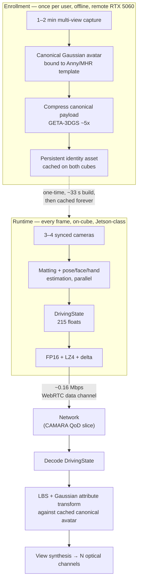
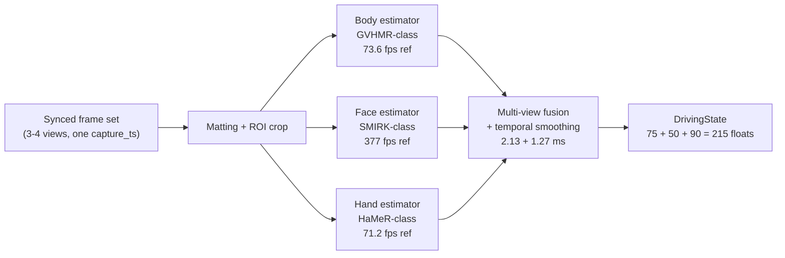
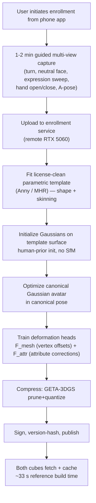
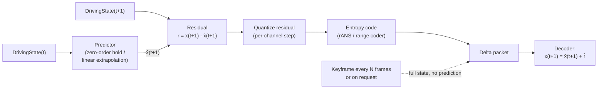
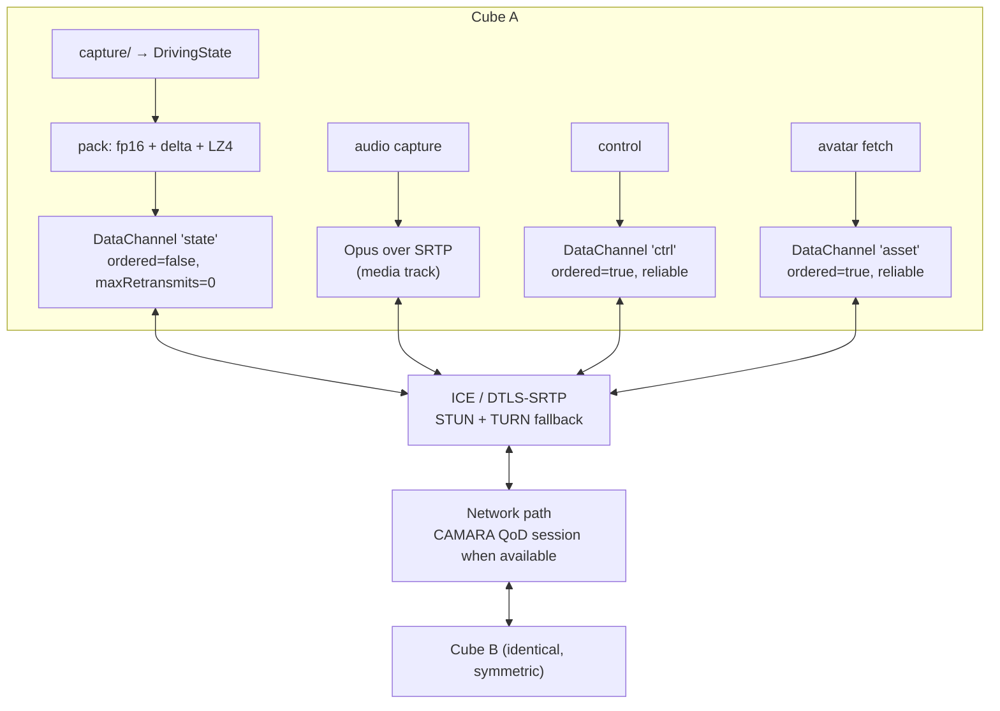
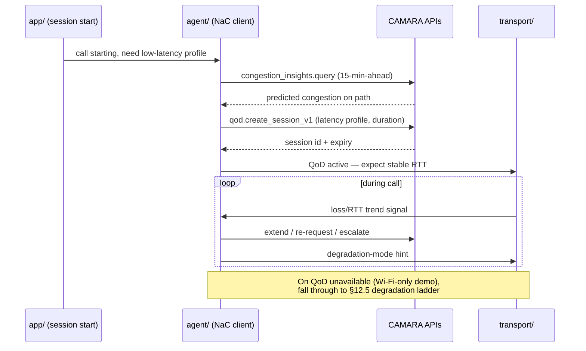
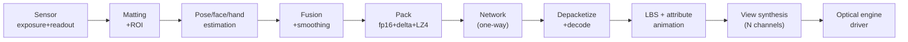
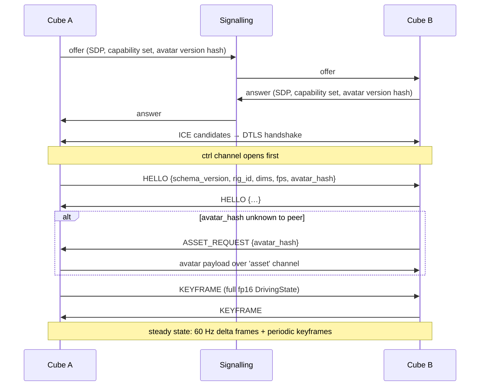

# 03 — Human Capture, Representation, and Transport

**The computational engine.** This document specifies how a TAYF cube turns a seated human into 215 floats per frame, ships them across a network for under 0.2 Mbps, and reconstructs a photometrically-plausible animated person at the far end.

Scope boundary: this document ends at the renderer's output — a fully animated canonical Gaussian avatar plus the set of angular views the optical engine can physically emit. Everything downstream of that (free-space emission, the actual photons) is `hardware/optical-engine.md`'s problem and is the genuinely unsolved half of TAYF. This half is not unsolved. It is engineering.

Companion documents: `docs/architecture.md` (canonical pipeline), `pipeline/schema.py` (the wire format, normative), `research/01-volumetric-capture-sota.md` (primary SOTA source), `research/deepseek_research.md` (annotated corpus, 128 deep-read papers), `research/LICENSING.md` (license register).

---

## 0. Status, thesis, and the one risk that matters

### 0.1 What is already proven

Every stage below has a published, measured reference implementation. The reference architecture is **Mon3tr** (HKUST, arXiv [2601.07518](https://arxiv.org/abs/2601.07518)), an end-to-end monocular 3D telepresence system measured on real consumer hardware:

| Mon3tr measured quantity | Value |
|---|---|
| Transmitted bitrate | **<0.2 Mbps** |
| End-to-end latency | **~80 ms** |
| Receiver render rate | **~60 fps** on Meta Quest 3; >124 fps on PC |
| Driving-parameter payload | body pose θ_b ∈ ℝ⁷⁵ + expression ψ ∈ ℝ⁵⁰ + hand pose θ_h ∈ ℝ⁹⁰ = **215 floats/frame** |
| One-time avatar build | **~33 s** (after 1–2 min enrollment capture) |
| Sender estimator rates | expression **377 fps**, body **73.6 fps**, hands **71.2 fps**, parallel pipeline synchronising to **58.2 fps** |
| Sender frame budget | 13.78 ms worker execution + 2.13 ms sync + 1.27 ms smoothing = **17.18 ms** |
| Quality | **>32 dB PSNR** novel-view, **>28 dB** novel-pose |
| Bandwidth advantage | **>1000×** vs point-cloud streaming |

TAYF's `pipeline/schema.py` is a direct instantiation of that 215-float packet. This is not aspiration; it is a re-implementation target.

### 0.2 The thesis: amortization, not compression

There are three architectures for moving a human across a network, and they differ by three orders of magnitude (`research/01-volumetric-capture-sota.md` §0):

| Architecture | What crosses the wire | Bitrate |
|---|---|---|
| (a) Stream the volume — point clouds / 4D Gaussians | Per-frame geometry + appearance | **20–300 Mbps** |
| (b) Reconstruct per-frame from sparse views, stream the result — Tele-Aloha class | Per-frame reconstructed representation | **~100 Mbps** |
| (c) **Pre-build the avatar offline, stream only driving parameters** | Pose/expression state | **Apple Personas 0.7 Mbps measured; Mon3tr <0.2 Mbps** |

Class (c) wins on every axis and is what every shipping product actually does. The reason is not a better codec — it is that **identity is not sent every frame**. A person's appearance is a persistent, slowly-varying quantity (hair, skin, garment, bone lengths) that changes on a timescale of hours. Their pose is a fast, low-dimensional quantity that changes at 60 Hz. Transmitting them at the same rate is the category error that makes volumetric telepresence expensive.

TAYF splits them:



The corollary that governs every decision below: **spend arbitrarily on the offline path, spend nothing on the online path.** A 33-second enrollment on a desktop GPU is free. A 3-millisecond regression in the per-frame loop is not.

### 0.3 The principal risk — state it before anything else

Mon3tr's numbers were measured with **an RTX 5090-class PC as the sender** and **a Snapdragon XR2-class Quest 3 as the receiver**. TAYF's deployed compute is a **Jetson Orin Nano-class module at 7–15 W** inside a sealed 1000 cm³ enclosure, doing *both* jobs simultaneously (`docs/architecture.md` "Module ownership"; `FilesPlan.md` §4.2).

**Nothing in this document has been benchmarked on that part.** The port is UNVALIDATED. Specifically at risk:

1. **Sender-side estimator throughput.** Mon3tr's 73.6 fps body-pose estimator is a desktop-GPU number. The Jetson has to run body + face + hands *and* the receive-side animation and render *and* the matting front end, concurrently, in a thermally-limited box.
2. **Thermal sustain.** `FilesPlan.md` §4.3 item 2: no thermal budget has been calculated for continuous inference in a sealed 10 cm enclosure. Peak fps and 30-minute-sustained fps are different numbers and only one of them matters.
3. **Memory.** Mon3tr reports 3.9 GB VRAM for its reconstruction path. An 8 GB unified-memory Jetson must hold the canonical avatar, three estimator networks, the matting network, and the render buffers in the same pool.

Mitigations are specified per-stage below, and the measurement plan is §14. Treat every fps figure in this document as *published elsewhere*, not *measured here*, unless explicitly stated otherwise.

---

## 1. Camera architecture

### 1.1 Count and placement

**3–4 cameras**, tiled across two adjacent cube faces (`hardware/camera-rig.md`).

The estimators in §3 are *monocular* — Mon3tr drives its whole system from a single sub-$20 webcam. So why more than one? Because a single fixed camera on a 10 cm cube sitting beside a chair loses the far side of the body to self-occlusion during ordinary conversational motion: turning to look at something, leaning, gesturing across the body. A monocular estimator does not fail gracefully under occlusion; it hallucinates a plausible-but-wrong limb configuration, and that error is *visible* at the far end because the receiver renders it confidently.

The multi-camera array is therefore not a stereo-reconstruction rig. It is **redundancy for the monocular estimators**: at every instant, at least one view has an unoccluded line to the face and to each hand, and the fusion layer (§3.5) selects or blends per-body-part rather than triangulating.

Working layout:

- **2 cameras on the front face**, baseline ~6–8 cm (the practical limit once the optical engine and edge SoC claim their volume inside a 10 cm box), angled slightly outward for wider combined coverage than a single wide-FOV lens gives at equal angular resolution.
- **1–2 cameras on an adjacent face** for oblique/profile coverage, which is what preserves face tracking through head turns.

Capture volume: a single seated adult, roughly **0.6 × 0.6 × 1.2 m** at **1.0–1.5 m** standoff, requiring **~40–50° effective horizontal FOV per lens** (`hardware/camera-rig.md`; working assumption, not measured — this is open item 1 in that document). Boundaries are user-set at session start from the phone app, so the working volume shrinks in software rather than requiring optical zoom.

### 1.2 Global shutter, non-negotiable

**Global shutter.** Candidate sensors: Sony **IMX296** (1/2.9", ~1.6 MP) or **IMX568** (1/1.8", ~5 MP) class, MIPI-CSI-2 (`FilesPlan.md` §4.2 — vendor pass unverified, no part is committed).

Rolling shutter fails here for three compounding reasons:

1. **Geometric skew under motion.** A rolling-shutter sensor samples the top and bottom of the frame tens of milliseconds apart. A hand moving at conversational speed (~1 m/s) is captured *bent*. The 2D keypoints the pose estimator regresses from that image do not correspond to any rigid body configuration, and the resulting joint angles jitter. This is exactly the "temporal flicker" failure mode `research/01-volumetric-capture-sota.md` §6.4 names as the thing nobody demos.
2. **Cross-camera inconsistency.** Two rolling-shutter cameras at different angles skew the *same* motion differently, so multi-view fusion (§3.5) is reconciling views that disagree about geometry, not just about occlusion.
3. **It cannot be corrected downstream cheaply.** Rolling-shutter compensation needs a per-row motion model, which needs the pose you are trying to estimate.

Tele-Aloha (arXiv [2405.14866](https://arxiv.org/abs/2405.14866)) used 4× FLIR BFS-U3-123S6C-C **global-shutter machine-vision cameras at 4096×3000/30 Hz** for precisely this reason, and `research/01-volumetric-capture-sota.md` §6.1 states the trap directly: *"Webcams have no sync pin, rolling shutter, and independent auto-exposure/auto-white-balance — three things that will actively fight you."*

Also mandatory, and frequently forgotten: **auto-exposure, auto-white-balance and auto-gain must be locked to a single master or disabled entirely.** Independent AE/AWB across the array means the same skin patch reports different RGB in different views, which poisons both matting and any appearance-based fusion.

### 1.3 MIPI-CSI-2, not USB3

| | MIPI-CSI-2 | USB3 UVC |
|---|---|---|
| Path to SoC | Direct to ISP/VI block | Through xHCI host controller, USB stack, then memory |
| Added latency | Sub-frame, deterministic | Buffering + protocol overhead, jitter under bus contention |
| Hardware trigger | Native `XTRIG`/`XVS` pin on sensor module | Vendor-dependent, usually absent on UVC devices |
| CPU cost | DMA into ISP, near-zero CPU | Per-packet interrupt handling, memcpy |
| Cameras per host | Multiple lanes on Jetson carrier | Shares one bus; 3–4 uncompressed streams saturate it |
| Physical | Ribbon, fits a 10 cm enclosure | Connector + cable bulk |

**Decision: MIPI-CSI-2.** The Jetson carrier board's CSI lanes feed the hardware ISP directly, so debayer, lens-shading correction and format conversion happen without touching the GPU or CPU. On a device where the total per-frame budget is ~17 ms, spending 3–5 ms in a USB stack to save integration effort is not a trade worth making. USB3 is acceptable *only* for the bench-development rig where a laptop stands in for the cube.

### 1.4 Hardware trigger sync, and why software timestamps are not enough

**All sensors share one trigger line**, driven from the edge SoC's PWM/GPIO or a small dedicated sync IC (`hardware/camera-rig.md` "Sync"; `firmware/README.md`). Exposure start is simultaneous to within the propagation delay of a PCB trace.

The argument against software timestamp matching is arithmetic. At 60 fps the inter-frame interval is 16.7 ms. Free-running sensors have independent oscillators with ±50–100 ppm tolerance and no phase relationship, so the *phase* between two cameras is uniformly distributed over that interval: the expected time offset between a "matched" pair is **~4 ms, worst case 8.3 ms**. During those 8.3 ms a hand moving at 1 m/s travels **8 mm** — larger than a fingertip. Multi-view fusion then attempts to reconcile two views of a hand that genuinely was in two different places, and either (a) rejects the disagreement and falls back to one view, wasting the array, or (b) averages it and produces a smeared hand.

Two further points:

- **Timestamp matching cannot fix drift, only report it.** Without a common clock the sensors' frame rates differ by tens of ppm, so the phase offset walks continuously and the fusion error is non-stationary. A pose estimator downstream of non-stationary geometric error produces *low-frequency wobble*, which is more perceptually offensive than high-frequency noise because the brain reads it as the person actually moving.
- **It burns latency you have already committed elsewhere.** Any software sync scheme needs a buffer of at least one frame per camera to find the match, adding ≥16.7 ms to a budget where Mon3tr's entire sender side is 17.18 ms.

`research/01-volumetric-capture-sota.md` §6.1 is unambiguous: the 25 fps GPS-Gaussian result assumes *calibrated, rigidly mounted, hardware-synchronized* cameras; removing calibration drops 2026's best sparse-view method (HiReFF) to **3.01 fps on an RTX 4090**. Orbbec's Femto Bolt exposes an 8-pin daisy-chain sync for the same reason. Consumer webcams are not a path.

**Firmware contract:** the trigger generator emits a strobe at the nominal frame rate; each sensor's frame-valid interrupt latches a monotonic counter shared with the host; the capture module tags every multi-view frame set with one `capture_ts` derived from the trigger edge, not from any individual sensor's arrival time. That single `capture_ts` is what propagates into `DrivingState.timestamp` and drives the entire latency accounting in §11.

### 1.5 RGB vs depth vs stereo

| Option | What it buys | What it costs | Verdict |
|---|---|---|---|
| **RGB only** | Cheapest, smallest, lowest power, no active illumination, no interference between two cubes in one room | Estimators must infer 3D from 2D | **Chosen** |
| **Stereo pair** | Metric depth in the overlap region, useful for scale disambiguation and matting priors | Baseline capped at ~6–8 cm by the enclosure ⇒ poor depth precision at 1.0–1.5 m; adds rectification and disparity compute | Available as a by-product of the 2 front cameras; used as a *prior*, not a primary channel |
| **Active depth (ToF / structured light)** | Direct metric geometry, robust matting | Power and thermal load in a sealed box; IR emitter competes for cube-face area with the optical engine; two cubes facing each other in the same room interfere; adds a second calibration problem | **Rejected for v1** |

The decisive evidence is that **Google Beam dropped the depth sensor**. The original Project Starline used dedicated depth; the shipping HP Dimension with Google Beam is **RGB-camera-only + AI** (`research/01-volumetric-capture-sota.md` §2.1). Apple's Personas do have TrueDepth and LiDAR available on Vision Pro but Apple does not publish which subset is used, and the enrollment runs on-device in under 10 seconds regardless.

More fundamentally: **the pipeline does not consume depth.** The estimators in §3 are monocular RGB regressors; the representation in §4 is a pre-built avatar; the wire format in §8 is 215 pose floats. Depth would only serve to improve pose estimates and matting, and both have adequate RGB-only solutions. Adding an active depth sensor buys marginal accuracy at the cost of the two scarcest resources in the cube — watts and cube-face area.

Stereo *is* used, opportunistically: the two front cameras with known extrinsics give a cheap disparity prior that disambiguates absolute scale (a genuine monocular failure mode — a small person close and a large person far produce identical images) and provides a depth-consistency gate for matting (§2.3). This is the same trick InViStream (arXiv [2608.11645](https://arxiv.org/abs/2608.11645)) uses for privacy masking: `|D(u,v) − μᵢ| ≤ τᵢ` as a depth-consistency test alongside a 2D box.

### 1.6 Calibration

Two calibrations, on different schedules.

**Intrinsics + extrinsics (factory / one-time).** The array is rigidly mounted in a machined enclosure, so extrinsics are fixed by construction and only need to be *measured* once, not maintained. Standard target-based calibration (checkerboard or ChArUco, ≥30 poses spanning the working volume) solving for per-camera pinhole intrinsics + radial/tangential distortion, then pairwise stereo extrinsics, then a global bundle adjustment over all 3–4 cameras. Store as a signed calibration blob in the cube's non-volatile storage keyed by serial number.

**Online validation (per session).** A rigid rig can still lose calibration — thermal expansion in a box running 15 W, or a drop. The cube runs a lightweight consistency check at session start: reproject a small set of detected 2D keypoints from one view into another using the stored extrinsics and check residuals. If the median reprojection error exceeds a threshold, the cube degrades to single-camera monocular mode (§12.5) and flags the unit for recalibration rather than silently producing wrong geometry.

**What is deliberately *not* required:** COLMAP/SfM at runtime, external tracking infrastructure, a calibration wall, or a special chair. `docs/architecture.md` "Environment independence" makes this a hard constraint. Note that the MPEG dynamic-splat test-material call (`research/01-volumetric-capture-sota.md` §3.1) makes COLMAP calibration *mandatory* for its format — one more reason TAYF does not use a per-frame splat format.

**Open:** the mapping from cube-local camera coordinates to the observer's frame — i.e. where the remote person should appear to be standing relative to the local viewer — is `docs/calibration.md`'s problem, not this document's.

---

## 2. Human segmentation and matting

### 2.1 Why matting is in the pipeline at all

The cube captures a living room, not a studio. Matting does three jobs:

1. **Focuses the estimators.** Pose/face/hand networks fed a cluttered scene waste capacity and occasionally lock onto a person in a photograph or a reflection.
2. **Bounds the capture volume.** The user-set capture box from the phone app is enforced here — anything outside is removed before any 3D reasoning (`pipeline/capture/README.md`).
3. **Privacy.** Nothing outside the subject's alpha ever reaches the estimators, let alone the network. This matters more in 3D than 2D: `research/01-volumetric-capture-sota.md` §6 — *"A matting error in 2D is a fringe; in 3D it becomes floating geometry that persists across viewpoints and flickers with motion."*

Note the architectural relief: because TAYF streams **pose parameters, not pixels**, a matting error cannot leak the room to the far end. The worst case is a corrupted pose estimate, not a transmitted image of someone's bedroom. This is a real, under-appreciated privacy property of class-(c) architectures.

### 2.2 Model selection

| Model | License | Measured speed | Verdict |
|---|---|---|---|
| **BiRefNet** | **MIT** | 17 fps @1024² FP16, 3.45 GB VRAM, RTX 4090; DIS5K S=0.911; `refine_foreground` accelerated 8× to ~80 ms on RTX 5090 | **Chosen.** Only MIT-licensed high-quality option |
| RobustVideoMatting | **GPL-3.0** | 172 fps HD / 154 fps 4K, RTX 3090 FP16; 134/108 on 2060 Super | Throughput champion, **license blocker** for closed source |
| MatAnyone / MatAnyone 2 | **NTU S-Lab 1.0, non-commercial** | **No fps published**; both need a first-frame mask | Current SOTA line, **excluded** |
| MODNet | **Apache-2.0** | "real-time up to 2K", 7 MB model, **no fps table** | Viable fallback; lower quality than BiRefNet |
| SAM 3 / SAM 3.1 | **Custom SAM License** | ~30 ms/image with >100 objects on H200; SAM 3.1 32 fps on one H100 | **Detection/tracking, not matting — produces no alpha.** Would have to be paired with a matting head |

(All figures from `research/01-volumetric-capture-sota.md` §4.1.)

**Decision: BiRefNet (MIT), with MODNet (Apache-2.0) as the fallback if BiRefNet does not fit the Jetson budget.**

The uncomfortable number: **17 fps @1024² on an RTX 4090.** That is nowhere near 60 fps, and the Jetson is far below a 4090. Three mitigations, in order of preference:

1. **Do not run matting at full resolution.** The estimators need a person-crop, not a 1024² alpha. Run BiRefNet at reduced resolution (512² or on a tracked ROI) for a coarse mask; the fine alpha matters for *rendering*, and TAYF never renders the captured pixels — it renders the pre-built avatar. **This is the key realisation: TAYF's matting quality requirement is far lower than a compositing pipeline's.** It needs a mask good enough to crop, not good enough to composite.
2. **Do not run matting every frame.** Run at 15 Hz and track the ROI between mask updates. Human silhouettes are temporally coherent at 60 Hz; the box does not move 30 px in 16.7 ms.
3. **Run matting only on the primary view.** The oblique views need only a bounding box, which a cheap detector supplies.

Combined, this puts matting well inside budget. It should still be the first thing benchmarked, because if BiRefNet at 512² on the Jetson lands below ~15 Hz, MODNet becomes mandatory.

### 2.3 Auxiliary gates

- **Depth consistency (stereo prior).** Reject mask pixels whose stereo disparity is inconsistent with the subject plane, per InViStream's `|D(u,v) − μᵢ| ≤ τᵢ` test (arXiv [2608.11645](https://arxiv.org/abs/2608.11645)). Kills the classic failure of a mask bleeding onto a chair-back or a wall poster behind the subject's shoulder.
- **Capture-box gate.** Hard geometric clip to the user-set volume. Cheapest and most reliable filter in the stack; runs before the network.
- **Bystander suppression.** InViStream's public/private disambiguation — project the reference-view public-instance centre through the calibrated extrinsic `T_{r→w}` into each other view and match to the nearest same-class detection; anything unmatched is masked as private. Measured: private-person detectability drops **100% → 6.3% (synthetic) / 14.3% (real)**; masking costs **17.4 ms with a MobileNet backbone at chunk size N=5, throughput 57.5 fps** (12.9 fps at N=1 — run detection once per chunk, not per frame). Dice/Recall 0.799/0.891 synthetic, 0.792/0.908 real, SSIM >0.98 on preserved public geometry.

For TAYF the bystander problem is *narrower* than InViStream's: the cube only needs to identify **which detected person is the enrolled user** and drive the avatar from that one. A second person in frame is not a privacy leak (nothing of them is transmitted) but is an identity-confusion hazard, and it is resolved by matching against the enrolled subject rather than by masking.

---

## 3. Body, face, hand, and finger estimation

### 3.1 The three-estimator split

Mon3tr runs three *parallel monocular* estimators and this is the structure TAYF adopts, because the three signals have completely different rate, dimensionality and perceptual-importance profiles:



Reference rates are Mon3tr's, measured on an RTX 5090-class sender. The pipeline synchronises to **58.2 fps** overall because the slowest branch (hands, 71.2 fps) gates it, plus 2.13 ms sync and 1.27 ms smoothing.

**Design consequence:** the branches are independently rate-controllable. Face at 377 fps has ~5× headroom over 60 Hz, and §7 says face expressiveness is the single most perceptually valuable channel — so under thermal or compute pressure, **degrade body rate before face rate**, and interpolate body pose between estimates rather than dropping expression frames.

### 3.2 Body pose — 75 dimensions

| Candidate | Rate | Hardware | License | Notes |
|---|---|---|---|---|
| **GVHMR-class** (Mon3tr's choice) | **73.6 fps** | RTX 5090-class | **UNVERIFIED** — not established in this repo's corpus | The reference. Assume SMPL-family output requiring retarget |
| **Multi-HMR** (NAVER, ECCV'24) | ViT-S **29 ms (~34 fps)** / ViT-B 43 ms / ViT-L 74 ms @672² | V100-32GB | **Custom NAVER license** | Same lab as Anny; whole-body incl. hands in one pass |
| **SAM 3D Body** (CVPR 2026, arXiv [2602.15989](https://arxiv.org/abs/2602.15989)) | **No fps published** | — | **Custom SAM License** | Introduces **MHR**, decoupling skeleton from surface shape — a Meta-authored SMPL-X replacement free of Max Planck's non-commercial terms. 3DPW 54.8 MPJPE, EMDB 61.7, RICH 60.3 PVE. Promptable with 2D keypoints and masks |
| Fast SAM 3D Body (arXiv [2603.15603](https://arxiv.org/abs/2603.15603)) | **up to 10.9× e2e speedup**; SMPL conversion >10,000× | **No absolute fps, GPU, or code availability stated** | — | The speedup is the interesting part; the absence of absolutes is disqualifying until verified |
| SMPLest-X (TPAMI'25) | **8.36 fps** (third-party measurement) | 8.2 GB checkpoint | MIT code | Too slow, too large |
| NLF (NeurIPS'24) | **No fps published** | — | **MIT code, NON-COMMERCIAL weights** | Classic license trap — flagged, do not use |
| HMR2.0 / 4D-Humans | **No fps published** | 8×A100 training | MIT + **SMPL non-commercial** | Excluded on dependency |
| MediaPipe Pose Landmarker | **Per-device latency removed from current Google docs** | CPU/GPU/mobile | Apache-2.0 | Clean license, no published numbers; viable degraded-mode fallback |

**Recommendation: build against the Anny (Apache-2.0) or MHR rig, and treat the estimator as swappable.** The estimator produces joint rotations; the rig defines what those rotations mean. Committing to a rig is the blocking decision (`FilesPlan.md` §6 item 6); committing to a specific estimator is not, provided the capture module emits rig-space parameters through one adapter.

The 75 dimensions decompose as SMPL-family joint rotations (24 joints × 3 axis-angle = 72, plus 3 global orientation, or 25 joints × 3 — Mon3tr does not disambiguate in the text available). **This is a normative detail that must be pinned down against the chosen rig before `pipeline/capture` writes into `DrivingState.body_pose`,** because sender and receiver must agree on the joint ordering and the rotation convention (axis-angle vs 6D continuous). Recommendation: **6D continuous rotation representation internally, axis-angle on the wire** — 6D avoids the gimbal/antipodal discontinuities that make naive delta-encoding of quaternions blow up (§8.4), but axis-angle is 3 floats per joint and matches the 75-dim budget.

### 3.3 Facial expression — 50 dimensions

**SMIRK-class** estimator, Mon3tr's choice, measured at **377 fps** — the fastest branch by 5×, which is fortunate because §7 shows it is the branch that matters most.

50 dimensions is a blendshape/expression coefficient vector, FLAME-compatible in Mon3tr's formulation (Mon3tr's SPMM3 template fuses a scanned body mesh with **FLAME** face and **MANO** hand components via rigid alignment, `M_SPMM3 = 𝒰(M_body^masked, 𝒜_f(M_face), 𝒜_h(M_hand))`, with skinning weights transferred from SMPL-X).

**⚠ License trap, flagged loudly:** Mon3tr's template is built on **SMPL-X, FLAME and MANO** — all Max Planck models. `research/LICENSING.md` excludes SMPL/SMPL-X as non-commercial and notes the SMPL license *also bans training networks for commercial use*, tainting anything fine-tuned on it. FLAME and MANO are from the same institution and licensing family. **Their exact terms are UNVERIFIED in this repo and must be checked before any code is written against them.** SMIRK's and HaMeR's own licenses are likewise **UNVERIFIED here** — neither appears in `research/LICENSING.md`, and both are near-certain to carry a FLAME/MANO dependency respectively.

The escape is the same as for the body: **use the license-clean rig's expression basis (Anny or MHR) and retarget.** The 50-dimensional channel is a contract about *width*, not about *whose blendshapes*. If the chosen rig's expression basis is a different dimensionality, `pipeline/schema.py` must be revised deliberately (and both cubes' firmware bumped in lockstep) rather than silently reinterpreted.

**Audio-driven fallback.** Meta's *Audio Driven Real-Time Facial Animation* (SIGGRAPH Asia 2025, arXiv [2510.01176](https://arxiv.org/abs/2510.01176)) achieves **<15 ms GPU time** with a single-step distilled diffusion model, **100–1000× faster** than offline baselines, and is explicitly Meta's path around trackerless Quest 3 hardware. For TAYF this is the **degraded mode when the face is occluded or out of frame** — the audio stream is already present, and driving expression from the microphone is strictly better than freezing the face. Wire it as a fallback source for the same 50 dimensions, selected by a per-frame confidence gate, not as a separate path.

### 3.4 Hands and fingers — 90 dimensions

**HaMeR-class**, Mon3tr's choice, **71.2 fps** — the rate-limiting branch.

45 dimensions per hand, both hands, MANO-style (`pipeline/schema.py`). Hands are where this gets hard, and the honest framing from `research/01-volumetric-capture-sota.md` §6.2: *"Hands and faces are where photorealism dies, and they're the whole point... A 4-camera rig will produce a smeared mouth interior, fused fingers, and hair that reads as a helmet."*

But that sentence is about **per-frame volumetric reconstruction**, and TAYF does not do per-frame reconstruction. In a class-(c) architecture the fingers' *geometry* comes from the enrolled canonical avatar, which was built offline from a good multi-view capture; only the finger *articulation* is estimated live. This converts an ill-posed reconstruction problem into a well-posed 45-DoF regression problem. Fingers still fuse when the estimator is wrong, but they fuse into correctly-shaped fingers.

| Candidate | Rate | License |
|---|---|---|
| **HaMeR-class** (Mon3tr) | **71.2 fps** on RTX 5090-class | **UNVERIFIED** — presumed MANO dependency |
| **WiLoR** | **>130 fps (medium), 175 fps (small)**, CUDA 11.7 | **CC-BY-NC-ND + AGPL + MANO — triple encumbrance.** Fastest option, completely unshippable |
| Multi-HMR | 29–74 ms whole-body incl. hands | Custom NAVER |
| MediaPipe Hand Landmarker | per-device latency removed from docs | Apache-2.0 |

WiLoR is the cautionary example: the best hand numbers in the corpus carry three mutually incompatible non-commercial obligations.

**Practical mitigation for the hand branch being the bottleneck:** hands leave frame often and are frequently occluded by the body. Run the hand estimator **only on ROIs where a hand is detected**, and gate the two hands independently. In ordinary seated conversation both hands are fully visible a minority of the time; a per-hand ROI-gated estimator has a much lower *average* cost than 71.2 fps implies, even if worst-case cost is unchanged. Worst-case is what determines whether frames drop, so this is a mean-power optimisation, not a latency one.

### 3.5 Multi-view fusion

Mon3tr is monocular; TAYF has 3–4 views. The fusion layer is TAYF-specific and has no published reference — **this is original work and must be treated as such.**

Specification:

1. Each estimator runs on the **best view per body part**, chosen by a per-part visibility score (detected-keypoint confidence × in-frame fraction × distance from image border).
2. When two views both see a part with high confidence, blend in **parameter space**, not image space — weighted average of joint rotations via quaternion SLERP / rotation-matrix Procrustes averaging, weighted by confidence. Do not triangulate: the estimators already output 3D, and the 6–8 cm baseline is too short for useful triangulation at 1.0–1.5 m.
3. **Hysteresis on view selection.** Switching primary view mid-motion introduces a step discontinuity in the pose stream, which the delta encoder in §8.4 will faithfully transmit and the receiver will faithfully render as a twitch. Require a confidence margin and a minimum dwell time before switching.
4. **Temporal smoothing after fusion, not before.** Mon3tr budgets **1.27 ms** for smoothing. A one-euro filter or small Kalman per joint group, tuned per-channel: heavier smoothing on the body (slow, and jitter is very visible), lighter on the face (fast, and §7 says amplitude matters more than precision).

Fusion adds latency: it must wait for the slowest branch. Budget it at Mon3tr's **2.13 ms sync**, and note that on a Jetson with three estimators contending for one GPU the "parallel" branches may serialise, which is precisely what §14's first benchmark must measure.

---

## 4. Persistent avatar construction

### 4.1 The identity/state split, formally

| | Persistent identity | Dynamic state |
|---|---|---|
| **Content** | Canonical Gaussian set: positions μ, scales s, rotations q, opacity α, SH colour c; skinning weights; rig shape parameters; deformation-network weights | 215 floats: body pose, expression, hand pose |
| **Size** | Megabytes (post-compression) | **430 bytes** (FP16) |
| **Update rate** | Once per enrollment; effectively never during a call | **60 Hz** |
| **Where computed** | Offline, remote RTX 5060 | On-cube, Jetson-class |
| **Where stored** | Cached on both cubes, keyed by identity + version hash | Transient |
| **Transport** | Reliable, ordered, out-of-band, once | Unreliable, unordered, in-band, continuously |

The entire bandwidth argument reduces to this table. arXiv [2510.10492](https://arxiv.org/abs/2510.10492) (CityU HK / Alibaba DAMO) makes the same split explicit and measures it: a canonical 3DGS avatar trained in a star pose and compressed once, plus **94 scalars per frame** (SMPL 72 pose + 10 shape + 3×3 global rotation + 1×3 translation) arithmetic-coded with CABAC — landing at **under 0.2 Mbps on ZJU-MoCap and under 0.26 Mbps on MonoCap at 25 fps**, versus **over 1 Mbps** for G-PCC / GeS-TM / HEVC / VVC / CompactSTG anchors at matched quality.

TAYF's 215 floats is a superset of that paper's 94 — it adds the facial expression and hand channels that 2510.10492 explicitly lacks ("there's no facial-expression or hand-pose channel in the 94-parameter stream"). That is the correct trade: those are the two channels §7 says carry the conversation.

### 4.2 Enrollment flow



**Capture protocol.** Mon3tr's enrollment is 1–2 minutes of video from a 32× 12 MP offline rig, reconstructing in ~33 s. TAYF cannot assume a 32-camera rig for enrollment. Two viable paths:

- **Phone-based.** The user walks their phone around themselves. Meta's **LCA** (CVPR 2026, arXiv [2604.02320](https://arxiv.org/abs/2604.02320)) demonstrates full-body avatars with **finger-level articulation from unconstrained phone capture**, pretrained on 1M in-the-wild videos, with emergent relightability and loose-garment support. It "collapses the 'you need a 100-camera dome' requirement." **Meta publishes no inference numbers and no release** — so this is a direction, not a dependency.
- **Cube-based.** The cube's own 3–4 cameras record a guided 1–2 min sequence, uploaded to the enrollment service. Lower quality than a phone orbit (fixed viewpoints, limited baseline), but zero extra hardware and it is the only path that works if the user has no phone at hand. **Recommended for v1** because it keeps the whole product self-contained.

**Enrollment friction is a product feature, not an engineering detail.** `research/01-volumetric-capture-sota.md` §6: Mon3tr 1–2 min + 33 s; Apple **~10 s on-device**; Meta **~1 hour of server GPU**. *"The one you can ship is the one with the shortest enrollment."* Budget: **≤2 min of user time, ≤2 min of wall-clock wait.** If the build takes longer, do it asynchronously and let the first call use a lower-fidelity provisional avatar.

### 4.3 Representation choice: Gaussians, and why not the alternatives

| Representation | Verdict |
|---|---|
| **3D Gaussian splats** | **Chosen.** *"Gaussian splatting won the representation war"* — confirmed in Apple Personas (Apple's Scott Norris on record), Meta Codec Avatars, Evercoast, Canon's CES 2026 prototype, ~100% of 2026 academic work (`research/01-volumetric-capture-sota.md` §0.3). Rasterizes fast, deforms under LBS analytically (§5), compresses well (§4.4), and — critically for §6 — renders cheaply from many viewpoints |
| Textured mesh | Cheapest to render and hardware-friendly, but cannot represent hair, fabric edges, or soft occlusion boundaries without heavy per-vertex density. The `research/01-volumetric-capture-sota.md` verdict on mobile mesh avatars: Apple's Spatial Persona is 78,030 triangles at 0.5 m, dropping to 21,036 with viewport adaptation for −39% GPU time — workable, but a quality ceiling |
| NeRF / implicit fields | Requires network evaluation per ray per frame. HUGS (arXiv [2311.17910](https://arxiv.org/abs/2311.17910)) reports Gaussian rendering **3800–7600× faster** than NeRF/implicit baselines on the same task. Disqualified on compute |
| Per-frame volumetric (point cloud / 4D GS) | 20–300 Mbps. Disqualified on bandwidth, and there is **no real-time 4DGS encoder in the literature** — 4D-MoDe needs 0.68 min/frame, 4DGCPro 4.3 min/frame of *offline* optimization (`research/01-volumetric-capture-sota.md` §3.2) |

**The single most important architectural detail, from HUGS:** after optimization, the triplane and MLPs *never need to be evaluated again at animation time*. The Gaussians and their learned LBS weights are extracted explicitly, so new poses are rendered by **direct LBS deformation of pre-baked Gaussian attributes, avoiding any neural inference in the render loop.** HUGS trains in ~30 min on an RTX 3090Ti (96× faster than Vid2Avatar, 336× faster than NeuMan) and renders at **60 fps**.

That is exactly the computational shape the Jetson needs: **bake the network offline, animate with arithmetic online.** Any enrollment design that leaves a neural network in the per-frame path should be rejected on those grounds alone. Mon3tr's `F_mesh`/`F_attr` deformation networks are the counter-example and must be either distilled to a linear basis (§5.4) or budgeted explicitly.

### 4.4 Canonical avatar compression

The canonical avatar is a one-time transfer, but it must (a) fit in the Jetson's shared memory alongside everything else and (b) download fast enough that the first call is not gated on it.

**GETA-3DGS** (arXiv [2605.02086](https://arxiv.org/abs/2605.02086)) — joint structured pruning and quantization, **~5× storage reduction over vanilla 3DGS, fully automatic** (no per-scene opacity/scale/SH-degree tuning). Mechanism: each Gaussian is a group node in a quantization-aware dependency graph with five heterogeneous attribute sub-nodes (position μ∈ℝ³, log-scale s∈ℝ³, rotation quaternion q∈ℝ⁴, opacity logit α, degree-aware SH coefficients c∈ℝ^{(ℓ+1)²×3} — 48 scalars at ℓ=3). Pruning uses a **render-aware saliency** fusing α-blending transmittance-weighted contribution, screen-space gradient magnitude, and pixel coverage — explicitly replacing parameter-space Taylor saliency, which the authors show is a poor signal for 3DGS because occluded/sub-pixel Gaussians carry non-trivial gradients despite negligible visual contribution.

**The finding that matters for TAYF's bit allocation:** the *heterogeneous bit-width policy* is the dominant rate-distortion lever, not the saliency choice or schedule. Forcing a uniform 6-bit cap costs **up to −6.74 dB on view-dependent scenes** versus only **−0.18 to −0.34 dB on texture-uniform scenes**, and the predicted per-attribute bit ordering from an information-theoretic reverse-water-filling model matches empirically converged bit-widths **within ±1 bit**.

Translated to a human avatar: **face and skin are the view-dependent, SH-heavy content that needs bits; clothing and hair bulk are texture-uniform and quantize aggressively.** This is the same conclusion §7 reaches from psychophysics, arrived at from rate-distortion theory. Two independent arguments for the same allocation is the strongest kind of evidence available here.

GETA-3DGS is **complementary to entropy coders** like HAC++/CompGS which operate downstream on already-quantized symbols, so they compose. For reference points on what static 3DGS compression achieves (`research/01-volumetric-capture-sota.md` §3.2, 3DGS-30k baseline = 734 MB on Mip-NeRF360): c3dgs **28.8 MB, 26–31×, up to 4× render fps, MIT**; HAC-lowrate 15.3 MB (48×); ContextGS-lowrate 12.7 MB (58×); most aggressive configs 83–113×.

**c3dgs is worth special note: MIT-licensed, 31× compression, and it makes rendering up to 4× *faster*.** Compression that speeds up the render loop is exactly what a thermally-limited cube wants.

**Transport format for the canonical payload:** **SOG** (`.sog`) is the de-facto choice — maps Gaussian attributes into 2D images sorted by spatial locality (PLAS sort), WebP-compressed; **~15–20× smaller than PLY**, 2–3× better than "compressed PLY"; real scenes 1 GB → 42–55 MB. Morton-ordered, GPU-ready, **no load-time processing** (which matters for cold-start). ⚠️ Tooling caveat: `playcanvas/sogs` is **archived** — use `playcanvas/splat-transform`. **SOG spec license is not stated** (`research/01-volumetric-capture-sota.md` §3.2) — verify before shipping.

---

## 5. Dynamic deformation and temporal representation

### 5.1 The core transform

The receiving cube holds a canonical Gaussian set. Each Gaussian *i* has canonical position **p**_c ∈ ℝ³ and canonical covariance Σ_c ∈ ℝ^{3×3}, where by the standard 3DGS parameterization

$$\Sigma_c = R_c S_c S_c^\top R_c^\top$$

with R_c the rotation from the unit quaternion q and S_c = diag(s) the per-axis scale. Storing (q, s) rather than Σ directly is what guarantees positive-semi-definiteness.

Given a decoded `DrivingState`, linear blend skinning produces a per-Gaussian affine transform by blending per-joint transforms with skinning weights ω_k (arXiv [2510.10492](https://arxiv.org/abs/2510.10492)):

$$\mathbf{A}(\hat J_t, \hat\theta_t) = \sum_k \omega_k \mathbf{A}_k, \qquad \mathbf{b} = \sum_k \omega_k \mathbf{b}_k$$

Position transforms as expected:

$$\hat p_t = \mathbf{A}\,p_c + \mathbf{b}$$

**And the covariance transforms as:**

$$\boxed{\;\Sigma_t = \mathbf{A}\,\Sigma_c\,\mathbf{A}^\top\;}$$

This is the step people skip, and skipping it is why naive avatar animation looks wrong. Translating a Gaussian without rotating its covariance means an anisotropic splat lying along a forearm keeps pointing in its canonical direction when the forearm rotates — the splat "slides" across the surface it is supposed to represent. `Σ_t = A Σ_c Aᵀ` rotates the Gaussian's *shape* along with its LBS-driven joint rotation, which is what lets clothing- and skin-shaped Gaussians rotate correctly rather than merely translate.

### 5.2 Keeping it a valid Gaussian

`A Σ_c Aᵀ` is a valid covariance for any A, but the renderer wants (q, s) not a raw 3×3. Substituting Σ_c:

$$\Sigma_t = (\mathbf{A} R_c S_c)(\mathbf{A} R_c S_c)^\top$$

so define M = A R_c S_c and recover the pair by **polar decomposition** M = R_t U with R_t orthogonal and U symmetric positive-semi-definite; then q_t = quat(R_t) and s_t = diag-ish(U). When A is a rigid transform (pure rotation + translation, the common case in LBS), this collapses to the free and exact:

$$q_t = q_{\mathbf{A}} \otimes q_c, \qquad s_t = s_c$$

i.e. quaternion multiplication and no scale change. **Implement the rigid fast path and fall back to polar decomposition only when the blended A has non-negligible shear** — LBS blending of two rotations does produce non-rigid A (this is the classic candy-wrapper artifact), but the shear magnitude is small away from joint centres. Gate on `‖AᵀA − I‖_F` against a threshold. This is a meaningful per-frame saving across ~10⁵ Gaussians on an embedded GPU.

### 5.3 Non-rigid corrections

Pure LBS gives a correct skeleton and a mannequin's skin. Three layers of correction, in increasing cost:

**(a) Pose-dependent vertex offsets — Mon3tr's `F_mesh`.** A lightweight network predicts non-rigid vertex offsets on the template, which are then posed via LBS. Handles muscle bulge, joint creasing, garment wrinkle.

**(b) Gaussian attribute corrections — Mon3tr's `F_attr`, the "tension field".** ~**500 local controllers** are sampled on the canonical mesh; each maps pose to a displacement potential. A **virtual-mass-weighted** sum (weights = geodesic distance × skinning-weight similarity) over the **K=3 nearest** controllers gives each Gaussian a "dragging force", which is projected onto a **fixed set of linear deformation bases**. The linear-basis projection is the important part: it means per-frame cost is a small matrix multiply, not a network evaluation per Gaussian.

**(c) Temporal/history-dependent deformation** — for loose clothing whose state depends on recent motion, not just current pose. RealityAvatar (arXiv [2504.01559](https://arxiv.org/abs/2504.01559)) demonstrates this with an LSTM over an encoded pose *sequence*: 35k canonical Gaussians on the template surface, a "latentbone encoder" splitting pose into four regional groups (left arm, right arm, legs, torso) each concatenated with a learned clothes latent code 𝒵_c, feeding an LSTM whose final hidden state plus canonical position predicts Δx, Δs, Δq via a 3-layer MLP:

$$x_e = x_c + \Delta x,\qquad R_e = \Delta R \cdot R_c,\qquad s_e = s_c \cdot \exp(\Delta s)$$

Measured on I3D-Human: PSNR **31.87**/SSIM 0.9752 novel-view, **30.10**/0.9689 novel-pose, in **~0.6 h** training — beating 3DGS-Avatar (30.62/29.21) and matching the specialized Dyco baseline (31.22/30.12) at **~20× less training time**. The ablation is the useful part: removing the LSTM costs **PSNR 31.87 → 30.88**, the largest single drop — the *temporal* module, not the part-segmentation, is the dominant contributor.

**TAYF's position:** implement (a) and (b); treat (c) as optional. The LSTM's sequential dependency adds per-frame state tracking and a small latency cost to the animation loop, and TAYF's subject is *seated* — the loose-garment dynamics RealityAvatar targets (a dress swinging after a spin) are largely absent. Revisit if garment behaviour reads as wrong in testing.

### 5.4 The blendshape distillation — the key embedded-deployment trick

The single most important technique for making this run on a Jetson comes from **AGORA-M** (arXiv [2512.06438](https://arxiv.org/abs/2512.06438)):

1. Extract **N = 10,000** sampled posed-minus-neutral Gaussian-attribute residuals.
2. Compute their **SVD**.
3. Keep the top **K = 64** singular vectors as shared **"Gaussian blendshapes."**
4. Train a **tiny two-layer MLP** to regress the 64 blendshape coefficients from (w, ψ, θ).

Per-frame animation then reduces to **one neutral Gaussian set plus a linear combination of 64 bases.** Measured: AGORA-M sustains near-identical quality to the full model (**FID 3.36 vs 3.17**) while running at **560 fps on an RTX A6000 and 60 fps on a mobile phone via a WebGL 3DGS renderer.**

Mon3tr's tension field is the same idea derived from a physical analogy rather than PCA — both end at "project deformation onto a small fixed linear basis." **This is the mechanism by which the receive-side animation cost becomes independent of avatar complexity**, and it is what should be built rather than a full deformation network. Caveats on AGORA specifically: it is **head/face-only (FLAME-driven)**, single-identity-per-generator-sample rather than photoreal personalization from few-shot capture, and it does not address body or hands. The *distillation technique* generalizes; the *model* does not.

### 5.5 Temporal coherence is the failure mode nobody demos

`research/01-volumetric-capture-sota.md` §6.4, verbatim: *"Per-frame feed-forward reconstruction has no temporal consistency term. Still frames look great; motion boils."* MPEG's dynamic-splat test-material call demands **constant point count and ordering across frames** for exactly this reason.

**TAYF is structurally immune to this specific failure**, and this deserves stating plainly because it is a genuine architectural advantage rather than a mitigation: the canonical Gaussian set is *fixed* — same count, same ordering, same appearance — for the entire call. Only the 215-float driving vector changes. There is no per-frame reconstruction to boil. Whatever temporal artifacts TAYF has come from *pose-estimation jitter*, which is a 215-dimensional smoothing problem (Mon3tr: 1.27 ms), not a 10⁵-Gaussian correspondence problem.

HiFi4G (arXiv [2312.03461](https://arxiv.org/abs/2312.03461)) is instructive as the contrast: to get temporally coherent 4D Gaussians it needs 81 Z-CAM cameras at 3840×2160/30 fps, a dual-graph ED-node + Gaussian-KNN tracking structure, a temporal-consistency loss, an as-rigid-as-possible smoothness term with motion-adaptive weight `w_{i,t} = exp(−α‖p'_{i,t} − p'_{i,t−1}‖²)`, α = 50 — and **under 7 minutes per frame on an RTX 3090**, reaching 36.2 dB / <2 MB per frame after ~25× compression. That is what temporal coherence costs if you insist on reconstructing every frame. TAYF gets it for free by not reconstructing.

---

## 6. Neural view synthesis — sparse physical views to many apparent views

### 6.1 The problem statement

The optical engine can emit N physical angular channels, where N is engine-specific and small. The avatar is a full 3D representation. This module maps one to the other: render exactly the angular/spatial optical information the engine can physically emit — not more (wasted compute), not less (visible gaps) — and neurally interpolate any angular gap the engine cannot address but the observer's position makes relevant (`pipeline/view_synthesis/README.md`).

**The open research question — what is the minimum number of physical optical channels when neural rendering fills the gaps — is not answered and this document does not pretend otherwise.** `experiments/angular-resolution/README.md` owns it. What *is* answered is the rendering-throughput question, and it is answered three independent times.

### 6.2 Real-time many-view rendering is solved

| Result | Measured | Hardware |
|---|---|---|
| **CoherentRaster** (arXiv [2605.04509](https://arxiv.org/abs/2605.04509)) | **87.7 fps @2K** with view-batch \|V_k\|=8, PSNR **51.94 dB** / SSIM 0.9989 vs per-view 3DGS pseudo-GT — a **~15× speedup** over the 5.8 fps per-view 3DGS baseline. At 4K, \|V_k\|=8 → **55.6 fps at 52.19 dB** | Consumer GPU |
| **LFDPR** (arXiv [2601.19901](https://arxiv.org/abs/2601.19901)) | **up to 8× faster than standard multiview rendering** at comparable/better quality (RMSE, HDR-VDP3 P-det/Q/Q-JOD, SSIM vs a 96-view/32×-supersampled reference); 3–5× faster under 2× spatial/angular supersampling; per-view buffer **2.63 MB → 1.32 MB**. Rendering **48–96 views at 480×360** | **RTX 3070**, validated on a **physical** tilted-lens light-field prototype: 3840×2160, 345×194 mm, 0.09 mm pitch, ~479 lenses across the screen width |
| **G2LF / V2LF** (arXiv [2508.18540](https://arxiv.org/abs/2508.18540)) | **228 fps for 45-view 512×910 quilts** (bicycle scene); **>60 fps for 90+ views**; up to **22× speedup** vs independent per-view rendering; OpenGL implementation 3.6× faster than a Python/CUDA baseline | **Single RTX 5090**, on an **actual commercial light-field display** (Leia / Sony / Looking Glass device class) |

Mechanisms differ but converge: CoherentRaster does subpixel-level rasterization with **view reuse** (eliminating redundant computation across neighbouring viewpoints) and **view remapping** (recovering GPU warp-level memory efficiency lost to the panel's spatially-interlaced subpixel layout). LFDPR uses texture-based splatting plus **LFD-biased sampling** matching triangle density to the display's native sampling grid, with multiview mipmapping and angular/spatial supersampling against crosstalk. G2LF/V2LF does a **single-pass plane-sweep over multiplane images** so nearby quilt views share cached intermediate plane renders.

All three exploit the same structural fact: **adjacent light-field views are massively redundant**, and the correct move is to amortize across views rather than render each independently. Any TAYF view-synthesis implementation that renders N views with N independent rasterizer passes is leaving 8–22× on the table.

Caveats, stated: all three are tested on **static or rotating synthetic scenes** (sponza, gallery, coconut, car, bicycle, standard NeRF benchmarks), **not a live human avatar**. All three run on desktop/prosumer GPUs, **not a Jetson**. None reduces the *number* of views the panel needs — they render the panel's native view count faster.

### 6.3 The working end-to-end reference

**arXiv [2506.08064](https://arxiv.org/abs/2506.08064) — "A Real-time 3D Desktop Display"** (ICTP Trieste, altiro3D). This is an already-working, open-source, complete pipeline doing this module's job, and it explicitly names video conferencing as a target use case:

```
USB webcam → MiDaS monocular depth (ONNX via OpenCV DNN) → view synthesis
("FAST" or "REAL"/geometric) → OpenCV/Telea inpainting for disocclusions
→ quilt assembly → precomputed pixel-and-device-specific LUT remap to
"Native" format → Looking Glass Portrait
```

Measured on a laptop (Intel i9-10885H, GTX 1650 Ti Mobile): **10 Hz (~100 ms/frame)** with CPU-only MiDaS-small. Two findings worth more than the headline number:

1. **The naive CUDA backend was *slower* than CPU** (~160 ms/frame vs ~100 ms), and only CUDA-FP16 matched CPU speed. A real, measured GPU-acceleration pitfall for exactly this class of pipeline.
2. **Profiling (gprofng) shows MiDaS depth inference dominates at >50% inclusive runtime** — the bottleneck is the depth CNN, *not* view synthesis or LUT remapping.

**Fork this rather than designing from scratch** (`pipeline/view_synthesis/README.md` open item 1). And note the second finding is a free win for TAYF: **TAYF has no monocular-depth stage.** It has a fully-explicit 3D Gaussian avatar. The >50% of runtime that dominates altiro3D's pipeline simply does not exist in TAYF's — the depth is known exactly. Removing the bottleneck stage from a 10 Hz pipeline is the difference between a demo and a product.

### 6.4 What this module actually does in TAYF

1. Render the animated canonical avatar from the N view directions matching the optical engine's physical output channels, using a **view-amortized** rasterizer (CoherentRaster/G2LF-class batching, not N independent passes).
2. For angular gaps the engine cannot address but observer tracking (`docs/calibration.md`) says matter, interpolate **in angle-space between the nearest physical views** rather than doing an additional full 3D render pass. Angle-space interpolation is cheap relative to §5's animation cost; a full extra render is not.
3. Apply §7's perceptual allocation here too: interpolation quality budget goes to face, eyes, and hands first.
4. Precompute the panel's quilt→native LUT once at boot (altiro3D's approach) — never per frame.

---

## 7. Perceptual compression and bit allocation

### 7.1 The allocation principle

The information a conversation carries is in micro-expressions, gaze, and finger articulation — *"exactly the regions with the fewest pixels and fastest motion"* (`research/01-volumetric-capture-sota.md` §6.2). Uniform allocation of a representation budget across a human body is therefore wrong by a large factor. Three independent lines of evidence say the same thing.

### 7.2 Expressiveness beats timing — the strongest single result

**arXiv [2503.20308](https://arxiv.org/abs/2503.20308)**, "Perceptually Accurate 3D Talking Head Generation." Forced-choice A/B human study between:

- **(A)** precise temporal sync, flat/inexpressive lip motion
- **(B)** expressive, speech-intensity-matched lip motion, with **100 ms audio-lip asynchrony** — *double* the classical ~50 ms acceptable threshold

**82.6% of participants preferred (B).** A second study confirmed participants prefer lip-movement intensity that *matches speech intensity* (loud speech → bigger mouth movements) over intensity-mismatched-but-technically-correct lip shapes.

The paper also carries a clean audiovisual-sync JND figure (cited from Vatakis et al. 2006, so a secondary citation, not this paper's own measurement): mismatch becomes noticeable when **speech leads lip movement by more than 50 ms**, or **lags it by more than 220 ms**.

**Consequences for TAYF, directly:**

- Mon3tr's ~80 ms end-to-end sits **well under the 220 ms lag JND** and only modestly above the 50 ms lead JND. There is real slack in the latency budget — more than the raw ITU-T G.114 150 ms figure suggests.
- **If a trade must be made, preserve motion amplitude over timing precision.** Do not smooth the expression channel so hard that expressions flatten; a slightly late but full-amplitude smile beats an on-time flat one by 82.6% to 17.4%.
- Concretely: temporal filtering on `face_expression` should be **light**, and any adaptive-degradation policy (§12.5) must never respond to congestion by attenuating expression amplitude.

### 7.3 What distortion axes actually hurt

**arXiv [2510.03874](https://arxiv.org/abs/2510.03874)** — DHQA-4D, a subjective MOS dataset over 32 real-scanned dynamic clothed-human 4D mesh sequences (1920 textured + 832 non-textured distorted variants, 11 distortion types).

| Distortion axis | Perceptual impact |
|---|---|
| Temporal discontinuity (frame-to-frame jitter) | **Relatively high MOS — well tolerated** in both subsets |
| UV-map coordinate compression | **Little perceptual impact** |
| Texture-map compression | **Dominant driver**, spans full MOS range 10–90 |
| Geometry + texture compression | **Dominant driver**, full MOS range |
| Position compression | **Dominant driver**, full MOS range |

The ranking, stated by the paper: **viewers tolerate temporal jitter/discontinuity in a dynamic human better than they tolerate texture or geometry distortion.** Therefore **geometry and texture fidelity should be prioritized over temporal smoothness and UV precision when a representation budget must be spent unevenly.** No absolute "X% is enough" threshold is given — it is a relative-sensitivity ranking, not a cutoff.

**Consequence for TAYF:** this is a direct instruction about where the canonical-avatar compression budget goes. Under GETA-3DGS's heterogeneous bit-width policy (§4.4), **spend bits on position and SH colour; save them on anything UV-parameterized and on temporal smoothness.** And it is permission to drop the occasional frame under network stress rather than degrade avatar quality — dropping a frame costs less perceptually than shipping a coarser avatar.

Note this reinforces §7.2 from a different direction: both studies say temporal precision is the cheapest thing to spend.

### 7.4 Kinematic distortion thresholds

**arXiv [2505.23301](https://arxiv.org/abs/2505.23301)** — 4DHumanPercept, 250 acquired-vs-distorted pairs, 24–48 raters per stimulus, ITU DSIS methodology (side-by-side, 5-point imperceptible→very-annoying). Distortions injected via parametric manipulation of real 4D scans: footskating (γ_G = γ_A·K), foot-contact drift (γ_G = γ_A + L vertical), motion smoothness (random frame deletion at percentage S), joint twist, self-intersection — each at 5 calibrated strength levels selected by a pilot study (e.g. moonwalking χ²(7)=31.6, p<.001).

Mixed-design ANOVA over 48 participants: **distortion strength is the only factor with consistently large effect size across all 6 distortion types (partial η² = 0.52–0.81)**; subject identity, gender, clothing and motion type produce smaller, distortion-specific interaction effects — *tolerance is not a fixed universal threshold but interacts with body identity and context.*

The deliverable: **4DHumanQA**, a linear regression over 7 cheap features (Chamfer/Hausdorff shape distance, foot-contact error, global-translation error, velocity difference, log-dimensionless-jerk smoothness difference, per-joint MPJPE) predicting MOS at **SROCC 0.961 / PLCC 0.917**, versus **LPIPS at 0.76 / 0.729** on the same held-out test set.

**This is directly usable as a runtime quality gate.** It is computed from joint/vertex error, not rendered pixels — so it costs microseconds and needs no reference image. TAYF can run 4DHumanQA on the *reconstructed* pose stream frame-by-frame to decide whether the stream needs resynchronization or a keyframe request (§8.5) before the optical engine commits to rendering it. A cheap kinematic metric that beats a deep perceptual metric by a wide margin is a gift; use it.

### 7.5 Do not trust PSNR/SSIM

Two independent studies in the corpus say engineering-convenient metrics mislead:

- **arXiv [2501.08072](https://arxiv.org/abs/2501.08072)** — MOS study over five NVS methods. Average multi-view MOS: NeRFacto 42.3, K-Planes 25.4, GS 52.6, **GS-fewer-iterations 54.2**, STGFS 57.3. A GS variant trained with *fewer* iterations scored **higher** than the fully-converged GS in **9/13 multi-view and 11/13 single-view scenes** — a non-monotonic fidelity/perception relationship attributed to overfitting artifacts at full convergence. Standard objective metrics correlate poorly with these MOS scores.
- **arXiv [2404.09003](https://arxiv.org/abs/2404.09003)** — THQA, 800 talking-head videos, 40 subjects, 32,000 ratings. Mainstream objective IQA/VQA metrics correlate poorly with human MOS for talking-head content, and reference-based metrics (FID, CSIM) are **unusable in deployment because no clean reference exists for an end user**.

**Consequence:** `experiments/perceptual-quality/README.md` must use MOS protocols as ground truth, and TAYF's runtime quality gate must be reference-free (which 4DHumanQA is, and FID/CSIM are not). Also: "train the enrollment longer" is not automatically better.

### 7.6 The allocation policy, consolidated

| Rank | Channel | Rationale | Policy |
|---|---|---|---|
| 1 | **Face — expression amplitude** | 82.6% preference for expressive-over-timed (2503.20308); face branch has 5× rate headroom (377 fps) | Never attenuate. Light temporal filtering. Highest bit precision on wire |
| 2 | **Eyes / gaze** | Named as a primary conversational carrier (`01-volumetric-capture-sota` §6.2) | Highest-fidelity region of the canonical avatar; most SH bits under GETA-3DGS |
| 3 | **Hands / fingers** | Second named carrier; the rate-limiting estimator branch | ROI-gated estimation; full precision on wire; do not decimate hand DoF |
| 4 | **Body pose (torso, limbs)** | Slow, low-frequency, heavily smoothed anyway | Interpolate between estimates under load; first channel to downrate |
| 5 | **Garment / hair bulk** | Texture-uniform, quantizes at −0.18 to −0.34 dB (GETA-3DGS) | Aggressive quantization in the canonical avatar |
| 6 | **Temporal precision** | Well-tolerated (2510.03874); 220 ms lag JND (2503.20308) | Cheapest thing to spend. Drop frames before degrading quality |
| 7 | **UV precision** | "Little perceptual impact" (2510.03874) | Quantize freely |

**One warning on saliency-driven adaptive streaming.** arXiv [2507.14454](https://arxiv.org/abs/2507.14454) is a full system for this — saliency-driven tiling with rendering-weight importance sampling `w_i = σ_i·√det(Σ_i)`, luminance-weighted local-discrepancy encoding (0.299R+0.587G+0.114B), a temporal-contrast branch `O_s = 1/(1+exp(S_sim)) + 1`, attention-fused per-tile scores, 5 saliency-weighted quality tiers, and a meta-RL ABR controller validated on real 4G/5G traces (Std4G 35–90 Mbps through Ext5G 0–1200 Mbps) against a 50-participant Quest 3 head-trajectory dataset — reaching **84.9% of full-data QoE with only 20% of training data**. The mechanisms are sound and the meta-learned few-shot adaptation is directly relevant to two cubes meeting over an arbitrary residential ISP link. **But its saliency ground truth is VR-headset FoV and head-trajectory prediction, which does not map onto an unconstrained bystander viewing a free-space optical reconstruction from an untracked position.** Take the ABR controller, not the viewport model.

---

## 8. Latent/state transmission and the transport path

### 8.1 The wire format

Normative definition is `pipeline/schema.py`. Do not redefine it elsewhere.

```
DrivingState:
  body_pose        75 × float32   # rig joint rotations
  face_expression  50 × float32   # blendshape / expression coefficients
  hand_pose        90 × float32   # 45 per hand, both hands
  timestamp         1 × float64   # capture_ts from the hardware trigger (§1.4)
                   ─────────────
  struct fmt "<215f d"  →  215×4 + 8 = 868 bytes/frame raw
```

### 8.2 The bandwidth arithmetic

| Stage | Bytes/frame | Bitrate @60 fps | Notes |
|---|---|---|---|
| 215 floats, fp32 | 860 | **0.413 Mbps** | Payload only |
| + float64 timestamp | 868 | 0.417 Mbps | As `schema.py` packs it |
| **fp16 cast** | **430** | **0.206 Mbps** | 2× |
| **fp16 + LZ4** (~0.6× ratio) | **~258** | **~0.124 Mbps** | 3.3× vs fp32 |
| + SCTP/DTLS/UDP/IP headers (~80 B/datagram) | ~338 | **~0.162 Mbps** | **The real wire rate** |

That last row is why Mon3tr reports **<0.2 Mbps** rather than 0.124 — at 60 packets/s with a ~258-byte payload, protocol headers are **~24% of the wire cost**. Anyone quoting 0.124 Mbps as the delivered rate is quoting payload, not bandwidth. Both numbers are correct; they measure different things, and the budget in §11 uses the wire figure.

**The comparison that justifies the whole architecture:**

| Architecture | Bitrate | Ratio vs TAYF |
|---|---|---|
| **TAYF / Mon3tr parametric state** | **~0.16–0.2 Mbps** | 1× |
| Apple Spatial Persona (measured, arXiv [2405.10422](https://arxiv.org/abs/2405.10422)) | 0.7 Mbps | 4× |
| 1080p30 2D talking head | ~1–3 Mbps *(industry common knowledge, not a citable measurement)* | 6–19× |
| V-PCC research operating points, 1M pts @30 fps | ~0.45–0.56 Mbps *(visibly degraded end of the RD curve)* | 3–4× |
| MIV (6DoF multi-view + depth), HEVC L5.2 | 15–30 Mbps | 90–190× |
| KDDI V-PCC on 8i Voxelized Full Bodies | ~25 Mbps | ~150× |
| 4DGS — QUEEN | 168 Mbps | ~1000× |
| 4DGCPro | 79–314 Mbps | 500–1900× |
| Raw 8i VFB (42 cameras, 30 fps, 1024³, ~1M pts/frame) | ~1.0 Gbps | ~6000× |
| Project Starline 2021 research prototype | 30–100 Mbps | 190–600× |

Mon3tr's own claim is **>1000× less than point-cloud streaming**, and the table brackets it. Note also that TAYF's stream is **cheaper than 2D video of the same person** — the parametric architecture is not merely competitive with a video call, it is strictly less expensive.

### 8.3 FP16 is safe here (and where it is not)

Casting pose parameters to fp16 costs ~3 decimal digits of precision. For joint rotations in radians (range ~±π) fp16 gives a quantization step of ~0.001 rad ≈ 0.06° near 1.0 — far below the estimator's own noise floor and far below any perceptual threshold. For blendshape coefficients in [0,1] it is finer still.

**Where fp16 is not safe: global translation.** If the 75-dim body-pose vector carries a global root translation in metres, fp16's step at 10 m is ~10 mm, which is visible drift. **Either keep global translation in fp32 as a separate field, or express it in a normalized capture-box coordinate frame where the range is ~[−1, 1].** This is a real bug waiting in a naive "cast the whole array to fp16" implementation and must be handled when the rig's parameter layout is pinned down (§3.2).

### 8.4 Temporal prediction and delta encoding

Humans are temporally coherent: `frame(t+1) ≈ frame(t) + Δ` (`research/notes.md` §32). At 60 Hz, consecutive joint rotations differ by a small fraction of their range, so the residual has far lower entropy than the absolute value — which is exactly what LZ4, a byte-oriented LZ77 variant with no arithmetic model, is bad at exploiting on raw fp16 floats.



**Design, following HiFi4G's proven residual scheme** (arXiv [2312.03461](https://arxiv.org/abs/2312.03461)) which does exactly this for Gaussian attributes: keyframes retain full attributes; non-key frames store only motion-compensated residuals; values are quantized with **different bit-widths for keyframes vs non-key frames** (HiFi4G uses 9-bit appearance / 0-bit motion at keyframes, 7-bit appearance / 11-bit motion at non-key frames), then **rANS entropy-codes the zero-centred residual distribution** — achieving **~25× compression to under 2 MB/frame** on content vastly larger than TAYF's.

For TAYF's 215 floats:

1. **Predictor: linear extrapolation** `x̂(t+1) = 2x(t) − x(t−1)`, clamped, per channel. Zero-order hold (`x̂ = x(t)`) is the fallback and the safer default under packet loss. Both are ~free.
2. **Per-channel quantization steps** from §7's allocation: fine on expression and hands, coarser on torso.
3. **rANS or a range coder** over the zero-centred residuals. Residuals concentrate near zero, which is precisely the distribution an arithmetic coder exploits and LZ4 does not.
4. **Periodic keyframes** — a full fp16 state every N frames (N ≈ 30–60, i.e. 0.5–1 s) plus on-demand on receiver request. Without these, one lost packet corrupts the stream indefinitely.
5. **Rotation representation matters.** Delta-encoding axis-angle across the π/−π wrap, or quaternions across the q/−q double cover, produces spurious huge residuals. Either delta in a **6D continuous rotation representation** or canonicalize sign/branch before differencing.

**Gain is UNVERIFIED and must not be assumed.** `pipeline/transport/README.md` open item 3 is explicit: do not assume delta-encoding is needed until the baseline shows it is. The baseline (fp16 + LZ4, ~0.162 Mbps on the wire) is already 25× under a 4 Mbps residential uplink. **The reason to build delta encoding is not bandwidth — it is packet size.** Getting the per-frame payload well below one MTU with margin improves loss resilience and lets a keyframe plus several deltas ride in one datagram during recovery. Measure it in `experiments/bandwidth/` against the real baseline (§14).

### 8.5 WebRTC data-channel architecture

**WebRTC remains the only shipping option for <150 ms conversational media** (`research/01-volumetric-capture-sota.md` §3.5). Mon3tr uses it. TAYF uses `aiortc` (BSD).



**Four channels, four different reliability contracts — this is the design decision that matters:**

| Channel | Transport | Reliability | Rate | Why |
|---|---|---|---|---|
| `state` | SCTP DataChannel | **`ordered: false`, `maxRetransmits: 0`** | 60 Hz, ~338 B/pkt wire | A retransmitted pose frame arrives after it is useless. Late data is worse than no data — the receiver would render a stale pose *after* rendering a newer one. Drop it |
| `audio` | Opus over SRTP media track | Standard RTP with NACK/PLC | 20 ms packets | Audio is the one stream where a gap is immediately audible. Use the media stack's jitter buffer and concealment, not the data channel |
| `ctrl` | SCTP DataChannel | **`ordered: true`, reliable** | Event-driven | Session setup, avatar version negotiation, keyframe requests, degradation-mode signalling, capture-box updates. Must not be lost |
| `asset` | SCTP DataChannel | **`ordered: true`, reliable** | Bursty, once | Canonical avatar payload if not already cached. Megabytes, out-of-band, before or during early call |

**Audio/state sync.** Both are stamped with `capture_ts` from the hardware trigger. The receiver aligns them at render time. §7.2's finding gives real latitude here: 220 ms of lag tolerance and 50 ms of lead. **Never delay audio to wait for pose** — audio is the higher-priority stream and a late-but-expressive face is preferable to delayed speech.

**No codec for the state stream.** There is no MPEG standard that fits, and none is coming: MPEG's **Gaussian Splat Coding** is at CDAM (V-PCC path) / Working Draft (G-PCC path), a coding CfP is only *"being prepared"* with **no published date and no target IS date**, and the dynamic test-material call (WG 5 N 422) closes 15 October 2026 (`research/01-volumetric-capture-sota.md` §3.1). MPEG's own consensus is that *"single-frame compression is essentially solved"* and the remaining work is temporal. **Practical implication: anything shipping before ~2029 uses a proprietary or de-facto format.** TAYF's format is `pipeline/schema.py` and that is fine — it is 215 floats, not a codec problem.

For the **audio** stream, use **Opus** (BSD, royalty-free, native to WebRTC, 20 ms frames, ~24–32 kbps for wideband speech). If §3.3's audio-driven face fallback is implemented, the same Opus stream feeds it — no extra bandwidth.

**Media over QUIC is not an option for this.** `draft-ietf-moq-transport-19`, 6 July 2026, **still pre-RFC**; Cloudflare relays claim *"sub-second"*, which is a **broadcast** target roughly 5× above the conversational budget. Use MoQ for one-to-many volumetric replay, not for calls.

**Loss resilience — ReVo's lesson.** arXiv [2604.27441](https://arxiv.org/abs/2604.27441) (ReVo, Apr 2026) does cross-layer volumetric videoconferencing on WebRTC with modality-aware separation and **network-layer FEC on critical content**, reporting **up to +32% SSIM (RGB), +13% (depth), −95.7% video freezes** (no Mbps/fps published). The transferable idea for TAYF: **apply FEC selectively to the perceptually critical channel.** At ~258 B payload, adding a parity packet every k frames is nearly free in bandwidth terms — a 1/4-rate XOR FEC on the state channel costs ~0.04 Mbps and eliminates most single-packet losses without any retransmission latency. Given §7's ranking, if FEC must be selective, protect the **expression and hand** dimensions.

### 8.6 Where CAMARA QoD plugs in

The network path is best-effort by default. Where the carrier supports it, a **CAMARA Quality-on-Demand session** reserves the latency/throughput profile for the duration of the call (`pipeline/transport/README.md` step 4; `agent/README.md`).

**Separation of concerns, strictly enforced:** `transport/` does *not* decide when to request a QoD session. It exposes one signal — "network conditions are degrading", derived from the WebRTC stack's packet-loss and RTT trend — and the `agent/` layer acts on it, driven by **CAMARA Congestion Insights' 15-minute-ahead prediction** rather than purely reactively. `agent/` never touches the media pipeline (`docs/architecture.md` "Module ownership").



**QoD is an optimization, never a dependency.** `pipeline/transport/README.md` open item 2 flags that the no-QoD fallback is undesigned; §12.5 designs it. The bitrate is ~0.16 Mbps — this stream fits inside essentially any working internet connection. QoD buys **jitter and tail-latency guarantees**, which is what actually determines whether the call feels live, not headline bandwidth.

**Prerequisite:** Nokia NaC portal registration is outstanding (`FilesPlan.md` §6 item 5) and blocks any live CAMARA demo. Also `research/LICENSING.md`: the `network-as-code` SDK is a vendor SDK — **verify redistribution terms if TAYF ships the client rather than merely using it.**

---

## 9. Bitrate budget

### 9.1 Steady-state, per direction, per cube

| Stream | Payload/frame | Rate | Wire bitrate | Reliability |
|---|---|---|---|---|
| `state` (fp16 + LZ4) | ~258 B + ~80 B headers | 60 Hz | **~0.162 Mbps** | Unreliable, unordered |
| `state` FEC (1/4-rate XOR, optional) | ~338 B | 15 Hz | ~0.041 Mbps | — |
| `audio` (Opus wideband) | — | 50 pkt/s | **~0.032 Mbps** + ~0.020 Mbps RTP/SRTP overhead | RTP + PLC |
| `ctrl` | — | event-driven, <1 Hz avg | **<0.001 Mbps** | Reliable |
| **Total sustained, one direction** | | | **~0.26 Mbps** | |
| **Total bidirectional (both cubes)** | | | **~0.52 Mbps** | |

Without the optional FEC: **~0.21 Mbps** one-way, ~0.43 Mbps bidirectional. With Mon3tr's reported figure being **<0.2 Mbps** for the state stream alone (Mon3tr does not report an audio channel), these numbers are consistent.

**Headroom check:** the tightest realistic constraint is a poor residential uplink at ~2 Mbps, or a congested mobile link. TAYF at ~0.26 Mbps one-way uses **13%** of that. A 2D 1080p video call at 1–3 Mbps uses 50–150%. This is the practical, non-theoretical statement of the architecture's advantage.

### 9.2 One-time and low-rate transfers

| Item | Size | When | Channel |
|---|---|---|---|
| Canonical Gaussian avatar, uncompressed reference | Order 100s of MB — 3DGS-30k baseline is **734 MB** on Mip-NeRF360 | Never transmitted in this form | — |
| **After GETA-3DGS (~5×)** | ~150 MB scale | — | — |
| **After aggressive static compression** (c3dgs 26–31×, HAC-lowrate 48×, ContextGS 58×; most aggressive configs 83–113×) | **~10–30 MB** | Once per enrollment | `asset`, reliable |
| **As SOG (~15–20× vs PLY, WebP-backed)** | 4M-splat scenes measured at **1 GB → 42–55 MB**; a single-person avatar is far smaller | Once per enrollment | `asset`, reliable |
| Deformation bases (64 SVD blendshapes, AGORA-M-style) | Small — 64 × (attribute count) | With avatar | `asset` |
| Calibration blob | KB | Factory + on recalibration | Local |

**Design rule: the avatar is fetched and cached, never streamed per call.** Version-hash it; a cube that already holds the current version transfers nothing. Cold-start (first-ever call with a new person) is the only case that pays the transfer, and it should overlap with call setup using a provisional low-fidelity avatar rather than gating the call.

**Do not confuse the two budgets.** GETA-3DGS compresses the *model footprint* (fits-on-device, one-time transfer). Mon3tr and 2510.10492 compress the *per-frame animation bandwidth*. They are orthogonal and both are needed.

---

## 10. Latency budget

### 10.1 The two clocks

`research/01-volumetric-capture-sota.md` §3.4 makes a distinction that is easy to lose:

- **Motion-to-photon (<15–20 ms)** is satisfied *locally* by reprojecting an already-received frame. It governs whether the local display feels attached to the world.
- **Conversational round-trip (≤150 ms one-way, ITU-T G.114)** governs the remote path: capture → matting → estimate → encode → network → decode → animate → render.

These are different clocks and TAYF must budget both. The 150 ms figure is the binding one for this document.

| Threshold | Value | Source |
|---|---|---|
| Mouth-to-ear one-way, "essentially transparent" | **≤150 ms** | ITU-T G.114 |
| One-way, unacceptable | **>400 ms** | ITU-T G.114 |
| VR motion-to-photon | **<15–20 ms** | MTP consensus, arXiv 1801.07587 |
| VR conferencing fluency | degrades from 100 ms; **sharp collapse at 300 ms under cognitive load** | arXiv [2603.09261](https://arxiv.org/abs/2603.09261) |
| Audiovisual sync JND | **50 ms lead / 220 ms lag** | Vatakis et al. 2006, via arXiv [2503.20308](https://arxiv.org/abs/2503.20308) |
| Reference achieved | **~80 ms e2e** | Mon3tr |

The 2026 fluency study matters more than the raw G.114 number: fluency *degrades gradually from 100 ms but collapses at 300 ms under cognitive load.* A demo that feels fine while people chat fails the moment they try to work together.

### 10.2 Per-stage budget



| Stage | Budget | Basis | Confidence |
|---|---|---|---|
| Sensor exposure + readout | **8–17 ms** | One frame period at 60 fps; global shutter, MIPI direct to ISP | Vendor-determined |
| Matting + ROI crop | **≤5 ms** | BiRefNet at reduced res / reduced rate (§2.2) | **UNVALIDATED on Jetson** |
| Pose/face/hand estimation (parallel) | **13.78 ms** | Mon3tr "worker execution" | **PC-class number; principal risk** |
| Multi-view fusion + smoothing | **3.4 ms** | Mon3tr 2.13 sync + 1.27 smoothing | **UNVALIDATED; TAYF's fusion is new work** |
| Pack + compress | **<1 ms** | 430 B fp16 cast + LZ4 on 430 B | Safe |
| **Sender subtotal** | **~26–40 ms** | | |
| Network, one-way | **5–40 ms** | Apple measured **>80 ms RTT** US coast-to-coast ⇒ >40 ms one-way; metro/LAN far less; CAMARA QoD bounds jitter | Path-dependent |
| Jitter buffer | **1–2 frames = 17–33 ms** | Required for any real link; the single largest tunable | Tunable |
| Depacketize + decode | **<1 ms** | LZ4 decompress on ~258 B | Safe |
| LBS + attribute animation | **≤5 ms** | Linear basis (§5.4), no per-frame NN. AGORA-M: 60 fps mobile via WebGL | **UNVALIDATED on Jetson** |
| View synthesis, N channels | **≤10 ms** | View-amortized rasterization (§6.2): 87.7 fps @2K / 228 fps @45 views — desktop GPUs | **UNVALIDATED on Jetson; scales with N** |
| Optical engine driver | **engine-dependent** | `hardware/optical-engine.md` | Out of scope here |
| **Receiver subtotal** | **~23–49 ms** + engine | | |
| **End-to-end (compute + network)** | **~49–89 ms** | | Brackets Mon3tr's ~80 ms |
| **Margin to G.114 150 ms** | **~61–101 ms** | Absorbs the optical engine and Jetson slowdown | |

**How to read this table.** The margin looks comfortable and it is not, for one reason: every compute figure is a desktop-GPU number. If the Jetson is 3× slower on the estimator stage — entirely plausible for a 15 W part versus an RTX 5090 — that stage alone goes 13.78 → ~41 ms and end-to-end lands near 120 ms. Still inside G.114, but with the optical engine unbudgeted and no headroom for a bad network night. **This is why §14's first benchmark is the estimator stage, not anything else.**

**The cheapest latency lever is the jitter buffer**, at 17–33 ms. It is also the one most often set carelessly. With a CAMARA QoD session bounding jitter, it can be run at one frame; without one, two frames is safer. This should be adaptive and driven by measured jitter, not fixed.

**What §7.2 buys back:** the 220 ms audiovisual *lag* tolerance means a face rendered up to ~220 ms behind the audio is not perceived as desynchronized, provided the expression amplitude is preserved. The binding constraint on the pose stream is therefore conversational turn-taking fluency (the 300 ms collapse), not lip-sync. This is more slack than the G.114 number alone suggests, and it should be spent on *not dropping expression frames* rather than on shaving milliseconds.

---

## 11. Compute, memory, and power budget

### 11.1 The two machines

| | **Deployed edge SoC** | **Offline enrollment machine** |
|---|---|---|
| Part | Jetson Orin Nano-class module | Remote RTX 5060 workstation |
| Power envelope | **7–15 W**, sealed 10 cm enclosure, active cooling | Wall power, unconstrained |
| Runs | Capture, matting, estimation, fusion, pack, transport, decode, animation, view synthesis, optical driver — **both directions simultaneously** | Avatar enrollment only |
| Frequency | Every frame, 60 Hz, for the whole call | Once per user, ever |
| Constraint that binds | **Sustained thermal**, then memory, then TOPS | Wall-clock patience (~2 min target) |
| Status | **UNVALIDATED — nothing benchmarked** | Available |

`docs/architecture.md` is explicit: *"Remote RTX 5060 is used only for offline avatar enrollment (one-time per-user build), never in the runtime loop."* This is a hard architectural boundary. Anything that needs the 5060 at runtime is a design error, not an optimization opportunity.

### 11.2 Per-stage resource allocation on the edge SoC

Both directions run concurrently on one module. Send-side and receive-side contend for the same GPU, NPU and memory pool.

| Stage | Engine | Est. memory | Notes and the number it must beat |
|---|---|---|---|
| **Camera ingest + ISP** | Hardware ISP / VI block | Ring buffers, ~50 MB | MIPI-CSI direct; must not touch GPU |
| **Matting (BiRefNet)** | GPU or NPU | BiRefNet reports **3.45 GB VRAM** at 1024² FP16 on RTX 4090 — **too large as-is.** Must run reduced-res / quantized, or fall back to MODNet (7 MB demo model) | The single most likely stage to force a model swap |
| **Body estimator** | NPU preferred | 100s of MB | Target ≥30 fps sustained; Mon3tr ref 73.6 fps on RTX 5090-class |
| **Face estimator** | NPU | 10s–100s of MB | Ref 377 fps — **5× headroom, the safest branch** |
| **Hand estimator** | NPU | 100s of MB | Ref 71.2 fps; ROI-gated (§3.4) to cut mean cost |
| **Fusion + smoothing** | CPU | negligible | 215 floats. Trivial |
| **Pack/compress + WebRTC** | CPU | negligible | LZ4 on 430 B; SCTP/DTLS in `aiortc`. **Watch for Python GIL contention** if `aiortc` shares a process with anything hot |
| **Decode + animation** | GPU | Canonical avatar resident: **~10–30 MB compressed, larger expanded**. HUGS uses 110,210-vertex-upsampled templates; RealityAvatar 35k Gaussians; Mon3tr's `F_attr` uses ~500 controllers | **Must be pure arithmetic — no NN in the loop** (§4.3, §5.4) |
| **View synthesis, N channels** | GPU | Per-view buffers: LFDPR measured **1.32 MB/view** (vs 2.63 MB for naive MVR) | Scales with N; use view-amortized rasterization |
| **Optical engine driver** | GPU/display | engine-dependent | Out of scope |

**Memory is the constraint people underestimate.** A Jetson Orin Nano-class module has a *unified* memory pool shared by CPU and GPU. BiRefNet's 3.45 GB alone would consume most of an 8 GB part before the three estimators, the avatar, and the render buffers are loaded. Mon3tr's own 3.9 GB VRAM figure (versus MonoPort's 11.2 GB) is for the reconstruction path on a desktop GPU.

**Mitigations, in priority order:**

1. **Quantize every model to INT8** for the NPU. This is the largest single lever and it is what the NPU exists for.
2. **Run matting at reduced resolution and reduced rate** (§2.2) — or swap BiRefNet for MODNet if the numbers demand it.
3. **Bake out all deformation networks to linear bases** (§5.4). AGORA-M: 64 SVD blendshapes replace a generative model at FID 3.36 vs 3.17, running 60 fps on a phone.
4. **Compress the canonical avatar aggressively** (§4.4). c3dgs's 31× also gives **up to 4× render fps** — compression that pays twice.
5. **Share one decoded frame buffer** across matting and all three estimators; do not let each stage copy.

### 11.3 Enrollment machine

| Stage | Reference cost |
|---|---|
| Template fit (shape + skinning) | Seconds |
| Canonical Gaussian optimization | HUGS: **~30 min on RTX 3090Ti** (96× faster than Vid2Avatar, 336× than NeuMan). RealityAvatar: **~0.6 h**. 3DGS-Avatar: **~30 min**, monocular. GauHuman: **1–2 min** (~13k Gaussians) |
| Deformation head training | Included above |
| Compression (GETA-3DGS) | Automatic, no per-scene tuning |
| **Mon3tr reference total** | **~33 s** after a 1–2 min capture |
| For contrast — what to avoid | Animatable Gaussians: **16–47 cameras, ~2 days on RTX 4090, renders at 10 fps**, Tsinghua **non-commercial** |

An RTX 5060 is slower than the 3090Ti/4090 in these references, so **budget 1–2 h per enrollment on the actual hardware**, run asynchronously, not the ~33 s headline. That is acceptable: enrollment is once per user, ever, and the user is not waiting in a call for it if a provisional avatar covers the first session.

---

## 12. The data contract between two cubes

This section is normative. Both cubes implement it identically — `docs/architecture.md`: *"every module runs on both cubes simultaneously, in both directions."*

### 12.1 Session establishment



**Negotiated in HELLO, and a mismatch is fatal to the session (fail loudly, do not reinterpret):**

| Field | Meaning |
|---|---|
| `schema_version` | Version of `pipeline/schema.py`. Must match exactly |
| `rig_id` | Which parametric rig (Anny / MHR / …) and its version. Determines what the 75/50/90 dims *mean* |
| `dims` | `{body: 75, face: 50, hand: 90}` — explicit, so a future rig change is detected rather than silently misinterpreted |
| `rotation_convention` | axis-angle / 6D / quaternion, and joint ordering |
| `fps` | Nominal send rate |
| `avatar_hash` | Content hash of the sender's canonical avatar |
| `caps` | Supported features: delta coding, FEC, audio-driven-face fallback, view count |

**Why `dims` and `rig_id` are on the wire:** a 215-float array is self-describing about nothing. If one cube ships an updated rig with a different joint ordering, every packet still parses and the far end renders a person whose elbows bend backwards. Explicit negotiation is the only defence.

### 12.2 Packet layout — `state` channel

**Keyframe packet:**

| Offset | Size | Field |
|---|---|---|
| 0 | 1 B | `type` = 0x01 (KEYFRAME) |
| 1 | 1 B | `flags` (bit 0: LZ4-compressed; bit 1: FEC-protected; bits 2–7 reserved) |
| 2 | 2 B | `seq` (uint16, wraps) |
| 4 | 8 B | `capture_ts` (float64, from §1.4's hardware trigger) |
| 12 | 430 B | 215 × float16, in `schema.py` order: body(75) ‖ face(50) ‖ hand(90) — LZ4-compressed if flag set |
| — | 4 B | CRC32 over header+payload |

**Delta packet:**

| Offset | Size | Field |
|---|---|---|
| 0 | 1 B | `type` = 0x02 (DELTA) |
| 1 | 1 B | `flags` |
| 2 | 2 B | `seq` |
| 4 | 2 B | `ref_seq` — sequence number of the frame this delta predicts from |
| 6 | 8 B | `capture_ts` |
| 14 | var | Entropy-coded quantized residual (§8.4) |
| — | 4 B | CRC32 |

**Invariants:**

- **One packet per frame, one frame per packet.** Never fragment a state frame across datagrams; at ≤430 B this never approaches an MTU, and fragmentation would reintroduce head-of-line coupling on an unreliable channel.
- `capture_ts` is **always** the hardware-trigger timestamp of the originating frame set, never a send time. It is the only clock the receiver may use for A/V alignment.
- `seq` is monotonic modulo 2¹⁶ and is the sole reordering key. **The receiver discards any packet whose `seq` is older than the most recently rendered frame** — late is worse than absent (§8.5).
- A DELTA whose `ref_seq` was never received is **undecodable**: discard it and request a keyframe on `ctrl`.
- CRC32 guards against the rare corrupted-but-delivered datagram, which on an unreliable channel would otherwise render as a violent pose spike.

### 12.3 Rates and timing

| Quantity | Value |
|---|---|
| Nominal state rate | **60 Hz** (one packet per captured frame set) |
| Minimum acceptable state rate | **20 Hz** — below this, interpolation cannot hide the gaps |
| Keyframe interval | Every **30–60 frames** (0.5–1 s), plus on demand |
| Audio packet rate | **50 Hz** (20 ms Opus frames) |
| `ctrl` rate | Event-driven, <1 Hz average |
| Receiver render rate | **Decoupled from the state rate** — render at the optical engine's native rate, interpolating pose between received frames |

**Render-rate decoupling is required, not optional.** If the engine runs at 90 Hz and state arrives at 60 Hz, the receiver interpolates; if state stalls, the receiver keeps rendering the last good pose with damped extrapolation. Rendering only on packet arrival makes every network hiccup a visible freeze.

### 12.4 Clock and synchronization

- **Sender clock:** every packet's `capture_ts` derives from the hardware trigger (§1.4), giving one authoritative timeline per cube.
- **Cross-cube alignment:** WebRTC's RTCP sender reports establish the mapping between each peer's clock and a common reference for the audio track. The `state` channel rides the same DTLS association; `capture_ts` is interpreted relative to the same mapping.
- **Jitter buffer:** adaptive, **1–2 frames (17–33 ms)**, sized from measured jitter. With a CAMARA QoD session active, run at 1 frame; without, 2.
- **Never delay audio to wait for pose** (§8.5). §7.2's 220 ms lag tolerance is the licence for this.

### 12.5 Failure and degradation ladder

Ordered by severity. Each rung is a defined, testable state, not a fallback that happens by accident.

| # | Condition | Response | User-visible effect |
|---|---|---|---|
| 0 | Nominal | 60 Hz delta + keyframes, 3–4 cameras, all estimators | Full fidelity |
| 1 | Isolated packet loss | Interpolate/extrapolate from last good pose, damped toward the neutral pose over ~100 ms | Imperceptible |
| 2 | Loss burst; DELTA undecodable (`ref_seq` missing) | Discard deltas, request KEYFRAME on `ctrl`, hold last good pose | Brief hold, <200 ms |
| 3 | Sustained loss / rising RTT | Signal `agent/`; drop state rate 60 → 30 Hz; **do not reduce expression precision** (§7.6) | Slightly less fluid body motion |
| 4 | Bandwidth collapse | 30 → 20 Hz; disable FEC; body pose to coarser quantization; **face and hands hold full precision** | Visibly less fluid body; face intact |
| 5 | Camera fault or lost calibration (§1.6) | Degrade to single-camera monocular mode; disable multi-view fusion; widen smoothing | More pose jitter, occlusion errors on turns |
| 6 | Face out of frame / occluded | Switch expression source to **audio-driven** (arXiv [2510.01176](https://arxiv.org/abs/2510.01176), <15 ms GPU) | Face keeps moving with speech |
| 7 | Estimator stall (thermal throttle, model crash) | Hold last valid pose, damp toward neutral, raise `ctrl` alarm | Person "settles" rather than freezing mid-gesture |
| 8 | Avatar not yet cached | Provisional low-fidelity avatar; fetch real asset in background on `asset` channel | Lower-fidelity likeness for the first session |
| 9 | Total state-stream loss >2 s | Freeze avatar in neutral pose; **keep audio live**; surface a connection indicator | Audio call with a still figure |
| 10 | QoD unavailable | Best-effort path; larger jitter buffer (2 frames); enable FEC | Slightly higher latency |

**Two rules govern the whole ladder:**

1. **Audio never degrades before video.** A frozen avatar with clear speech is a usable call; fluid motion with broken audio is not.
2. **Face and hands are the last things to lose precision** (§7.6). Every rung above degrades body pose, frame rate, or FEC before touching the expression or hand channels.

**Explicitly rejected behaviours:** retransmitting state frames (late data renders out of order); blocking the render loop on packet arrival (turns jitter into freezes); silently reinterpreting a `dims`/`rig_id` mismatch (renders a broken human); attenuating expression amplitude under load (contradicts the 82.6% result).

---

## 13. Models, repos, datasets, and licenses

Every row must be re-verified before any commercialization step (`research/LICENSING.md` Policy 3). **"Apache-2.0 repository" is not sufficient — check the model *weights* license separately from the code license.** That is the exact trap this table exists to prevent.

### 13.1 The commercially-safe stack

| Component | Repo | Code license | Weights/model license | Role in TAYF |
|---|---|---|---|---|
| **gsplat** | `nerfstudio-project/gsplat` | **Apache-2.0** | n/a | Gaussian rasterizer/training. **4× less VRAM, 15% less time** than INRIA at identical PSNR |
| **Brush** | `ArthurBrussee/brush` | **Apache-2.0** | n/a | WebGPU Gaussian renderer — **no CUDA**; runs macOS/Win/Linux/Android/browser, AMD/Intel/NVIDIA. "Generally faster than gsplat." Candidate, not yet wired in |
| **Anny** | `naver/anny` | **Apache-2.0** | **Apache-2.0**, no registration, no gated download | **Recommended rig.** Built from anthropometric + WHO calibration data (**no 3D scans ⇒ no biometric-privacy exposure**), positioned as a drop-in SMPL-X replacement for HMR. Ships Anny-One (800k+ synthetic images) |
| **MHR** (Meta Momentum Human Rig) | via `facebookresearch/sam-3d-body` | permissive direction | **VERIFY EXACT TERMS** | Alternative rig; decouples skeleton from surface shape |
| **BiRefNet** | `ZhengPeng7/BiRefNet` | **MIT** | MIT | Matting. 17 fps @1024² FP16, 3.45 GB, RTX 4090 |
| **MODNet** | `ZHKKKe/MODNet` | **Apache-2.0** | Apache-2.0 | Matting fallback. "Real-time up to 2K", 7 MB demo model, **no fps table** |
| **LAM** | `aigc3d/LAM` | **Apache-2.0** | Apache-2.0 | Feed-forward head avatar: **1.4 s build on A100; 562.9 fps A100 / 110+ fps Xiaomi 14.** Best-licensed serious enrollment option |
| **c3dgs** | `KeKsBoTer/c3dgs` | **MIT** | n/a | Canonical-avatar compression: 26–31×, **up to 4× render fps**, CUDA 12 |
| **SuperSplat** | `playcanvas/supersplat` | **MIT** | n/a | Browser viewer/tooling |
| **splat-transform** | `playcanvas/splat-transform` | — | — | SOG tooling. **Use this — `playcanvas/sogs` is archived** |
| **aiortc** | — | **BSD** | n/a | WebRTC in Python |
| **lz4** | — | BSD | n/a | State-stream compression |
| **Opus** | — | BSD | n/a | Audio codec |
| **CaptureStudio** | `irc-hslu/capturestudio` | **LICENSE present, type unconfirmed** | — | Multi-Orbbec RGB-D capture; outputs PLY/V-PCC/SPLAT; 5–10 fps preview. Useful for enrollment rig experiments |

### 13.2 The non-commercial traps — do not build on these

| Component | The trap | Consequence |
|---|---|---|
| **SMPL / SMPL-X** | **Non-commercial**, and the license **bans training networks for commercial use** — tainting anything fine-tuned on it | **Excluded.** And the escape hatch closed: **Meshcapade, the sole commercial SMPL licensor, was acquired by Epic Games and shut its platforms 18 April 2026** |
| **FLAME / MANO** | Same Max Planck licensing family. Mon3tr's SPMM3 template fuses FLAME + MANO + SMPL-X skinning weights; SMIRK and HaMeR near-certainly depend on them | **UNVERIFIED in this repo — verify before writing any code against them.** Assume encumbered until proven otherwise |
| **INRIA 3DGS rasterizer** | **Non-commercial** | **Most human-avatar repos depend on it even when their own badge says MIT.** Use gsplat or Brush |
| **GPS-Gaussian+** | MIT repo, **requires the INRIA rasterizer** | Unshippable as-is |
| **3DGS-Avatar / GaussianAvatar / ExAvatar** | MIT repos, **require SMPL/SMPL-X** | Unshippable as-is |
| **NLF** | **MIT code, NON-COMMERCIAL weights** | The purest form of the trap |
| **WiLoR** | **CC-BY-NC-ND + AGPL + MANO — three incompatible obligations** | Fastest hand estimator (>130–175 fps), completely unusable |
| **RobustVideoMatting** | **GPL-3.0** | Throughput champion (172 fps HD), hard blocker for closed source |
| **MatAnyone / MatAnyone 2** | **NTU S-Lab License 1.0, non-commercial** | Current matting SOTA, excluded |
| **Animatable Gaussians** | **Tsinghua non-commercial** | Also 16–47 cameras and ~2 days on a 4090 for one avatar |
| **SAM 3 / SAM 3D Body** | **Custom SAM License** | **Verify terms.** SAM 3 is also detection/tracking only — no alpha |
| **Multi-HMR** | **Custom NAVER license** | Verify; not the same as Anny's Apache-2.0 |
| **Video Depth Anything** | **Small Apache-2.0; Base/Large CC-BY-NC-4.0** | Per-size license split — the easiest kind of mistake to make |
| **network-as-code** (Nokia NaC SDK) | Vendor SDK | **Verify redistribution terms if TAYF ships the client**, not merely uses it |
| **SOG spec** | **License not stated** | Verify before shipping |

### 13.3 Estimator licenses — the open hole

| Model | Named in | License status |
|---|---|---|
| **GVHMR** (body) | Mon3tr; `pipeline/capture/README.md` | **UNVERIFIED.** Not in `research/LICENSING.md`. Presumed SMPL-family output |
| **SMIRK** (face) | Mon3tr; `pipeline/capture/README.md` | **UNVERIFIED.** Presumed FLAME dependency |
| **HaMeR** (hands) | Mon3tr; `pipeline/capture/README.md` | **UNVERIFIED.** Presumed MANO dependency |

**This is the largest outstanding license risk in the pipeline.** The three estimators TAYF's capture module is currently specified against are named only as "-class" references from Mon3tr's description, and none has been license-verified in this repository. Two possible resolutions: (a) verify and, if clean, use them; (b) treat them as swappable behind a rig-space adapter (§3.2) and select whichever verified-clean estimator meets the rate target. **(b) is the safe default and should be the architecture regardless of how (a) resolves.**

### 13.4 Datasets

| Dataset | Terms | Note |
|---|---|---|
| **DNA-Rendering** | Research-only, access by email request | 60 synchronous cameras, 4096×3000, 500 subjects |
| **ZJU-MoCap / MonoCap** | Research | Benchmarks for 2510.10492's <0.2/<0.26 Mbps results |
| **Anny-One** | **Apache-2.0** (with Anny) | 800k+ synthetic images — clean training data, rare |
| **FFHQ** | see source | AGORA trained here (70k images, mirrored to 140k) |
| **I3D-Human** | Research | RealityAvatar's loose-clothing benchmark |

**The structural constraint** (`research/01-volumetric-capture-sota.md` §6): *"You cannot train a generalizable model at a hackathon — you must use pretrained weights, which pulls their license with them."* TAYF's answer is to not train anything generalizable: enrollment fits a per-user avatar using clean pretrained components, and nothing in the runtime path is a model TAYF trained on encumbered data.

---

## 14. What must be measured, in order

Everything above is specification. This is the validation plan, ordered by how much of the design each result would invalidate.

| # | Measurement | Where | Invalidates if it fails |
|---|---|---|---|
| 1 | **Three estimators, concurrent, sustained 30 min on the actual Jetson module in the actual enclosure.** Report peak fps, 30-min-sustained fps, and thermal-throttle onset separately | `experiments/latency/` | The entire per-frame budget. **Do this first.** Peak fps is a marketing number; sustained fps is the product |
| 2 | **BiRefNet on Jetson at 512² and at ROI scale** — fps and peak memory | `experiments/latency/` | Forces MODNet swap or a matting redesign |
| 3 | **Baseline wire bandwidth**: fp16 + LZ4, 60 Hz, real WebRTC, measured at the interface including headers | `experiments/bandwidth/` | The §9 budget. Also the mandatory baseline before any delta-encoding work (`pipeline/transport/README.md` open item 3) |
| 4 | **Delta-encoding gain against #3** — residual entropy on real captured pose streams | `experiments/bandwidth/` | Whether §8.4 is built at all |
| 5 | **Per-stage latency instrumentation** end-to-end, `capture_ts` to render, on real hardware | `experiments/latency/` | The §10 table |
| 6 | **Multi-view fusion quality** — does 3–4 cameras measurably reduce pose error through head turns and cross-body gestures vs one camera? | `experiments/` (new) | §1.1's entire justification for a camera array. This is TAYF-original work with no published reference |
| 7 | **Enrollment on RTX 5060** — wall-clock, and quality of the resulting avatar from cube-camera capture vs a phone orbit | `experiments/` (new) | §4.2's enrollment path choice |
| 8 | **View-synthesis throughput on Jetson** at the chosen engine's N | `experiments/angular-resolution/`, `experiments/light-field/` | §6's assumption that desktop view-amortization results port down |
| 9 | **Perceptual MOS** on the assembled pipeline, using MOS protocols not PSNR (§7.5), plus 4DHumanQA as a cheap runtime proxy | `experiments/perceptual-quality/` | §7's allocation policy |
| 10 | **Degradation-ladder validation** — force each rung of §12.5 and confirm the transition is graceful | `experiments/` (new) | The failure design |

**Nothing above #3 should be optimized before it is measured.** The two most likely surprises, ranked: (a) the estimators do not hit 30 fps sustained on the Jetson under thermal load, and (b) matting memory forces a model change. Both have specified mitigations; neither invalidates the architecture, only the model selection inside it.

---

## 15. Summary of what is specified here

- **Capture:** 3–4 global-shutter MIPI-CSI-2 cameras, hardware-trigger-synced (software timestamp sync is ~4 ms mean / 8.3 ms worst-case off, ≈8 mm of hand travel — inadmissible), RGB-only, factory-calibrated with per-session validation. Multi-camera for occlusion redundancy, not for triangulation.
- **Matting:** BiRefNet (MIT) at reduced resolution and rate, MODNet (Apache-2.0) fallback, with a stereo depth-consistency gate and a hard capture-box clip.
- **Estimation:** three parallel monocular estimators (body 75 / face 50 / hands 90) behind a rig-space adapter, fused across views in parameter space with hysteresis, smoothed after fusion.
- **Representation:** persistent identity (canonical Gaussian avatar, built offline in ~33 s reference / 1–2 h on an RTX 5060, compressed ~5× by GETA-3DGS and 26–58× by static coders, cached on both cubes) split from dynamic state (215 floats at 60 Hz).
- **Animation:** LBS with the covariance transform **Σ_t = A Σ_c Aᵀ**, rigid fast path via quaternion composition, non-rigid correction projected onto a 64-vector SVD blendshape basis (AGORA-M) so no neural network runs in the per-frame loop (HUGS).
- **View synthesis:** view-amortized rasterization to the engine's N physical channels (87.7 fps @2K / 228 fps @45 views / 8–22× over naive per-view rendering, all desktop-measured), angle-space interpolation for gaps, altiro3D as the fork base — minus its dominant monocular-depth bottleneck, which TAYF does not have.
- **Perceptual allocation:** face expressiveness first (82.6% preferred expressive-over-timed), then eyes and hands, then body, then garment bulk; temporal precision and UV precision are the cheapest things to spend.
- **Transport:** fp16 + LZ4 (+ optional rANS delta coding) over an unreliable/unordered WebRTC data channel at **~0.16 Mbps wire**, with separate reliable channels for control and assets and a standard media track for Opus audio; CAMARA QoD for jitter bounds, never as a dependency.
- **Budgets:** ~0.26 Mbps one-way including audio and FEC; ~49–89 ms compute-plus-network end-to-end against a 150 ms G.114 budget.
- **Contract:** explicit `rig_id`/`dims`/`schema_version` negotiation, one packet per frame, `capture_ts` from the hardware trigger as the only clock, seq-ordered discard of late frames, keyframe-plus-delta recovery, and an eleven-rung degradation ladder in which audio and facial expression are the last things to degrade.

**And the one thing that is not specified here because it is not known:** whether all of it fits in 7–15 W inside a sealed 10 cm box. Every fps number in this document was measured on a desktop GPU or a Quest 3. §14 item 1 is the experiment that turns this document from a plan into a result.
