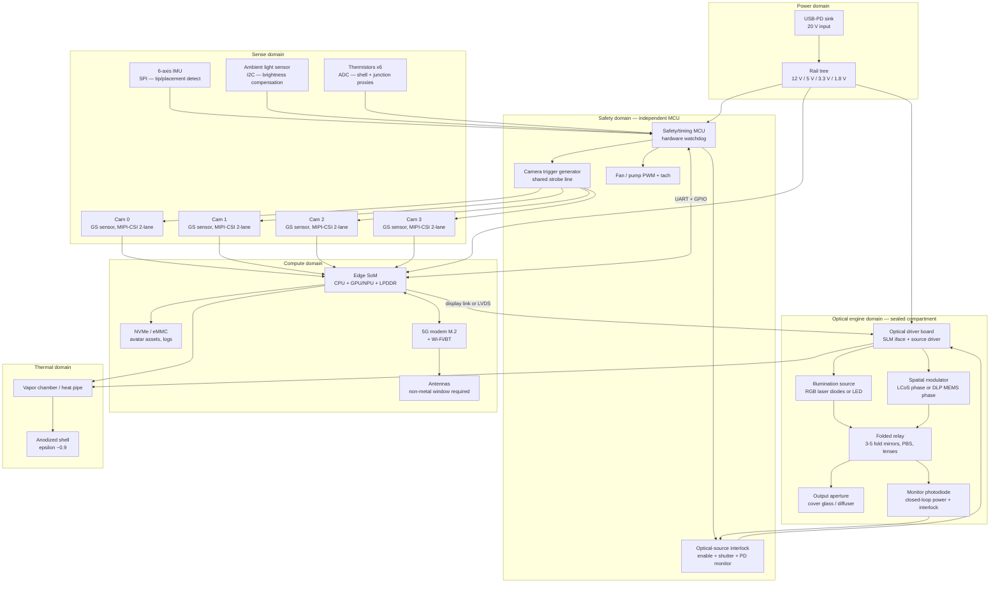
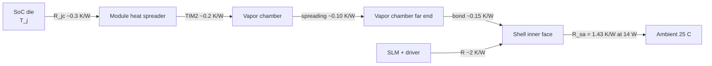
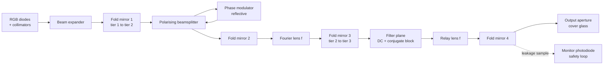
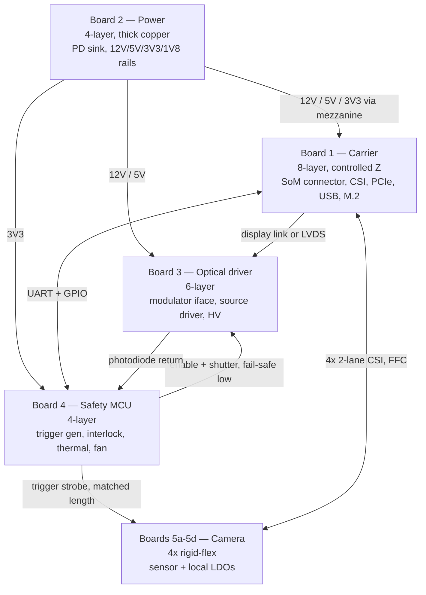
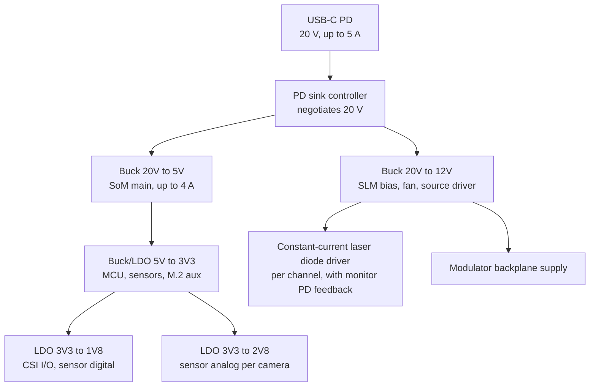
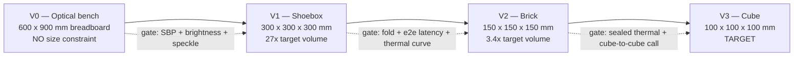

# 04 — Cube Hardware and Prototype Engineering

Lab manual for the physical TAYF device. This is the document an engineer builds from: block architecture, component classes with candidate parts, PCB and connector budgets, optical path folding, mechanical stack-up, thermal analysis, calibration, assembly, BOM, prototype ladder, test equipment, and the experiment sequence.

Companion docs: `docs/architecture.md` (what the system is), `docs/theory.md` (why it should work), `docs/calibration.md` (coordinate frames), `hardware/optical-engine.md` (mechanism selection and literature state), `experiments/README.md` (the 8-experiment ladder and the required research-notebook fields). This document supersedes the "TBD" worksheets in `hardware/power-thermal.md` and closes three of the four open items in `hardware/enclosure.md`.

## 0. Verification legend — read before citing anything here

This project has been burned by unverified claims. Every factual claim in this document carries one of the following tags where it is not derived from first principles inside the document itself:

| Tag | Meaning |
|---|---|
| `[U-PRICE]` | Price and/or availability is **unverified**. The online research pass tasked with confirming vendors was killed mid-run and produced nothing (`hardware/bom.md`). Nothing tagged this way may be ordered or quoted. |
| `[U-PN]` | The part number itself is unconfirmed — the part class is a defensible engineering choice, the specific SKU is engineering memory and may be wrong or obsolete. |
| `[U-SPEC]` | The numeric specification is cited from engineering memory and **must be confirmed against the manufacturer datasheet** before any design depends on it. |
| `[U-STD]` | A standards clause or limit cited from memory; confirm against the published standard. |

Untagged numbers are either (a) calculated in this document from inputs shown inline, or (b) carried forward from the verified calculation set below. Calculated results show formula and inputs so they can be re-derived and challenged.

### The verified calculation set this document is built on

These are the anchors. Nothing in this document contradicts them.

| Quantity | Value | Where used |
|---|---|---|
| Sealed 10cm cube passive rejection, ΔT=15 K (40 °C surface) | 7.20 W convection + 5.24 W radiation = **12.44 W** | §3 |
| Sealed 10cm cube passive rejection, ΔT=25 K (50 °C surface) | 12.00 + 9.18 = **21.18 W** | §3 |
| Sealed 10cm cube passive rejection, ΔT=35 K (60 °C surface) | 16.80 + 13.50 = **30.30 W** | §3 |
| Jetson Orin Nano class power | 7–15 W | §3, §10, §13 |
| Jetson Orin NX class power | 10–25 W | §3, §10, §13 |
| Optical SBP required, head at ±20° full parallax | 8.59 × 10⁷ | §4 |
| 4K LCoS at 8× time-multiplex delivers | 6.64 × 10⁷ (77 %) | §4 |
| TI DLP MEMS phase SLM at 1440 Hz delivers | 4.98 × 10⁷ (58 %) | §4 |
| Optics gap | 1.3× (LCoS) to 1.7× (DLP) | §4 |
| Laser-plasma gap, sparse wireframe head at 30 fps | 15× the JSID 2025 baseline of 10k voxels/s | §4.6 |
| Laser-plasma gap, eye resolution | 2216× | §4.6 |
| Parametric stream bandwidth, 215 floats at 60 fps | 0.124–0.206 Mbps | §10.4 |

**The single most important finding in this document: thermal is the binding constraint on the 10 cm form factor.** The SoC alone consumes the entire passive budget, leaving approximately zero watts for the optical engine. Everything about the enclosure, the cooling strategy, the SoC class choice, and the prototype ladder follows from that. §3 is the section to read first if you read only one.

---

## 1. Design envelope

| Parameter | Value | Source |
|---|---|---|
| External dimensions | 100 × 100 × 100 mm | `docs/architecture.md` |
| External volume | 1000 cm³ | — |
| External surface area | 6 × 0.01 m² = **0.06 m²** | — |
| Surface area actually radiating/convecting (bottom face on a table) | **0.05 m²** | §3.2 |
| Interior clear volume (2.5 mm wall, 2 mm assembly gap) | 90 × 90 × 90 mm = **729 cm³** | §8.1 |
| Input power | USB-PD, ≤ 100 W available | §10 |
| End-to-end latency budget | < 150 ms (ITU-T G.114 conversational) | `experiments/latency/README.md` |
| Uplink payload | 0.124–0.206 Mbps | §10.4 |
| Capture volume | ~0.6 × 0.6 × 1.2 m at 1.0–1.5 m standoff | `hardware/camera-rig.md` |
| Symmetric | Both cubes run identical hardware; there is no "sender unit" and "receiver unit" | `docs/architecture.md` |
| Environment independence | No wall, projection surface, special chair, or external tracking permitted | `docs/architecture.md` |

---

## 2. Hardware block architecture



Three architectural commitments encoded in that diagram, each of which is a decision rather than a drawing convention:

1. **The optical source enable path never passes through Linux.** The interlock, the monitor photodiode feedback loop, and the shutter are owned by an independent MCU with a hardware watchdog. A Linux SoC that hangs must fail the optical source to OFF, not to last-commanded-state. This applies to the hackathon-track engine too, not just the north-star laser track — see §4.5.
2. **Camera trigger generation is on the MCU, not the SoC.** `hardware/camera-rig.md` requires hardware-synchronised multi-view frames; a Linux-side GPIO toggle has jitter in the hundreds of microseconds. The MCU produces a jitter-free strobe and reports the strobe timestamp to the SoC over UART for frame tagging (`firmware/README.md` item 2).
3. **The optical compartment is physically sealed and separate from the compute compartment.** This is forced by §3.8: you cannot put a fan and a folded coherent optical path in the same 1000 cm³ box.

---

## 3. Thermal — the binding constraint

This is the section that determines whether the 10 cm form factor is real. Everything else in the document is downstream of it.

### 3.1 Surface-rejection budget (the anchor calculation)

A sealed enclosure rejects heat from its outer surface by natural convection and radiation:

```
Q_conv = h · A · ΔT
Q_rad  = ε · σ · A · (T_s⁴ − T_a⁴)
```

Inputs: `A = 6 × (0.1 m)² = 0.06 m²`, `h = 8 W/m²K` (natural convection, small body, still air), `ε = 0.9` (anodized/painted metal), `σ = 5.670 × 10⁻⁸ W/m²K⁴`, `T_a = 25 °C = 298.15 K`.

| Surface ΔT | Surface temp | Q_conv | Q_rad | **Q_total** |
|---|---|---|---|---|
| 15 K | 40 °C | 7.20 W | 5.24 W | **12.44 W** |
| 25 K | 50 °C | 12.00 W | 9.18 W | **21.18 W** |
| 35 K | 60 °C | 16.80 W | 13.50 W | **30.30 W** |

Worked example for the ΔT = 15 K radiation term: `ε·σ·A = 0.9 × 5.670e-8 × 0.06 = 3.062e-9`; `T_s⁴ − T_a⁴ = 313.15⁴ − 298.15⁴ = 9.6163e9 − 7.9020e9 = 1.7143e9`; product `= 5.249 W`.

**Against this: a Jetson Orin Nano is 7–15 W and an Orin NX is 10–25 W. At a 40 °C shell — the highest temperature that is unambiguously pleasant to touch — the SoC alone consumes the entire budget and the optical engine gets approximately nothing.**

### 3.2 Correction 1: the bottom face does not participate

The cube sits on a table (`hardware/camera-rig.md`: "on a side table or the chair's own armrest"). The bottom face radiates into a surface at its own temperature and convects into a stagnant boundary layer. Assume it contributes nothing:

`A_eff = 5 × 0.01 = 0.05 m²`

| Surface ΔT | Surface temp | Q_conv | Q_rad | **Q_total (5 faces)** | vs 6-face |
|---|---|---|---|---|---|
| 15 K | 40 °C | 6.00 W | 4.37 W | **10.37 W** | −17 % |
| 20 K | 45 °C | 8.00 W | 5.98 W | **13.98 W** | — |
| 25 K | 50 °C | 10.00 W | 7.65 W | **17.65 W** | −17 % |
| 35 K | 60 °C | 14.00 W | 11.27 W | **25.27 W** | −17 % |

### 3.3 Correction 2: emissivity is a first-order design variable, and the industrial-design brief gets it wrong

Linearising the radiation term gives an effective radiative film coefficient:

```
h_rad = ε · σ · (T_s² + T_a²)(T_s + T_a)
      = 0.9 × 5.670e-8 × (98063 + 88893) × 611.3
      = 5.83 W/m²K   at ΔT = 15 K
```

**Radiation is 42 % of the total heat rejection, and it scales linearly with ε.** `design/README.md` asks for an Apple-minimalist metal shell. A polished or bare-aluminium finish has ε ≈ 0.05 `[U-SPEC]`; an anodised or painted finish has ε ≈ 0.85–0.9 `[U-SPEC]`.

At ΔT = 15 K on 5 faces, dropping from ε = 0.9 to ε = 0.05 costs `4.37 × (1 − 0.05/0.9) = 4.13 W`, taking the budget from 10.37 W to 6.24 W — a **40 % reduction in total heat rejection for a surface-finish choice.**

> **Design ruling:** the shell must be anodised, bead-blasted, or painted, never polished or bare. This is a thermal requirement with an aesthetic consequence, not an aesthetic choice with a thermal consequence. `design/README.md` rule 1 ("one material language") is satisfiable with a high-emissivity finish; a mirror-polish unibody is not on the table.

### 3.4 Correction 3: the touch-temperature limit is a safety limit, not a comfort preference

IEC 62368-1 touch-temperature limits for surfaces held or touched for extended periods are approximately 48 °C for bare metal, 51 °C for glass/ceramic, and 60 °C for plastic `[U-STD — confirm against IEC 62368-1 Table 38 or the current equivalent clause]`. Metal conducts heat out of skin faster than plastic, which is why its limit is lower for the same perceived hazard.

The cube is a consumer object that a person places, picks up, and sits next to. A metal shell is therefore capped at **≈ 48 °C, i.e. ΔT ≈ 23 K**, which on 5 faces gives:

`Q_conv = 8 × 0.05 × 23 = 9.20 W`; `T_s = 321.15 K`, `T_s⁴ − T_a⁴ = 1.0637e10 − 7.902e9 = 2.735e9`, `Q_rad = 0.9 × 5.670e-8 × 0.05 × 2.735e9 = 6.98 W`.

**Total sealed passive ceiling for a metal-shelled 10 cm cube: ≈ 16.2 W, and ≈ 14.0 W if you want a 45 °C shell with margin.**

That is the real number. Not 21.18 W, not 30.30 W. **The 30.30 W figure at a 60 °C shell is not available to a consumer device — a 60 °C metal surface exceeds the touch limit by 12 K.** It is available to a lab fixture (V0/V1 in §14), and that distinction matters for the prototype ladder.

### 3.5 The load budget

Realistic loads for a full-capability 10 cm cube, with the tags that matter:

| Load | Power | Duty | Notes |
|---|---|---|---|
| Edge SoM — Orin Nano at 15 W profile | 15.0 W | continuous | `[U-SPEC]` confirm the module's actual configurable power modes |
| Edge SoM — Orin Nano at 7 W profile | 7.0 W | continuous | The 7 W profile costs GPU/DLA clocks; unmeasured against TAYF's estimator load |
| Cameras, 4 × global-shutter module | 1.6 W | continuous | 0.4 W each `[U-SPEC]` |
| 5G modem, RRC-connected average | 2.5 W | continuous while in a call | `[U-SPEC]` — transmit bursts higher |
| Wi-Fi instead of 5G | 0.6 W | continuous | `[U-SPEC]` |
| Illumination source (see §4.4 — this is small) | 1.0–2.0 W | continuous while displaying | Calculated in §4.4 |
| SLM backplane + driver ASIC | 3.0–5.0 W | continuous | `[U-SPEC]` — LCoS headboard and DLP controller both land here |
| MCU, sensors, misc | 0.5 W | continuous | — |
| Power conversion loss at 92 % efficiency | see below | continuous | Dissipated **inside** the box |

**Two configurations, computed:**

*Configuration A — full capability, Orin Nano 15 W, 5G, active SLM:*
Sub-total before conversion loss = 15.0 + 1.6 + 2.5 + 1.5 + 4.0 + 0.5 = **25.1 W**.
Conversion loss at 92 % = `25.1 × (1/0.92 − 1) = 2.18 W`.
**Total heat to reject = 27.3 W.**

Solving §3.2's 5-face model for 27.3 W: `0.4·ΔT + h_rad(ΔT)·0.05·ΔT = 27.3` gives ΔT ≈ 38 K, i.e. a **63 °C shell**. That is 15 K over the metal touch limit. Configuration A does not fit a sealed 10 cm cube. Not marginally — by a factor of about 1.9× on power, or 15 K on surface temperature.

*Configuration B — thermally-honest, Orin Nano 7 W, Wi-Fi, low-power engine:*
Sub-total = 7.0 + 1.6 + 0.6 + 1.0 + 3.0 + 0.5 = **13.7 W**; conversion loss = 1.19 W; **total = 14.9 W.**

14.9 W against a 16.2 W ceiling at a 48 °C shell. **Configuration B fits, with 8 % margin and a shell you would not want to hold for long.** Every one of those line items is `[U-SPEC]`, and an 8 % margin against a stack of unverified specs is not a margin.

**Mitigation that is free and should be done regardless: move power conversion out of the cube.** At 92 % converter efficiency the internal rail tree contributes 1.2–2.2 W — 8–14 % of the entire budget — to heat the enclosure must then reject. Specifying a fixed-12 V or fixed-5 V external supply and doing the 20 V → 12 V step in the power brick removes most of that. This is the cheapest watt in the entire design.

### 3.6 Internal thermal path — where the junction actually ends up

The surface budget above is heat leaving the shell. Getting heat *to* the shell is a separate resistance network:



Resistances are `[U-SPEC]` engineering estimates pending vendor data. Summing the SoC branch: `R_total ≈ 0.3 + 0.2 + 0.10 + 0.15 + 1.43 = 2.18 K/W`.

At 14 W total load: `T_j = 25 + 14 × 2.18 = 55.5 °C`. Silicon is entirely comfortable.
At 25 W: shell reaches `25 + 25 × 1.43 = 60.8 °C` — unsafe to touch — while the junction is at `25 + 25 × 2.18 = 79.5 °C`, still inside silicon limits `[U-SPEC — Orin Nano T_j max]`.

> **The crisp statement of the whole problem: the binding constraint is a human-touch limit, not a silicon limit.** The SoC would happily run hotter. The person sitting next to it will not. This is why "just let it throttle" is not a solution — throttling protects the die, not the hand.

Note also that `R_sa = 1.43 K/W` is not a heatsink you can improve. It is the physics of a 0.05 m² body in still air. No internal thermal engineering changes it. Internal engineering only affects the ~0.75 K/W between the die and the shell — i.e. it can win you about 19 K of junction temperature and zero watts of budget.

### 3.7 Cooling options, evaluated against the above

| Option | Effect on the budget | Volume cost | Verdict |
|---|---|---|---|
| **Passive spreader (graphite/copper foil to shell)** | Does not change `R_sa`. Reduces die-to-shell resistance modestly; poor spreading over 90 mm. | ~15 cm³ | Adequate only for Configuration B. Cheapest, silent, sealed. |
| **Vapor chamber, SoC to 3 shell faces** | Does not change `R_sa` either — but it is what makes the *full* 5-face area actually participate. Without spreading, a hot spot on one face rejects far less than the 5-face model assumes; the model's 0.05 m² is an upper bound you have to earn. | 90 × 90 × 3 mm ≈ 24 cm³ | **Required, not optional, if you want the §3.2 numbers to be real.** `[U-PRICE]` |
| **Heat pipe to shell** | Same role as vapor chamber, cheaper, worse spreading. A 6 mm sintered pipe carries ~15–25 W over short lengths `[U-SPEC]`. | ~8 cm³ | Acceptable substitute at V2; vapor chamber preferred at 10 cm. |
| **Forced air** | Raises the *internal* film coefficient from ~8 to ~25–50 W/m²K, and, with a duct and vents, replaces surface rejection with mass-flow rejection entirely (§3.7.1). Genuinely lifts the ceiling. | 40 mm fan + duct + fin stack + 2 × 1300 mm² vents ≈ 90 cm³ | **Blocked by §3.8, not by thermodynamics.** |
| **Liquid loop / TEC** | TEC makes total heat rejection *worse* (it adds its own input power to the load) while lowering local junction temperature. In a surface-area-limited enclosure that is exactly the wrong trade. | — | **Ruled out.** A TEC in a sealed 10 cm cube is a thermal own-goal. |

#### 3.7.1 Forced-air ceiling, computed

Mass-flow rejection: `Q = ρ · V̇ · c_p · ΔT_air`. With `ρ = 1.16 kg/m³` at 30 °C, `c_p = 1005 J/kgK`, a 40 mm fan at 3 CFM (`3 × 4.72e-4 = 1.416e-3 m³/s`), and a 15 K air temperature rise:

`Q = 1.16 × 1.416e-3 × 1005 × 15 = 24.8 W`

So the airflow itself is not the limit — 3 CFM removes 25 W. The limits are (a) fin surface area to get 25 W into that air, (b) noise, (c) dust.

Fin area check: a 60 × 60 × 10 mm fin stack at 2 mm pitch gives ~30 fins, area `≈ 2 × 30 × 60 × 10 = 36,000 mm² = 0.036 m²`. At forced `h ≈ 30 W/m²K` and a 20 K fin-to-air ΔT: `Q = 30 × 0.036 × 20 = 21.6 W`. Feasible. **Forced air roughly doubles the ceiling, to ~30 W** — enough for Configuration A.

### 3.8 Why forced air loses anyway: acoustics and dust

**Acoustics.** This device sits within a metre of a conversation. Reference points: a quiet room floor is 30–35 dBA; conversational speech at 1 m is 55–65 dBA; the device must be inaudible in conversational *pauses*, which means it must sit at or below the room floor — **target ≤ 25 dBA at 0.5 m**. Fan noise rises roughly 15 dB per doubling of speed `[U-SPEC — rule of thumb]`. A 40 mm fan at ~4500 RPM can hit ~18 dBA `[U-SPEC]`; a 30 mm fan pushed to the ~8000 RPM needed for equivalent flow lands at 25–30 dBA. **The acoustic budget admits a 40 mm fan at low RPM and rules out anything smaller** — and a 40 mm fan plus inlet and outlet plenums plus a fin stack is 90 cm³ and two 1300 mm² vent apertures (13 % open area on a 100 mm face) inside a box that §8.1 shows is already 88 % packed.

**Dust, which is the actual disqualifier.** A vented enclosure ingests dust. The optical engine contains 3–5 fold mirrors, at least one polarising beamsplitter, and a modulator with a 5–8 µm pixel pitch, several of which sit at or near beam waists. A dust particle at a beam waist in a coherent system produces a diffraction artifact across the whole reconstruction, not a local dark spot — and speckle and ghosting are already two of the named failure modes in `experiments/README.md`. There is no filter that both keeps sub-10 µm particles out and passes 3 CFM at low static pressure in a 100 mm cube.

> **Ruling — this closes `hardware/enclosure.md` open item 3 and `hardware/power-thermal.md` open item 2: the cube is split into two thermally and pneumatically separate compartments.** The optical compartment is sealed (target IP5X) with an integrated desiccant pack and is cooled conductively only. The compute compartment may be vented and fan-cooled at V2 and below. At the 10 cm target, if the vent apertures cannot be made to work within the ID brief, the compute compartment goes conductive too and the design falls back to Configuration B.

### 3.9 Transient operation — thermal mass buys the length of a phone call

Steady state is not the only regime that matters. A telepresence call has a duration.

Enclosure thermal capacitance: a 100 mm cube in 2 mm aluminium, 6 faces, is `6 × (0.1 × 0.1 × 0.002) = 1.2e-4 m³`; at `ρ = 2700 kg/m³` that is **0.324 kg**. With `c_p = 900 J/kgK`, `C_shell = 292 J/K`. Add internals (SoM, boards, optical mounts, vapor chamber) at an estimated 150 J/K `[U-SPEC]`: **C_total ≈ 440 J/K.**

Time to reach the shell limit when running over budget:

```
t = C_total · ΔT_allowed / P_excess
```

| Excess over steady-state budget | Time to hit the shell limit (ΔT_allowed = 15 K headroom) |
|---|---|
| 5 W over | 6600 / 5 = **1320 s ≈ 22 min** |
| 10 W over | 6600 / 10 = **660 s ≈ 11 min** |
| 13 W over (Configuration A vs Configuration B) | 6600 / 13 = **508 s ≈ 8.5 min** |

> **This is the most useful single result in the thermal section after the ceiling itself. A 10 cm cube running Configuration A — full Orin Nano, 5G, active SLM — has about 8–11 minutes before the shell reaches its limit. That is the length of a phone call.** TAYF is thermally a *call* device, not an always-on presence device, unless something is relaxed. That reframing is not a defeat; "the cube is hot after a long call, and cools between calls" is a shippable product behaviour, and it is honest in a way that "sustained 27 W in a sealed 1000 cm³ box" is not.

The corollary is a firmware requirement: the MCU must implement a **thermal state machine with a declared user-visible policy** — full performance until the shell hits a soft limit, then a graceful degradation ladder (drop display refresh, drop estimator count, drop camera count, drop to Wi-Fi) rather than an abrupt throttle mid-sentence. Add to `firmware/README.md` scope.

### 3.10 The honest conclusion — what must be relaxed

Three things can give. Exactly one of them must.

**Option 1 — relax cube size.** Heat rejection scales with `L²` while the component volume you need scales roughly with `L⁰` (the parts are what they are). Going from 100 mm to 130 mm raises 5-face area from 0.05 to 0.0845 m² (+69 %), lifting the 48 °C ceiling from 16.2 W to ~27 W — enough for Configuration A passively, sealed, silent. Going to 150 mm gives 0.1125 m² and ~36 W. **A 130 mm cube solves the thermal problem outright and is still recognisably "a cube on a table."** The cost is entirely narrative: 10 cm is a pitch commitment, not an engineering requirement, and nothing in `docs/theory.md`'s optimisation statement (which writes the constraint as "cube volume ≤ 1000 cm³") is physically motivated.

**Option 2 — relax SoC class.** The Orin Nano's 7 W profile plus a dedicated low-power NPU is a different, better-shaped answer. A Hailo-8L-class M.2 accelerator `[U-PN]` `[U-SPEC — ~13 TOPS at ~1.5–2.5 W]` running the pose/face/hand estimators alongside a much smaller applications processor may deliver the same inference throughput at half the SoC power. **This is unvalidated and is the single highest-value hardware experiment in the project** — `pipeline/capture/README.md`'s estimator stack has never been benchmarked on any embedded part, let alone a non-CUDA one. Note the software cost: the Mon3tr-derived pipeline is CUDA-shaped, and porting to a fixed-function NPU is a real porting project, not a recompile.

**Option 3 — relax duty cycle.** Ship Configuration A and accept the §3.9 result: 8–11 minute calls at full capability, then a declared degradation ladder. Requires no hardware change and no narrative change, and is the only option available if both the 10 cm dimension and the Orin-class SoC are treated as fixed.

**Recommendation: Option 2 as the engineering programme, Option 3 as the shipping behaviour, Option 1 held in reserve for the production design.** Build the 10 cm cube. Instrument it. Publish the thermal curve. A device that says "this is what 1000 cm³ can actually reject, here is the measurement" is more credible than one that claims to have solved it.

**What must not happen: designing the enclosure, ordering the SoM, and discovering this at integration.** That is what §14's prototype ladder exists to prevent — V1 carries a full thermal instrumentation suite specifically so the thermal answer arrives before the 10 cm mechanical design is committed.

---

## 4. Optical engine — space-bandwidth budget and device selection

### 4.1 The requirement

Reconstructing a head at ±20° with full parallax requires a space-bandwidth product of **8.59 × 10⁷**. Structurally:

```
SBP = (spatial samples) × (angular samples)
    = (A_image / δ_x²) × (Θ_h · Θ_v / δθ²)
```

Sanity reconstruction of the anchor (the anchor is the authority; this is a consistency check, not a re-derivation): a head-sized field of `200 × 250 mm = 5.0e4 mm²` at `δ_x = 1.0 mm` gives 5.0 × 10⁴ spatial samples; ±20° in both axes at `δθ ≈ 0.97°` gives `(40/0.97)² ≈ 1718` angular samples; product `= 8.59 × 10⁷`. The input set is plausible and reproduces the anchor; if the upstream derivation used different assumptions the anchor still stands.

### 4.2 What the two candidate device classes deliver

A time-multiplexed modulator delivers `SBP_delivered = N_pixels × (f_device / f_output)`, at `f_output = 60 Hz`:

| Device class | Pixels | Device rate | Multiplex | Delivered SBP | Fraction of requirement | Gap |
|---|---|---|---|---|---|---|
| 4K LCoS phase SLM | 3840 × 2160 = 8.294e6 | 480 Hz | 8× | **6.64 × 10⁷** | **77 %** | **1.3×** |
| TI DLP MEMS phase SLM | 1920 × 1080 = 2.074e6 `[U-SPEC]` | 1440 Hz | 24× | **4.98 × 10⁷** | **58 %** | **1.7×** |

Check: `8.294e6 × 8 = 6.635e7` ✓. `2.074e6 × 24 = 4.977e7` ✓.

> **This is the most encouraging number in the entire project. The optics gap for a head at ±20° with full parallax is 1.3–1.7×, not orders of magnitude.** Contrast with the laser-plasma north-star track's 15× (§4.6). A 1.3× shortfall is a device-generation problem, or a viewing-angle-specification problem, or a `pipeline/view_synthesis/` neural-interpolation problem — all tractable. It is not a physics wall.

Three ways to close 1.3×, in increasing order of engineering cost:
- **Reduce the angular field.** SBP scales with `Θ²`. Dropping from ±20° to ±17.5° cuts the requirement by 23 % and closes the LCoS gap outright. `docs/calibration.md` already commits to a single-observer assumption for the hackathon track, and `experiments/light-field/README.md` protocol step 3 measures the angular range over which the image actually stays coherent — **that measurement, not a specification, should set this number.**
- **Neural angular interpolation.** `pipeline/view_synthesis/README.md` and `experiments/angular-resolution/README.md` exist to find the knee point where physical view count can be reduced without perceptual collapse. If the knee is at 0.7× of native, the gap is closed in software.
- **Raise the device rate or pixel count.** A 4K LCoS at 720 Hz gives 12× multiplex and 9.95e7 — 116 % of requirement. Whether such a device exists at a sourceable price is exactly the `[U-PRICE]` `[U-PN]` question the killed research pass was supposed to answer.

### 4.3 Critical sourcing flag on the DLP path

The 4.98e7 figure is consistent with a **1920 × 1080** phase device at 1440 Hz. TI's phase light modulator line `[U-PN — DLP6750 or equivalent, confirm]` may be a **1358 × 800** part `[U-SPEC]`. If so, the delivered SBP is `1.086e6 × 24 = 2.61e7` — **30 % of requirement, a 3.3× gap**, which moves the DLP path from "competitive with LCoS" to "not viable for full-parallax head reconstruction."

> **Confirming the actual pixel count of the candidate TI phase device is a first-order sourcing question that changes the architecture, not a datasheet detail.** It is task 1 of the rerun research pass, alongside the panel decision in `hardware/bom.md`.

The DLP path's compensating advantages remain real and should be weighed if the pixel count confirms low: 4-bit phase at 1440 Hz is a fundamentally faster modulator, MEMS is polarisation-insensitive (removing the PBS and its ~55 % double-pass loss from §5.3), and TI's controller ASICs are a supported, documented driving path where LCoS driver electronics are frequently vendor-bespoke.

### 4.4 Illumination power — computed, and it is small

Target: a head-sized aerial image, `A = 200 × 250 mm = 0.05 m²`, at `L = 150 cd/m²` (visible against ~300 lux ambient `[U-SPEC — perceptual, confirm against a lit-room measurement]`), emitted into the ±20° cone.

Solid angle of a ±20° square cone: `Ω ≈ (2 × 20 × π/180)² = 0.698² = 0.487 sr`.

Luminous flux at the output: `Φ = L · A · Ω = 150 × 0.05 × 0.487 = 3.65 lm`.

At the §5.3 end-to-end optical efficiency of 0.20: **source flux required = 18.3 lm**.

Converting to optical watts at 520 nm, where `V(λ) ≈ 0.71` and efficacy `= 683 × 0.71 ≈ 485 lm/W`: **38 mW optical for the green channel.** Full colour, weighting for red and blue's lower luminous efficacy, lands at roughly **150–250 mW total optical**. At laser-diode wall-plug efficiencies of 15–35 % `[U-SPEC]`, that is **≈ 1–2 W electrical.**

> **The light source is not the thermal problem.** One to two watts, against a 16 W ceiling. What costs power in the optical engine is the modulator backplane and its driver ASIC (3–5 W `[U-SPEC]`) and the SoC generating the frames. This is a useful reframing: optimising the illumination path buys nothing thermally, while a lower-power modulator or a lower output frame rate buys real watts.

### 4.5 Eye safety applies to the hackathon track too

`hardware/optical-engine.md` scopes its safety section to the north-star femtosecond track. That scoping is incomplete. **A 150–250 mW visible laser source is Class 3B by accessible-emission limit** (the Class 1/2 boundary for visible CW is ~1 mW, Class 3R to 5 mW, Class 3B to 500 mW `[U-STD — confirm against IEC 60825-1]`). The engine's *output* is expanded and diffused, which is what makes the product plausibly Class 1 — but that classification depends on the beam expansion actually being present, which means:

1. **A single-fault condition — modulator not driven, diffuser cracked, aperture obstructed — can concentrate the full source power into a small beam.** The accessible-emission analysis must be done for the fault case, not the nominal case.
2. **The monitor photodiode in §2 is a safety component, not a diagnostic.** It closes a loop: measured output below expected (beam is being blocked or misdirected) or above expected (modulator failed to a bright state) shuts the source down in hardware.
3. **The interlock lives on the MCU with a watchdog**, per §2 commitment 1.
4. An **LED-illuminated** engine sidesteps the entire laser classification question at the cost of étendue — LEDs are not spatially coherent and cannot drive a phase modulator efficiently. This is the real reason a CGH engine wants a laser, and it is the reason the safety analysis cannot be deferred to the north-star track.

> **Action: extend `hardware/optical-engine.md`'s safety section to cover any laser-illuminated hackathon-track engine, at the accessible-emission level, before V0 is powered on.** V0 is on a bench with goggles; V1 and beyond are near people.

### 4.6 The north-star track, for scale contrast

JSID 2025 baseline: ~10k voxels/s in a 68 × 42 mm volume.

- **Sparse wireframe head at 30 fps: 15× the baseline** = 1.5 × 10⁵ voxels/s, i.e. ~5000 voxels per frame.
- **Eye resolution: 2216× the baseline** = 2.216 × 10⁷ voxels/s, i.e. ~739,000 voxels per frame.

`experiments/voxel-display/README.md` documents two independent physical reasons this does not scale naively — cumulative air-density depletion above ~10 kHz repetition rate (arXiv 2501.10198, and the JSID baseline sits exactly at that crossover), and the brightness-versus-count trade in multi-spot parallelism. **15× with two known-adverse scaling mechanisms is a research programme; 1.3× on a commercially-available modulator is a purchase order.** That asymmetry is the entire justification for `docs/roadmap.md`'s two-track split, and this document only budgets hardware for the near track.

---

## 5. Optical path length and folding into 100 mm

### 5.1 The unfolded path budget

A phase-modulator engine has an irreducible path length. Budgeting a representative 4f architecture:

| Segment | Length | Why |
|---|---|---|
| Diode output → collimator | 5–15 mm | Fast-axis divergence needs a short-focal-length asphere close to the emitter |
| Collimator → beam expander output | 40–80 mm | Expanding to fill the modulator's ~17 × 10 mm active area at acceptable uniformity |
| Expander → PBS → modulator | 20–35 mm | PBS cube edge plus mounting clearance |
| Modulator → Fourier lens (f) | 50–100 mm | = f |
| Fourier lens → filter plane (DC block, conjugate order block) | 50–100 mm | = f |
| Filter plane → relay lens | 50–100 mm | = f |
| Relay lens → output/eyebox plane | 50–100 mm | = f |
| **Total** | **265–530 mm** | Bracketing the stated 200–400 mm working range |

Choosing `f = 50 mm` throughout and a compact expander gives ≈ 265 mm. Choosing `f = 75 mm` gives ≈ 365 mm. **`f` is the dominant lever and it trades against the achievable output field: shortening `f` shrinks the reconstructed image and increases the required numerical aperture, which costs aberration correction and lens element count.** This trade should be resolved on the V0 bench (§14), where `f` is a swappable variable, not on paper.

### 5.2 Fold topology

Interior clear dimension: 90 mm (§1). Each fold mirror and its seat consumes roughly 8 mm at each end of a leg, so **usable straight leg length `L_leg ≈ 90 − 16 = 74 mm`**; call it 75 mm.

```
N_legs = ceil(L_total / L_leg)
N_mirrors = N_legs − 1
```

| Total path | N_legs | **Fold mirrors required** |
|---|---|---|
| 200 mm | 3 | 2 |
| 265 mm | 4 | 3 |
| 300 mm | 4 | 3 |
| 365 mm | 5 | 4 |
| 400 mm | 6 | 5 |

**Beam height and tiering.** A serpentine fold in a single plane runs out of floor area quickly. Stacking the path in vertical tiers is what makes 400 mm fit. Tier pitch is set by beam diameter plus mount thickness: a 6 mm beam with 3 mm clearance each side and a 6 mm mount body gives a **≈ 20 mm tier pitch**. In 90 mm of interior height that is 4 tiers geometrically — but the modulator assembly (a 0.67" device with its heatsink and flex is roughly 25 × 25 × 10 mm `[U-SPEC]`), the PBS cube, and the lens barrels are all taller than the beam, so **2–3 optical tiers is the realistic number.**

Capacity check: 3 tiers × 4 legs/tier = 12 legs × 75 mm = **900 mm of foldable path available.**

> **Conclusion: optical path length is not the binding constraint on the 10 cm enclosure.** 900 mm of capacity against a 265–530 mm requirement is comfortable. What binds is (a) component footprint competing with the SoM and the thermal solution for the same 729 cm³ (§8.1), (b) cumulative alignment tolerance across the folds (§5.4), and (c) stray light from the surface count (§5.5). Everyone assumes the path won't fit; it does. The problems are elsewhere.



### 5.3 Efficiency budget

| Element | Transmission/reflection | Running product |
|---|---|---|
| Diode → collimated, apertured | 0.85 | 0.85 |
| Beam expander (2 elements, AR) | 0.96 | 0.816 |
| PBS, double pass (polarisation-limited) | 0.45 | 0.367 |
| Phase modulator diffraction efficiency | 0.30–0.70 | 0.110–0.257 |
| 4 fold mirrors, protected silver at R = 0.98 | 0.98⁴ = 0.922 | 0.101–0.237 |
| 4 lens surfaces + cover glass, AR at 0.995 | 0.995⁵ = 0.975 | **0.099–0.231** |

**End-to-end optical efficiency: 10–23 %.** §4.4 uses 20 %.

Two observations. First, **the fold mirrors cost under 8 % combined** — folding is nearly free optically, and switching from protected silver (R = 0.98 `[U-SPEC]`) to dielectric (R = 0.995 `[U-SPEC]`) would recover 6 % at real cost. Do not spend money there. Second, **the PBS double pass and the modulator's diffraction efficiency together dominate the loss budget by an order of magnitude.** This is a direct argument for the DLP/MEMS path if §4.3's pixel-count question resolves favourably: a polarisation-insensitive MEMS modulator deletes the 0.45 term and roughly doubles end-to-end efficiency.

### 5.4 Tolerance stack-up

A fold mirror with angular error `δθ` deviates the beam by `2δθ`. Over a remaining path `L_rem`, lateral displacement is `2 · δθ · L_rem`.

**Pre-modulator budget (illumination centration on the modulator).** Requirement: centration within ±0.2 mm on a 17 mm-wide active area. With `L_rem ≈ 150 mm`: `δθ < 0.2 / (2 × 150) = 6.7e-4 rad = 0.67 mrad = 0.038°`. A CNC-machined mirror seat holds roughly ±0.05° = ±0.87 mrad `[U-SPEC — machinist-dependent]`. **Machined seats alone miss this by ~30 %. One adjustable mirror is required in the illumination arm.**

**Post-modulator budget (output image position).** A rigid translation of the reconstructed image is far more forgiving than an illumination error, because it moves the image rather than degrading it. Requirement: ±0.5 mm at the output plane, `L_rem ≈ 100 mm`: `δθ < 2.5 mrad = 0.14°`. **Machined seats clear this with 2.8× margin. No adjusters required post-modulator** — which is the correct place to spend the fold count.

**RSS across four mirrors** at the machined ±0.87 mrad, with `L_rem ≈ 200 mm` average: single-mirror shift `= 2 × 8.7e-4 × 200 = 0.35 mm`; four in RSS `= 0.35 × √4 = 0.70 mm`. Within the post-modulator budget, outside the pre-modulator budget — consistent with the split above.

**Thermal expansion.** Aluminium `α = 23.1e-6 /K`. A 90 mm leg at ΔT = 20 K changes by `90 × 23.1e-6 × 20 = 41.6 µm`.
- *For an intensity or light-field engine:* negligible. 41.6 µm on a 265 mm path is a 0.016 % scale change.
- *For a coherent phase engine:* 41.6 µm is ~80 wavelengths at 520 nm, but this is a **common-path** change — it adds a global piston term to the reconstruction, which is invisible. What is not invisible is a change in the modulator-to-Fourier-lens spacing, which shifts reconstruction distance: `δf/f = 41.6e-3 / 50 = 0.083 %`, an ~0.2 mm shift in a 250 mm reconstruction depth. Tolerable.
- *What is fatal:* any two-arm interferometric alignment. **Do not design an architecture with a separate reference arm inside this enclosure.** The thermal environment (§3: a shell swinging 20 K over a call) will not hold it.

**Mirror surface flatness.** For a coherent engine, specify **λ/10 over the beam footprint** on every fold. A λ/2 commodity mirror adds wavefront error that compounds across four folds. This is a real `[U-PRICE]` line item and one of the few places in the optical BOM where the cheap part is the wrong part.

### 5.5 Stray light and ghosting

Every surface in a folded path is a ghost source, and `experiments/README.md` names ghosting and diffraction artifacts as primary failure modes. Surface count for the §5.2 topology: 2 expander elements (4 surfaces) + PBS (4 surfaces, 2 of them at 45°) + modulator cover glass (2) + 4 fold mirrors (4) + 2 lenses (4) + output cover glass (2) ≈ **20 optical surfaces in a 90 mm box.** Required countermeasures, all of which consume volume and must be in CAD from the start rather than added when ghosts appear:

- All internal chassis surfaces black-anodised or flock-lined; matte black anodising is not enough at grazing incidence, use structured/flocked surfaces on walls facing the beam.
- Knife-edge baffles at each tier transition, sized to the beam plus 2 mm.
- Wedged cover glasses (0.5–1°) so their ghosts walk out of the aperture rather than superimposing.
- The filter plane at the Fourier plane doubles as the primary stray-light stop — block the DC order and the conjugate order there, not downstream.

---

## 6. Camera rig

### 6.1 Sensor and lens, computed

Candidate sensor class: 1/2.9"–1/1.8" global shutter, MIPI-CSI-2, hardware trigger input. Reference geometry using an IMX296-class device `[U-PN]` `[U-SPEC]`: 1456 × 1088 px, 3.45 µm pixel, active area 5.02 × 3.75 mm.

`hardware/camera-rig.md` requires 40–50° effective horizontal FOV. Solving for focal length at 45°:

```
f = (w/2) / tan(HFOV/2) = 2.51 / tan(22.5°) = 2.51 / 0.4142 = 6.06 mm
```

**A 6 mm M12 lens.** Coverage check at the near end of the standoff range: `width = 2 × 1.0 m × tan(22.5°) = 0.828 m`, against a 0.6 m capture volume — **38 % margin**, which is what allows `app/`'s user-adjustable boundary to shrink the working volume rather than requiring optical zoom, exactly as `hardware/camera-rig.md` intends. At 1.5 m the coverage is 1.24 m.

### 6.2 Angular resolution — does the face have enough pixels?

`1456 px / 45° = 32.4 px/degree`. At 1.0 m, one pixel subtends `1000 mm × (45/1456) × π/180 = 0.54 mm`. A 150 mm-wide face therefore occupies **278 px across**. Monocular face/expression estimators of the SMIRK class typically want a face crop of ≥ 100–200 px `[U-SPEC — model-dependent, confirm against `pipeline/capture/`'s chosen weights]`. **278 px clears it with margin at 1.0 m and gives ~185 px at 1.5 m — still adequate.** Hand estimators see a ~100 mm hand at ~185 px at 1.0 m, which is marginal; this is an argument for the sensor's resolution, not its FOV, being the upgrade axis if hand tracking underperforms.

### 6.3 Stereo depth precision

`Z = f_px · B / d`, so `δZ = Z² · δd / (f_px · B)`. With `f_px = 6.06 mm / 3.45 µm = 1757 px`, baseline `B = 70 mm` (the practical limit inside a 100 mm enclosure per `hardware/camera-rig.md`), and a disparity precision of `δd = 0.2 px`:

| Range | δZ |
|---|---|
| 1.0 m | `1e6 × 0.2 / (1757 × 70) = ` **1.63 mm** |
| 1.5 m | `2.25e6 × 0.2 / (1757 × 70) = ` **3.66 mm** |

Comfortably adequate for pose estimation and for the capture-volume boundary check. **Stereo depth is not a limiting factor and does not justify adding a depth sensor** — which is consistent with `docs/calibration.md`'s note that depth-based observer tracking is not currently planned.

### 6.4 Data rate and the MIPI lane budget

Per camera: `1456 × 1088 = 1,584,128 px`; at 60 fps and 10 bit: `1.584e6 × 60 × 10 = 950 Mbps`.

Four cameras: **3.80 Gbps aggregate.**

At a D-PHY lane rate of 2.5 Gbps `[U-SPEC]`, one lane per camera suffices in principle; two lanes per camera gives operating margin and matches standard module wiring. **4 cameras × 2 lanes = 8 CSI lanes**, which is exactly the lane count a Jetson Orin Nano module class exposes `[U-SPEC — confirm the module's CSI configuration, typically expressible as 4 × 2-lane or 2 × 4-lane]`.

> **The camera count is pinned at 4 by the lane budget, not by the FOV analysis.** A fifth camera requires either a GMSL2/FPD-Link aggregator `[U-PN]` `[U-PRICE]` (which adds a serialiser per camera and a deserialiser on the carrier — cost, board area, and ~1 W) or dropping to 1 lane per camera. This closes `hardware/camera-rig.md` open item 1's count question in the direction of 4 and gives a concrete reason.

Aggregate ingest of 3.80 Gbps into an Orin Nano-class ISP running four parallel estimator stacks is itself unvalidated — this is the same risk `hardware/bom.md` flags for Mon3tr's PC-class assumption, and it is what `experiments/latency/README.md` protocol step 3 exists to measure.

### 6.5 Synchronisation

Hardware trigger from the safety MCU (§2), one strobe line fanned to all four sensors with matched trace lengths. Requirement: **inter-camera exposure skew < 50 µs**, verified on a scope (§15). Rationale: at a conversational hand speed of ~1 m/s, 50 µs is 50 µm of motion — well below the 0.54 mm/px of §6.2, so sync error contributes nothing to the pose estimate. At 1 ms (a realistic Linux GPIO jitter figure) it would be 1 mm, comparable to two pixels, which is why `hardware/camera-rig.md` rejects software sync and why §2 puts the trigger on the MCU.

---

## 7. Cube-face real estate — resolving the display-versus-capture conflict

This closes `hardware/enclosure.md` open item 1.

### 7.1 The conflict, quantified

One 100 × 100 mm face = 10,000 mm².

| Claimant | Footprint | Note |
|---|---|---|
| Optical output aperture | 60 × 60 = 3600 mm² minimum; 80 × 80 = 6400 mm² desired | Sets the reconstructed image's étendue |
| Camera module + lens barrel | ~15 × 15 = 225 mm² each | 8 mm M12 barrel plus mount |
| 2 front cameras | 450 mm² | Stereo pair, 70 mm baseline |

`6400 + 450 = 6850 mm²` of 10,000 — **it fits.** The constraint is not area, it is geometry: the cameras cannot sit inside the display aperture, and their optical axes must not be occluded by the aperture's cover glass or diffuser.

### 7.2 The resolution

**The display face and the primary capture face are the same face, and this is correct rather than a conflict.** `docs/calibration.md` already states the reason: the observer of the remote avatar *is* the person the local cube is capturing. They are in the same place. Putting the display on one face and the capture on another would mean rendering the remote person to an empty part of the room.

Layout ruling:

- **Front face:** display aperture 100 × 76 mm, with a 12 mm top bezel and a 12 mm bottom bezel. The stereo pair sits in the top bezel at ±35 mm from centre (70 mm baseline). 12 mm accommodates an 8 mm lens barrel with mount and 2 mm of edge clearance; 10 mm is marginal and 12 mm is the design value.
- **Left and right faces:** one oblique camera each, for the profile/occlusion coverage `hardware/camera-rig.md` calls for during head turns. These faces are also the primary heat-rejection faces (§8.4), so the camera modules must be thermally isolated from the shell or their dark current will drift with call duration — a real image-quality consequence of §3 that is easy to miss.
- **Rear face:** service cover, antenna window, no optics (§8.4).
- **Top face:** ambient light sensor, capacitive touch if any. Kept cool deliberately so there is one face a user can comfortably rest a hand on.
- **Bottom face:** USB-PD port, feet. Contributes no heat rejection (§3.2).

### 7.3 The gaze-alignment option, and its cost

A stereo pair in a top bezel looks at the user from ~50 mm above the display centre. At a 1.0 m standoff that is a **2.9° gaze offset** — small, but gaze error is exactly the kind of artifact conversational telepresence is sensitive to, and `docs/theory.md`'s perceptual-allocation principle explicitly prioritises eyes.

The classical fix is a teleprompter geometry: a 50/50 beamsplitter in front of the display, camera on the folded axis, giving true on-axis capture and perfect gaze alignment.

**Cost, computed:** a 45° beamsplitter sized to the 76 mm display aperture needs a ~54 mm clear height and roughly **50 mm of additional enclosure depth** — half the cube. It halves display light (0.5×, taking §5.3's 10–23 % efficiency to 5–12 % and roughly doubling §4.4's source power to 2–4 W electrical) and halves camera light (costing ~1 stop of sensor SNR).

> **Ruling: not at 10 cm. Evaluate at V2 (§14), where the enclosure is 150 mm and the depth is available.** If `experiments/perceptual-quality/README.md`'s protocol shows a 2.9° gaze offset materially damages presence, that finding justifies revisiting cube size (§3.10 Option 1) — two independent reasons pointing at the same relaxation is a meaningful signal.

---

## 8. Mechanical structure

### 8.1 Interior volume budget

Interior clear: 90 × 90 × 90 mm = **729 cm³**.

| Block | Envelope | Volume |
|---|---|---|
| Edge SoM + carrier board | 70 × 45 × 20 mm | 63 cm³ |
| Vapor chamber + interface hardware | 90 × 90 × 15 mm | 121 cm³ |
| Optical engine (modulator, source, folds, lenses, mounts) | remainder of the front half | ~300 cm³ |
| Cameras, 4 × (15 × 15 × 20 mm) | — | 18 cm³ |
| Modem M.2 + antenna keepout | 30 × 22 × 5 mm + keepout | ~10 cm³ |
| Power board | 60 × 40 × 12 mm | 29 cm³ |
| Optical driver board | 60 × 40 × 10 mm | 24 cm³ |
| Wiring, connectors, assembly clearance (15 %) | — | ~110 cm³ |
| **Total** | | **≈ 675 cm³ of 729 cm³ — 93 % packed** |

> **93 % volumetric packing with a 300 cm³ optical engine allocation.** This is buildable on paper and brutal in practice. It is also the reason §3.7's forced-air option, at 90 cm³ for fan plus duct plus fin stack, does not fit even before the dust argument: there is no 90 cm³ to give without cutting the optical allocation by a third.

### 8.2 Chassis architecture — the enclosure is the optical bench

At V0–V2 the optical train sits on a machined aluminium breadboard with commercial kinematic mounts. At 10 cm there is no room for mounts, so **the chassis becomes the bench**: a single machined 6061-T6 aluminium monoblock with the fold-mirror seats, lens bores, and modulator datum machined in one setup, so their relative angles inherit machine accuracy rather than accumulating assembly error.

Consequences that follow directly:

- Mirror seats hold ±0.05° `[U-SPEC]`, which §5.4 shows is sufficient post-modulator and insufficient pre-modulator. **Exactly one adjustable mirror, in the illumination arm.**
- Machining the seats in one setup is what makes the ±0.05° a *relative* tolerance between seats rather than an absolute one per seat. Specify it that way on the drawing.
- The monoblock is also the thermal spreader (§8.4) and the EMI enclosure. Three functions, one part — which is why 6061 rather than a casting: castings have porosity and unpredictable local conductivity.
- **The cube must not be hand-assemblable at 10 cm.** Active alignment (§12.3) is required, which means a fixture and a station. This is a manufacturing decision made at the mechanical-design stage, and it is why §14 does not attempt 10 cm until V2 has validated everything else.

### 8.3 Tolerance stack-up, mechanical

| Contributor | Value | Effect |
|---|---|---|
| Monoblock seat-to-seat angular (single setup) | ±0.05° | §5.4 beam pointing |
| Mirror substrate wedge | ±0.02° `[U-SPEC]` | Adds to seat error, RSS |
| Adhesive bondline thickness variation | ±20 µm | Tilts a 10 mm mirror by ±0.11° — **this dominates**, and is the reason for UV-cure adhesive with a controlled gap rather than a squeeze bond |
| Camera module mounting flatness | ±30 µm over 15 mm | ±0.11° optical axis, absorbed by extrinsic calibration (§11.2) |
| Thermal, 90 mm at ΔT = 20 K | 41.6 µm | §5.4 — tolerable |

The bondline result is worth stating plainly: **adhesive control, not machining, is the dominant mechanical tolerance in the optical assembly.** Budget for a dispensing process and a bondline-thickness spec (shims or glass microspheres in the adhesive), not just a tighter drawing.

### 8.4 Face function assignment — three functions want the rear face

The rear face wants to be, simultaneously: (a) the primary heat-rejection surface, (b) the radio-transparent antenna window, (c) the service access panel. `hardware/enclosure.md` open items 2 and 3 both land here.

Resolution:

- **Heat goes to the left and right faces plus the top**, via the vapor chamber. Three faces at 0.03 m² carry most of the §3.2 budget; the front face is occupied by the optical aperture and the bottom does not participate anyway.
- **The rear face is a polymer/composite panel** — radio-transparent, doubling as the service cover, with the 5G and Wi-Fi antennas mounted to its inner surface. Its lower emissivity and conductivity cost some rejection, already accounted for by not counting it in the three-face heat path.
- **Service access is therefore the rear panel**, retained by captive fasteners behind the panel's own perimeter or by a magnet-plus-retention-hook scheme, satisfying `design/README.md` rule 5's "no visible fasteners."
- **Consequence for the user:** the sides and top get warm, the front (display) and rear (antenna/service) stay cooler, and the top is deliberately the coolest touchable face. Document this in the ID review — a device with an intentional thermal map is defensible; one with an accidental hot side is not.

---

## 9. Electronics — PCB architecture and interface budget

### 9.1 Board partition



Rationale for the partition, which is not arbitrary:

- **Power is a separate board because its losses are heat (§3.5) and it wants to be bolted to the shell**, not stacked under the SoM where its 1–2 W adds to the SoC's hot spot.
- **The optical driver is separate because it lives in the sealed optical compartment (§3.8)** and crosses the compartment boundary only via a gasketed connector.
- **The safety MCU is separate because a safety function on a shared board with a Linux SoC is not a safety function** — it must remain powered, running, and authoritative when the SoM is reflashing, hung, or off.
- **Cameras are rigid-flex** because a connector at each of four modules inside a 93 %-packed enclosure is four failure points and four assembly steps; a rigid-flex tail integrates the sensor board, the bend, and the connector into one part.

### 9.2 Connector and interface budget

| Interface | Count | Connector class | Notes |
|---|---|---|---|
| MIPI-CSI-2, 2-lane | 4 | 22–30 pin 0.5 mm FFC, or rigid-flex ZIF | §6.4; matched-length differential pairs, 100 Ω ±10 % |
| SoM connector | 1 | 260-pin SO-DIMM `[U-SPEC — confirm module footprint]` | Height budget 20 mm including module and retention |
| Carrier ↔ power mezzanine | 1 | 40-pin 0.5 mm board-to-board, ≥ 3 A per rail pin group | Multiple pins paralleled for 5 V |
| Carrier ↔ optical driver | 1 | display link (DP/HDMI over board-to-board) or 30-pin LVDS | Modulator-dependent; the single biggest `[U-PN]` unknown |
| Carrier ↔ MCU | 1 | 12-pin, UART + 4 GPIO + I2C | |
| MCU → camera trigger | 1 fan-out to 4 | series-terminated, length-matched to < 5 mm | §6.5's 50 µs requirement is trivial for trace length; the matching is for edge integrity |
| MCU → optical interlock | 1 | 6-pin, **enable line fail-safe low** | Pull-down at the driver, not the MCU |
| M.2 M-key (NVMe) | 1 | M.2 2242 | Avatar assets, session logs |
| M.2 B-key (5G modem) | 1 | M.2 3042/3052 | `[U-PN]` |
| Antenna | 2–4 | MHF4/U.FL | To rear polymer panel (§8.4) |
| USB-C PD input | 1 | USB-C receptacle, through-hole reinforced | Only external connector (`design/README.md` rule 5) |
| Debug | 1 | pogo pad array, no connector | Space; UART + JTAG on pads with a bed-of-nails fixture |
| Thermistors | 6 | 2-pin JST or direct solder | 2 on shell faces, 1 near SoM, 1 near modulator, 1 near power board, 1 ambient inlet |

**Signal integrity notes that matter at this density:** the four CSI pairs, the display link to the modulator, and the M.2 PCIe lanes all coexist in a 90 mm box with a switching power board and a radio. Guard the CSI pairs with stitched ground; keep the power board's switching node away from the antenna panel; and route the modulator's link on an inner layer between ground planes because it is the highest-frequency signal in the box and it runs into the sealed optical compartment where a re-spin is expensive.

---

## 10. Power

### 10.1 Rail tree



### 10.2 Rail specification

| Rail | Load | Current | Notes |
|---|---|---|---|
| 12 V | Modulator bias, source drivers, fan (if present) | ~1 A | |
| 5 V | SoM | up to 3 A at 15 W `[U-SPEC — confirm module input range, typically 4.75–5.25 V]` | Tightest regulation requirement in the box |
| 3.3 V | MCU, IMU, ALS, M.2 aux, camera digital | ~0.6 A | |
| 2.8 V | Camera analog, ×4 | ~0.2 A | Per-camera LDO on the sensor board, not routed from the carrier — analog noise |
| 1.8 V | CSI I/O, sensor digital | ~0.3 A | |
| Laser diode | Constant-current, per colour channel | 0.2–0.8 A per channel `[U-SPEC]` | **Current source, not voltage source.** Slow-start ramp; hardware over-current trip independent of firmware |

### 10.3 Input power is not the constraint

USB-PD at 20 V/5 A offers 100 W. §3 shows the enclosure can reject 14–16 W. **The cube uses at most 16 % of its available input power, and the other 84 % is unavailable for thermal reasons, not electrical ones.** This is worth stating explicitly because it inverts the usual embedded-design intuition: there is no point optimising for power draw as such, only for *heat*, and the two diverge exactly where conversion efficiency and external supplies are concerned (§3.5).

Battery operation, `hardware/power-thermal.md` open item 3: **rule it out for the hackathon track.** At 15 W a 40 Wh battery gives 2.7 hours, weighs ~200 g, adds ~90 cm³ against a 93 %-packed interior (§8.1), and adds its own charge/discharge heat to a budget that has none to spare. Tethered USB-PD is the correct answer and it is consistent with `design/README.md`'s single-port brief.

### 10.4 Payload bandwidth versus radio power — an absurd ratio worth naming

The parametric stream is 215 floats per frame (`pipeline/schema.py`). At FP16 and 60 fps:

```
215 × 2 bytes = 430 B/frame
430 × 60 × 8 = 206,400 bit/s = 0.206 Mbps
```

With LZ4 at approximately 1.67:1, `430 / 1.67 = 258 B/frame` → **0.124 Mbps.** This reproduces the anchor range exactly.

Against §3.5's line item: **the 5G modem burns ~2.5 W `[U-SPEC]` — 15 % of the entire thermal budget of the device — to carry 0.2 Mbps.** The power is spent on maintaining the RRC-connected state and the radio front end, essentially independent of payload. Wi-Fi at ~0.6 W `[U-SPEC]` carries the same payload for a quarter of the thermal cost.

> This is a real architectural tension, not a nitpick. `agent/README.md`'s CAMARA QoD value proposition requires the cellular path. The thermal budget prefers Wi-Fi. **Recommendation: 5G for the demo and for the product's mobility story, Wi-Fi as the thermally-honest default, and both present in the BOM** — `hardware/bom.md` already specifies Wi-Fi fallback "for indoor demo reliability," and §3 gives it a second, stronger justification.

---

## 11. Calibration

Every procedure below produces a stored per-cube calibration artifact. `docs/calibration.md` defines the coordinate frames these map into; this section defines how the numbers are obtained and what "passing" means.

### 11.1 Camera intrinsics

Per camera: ChArUco or checkerboard target, ≥ 30 poses spanning the field and ≥ 3 distances, corners near the frame edges specifically (distortion is worst there and is where under-constrained calibrations fail). Model: pinhole plus radial-tangential; for a 6 mm M12 lens, 3 radial and 2 tangential coefficients.

**Pass: reprojection RMS < 0.2 px.** Above 0.3 px, suspect the lens mount, not the algorithm.

### 11.2 Multi-camera extrinsics

Shared target visible to ≥ 2 cameras simultaneously across a sequence covering the full capture volume, solved by bundle adjustment with intrinsics fixed from §11.1.

**Pass: reprojection RMS < 0.3 px, and stereo baseline recovered within 0.5 mm of the mechanical design value.** A baseline error larger than that indicates either a mounting problem or a degenerate capture sequence, and it maps directly onto §6.3's depth error.

### 11.3 Temporal synchronisation verification

An LED strobed at a known frequency (a square wave from a signal generator, not the device's own MCU — you are verifying the device) placed in the shared field of view; recover the phase of the LED transition in each camera's exposure.

**Pass: inter-camera exposure-start skew < 50 µs** (§6.5). Measure directly with a photodiode on each sensor's strobe output line into a 4-channel scope as the primary method; the LED method is the cross-check that the *exposure*, not just the trigger, is aligned.

### 11.4 Camera-to-cube-frame extrinsics

Requires a physical datum. **Design in three tooling balls or two dowel holes plus a face on the base plate** at mechanical-design time — retrofitting a datum to a finished enclosure is not possible. A calibration fixture holds the cube on the datum and presents a target at a known pose in the fixture frame; the camera extrinsics then map into the cube frame.

**Pass: cube-frame origin located within 1 mm, axes within 0.5°.**

### 11.5 Optical engine geometric calibration

This is the procedure `docs/calibration.md` defers as "panel-specific." Concretely, for either candidate modulator:

1. Mount the cube on a fixture with a calibrated camera on a **motorised rotation stage** whose axis passes through the output aperture.
2. Drive the engine with a known sparse pattern (a grid of isolated points at known modulator coordinates and known intended depths).
3. Sample the viewing cone at **≤ 1° increments across ±25°** (i.e. beyond the nominal ±20°, so the falloff edges are measured rather than assumed) in both axes.
4. At each viewing angle, locate the imaged points and fit the mapping from modulator/panel coordinates → cube-frame `(x, y, z)` and from viewing angle → delivered `(θ, φ)`.
5. Store as a lookup with interpolation. This artifact is what `pipeline/view_synthesis/` consumes.

**Pass: reconstructed point position within 2 mm of commanded position across the full sampled cone.** This procedure also directly produces the measurement `experiments/light-field/README.md` protocol step 3 needs (the angular range over which the image stays coherent) and the data `experiments/angular-resolution/README.md` needs as its baseline before it starts masking views — **run it once, feed two branches.**

### 11.6 Photometric calibration

At each of the §11.5 sample angles, measure with a **spot luminance meter** (cd/m², not a lux meter — see §15): peak luminance, uniformity across the aperture, gamma, and white point. Produces the per-view luminance profile that `docs/architecture.md`'s ambient-light brightness compensation modulates.

**Pass: ≥ 100 cd/m² on-axis, uniformity within ±20 % across the aperture, and no view-to-view luminance step exceeding 10 %** — steps above that read as banding when the observer moves, which is exactly the artifact `experiments/light-field/README.md` protocol step 2 hunts for.

### 11.7 Thermal-drift recalibration — a spec, not an afterthought

**Run §11.5 and §11.6 three times: at cold start, at +5 minutes, and at steady state (+20 minutes or shell-limit, whichever first).** §5.4 predicts the drift should be small for a light-field or intensity engine and modest for a coherent one, but "predicts" is not "measured," and §3.9 establishes that the device's thermal state changes materially over exactly the timescale of a call.

**Report the drift as a device specification.** If reconstructed point position moves more than 2 mm between cold and steady state, the engine needs a thermal compensation term driven by the §9.2 thermistors — which is cheap if the calibration data exists and impossible to add later if it does not. This is a required field in the research notebook per `experiments/README.md`'s "Hardware: temperatures" and "Optical: stability" entries.

---

## 12. Manufacturing and assembly

### 12.1 Build-stage-appropriate methods

| Stage | Optical mounting | Chassis | Assembly |
|---|---|---|---|
| V0 | Commercial kinematic mounts on a breadboard | None | Hand, iterative |
| V1 | Commercial mounts on a machined sub-plate | Sheet metal or 3D-printed shell | Hand |
| V2 | Machined seats + 2 adjusters | Machined aluminium | Hand + alignment jig |
| 10 cm | Machined seats + 1 adjuster, UV-bonded | 6061-T6 monoblock | **Active alignment station required** |

**Do not use 3D-printed plastic for optical mounts at any stage past V0.** Printed polymers creep under bolt preload and move with humidity; a mount that drifts 0.5 mrad over a week invalidates every measurement taken through it, and the failure is silent. Aluminium mounts, even hand-made ones.

### 12.2 Sealing

The optical compartment targets **IP5X** (dust protected) via a compressed elastomer gasket at the compartment boundary, with all electrical crossings on a single gasketed connector (§9.1) and a **desiccant pack** sized to the compartment volume `[U-SPEC — sizing depends on gasket permeation rate, needs a vendor calculation]`. Rationale in §3.8.

Note the interaction with §3: a sealed compartment has no convective path to the shell. Its heat (the modulator and driver, 3–5 W) must be conducted out through the compartment wall to the vapor chamber. Design the compartment wall as a thermal path, with the driver board's hot components on a thermal pad against it.

### 12.3 Active alignment at the 10 cm build

The §5.4 tolerance analysis leaves one adjustable element in the illumination arm. The assembly sequence is therefore:

1. Bond all fixed optics into machined seats with UV-cure adhesive at controlled bondline (§8.3).
2. Install the modulator against its machined datum.
3. Power the source at reduced current; observe illumination centration on the modulator with an alignment camera through a temporary port.
4. Adjust the single adjustable mirror to centre within ±0.2 mm.
5. UV-cure the adjuster in place. **The adjuster is a set-once alignment aid, not a serviceable control** — a field-adjustable mirror in a sealed compartment is a liability, not a feature.
6. Verify output via the monitor photodiode and an aperture-plane camera.
7. Close and seal the compartment; run §11.5 and §11.6.

Cycle time and yield for this sequence are unknown and are a real risk for building more than a handful of units. **For the hackathon, build two cubes (`docs/architecture.md` requires a symmetric pair) and expect the alignment step to be the schedule risk, not the software.**

### 12.4 Electrical assembly notes

- Camera rigid-flex tails must be formed to their final bend radius before final assembly and never bent past their static minimum radius; a flex that has been over-bent during assembly fails weeks later.
- The USB-C receptacle is the only user-cycled mechanical interface in the product. Through-hole reinforced, with a strain relief to the chassis, not the board alone.
- Torque-spec every fastener into the monoblock; over-torqued M2 into aluminium strips, and the monoblock is the most expensive part in the assembly.
- Apply the vapor chamber's TIM at a controlled thickness. §3.6's `R_jc + TIM2 = 0.5 K/W` is a specification, and a hand-smeared TIM layer misses it by enough to matter at 15 W.

---

## 13. Bill of materials — candidate components

**Every price and availability line in this section is `[U-PRICE]`. The research pass that was supposed to confirm vendors and pricing was killed before producing anything (`hardware/bom.md`). Nothing here may be ordered, quoted, or cited as a cost figure.** Part numbers carry `[U-PN]` where the specific SKU is engineering memory; specifications carry `[U-SPEC]` where the number must be confirmed against a datasheet. What is defensible here is the *class* of part and the *reason* it is that class.

### 13.1 Imaging

| Class | Candidates | Key spec to confirm | Tags |
|---|---|---|---|
| Global-shutter CMOS, small format | Sony IMX296 (1456×1088 mono), IMX297, Sony IMX568 (5 MP), onsemi AR0234CS (1920×1200) | Pixel size, MIPI lane count, external trigger latency and jitter | `[U-PN]` `[U-SPEC]` `[U-PRICE]` |
| M12 lens, 6 mm | Any machine-vision M12 with < 2 % distortion at 45° | Actual EFL vs nominal (M12 nominals are often ±10 % off), IR-cut placement | `[U-PN]` `[U-PRICE]` |
| CSI aggregator (only if > 4 cameras) | GMSL2 or FPD-Link III serialiser/deserialiser pair | Added latency, power per link | `[U-PN]` `[U-SPEC]` `[U-PRICE]` |

Global shutter, not rolling, for the reason `hardware/bom.md` already gives: the capture volume contains fast hand and face motion and rolling-shutter skew corrupts the pose estimators' input. This is not negotiable for a machine-vision use of the images.

### 13.2 Illumination and modulation

| Class | Candidates | Key spec to confirm | Tags |
|---|---|---|---|
| Visible laser diodes, RGB | 520 nm green, 638 nm red, 450 nm blue single-mode diodes | Wall-plug efficiency, M², coherence length, mode stability with temperature | `[U-PN]` `[U-SPEC]` `[U-PRICE]` |
| Alternative: LED illumination | High-CRI RGB LED | Étendue — likely disqualifying for a phase modulator (§4.5) | `[U-PN]` `[U-PRICE]` |
| LCoS phase SLM, 4K | HOLOEYE GAEA-class, Jasper Display, Compound Photonics `[U-PN]` | **Pixel count, addressable frame rate, phase depth, fill factor, diffraction efficiency** | `[U-PN]` `[U-SPEC]` `[U-PRICE]` |
| MEMS phase SLM | TI phase light modulator line `[U-PN — DLP6750 or successor]` + its controller ASIC | **Pixel count — see §4.3, this is architecture-changing**, phase levels, frame rate | `[U-PN]` `[U-SPEC]` `[U-PRICE]` |
| Amplitude DMD (fallback/intensity architectures) | TI DLP7000 / DLP9000-class `[U-PN]` + DLPC900-class controller `[U-PN]` | Binary frame rate, mirror pitch | `[U-PN]` `[U-SPEC]` `[U-PRICE]` |
| Light-field panel (hackathon alternative per `hardware/optical-engine.md`) | Looking Glass-class commercial panel | Native view count, viewing cone, luminance, driving interface, panel-only availability vs whole-product-only | `[U-PN]` `[U-SPEC]` `[U-PRICE]` |
| Scanners (north-star only) | Mirrorcle MEMS `[U-PN]`, Thorlabs/Scanlab galvo pairs `[U-PN]` | Scan angle, resonant/point-to-point rate, settling time | `[U-PN]` `[U-SPEC]` `[U-PRICE]` |

### 13.3 Passive optics

| Class | Requirement derived in this doc | Tags |
|---|---|---|
| Fold mirrors, ×3–5 | **λ/10 flatness** over beam footprint (§5.4), protected silver R ≥ 0.98 or dielectric R ≥ 0.995 (§5.3), ~15 × 15 mm | `[U-PRICE]` |
| Polarising beamsplitter cube | 10 mm, extinction ≥ 1000:1, AR both faces | `[U-PRICE]` |
| Fourier / relay lenses | f = 50–75 mm (§5.1), achromatic, AR-coated, aperture ≥ beam + 20 % | `[U-PRICE]` |
| Collimating asphere | Matched to diode NA | `[U-PRICE]` |
| Beam expander | 3–5×, matched to modulator active area | `[U-PRICE]` |
| Output cover glass | Wedged 0.5–1° (§5.5), AR, scratch-dig 40-20 | `[U-PRICE]` |
| Optical mounts (V0–V2 only) | Commercial kinematic; **not used at 10 cm** (§8.2) | `[U-PRICE]` |

### 13.4 Compute, sensing, radio

| Class | Candidates | Note | Tags |
|---|---|---|---|
| Edge SoM | NVIDIA Jetson Orin Nano 8 GB (7–15 W), Orin NX 8/16 GB (10–25 W) | §3.5: the Nano's 7 W profile is the thermally viable option and its inference performance under TAYF's load is **unmeasured** | `[U-PN]` `[U-SPEC]` `[U-PRICE]` |
| Alternative SoC | Qualcomm QCS-class, Rockchip RK3588 | §3.10 Option 2; CUDA port cost is real | `[U-PN]` `[U-PRICE]` |
| Discrete NPU | Hailo-8L-class M.2 `[U-SPEC — ~13 TOPS at ~1.5–2.5 W]` | **Highest-value hardware experiment in the project** (§3.10) | `[U-PN]` `[U-SPEC]` `[U-PRICE]` |
| Safety/timing MCU | STM32G4/H7-class, RP2350-class | Needs: hardware watchdog, ≥ 6 ADC, PWM, ≥ 4 timer outputs for trigger fan-out | `[U-PN]` `[U-PRICE]` |
| Memory | LPDDR5 on-module, 8 GB minimum | 8 GB is a real constraint for parallel estimator stacks plus avatar assets | `[U-SPEC]` |
| Storage | M.2 2242 NVMe, 256 GB | Avatar assets, calibration artifacts, session logs | `[U-PRICE]` |
| 5G modem | Sub-6 M.2 module with CAMARA QoD-capable carrier support | `agent/README.md` dependency; note §10.4's thermal cost | `[U-PN]` `[U-PRICE]` |
| Wi-Fi/BT | M.2 or on-carrier | Thermally preferred default (§10.4) | `[U-PRICE]` |
| IMU | Bosch BMI270/BMI088-class, TDK ICM-42688-class | Placement/tip detection, not pose estimation | `[U-PN]` `[U-PRICE]` |
| Ambient light sensor | Any I²C ALS with lux + approximate CCT | Drives brightness compensation (`docs/architecture.md`) | `[U-PN]` `[U-PRICE]` |
| Monitor photodiode | Si PIN with transimpedance front end | **Safety component** (§4.5), not a diagnostic | `[U-PN]` `[U-PRICE]` |

### 13.5 Power and thermal

| Class | Candidates | Note | Tags |
|---|---|---|---|
| USB-PD sink controller | TI TPS25750-class, Infineon CYPD-class, ST STUSB-class | Negotiates 20 V | `[U-PN]` `[U-PRICE]` |
| Step-down converters | High-current synchronous bucks or µModule regulators | §3.5: **efficiency is a thermal spec**, target ≥ 94 % | `[U-PN]` `[U-PRICE]` |
| Laser diode driver | Constant-current with hardware over-current trip | Independent of firmware (§10.2) | `[U-PN]` `[U-PRICE]` |
| Vapor chamber | Custom, 90 × 90 × 3 mm | **Required, not optional** (§3.7) | `[U-PRICE]` |
| Heat pipes (V2 alternative) | 6 mm sintered copper | | `[U-PRICE]` |
| TIM | Phase-change or high-performance pad | Controlled thickness (§12.4) | `[U-PRICE]` |
| Fan (V1/V2 only) | 40 mm, low-RPM-capable, ≤ 18 dBA `[U-SPEC]` | §3.8: does not survive to 10 cm | `[U-PN]` `[U-PRICE]` |

### 13.6 What is deliberately not in this BOM

- **Femtosecond fibre laser and its scanning optics.** `hardware/bom.md` scopes these out and `hardware/optical-engine.md` blocks them behind the unstarted eye-safety analysis. This document does not budget, size, or price them.
- **Depth sensor.** §6.3 shows stereo already delivers 1.6 mm at 1 m; `docs/calibration.md` does not plan one.
- **Battery.** §10.3.
- **Fifth and sixth cameras.** §6.4's lane budget.
- **Thermoelectric cooler.** §3.7 — makes total rejection worse.

---

## 14. Prototype ladder

**The 10 cm target is the last step, not the first.** Each rung has explicit dimensions, a stated purpose, an explicit list of what it does *not* attempt, and go/no-go criteria that must be met before the next rung is started. A rung that fails its criteria is repeated or re-scoped; it is not skipped.



### 14.1 V0 — optical bench

**Dimensions: unconstrained.** A 600 × 900 mm optical breadboard, commercial kinematic mounts, mains power, a benchtop supply, a lab PC driving the modulator, and no enclosure at all. The optical path is laid out **straight and unfolded**.

**What it proves:**
- The §4.2 SBP figure is achieved *in hardware*, not on paper — measured delivered resolution and angular extent against the 8.59 × 10⁷ requirement.
- §4.4's illumination power calculation — measured luminance of a real reconstructed image against measured source power, which yields the *actual* end-to-end optical efficiency to replace §5.3's estimated 10–23 %.
- Speckle contrast, quantified. `hardware/optical-engine.md` documents speckle as an open problem with a slow fix (2604.16237 at ~2.2 s/frame); this measures how bad it actually is on the chosen device before anyone commits to a mitigation.
- The `f` choice of §5.1 — swap Fourier lenses, measure the image-size/aberration trade directly.
- **`experiments/README.md` experiments 1 and 2** (Free-Space Point, Free-Space Geometry) on the light-field/SLM branch.

**What it deliberately does not attempt:** any size constraint, any folding, any thermal management, any enclosure, any camera, any network, any embedded compute, any human content. Nothing on this bench needs to be small, quiet, cool, or pretty.

**Go/no-go to V1:**
| Criterion | Threshold |
|---|---|
| Delivered SBP | ≥ 55 % of 8.59 × 10⁷ (i.e. the worse of the two §4.2 device predictions is met in hardware) |
| Reconstructed image luminance | ≥ 100 cd/m² over a ≥ 100 × 100 mm image |
| Measured end-to-end optical efficiency | ≥ 8 % (below §5.3's low estimate means something is wrong, not merely inefficient) |
| Speckle contrast | ≤ 0.3, or a mitigation identified with a measured cost |
| Angular extent with coherent image | ≥ ±12° in at least one axis |
| Eye-safety accessible-emission analysis (§4.5) | **Exists on paper before power-on.** Hard gate. |

**No-go handling:** if delivered SBP is below 40 %, the device class is wrong and the DLP-vs-LCoS decision reopens (see §4.3 — this is the likely outcome if the TI phase device is a 1358 × 800 part). If speckle contrast exceeds 0.5, the entire coherent path is in question and `hardware/optical-engine.md`'s light-field-panel option becomes the primary rather than the alternative. Either outcome is a **successful V0** — it is precisely what the rung exists to discover, and discovering it on a breadboard costs weeks instead of months.

### 14.2 V1 — shoebox

**Dimensions: 300 × 300 × 300 mm** (27,000 cm³ = 27× the target volume). Mains-powered via an external supply, cooling unconstrained (use a large slow fan, or a 120 mm fan blowing across an open chassis — noise does not matter yet), machined sub-plate carrying the optics inside a sheet-metal or printed shell.

**What it proves:**
- **Folding works.** Fold the path once or twice (2–3 mirrors) and re-measure everything V0 measured. §5.3 predicts under 8 % loss from folds; §5.4 predicts the pre-modulator centration is the hard tolerance. Both get measured rather than believed.
- **The full capture path.** Four cameras, MCU trigger, §6.4's 3.80 Gbps ingest into a real SoM, §11.1–11.3 calibration procedures executed for the first time.
- **End-to-end latency**, instrumented per stage (`experiments/latency/README.md`). This is the first rung where the < 150 ms budget can be tested and where §6.4's ingest risk resolves.
- **The thermal curve, instrumented but not constrained.** Six thermistors plus a thermal camera on a chassis that is *not* trying to be small. This produces the real power numbers to replace §3.5's `[U-SPEC]` estimates — measured SoM power under the actual estimator load, measured modulator and driver power, measured conversion loss. **This is the single most schedule-critical output of V1, because §3's entire conclusion currently rests on unverified line items.**
- **`experiments/README.md` experiments 3 and 4** (Rotation, Viewpoint Change) plus **experiment 6** (Avatar Transmission) if the network stack is ready.

**What it deliberately does not attempt:** the 100 mm dimension, thermal *constraint* (it measures, it does not satisfy), acoustics, sealing, industrial design, assembly-for-manufacture, or a monoblock chassis.

**Go/no-go to V2:**
| Criterion | Threshold |
|---|---|
| Optical performance after folding | Within 15 % of V0's measured values on every metric |
| Pre-modulator illumination centration | Achieved and stable, with the §5.4 predicted adjuster count (1) — if it needs 3, the tolerance model is wrong and §8.2's monoblock plan needs revision |
| Four-camera sync skew | < 50 µs measured (§11.3) |
| CSI ingest | 4 × 60 fps sustained without frame drops |
| End-to-end latency | < 150 ms with the optical stage included |
| **Measured total system power** | **Recorded, with a per-block breakdown. No threshold — this is a measurement gate, not a performance gate.** |
| Thermal model validation | Measured shell temperature within 20 % of the §3 model prediction when the V1 chassis is run sealed for 20 minutes as a one-off test |

**No-go handling:** if measured total power exceeds 30 W, **stop and re-run §3.10 before touching mechanical design.** That measurement is what turns Option 1 / 2 / 3 from a discussion into a decision, and it must be made before anyone commits to a 100 mm CAD model.

### 14.3 V2 — brick

**Dimensions: 150 × 150 × 150 mm** (3375 cm³ = 3.4× the target volume; 5-face area 0.1125 m², giving a ~36 W passive ceiling at a 48 °C shell by the §3.4 method). Machined aluminium chassis with machined optical seats, USB-PD powered, sealed optical compartment, two units built.

**What it proves:**
- **The full fold** (3–5 mirrors, 2–3 tiers, §5.2) at near-final geometry.
- **The two-compartment thermal architecture** (§3.8) — sealed optics, conductively cooled, with the compute compartment either vented or conductive depending on V1's power measurement.
- **The monoblock + machined-seat + UV-bond assembly sequence** (§12.3), including whether the alignment step is repeatable across two units.
- **Cube-to-cube telepresence** — `experiments/README.md` experiments 5 and 7 (Dynamic Human Primitive, End-to-End Telepresence) with a live CAMARA QoD session per `docs/roadmap.md`'s Sep 13 gate.
- **§11.5–11.7 optical and photometric calibration**, including the thermal-drift measurement, run for the first time on a sealed unit.
- **Acoustics**, if the compute compartment is vented — measured, at 0.5 m, against §3.8's 25 dBA target.
- Optionally, the §7.3 beamsplitter gaze-alignment option, which fits at 150 mm.

**What it deliberately does not attempt:** the 100 mm dimension, industrial design finish, manufacturability beyond two units, or battery operation.

> **V2, not V3, is the hackathon deliverable.** `docs/roadmap.md`'s Sep 13 prototype gate asks for "one working end-to-end cube-to-cube demo" — a 150 mm cube satisfies every functional claim in that sentence. Attempting 100 mm by Sep 13 risks the demo on the one constraint (§3) that this document shows is genuinely hard, in exchange for 50 mm of dimension nobody in the audience will measure. **Pitch it as the prototype it is, with the thermal analysis as the reason, and the honesty is an asset** — it is the same two-track argument `docs/roadmap.md` already makes for the optical engine, applied to the enclosure.

**Go/no-go to V3:**
| Criterion | Threshold |
|---|---|
| Sealed 20-minute run | Shell ≤ 48 °C, no thermal throttle event, optical calibration drift ≤ 2 mm (§11.7) |
| Alignment repeatability | Both units pass §11.5 with the same procedure and no rework |
| Cube-to-cube call | Two units, live network, ≥ 10 minutes continuous, latency < 150 ms |
| Acoustics (if vented) | ≤ 25 dBA at 0.5 m |
| Measured total power | ≤ the 100 mm ceiling from §3.4 (14–16 W) **or** an explicit §3.10 relaxation adopted and documented |
| Perceptual | `experiments/perceptual-quality/README.md`'s flat-2D-vs-volumetric condition run at least once |

**No-go handling:** if measured power exceeds 16 W and no relaxation is acceptable, **V3 is not attempted.** V2 becomes the product and §3.10 Option 1 (a larger cube) becomes the design. This is a legitimate outcome and the ladder exists to make it a decision rather than a discovery.

### 14.4 V3 — the 10 cm cube

**Dimensions: 100 × 100 × 100 mm.** The full §8 mechanical design: 6061-T6 monoblock, anodised (§3.3), 93 % volumetric packing (§8.1), sealed optical compartment, vapor chamber to three faces, polymer rear panel with antennas (§8.4), single USB-C port.

**What it proves:** `experiments/README.md` **experiment 8** (Cube Miniaturisation) — "maintain acceptable perceptual quality while approaching 10 × 10 × 10 cm." That is the entire purpose of this rung, and note the experiment's own phrasing: *maintain acceptable perceptual quality*, not *maintain all capability*. The success criterion in the project's own experimental programme already anticipates a trade.

**What it deliberately does not attempt:** simultaneously satisfying Configuration A's capability and the sealed passive thermal ceiling. §3.5 shows those are incompatible by a factor of 1.9×. V3 ships one of §3.10's three relaxations, declared explicitly.

**Go/no-go (this is the final gate, so these are acceptance criteria):**
| Criterion | Threshold |
|---|---|
| Sustained shell temperature | ≤ 48 °C metal, ≤ 60 °C on the polymer rear panel `[U-STD]` |
| Sustained call duration at declared capability | ≥ 20 minutes without a user-visible degradation event, **or** a declared and documented degradation ladder with measured timings per §3.9 |
| Acoustics | Sealed and silent, or ≤ 25 dBA at 0.5 m |
| Optical calibration drift, cold to steady state | ≤ 2 mm reconstructed point position |
| Perceptual quality vs V2 | No statistically significant regression on `experiments/perceptual-quality/README.md`'s protocol |
| Both units of the pair | Pass identically |

---

## 15. Test equipment by stage

Equipment is listed at the rung where it is first required and is assumed available at every subsequent rung. Specific models are `[U-PN]` `[U-PRICE]` throughout; what is specified rigorously is the **capability requirement and why**.

### 15.1 V0 — optical bench

| Instrument | Requirement | Why this requirement |
|---|---|---|
| **Optical power meter + Si photodiode head** | 400–1100 nm, 10 µW–1 W, ±3 % | §4.4's efficiency measurement is a ratio of two power readings; absolute accuracy matters less than linearity across three decades |
| **Beam profiler** | CMOS or scanning-slit, pixel pitch ≤ 5 µm | Measures the collimated beam and the focused spot; needed to verify the §5.1 expander actually fills the modulator |
| **Spot luminance meter (cd/m²)** | 0.1–1000 cd/m², ≤ 1° acceptance | §11.6 and V0's 100 cd/m² gate. **A lux meter cannot do this** — lux is incident illuminance on a surface, cd/m² is emitted luminance from one, and the reconstructed image has no surface to place a lux meter against |
| **Lux meter** | 1–10,000 lux | Separately required, for characterising the *ambient* the image must compete with |
| **Photodiode + transimpedance amplifier** | Rise time ≤ 100 ns | Modulator timing verification; measures actual frame transitions, not commanded ones |
| **Oscilloscope** | **≥ 200 MHz, 4 channels, ≥ 1 GSa/s** | A 1440 Hz modulator's *settling* happens in microseconds. `t_r = 0.35/BW`: 100 MHz gives 3.5 ns rise time and is the floor; 200 MHz gives comfortable margin for observing edge shape rather than just edge presence. (For north-star femtosecond work the requirement becomes ≥ 1 GHz plus a fast photodiode — out of scope here.) |
| **Signal generator** | 2-channel, ≥ 10 MHz, external trigger | Drives the modulator sync and the §11.3 LED strobe |
| **Laser safety goggles** | OD matched to each wavelength in use | Non-negotiable. Per-wavelength, and the correct OD for the actual power, per the §4.5 analysis |
| **Rotation stage** | Motorised, ≤ 0.1° step, ≥ ±30° travel | §11.5's angular sampling; must be motorised because the procedure samples ≤ 1° across ±25° in two axes and hand-sampling that is both slow and unrepeatable |
| **Calibrated camera on the stage** | Global shutter, known intrinsics, linear response mode | Serves as the objective observer in §11.5 and in `experiments/light-field/README.md` protocol steps 1–3 |

### 15.2 V1 — shoebox

| Instrument | Requirement | Why |
|---|---|---|
| **Thermal camera** | ≥ 160 × 120, ≤ 0.1 °C NETD, adjustable emissivity | §3 validation. **Critical practical note: a metal shell at ε ≈ 0.05 will read 20 K wrong.** Apply high-emissivity tape patches (ε ≈ 0.95) at every measurement point and set the camera to match, or trust nothing the camera shows on bare metal |
| **Thermocouple datalogger** | 8–16 channels, K-type, ≥ 1 Hz | The quantitative measurement; the thermal camera is for finding hot spots, thermocouples are for the numbers that go in the research notebook |
| **Inline USB-PD power meter** | 0–100 W, ≥ 10 Hz logging | Total system power, logged over the full 20-minute thermal run |
| **DC current probes / shunt monitors** | Per-rail, ≥ 0.1 % | §3.5's per-block breakdown. Total power alone does not tell you whether the modulator or the SoM is the problem |
| **Programmable DC load** | 0–100 W | Characterising the converters' efficiency curve at the actual operating point, which §3.5 shows is a thermal spec |
| **4-channel scope** | (already have from V0) | §11.3 camera sync verification — four channels is why the V0 scope spec says 4 |
| **ChArUco / checkerboard targets** | Multiple sizes, flat to ≤ 0.1 mm | §11.1–11.2 |
| **Network test rig** | Configurable latency/jitter/loss emulator, hardware packet capture | `experiments/latency/README.md`, `experiments/bandwidth/README.md` |
| **Photon-to-photon latency rig** | An LED at the capture side and a photodiode at the display side, **both on the same scope** | The only way to measure true end-to-end latency without trusting two clocks. Flash the LED into the capture volume, watch the photodiode at the receiving cube's aperture, read the interval off one time base. No clock sync, no software instrumentation, no argument |

### 15.3 V2 — brick

| Instrument | Requirement | Why |
|---|---|---|
| **Sound level meter** | Class 2, A-weighted, ≥ 20 dBA floor | §3.8's 25 dBA target. Requires a room whose noise floor is ≥ 10 dB below the DUT — measure the empty room first and report it, or the number is meaningless |
| **Autocollimator** | ≤ 1 arcsec resolution | Verifying machined seat angles against §5.4's ±0.05°. A CMM measures the seat; an autocollimator measures what the mirror actually does |
| **Granite surface plate + height gauge** | Grade B or better | §8.3 stack-up verification and the §11.4 datum fixture |
| **Environmental chamber (or a controlled warm room)** | 15–40 °C | §11.7's thermal-drift calibration needs a controlled ambient, not "the lab in August" |
| **ESD-safe assembly station** | — | Two units, machined chassis, MEMS/LCoS devices that are ESD-sensitive and expensive |

### 15.4 V3 — 10 cm

| Instrument | Requirement | Why |
|---|---|---|
| **Active alignment station** | 5-axis (or 6-axis) micropositioner, alignment camera, UV cure source with dosimetry | §12.3. This is the piece of capital equipment that makes the 10 cm build possible and the one most likely to be missing from the plan |
| **CMM** | ≤ 5 µm | Monoblock incoming inspection. The monoblock is the most expensive and least reworkable part; inspect it before you bond optics into it |
| **Bondline dispensing system** | Volumetric, repeatable | §8.3 identifies bondline variation as the dominant mechanical tolerance |
| **Antenna test setup (VNA + chamber, or a service)** | — | §8.4's polymer rear panel changes the antenna environment; measure or contract it |

---

## 16. Experiment sequence

Mapped onto `experiments/`'s existing branch structure and its 8-experiment ladder, in build order. Every run logs all five research-notebook field groups from `experiments/README.md` — Hardware, Software, Network, Optical, Perception — with no exceptions and no "not applicable"; a field that genuinely does not apply gets recorded as such and why.

| Seq | Experiment (`experiments/README.md` #) | Branch | Rung | What must be true first |
|---|---|---|---|---|
| 1 | **Eye-safety accessible-emission analysis** (§4.5) | `hardware/optical-engine.md` §safety | pre-V0 | Nothing. This is the first thing that happens and it blocks power-on. It is not in the 8-experiment ladder because the ladder assumes it |
| 2 | **1 — Free-Space Point** | `light-field/` step 1 | V0 | Modulator sourced; §4.3's pixel-count question resolved |
| 3 | **2 — Free-Space Geometry** | `light-field/` step 1 | V0 | Seq 2 passed |
| 4 | **Optical efficiency + speckle characterisation** | `light-field/` (extends step 1) | V0 | Seq 3. Replaces §5.3's estimate with measurement |
| 5 | **3 — Rotation** | `light-field/` step 2 | V0 → V1 | Angular consistency; ghosting/banding between adjacent views |
| 6 | **4 — Viewpoint Change** | `light-field/` step 3 + `angular-resolution/` baseline | V1 | §11.5 rotation-stage rig built. **This one run feeds two branches** — do not run the sweep twice |
| 7 | **Angular-resolution knee point** | `angular-resolution/` steps 2–3 | V1 | Seq 6's baseline exists. Directly addresses §4.2's 1.3× gap in software |
| 8 | **6 — Avatar Transmission** | `bandwidth/` | V1 | `pipeline/transport/` implemented. Validates §10.4's 0.124–0.206 Mbps on TAYF's own stack rather than citing Mon3tr |
| 9 | **Latency stage breakdown** | `latency/` | V1 | Photon-to-photon rig (§15.2). Answers §6.4's ingest risk and `pipeline/capture/`'s embedded-inference risk |
| 10 | **Thermal characterisation, unconstrained** | (new — belongs in `experiments/`, currently unbranched) | V1 | **Highest schedule priority.** Produces the measured per-block power that replaces §3.5's `[U-SPEC]` line items and turns §3.10 into a decision |
| 11 | **5 — Dynamic Human Primitive** | `light-field/` step 4 | V2 | `pipeline/avatar/` implemented. First run requiring real human content |
| 12 | **Flat-2D vs volumetric, single viewer** | `perceptual-quality/` (queued, per its README) | V2 | Seq 11. `docs/theory.md`'s strongest lead (2401.02171) tested on TAYF's own hardware |
| 13 | **Familiar-viewer identity recognition** | `perceptual-quality/` (queued) | V2 | Seq 12. The harder and more deployment-relevant bar (2509.17748) |
| 14 | **7 — End-to-End Telepresence** | integration | V2 | Two units, live CAMARA QoD. **This is the `docs/roadmap.md` Sep 13 deliverable** |
| 15 | **Thermal characterisation, sealed** | (same new branch as Seq 10) | V2 | Seq 14. The §14.3 go/no-go data for V3 |
| 16 | **Acoustic characterisation** | (same new branch) | V2 | Only if the compute compartment is vented |
| 17 | **8 — Cube Miniaturisation** | integration | V3 | Everything above. Success criterion is *maintained perceptual quality*, per the experiment's own wording |

**Two additions to `experiments/` this document creates a need for:**

1. **A `thermal/` branch does not exist and should.** Sequences 10, 15, and 16 have no home. `experiments/README.md` lists "heat (does the optical engine fit its thermal envelope)" as a primary failure mode but provides no branch to test it — and §3 shows it is the binding constraint on the whole form factor. This is the largest structural gap in the experimental programme.
2. **Sequence 1 (eye safety) should be tracked as a gate in `experiments/README.md`,** not only inside `hardware/optical-engine.md`. It blocks the first experiment on the ladder, and §4.5 extends it to the hackathon track, which that document does not currently cover.

Branch A (`voxel-display/`) does not appear in this sequence. It is the north-star track, its prerequisites (eye-safety analysis for a Class 4 source, femtosecond laser hardware) are explicitly out of the hackathon BOM per `hardware/bom.md`, and §4.6's 15× gap against two known-adverse scaling mechanisms puts it on a different timescale. Branch C (`aerial-imaging/`) is contingent on the `hardware/optical-engine.md` task-9 decision and on obtaining the AIRR/ASKA3D literature its own README identifies as venue-gated; if it becomes the chosen engine, it substitutes for `light-field/` at sequences 2–7 with the same rung structure.

---

## 17. What this document does not resolve

Stated explicitly so nothing here is mistaken for a settled question.

1. **Every `[U-PRICE]`, `[U-PN]`, and `[U-SPEC]` tag.** The killed vendor research pass (`hardware/bom.md`) still has to be rerun. This document makes that pass more tractable by specifying exactly what to confirm and why each number matters, but it does not substitute for it.
2. **§4.3 — the actual pixel count of the candidate TI phase device.** This is architecture-changing, not a detail: 1920 × 1080 puts the DLP path at a 1.7× gap, 1358 × 800 puts it at 3.3× and effectively eliminates it.
3. **§3.5's power line items.** Six of eight are `[U-SPEC]`, and the entire §3.10 conclusion rests on their sum. Sequence 10 in §16 exists to fix this, and it is the highest-priority measurement in the programme.
4. **Whether the estimator stack runs at rate on any embedded part.** `hardware/bom.md` flags this, `experiments/latency/README.md` flags it, `pipeline/capture/README.md` flags it. It is still unmeasured, and §3.10 Option 2 depends on the answer.
5. **The hackathon-track engine decision itself** (`hardware/optical-engine.md` task 9): coherent phase modulator versus commercial light-field panel versus AIRR-class aerial imaging. §4 and §5 are written for the coherent-modulator case because it is the most demanding; a light-field panel deletes §5 almost entirely and changes §4.4's illumination analysis, while leaving §3's conclusion completely unchanged.
6. **Alignment yield and cycle time at 10 cm** (§12.3). Unknown, and the schedule risk for building more than a pair.
7. **The gaze-offset perceptual cost** (§7.3). Deferred to `experiments/perceptual-quality/`; if it matters, it is a second independent argument for a larger enclosure.

---

## 18. Summary — does 10 cm survive?

**The optics survive comfortably. The thermals do not, without an explicit relaxation.**

The optical gap for a head at ±20° with full parallax is **1.3–1.7×** against commercially-available modulators (§4.2) — a device-generation or specification problem, not a physics wall, and closable three separate ways. The optical path folds into 100 mm with **900 mm of capacity against a 265–530 mm requirement** (§5.2), which means path length, the thing everyone assumes will kill the form factor, is not close to binding. Illumination needs **1–2 W electrical** for a head-sized image at 150 cd/m² (§4.4). Four cameras with 6 mm lenses cover the capture volume with 38 % margin and put 278 pixels across a face at 1 m (§6). The cube-face conflict `hardware/enclosure.md` flagged dissolves once you notice that the display's viewer and the capture's subject are the same person in the same place (§7.2). Interior packing lands at 93 % (§8.1) — brutal, but feasible.

Then: a sealed 10 cm cube with a metal shell held to a safe-to-touch **48 °C rejects about 16 W** (§3.4), and a full-capability configuration — Orin Nano at 15 W, 5G, active modulator, internal power conversion — **produces 27.3 W**, which would put the shell at **63 °C** (§3.5). That is not a tuning problem. It is a **1.9× overshoot** against a limit set by human skin rather than by silicon. Forced air would fix the thermodynamics and roughly double the ceiling (§3.7.1), but it needs 90 cm³ that the interior does not have, it needs vents that let dust into a folded coherent optical path with 20 optical surfaces, and it needs a fan quiet enough to disappear next to a conversation (§3.8). All three fail together, which is why the enclosure splits into a sealed optical compartment and a separately-managed compute compartment.

The honest answer is that **10 cm survives with exactly one of three relaxations declared out loud** (§3.10): a **130 mm** cube, which solves it outright and is still recognisably a cube on a table; a **lower-power compute stack** (Orin Nano's 7 W profile, or a discrete low-power NPU — the highest-value untested hardware question in the project); or a **duty cycle**, which thermal mass sets at **8–11 minutes of full capability** before the shell reaches its limit (§3.9) — the length of a phone call, which is a shippable product behaviour rather than a failure. The prototype ladder is built to force that choice at the right moment: **V0 on an unconstrained optical bench, V1 at 300 mm where the thermal measurement that decides everything actually gets made, V2 at 150 mm as the September hackathon deliverable, and 100 mm only afterward** (§14). Attempting 100 mm first would mean discovering §3 at integration, which is precisely the failure this ladder exists to prevent.
