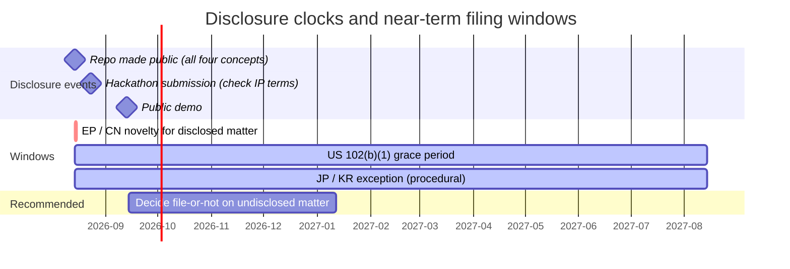
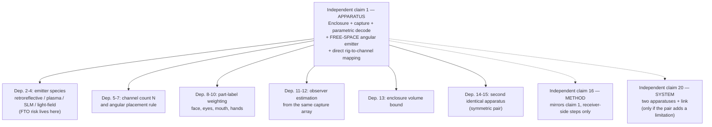

# 05 — Prior Art, Overlap Analysis, and Patent Architecture

> ### ⚠ SUPERSEDED IN PART — read [`docs/10_TAYF_UNIVERSAL_ENGINEERING.md`](10_TAYF_UNIVERSAL_ENGINEERING.md) first
>
> This document predates the current design and is kept as a **detail source and historical record**, not as a specification. Where it disagrees with document 10, document 10 wins. Specifically superseded:
> - **The device is not a 10 cm cube.** It is a family of flat apertures (20 cm slab → A4 folio → 50 cm disc → chair → mirror), sized by the aperture law. Depth is dead weight; every form is a slab.
> - **The engine is static AIRR optics**, selected. Free-space plasma, acoustic and photophoretic routes were all evaluated and ruled out with quantitative reasons (doc 10 §9).
> - **The "~85% / ~15%" framing is retired.** It described a problem that no longer exists in that shape.
> - **Viewing angle is 170°**, measured (Yamamoto 2017, `10.11370/isj.56.341`) — not the ±20–30° stated in earlier revisions, which belongs to a different mechanism.
> - **Transport is delta + int8 at 0.104 Mbps**, measured — not fp16 + LZ4, whose assumed 0.6× ratio was tested and found to *expand* the payload.

Master IP and scientific-novelty document for TAYF. Supersedes `patent/prior-art.md` (seed list) as the working prior-art record; `patent/PATENT_NOTES.md`, `patent/invention-disclosure.md` and `patent/claim-map.md` remain the short-form summaries and should be read as subordinate to this file. Search performed 2026-08-15.

---

## 0. Read this before anything else

> **This is not legal advice.** It is an engineer's prior-art record and strategy notes. Nothing here is a freedom-to-operate (FTO) opinion, a patentability opinion, or a validity opinion. Those are legal opinions that a registered patent attorney or agent must produce, on the specific claims of the specific patents involved, after reading the full file histories — none of which happened here. A claim's real scope is determined by its claim language as construed in light of the specification and prosecution history, not by its abstract or its title, and this document mostly read abstracts and claim-1 summaries.
>
> **The disclosure clock is already running, and in some jurisdictions it has already expired.** `github.com/tamim1089/tayf` is a **public** repository (verified 2026-08-15: visibility "Public", 5 commits, README and all directories readable without authentication). Its commits are dated 2026-08-14, so first public disclosure occurred on or after 2026-08-14 and no later than 2026-08-15. The published content includes `patent/invention-disclosure.md` — i.e. **all four candidate inventive concepts A–D are already published**, along with `docs/architecture.md`, `docs/theory.md`, `hardware/optical-engine.md`, `pipeline/schema.py`, and `docs/calibration.md`. In absolute-novelty jurisdictions this is prior art against TAYF's own future applications. See §2 for exactly what that costs and what is salvageable.
>
> **Two further disclosure events are already scheduled**: the hackathon submission on 2026-08-23 and the demo on 2026-09-13 (`docs/roadmap.md`). Hackathon rules frequently contain IP-assignment, licence-grant, or mandatory-publication terms. **Read the competition's terms and conditions for IP clauses before submitting.** That is a five-minute task with potentially permanent consequences.
>
> **Rigor rule applied throughout.** Every patent number below was resolved against a live database record. Numbers are tagged by evidence tier (§1.2). Where a patent family is known to exist but no number could be resolved, it is described in prose and tagged `UNVERIFIED` rather than guessed. No number in this document was reconstructed from memory.

---

## 1. Scope and method

### 1.1 What was searched

Databases: Google Patents (full-record pages and the `xhr/query` search endpoint), USPTO full-text PDFs surfaced via search, Justia Patents, plus web search for company/product-to-patent mapping. Technology clusters searched: aerial/floating-image optics; volumetric displays (swept-volume, laser-plasma, photophoretic, acoustic, fog/particle); light-field and multiview displays; computer-generated holography; observer/eye-tracked view steering; foveated allocation of display resources; model-based/parametric human coding for videotelephony; 3D telepresence terminals; neural/latent-space scene transmission; and — as a specific target — any patent claiming a small self-contained cube performing both capture and free-space display.

Academic prior art is *not* re-derived here. The 175-paper corpus in `research/deepseek_research.md` plus `research/arxiv/online_findings.md` is the standing academic record; §3.8 states only how it functions as prior art, since a paper anticipates a claim exactly as effectively as a patent does and the corpus is already the strongest anticipatory material this project owns against itself.

### 1.2 Evidence tiers

Every citation carries a tier. Do not let tiers blur when this document is quoted downstream.

| Tier | Meaning |
|---|---|
| **[V]** | **Verified.** The full patent record page was fetched during this session and title, assignee, filing date, priority date, grant date, legal status, and a claim-1 summary were read off it directly. |
| **[R]** | **Resolved.** The number appeared attached to that exact title and assignee in a database search-result record or in a delegated search pass's fetched output, but the full record was not independently re-fetched by the author of this document. Treat dates and status as probably right, claim scope as unread. |
| **[U]** | **Unverified.** A patent, family, or portfolio is known or strongly believed to exist from non-patent sources (product pages, press, academic citation), but no number was resolved. Described in prose. Never cite a number for these — there is none. |

Counts: **15 [V]**, **~55 [R]**, **~14 [U] leads**. Full counts in §11.

### 1.3 What this search is not

It is not a professional novelty search (no CPC/IPC classification sweep, no examiner-grade search-report methodology, no non-English full-text searching beyond what Google Patents machine-translates, no citation-graph expansion from the closest references). It is a broad first-pass landscape, deliberately biased toward finding the material that *kills* claims rather than material that supports them. §10 enumerates the gaps.

---

## 2. The disclosure problem, stated plainly

### 2.1 What has been published

Everything in the repository as of 2026-08-14, which includes the entire architecture, the theory doc's formalism and hypotheses, the 215-float wire format in executable form, the optical-engine mechanism ranking, the observer-tracking calibration design, the view-synthesis module's "few physical channels → neural interpolation" thesis, and — critically — the four candidate inventive concepts verbatim.

### 2.2 What that costs, by jurisdiction

This is a summary of well-settled general rules, not advice on this specific fact pattern. Dates assume first public disclosure of 2026-08-14.

| Jurisdiction | Rule for the applicant's own prior publication | Consequence for TAYF |
|---|---|---|
| **EPO / most of Europe** | Absolute novelty. EPC Art. 54 makes everything publicly available before the filing date prior art; Art. 55's exceptions are narrow (evident abuse; specific officially-recognised international exhibitions) and a GitHub push is neither. | **Anything disclosed in the repo is very likely unpatentable in Europe as of 2026-08-14.** Not recoverable. |
| **China (CNIPA)** | Absolute novelty with narrow six-month exceptions (specified exhibitions/academic meetings, disclosure against the applicant's will). A public repository does not fit. | **Very likely unpatentable in China for disclosed subject matter.** |
| **United States** | 35 U.S.C. §102(b)(1) — one-year grace period for disclosures by the inventor or derived from the inventor. | **A US filing covering the disclosed subject matter must be on file by approximately 2026-08-14 + 1 year.** After that the repository is §102(a)(1) prior art against TAYF's own application. |
| **Japan** | Patent Act Art. 30 exception, one year, but **procedural**: the application must be filed within the period and the exception must be claimed with a supporting statement/proof filed within the statutory window after filing. | Salvageable **only if the formalities are executed**. Missing the procedural step forfeits the exception even if filed in time. |
| **Korea** | Analogous 12-month exception with procedural requirements. | Same as Japan. |

### 2.3 The upside nobody mentions

Publication is not purely a loss. It is a **defensive publication**: as of 2026-08-14 the repository is citable prior art against *anyone else's* later application covering the same architecture. TAYF's freedom to build what it described is now substantially more secure than it was on 2026-08-13, because a third party can no longer obtain a patent that reads on the published architecture (absent an earlier priority date of their own). For a solo project whose realistic path to defensibility is execution speed rather than a litigated portfolio, this is a defensible position and it costs nothing further to maintain. The decision that matters is not "patent vs. publish" in general — it is whether the *specific, not-yet-invented* optical result in §6 is worth handling differently from everything else, which is already public.

### 2.4 The one thing to check immediately

Whether anything was publicly disclosed **before** 2026-08-14 — an earlier hackathon idea-capture submission, a public Devpost/registration page, a social post, a conversation without an NDA. The grace-period clocks run from the *earliest* qualifying disclosure, not from the git commit date. `pitch/idea-capture-template.md` exists in the repo; if a version of it was submitted anywhere before 2026-08-14, the US/JP/KR deadlines move earlier.

---

## 3. Prior-art landscape

```mermaid
flowchart TB
    T["TAYF architecture"]

    T --> A["Free-space image formation"]
    T --> B["Compact 3D display"]
    T --> C["Observer-adaptive emission"]
    T --> D["Parametric human transport"]
    T --> E["Two-endpoint telepresence terminal"]

    A --> A1["Retroreflective / DCRA aerial imaging\nAsukanet, Utsunomiya, NICT, Toppan\nactive to 2030-2041"]
    A --> A2["Laser-plasma voxels\nPixie Dust, active to 2036"]
    A --> A3["Photophoretic trap\nBYU, active to 2036"]
    A --> A4["Swept volume / fog\nActuality, LightSpace, IO2\nall expired"]

    B --> B1["Light-field panels\nLooking Glass, Leia, Light Field Lab, Ostendo"]
    B --> B2["CGH / SLM\nSeeReal and a very large field"]

    C --> C1["Observer-tracked view steering\nSharp 1996+, Fraunhofer, SeeReal\nexpired"]
    C --> C2["Eye-tracked view selection on a light-field display\nGoogle US11474597B2, active to 2040"]
    C --> C3["Foveated resource allocation\nbroad thicket"]

    D --> D1["Model-based coding / MPEG-4 FAP\nTI, Rockwell/Intel, Daewoo\nexpired"]
    D --> D2["Face model + per-frame points\nDuelight US11683448B2, ACTIVE to 2038"]
    D --> D3["Latent-model transmission + novel view synthesis\nIKIN portfolio, pending"]

    E --> E1["Symmetric 3D telepresence terminal\nGoogle US10327014B2, active to 2037"]
    E --> E2["Self-contained display box with camera\nProto US11428952B2, active to 2040"]
```

### 3.1 Retroreflective and dihedral-corner-reflector aerial imaging (Branch C prior art)

The commercially real, patent-covered version of "an image floating in the air with no screen." This is the closest active art to `hardware/optical-engine.md` Branch C.

| # | Number | Assignee | Filed | Priority | Status | Core claim, one sentence | Tier |
|---|---|---|---|---|---|---|---|
| 1 | US11340475B2 | Utsunomiya University | 2018-06-07 | 2015-12-07 | Active, expires 2038-12-10 | Light source + retroreflective element + beam splitter that reflects part of the emitted light to the retroreflector and transmits the return, forming an aerial image — the core AIRR patent. | **[V]** |
| 2 | US8867136B2 | Asukanet (orig. Pioneer) | 2009-04-28 | 2008-05-09 | Active, expires 2030-08-02 | Two laminated crossed arrays of longitudinal mirror elements reflect light twice to form a real floating image — the ASKA3D plate architecture. | **[V]** |
| 3 | US8724224B2 | NICT + Stanley Electric | 2011-12-02 | 2010-12-03 | Active, ~2032 | Dihedral-corner-reflector-array element forming a real image viewed from one substrate side, with glare-suppressing illumination. | [R] |
| 4 | US11947139B2 | Toppan Inc | 2020-10-23 | 2018-04-25 | Active, 2041 | Display + mirror device forming a plane-symmetric aerial image with a light-shielding aperture limiting stray light. Longest remaining term in this family. | [R] |
| 5 | US8434872B2 | NICT (Maekawa) | 2008-07-29 | 2007-07-30 | Expired (fee) | Multiple plane-symmetric real-mirror subsystems angled for multi-angle floating-image viewing. **Free to practice.** | [R] |
| 6 | US8540371B2 | Stanley Electric | 2011-05-18 | 2010-05-21 | Expired (fee) | Real-specular-image optical system + diffusing screen + projector forming a floating display. | [R] |
| 7 | WO2013129043A1 | Nitto Denko | 2013-02-06 | 2012-02-29 | Ceased | Corner-reflector unit cells with high-aspect-ratio facets for brighter mirror-image projection. | [R] |
| 8 | TWI621878B | Utsunomiya University | 2016-12-07 | 2015-12-07 | — | Aerial image display apparatus/method (TW member of the AIRR family, same 2015-12-07 priority as US11340475B2). | [R] |

**Reading:** the AIRR/ASKA3D mechanism is not merely published — it is *actively patented until 2038*, by the exact group `patent/prior-art.md` already flagged. Branch C is not a novelty opportunity. It is an FTO question. See §8.

### 3.2 Volumetric emission — plasma, trapped particle, swept volume, fog

| # | Number | Assignee | Filed | Priority | Status | Core claim | Tier |
|---|---|---|---|---|---|---|---|
| 9 | US10228653B2 | Pixie Dust Technologies (Ochiai, Hoshi, Rekimoto, Kumagai, Hasegawa, Hayasaki) | 2016-04-07 | 2016-04-07 | Active, expires 2036-04-07 | Femtosecond source + CGH-computing processor + SLM + 3D scanner + focusing lens ionising air at addressed focal points, with spatial audio. | **[V]** |
| 10 | US10129517B2 | Brigham Young University (Smalley, Squire) | 2015-12-04 | 2014-12-05 | Active, expires 2036-08-15 | Optically trapped particle scanned in 3D and illuminated by a second visible source for full-colour free-space volumetric imagery with occlusion. | **[V]** |
| 11 | US6806849B2 | LightSpace Technologies (Sullivan) | 2002-03-20 | 1998-04-20 | Expired | Stack of switchable-translucency planes scattering depth-sequenced projected slices — solid-state multiplanar volumetric display. **Free to practice.** | [R] |
| 12 | US6554430B2 | Actuality Systems (now Gula Consulting) | 2001-09-06 | 2000-09-07 | Expired | Rotating relay-lens/screen/projection assembly on a common axis — the Perspecta swept-screen architecture. **Free to practice.** | [R] |
| 13 | US7277226B2 | Actuality Systems (now Intellectual Ventures Assets 20) | 2005-01-14 | 2004-01-16 | Expired | Rotating diffuser + projector with limited horizontal exit-pupil angle for zone-based stereo. | [R] |
| 14 | US6512498B1 | Actuality Systems (Favalora) | 2000-06-19 | 1999-06-21 | Expired (lapsed) | Dual periodic-signal multiplexer driving a stroboscopic source synchronised to a moving screen. | [R] |
| 15 | US5231538A | Texas Instruments → Raytheon | 1992-03-11 | 1991-08-07 | Expired | Beam scanner + lens pair producing variable-depth waists on a spinning disk — foundational rotating-volume display. | [R] |
| 16 | US6857746B2 | IO2 Technology (Dyner) | 2003-05-07 | 2002-07-01 | Expired | Self-generated atomised-particle screen + projector + intrusion detection — the Heliodisplay. Notably combines display generation with interaction capture in one system. | [R] |
| 17 | US5270752A | Dentsu Tec / Ushio U-Tech | 1992-12-04 | 1991-03-15 | Expired | Paired air-curtain nozzles + fog outlet forming a stable projection screen — earliest fog-screen priority found. | [R] |
| 18 | WO2023227890A1 | UCL Business (Hirayama, Christopoulos, Martinez Plasencia, Subramanian) | 2023-05-25 | 2022-05-27 | Ceased at WO stage (national status unconfirmed) | Real-time transducer-array control computing acoustic traps to levitate and reposition a particle — computational basis of the MATD display. | [R] |
| — | Voxon Photonics | — | — | — | — | No Voxon-assigned number resolved. Their swept-surface architecture sits in the same lineage as #11–#15, most of which is expired. | **[U]** |
| — | Ultraleap / Ultrahaptics volumetric *display* | — | — | — | — | Their large estate is mid-air haptics, not levitated-particle imaging; no display-specific number resolved. | **[U]** |
| — | Displair | — | — | — | — | No assignee-specific number resolved beyond the generic fog-screen art above. | **[U]** |

**Reading:** the two mechanisms TAYF actually cares about at the north-star end — laser plasma and photophoretic trapping — are both covered by *active* patents held by exactly the groups that published the papers (`patent/prior-art.md`'s JSID 2025 and Smalley/Nature 2018 entries). The mechanisms whose patents have expired (swept volume, multiplanar, fog) are the ones TAYF ruled out on physics grounds. That correlation is not an accident: expired patents mark mechanisms that had their commercial moment and did not scale.

### 3.3 Light-field and holographic display

Enormous field; the search sampled the assignees that matter for a compact panel-based hackathon track.

| # | Number | Assignee | Filed | Priority | Status | Core claim | Tier |
|---|---|---|---|---|---|---|---|
| 19 | US11683472B2 | Looking Glass Factory (Frayne et al.) | 2021-05-24 | 2018-02-27 | Active | Lenticular optic over a high-index optical volume producing angle-dependent multiview 3D without eyewear. | [R] |
| 20 | US11425363B2 (appl. US20210321081A1) | Looking Glass Factory | 2021-04-09 | 2020-04-09 | Active | Acquire multiple views, compress into light-field images/video, decode for display, **and interpolate between stored views to recover intermediate perspectives.** Independent re-fetch blocked by HTTP 503; number/title/assignee pairing resolved. | [R] |
| 21 | WO2015016844A1 / US10649128B2 | Leia Inc (Fattal, Peng, Santori) | 2013-07-30 | 2013-07-30 | WO ceased; US active | Multibeam diffraction-grating backlight coupling out beams with distinct angular directions for glasses-free multiview. | [R] |
| 22 | US11474370B2 | Light Field Lab (Karafin, Bevensee) | 2019-09-30 | 2018-09-28 | Active | Optical relay repositioning/redirecting a holographic light-field projection relative to a virtual screen plane while preserving depth. | [R] |
| 23 | US11681092, US11073657, US11796733B2 | Light Field Lab | — | — | Active | Energy-relay / Transverse-Anderson-Localization architectures tiling devices into a seamless high-density energy surface. | [R] |
| 24 | US7623560B2, US7829902B2, US7767479B2, US8049231B2, US8243770B2, US8567960B2 | Ostendo Technologies (El-Ghoroury) | 2007–2012 era | — | Mixed | Quantum Photonic Imager emissive micro-display device family. | [R] |
| 25 | US10453431B2 / WO2017190097A1 | Ostendo Technologies | — | 2016 era | Active | Integrated near-field and far-field light-field display system. | [R] |
| 26 | SeeReal cluster: US8958137B2, US8416479B2, US8416276B2, US10401794B2, US20110304895A1, US20100118117A1, US20110149018A1, CN101802727B | SeeReal Technologies | 2007-10-26 typical | 2002–2007 | Mixed | Sub-hologram / 2D-encoding holographic display architecture, incl. **US8416276B2 "Mobile telephony system comprising holographic display"** and **US8416479B2 "Compact holographic display device"**. | [R] |
| 27 | US8625183B2 | Javid Khan | 2009-03-05 | 2008-03-07 | — | Three-dimensional holographic volumetric display. | [R] |
| — | VividQ, Envisics/Dualitas, Sony ELF-SR, Samsung Odyssey 3D | — | — | — | — | Portfolios known to exist from product/press sources; no number resolved to assignee with confidence. | **[U]** |

**Reading:** SeeReal's *"Compact holographic display device"* and *"Mobile telephony system comprising holographic display"* (priority 2006) are a warning: "small holographic display, used for a phone call" was claimed twenty years ago. The specific framing TAYF sometimes reaches for in pitch language is old.

### 3.4 Observer-tracked emission and foveated allocation — the cluster that matters most

This is the prior art that bears directly on invention-disclosure Concepts B and C.

| # | Number | Assignee | Filed | Priority | Status | Core claim | Tier |
|---|---|---|---|---|---|---|---|
| 28 | **US11474597B2** | **Google LLC** (Pulli, Wetzstein, Spicer, Jones, Maila, Economou) | 2020-11-02 | 2019-11-01 | **Active, expires 2040-11-02** | Multiview autostereoscopic display with an angular-pixel array and an eye tracker; the processing system **renders a specific view for each detected eye based on that eye's location** and drives the angular pixels to display that view **only in the viewing zone where that eye was detected.** | **[V]** |
| 29 | US6008484A | Sharp K.K. (Woodgate, Moseley, Harrold) | 1997-09-25 | 1996-09-27 | Expired | Tracks the observer with a display-mounted sensor and moves the parallax optic to hold viewing windows on the eyes. | [R] |
| 30 | US6377295B1 | Sharp K.K. (Woodgate, Moseley, Ezra) | 1997-08-12 | 1996-09-12 | Expired | Mechanically steps a parallax optic to keep viewing windows aligned with tracked observer position. | [R] |
| 31 | EP0877274A2 | Sharp Corp (Holliman, Hong, Ezra, Woodgate) | 1998-04-17 | 1997-04-17 | Withdrawn (still prior art) | Video-based fast image tracking feeding an observer-tracking autostereoscopic display, no markers. | [R] |
| 32 | US8319824B2 | Fraunhofer-Gesellschaft (de la Barré, Przewozny, Pastoor) | 2008-12-30 | 2006-07-06 | Expired (fee) | Continuous subpixel-intensity weighting that reallocates stereo content across the pixel matrix in real time to follow head position. | [R] |
| 33 | US7872635B2 | Optimetrics Inc → B. Mitchell | 2004-05-14 | 2003-05-15 | Expired (fee) | Foveated display presenting high spatial resolution at the tracked point of gaze, blurred elsewhere. | **[V]** |
| 34 | US11368671 / US10999573 | Raxium Inc (acquired by Google 2022) | — | — | Active | "Partial light field display architecture": picture elements split into 2D-output and 3D-output emitter subsets with electronics that **dynamically reallocate** which emitters serve which output. | [R] |
| 35 | US11710469, US11238836, US11644669, US12183310 (family, title "Depth based foveated rendering for display systems") | Assignee **not independently confirmed** | — | — | Active | Fovea-tracked content rendered at higher angular resolution than head-tracked content. Numbers and title seen together in USPTO full-text results; assignee attribution not verified. | [R]/[U] on assignee |
| 36 | US10733924 ("Foveated light field display") | Assignee unconfirmed (Ostendo-adjacent) | — | — | — | Gaze-driven resolution allocation for a light-field display. | [R]/[U] on assignee |
| 37 | EP4359847A1 | IKIN Inc (Griffith) | 2022-06-21 | 2021-06-21 | Deemed withdrawn 2024-07-31 (still prior art) | Holographic display system where "the volumetric projection is adapted in response to the position of the user." | **[V]** |
| — | SeeReal "Tracked Viewing Windows" | SeeReal Technologies | — | — | — | Eye-tracked placement of the holographic viewing window per frame; mechanism documented on the company's own pages, specific number not resolved. | **[U]** |
| — | PCMS Holdings / InterDigital family | InterDigital VC Holdings (assigned 2023) | — | — | — | Described in search records as claiming eye trackers used to **reduce the number of views generated**, generating views only for tracked eye locations plus adjacent zones for tracking uncertainty. Strong second family on the same concept; **no number resolved.** Highest-priority follow-up. | **[U]** |

**Reading — this is the single most consequential finding in the document.** "Use observer/eye tracking to decide which angular content the display physically emits, and don't emit the rest" is claimed at four independent levels of the stack: mechanically (Sharp, 1996), computationally at subpixel granularity (Fraunhofer, 2006), foveally (2003 onward, broad thicket), and — decisively — **on a multiview light-field display with per-eye view selection, by Google, granted, and in force until 2040.** Concept B's "candidate novelty" as written in `patent/invention-disclosure.md` ("coupling the *selection* of what to physically emit to a live perceptual/observer-position estimate") is anticipated by US11474597B2 on its face.

### 3.5 Parametric human transmission — model-based coding

| # | Number | Assignee | Filed | Priority | Status | Core claim | Tier |
|---|---|---|---|---|---|---|---|
| 38 | US6044168A | Texas Instruments (Tuceryan, Flinchbaugh) | 1997-11-14 | 1996-11-25 | **Expired** | Encoder locates facial features, encodes the face as eigenface parameters, **transmits only those parameters and feature coordinates instead of the image**; the decoder warps a generic 3D face model and texture-maps it to reconstruct the face. Whole face codable in 448 bytes. | **[V]** |
| 39 | US6069631A | Rockwell Science Center → Intel | 1998-01-16 | 1997-02-13 | Expired | Spatial (KLT) + temporal (DCT) compression of the 68 MPEG-4 facial animation parameters for band-limited synthetic talking-head transmission, ~2 orders of magnitude bitrate reduction. | [R] |
| 40 | US5818463A | Rockwell Science Center → Intel | 1997-02-13 | 1997-02-13 | Expired | Mesh + animation-parameter compression for animated 3D objects, demonstrated on facial animation parameters. | [R] |
| 41 | US5852669A | Lucent (AT&T lineage) → Nokia of America | 1995-07-10 | 1994-04-06 | Expired | Automatic face/feature detection biasing H.261 bit allocation toward the face region. | [R] |
| 42 | CN1188948A | Daewoo Electronics | 1997-12-22 | 1996-12-27 | Status listed "Pending"; natural term long past | Extracts facial deformation parameters from video + voice, transmits parameters instead of video, reconstructs on a pre-shared generic 3D head model at the receiver. | [R] |
| 43 | **US11683448B2** | **Duelight LLC** (Rivard, Kindle, Feder) | 2021-12-06 | **2018-01-17** | **Active, expires 2038-11-30** | Receiving device obtains an **initial face model containing facial nodal points**, then receives **real-time updates consisting of additional facial nodal points**, and **adjusts the model according to those updates** — i.e. model once, parameters per frame. Continuations reported: US10880521, US10708545 (same family, not individually verified). | **[V]** |
| — | France Telecom, Philips, NTT, Mitsubishi Electric, Samsung 1990s model-based coding | — | — | — | — | Academic record (Aizawa/Harashima, Nakaya/Chuah, Lavagetto/Curinga) confirms extensive activity 1989–1994; no numbers resolved. Almost certainly expired if they exist. | **[U]** |
| — | Meta Codec Avatars; Apple Persona; Microsoft Holoportation | — | — | — | — | All three technologies are heavily published and near-certainly patented; **no number could be resolved to any of them in this pass.** This is a real gap, not an absence of art. | **[U]** |

**Reading:** TAYF's headline framing — *"the network carries a person's state, not their video"* (`docs/architecture.md`) — was claimed in 1996 by Texas Instruments, in an expired patent, in nearly the same words. That is good news for freedom to operate and terminal news for novelty. The live risk is **US11683448B2 (Duelight, priority 2018-01-17, in force to 2038)**, which claims model-once-then-nodal-points-per-frame and reads uncomfortably close to `pipeline/schema.py`'s enrolled-avatar-plus-215-floats design. Duelight is a patent-assertion-active entity in the imaging space; this is the highest-priority FTO item in the document even though the claim is directed at *facial* nodal points and TAYF's stream is body+face+hands over an SMPL-family rig.

### 3.6 Telepresence terminals and self-contained display boxes

| # | Number | Assignee | Filed | Priority | Status | Core claim | Tier |
|---|---|---|---|---|---|---|---|
| 44 | **US10327014B2** | **Google LLC** (Goldman, Lawrence, Huibers, Russell, Seitz) | 2017-09-08 | 2016-09-09 | **Active, expires 2037-09-08** | Telepresence terminal with a lenticular/microlens display generating location-dependent images from remote depth+image data, plus local IR-depth and visible capture — glasses-free stereoscopic two-way communication. **Both terminals capture and display; the architecture is symmetric.** The Starline/Beam family. | **[V]** |
| 45 | **US11428952B2** | **Proto Inc** (Nussbaum) | 2020-12-04 | 2019-12-06 | **Active, expires 2040-12-04** | Self-contained box: LED panels behind a translucent diffuser on rear/sides/top/bottom, transparent LCD at the front, **camera at the top capturing the local audience**, presenting a remote subject as a hologram-like image. | **[V]** |
| 46 | US9332219B2 | Korea Institute of Science and Technology | 2013-11-18 | 2013-09-03 | Active | Bidirectional telepresence device that captures the local user and displays the remote one — but in a wheeled robot form factor. | [R] |
| 47 | US10084990B2 | G. D. Smits (via Samsung 2020, back to Smits 2023) | 2017-11-06 | 2016-01-20 | Active | "Holographic video capture and telepresence system" — requires a head-mounted projection display; asymmetric. | [R] |
| 48 | US8208007B2 | TelePresence Technologies LLC | 2007-09-24 | 2004-04-21 | Active to ~2028 | Two-way-mirror/backdrop architecture for eye-contact 3D presence; room-installation scale. | [R] |
| 49 | US20250211457A1 | Faceport Inc | 2024-12-24 | 2023-12-24 | Pending | "Telepresence with a human avatar" — transmits facial vector/landmark data in some embodiments, but the primary architecture is a human surrogate wearing a headset. | [R] |
| 50 | JP4845336B2 | Semiconductor Energy Laboratory (Miyagawa, Yamazaki) | 2003-07-16 | 2003-07-16 | Expired 2023 | Display with imaging apparatus positioned around (not behind) the display elements, **for a bidirectional communication system where both parties see each other while being captured.** | **[V]** |
| — | Holoconnects (Holobox), ARHT Media, Musion | — | — | — | — | Commercial Pepper's-ghost telepresence products; **no numbers resolved.** Must be checked before any product launch. | **[U]** |

**The specific target question — is there a patent on a small cube that both captures a person and displays a remote person in free space?** Across three independent search passes: **no such patent was found.** The near misses each fail on a different axis — Google's terminal is symmetric and compact-ish but screen-bound (lenticular panel); Proto's is a self-contained box with a camera but the display is a transparent LCD (screen-bound) and the capture path is audience-reaction feedback rather than 3D reconstruction of the local party; KIST's is bidirectional but a robot; Smits' needs a headset. **This is the only white space the search found, and §5 explains why it is much thinner than it looks.**

### 3.7 Latent-representation transport driving a compact 3D display — the IKIN portfolio

This portfolio was not in `patent/prior-art.md` and is the most architecturally similar body of work found. **IKIN, Inc.** holds ~29 patent documents (count from the database result header) spanning a compact pepper's-ghost holographic accessory *and* a 2023–2024 wave of neural-transport filings.

| # | Number | Filed | Priority | Status | Core content | Tier |
|---|---|---|---|---|---|---|
| 51 | US11258890B2 | 2020-03-11 | 2018-07-30 | Active to 2039-01-02 | Portable terminal accessory: case receiving a phone, hinged projector, reflective element creating holographic images. Self-powered, but not self-contained (needs the phone) and has no capture path. | **[V]** |
| 52 | EP3938844B1 | 2020-03-11 | 2019-03-11 | Granted (EP) | Same family, European member. | [R] |
| 53 | US12169295B2 | 2021-12-23 | 2020-12-23 | Active | Micro-layered multi-phase lens design and optical system for enhanced pepper's-ghost effect. | [R] |
| 54 | EP4359855A2 | 2022-06-21 | 2021-06-21 | — | Collapsible holographic projection accessory. | [R] |
| 55 | EP4359847A1 | 2022-06-21 | 2021-06-21 | Withdrawn | Adaptive holographic projection with user tracking (see §3.4 #37). | **[V]** |
| 56 | WO2024233389A2 | 2024-05-03 | 2023-05-08 | WO ceased (national phase unverified) | **"Latent space neural encoding for holographic communication."** Claim 1: receive frames + camera extrinsics, train a network to encode the scene as models in a latent space, transmit the encoded models to a viewing device whose latent decoder generates novel 3D views. Specification discusses separating live/moving subjects from static objects and applying **higher-quality processing to face, hands, and body pose.** | **[V]** |
| 57 | WO2024238177A1 | 2024-05-03 | 2023-05-12 | — | Spatio-temporal polynomial latent novel view synthesis for holographic video. | [R] |
| 58 | US20250124613A1 | 2024-10-07 | 2023-10-13 | Pending | Receive a machine-learned latent model at one device, decode it to imagery from a viewpoint aligned with the second device's screen, for eye-to-eye contact in videoconferencing. | **[V]** |
| 59 | US20250054226A1 | 2024-07-30 | 2023-08-10 | Pending | Novel view synthesis of dynamic scenes using a multi-network codec. | [R] |
| 60 | US20250088618A1, US20250078336A1, US20250097439A1, US20250133238A1, US20250191138A1, US20250202697A1, US20250117897A1, US12437456B2 | 2024 | 2023 | Mixed pending/granted | Diffusion-based video communication and streaming, spotlight training of latent models, network-intermediary transcoding for diffusion compression, adapter models, authenticated diffusion communication. | [R] |
| 61 | USD876419S1, USD988277S1, USD994011S1, USD1009969S1 | 2017–2021 | — | — | **Design** patents on holographic projection device housings. | [R] |

**Reading:** IKIN has independently arrived at close to TAYF's software thesis — encode the human into a compact learned representation, transmit *that*, synthesise novel views at the receiver, display on a compact pseudo-holographic optic, adapt the projection to the tracked user position — and started filing on it in 2021–2023, two to five years before TAYF's disclosure. Their claims are directed at *latent scene models* rather than a *parametric rig with a persistent enrolled avatar*, and their optics are pepper's ghost rather than free space, so they are not a literal anticipation of every element. But as §102/§103 material against Concepts B, C and D they are strong, and their spec's explicit "higher-quality processing to face, hands, and body pose" language directly anticipates the perceptual-allocation idea in `docs/theory.md`.

Note also the design patents: IKIN and Proto both hold them. Two of the three companies nearest TAYF's product form protect the *shape* of the device, not the physics. That is a signal about what is actually obtainable in this space (see §7.4).

### 3.8 Academic prior art

A published paper is prior art under §102(a)(1) exactly as a patent is. `research/deepseek_research.md` (175 papers), `research/arxiv/online_findings.md`, and `patent/prior-art.md`'s list therefore constitute an anticipation inventory that TAYF has already assembled against itself. The items with the sharpest claim-killing effect:

- **Mon3tr (arXiv 2601.07518)** — monocular 3D telepresence with a **pre-built Gaussian avatar** driven by a **215-float per-frame state** at **<0.2 Mbps / ~80 ms**. This is not "related work." It is the exact architecture of TAYF's solved half, published, with numbers. Every element of `pipeline/schema.py` and `pipeline/avatar/README.md` is anticipated by it.
- **altiro3D (arXiv 2506.08064)** — open-source webcam → depth → view synthesis → Looking Glass panel pipeline **explicitly naming video conferencing as a use case**. Anticipates the hackathon-track pipeline end to end.
- **Fairy Lights in Femtoseconds (arXiv 1506.06668)** and the JSID 2025 fist-sized laser-plasma display — free-space aerial voxel graphics, published, and additionally patented (§3.2 #9).
- **Smalley et al., Nature 2018** — photophoretic free-space volumetric imagery, published and patented (§3.2 #10).
- **Yamamoto/Suyama AIRR line, Optics Express 22(22):26919 (2014)** onward — published and patented (§3.1).
- **Gaussian Wave Splatting / Random-phase Wave Splatting (arXiv 2505.06582, 2508.17480)** — closed-form Gaussian-splat-to-hologram transform. This is prior art against the exact bridge Concept D would need, even though its authors never pointed it at human content.
- **arXiv 2401.02171** — the flat-2D-cutout co-presence result. Prior art against any claim whose inventive step is "less optical information suffices for presence," because the proposition is already published.

---

## 4. The overlap matrix

Each row is an architectural element of TAYF as actually specified in this repository. "Closest art" cites the nearest reference found. "Status" is a novelty judgement about *that element standing alone*, not about the combination.

| # | TAYF element (as specified) | Closest prior art found | Status |
|---|---|---|---|
| 1 | **Symmetric cube endpoints** — both terminals identical, each simultaneously capturing its local human and reconstructing the remote one (`docs/architecture.md`) | US10327014B2 (Google) — explicitly symmetric capture+3D-display terminals, active to 2037. JP4845336B2 (SEL, expired) — display with surrounding cameras expressly for bidirectional see-each-other communication. US9332219B2 (KIST). | **Anticipated.** Symmetry is a well-known telepresence topology. Being *in a cube* is a non-functional geometric choice; geometry alone does not confer patentable novelty on an otherwise-known combination, though it is protectable by a **design** patent. |
| 2 | **Parametric-state-only transmission** (215 floats/frame, <0.2 Mbps, no video) | US6044168A (TI, 1996 priority, expired) — transmit eigenface parameters + feature coordinates instead of the image, reconstruct on a 3D model at the receiver. US6069631A, US5818463A, CN1188948A. **US11683448B2 (Duelight, ACTIVE).** Mon3tr (arXiv 2601.07518) — the exact 215-float figure. | **Anticipated, thoroughly, and for thirty years.** Free to practice against the expired art; an FTO question against Duelight. Zero novelty. |
| 3 | **Persistent enrolled avatar + per-frame driving parameters** (one-time build, then drive) | US11683448B2 claim 1 — initial face model containing nodal points, then real-time nodal-point updates adjusting that model. US6044168A's generic-model-plus-parameters decoder. Mon3tr's ~33 s one-time avatar build. IKIN WO2024233389A2's train-once-latent-model-then-transmit architecture. | **Anticipated.** The enroll-once/drive-per-frame split is the defining structure of model-based coding and has been since the 1990s. |
| 4 | **Pluggable optical-engine abstraction** (renderer targets an abstract interface; engine swappable) | No specific patent needed. This is a software interface/architectural pattern; hardware-abstraction layers are ubiquitous and, standing alone, sit squarely in §101 abstract-idea territory absent a specific technical improvement. | **Not patentable subject matter as such.** Correct engineering (`hardware/optical-engine.md` is right to keep it), but it is a claim-drafting liability, not an asset: a claim that recites "an abstract optical engine interface" recites nothing physical. |
| 5 | **Observer-position-driven angular allocation** (emit only into directions an observer occupies) | **US11474597B2 (Google, active to 2040)** — per-eye view rendering driven by eye-tracker location, displayed only into the zone where that eye was detected. Sharp US6008484A/US6377295B1 (1996). Fraunhofer US8319824B2. IKIN EP4359847A1. SeeReal tracked viewing windows **[U]**. PCMS/InterDigital family described as claiming eye tracking to *reduce the number of views generated* **[U]**. | **Anticipated, at the exact level of abstraction TAYF states it.** This is Concept B's stated novelty and it does not survive contact with US11474597B2. |
| 6 | **Neural view synthesis filling gaps between sparse physical optical channels** | US11425363B2 (Looking Glass) — interpolating between stored views to recover intermediate perspectives for a compact 3D display. IKIN WO2024233389A2 / WO2024238177A1 / US20250054226A1 — latent decoding to novel 3D views for a holographic display. altiro3D (arXiv 2506.08064). The entire NeRF/3DGS novel-view-synthesis literature. | **Anticipated in substance.** "Neural" versus "interpolated" is not a patentable distinction by itself; a specific network architecture solving a specific stated technical problem might be, but TAYF has no such architecture yet — `pipeline/view_synthesis/README.md` states the plan is to fork arXiv 2506.08064. |
| 7 | **Perceptual allocation of the optical/representation budget** (face, eyes, mouth, hands first) | US7872635B2 (foveated display at point of gaze, 2003). The "Depth based foveated rendering" family (#35). US10733924 "Foveated light field display" **[U on assignee]**. US5852669A (Lucent, 1994) — bias bit allocation toward the face region. IKIN WO2024233389A2's spec — "higher-quality processing to human features such as face, hands, and body pose." | **Anticipated**, in both the display-resource sense (foveation, since at least 2003) and the human-content sense (face-priority bit allocation, since 1994). |
| 8 | **Free-space, non-screen-bound output** | The whole of §3.1 and §3.2. Active: Utsunomiya US11340475B2, Asukanet US8867136B2, Toppan US11947139B2, Pixie Dust US10228653B2, BYU US10129517B2. | **Anticipated as a category**, and additionally *blocked in practice* on the two mechanisms TAYF most wants. Free-space output is an FTO problem before it is a novelty problem. |
| 9 | **~10 cm form factor / 1000 cm³ envelope** | Miniaturisation of a known apparatus is not inventive absent a technical solution that makes it possible. SeeReal US8416479B2 ("Compact holographic display device") and US8416276B2 ("Mobile telephony system comprising holographic display", 2006 priority) already claim compactness in this space. | **Not novel as a constraint.** Novel only if a *specific optical architecture* is what makes the size achievable — which is precisely what TAYF has not built yet. |
| 10 | **Network-aware agent layer** (CAMARA Congestion Insights / QoD slice requests) | CAMARA is a published open standard; using a published API as documented is the definition of practising prior art. Network-QoS-aware media adaptation has decades of art. | **Anticipated. Not a patent asset under any framing.** It is a demo asset and a hackathon-scoring asset; treat it as such. |
| 11 | **Driving a free-space emitter *directly* from a parametric human rig, without an intermediate multi-view raster** | Nothing found. Google drives a lenticular panel from depth+image data; IKIN decodes a latent model to *images*; model-based-coding art reconstructs *images* on a 2D display. No reference found in which the receiver maps a skeletal/blendshape parameter vector onto the drive signals of a free-space angular emitter. | **Not found anticipated.** Thin, specific, and unproven — see §5.2. |
| 12 | **Choosing the physical channel count N as a measured function of a perceptual-parity criterion** | `experiments/angular-resolution/README.md` and `experiments/perceptual-quality/README.md` describe the experiment; no one has published the result. arXiv 2401.02171 published an adjacent result on a different device class. | **Not found anticipated — because it does not exist yet.** This is the one place where new *data* could create new patentable matter. |

---

## 5. Honest verdict

### 5.1 What is already known and unpatentable

Every element of TAYF's block diagram, taken individually, and most of the pairwise combinations. Specifically: capturing a human and transmitting a compact parametric representation instead of video (1996); a persistent model at the receiver driven by per-frame parameters (1996, re-claimed 2018 and in force); symmetric two-terminal capture-and-3D-display (2016, in force); observer-tracked selection of which angular views a 3D display emits (1996 mechanically, 2019 on a light-field display, in force to 2040); interpolating unemitted views from a sparse set (2020, in force); face/hand-priority quality allocation (1994 and 2023); free-space image formation by every mechanism TAYF has ranked (1991–2016, several in force); compactness as an aspiration (2006).

**The four concepts in `patent/invention-disclosure.md`, as written, do not survive this search.** Concept A is US10327014B2 plus a shape. Concept B is US11474597B2 plus US11425363B2. Concept C is a statement that things should be jointly optimised, which is a design philosophy, not a claim limitation — it recites no structure and would not survive §112 definiteness even if it were novel. Concept D is Concept B restated as cooperation between the same three components.

The general framing the project already knew to avoid — "a hologram cube," "displaying a person holographically" — is correctly identified in `patent/PATENT_NOTES.md` as unpatentable. What this search adds is that the *next layer down*, the layer the project believed was its novelty, is also occupied.

### 5.2 What is genuinely differentiated

Three things, in descending order of confidence, and none of them is large.

**(a) The specific coupling in matrix row 11: parametric-rig-to-free-space-emitter, with no intermediate image.** Everyone found in this search who transmits a compact human representation reconstructs *pixels* — a lenticular quilt, a latent-decoded image, a texture-mapped model rendered to a frame buffer, a transparent LCD. Everyone found who emits free-space light drives the emitter from *geometry or scan patterns generated from imagery*. Nobody found closes the loop from a 215-float skeletal/blendshape vector directly onto the drive parameters of an angular free-space emitter, with the emitter's angular sampling chosen from the rig's semantic part labels (face, hands) plus the observer estimate. That is genuinely specific, and it is specific *because* it is the intersection of two fields that have not met. Caution: unmet fields usually stay unmet because the intersection is useless or impossible, not because nobody thought of it. TAYF has not yet demonstrated it is either useful or possible.

**(b) The measured perceptual-parity result that does not exist yet.** If `experiments/angular-resolution/` and `experiments/perceptual-quality/` produce a defensible number — *N physical angular channels driven this specific way achieves conversational-presence parity with M ≫ N channels* — then that number is the "unexpected result" that non-obviousness arguments are actually built from. Under KSR, combining Google's eye-tracked view selection with Looking Glass's interpolation is an obvious combination of known elements yielding predictable results. It stops being obvious if the combination produces a result the art teaches away from or would not predict. TAYF cannot make that argument today. It could make it after the experiment.

**(c) A specific optical architecture that fits the 10 cm path.** This is the north-star and, per `hardware/optical-engine.md`, does not exist. If it comes to exist it is real patentable subject matter of the ordinary, respectable kind — a device claim on an optical arrangement. Everything else in this document is a distraction from the fact that **this is the only place a strong patent was ever going to come from.**

### 5.3 Where the defensible novelty actually sits

**Downstream of the lab, not upstream of it.** TAYF's patent position today is approximately zero, and no amount of claim drafting changes that, because the architecture is the prior art. The position becomes non-zero at exactly the moment a measurement or an optical build produces something the literature does not contain. `docs/roadmap.md` already calls the north-star track "a publishable/patentable research program" — that instinct is correct, and this search's contribution is to say that it is the *only* one.

The honest strategic ranking:

1. **Speed and execution.** Nothing here is defended by a patent; it is defended by shipping. Given a solo builder and a September demo, this is not a consolation prize, it is the correct primary strategy.
2. **Defensive publication** (§2.3) — already achieved, free, and now protects the freedom to build.
3. **A design patent on the enclosure** if the physical object becomes distinctive. Cheap, fast, narrow, real, and demonstrably what Proto and IKIN both did.
4. **A provisional application on (a) + (b) before 2027-08-14**, if and only if the experiments produce a result. A provisional is inexpensive, needs no claims, and preserves a US date — but a provisional only supports what it actually describes with enabling detail, so filing one that describes a hoped-for result buys nothing.
5. **Trade secret on nothing**, because the repository is public. Any future secrecy applies only to material not yet written down (§9).

If the experiments do not produce a result, the correct decision is to file nothing and keep building. A patent obtained on a claim this crowded would be narrow enough to design around in an afternoon and expensive enough to hurt.

---

## 6. Refined inventive concepts

Concepts A–D from `patent/invention-disclosure.md` are retired as filing candidates for the reasons in §5.1 (they remain useful as architecture summaries). Replacements, each stated as a *testable* proposition rather than an aspiration, and each honest about what must be true before it is worth an attorney's time.

### Concept A′ — Parametric-rig-driven free-space angular emission (from matrix row 11)

A receiving apparatus in which a received per-frame parameter vector defining the pose, expression and hand articulation of a persistent enrolled volumetric human model is mapped **directly onto the drive signals of a free-space optical emitter** having a small number of independently addressable angular emission channels, such that the emitter forms an image in a region of space not coincident with any physical display surface, and where the *assignment of the limited channels to angular directions* is computed per-frame from (i) an observer-direction estimate and (ii) semantic part labels carried by the rig.

- **Why it might survive:** the prior art bifurcates cleanly — parametric transport always terminates in an image, free-space emission always originates from an image. This claim spans the gap and recites the physical emitter, which keeps it out of §101 trouble.
- **What must be true first:** a free-space emitter with addressable angular channels must exist in a form TAYF can build. Without it the claim is not enabled and cannot be filed honestly.
- **Nearest art to distinguish over:** US11474597B2 (recites a display area with angular pixels — argue "not coincident with a physical display surface"), US11683448B2 (recites face model + nodal points — argue the free-space emitter and the part-label-driven channel assignment), IKIN WO2024233389A2 (recites latent scene models decoded to imagery — argue no intermediate imagery).

### Concept B′ — Perceptually-parity-bounded channel allocation (from matrix row 12)

A method of operating a free-space 3D display for human telepresence in which the number and angular placement of physically emitted channels is selected according to an empirically-determined perceptual-parity criterion for conversational presence, with the residual angular field synthesised from the same parametric rig rather than from the emitted channels' imagery.

- **Why it might survive:** the inventive step is the *criterion and the measurement*, not the components. This is the only concept in this document whose non-obviousness argument has a factual basis available to it.
- **What must be true first:** `experiments/perceptual-quality/README.md`'s first experiment must run and produce a number. Until then this concept is a hypothesis, and `docs/theory.md` correctly labels it as such.
- **Nearest art to distinguish over:** the foveation thicket (§3.4), arXiv 2401.02171, IKIN's face/hands quality-allocation language.

### Concept C′ — A specific compact optical architecture

Whatever `experiments/voxel-display/`, `experiments/aerial-imaging/` or `experiments/light-field/` actually produces, claimed as a device: the optical layout, the element count, the geometry, the drive scheme.

- **Why it might survive:** device claims on specific optical arrangements are the ordinary currency of this field, and every strong patent in §3.1–§3.3 is one.
- **What must be true first:** it must be built and it must work.
- **Nearest art to distinguish over:** depends entirely on branch. Branch C runs straight into Utsunomiya/Asukanet/Toppan/NICT; Branch A into Pixie Dust; Branch B into Looking Glass/Leia/Google.

### Concept D′ — Retired, not replaced

Concept D (cooperative design of sparse emission + compact representation + neural synthesis) is not a claim. "These three things were designed with each other in mind" recites no structure, no step, and no boundary. It is a good description of the engineering and it belongs in `docs/architecture.md`, where it already is. Do not put it in front of an attorney as a filing candidate.

---

## 7. Claim architecture

Notes on how a filing *would* be structured if §6's preconditions are ever met. Written to be useful to the attorney who will rewrite all of it.

### 7.1 What the independent claim must recite

- **An apparatus, not a method of communicating.** A method claim whose steps are "receive parameters, compute, display" invites a §101 abstract-idea rejection and is nearly unenforceable across a network boundary anyway (divided infringement: the sender and receiver are different parties).
- **The physical emitter, structurally.** "A free-space optical emitter comprising a plurality of independently addressable angular emission channels arranged to form a visible image in a region of space outside the enclosure that is not coincident with any physical light-scattering or light-modulating surface of the apparatus." The negative limitation is what distinguishes over Google (lenticular panel), Proto (transparent LCD), IKIN (pepper's-ghost reflector), and Looking Glass — all of which terminate at a surface. **This limitation is doing all the work; if it is dropped in prosecution the claim is dead.**
- **The direct mapping.** "...a renderer configured to generate the drive signals for said channels from the received parameter vector and the enrolled model **without generating an intermediate multi-view image set**." Another negative limitation, and the one that distinguishes over the entire novel-view-synthesis line including US11425363B2 and IKIN's decoders.
- **The allocation rule as structure, not intent.** Not "wherein the channels are perceptually allocated" (indefinite) but "wherein the mapping assigns channels to angular directions as a function of an observer-direction estimate and of part labels associated with subsets of the enrolled model."

### 7.2 What must stay *out* of the independent claim

- Any specific optical mechanism — that belongs in dependents, both because it narrows unnecessarily and because `patent/claim-map.md`'s existing guidance (do not lock to one mechanism) is correct.
- The cube shape and the 10 cm dimension — non-functional, invites an easy design-around, and belongs in a dependent claim at most.
- The symmetry of the two endpoints — it adds no limitation the examiner will credit and it creates a two-party infringement problem. Put it in a dependent claim or a separate system claim.
- The number 215, the CAMARA layer, WebRTC, and every other implementation detail that is either prior art or irrelevant to novelty.

### 7.3 Dependent-claim strategy

Dependents exist to (i) provide fallback positions when the independent claim is rejected and (ii) capture commercially important embodiments. Order them from broadest fallback to narrowest embodiment, and make sure at least one dependent recites the *measured* result from Concept B′ — that is the one an examiner is most likely to allow, and a narrow allowed claim beats a broad rejected one.

### 7.4 The parallel track worth more than any of this

**File a design patent (US) / registered design (EU, UK, CN) on the enclosure** once the industrial design is fixed. Cost and time are a fraction of a utility filing, examination is minimal, and the protection is real against the specific thing a copyist would do — make a cube that looks like TAYF's. Proto holds one (D1,134,257 S, grant date **[U]** — reported only via press, not confirmed on a database). IKIN holds four (§3.7 #61). Note that design rights have **no grace period in the EU beyond a 12-month disclosure grace for registered Community designs and none for the shape once genuinely disclosed in some jurisdictions** — and the repo does not currently disclose an industrial design, so this window is intact. **This is the one piece of IP TAYF has not already given away.**

---

## 8. Freedom to operate — separate question, larger risk

Patentability and FTO are independent. TAYF could have zero patentable novelty and still infringe; it could also have a patent and still infringe. For a device intended to be demonstrated publicly and possibly sold, FTO is the more urgent question, and this section is the closest thing to a warning list this document can honestly produce.

| Path in `hardware/optical-engine.md` | Blocking art in force | Exposure |
|---|---|---|
| **Branch C — retroreflective / aerial imaging** | Utsunomiya US11340475B2 (to 2038), Asukanet US8867136B2 (to 2030), NICT/Stanley US8724224B2 (~2032), Toppan US11947139B2 (to 2041) | **High.** This is the hackathon track's leading candidate. Mitigation: **buy a genuine ASKA3D or equivalent licensed plate** — patent exhaustion means an authorised sale of that unit exhausts the patentee's rights in it. Do not fabricate a corner-reflector array in-house. |
| **Branch A — laser plasma** | Pixie Dust US10228653B2 (to 2036) | **High** if the architecture uses SLM/CGH beam shaping + 3D scanning, which is exactly claim 1. Also a Class 4 laser safety problem (`hardware/optical-engine.md`) that dwarfs the patent issue. |
| **Photophoretic trap** | BYU US10129517B2 (to 2036) | High, but moot — already ruled out on physics. |
| **Light-field panel (hackathon track)** | Looking Glass, Leia, Light Field Lab, Google/Raxium portfolios | **Low if a commercial panel is purchased** (exhaustion). Rises sharply if TAYF builds its own multiview optic. |
| **Eye/observer-tracked view selection** | **Google US11474597B2 (to 2040)** | **Moderate to high, and it applies to the software regardless of which panel is bought.** `docs/calibration.md` method 2 (camera-based head/eye tracking driving angular prioritisation) is close to this claim. The hackathon-track default (method 1, fixed nominal viewing position, no tracking) is *outside* it — an accidental but real reason to keep the demo simple. |
| **Parametric face-model transport** | **Duelight US11683448B2 (to 2038)** | **Moderate.** TAYF's stream is body+face+hands over an SMPL-family rig, not "facial nodal points," and the enrolled avatar is a Gaussian model rather than a face model — arguable distinctions, but they are arguments, not clearances. |
| **Pepper's-ghost style compact optic** | IKIN US11258890B2 (to 2039), US12169295B2; Proto US11428952B2 (to 2040) | Relevant only if TAYF falls back to a reflector-based demo optic. Proto's claim is closely tied to its diffuser-box construction. |

**None of the above is an FTO opinion.** Each row is a "someone should look at this properly" flag. The three that would go to an attorney first, in order: Google US11474597B2, Duelight US11683448B2, and whichever aerial-imaging plate the hackathon track actually sources.

---

## 9. What must remain confidential from here

The repository already published the architecture, the theory, the wire format, the mechanism ranking, and the four original concepts. That cannot be undone, and attempting to un-publish (force-push, delete) is both futile — forks, clones, the GitHub events API, and archival caches — and worse than useless, since it destroys the defensive-publication benefit while not restoring novelty.

What follows is therefore a list about the *future*: material not yet written down anywhere, which should stay out of public commits until the §6 decisions are made.

1. **Measured experimental results**, especially any perceptual-parity number from `experiments/perceptual-quality/` or minimum-channel-count number from `experiments/angular-resolution/`. These are Concept B′'s entire substance. Publishing them before filing forecloses the only concept with a real non-obviousness argument.
2. **Any specific optical layout that works** — element prescriptions, spacings, channel geometry, drive schemes, the arrangement that makes a free-space image fit a 10 cm path. Concept C′.
3. **The specific mapping from rig parameters to channel drive signals**, if one is implemented — the substance of Concept A′.
4. **Failure results that teach the solution.** Negative results are publishable and valuable, but a negative result that narrows the search space to one obvious remaining option discloses that option.
5. **Nothing else.** Do not extend confidentiality to the pipeline, the transport, the schema, the CAMARA layer, or the architecture — those are prior art, they are already public, and treating them as secret costs collaboration for no protection.

Practical mechanism: keep an `experiments/` results branch or a local-only notes file out of the public remote until a filing decision is made, and record dated invention records (`patent/`) as they happen — inventorship and conception dates still matter even in a first-to-file system, for inventorship disputes and derivation proceedings.

**Before 2026-08-23:** read the hackathon's IP terms. A submission that assigns IP, grants a broad licence, or mandates publication changes every calculation in this document.

---

## 10. Prior-art search gaps — what was NOT checked, and why

Stated explicitly so that no downstream reader mistakes this document for a completed search.

**Method gaps**

1. **No classification-based search.** No systematic sweep of the CPC/IPC classes that actually contain this art — notably G02B30/* (stereoscopic/autostereoscopic optics), G03H (holography), H04N7/14–7/15 (videophone/conferencing), H04N13/* (stereoscopic imaging), G09G3/00 (display driving). A professional novelty search is built on these, not on keywords. Everything above is keyword-driven and therefore biased toward patents that use TAYF's vocabulary.
2. **No citation-graph expansion.** The forward and backward citations of the closest references — US11474597B2, US11683448B2, US10327014B2, US11340475B2 — were not walked. This is the single highest-yield remaining step and it is where the *closest* art usually lives.
3. **No claim-by-claim reading.** Claim 1 summaries were read; dependent claims, specifications, and file histories were not. Claim scope was therefore judged from summaries, which systematically overstates breadth for some patents and understates it for others.
4. **No legal-status verification at national registers.** Google Patents legal-status fields are convenience data and are frequently stale or wrong, particularly for "expired — fee related" (which can be revived) and for WO/EP records whose national-phase status is not reflected. **Every expiry date in this document must be re-verified at the relevant national register before it is relied on.**
5. **No assignment-chain check.** Ownership shown may not be current ownership; several records already show reassignment (Actuality → Gula Consulting / Intellectual Ventures; Smits → Samsung → Smits; Lucent → Nokia). Security-interest filings can look like assignments.

**Coverage gaps**

6. **The 18-month blackout.** Applications filed after roughly February 2025 are not yet published. Anything filed by Google, IKIN, Looking Glass, Meta, Apple or any of the aerial-imaging assignees in the last eighteen months is invisible, and given the filing rate observed in IKIN's 2023–2024 wave, the probability that relevant unpublished applications exist is high. **No search can close this gap.**
7. **Non-English patents were only reached through machine translation and English-language database records.** Japanese, Korean and Chinese filings dominate the aerial-imaging and compact-display space. JP-only and KR-only families — particularly around Asukanet, Parity Innovations, and the Utsunomiya group — are almost certainly under-represented here. Espacenet and J-PlatPat native searching was not performed.
8. **Specific unresolved assignees.** No patent number could be resolved for: **Microsoft (Holoportation)**, **Meta (Codec Avatars)**, **Apple (Persona)**, **Voxon Photonics**, **Holoconnects**, **ARHT Media**, **Musion**, **Displair**, **VividQ**, **Sony (ELF-SR)**, **Samsung (Odyssey 3D)**, **Ultraleap (display-specific)**, **SeeReal (tracked-viewing-window specific number)**, and the **PCMS/InterDigital eye-tracking-reduces-view-count family**. Meta's and Microsoft's absence is the most alarming of these — both have published extensively on exactly TAYF's representation-and-transmission thesis and both are prolific filers. Their absence from this document reflects search failure, not absence of art.
9. **Paywalled and non-indexed academic venues.** Already a documented problem for this project: `hardware/optical-engine.md` records that the AIRR line lives in Optics Express / OSA Continuum / Optical Review, which arXiv does not mirror and whose full texts were JS-gated, login-walled or 403'd. SPIE proceedings, JSID, IEEE VR/ISMAR proceedings and SID Digest are similarly under-covered. The JSID 2025 fist-sized plasma display — the closest published free-space result at cube scale — has still never been read in full by this project.
10. **Rate limiting truncated verification.** Google Patents returned HTTP 503 during the final verification pass, which is why US11425363B2 (Looking Glass, matrix row 6's closest art) is tier **[R]** rather than **[V]**. Justia returned 403. These are re-checkable in a later session.
11. **Design patents and registered designs were not searched systematically**, despite §7.4 arguing they are the most obtainable protection. A dedicated design search (Locarno class 14-02/14-03, and the corresponding EUIPO/CNIPA registers) should precede any industrial-design work.
12. **No trademark search at all.** "TAYF" has not been cleared as a mark in any class or jurisdiction. Out of scope here, but it is a real and cheap thing to check before a public launch.

---

## 11. Counts and status

| Metric | Count |
|---|---|
| Distinct patent documents recorded in this file | ~95 (including family members listed in groups) |
| On-point references entered into the tables of §3 | ~60 |
| **[V]** independently verified against the full record this session | **15** |
| **[R]** resolved (number + title + assignee seen together, record not re-fetched) | **~55** |
| **[U]** known-or-suspected art with **no number resolved** | **14 leads** |
| Fabricated, guessed, or reconstructed numbers | **0** |
| Active patents identified as FTO concerns | 11 (§8) |
| Prior-art clusters that anticipate a TAYF element outright | 10 of 12 matrix rows |

**The [V] set**, for anyone re-verifying: US11340475B2, US8867136B2, US10228653B2, US10129517B2, US11474597B2, US7872635B2, US11683448B2, US6044168A, US10327014B2, US11428952B2, JP4845336B2, US11258890B2, EP4359847A1, WO2024233389A2, US20250124613A1.

## 12. Next actions, ranked

1. **Read the hackathon IP terms before 2026-08-23.** Highest value-per-minute item in this document.
2. **Confirm the earliest public disclosure date.** If anything predates 2026-08-14, every clock in §2 moves.
3. **Walk the forward/backward citations of US11474597B2, US11683448B2, US10327014B2 and US11340475B2** — the highest-yield remaining search step.
4. **Resolve the [U] list**, starting with Meta, Microsoft, and the PCMS/InterDigital family, via Espacenet and USPTO full-text with classification codes rather than keywords.
5. **Source the hackathon-track aerial plate from a licensed vendor**, not a fabrication, for the exhaustion reason in §8.
6. **Keep the hackathon demo on `docs/calibration.md` method 1** (fixed nominal viewpoint, no tracking) — simpler, and outside US11474597B2's claim language.
7. **Run `experiments/perceptual-quality/`'s first experiment.** It is the only thing on this list that can create novelty rather than merely catalogue its absence.
8. **When an industrial design exists, file a design application** before showing it publicly.
9. **Take this document to a patent attorney only when item 7 has produced a number.** Before that, there is nothing to advise on that they will not simply confirm from §5.1 — at billable rates.
