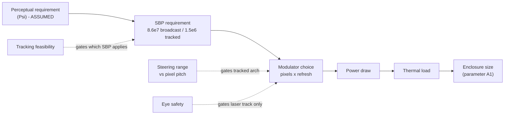
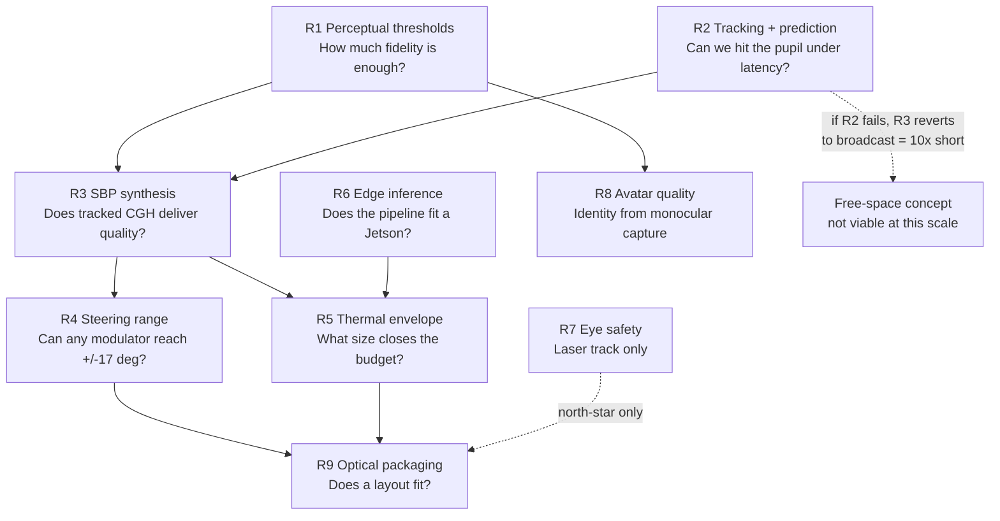

# 06 — Master Research and Build Plan

> ### ⚠ SUPERSEDED IN PART — read [`docs/10_TAYF_UNIVERSAL_ENGINEERING.md`](10_TAYF_UNIVERSAL_ENGINEERING.md) first
>
> This document predates the current design and is kept as a **detail source and historical record**, not as a specification. Where it disagrees with document 10, document 10 wins. Specifically superseded:
> - **The device is not a 10 cm cube.** It is a family of flat apertures (20 cm slab → A4 folio → 50 cm disc → chair → mirror), sized by the aperture law. Depth is dead weight; every form is a slab.
> - **The engine is static AIRR optics**, selected. Free-space plasma, acoustic and photophoretic routes were all evaluated and ruled out with quantitative reasons (doc 10 §9).
> - **The "~85% / ~15%" framing is retired.** It described a problem that no longer exists in that shape.
> - **Viewing angle is 170°**, measured (Yamamoto 2017, `10.11370/isj.56.341`) — not the ±20–30° stated in earlier revisions, which belongs to a different mechanism.
> - **Transport is delta + int8 at 0.104 Mbps**, measured — not fp16 + LZ4, whose assumed 0.6× ratio was tested and found to *expand* the payload.


This is a dependency graph, not a calendar. Dates appear only where an external deadline imposes them (the hackathon). Everything else is ordered by what unblocks what, because in a research project a schedule built on unresolved dependencies is fiction.

**Reference date: 2026-08-15.** Idea Phase closes **Aug 23 (8 days)**. Prototype Phase closes **Sep 13 (29 days)**.

---

## 1. The critical path, in one line

**Perceptual requirement → SBP requirement → modulator choice → power draw → thermal load → enclosure size.**

Every arrow is a hard causal dependency, and the leftmost term — how much optical information a human actually needs to perceive presence — is the least-known quantity in the project (`01_SYSTEM_MASTER_SPEC.md` §10 leaves Ψ unquantified). **The entire budget chain is currently derived from assumed perceptual requirements.** That is the single most important structural fact about this plan and it is why the cheapest, least hardware-dependent work sits first.



---

## 2. Dependency graph of the research problems



**R1 and R2 are the roots.** Neither requires optical hardware. Both are simulatable (`07_HARDWARE_SIMULATION_PLAN.md` tracks S5 and S6). Neither has been started. Everything expensive downstream is currently resting on assumptions about them.

**R2 is the load-bearing gate.** If observer tracking cannot hold pupil error under ~6 mm through 76–177 ms of pipeline latency, the tracked architecture collapses and the SBP requirement reverts to broadcast — where commodity hardware is 10× short. There is no cheap fallback. This is the experiment most likely to kill the concept, which is exactly why it runs early.

---

## 3. Which experiment eliminates which uncertainty

| Uncertainty | Killed or bounded by | Cost | Currently |
|---|---|---|---|
| How much fidelity does presence need? | S5.1–S5.7 perceptual battery | VR headset + time | **Unknown — worst-understood, cheapest to fix** |
| Does tracked serving really save 58×? | S1.5 | GPU only | Analytically derived, unverified |
| Can prediction hit the pupil? | S6.2 (with EyeNavGS real traces) | GPU only | **Unknown — highest kill risk** |
| Can any modulator steer ±17°? | S1.3, S1.9 | GPU only | Bounded analytically; metasurface path untested |
| What enclosure size closes thermal? | S3.3 sweep | CPU only | **Answered: ~16.2 W at 100 mm/48 °C (5 faces). 100 mm FAILS for holographic configs; ~130 mm closes it.** |
| Does the pipeline run on Jetson-class? | S4.5, then real hardware | One Jetson | Unvalidated — inherited assumption |
| Is identity preserved from monocular capture? | S5.2 + avatar enrollment trial | RTX 5060 | Unvalidated for familiar viewers |
| Does an optical layout fit 10 cm? | S2.2, S2.3 | CPU only | Unknown |
| Is the laser track eye-safe? | Analysis, then measurement | Specialist input | **Not started; blocks all laser work** |
| Does AIRR/aerial imaging work at this scale? | Non-arXiv literature access | Journal access | **Unassessed — wrong venue searched** |

---

## 4. Prototype ladder

Deliberately inverted from the intuitive order: **size comes last.** Constraining the form factor before the physics is settled is how a project spends six months packaging something that was never going to work.

| Stage | Form factor | Proves | Explicitly does NOT attempt | Go/no-go |
|---|---|---|---|---|
| **V0** | Optical bench, unconstrained | A free-space image of a simple object exists at all — point → line → plane → cube (`experiments/README.md` ladder) | Size, human content, real-time, integration | Stable perceived 3D object with no physical display surface |
| **V0.5** | Bench + tracker | Tracked exit-pupil serving works with a real human observer moving | Size, photorealism | Image holds through natural head motion; measured pupil error <6 mm |
| **V1** | Desktop box, ~250–300 mm | Full pipeline: capture → transport → reconstruct → emit, two endpoints | 10 cm, battery, industrial design | Two-way session, <150 ms, recognizable person |
| **V2** | ~150–200 mm | Thermal and packaging under real integration | 10 cm | Sustained 30 min call without throttling |
| **V3** | 100 mm target | The original constraint — **only if S3.3 says it is reachable** | — | All of V2 at target size |

**V1 is the defensible product.** V3 is the aspiration. If S3.3 shows 100 mm cannot close thermally with any viable component set, **V2 is the honest end state and the spec changes** (`01_SYSTEM_MASTER_SPEC.md` parameter A1 exists precisely for this) — the idea is not invalidated by the box being 150 mm.

---

## 5. Milestone tracks

Tracks run in parallel; dependencies between them are stated, not implied.

### 5.1 Mathematics / physics
- M-P1 Simulator validated against analytic propagation results (gate G1)
- M-P2 Tracked-vs-broadcast SBP saving verified numerically *(depends: M-P1)*
- M-P3 Steering-range limits confirmed; metasurface interpolation evaluated *(depends: M-P1)*
- M-P4 Radiance/brightness budget closed against real ambient light
- M-P5 Eye-safety analysis complete *(blocks all laser hardware, no exceptions)*

### 5.2 Optical
- M-O1 Candidate layouts ray-traced; at least one forms the intended image
- M-O2 A 200–400 mm path folded into a ≤100 mm envelope on paper *(depends: M-O1)*
- M-O3 Tolerance stack-up shows manufacturable alignment *(depends: M-O2)*
- M-O4 V0 bench produces a free-space point *(depends: M-P1, M-P5 if laser)*
- M-O5 V0 produces stable 3D geometry *(depends: M-O4)*
- M-O6 V0.5 tracked serving with a live observer *(depends: M-O5, M-T3)*

### 5.3 Avatar / representation
- M-A1 License decision committed — Anny or MHR, never SMPL-X *(blocks all pipeline code)*
- M-A2 Enrollment pipeline builds a personalized avatar on the RTX 5060 *(depends: M-A1)*
- M-A3 `pipeline/schema.py` driving loop animates the avatar end to end *(depends: M-A2)*
- M-A4 Identity preserved for *familiar* viewers, not just strangers *(depends: M-A2, S5.2)*
- M-A5 Runs within a Jetson-class inference budget *(depends: M-A3)*

### 5.4 Networking
- M-N1 Nokia NaC portal registration *(blocks everything below)*
- M-N2 QoD session create/extend/delete against sandbox *(depends: M-N1)*
- M-N3 Congestion Insights 15-min prediction loop driving real decisions *(depends: M-N1)*
- M-N4 Measured <0.3 Mbps, <150 ms on the real implementation *(depends: M-A3)*
- M-N5 Graceful degradation without QoD available

### 5.5 Integration
- M-I1 V1 two-endpoint session *(depends: M-A3, M-N4, M-O5)*
- M-I2 V1 with a live QoD session *(depends: M-I1, M-N2)*
- M-I3 30-minute sustained call without thermal throttling *(depends: M-I1, M-T5)*

### 5.6 Miniaturization
- M-M1 Thermal sweep produces the required edge length *(gates everything here)*
- M-M2 V2 at the S3.3-determined size *(depends: M-M1, M-I1)*
- M-M3 V3 at 100 mm *(depends: M-M2 — attempt only if M-M1 permits)*

### 5.7 Research output
- M-R1 Track D perceptual results — genuinely novel; no published paper answers the C×D question
- M-R2 Tracked-SBP-collapse result written up *(depends: M-P2, M-O6)*
- M-R3 Full-system paper *(depends: M-I1)*

### 5.8 IP
- M-IP1 Real prior-art search completed *(in progress, doc 05)*
- M-IP2 Attorney review of inventive concepts *(depends: M-IP1)*
- M-IP3 Filing decision *(depends: M-IP2)* — **note the repository is already public; see doc 05 on disclosure timing**

---

## 6. The hackathon runs in parallel and depends on none of this

This is deliberate and worth stating explicitly: **no hackathon deliverable is blocked on any open research question above.** The hackathon track uses a commercial light-field panel, the solved capture/transport stack, and the CAMARA agent layer — all buildable now.

| Date | Deliverable | Depends on | Status |
|---|---|---|---|
| **Aug 23** | Idea Capture Template + pitch deck | Nothing unresolved | `pitch/` drafts exist; needs finalizing |
| Aug 23 → Sep 13 | Build V1-lite: pipeline + panel + live QoD | M-A1, M-A3, M-N1, M-N2 | M-A1 and M-N1 are the two blockers, both trivially resolvable |
| **Sep 13** | Live two-endpoint demo | Above | — |
| Nov 2026 | MWC Doha showcase | Advancing past prototype phase | — |

**The two things blocking the hackathon build are both one-decision items**: commit to the avatar model license (task #12), and register on the Nokia portal (task #2). Neither is research. Both should be closed this week.

The pitch narrative is the honest two-track framing from `docs/roadmap.md`, now materially strengthened: the master spec's finding that the optical gap is ~1.3–1.7× broadcast — and a *surplus* when tracked — is a far better story than "unsolved," and it is defensible under technical questioning because it is derived, not asserted.

---

## 7. Immediate ordering

**This week (before Aug 23):**
1. Close M-A1 (avatar license) and M-N1 (Nokia portal) — both blocking, neither is research
2. Finalize the pitch and Idea Capture Template
3. Start S3.1/S3.3 (thermal sweep) — cheapest simulation, CPU-only, and it determines the industrial design

**Immediately after the Idea Phase:**
4. S1.1–S1.2 (validate the wave-optics simulator) — gate G1
5. **S6.2 (tracking prediction under real head-motion traces) — the highest kill risk in the project**
6. **S1.5 (tracked vs. broadcast synthesis) — verifies the central architectural claim**
7. S5 perceptual battery — quantifies Ψ and potentially relaxes every downstream budget

**Only after gate G2 passes:** optical layout, BOM freeze, hardware orders.

---

## 8. Repository structure

Current layout is stable and matches this plan. Additions implied by this document:

```
tayf/
├── docs/               01-08 master documents (authoritative; doc 08 = final product plan, MATD engine)
├── simulation/         NEW - one subdir per S-track, per doc 07
│   ├── s1_waveoptics/  s2_layout/  s3_thermal/
│   ├── s4_lightfield/  s5_perceptual/  s6_tracking/  s7_system/
├── pipeline/           capture, avatar, view_synthesis, transport, schema.py
├── agent/              CAMARA layer + compliance constraints
├── hardware/           BOM, camera rig, optical engine, thermal, enclosure
├── firmware/           scope only until hardware is chosen
├── experiments/        physical experiment protocols, 7 branches
├── patent/             prior art, disclosure, claim map
├── research/           175-paper corpus, licensing, citations
├── app/  design/  pitch/
```

Rule: `docs/01–08` are authoritative. The older scattered files (`hardware/*.md`, `docs/theory.md`, `FilesPlan.md`) remain as working detail but **must not contradict** the master documents — this project has already shipped one stale-duplicate bug when the same table lived in two files and only one was updated.

> **Change of record (2026-08-15):** the emission-stage open question that this document's §1–§3 budget chain was built to resolve is now closed for the product engine — `docs/08_FINAL_PRODUCT_PLAN.md` selects the verified MATD (acoustic trapping) engine (Track 5) and adds milestone track E. §2's dependency graph R3–R5/R7/R9 remain the correct research framing for the *photoreal research tier* (E4) and the *light-field hackathon instrument*, not for the wireframe product engine. The perceptual battery (S5) still runs — it now also quantifies figurine-rate acceptability (S5.8) — and the hackathon track is unchanged.

---

## 9. Failure conditions, restated as decisions

From `01_SYSTEM_MASTER_SPEC.md` §12.2, mapped to what actually changes:

| If | Then |
|---|---|
| F1 — tracked SBP unreachable within power budget | Free-space is not viable at this scale. Ship the panel version; say so plainly. |
| F2 — thermal cannot close under 250 mm | The form factor is wrong, not the idea. Move A1 and keep going. |
| F3 — prediction cannot hold pupil error | Tracked architecture fails; broadcast unaffordable; revert to panel. |
| F4 — eye safety cannot be closed | That emission mechanism is dead regardless of everything else. |
| F5 — presence collapses at achievable fidelity | The optical target was mis-set; rederive the entire budget chain from measured Ψ. |

**F2 is the most likely and the least damaging.** F3 is the most dangerous. F5 would be the most expensive to discover late — which is the argument for running S5 early, before hardware exists to be wasted.
