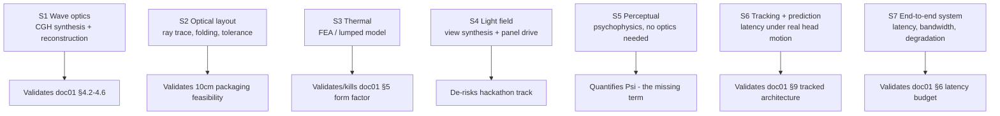
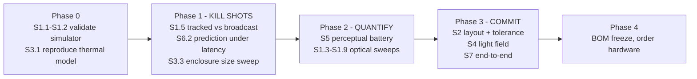

# 07 — Hardware Simulation Plan

> ### ⚠ SUPERSEDED IN PART — read [`docs/00_INDEX.md`](00_INDEX.md) first, then [`docs/10_TAYF_UNIVERSAL_ENGINEERING.md`](10_TAYF_UNIVERSAL_ENGINEERING.md)
>
> This document predates the current design and is kept as a **detail source and historical record**, not as a specification. Where it disagrees with document 10, document 10 wins. Specifically superseded:
> - **The device is not a 10 cm cube.** It is a family of flat apertures (20 cm slab → A4 folio → 50 cm disc → chair → mirror), sized by the aperture law. Depth is dead weight; every form is a slab.
> - **The engine is static AIRR optics**, selected. Free-space plasma, acoustic and photophoretic routes were all evaluated and ruled out with quantitative reasons (doc 10 §9).
> - **The "~85% / ~15%" framing is retired.** It described a problem that no longer exists in that shape.
> - **Viewing angle is 170°**, measured (Yamamoto 2017, `10.11370/isj.56.341`) — not the ±20–30° stated in earlier revisions, which belongs to a different mechanism.
> - **Transport is delta + int8 at 0.104 Mbps**, measured — not fp16 + LZ4, whose assumed 0.6× ratio was tested and found to *expand* the payload.

**Premise:** every load-bearing claim in `01_SYSTEM_MASTER_SPEC.md` can be tested in software before a single optical component is purchased. Available compute is one remote RTX 5060. Available optical hardware is none. That is not a limitation for the next phase of this project — it is the correct phase.

**The rule this document exists to enforce:** *nothing gets ordered until the simulation that would have predicted its failure has been run.* The BOM in `04_...HARDWARE...md` is downstream of this file, not parallel to it.

---

## 1. Why simulate first, specifically here

Three reasons that are particular to TAYF rather than generic engineering hygiene:

1. **The biggest open question needs no optics at all.** Track D — how much optical information a human actually needs to perceive presence (`experiments/perceptual-quality/README.md`) — is a psychophysics question. It can be run on a monitor and in VR with rendered stimuli. It is currently the weakest term in the system model (§10 of doc 01, Ψ is unquantified) and it is the cheapest thing to attack. **Doing this first is the single highest-leverage move available.**
2. **Wave optics is exactly FFTs.** Angular-spectrum propagation, hologram synthesis, and reconstruction are Fourier operations on complex arrays — the RTX 5060 is a legitimate instrument for this, not a substitute for one. The SBP arithmetic in doc 01 §4 is analytical; simulation is how it gets *verified* rather than believed.
3. **The two riskiest findings are both simulatable.** Thermal (doc 01 §5, the binding constraint) is FEA. Steering range vs. pixel pitch (§4.6, the real unsolved optical sub-problem) is a diffraction calculation. Neither requires hardware to falsify.

---

## 2. Simulation tracks

---

## 3. S1 — Wave-optics and computer-generated holography

**Validates:** doc 01 §4.2 (required SBP), §4.3 (supplied SBP), §4.4 (the 58× tracked collapse), §4.6 (steering limits).

### 3.1 What to build

Angular-spectrum free-space propagation:

**U(x,y,z) = ℱ⁻¹{ ℱ{U(x,y,0)} · exp(i·k_z·z) }**, with k_z = √(k² − k_x² − k_y²)

From that primitive, everything else follows: propagate a phase pattern from an SLM plane to an image plane, reconstruct, compare against target, iterate.

### 3.2 Specific experiments, in order

| # | Experiment | Question it answers | Success criterion |
|---|---|---|---|
| S1.1 | Propagate a known phase pattern, compare to analytic result | Is the simulator correct? | Matches closed-form Fresnel result to <1% |
| S1.2 | Gerchberg–Saxton and SGD hologram synthesis for a 2D target | Baseline CGH quality/speed on this GPU | Converges; record PSNR and ms/frame |
| S1.3 | **Sweep pixel pitch 8 / 3.74 / 1.0 / 0.5 µm, measure achieved diffraction angle** | **Does doc 01 §4.6's grating-equation limit hold in simulation?** | Matches sin θ = λ/2p within numerical error |
| S1.4 | Multiplane / focal-stack hologram of a head model at 1 m | Can a head be rendered at eye resolution? | 859 resolvable points across the head |
| S1.5 | **Broadcast (116-view) vs. tracked (2-pupil) synthesis, same target** | **Verify the 58× SBP and compute claim numerically** | Tracked achieves equal per-pupil image quality at ≤1/50 the compute |
| S1.6 | Time-multiplex 8 sub-frames, measure effective SBP gain | Does multiplexing deliver the 8× doc 01 §4.3 assumes? | Effective SBP within 20% of 8× single-frame |
| S1.7 | Inject phase quantization (4-bit MEMS vs 8-bit LCoS) | Is the 1440 Hz 4-bit MEMS device usable? | Quantify PSNR loss vs. the 24× multiplex gain |
| S1.8 | Speckle metrics with and without the literature's suppression methods | How bad is speckle for a face specifically? | Speckle contrast C = σ/Ī, target <0.1 |
| S1.9 | Simulate a metasurface pixel-interpolator (arXiv 2511.22639 approach) | **Can the steering-range problem be solved this way?** | Achieved FOV ≫ the bare SLM's ±2–4° |

**S1.5 and S1.9 are the two that matter most.** S1.5 either confirms or destroys the central architectural claim of this project. S1.9 attacks the one optical sub-problem doc 01 admits is unsolved.

### 3.3 Tooling

- **odak** — open-source optics/holography toolkit from Kaan Akşit's UCL group (the same lab behind arXiv 2511.15022 in our corpus). Purpose-built for exactly this; PyTorch-native, GPU-ready. *Verify its license before any downstream use — see `research/LICENSING.md` policy.*
- **PyTorch** — autograd makes SGD-based hologram optimization nearly free to implement, and the corpus's best CGH methods are gradient-based.
- **numpy/cupy/scipy** — baseline FFT and validation.
- Optional cross-checks: `LightPipes`, `diffractio`, `poppy`.

Hardware note: a 4K complex field is 3840×2160 complex64 ≈ 66 MB; a forward+inverse FFT pair per propagation. Fits an RTX 5060 comfortably; multiplane focal stacks are the memory-hungry case and may need plane-by-plane streaming.

---

## 4. S2 — Optical layout, folding, and tolerance

**Validates:** whether any candidate architecture from `02_...OPTICAL_ENGINEERING.md` physically fits, and how precisely it must be built.

| # | Experiment | Question |
|---|---|---|
| S2.1 | Sequential ray trace of each candidate layout | Does the design form the intended image at all? |
| S2.2 | **Fold a 200–400 mm optical path into a ≤100 mm envelope** | How many mirror folds, at what beam height, with what clearance? |
| S2.3 | Monte-Carlo tolerance stack-up (mount, thermal drift, assembly) | What alignment precision must manufacturing hit? |
| S2.4 | Camera FOV coverage vs. a seated capture volume | Confirms/corrects `hardware/camera-rig.md`'s 3–4 camera assumption |
| S2.5 | Cube-face real-estate conflict (cameras vs. exit aperture) | Which faces can host what, per `hardware/enclosure.md` |
| S2.6 | Vignetting and étendue through the folded path | How much of doc 01 §4.5's 145× aperture headroom survives real optics? |

**S2.3 is the one that quietly kills projects.** A design requiring 10 µm alignment stability across a 30 K thermal swing in a plastic enclosure is not manufacturable, and it is far cheaper to learn that here than after ordering mounts.

**Tooling:** `rayoptics` or `Optiland` (Python, open); FreeCAD or Blender for mechanical layout and collision checking; `numpy` for the Monte-Carlo.

---

## 5. S3 — Thermal

**Validates:** doc 01 §5 — the binding constraint. This track can, on its own, force parameter A1 (enclosure size) to move, and it is cheap to run.

| # | Experiment | Question |
|---|---|---|
| S3.1 | Reproduce doc 01 §5's lumped model | **Done.** 6-face baseline 12.44 W @ΔT=15 K; corrected 5-face/48 °C ceiling **16.2 W** |
| S3.2 | 3D FEA with real component placement | Where are the hotspots? Does the SoC throttle? |
| S3.3 | **Sweep edge length 100 / 125 / 150 / 200 / 250 mm** | **What size does the real component set actually require?** |
| S3.4 | Passive vs. spreader-to-shell vs. forced air vs. vapour chamber | Which cooling strategy is sufficient, and at what noise cost? |
| S3.5 | Duty-cycle transient (a 30-min call, not steady state) | Can peak exceed steady-state budget usefully? |
| S3.6 | Sensor noise vs. internal temperature | Does self-heating degrade the cameras feeding capture? |

**S3.3 produces the number that decides the industrial design.** Everything in `04_...HARDWARE...md`'s mechanical section is downstream of it.

**Tooling:** `Elmer FEM` (open, capable of conjugate heat transfer), `OpenFOAM` if forced-air CFD is needed, or a scripted lumped-parameter network for fast sweeps. Start lumped, escalate only if the answer is marginal.

---

## 6. S4 — Light field and view synthesis

**Validates:** the hackathon-track path, and `pipeline/view_synthesis/README.md`'s open question about minimum physical channel count.

| # | Experiment | Question |
|---|---|---|
| S4.1 | Render an animated Gaussian avatar to an N-view quilt | Baseline: does the pipeline run end to end? |
| S4.2 | **Sweep N (native views) down, interpolating the gap neurally** | **The minimum-physical-channels question — where is the knee?** |
| S4.3 | Simulate lenticular/parallax-barrier optics over the quilt | What does the viewer actually see, including crosstalk? |
| S4.4 | Measure render rate on the RTX 5060 vs. published results | Does CoherentRaster/LFDPR-class performance reproduce here? |
| S4.5 | Port the profile to a Jetson-class budget | Does it survive the deployed compute target? |

Do not build S4.1 from scratch: arXiv 2506.08064 (altiro3D) is an existing open-source webcam→Looking Glass Portrait pipeline. Fork and instrument it.

---

## 7. S5 — Perceptual experiments (no optics required)

**Validates:** Ψ — the unquantified term in doc 01 §10, and the whole `experiments/perceptual-quality/` branch.

**This track is the reason the simulation phase is worth doing before anything else.** Every other budget in doc 01 is derived from an *assumed* fidelity requirement (1 arcmin, full parallax, 6 mm view separation). If the real perceptual requirement is lower, every downstream budget — SBP, compute, power, thermal — relaxes proportionally. If it is higher, better to know now.

| # | Experiment | Hypothesis under test | Apparatus |
|---|---|---|---|
| S5.1 | **Flat 2D placed cutout vs. full volumetric, single viewer** | arXiv 2401.02171 found co-presence 5.2 vs 5.3 (n.s.) — does that hold outside an AR HMD? | VR headset or monitor |
| S5.2 | **Familiar vs. stranger identity recognition** | arXiv 2509.17748: people are harshest on faces they know — TAYF's actual case | Monitor, enrolled avatars of real acquaintances |
| S5.3 | Angular view-count sweep vs. presence rating | **The Track C×D question no published paper answers** | Simulated light-field on VR or a real panel |
| S5.4 | Spatial resolution sweep (is 1 arcmin really needed?) | Directly attacks doc 01 §4.2's core assumption | Monitor at controlled distance |
| S5.5 | Latency sweep 50–300 ms vs. presence and expressiveness | Validates doc 01 §6's budget and the 82.6% expressiveness finding | VR with injected delay |
| S5.6 | Perceptual allocation: uniform vs. face/hand-weighted fidelity | Validates the ~16× allocation gain in doc 01 §10 | Rendered stimuli |
| S5.7 | Tracking-error tolerance: inject pupil-localization error | How accurate must S6's tracker be before presence breaks? | VR |

**Methodological requirement:** use MOS/2AFC human-rating protocols, not PSNR/SSIM. Multiple papers in the corpus (arXiv 2501.08072, 2404.09003, 2403.06421) independently found objective metrics correlate poorly with human judgement on exactly this content class. Sample sizes will be small and single-experimenter — report them honestly and treat results as directional.

**Tooling:** `PsychoPy` (psychophysics protocols, open), Unity or Godot for VR stimulus delivery, `gsplat` for avatar rendering, plain Python for analysis. A consumer VR headset is the only purchase this track needs, and it is far cheaper than any optical component.

---

## 8. S6 — Observer tracking and prediction

**Validates:** doc 01 §9, and therefore the viability of the tracked architecture that §4.4 depends on.

| # | Experiment | Question |
|---|---|---|
| S6.1 | Pupil-localization accuracy from simulated camera imagery | Can 6 mrad be hit at 1 m with the candidate cameras? |
| S6.2 | **Replay real head-motion traces through the full pipeline latency** | **Does prediction hold error under one pupil diameter?** |
| S6.3 | Predictor comparison (constant-velocity / Kalman / learned) | Which is sufficient, and at what compute cost? |
| S6.4 | Failure behaviour: occlusion, glasses, rapid turn, second person | What happens when tracking is lost, and is the fallback graceful? |
| S6.5 | Tracking compute vs. thermal budget | Does adding the tracker break §5? |

**S6.2 is the decisive one.** doc 01 §9 notes that 100 ms of latency at 0.2 m/s head sway is 20 mm of error — over three pupil diameters. If prediction cannot close that, the tracked architecture fails and the SBP problem reverts to broadcast (10× short). **This is the highest-value simulation in the entire plan after S1.5.**

Useful existing resource: arXiv 2506.02380 (EyeNavGS) releases head-pose and eye-gaze traces from 46 participants exploring real scenes — real motion statistics to drive S6.2 rather than synthetic sway.

---

## 9. S7 — End-to-end system simulation

**Validates:** doc 01 §6 (latency) and §7 (bandwidth) as an integrated whole rather than per-stage.

| # | Experiment | Question |
|---|---|---|
| S7.1 | Discrete-event model of all pipeline stages | Where does the budget actually go under jitter? |
| S7.2 | Network impairment injection (loss, jitter, congestion) | How does the system degrade, and is it graceful? |
| S7.3 | CAMARA QoD on vs. off under identical impairment | Does the agent layer measurably help? Needed for the pitch. |
| S7.4 | Bitrate measurement of the real `pipeline/schema.py` path | Confirm 0.124–0.206 Mbps on the actual implementation |
| S7.5 | Delta/temporal encoding gain vs. the full-frame baseline | Is delta encoding worth implementing at all? |

---

## 10. What cannot be simulated

Stated explicitly so the plan does not become an excuse to never build anything:

| Must be measured on hardware | Why simulation is insufficient |
|---|---|
| **Eye safety / MPE compliance** | Simulation informs design; certification requires measured optical power. **No laser hardware operates near a person on simulated safety.** |
| Actual SLM behaviour | Real devices have flicker, non-uniform phase response, thermal drift, and calibration LUTs that datasheets under-describe |
| Speckle in a real coherent system | Depends on surface roughness and coherence properties simulation approximates poorly |
| Real perceived brightness in ambient light | Requires measured photometry in a real room |
| Camera sync jitter | Depends on real trigger electronics and sensor readout behaviour |
| Assembly and alignment feasibility | Tolerance stack-up predicts it; a human building it settles it |
| Acoustic noise of active cooling | Perceptual and product-defining; must be heard |

---

## 11. Sequence and gates

**Phase 1 exists to try to kill the project cheaply.** Its three simulations map directly onto doc 01 §12.2's failure conditions F1, F3, and F2 respectively. If any fails decisively, the architecture changes before money is spent — which is the entire point.

| Gate | Pass condition | If it fails |
|---|---|---|
| G1 (after P0) | Simulator matches analytic results | Fix tooling; nothing downstream is trustworthy until it does |
| **G2 (after P1)** | **Tracked synthesis ≥50× cheaper at equal per-pupil quality; prediction error <6 mm; a ≤250 mm enclosure closes thermally** | **Revert to panel-based hackathon track and re-scope the free-space claim honestly** |
| G3 (after P2) | Perceptual requirements are at or below doc 01 §8's assumptions | Rederive every budget from the measured requirement |
| G4 (after P3) | A layout fits, tolerances are manufacturable, end-to-end latency <150 ms | Move parameter A1 (size) before abandoning H1 (free space) |
| G5 | Every BOM line has a power number and the total is under the §5 budget | Do not order |

---

## 12. Deliverables

Each simulation track produces, at minimum: runnable code committed under `simulation/<track>/`, a results file with the actual numbers, and a one-paragraph verdict stating whether the doc 01 claim it tests survived. **A simulation that does not update a claim in doc 01 — by confirming, correcting, or killing it — was not worth running.**

Every experiment logs the fields required by `experiments/README.md`'s research-notebook template, so simulated and physical results stay comparable when hardware eventually arrives.
