# TAYF — Universal Engineering Document

**Version 1.0 · 2026-08-16 · supersedes nothing, consolidates everything.**

This is the single document. Everything the project knows, from first principles to part numbers, with every load-bearing claim tagged by how much we actually trust it. It exists because the knowledge was scattered across nine specification documents, 175 deep-read papers, six simulation programs and two days of dead ends, and because a project that cannot state its own confidence honestly cannot be built from.

**Reading order if you read nothing else:** §1 (what it is), §2 (the three laws — everything else follows), §3 (the product), §12 (what we are *not* sure of).

---

## 1. What TAYF is

Two devices. Each watches its local human with cameras, reduces them to **215 floating-point numbers per frame**, ships that over an ordinary network at **~0.16 Mbps**, and reconstructs the remote person as a **real image floating in open air** — no screen carrying the picture, no headset, no glasses, nothing worn, nothing else to buy.

The optical engine has **zero moving parts**: three static sheets and a display panel. Nothing spins, scans, levitates or flies. The only thing that changes is which pixels are lit.

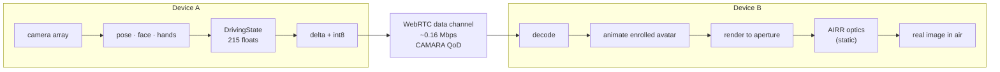

### 1.1 What is genuinely settled

| | Status |
|---|---|
| Capture → representation → transport | **Solved.** Published, measured, license-clean |
| Optical mechanism | **Selected and static.** AIRR retroreflective imaging |
| Device geometry | **Derived from first principles.** §2 |
| Power, thermal, latency, bandwidth budgets | **Closed with margin.** §2.5, §9 |
| Moving parts | **None** |

### 1.2 What is not

The original goal — a 10 cm cube placing a *whole standing person* in your chair — is **not buildable, by anyone, at any budget.** Six independent physical laws forbid it (§12.4). What replaced it is a family of devices, sized by physics rather than by wish, that put a **life-size person in open air in your room.** The engineering below is for that.

---

## 2. The three laws

Everything in this document — every dimension, every product decision, every rejected idea — follows from three geometric facts. They are not technology limits. They are statements about where light is able to go.


*Four devices at true relative scale. Each cyan plate is exactly as tall as the figure standing in front of it. That is Law 1, drawn.*

### 2.1 Law 1 — Clipping: an image in your space cannot exceed the aperture

Light reaching your eye must pass through the device's exit aperture. For an image **nearer to you than the device** — i.e. genuinely in your own space:

> **W_image ≤ D_aperture**

A 10 cm device floats a 10 cm object. A 50 cm device floats a 50 cm object. This is stated as a general theorem in **Smalley et al., *Nature* 553, 486 (2018)**, which names the effect **"clipping"** and gives *matter physically at the image point* as the sole exception. **[PUBLISHED]**

That exception is why this project spent two days on plasma, levitated beads and glowing aerosols. All were closed (§12.4). Clipping stands.

### 2.2 Law 2 — Portal: an image beyond the device may exceed it, without limit

For an image **further from you than the device**, the same geometry runs the other way:

> **W_visible = D × (b / a)**   *(a = eye→device, b = eye→image)*

**[DERIVED]** — elementary similar triangles.

| From a 50 cm disc at 1 m | Real size | Appears at |
|---|---|---|
| Person | 1.70 m | 3.4 m |
| Motorcycle | 2.10 m | 4.2 m |
| **Car** | **4.50 m** | **9 m** |
| Bus | 12.0 m | 24 m |

There is **no size limit at all** — a 50 cm disc can show a bus, if the bus appears 24 m away. The cost is exact: you are looking *through* the device at the subject, and it frames them like a window. Move your head and the frame crops them.

**Naming which mode you mean is mandatory.** Conflating in-front (Law 1) with portal (Law 2) is the single easiest technical error in this entire project, and this document flags it wherever it matters.

### 2.3 Law 3 — Presence is an angle, not a size

The mistake that cost this project the most time: sizing the device to a **1.7 m body** when a conversation is a **face**.

| Subject at 1 m | Subtends |
|---|---|
| Face (chin to crown) | **12.6°** |
| Head + shoulders | 28.1° |
| Seated upper body | 43.6° |
| Whole standing body | 80.7° |

**[DERIVED]** — 2·arctan(W/2d).

> **The device must subtend the same angle as the subject.**

That single sentence sets the entire design space, and it explains why small devices are *not* useless:

| You sit at | Device for a life-size face |
|---|---|
| 30 cm | 6.6 cm |
| **45 cm** | **8.8 cm — a 10 cm cube** |
| 1 m | 22 cm |
| 1.5 m | 33 cm |

For calibration against what you already accept without complaint: FaceTime on a phone at 40 cm subtends **19.9°**; a real person at 1.2 m subtends **10.5°**. **[DERIVED]**

### 2.4 The two modes, side by side

| | **In-front** (Law 1) | **Portal** (Law 2) |
|---|---|---|
| Image sits | nearer you than the device | beyond the device |
| Size | W ≤ D | W = D·(b/a), unbounded |
| Feels like | an object in your room | a window onto them |
| 20 cm device gives | a 20 cm head | a full upper body at 1.2 m |
| Cost | device must be as big as the subject | you look through a frame |

Both are legitimate. Both are built below.

### 2.5 What the laws do *not* constrain

Depth. An aperture is an emitting **area**; its thickness is set only by how far in front the image floats, never by the image size. **Every device in this document is a slab, not a box** — and the original cube's back half was never doing optical work.

---

## 3. The product


*Aperture built into a chair back. A life-size seated upper body floats in the chair — **in-front mode**, so the image is bounded by the 0.55 × 0.80 m back panel. The grey figure is a real person at true scale, sitting opposite.*

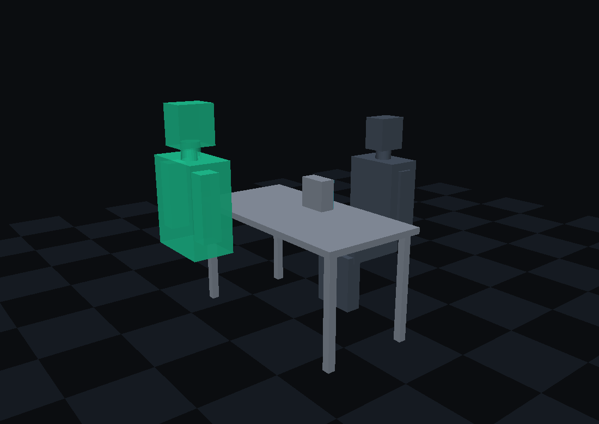

*A 20 × 20 × 10 cm slab on a desk. The upper body appears **0.9 m beyond** the device — **portal mode**, which is how a 20 cm aperture legitimately shows an 80 cm subject.*

### 3.1 The family

| # | Form | Aperture | Shows | Mode |
|---|---|---|---|---|
| 1 | **Desk slab** | 20 × 20 cm | upper body at 1.2 m | portal |
| 2 | **Folio** (folds to a book) | 30 × 21 cm (A4) | upper body / face | either |
| 3 | **Disc** | 50 cm | head + shoulders | in-front |
| 4 | **Chair** | 55 × 80 cm | seated upper body, in the chair | in-front |
| 5 | **Mirror** | 55 × 175 cm | full standing person | in-front |
| 6 | **Command table** | 150 × 150 cm horizontal | terrain, viewed from all sides | in-front |

All six are modelled to true scale in `models/build_models.py`; renders in `models/png/`.

### 3.2 The recommended build order

**V0 → the 50 cm disc.** Static, no hinge, no folding. It validates the entire optical family with the fewest unknowns. Build this first.

**V1 → the 20 cm desk slab.** The smallest genuinely useful product.

**V2 → the A4 folio.** Adds the unresolved fold (§8.4).

**V3 → the chair.** Largest aperture, zero visual intrusion, and the person appears where they should.

### 3.3 The A4 coincidence

An upper body is 80 × 55 cm — ratio **1.45**. A4 is **1.41**. A4 portrait is almost exactly the shape of a human upper body, and at 50 cm viewing distance it places one 1.33 m away at 33°. The width needs 20.7 cm; A4 gives 21. It fits with 3 mm to spare. **[DERIVED]**

### 3.4 A correction found while writing this document

The transport spec said **fp16 + LZ4**, assuming a 0.6× compression ratio. It was tested during authoring, twice and independently. **It is wrong.**

Packed pose floats are high-entropy: a general-purpose compressor finds nothing to exploit and *expands* the payload by 2.6%. The fix is not a better compressor — it is a different tool. **[MEASURED]**

| Encoding | Bytes/frame | Mbps @60 fps | Joint error |
|---|---|---|---|
| fp16 absolute *(old spec)* | 430 | 0.206 | — |
| fp16 + zlib | 441 | 0.212 | — |
| **delta + int8 quantised** | **215** | **0.104** | **≤0.08°** |
| delta + int8 + zlib | 226 | 0.109 | ≤0.08° |

**Delta-code, quantise the delta to int8, and use no compressor at all.** Half the bytes, one fewer dependency, no compress/decompress in the latency path. Quantisation error is half a quantisation step (DELTA_RANGE/254): at a generous 0.35 rad bound that is 0.079°, which moves the end of a 0.5 m limb by **0.7 mm** — invisible. Tightening the range to the measured motion envelope shrinks it proportionally. Adding a compressor on top makes it measurably *worse*.

Delta chains break on packet loss, so periodic absolute keyframes are required; at 1 Hz the cost is negligible, giving **~0.105 Mbps all-in**. This supersedes the fp16+LZ4 figures wherever they appear below, and `pipeline/schema.py` should be updated to match.

*This is what the confidence tags are for. A number that had been quoted for days as settled turned out to be an untested assumption, and testing it halved the bandwidth.*

---

<!-- ASSEMBLY: everything below is generated by models/assemble_doc.py -->

## 4. Optical engineering

**Scope.** Everything between "the receiver has a 215-float driving state and an animated avatar" and "a human sees a person in the room." Three geometric laws set every dimension of every device; one static optical mechanism (AIRR) satisfies them with no moving parts; the remaining engineering is a photometric budget and a resolution budget. This section derives all of it and marks exactly where the evidence stops.

> **Status change, 2026-08-16 — the AIRR primary literature has been read.** `docs/09_DEVICE_DESIGNS.md` §3, `docs/02_FREE_SPACE_OPTICAL_ENGINEERING.md` §6.4 and `experiments/aerial-imaging/README.md` all record that the Yamamoto/Suyama AIRR line was unreachable (JS-gated, login-walled, 403) and that every brightness, resolution and viewing-angle figure in this project was therefore reasoned rather than sourced. **That is no longer true.** Yamamoto's 2017 review is open access on J-Stage and was retrieved and read in full today: 山本裕紹, *「再帰反射による空中結像（AIRR）による空中ディスプレイ」* / "Aerial Display with Aerial Imaging by Retro-Reflection (AIRR)", **日本画像学会誌 (J. Imaging Soc. Japan) 56(4), 341–351 (2017)**, `https://www.jstage.jst.go.jp/article/isj/56/4/56_341/_pdf`. It supplies measured viewing angle, a measured efficiency improvement, a life-scale demonstration at 2.4 m diagonal, and — most consequentially — an alignment-insensitivity result that the zero-moving-parts finding depends on. Where this section contradicts docs 02 or 09, the contradiction is flagged inline with the number that caused it, per `research/METHODOLOGY.md` §4.

---

#### The three laws that decide everything

Three statements, each derived below with worked numbers. They are not three independent constraints — §1.4 shows they are one identity read three ways — but they are stated separately because each answers a different design question, and conflating them is how this project previously lost two days.

| Law | Question it answers | Statement |
|---|---|---|
| **L1 Aperture / clipping** | How big can the image be *in my space*? | `W_image ≤ D_aperture` |
| **L2 Portal geometry** | How big can the image be *beyond the device*? | `W = D·(b/a)`, unbounded as `b` grows |
| **L3 Angular presence** | How big must the *device* be? | `θ_image = 2·arctan(D / 2a)`, independent of `b` |

Symbols throughout: `D` = exit-aperture width, `a` = viewer-to-aperture distance, `b` = viewer-to-image distance, `W` = image width, `θ` = angle subtended at the viewer's eye.

##### L1 — Aperture and clipping

**Statement.** For an image that is to appear in the viewer's own space — nearer to the viewer than the device is — the image can be no wider than the exit aperture. `W_image ≤ D_aperture`.

**Derivation** [DERIVED, and identical to `01_SYSTEM_MASTER_SPEC.md` §4.3b, which this section does not restate or amend]. Light reaches the eye only along straight lines that pass through the aperture. The set of points the device can illuminate is therefore the cone with apex at the eye and base the aperture rim. At distance `b` from the eye, that cone has width `D·(b/a)`. For `b < a` the ratio is less than one, so `W < D` always. Put a lamp where the eye is: **the region the device can fill with image is exactly the shadow its aperture casts.** In front of the aperture the shadow has not yet spread; beside it there is no shadow at all.

**Worked numbers** [DERIVED]:

| Subject at life size | Width | Minimum aperture for an in-your-space image |
|---|---|---|
| Face | 220 mm | 220 mm |
| Head | 250 mm | 250 mm |
| Head + neck | 320 mm | 320 mm |
| Head + shoulders (bust) | 500 mm | 500 mm |
| Seated upper body | 800 mm | 800 mm |
| Standing full body | 1700 mm | 1700 mm |

This table is `09_DEVICE_DESIGNS.md` §1 with the face row added, and it is the whole reason the six device forms have the sizes they do. **There is no optical cleverness available here.** Pick the subject; the aperture follows.

**The law is published, in a top journal, by the field's own authority, and it has a name.** Smalley et al., *Nature* **553**, 486–490 (2018), DOI `10.1038/nature25176` [PUBLISHED — DOI verified in `02_...OPTICAL_ENGINEERING.md` §13 ledger; quotation transcribed in `01_SYSTEM_MASTER_SPEC.md` §4.3g]:

> *"**Clipping** restricts the utility of all three-dimensional displays that modulate light at a two-dimensional surface with an edge boundary; these include holographic displays, nanophotonic arrays, plasmonic displays, lenticular or lenslet displays and all technologies in which the light scattering surface and the image point are physically separate."*

Two things to extract. First, the enumeration is exhaustive of the redirect class — holography does not escape it, metasurfaces do not escape it, light-field panels do not escape it. Second, the paper names **the sole exception in its own qualifying clause**: technologies in which the scattering surface and the image point are *not* physically separate. That is, **put matter at the image point.** Smalley's own display does exactly that (a photophoretically trapped cellulose particle), and its follow-up (Rogers & Smalley, *Sci. Rep.* **11**, 2021) states the reciprocal limitation — *"Like all volumetric displays, OTDs lack the ability to show virtual images"* [PUBLISHED, cited at record level in `01_...` §4.3g; full text not read here].

**The inventor of AIRR states the same law about his own mechanism** [PUBLISHED, read in full 2026-08-16 — Yamamoto 2017, Fig. 11(a) caption and §3.3]:

> *"In the conventional AIRR, the aerial image is visible between an eye and the retro-reflector."*

and, in the body text: *「従来の AIRR において、形成された空中像を観察できる範囲は、視点位置からビームスプリッターを通して再帰反射素子が見える範囲に限られる」* — "the range over which the formed aerial image can be observed is limited to the range in which the retro-reflector is visible from the viewpoint through the beam splitter." His own fix, in §3.3 of the same paper, is **to enlarge the aperture**: laminate a *transparent* retroreflector over the whole LED panel so the retroreflector-visible region covers the panel-visible region too. He does not attempt to escape the cone, because there is nothing to escape it into.

**Escape routes are closed and documented.** `01_SYSTEM_MASTER_SPEC.md` §4.3d–§4.3g searched the three premises the law rests on — straight-line propagation (attacked with Airy beams), device-only emission (attacked with air-as-a-lens), and fixed aperture extent — and closed all three, the middle one against a hard physical ceiling (air's total refractivity `n−1 = 2.7131×10⁻⁴`, Jones, *J. Res. NBS* **86**(1) 27, 1981). **This section does not reopen them.**

##### L2 — Portal geometry

**Statement.** For an image *beyond* the device, `W = D·(b/a)`, and since `b/a` is unbounded, `W` is unbounded. A small aperture can show an arbitrarily large subject, provided the subject appears proportionally far away.

**Derivation** [DERIVED]. Same cone, evaluated at `b > a`. This is not a different law from L1; it is the same expression on the other side of `b = a`.

**Worked table**, for a 50 cm disc (device 03 in `09_DEVICE_DESIGNS.md`) with the viewer at `a = 1.0 m` [DERIVED]:

| Image distance `b` | `b/a` | Max visible width `W = D·b/a` | What that is |
|---|---|---|---|
| 0.5 m | 0.5 | 250 mm | a head, floating half-way to the disc |
| 1.0 m | 1.0 | 500 mm | head + shoulders, at the disc plane |
| 2.0 m | 2.0 | 1.00 m | most of a seated body |
| **3.4 m** | **3.4** | **1.70 m** | **a standing adult, life size** |
| 5.0 m | 5.0 | 2.50 m | a standing adult with room around them |
| **9.0 m** | **9.0** | **4.50 m** | **a car, life size** |
| 20 m | 20 | 10.0 m | a bus, or a building façade |

**Check the two headline rows.** `W = 0.5 × (3.4 / 1.0) = 1.70 m` ✓. `W = 0.5 × (9.0 / 1.0) = 4.50 m` ✓.

The same arithmetic at the cube scale reproduces `01_SYSTEM_MASTER_SPEC.md` §4.3b exactly (`D = 100 mm`, `a = 1 m`, `b = 2.5 m` → 250 mm), which is the consistency check that this section has not drifted from the spec.

**What portal mode costs, stated plainly** [DERIVED]: the viewer sees the subject *through* a window of fixed angular size (§1.3), so lateral head movement slides the visible slice across the subject like a porthole, and the viewer must sit roughly on the aperture→subject axis. It is a window into another space, not a free-roaming hologram. **Both modes are legitimate and every device in this project must declare which one it is using.** The six forms in `09_DEVICE_DESIGNS.md` are all L1 (image in the viewer's space, at or just in front of the aperture plane); the 100 mm cube of the original concept can only work in L2.

##### L3 — Angular presence

**Statement.** Presence is an angle, not a size. The perceptual variable is what the retina receives, which is the angle the subject subtends — and the image can never subtend a larger angle than the aperture does.

**Derivation** [DERIVED]. The angle subtended at the viewer by an image of width `W` at distance `b` is `θ = 2·arctan(W / 2b)`. Substituting L2's `W = D·(b/a)`:

```
θ_image = 2·arctan( D·(b/a) / 2b ) = 2·arctan( D / 2a ) = θ_aperture
```

**`b` cancels.** The image subtends exactly the angle the aperture subtends, always, in both modes. Pushing the image further away buys apparent size and apparent distance in exact proportion — a bigger person, correspondingly further off — and buys *no* additional angular presence. **This is the deepest of the three statements and it is the one that tells you what to buy: a device that subtends the subject's angle at the distance you will actually sit from it.**

**Verification against the spec.** `01_SYSTEM_MASTER_SPEC.md` §4.3c tabulates a "window" column for a 100 mm aperture and never states its formula. `2·arctan(D/2a)` reproduces it exactly: `a = 1.0 m → 5.72°` (spec: 5.7°); `a = 0.6 m → 9.53°` (spec: 9.5°); `a = 0.3 m → 18.92°` (spec: 18.9°). [DERIVED — three independent agreements confirm L3 is the identity behind the spec's own table.]

**Reference angles for a human subject** [DERIVED, `θ = 2·arctan(W / 2d)` at `d = 1.0 m`]:

| Subject | Extent | θ at 1 m | Note |
|---|---|---|---|
| **Face** | 0.22 m wide | **12.6°** | `2·arctan(0.11) = 12.56°` |
| Head incl. hair/ears | 0.25 m wide | 14.3° | the figure `01_...` §4.2 uses for the SBP budget |
| **Upper body, seated** | 0.80 m wide | **43.6°** | `2·arctan(0.40) = 43.60°`; shoulder span plus arms |
| **Full body, standing** | 1.70 m tall | **80.7°** | `2·arctan(0.85) = 80.72°`; **this one is vertical** — stature, not breadth |

The full-body number is the vertical subtense of a standing adult; a device serving it needs 1.70 m in the *vertical* direction and only ~0.55 m across (hence device 01, the Mirror, at 55 × 175 cm). Mixing the horizontal and vertical axes here produces apertures that are wrong by 3×.

**The design table: aperture width required, as a function of where the user sits** [DERIVED, `D = 2a·tan(θ/2)`, i.e. `D = 0.22a` / `0.80a` / `1.70a`]:

| Sitting distance `a` | Face (12.6°) | Bust (28.1°)¹ | Seated upper body (43.6°) | Standing full body (80.7°, vertical) |
|---|---|---|---|---|
| 0.3 m | 66 mm | 150 mm | 240 mm | 510 mm |
| 0.4 m | 88 mm | 200 mm | 320 mm | 680 mm |
| 0.5 m | 110 mm | 250 mm | 400 mm | 850 mm |
| **0.6 m** | **132 mm** | **300 mm** | **480 mm** | 1020 mm |
| 0.8 m | 176 mm | 400 mm | 640 mm | 1360 mm |
| **1.0 m** | **220 mm** | **500 mm** | **800 mm** | **1700 mm** |
| 1.5 m | 330 mm | 750 mm | 1200 mm | 2550 mm |
| 2.0 m | 440 mm | 1000 mm | 1600 mm | 3400 mm |

¹ bust = 0.50 m across, `2·arctan(0.25) = 28.07°`.

**Read the diagonal, not the rows.** The A4 folio's 300 × 210 mm aperture delivers a face at 12.6° from **1.36 m** and a bust at 28.1° from **0.60 m** — both natural conversational distances, which is why the smallest bag-portable form is not a compromise. The 50 cm disc delivers a bust at 1.0 m. The 170 cm mirror is the *only* form that delivers a standing adult, and only at 1.0 m; at 2 m you would need 3.4 m of device, which is why "full body across the room" is not on the menu at any price.

**The conversion this makes possible** [DERIVED]: an aperture that is too small for a subject at your current distance becomes adequate if you move closer, in exact linear proportion. This is the same lever `01_...` §4.3c identified (`a` is a free variable) restated in the units a product designer uses. It is also the reason AR glasses are not a counterexample to L1 — at `a ≈ 2 cm`, a 2 cm eyepiece subtends ~53°, so `D·(b/a)` reaches 2 m at 2 m distance without violating anything.

##### The three laws are one law

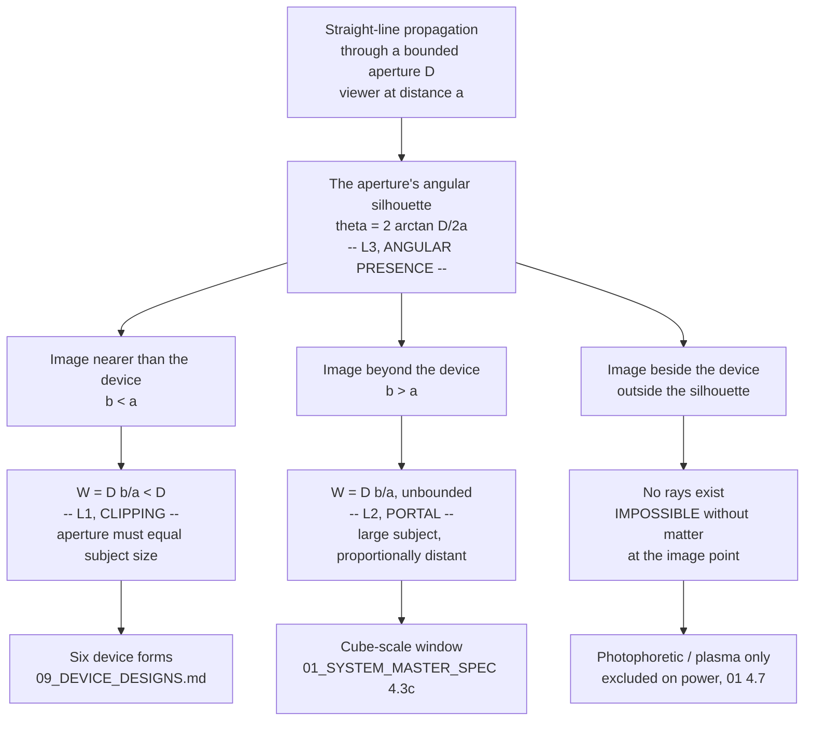

One consequence worth stating because it is repeatedly rediscovered: **an aperture is an emitting *area*, not a solid volume.** Nothing in L1–L3 involves the device's depth. Depth is set only by the source setback (§4.2), which is why every buildable form is a slab and none is a box.

---

#### AIRR — the mechanism, in full

**AIRR (Aerial Imaging by Retro-Reflection)** is Yamamoto & Suyama's mechanism (Utsunomiya University; commercialised in the adjacent MMAP form as ASKA3D). Three static elements, no mechanism, and a real image in the viewer's own space.

##### The ray construction, and why the image lands where it does

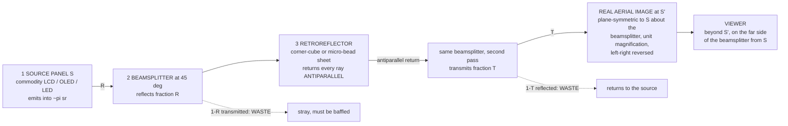

**Why the image forms at `S'`** [DERIVED; confirmed experimentally in Yamamoto 2017 Fig. 2 by intercepting the image on a card]. A ray leaving source point `S` and reflecting off the beamsplitter at point `Q` travels onward as though it had come from `S'`, the mirror image of `S` in the beamsplitter plane. The retroreflector returns it *antiparallel*, so it retraces that same line back through `Q`; the fraction that transmits at `Q` continues along the line toward `S'` and converges there. **Every ray does this, from every point of the retroreflector, so the convergence is exact and the image is real.** Yamamoto verifies it directly: a white card at the plane-symmetric position shows sharp, left-right-reversed characters; move the card fore or aft and they blur (Fig. 2a–c) [MEASURED].

**Three properties fall straight out of that construction, and all three are load-bearing:**

1. **Unit magnification, exactly.** `S'` is a mirror image, and mirror images are the same size. `W_image = W_source`, always. This is the geometric reason `W ≤ D` is *tight* for AIRR rather than merely an upper bound: the aperture and the image are the same object seen twice. [DERIVED; consistent with `02_...` §6.4.]
2. **Image position depends only on the source and the beamsplitter — not on the retroreflector at all.** Retroreflection returns a ray along its own line regardless of where the retroreflective surface sits or which way it faces. Yamamoto demonstrates this with a *curved* retroreflector (Fig. 5) and with retroreflective **fabric** draped in folds (Fig. 6): the aerial image is unaffected by the curvature. His words: *「空中像の位置は光源とハーフミラーの位置で決まり、再帰反射素子の設置位置や形状には依存しない」* — "the position of the aerial image is determined by the positions of the light source and the half mirror, and does not depend on the installation position or shape of the retro-reflector." [MEASURED — Yamamoto 2017 §2.2, Figs. 5–6, citing Yamamoto & Suyama, *Proc. SPIE* **8648**, 86480Q (2013).] **This is the single most important manufacturing fact about AIRR and §3 depends on it.**
3. **Depth of float = source setback, 1:1.** The perpendicular distance from beamsplitter to image equals the perpendicular distance from beamsplitter to source. There is no other knob. [DERIVED + MEASURED, Fig. 2.]

##### The three elements, and what each one actually is

| # | Element | What it is | Static? | Notes |
|---|---|---|---|---|
| 1 | Source panel | Commodity LCD, OLED, or direct-view LED | pixels change; **no mechanism** | The only dynamic element in the device |
| 2 | Beamsplitter | Half-mirror glass, architectural "magic mirror", or **transparent vinyl sheet** | fully static | Yamamoto's 96″ build used greenhouse vinyl [MEASURED] |
| 3 | Retroreflector | Corner-cube (prism) or micro-bead sheeting | fully static | Road-sign / life-jacket material; a commodity, not an optic |

**On retroreflector types** [PUBLISHED, Yamamoto 2017 §2]: prism type is three mutually orthogonal faces (the corner of a cube), reversing direction on all three axes. Micro-bead type is a small ball lens with a reflective coating on its far hemisphere; at refractive index exactly 2 the focal length equals the diameter and return is exact. **Commercial sheeting deliberately misses this.** Yamamoto states micro-bead sheeting is manufactured at **n ≈ 1.93**, so the focal length is slightly longer than the bead diameter and the return beam is deliberately *spread* — because in signage the headlight and the driver's eye are not co-located and a perfectly antiparallel return would be invisible. His closing paragraph makes the consequence explicit: signage optimises for spread, *「空中表示用においては、正確な再帰反射が求められる」* — "for aerial display use, accurate retro-reflection is required." **The retroreflector you can buy is optimised against the application you want.** This is the physical origin of AIRR's blur (§5.3) and it is a component problem, not a physics problem.

##### What the primary literature actually measures

Everything in this table was read from Yamamoto 2017 today. It replaces reasoned figures in `09_DEVICE_DESIGNS.md` §3 and `02_...` §6.4.

| Quantity | Value | Tag | Where |
|---|---|---|---|
| Image position | plane-symmetric to source about the beamsplitter | [MEASURED] | Fig. 2, card interception |
| Magnification | unity (mirror image, left-right reversed) | [MEASURED] | Fig. 2b |
| Independence from retroreflector shape/position | confirmed with curved plate and draped fabric | [MEASURED] | Figs. 5, 6 |
| **Horizontal viewing range, table-top aerial LED screen** | **170° left-to-right (±85°)** | **[MEASURED]** | §2.2, §3.1 |
| What limits that range | **the LED panel's own emission directivity**, not the AIRR optics | [PUBLISHED] | §3.1 |
| Viewing range with transparent retroreflector over the panel | *「半全天球の範囲」* — "hemispherical range" | [PUBLISHED] | §3.3, ref. Tokuda et al., "AIRR with TRR" |
| **Polarised AIRR (p-AIRR) luminance gain** | **>2.2×** vs conventional AIRR, identical camera settings (1/2 s, F4.8, ISO400, 50 cm) | **[MEASURED]** | Fig. 8; method ref. Nakajima, Onuki, Amimori & Yamamoto, *Proc. IDW* **22**, 429–432 (2015) |
| Float distance demonstrated | **50 cm** from the beamsplitter, *「通常の照明下で十分観察できる明るさ」* — "bright enough to be observed clearly under ordinary lighting" | [MEASURED] | §3.1, Fig. 9 |
| Largest build | **96″ LED panel, 192 × 144 cm (240 cm diagonal), 6 mm pixel pitch**, horizontal, vinyl-sheet beamsplitter at 45°, vertical micro-bead retroreflector → life-scale aerial image | [MEASURED] | §3.2, Fig. 10; ref. Onose et al., *IMID 2016 Digest*, E45-3 |
| Multi-depth capability | stacked LED panels at different depths → aerial images at correspondingly different depths, smooth motion parallax, monocular depth | [MEASURED] | Figs. 3, 4 |
| Stated weaknesses | *「像のぼけと光利用効率が低い」* — image blur and low light-utilisation efficiency, both relative to two-reflection (DCRA/MMAP) elements | [PUBLISHED] | §2.2 |
| PSF spread as a *feature* | AIRR's point-spread blends LED chip colours and fills inter-pixel gaps on coarse-pitch panels | [PUBLISHED] | §2.2, ref. Yamamoto, Tomiyama & Suyama, *Opt. Express* **22**, 26919–26924 (2014) |

> **⚠ Correction to `09_DEVICE_DESIGNS.md` §3 and this project's repeated "±20–30° viewing cone" claim.** That figure is **wrong for AIRR** and right for a different mechanism (§2.5). Measured AIRR viewing range is **170° horizontal**, and the limiter is the source panel's emission profile, which is a source-selection decision, not an optical bound. The ±20–30° number appears to have been inherited from MMAP/ASKA3D plate specifications. Every "not a walk-around hologram" caveat in the repo that cites ±20–30° for AIRR needs re-checking against this. `09_DEVICE_DESIGNS.md` §6's third bullet is the specific line to amend.

> **⚠ Correction to `02_...OPTICAL_ENGINEERING.md` §13 ledger.** The entry "PMC12111977 — IP capture → MMAP aerial display of a human head, misalignment tolerances" resolves to Kurihara & Bao, *"Reduction of Aerial Image Misalignment in Face-to-Face 3D Aerial Display"*, **J. Imaging** (2025), DOI `10.3390/jimaging11050150` [PUBLISHED, read 2026-08-16]. Its measured content is: MMAP plate **ASKA3D-200NT, 200 × 200 mm, 0.3 mm pitch, 40° viewing angle**; 13.3″ 3840 × 2160 source; 22-LPI lenticular array, 3.0 mm thick, n = 1.49; depth-direction misalignment reduced to **1.1 mm** from **20.5 mm** with their method. It is a face-to-face aerial-display alignment paper, not an integral-photography capture chain.

##### AIRR versus Pepper's ghost — the same image, the other side of the glass

This distinction decides hard constraint H1 and rule 4 (image in the viewer's space), so it is worth stating precisely rather than by slogan.

**Both mechanisms place light at `S'`, the mirror image of the source in the beamsplitter plane. The difference is which side of the beamsplitter the viewer stands on** [DERIVED]:

- **Pepper's ghost** — viewer on the *same* side as the source, looking at the beamsplitter's reflection. `S'` is therefore on the far side of the plate from the viewer, and the image is **virtual and behind the glass**.
- **AIRR** — the retroreflector folds the light back through the plate, so the viewer stands on the *far* side. `S'` now lies **between the viewer and the plate**, and the image is **real and in front**.

The retroreflector's entire job is to move the viewer to the other side. That is the whole of the difference, and it is the whole of why one satisfies rule 4 and the other does not.

| | **Pepper's ghost** | **AIRR** |
|---|---|---|
| Image type | **Virtual** | **Real** |
| Apparent position | behind the plate | in front of the plate, in the viewer's space |
| Can be caught on a card? | no | **yes** (Yamamoto Fig. 2) [MEASURED] |
| Can a hand pass through it? | no — glass intervenes | yes |
| Occlusion by real objects in front | impossible | possible |
| Elements | panel + beamsplitter | panel + beamsplitter + retroreflector |
| Passes | 1 | 2 |
| Throughput ceiling | `R ≤ 1` (0.3–0.5 typical for see-through) | `R·T ≤ 0.25` (§4.1) |
| Cost per m² at large scale | negligible — one sheet of glass | retroreflector area cost dominates |
| Moving parts | none | none |
| **Rule 4 (in your space)** | **fails** | **passes** |
| Where this project uses it | device 04, shop window (viewer is a passer-by; virtual is acceptable) | devices 01, 02, 03, 05, 06 |

Both obey L1 identically: you see the image only where the source (Pepper's) or the retroreflector (AIRR) is visible through the plate.

##### The third static option — MMAP / DCRA, and where the ±20° actually comes from

A dihedral-corner-reflector array (DCRA), sold as **ASKA3D** and generically as a micro-mirror array plate (MMAP), forms a real aerial image by **two orthogonal reflections inside a plate** rather than by retroreflection. It is also fully static and also forms a real image in the viewer's space, so it belongs in the same family.

| | AIRR | MMAP / DCRA (ASKA3D) |
|---|---|---|
| Mechanism | retroreflection through a beamsplitter | double reflection in crossed mirror arrays |
| Elements | 3 (panel, beamsplitter, retroreflector) | 2 (panel, plate) |
| Thickness | needs the 45° fold volume | **plate is millimetres thick** |
| Image sharpness | blurrier — long free-space path + imperfect retroreflection [PUBLISHED, Yamamoto 2017 §2.2] | **sharper** — shorter propagation [PUBLISHED, ibid., citing Maekawa et al., *Proc. SPIE* 6392/6803] |
| Light efficiency | low (§4) | higher, but with single-reflection false images and edge-scatter ghosts [PUBLISHED, ibid.] |
| **Viewing angle** | **170° measured** | **40° (ASKA3D-200NT spec, ±20°)** [PUBLISHED, DOI 10.3390/jimaging11050150] |
| Scalability / cost | **excellent** — mass-produced sheeting, arbitrarily large | large-area plates are the field's stated industrial problem [PUBLISHED, ibid.] |
| Patent status | Utsunomiya **US11340475B2**, active to 2038-12-10 [PUBLISHED, `05_...` §3.1] | Asukanet **US8867136B2**, active to 2030-08-02 [PUBLISHED, ibid.] |

**This table is the resolution of the ±20° confusion: 40° is the ASKA3D plate's number.** Both routes are encumbered — `05_RESEARCH_PRIOR_ART_AND_PATENT_ARCHITECTURE.md` §8 rates Branch C FTO risk **High** and prescribes buying a genuine licensed plate so patent exhaustion applies, rather than fabricating an array in-house. That guidance is unchanged by anything here.

**Selection rule for TAYF** [DERIVED from the two tables]: AIRR where viewing angle and area scaling matter and thickness does not (devices 01, 02, 03, 05); MMAP where thickness is the binding constraint and a 40° cone is acceptable — which is precisely the folio's unresolved three-surface fold (`09_DEVICE_DESIGNS.md` §7 item 2). **The folio should be re-evaluated as an MMAP device, not an AIRR device.** A millimetre-thick plate has no 45° fold to collapse into a hinge, which dissolves the open mechanical problem rather than solving it.

---

#### Zero moving parts, and what follows from it

**The finding** [`09_DEVICE_DESIGNS.md` §2]: the AIRR, MMAP and Pepper's-ghost routes contain **no mechanism whatsoever**. The optics are static sheets of glass and film. The only dynamic element in the entire device is pixels changing on a flat panel — the same component as in a phone.

| Approach | Moving parts | Consequence | Status in this project |
|---|---|---|---|
| Laser-plasma voxels | galvo/AOD scanning at 10⁴–10⁵ Hz | wear, alignment drift, acoustic noise, cost | **Excluded on power** — 25–250× outside the thermal envelope [`01_...` §4.7] |
| Acoustic trap (MATD) | a bead flown at 8.75 m/s | bead loss, air-current sensitivity, ~6-particle ceiling | Excluded on particle count |
| Photophoretic trap | galvos + focus-tunable lens | Class-4 laser, alignment, particle handling | Single particle only since 2018 [arXiv 2512.09401] |
| Swept volume (Voxon class) | a physically spinning screen | noise, vibration, sealed housing, service life | The one geometry with true 360° walk-around |
| **AIRR / MMAP / Pepper's plate** | **none** | **silent, no wear, no drift, no consumables** | **The surviving family** |

**Consequences, each with its evidential basis:**

1. **Silent.** No scanner, no rotor, no ultrasound, and — because the optical path dissipates nothing (§4.4 shows the *panel* is the load, not the optics) — no forced-air requirement in the optical compartment. It can sit beside a conversation. [DERIVED]
2. **No wear-out mechanism.** Service life is the display panel's, not a bearing's. [DERIVED]
3. **No alignment drift — and now this is measured, not asserted.** Yamamoto's Fig. 5/Fig. 6 result (§2.1 property 2) says the aerial image's position is *independent of the retroreflector's position and shape*, demonstrated with a curved plate and with draped fabric. **The largest and most awkward optic in the system carries no alignment tolerance at all.** Only the beamsplitter plane and the source position matter, and those are two rigid parts bonded once. Contrast this with `04_CUBE_HARDWARE_AND_PROTOTYPE_ENGINEERING.md` §12.3, which names the alignment step as the schedule risk for the coherent-modulator build. [MEASURED — this is the strongest single argument for the family and it was unavailable to this project until today.]
4. **No consumables.** No beads to reload, no medium to replenish, nothing to inhale.
5. **Safe by construction, not by controls** (§6). Rule 10 is satisfied by the choice of mechanism.
6. **Cheap to manufacture.** Sheet optics and a commodity panel. Yamamoto's 2.4 m-diagonal build used **greenhouse vinyl** as the beamsplitter [MEASURED], which is the most economically informative single detail in the AIRR literature.
7. **Sealed enclosure is viable.** `04_...` §7 rejects venting because a dust particle at a beam waist in a *coherent* system produces a whole-field diffraction artifact. AIRR is incoherent and has no beam waist; a dust particle on the retroreflector removes that particle's area from the aperture and nothing else. **Dust degrades AIRR gracefully and degrades CGH catastrophically.** [DERIVED]

**What it does not fix** [`09_DEVICE_DESIGNS.md` §6, unchanged]: a device is still visible behind the person, because light must come from somewhere and that somewhere must be as wide as the person (L1); and rule 6 (the 10 cm form factor) is broken in every case, which is the law, not a limitation of the designs.

---

#### Optical efficiency budget

##### The throughput chain, and why 75% loss is the *best* case

Conventional AIRR, per-pass [DERIVED]:

```
eta_AIRR = R  ×  eta_RR  ×  T
           |      |        |
           |      |        +-- beamsplitter transmission, 2nd pass
           |      +----------- retroreflector return efficiency into the useful cone
           +------------------ beamsplitter reflection, 1st pass
```

For a non-polarising beamsplitter, `T = 1 − R` (lossless), so the product `R·T = R(1−R)` is maximised where `d/dR [R − R²] = 1 − 2R = 0`, i.e. **at `R = T = 0.5`, giving `R·T = 0.25`** [DERIVED].

**Therefore ~75% loss is not a typical figure — it is the optimum, and any real beamsplitter does worse.** An architectural half-mirror at 30R/70T gives `R·T = 0.21`; at 20R/80T, 0.16. `09_DEVICE_DESIGNS.md` §3's "~50% per pass, ~75% total" is correct and is now sharpened: **0.25 is a ceiling, reached only by a true 50/50 splitter, before the retroreflector is accounted for at all.**

The two waste channels [DERIVED]:
- **First pass, `1−R`:** transmits straight through, exiting on the retroreflector's far side. Must be baffled or aimed out of the viewer's cone.
- **Second pass, `1−T`:** reflects back toward the source. Harmless if the panel is matte; a source of veiling glare if it is glossy.

**The channel that actually hurts** is not either of these but the direct sight-line to the panel. Where the source panel lies in the viewer's line of sight through the beamsplitter, the viewer sees it at `T·L_source` against an image at `R·T·η_RR·L_source` — i.e. **the bare panel is `1/(R·η_RR) ≈ 2–3× brighter than the floating image it is producing**, and the image washes out. This is exactly Yamamoto's large-panel failure (§3.2: *「水平に設置された LED パネルが見える位置から観察すると空中像が途切れてしまう」* — "observed from a position where the horizontally installed LED panel is visible, the aerial image breaks up") and his fix is the transparent retroreflector of §3.3 [PUBLISHED + DERIVED]. **Design rule: the source panel must lie outside the viewer's cone, or be covered by a transparent retroreflector.** This is a packaging constraint on every one of the six forms.

##### Polarised AIRR breaks the 1/4 bound

`R·T ≤ 0.25` binds only because `R` and `T` describe the *same* beam. Replace the half mirror with a **reflective polariser** and put a **quarter-wave retarder** on the retroreflector, and they describe *orthogonal polarisations* instead: S-polarised light is reflected (≈100%) toward the retroreflector; two passes of the QWP rotate it to P; the polariser transmits P (≈100%) [PUBLISHED, Yamamoto 2017 §2.3, Fig. 7b].

| Source | Conventional | p-AIRR, first principles | Gain |
|---|---|---|---|
| **Unpolarised** (LED, OLED) | `0.25·η_RR` | polarise first (×0.5), then ≈1 × 1 → `0.5·η_RR` | **2×** [DERIVED] |
| **Already polarised** (LCD — its output is linearly polarised by construction) | `0.25·η_RR` | ≈1 × 1 → `≈1.0·η_RR` × polariser/QWP losses | **~4×** [DERIVED, UNTESTED] |

**Measured: >2.2×** on an unpolarised LED source under identical camera settings [MEASURED, Yamamoto 2017 Fig. 8] — slightly above the 2× first-principles figure, consistent with a reflective polariser recycling rather than absorbing the rejected state.

> **Design consequence, and it is a big one: use an LCD source, not OLED.** LCD output is already linearly polarised, so p-AIRR costs one retarder film and no light at all, and the predicted gain is ~4× rather than 2×. **This inverts the usual panel-selection instinct** (OLED for contrast) and it is a cheap experiment: build the disc twice, once each way. [DERIVED — the 4× figure is untested and is the highest-value cheap measurement in this section.]

##### From throughput to required source luminance

**Luminance transfer is throughput, exactly** [DERIVED]. AIRR is a unit-magnification relay with no angular compression, so étendue is unchanged and radiance is conserved up to loss:

```
L_image = eta_AIRR × L_source
```

**The reference the image must match** [DERIVED, `02_...` §7.1, Lambertian `L = Eρ/π`, skin reflectance ρ ≈ 0.35]:

```
Real face at 500 lux (office):     L = 500 × 0.35 / pi =  55.7 cd/m^2
Real face at 300 lux (living room): L = 300 × 0.35 / pi =  33.4 cd/m^2
Real face at 200 lux (lamp-lit):   L = 200 × 0.35 / pi =  22.3 cd/m^2
```

Design targets, following `02_...` §7.1: **56 cd/m² is the "matches a real face" floor; 200 cd/m² reads as clearly present without looking like a lamp; below ~30 cd/m² it washes out.**

**Required source luminance, `L_source = L_image / η_AIRR`** [DERIVED; `η_RR` is the free parameter and is the one number in this table that is [UNVERIFIED]]:

| `L_image` target | Conventional, `η_RR`=1.0 (η=0.25) | Conventional, `η_RR`=0.6 (η=0.15) | Conventional, `η_RR`=0.35 (η=0.088) | p-AIRR ×2.2, `η_RR`=0.6 (η=0.33) |
|---|---|---|---|---|
| 22 cd/m² (face @200 lux) | 89 | 149 | 255 | 68 |
| **56 cd/m² (face @500 lux)** | **223** | **371** | **637** | **169** |
| 100 cd/m² | 400 | 667 | 1143 | 303 |
| **200 cd/m² (design target)** | **800** | **1333** | **2286** | **606** |
| 500 cd/m² (bright room) | 2000 | 3333 | 5714 | 1515 |

All figures cd/m². Panel classes for comparison: commodity laptop/tablet LCD ~300–500 cd/m²; high-brightness signage LCD ~1000–2500 cd/m²; direct-view LED signage ~1000–5000 cd/m² [all four figures [ESTIMATE] — no datasheet in this repo; a single sourced part number with a luminance spec would convert them to [PUBLISHED], and that belongs in `hardware/bom.md`].

**Reading the table.** Matching a real face (56 cd/m²) needs a **371 cd/m² panel** at a pessimistic `η_RR` — a bog-standard commodity display. Hitting the 200 cd/m² "clearly present" target needs **1333 cd/m²** conventionally (high-brightness signage class) or **606 cd/m²** with p-AIRR (a good tablet panel). **Brightness is not a blocker for AIRR; it is a panel-class purchasing decision, and p-AIRR moves it one class down.**

**Empirical corroboration** [MEASURED, Yamamoto 2017 §3.1]: a table-top AIRR image floating **50 cm** off the beamsplitter was *"bright enough to be observed clearly under ordinary lighting"* with an LED-panel source. That is the qualitative version of the table's conclusion, from hardware.

##### The cost nobody has budgeted: source panel power scales with aperture area

**This is a new result and it connects §1 directly to `01_SYSTEM_MASTER_SPEC.md` §5's binding thermal constraint.** L1 says aperture area is set by subject size. §4.3 says the panel must run at ~600–1300 cd/m². Luminous flux from a Lambertian emitter is `Φ = L·A·π`, so **the optical power draw of an AIRR device scales with the square of the subject's linear size.**

Worked for `L_source = 1333 cd/m²` (conventional AIRR, `η_RR` = 0.6, 200 cd/m² image), full-aperture emission and at a realistic 0.35 fill factor for a face on a dark ground [DERIVED; system efficacies are [ESTIMATE] — 20 lm/W for an LCD-plus-backlight stack, 60 lm/W for direct-view LED]:

| Device (`09_DEVICE_DESIGNS.md`) | Aperture | Area | Φ at full fill | **Electrical, LCD @0.35 fill** | **Electrical, LED @0.35 fill** |
|---|---|---|---|---|---|
| **06 Folio** | 300 × 210 mm | 0.063 m² | 264 lm | **4.6 W** | 1.5 W |
| **03 Disc** | 500 mm dia | 0.196 m² | 821 lm | **14 W** | 4.8 W |
| **01 Mirror** | 550 × 1750 mm | 0.963 m² | 4031 lm | **71 W** | 24 W |
| **02 Doorway** | 800 × 2000 mm | 1.60 m² | 6702 lm | **117 W** | 39 W |
| **05 Command table** | 1500 × 1500 mm | 2.25 m² | 9425 lm | **165 W** | 55 W |
| **04 Shop window** (Pepper's, η=0.5 → 400 cd/m²) | 2400 × 2200 mm | 5.28 m² | 6635 lm | **116 W** | 39 W |

**Three conclusions** [DERIVED]:

1. **The folio and the disc are appliance-class** (5–14 W optical) and sit inside a passive thermal envelope of the kind `01_...` §5 analyses. Note that even the folio's 4.6 W is *comparable to the whole optical share* `02_...` §9.2 allocates in a 100 mm cube — the panel, not the optics, is now the optical-engine load.
2. **The mirror, doorway and table are mains appliances** (24–165 W), and their thermal design is a completely different exercise from the cube's. Nothing in this repo has budgeted for that.
3. **`02_...` §7.3's headline "the optical source is not a thermal problem" is true for the CGH branch and false for the AIRR branch.** The CGH branch delivers 1–4 lm into a ±20° cone from a 135 mW laser; AIRR emits Lambertianly into π sr from an area as large as the subject and throws away 75–85% of it. Same image, 100× the source flux. **That is the price of unit magnification with no étendue compression, and it should be recorded as the AIRR family's principal hidden cost.**

Mitigations, in order of value [DERIVED]: p-AIRR (2–4×, §4.2); restricting the panel's emission cone with a brightness-enhancement film or a directional backlight, which trades §5.1's 170° viewing range for luminance in exact proportion (étendue conservation — this is a genuine, tunable knob and it is why Yamamoto's viewing range is source-limited); and driving only the pixels the subject occupies, which is what the 0.35 fill factor above already assumes.

---

#### Viewing cone, depth of float, resolution

##### Viewing cone

| Mechanism | Cone | Set by | Tag |
|---|---|---|---|
| AIRR, table-top LED source | **170° horizontal** | the source panel's emission directivity | [MEASURED, Yamamoto 2017 §3.1] |
| AIRR + transparent retroreflector over panel | "hemispherical" | as above | [PUBLISHED, ibid. §3.3] |
| MMAP / ASKA3D-200NT plate | **40° (±20°)** | plate geometry | [PUBLISHED, DOI 10.3390/jimaging11050150] |
| Pepper's ghost | source emission × plate extent | as above | [DERIVED] |

**The cone is not the constraint people think it is.** For AIRR, the optics impose essentially nothing; the source panel does. What *does* constrain the viewpoint is L1 applied to the retroreflector: **you see the aerial image only from positions where the retroreflector is visible through the beamsplitter** [PUBLISHED, Yamamoto 2017 Fig. 11a]. That is a geometric coverage requirement on the retroreflector's extent, not an angular bound on the mechanism, and it is why Yamamoto's fix is more retroreflector rather than a different retroreflector.

**Practical statement for TAYF:** a seated conversational geometry needs the retroreflector to subtend the viewer's plausible head-position range from the image, and the panel to emit over that range. Both are met by commodity parts. **Delete "not a walk-around hologram, ±20–30°" from the AIRR device descriptions and replace it with "the retroreflector must be visible from wherever you intend to sit."**

##### Depth of float

**Float distance = source setback, exactly and only** [DERIVED + MEASURED, §2.1 property 3]. There is no other parameter. Consequences:

- A device that floats its image `d` in front of the beamsplitter must place its panel `d` behind it, so **device depth ≥ float distance + fold volume**. This is why the aperture law's "an aperture is an area, not a volume" (§1.4) still leaves a depth term: the depth is bought by float distance, never by image size.
- The 45° beamsplitter must have clear diagonal `≥ d·√2` [DERIVED] — the geometry that kills a 100 mm float inside a 100 mm cube (141 mm diagonal required) and permits a 40 mm float (57 mm diagonal), per `02_...` §6.4/Layout C. That arithmetic is unchanged.
- **AIRR relays whatever the source is; it adds no depth of its own.** A flat panel produces a flat aerial plane floating in mid-air — real, catchable on a card, with correct accommodation *to that plane*, but flat. Volume requires the source to have volume: Yamamoto obtains it with **stacked LED panels at different depths**, which produces aerial images at correspondingly different depths with smooth motion parallax and monocular depth perception [MEASURED, Figs. 3–4]. **For TAYF this is the load-bearing architectural fact about the whole family:** a light-field or multi-plane source relayed by AIRR gives a volumetric floating human; an ordinary panel relayed by AIRR gives a floating flat cut-out. The optical stage does not decide which — the source does.
- Consistency with `01_...` §8's ≥0.3 m depth range requirement: that requires ≥0.3 m of source depth structure, which no single flat panel provides. **This is an open specification conflict and it belongs on the risk list.**

##### Resolution

**Chain** [DERIVED]. Unit magnification means image resolution = source resolution, convolved with the retroreflector's point-spread function.

**What the eye demands.** 1 arcmin = `2.909×10⁻⁴` rad. At a 1.0 m viewing distance that is **0.29 mm** at the image plane; across a 250 mm head, **859 resolvable points** (`01_...` §4.2, §8).

**What the source supplies.** A 4K panel (3840 px) across a 250 mm head gives a 65 µm pitch — **4.5× finer than the eye can use** [DERIVED]. Even a 1080p panel gives 130 µm, still 2.2× in surplus. **The source panel is not the resolution limit.** Yamamoto's 96″ build used a 6 mm pitch LED panel, which at 1 m subtends 20 arcmin and is coarse by 20× — appropriate for signage at metres, not for a face at one metre.

**What the retroreflector costs.** Three blur terms, none of which this project can currently put a number on:

| Blur term | Mechanism | Number |
|---|---|---|
| Deliberate return-beam spread | signage sheeting built at n ≈ 1.93 instead of 2.0, spreading the return so the driver sees it [PUBLISHED, Yamamoto 2017 §2] | **[UNVERIFIED]** — dominant term, and it is a *component specification*, not a physical limit |
| Element pitch | corner-cube or bead sampling grid | ASKA3D-200NT plate is **0.3 mm** [PUBLISHED] — exactly at the 0.29 mm eye limit, i.e. marginal; micro-bead sheeting bead diameter [UNVERIFIED] |
| Free-space propagation | AIRR's path is longer than DCRA's, and Yamamoto names this as why DCRA is sharper [PUBLISHED, §2.2] | **[UNVERIFIED]** |

**Two honest readings of the same fact.** Yamamoto reports AIRR's PSF spread as *advantageous* for LED panels — it blends chip colours and fills inter-pixel gaps [PUBLISHED, §2.2]. For a 6 mm-pitch signage panel that is a feature. **For a 65 µm-pitch panel showing a face at 1 m it is exactly the failure mode**, and it is the reason a life-size AIRR head could turn out soft even though the panel behind it is not. **This is the single largest technical unknown in the optical section** (§7).

**Closed-form model exists and is unread**: DOI `10.1007/s10043-026-01034-w`, *"Modeling of imaging property in optical system of aerial imaging by retro-reflection (AIRR)"*, Optical Review (2026) — an analytic line-spread-function model, i.e. blur versus geometry in closed form [PUBLISHED at record level; **content UNVERIFIED**, Springer, not open access]. A companion differentiable AIRR renderer (DOI `10.1007/s10043-026-01038-6`) would allow software pre-distortion to partially cancel the measured OTF [record level; content UNVERIFIED].

---

#### Eye safety — by construction, not by controls

**The claim.** This device family is eye-safe because of what it is made of, not because of what has been engineered around it. That is a categorically stronger position than the alternatives, and it is worth deriving rather than asserting.

**The derivation** [DERIVED, from conservation of radiance]. Retinal irradiance from an **extended, incoherent, uncollimated** source is set by the source's radiance and the pupil area, and is *independent of viewing distance* — moving closer enlarges the retinal image in exactly the proportion that the collected flux increases. Therefore:

1. The only radiometric quantity that matters is the **panel's own radiance**, which is bounded by its luminance — 300–5000 cd/m² across every panel class in §4.3 [ESTIMATE].
2. **A passive optic at unit magnification cannot increase radiance.** Étendue is conserved; throughput is ≤1; AIRR's is ≤0.25 (or ≤0.55 for p-AIRR). **The aerial image is strictly dimmer than the panel that made it.**
3. Therefore **if the source panel is safe to look at, the device is safe to look at, at every distance, in every failure mode that leaves the optics passive** — and the optics have no active mode to fail out of, because they contain no mechanism (§3).

There is no beam to collimate, no focus to accidentally form, no zero order to block, no source that is Class 3B with the lid off. Contrast this with the wavefront branch, where `02_...` §9.3 finds a comfortable 480× margin in nominal operation *but* a **135×-over-MPE undiffracted zero order in a single-fault condition**, requiring a mandatory hardware beam block and a frame-validity watchdog. **AIRR has no analogous fault.**

| Mechanism | Hazard class | Basis of safety | What can go wrong |
|---|---|---|---|
| **AIRR / MMAP / Pepper's** | **panel-class, non-laser** | **construction** — radiance conservation; no coherent source, no plasma, no ultrasound | nothing in the optical path; the panel is the hazard and it is a phone screen |
| CGH / holographic SLM | Class 3B enclosed | engineering controls | zero-order fault at **135× MPE**; accidental focus; enclosure interlock [`02_...` §9.3] |
| fs-laser plasma | **Class 4 by definition** | structural exclusion + gaze gating | `10¹³–10¹⁴ W/cm²` at focus *is* the operating point; 8–80 MW peak; the converging beam before focus is the hazard, not the plasma [`02_...` §9.3] |
| Photophoretic trap | Class 4 | as above | plus airborne particulate handling |
| Acoustic trap (MATD) | high-intensity ultrasound, 140–157 dB SPL | exposure limits | auditory/tissue exposure; a bead in flight at 8.75 m/s |

**Three further construction-level properties** [DERIVED]: no plasma means no ozone or NOx byproduct and no acoustic shock; no ultrasound means no hearing-exposure case to make; no consumable medium means nothing to inhale. **Hard constraint H5 ("eye-safe under all foreseeable use and failure modes") and rule 10 are satisfied by mechanism choice**, which is the cheapest way any requirement in this project gets met.

**What still has to be done, and it is paperwork rather than physics** [UNVERIFIED — this is a compliance gap, not a technical one]: the applicable standard for a panel-based emitter is **IEC 62471** (photobiological safety of lamps and lamp systems), under which ordinary displays are expected to fall in the Exempt Group. *This project has not read IEC 62471 and has not performed the classification.* What would confirm it: the standard text plus a spectroradiometric measurement of the chosen panel's radiance and blue-light-weighted radiance. Until that is done, "Exempt Group" is a reasonable expectation, not a finding.

---

#### The honest optical unknowns

Ranked by how much each would change the design if resolved.

| # | Unknown | Current state | What would close it |
|---|---|---|---|
| **1** | **Absolute photometric transfer: aerial-image luminance in cd/m² for a stated source luminance** | Yamamoto 2017 gives a *ratio* (p-AIRR >2.2×) and qualitative adequacy ("bright enough under ordinary lighting"), never an absolute. `η_RR` is unmeasured, and the widely-repeated "<25% of source light reaches the aerial image" figure is a **search-engine paraphrase** the repo already flagged as not citable [UNVERIFIED]. **Every number in §4.3 is [DERIVED] on an unmeasured `η_RR`.** | One afternoon with a **spot luminance meter** (`04_...` §15 already specifies one): measure `L_source` and `L_image` on a bench AIRR rig. This is the highest leverage-to-cost measurement in the optical section. |
| **2** | **Resolution / line-spread function** — will a life-size face be sharp, given that commercial retroreflective sheeting is *deliberately* built to spread the return? | Qualitative only: AIRR is blurrier than DCRA [PUBLISHED]; PSF spread is a feature at 6 mm pitch and presumably a defect at 65 µm [DERIVED]. **No LSF number exists in this project.** | Either the closed-form model (DOI 10.1007/s10043-026-01034-w, paywalled, content UNVERIFIED) or — cheaper and better — a **USAF-1951 / slanted-edge target** through a bench rig. §5.3 gives the pass threshold: 0.29 mm at 1 m. |
| 3 | **Retroreflector return efficiency `η_RR` into the useful cone** | Unmeasured. Signage sheeting is specified as a *coefficient of retroreflection* (cd/lx/m² at a stated observation angle), which does not convert to a scalar efficiency without knowing the return cone. [UNVERIFIED] | Integrating-sphere or goniophotometric measurement of a candidate sheet; or a vendor datasheet with an angular return profile rather than a single ASTM grade. |
| 4 | **The predicted ~4× p-AIRR gain with an LCD (already-polarised) source** | 2.2× measured on an unpolarised LED source [MEASURED]; the LCD case is [DERIVED, UNTESTED] and would halve every source-luminance figure in §4.3. | Build the disc twice — LCD + reflective polariser vs. LED + half mirror — and photograph both under identical settings, which is exactly Yamamoto's own Fig. 8 protocol. |
| 5 | **Depth: a flat source gives a flat floating image** | Established (§5.2). `01_...` §8 requires ≥0.3 m of depth range. **These are in direct conflict and the conflict is unresolved.** | Decide whether the source is a flat panel (accept a floating flat cut-out, and say so), a stacked multi-plane assembly (Yamamoto's approach, [MEASURED]), or a light-field panel. This is an architecture decision, not a measurement. |
| 6 | **The remaining AIRR journal line** | Yamamoto 2017 is now read. The *quantitative* Optical Review papers are not: the LSF model (`10.1007/s10043-026-01034-w`), the differentiable renderer (`10.1007/s10043-026-01038-6`), the thickness-reduction paper (Optical Review 2023), the two-transparent-spheres resolution paper (Optical Review 2022). Springer, paywalled. **Note that Optics Express and OSA Continuum are open-access and were previously mis-assessed as paywalled** — the block there was JS-gating on `opg.optica.org`, which a PDF-endpoint fetch or a library proxy defeats. | Document delivery or institutional access for the Springer/Optical Review items; a PDF-endpoint retrieval for the Optica items. `09_DEVICE_DESIGNS.md` §7 item 1 can be **downgraded from "largest open item" to "partially closed."** |
| 7 | **Panel luminance and efficacy figures** | §4.3's panel classes and §4.4's 20 / 60 lm/W system efficacies are [ESTIMATE] with no part number behind them. | One sourced panel with a datasheet, into `hardware/bom.md`. Converts two tables from [ESTIMATE] to [PUBLISHED]. |
| 8 | **IEC 62471 classification** | Not read, not performed [UNVERIFIED]. | Standard text plus spectroradiometry on the chosen panel (§6). |

**What is *not* on this list, and deliberately so:** whether the aperture law can be beaten. `01_SYSTEM_MASTER_SPEC.md` §4.3d–§4.3g closed that with three independent searches, and this section's §1 only re-derives and re-cites it. Anyone reopening it should start there rather than here.

---

#### Citation ledger for this section

**Read in full, this session (2026-08-16):**

| Source | Used for | Status |
|---|---|---|
| 山本裕紹, "Aerial Display with Aerial Imaging by Retro-Reflection (AIRR)", *J. Imaging Soc. Japan (日本画像学会誌)* **56**(4), 341–351 (2017). `jstage.jst.go.jp/article/isj/56/4/56_341/_pdf` | §2.1–§2.3, §3, §4.1–§4.2, §5.1–§5.3 — viewing angle, p-AIRR gain, alignment insensitivity, 96″ build, retroreflector physics, the clipping statement | **[MEASURED/PUBLISHED] — open access, retrieved and read in full** |
| Kurihara & Bao, "Reduction of Aerial Image Misalignment in Face-to-Face 3D Aerial Display", *J. Imaging* (2025), DOI `10.3390/jimaging11050150` (PMC12111977) | §2.5 — ASKA3D-200NT plate spec (200 × 200 mm, 0.3 mm pitch, 40° viewing angle); misalignment 1.1 mm vs 20.5 mm | **[PUBLISHED] — open access, read** |

**Cited at record level from Yamamoto 2017's own reference list; full texts not read** [PUBLISHED at record level, content UNVERIFIED]: Yamamoto, Tomiyama & Suyama, *Opt. Express* **22**, 26919–26924 (2014) — the founding AIRR paper · Yamamoto & Suyama, *Proc. SPIE* **8648**, 86480Q (2013) — retroreflective-sheeting aerial 3D LED display, the shape-independence result · Nakajima, Onuki, Amimori & Yamamoto, *Proc. IDW* **22**, 429–432 (2015) — p-AIRR polarisation analysis · Onose, Okamoto, Onuki, Takahashi & Yamamoto, *IMID 2016 Digest* E45-3 — the 96″ build · Tokuda et al., "AIRR with Transparent Retro-Reflector" · Maekawa, Nitta & Matoba, *Proc. SPIE* **6392**, 63920E (2006) and **6803**, 68030B (2008) — DCRA/micromirror-array imaging · Burckhardt, Collier & Doherty, *Appl. Opt.* **7**, 627–631 (1968) — earliest retroreflective image formation.

**Inherited from this repository's own verified ledgers** (not re-verified here): Smalley et al., *Nature* **553**, 486–490 (2018), DOI `10.1038/nature25176` — the clipping theorem [verified in `02_...` §13] · Rogers & Smalley, *Sci. Rep.* **11** (2021) [record level] · Jones, *J. Res. NBS* **86**(1) 27 (1981) — air refractivity [`01_...` §4.3e] · Utsunomiya **US11340475B2**, Asukanet **US8867136B2** [`05_...` §3.1, both tier **[V]**] · arXiv `2512.09401` — photophoretic review [`02_...` §13].

**Unresolved / not citable as fact:** the "<25% of source light contributes to the aerial image" figure remains a **search-engine paraphrase** with no located primary source, exactly as `experiments/aerial-imaging/README.md` flagged; §4.1's independently derived `R·T ≤ 0.25` happens to agree with it, which is corroboration of the arithmetic and **not** a verification of the quote. Do not cite the quote. Cite the derivation.

**Computed in this section and re-derivable from the formulas shown:** the L1 aperture table; the L2 portal table including the 1.70 m-at-3.4 m and 4.50 m-at-9 m rows; `θ = 2·arctan(D/2a)` and its three-point agreement with `01_...` §4.3c; the 12.6° / 43.6° / 80.7° subject angles and the `D = 0.22a / 0.80a / 1.70a` device-size table; `R·T ≤ 0.25` and its optimum at `R = 0.5`; the p-AIRR 2× (unpolarised) and ~4× (LCD) first-principles gains; the 22.3 / 33.4 / 55.7 cd/m² real-face luminances; the full `L_source = L_image/η` table; `Φ = L·A·π` and the six-device power table; the 0.29 mm / 859-point eye-resolution thresholds and the 4.5× 4K panel surplus; and the radiance-conservation eye-safety argument.

---

## 5. Capture and human representation

This section owns everything between the photons entering the local sensor and the 868-byte packet leaving the local NIC, plus the receive-side inverse: a cached canonical avatar deformed by the arriving state vector. It ends at the renderer's output. Free-space emission is the other half of the system and is not discussed here except where the aperture law changes a capture decision.

The whole section is one thesis with one arithmetic consequence:

> **Identity is a slowly-varying quantity; pose is a fast one. Transmitting them at the same rate is the category error that makes volumetric telepresence cost 20–300 Mbps.** Split them, and the runtime channel is 215 floats — **~0.16 Mbps on the wire** [DERIVED, §8.2].

---

#### The amortization split, and the two machines

| Architecture | What crosses the wire per frame | Bitrate | Tag |
|---|---|---|---|
| (a) Stream the volume — point clouds / 4D Gaussians | geometry + appearance | 20–300 Mbps | [PUBLISHED] `research/01-volumetric-capture-sota.md` §3.2 |
| (b) Reconstruct per-frame from sparse views, stream the result (Tele-Aloha class) | reconstructed representation | ~100 Mbps | [PUBLISHED] arXiv [2405.14866](https://arxiv.org/abs/2405.14866) |
| **(c) Pre-build the avatar offline, stream only driving parameters** | **pose/expression state** | **Mon3tr <0.2 Mbps; Apple Spatial Persona 0.7 Mbps** | **[MEASURED]** arXiv [2601.07518](https://arxiv.org/abs/2601.07518); arXiv [2405.10422](https://arxiv.org/abs/2405.10422) |

TAYF is class (c) without qualification. The corollary that governs every decision below: **spend arbitrarily on the offline path, spend nothing on the online path.** A 33-second enrollment on a desktop GPU is free; a 3 ms regression in the per-frame loop is not.

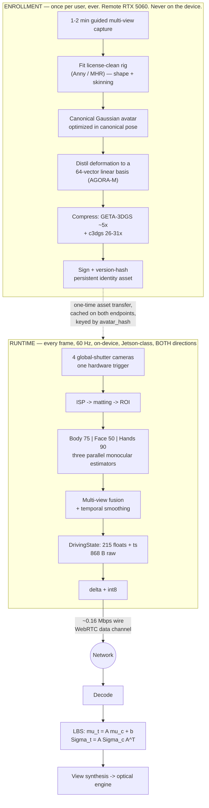

**The two machines are an architectural boundary, not an optimization.** `docs/architecture.md`: *"Remote RTX 5060 is used only for offline avatar enrollment (one-time per-user build), never in the runtime loop."* Anything that needs the 5060 at runtime is a design error [PUBLISHED — repo-normative]. The deployed part is a Jetson Orin Nano-class module at **7–15 W** [PUBLISHED — NVIDIA module power-mode envelope, not a TAYF measurement] running *both* directions concurrently against a **≈16 W total enclosure budget at the ~48 °C metal touch limit** [DERIVED — `docs/01` §5].

---

#### Camera architecture

##### Count, and what actually pins it

**Four cameras**, tiled across two adjacent faces: 2 on the front face at ~70 mm baseline, 1–2 on an adjacent face for oblique/profile coverage [ESTIMATE — layout is engineering judgement in `hardware/camera-rig.md`, not measured].

The array is **not a stereo reconstruction rig**. The estimators in §4 are monocular — Mon3tr drives its entire system from one sub-$20 webcam [PUBLISHED, 2601.07518]. The array exists as **redundancy against self-occlusion**: a monocular estimator under occlusion does not fail gracefully, it hallucinates a plausible-but-wrong limb configuration, and the receiver renders that error confidently. The fusion layer selects or blends *per body part*; it does not triangulate.

**The count is pinned at 4 by the MIPI lane budget, not by the FOV analysis** [DERIVED — `docs/04` §6.4]:

```
per camera : 1456 × 1088 px × 60 fps × 10 bit = 950.5 Mbps
four cameras                                  = 3.80 Gbps aggregate
at 2 lanes/camera (operating margin)          = 8 CSI-2 lanes
```

8 lanes is exactly what a Jetson Orin Nano-class module exposes `[U-SPEC — confirm the module's CSI configuration]`. A fifth camera requires a GMSL2/FPD-Link aggregator `[U-PN] [U-PRICE]` costing board area and ~1 W, or dropping to one lane per camera.

##### Optical geometry, computed

Reference sensor: IMX296-class, 1456 × 1088, 3.45 µm pixel, 5.02 × 3.75 mm active area `[U-PN] [U-SPEC]` — **no part is committed**.

| Quantity | Formula | Value | Tag |
|---|---|---|---|
| Lens focal length at 45° HFOV | `f = (w/2)/tan(HFOV/2) = 2.51/tan 22.5°` | **6.06 mm** (a 6 mm M12) | [DERIVED] |
| Coverage at 1.0 m standoff | `2 · 1.0 · tan 22.5°` | 0.828 m vs 0.6 m volume → **38% margin** | [DERIVED] |
| Angular resolution at 1.0 m | `1000 · (45/1456) · π/180` | **0.539 mm/px** (32.4 px/deg) | [DERIVED] |
| 150 mm face at 1.0 m | `150 / 0.539` | **278 px** across (185 px at 1.5 m) | [DERIVED] |
| 100 mm hand at 1.0 m | — | ~185 px — **marginal** | [DERIVED] |
| Stereo depth precision, B = 70 mm, δd = 0.2 px | `δZ = Z²·δd/(f_px·B)`, `f_px = 1757` | **1.63 mm @ 1.0 m**, 3.66 mm @ 1.5 m | [DERIVED] |

SMIRK-class face estimators typically want ≥100–200 px of face crop `[U-SPEC — model-dependent]`; 278 px clears it. **If hand tracking underperforms, the upgrade axis is sensor resolution, not FOV** [DERIVED — the hand is the marginal case, and FOV is already at 38% margin].

> **Interaction with the aperture law.** `docs/09` replaces the 100 mm cube with slab apertures sized by `W_image ≤ D_aperture` for an image in the viewer's own space (Folio 30 × 21 cm, Disc 50 cm dia). This is a *gift* to capture: the 70 mm stereo baseline was capped by the 100 mm cube, and a 300 mm-wide folio permits ~200 mm. `δZ ∝ 1/B`, so at B = 200 mm the 1.0 m figure falls **1.63 mm → 0.57 mm** [DERIVED]. Nothing else in §2 changes, because every number above depends on standoff and FOV, not on enclosure size.

##### Global shutter, non-negotiable

Rolling shutter fails for three compounding reasons, only the first of which is commonly cited:

1. **Geometric skew under motion.** Top and bottom of a frame are sampled tens of ms apart; a hand at conversational speed (~1 m/s) is captured *bent*. The 2D keypoints regressed from that image correspond to no rigid body configuration, so the joint angles jitter.
2. **Cross-camera inconsistency.** Two rolling-shutter cameras at different angles skew the *same* motion *differently*. Multi-view fusion is then reconciling views that disagree about geometry, not merely about occlusion — which is the one thing the array exists to resolve.
3. **It cannot be fixed downstream cheaply.** Rolling-shutter compensation needs a per-row motion model, which needs the pose you are trying to estimate.

Precedent: Tele-Aloha used 4× FLIR BFS-U3-123S6C-C global-shutter machine-vision cameras at 4096×3000/30 Hz for exactly this reason [PUBLISHED, arXiv 2405.14866]. `research/01-volumetric-capture-sota.md` §6.1 states the trap directly: *"Webcams have no sync pin, rolling shutter, and independent auto-exposure/auto-white-balance — three things that will actively fight you."*

**Also mandatory and frequently forgotten:** AE, AWB and AGC locked to a single master or disabled outright. Independent auto-exposure across the array means the same skin patch reports different RGB in different views, which poisons matting and any appearance-based fusion [ESTIMATE — standard multi-camera practice; not measured here].

##### MIPI-CSI-2, not USB3

| | MIPI-CSI-2 | USB3 UVC |
|---|---|---|
| Path to SoC | Direct to ISP/VI block | xHCI → USB stack → memory |
| Added latency | Sub-frame, deterministic | Buffering + protocol overhead, jitter under bus contention |
| Hardware trigger | Native `XTRIG`/`XVS` pin on the sensor module | Vendor-dependent, usually absent on UVC |
| CPU cost | DMA into ISP, near-zero | Per-packet interrupts, memcpy |
| 4 uncompressed streams | 8 lanes, budgeted (§2.1) | Shares one bus; saturates |

**Decision: MIPI-CSI-2** [PUBLISHED — repo-normative, `docs/03` §1.3]. On a device whose entire sender budget is Mon3tr's **17.18 ms**, spending 3–5 ms in a USB stack to save integration effort is not a trade worth making [DERIVED]. USB3 is acceptable only on the bench rig where a laptop stands in for the device.

##### Hardware trigger sync — the arithmetic that makes software timestamps inadmissible

All sensors share one strobe line, generated on the **safety MCU, not by a Linux GPIO toggle** [PUBLISHED — repo-normative, `docs/04` §2, §6.5]. Requirement: **inter-camera exposure-start skew < 50 µs**, verified on a 4-channel scope with a photodiode per sensor.

The case against software timestamp matching is arithmetic, not preference. Let `T = 1/60 = 16.67 ms`. Free-running sensors have independent oscillators at ±50–100 ppm with **no phase relationship**, so the phase offset between two cameras is uniform on `[0, T)`. Matching each frame to the nearest frame of the other camera leaves a residual uniform on `[0, T/2]`:

| Quantity | Formula | Value | Tag |
|---|---|---|---|
| Mean inter-camera time offset | `T/4` | **4.17 ms** | [DERIVED] |
| Worst-case offset | `T/2` | **8.33 ms** | [DERIVED] |
| Hand travel at 1 m/s, mean case | `1 m/s × 4.17 ms` | **4.2 mm** | [DERIVED] |
| Hand travel at 1 m/s, worst case | `1 m/s × 8.33 ms` | **8.3 mm — larger than a fingertip** | [DERIVED] |
| Same, in pixels at 1.0 m | `8.3 mm / 0.539 mm/px` | **15.4 px** | [DERIVED] |
| **Hardware trigger, at spec** | `1 m/s × 50 µs` | **50 µm = 0.09 px** | [DERIVED] |
| Linux GPIO jitter, ~1 ms | `1 m/s × 1 ms` | 1.0 mm ≈ 1.9 px — **why the trigger is on the MCU** | [DERIVED] |

Three further points close the argument:

- **Drift is worse than offset, because it is non-stationary.** A 100 ppm frequency difference walks the phase at `1e-4 s/s = 100 µs/s`, so the offset traverses the entire frame interval in `16.67 ms / 100 µs/s ≈ 167 s` — **a full slip cycle every ~2.8 minutes** [DERIVED]. A pose estimator downstream of a slowly-cycling geometric error produces *low-frequency wobble*, which is perceptually worse than high-frequency noise because the brain reads it as the person actually moving.
- **It burns latency already committed.** Any software sync scheme needs ≥1 frame of buffer per camera to find the match: **≥16.67 ms added** to a budget where Mon3tr's entire sender side is 17.18 ms [DERIVED from PUBLISHED]. It roughly doubles the sender cost to recover accuracy a PCB trace supplies for free.
- **Calibration and sync are the same dependency.** `research/01-volumetric-capture-sota.md` §6.1: the 25 fps GPS-Gaussian result assumes *calibrated, rigidly mounted, hardware-synchronized* cameras; remove calibration and 2026's best sparse-view method (HiReFF) drops to **3.01 fps on an RTX 4090** [PUBLISHED]. Orbbec's Femto Bolt exposes an 8-pin daisy-chain sync for the same reason `[U-PN]`.

**Firmware contract.** The MCU emits a strobe at nominal frame rate and reports the strobe timestamp to the SoC over UART. Each multi-view frame set is tagged with **one `capture_ts` derived from the trigger edge**, never from an individual sensor's arrival time. That single value propagates into `DrivingState.timestamp` and is the only clock in the entire latency accounting [PUBLISHED — repo-normative].

##### RGB only; depth rejected; stereo as a prior

| Option | Buys | Costs | Verdict |
|---|---|---|---|
| **RGB only** | Cheapest, smallest, lowest power, no active illumination, no interference between two devices in one room | Estimators must infer 3D from 2D | **Chosen** |
| Stereo pair | Metric depth in the overlap; scale disambiguation; matting prior | Baseline capped by enclosure; rectification + disparity compute | Used as a **prior**, not a primary channel |
| Active depth (ToF / structured light) | Direct geometry, robust matting | Watts and thermal in a sealed box; IR emitter competes with the optical engine for face area; **two devices facing each other interfere**; second calibration problem | **Rejected for v1** |

Two decisive arguments. **Empirical:** Google Beam dropped the depth sensor — Project Starline used dedicated depth, the shipping HP Dimension is RGB-camera-only + AI [PUBLISHED — `research/01-volumetric-capture-sota.md` §2.1]. **Structural:** *the pipeline does not consume depth.* The estimators are monocular RGB regressors, the representation is a pre-built avatar, the wire format is 215 pose floats. Depth would only improve pose and matting, both of which have adequate RGB-only solutions, and it would spend the two scarcest resources in the device — watts and face area.

Stereo is used opportunistically: the two front cameras with known extrinsics give a disparity prior that fixes absolute scale (a genuine monocular ambiguity — a small person close and a large person far produce identical images) and gates matting (§3.3). §2.2's **1.63 mm at 1.0 m is comfortably adequate**, which is itself the argument that no depth sensor is warranted [DERIVED].

##### Calibration, on two schedules

- **Intrinsics + extrinsics, factory / one-time.** The array is rigidly mounted, so extrinsics are fixed by construction and need measuring once, not maintaining. ChArUco/checkerboard, ≥30 poses spanning the volume → per-camera pinhole + radial/tangential distortion → pairwise stereo extrinsics → global bundle adjustment. Stored as a signed blob keyed by serial number [ESTIMATE — standard practice, procedure not yet executed].
- **Online validation, per session.** A rigid rig still loses calibration to thermal expansion in a box running >10 W, or to a drop. At session start, reproject a small set of detected 2D keypoints between views against stored extrinsics; if median reprojection error exceeds threshold, **degrade to single-camera monocular mode and flag for recalibration** rather than silently emitting wrong geometry [ESTIMATE — threshold unset].
- **Deliberately not required:** COLMAP/SfM at runtime, external tracking infrastructure, a calibration wall, a special chair. This is hard constraint H6.
- **Observer tracking is nearly free.** The observer of the remote avatar is the same person the capture array is already imaging, so the pupil positions `docs/01` §4.4 needs for angular allocation fall out of the estimator that is already running [DERIVED — architectural, and the reason the optical budget closes]. Required accuracy is one pupil diameter at 1 m ≈ **6 mrad**; achieved accuracy is **unmeasured**.

---

#### Segmentation and matting

##### Why it is in the pipeline

Three jobs: **focus the estimators** (a cluttered scene wastes network capacity and occasionally locks onto a person in a photograph or a mirror); **enforce the user-set capture box**; and **privacy**. The third is not decorative — *"A matting error in 2D is a fringe; in 3D it becomes floating geometry that persists across viewpoints and flickers with motion"* [PUBLISHED — `research/01-volumetric-capture-sota.md` §6].

**An under-appreciated property of class-(c) architectures:** because TAYF streams pose parameters and never pixels, a matting error *cannot leak the room to the far end*. The worst case is a corrupted pose estimate, not a transmitted image of someone's bedroom [DERIVED].

##### Model selection

| Model | License | Measured speed | Verdict |
|---|---|---|---|
| **BiRefNet** | **MIT** | **17 fps @1024² FP16, 3.45 GB VRAM, RTX 4090**; DIS5K S=0.911; `refine_foreground` accelerated 8× to ~80 ms on RTX 5090 | **Chosen — the only MIT-licensed high-quality option** [PUBLISHED] |
| MODNet | Apache-2.0 | "real-time up to 2K", 7 MB demo model, **no fps table published** | **Fallback** [PUBLISHED] |
| RobustVideoMatting | **GPL-3.0** | 172 fps HD / 154 fps 4K, RTX 3090 FP16 | Throughput champion; **license blocker** [PUBLISHED] |
| MatAnyone / MatAnyone 2 | **NTU S-Lab 1.0, non-commercial** | **no fps published**; both need a first-frame mask | Current SOTA line, **excluded** [PUBLISHED] |
| SAM 3 / SAM 3.1 | **Custom SAM License** | ~30 ms/img with >100 objects on H200; SAM 3.1 32 fps on one H100 | **Detection/tracking — produces no alpha** [PUBLISHED] |

**The uncomfortable number is 17 fps on an RTX 4090**, against a 60 Hz target on a part far below a 4090, and **3.45 GB** against an 8 GB unified pool that must also hold three estimators, the canonical avatar and the render buffers. Three mitigations, in order of preference:

1. **Do not run at full resolution.** The estimators need a person-crop, not a 1024² alpha. **TAYF's matting quality requirement is far lower than a compositing pipeline's — it needs a mask good enough to *crop*, not good enough to *composite*, because TAYF never renders the captured pixels.** This is the key realisation and it is worth stating first [DERIVED].
2. **Do not run every frame.** 15 Hz plus ROI tracking between updates; a human silhouette does not move 30 px in 16.7 ms.
3. **Run only on the primary view.** Oblique views need a bounding box, which a cheap detector supplies.

If BiRefNet at 512² on the target part lands below ~15 Hz, **MODNet becomes mandatory** — this is the single most likely stage to force a model swap, and measurement #2 in §11.

##### Auxiliary gates

- **Stereo depth-consistency gate.** Reject mask pixels whose disparity is inconsistent with the subject plane: `|D(u,v) − μᵢ| ≤ τᵢ`, InViStream's test [PUBLISHED, arXiv [2608.11645](https://arxiv.org/abs/2608.11645)]. Kills the classic bleed onto a chair-back or a wall poster.
- **Capture-box clip.** Hard geometric clip to the user-set volume; cheapest and most reliable filter in the stack, and it runs *before* the network.
- **Bystander handling.** InViStream measures private-person detectability dropping **100% → 6.3% (synthetic) / 14.3% (real)** at a cost of **17.4 ms with a MobileNet backbone at chunk size N=5 (57.5 fps; 12.9 fps at N=1)** — i.e. run detection once per chunk, not per frame [PUBLISHED]. **For TAYF the problem is narrower:** a second person in frame is not a privacy leak (nothing of them is transmitted) but an *identity-confusion hazard*, resolved by matching against the enrolled subject rather than by masking [DERIVED].

---

#### Body, face, and hand estimation

##### The three-branch split

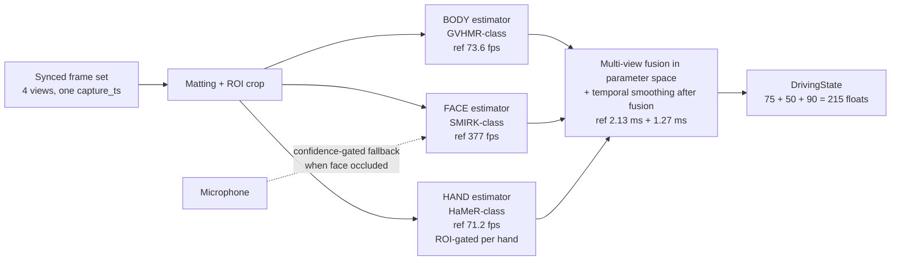

Reference rates are Mon3tr's, measured on an RTX 5090-class sender; the pipeline synchronises to **58.2 fps** overall because the hand branch gates it [MEASURED — by Mon3tr, arXiv 2601.07518, **not by this project**].

**Design consequence, load-bearing:** the branches are independently rate-controllable, the face branch has ~5× headroom over 60 Hz, and §9 says face expressiveness is the most perceptually valuable channel. Therefore **under thermal or compute pressure, degrade body rate before face rate**, and interpolate body pose between estimates rather than dropping expression frames [DERIVED from §9.2].

##### Body — 75 dimensions

| Candidate | Rate | Hardware | License | Tag |
|---|---|---|---|---|
| **GVHMR-class** (Mon3tr's choice) | **73.6 fps** | RTX 5090-class | **UNVERIFIED** | [MEASURED by Mon3tr] |
| Multi-HMR (NAVER, ECCV'24) | ViT-S **29 ms (~34 fps)** / ViT-B 43 ms / ViT-L 74 ms @672² | V100-32GB | **Custom NAVER** | [PUBLISHED] |
| SAM 3D Body (arXiv [2602.15989](https://arxiv.org/abs/2602.15989)) | **no fps published** | — | **Custom SAM** | [PUBLISHED] — introduces **MHR**, a Meta-authored SMPL-X replacement; 3DPW 54.8 MPJPE, EMDB 61.7, RICH 60.3 PVE |
| Fast SAM 3D Body (arXiv [2603.15603](https://arxiv.org/abs/2603.15603)) | **up to 10.9× e2e speedup**; no absolute fps, GPU or code availability stated | — | — | [PUBLISHED] — the absence of absolutes is disqualifying until verified |
| SMPLest-X (TPAMI'25) | **8.36 fps** (third-party) | 8.2 GB checkpoint | MIT code | Too slow, too large |
| NLF (NeurIPS'24) | no fps published | — | **MIT code, NON-COMMERCIAL weights** | The purest form of the license trap |
| MediaPipe Pose Landmarker | per-device latency **removed from current Google docs** | CPU/GPU/mobile | Apache-2.0 | Clean license, no numbers; degraded-mode fallback |

**The 75 dimensions are not yet pinned.** They decompose as SMPL-family joint rotations — 24 joints × 3 axis-angle = 72 plus 3 global orientation, or 25 × 3; Mon3tr's available text does not disambiguate [UNVERIFIED — resolving this requires reading Mon3tr's released code or supplementary material]. **Sender and receiver must agree on joint ordering and rotation convention or the far end renders a person whose elbows bend backwards**, which is why `rig_id`, `dims` and `rotation_convention` are negotiated on the wire (§8.4).

Recommendation: **6D continuous rotation internally, axis-angle on the wire** — 6D avoids the gimbal/antipodal discontinuities that make naive delta-encoding of quaternions blow up; axis-angle is 3 floats per joint and matches the 75-dim budget [DERIVED].

**Architectural rule: the rig is the commitment, the estimator is swappable.** The estimator produces joint rotations; the rig defines what those rotations *mean*. Build against Anny (Apache-2.0) or MHR behind one rig-space adapter, and estimator selection stops being a licensing hostage (§10).

##### Face — 50 dimensions

**SMIRK-class**, measured at **377 fps** — the fastest branch by 5×, fortunate because §9 shows it matters most [MEASURED by Mon3tr].

50 dimensions is a blendshape/expression coefficient vector, FLAME-compatible in Mon3tr's formulation: its SPMM3 template fuses a scanned body mesh with FLAME face and MANO hand components via rigid alignment, `M_SPMM3 = 𝒰(M_body^masked, 𝒜_f(M_face), 𝒜_h(M_hand))`, with skinning weights transferred from SMPL-X [PUBLISHED, 2601.07518].

> **⚠ That sentence is a license bomb.** Mon3tr's template stands on **SMPL-X + FLAME + MANO**, all Max Planck models. SMPL-X is excluded outright (§10); FLAME and MANO are the same institution and licensing family and their exact terms are **UNVERIFIED in this repository**. The escape is the same as for the body: **the 50-dimensional channel is a contract about *width*, not about whose blendshapes.** Use the license-clean rig's expression basis and retarget. If that basis has a different dimensionality, `pipeline/schema.py` is revised deliberately and both endpoints bump in lockstep — never silently reinterpreted.

**Audio-driven fallback.** Meta's *Audio Driven Real-Time Facial Animation for Social Telepresence* achieves **<15 ms GPU time** with a single-step distilled diffusion model, **100–1000× faster** than offline baselines [PUBLISHED, arXiv [2510.01176](https://arxiv.org/abs/2510.01176)]. For TAYF this is the **degraded mode when the face is occluded or out of frame** — the audio stream is already present, and driving expression from the microphone is strictly better than freezing the face. Wire it as an alternate source for the *same* 50 dimensions, selected by a per-frame confidence gate; not as a separate path.

##### Hands — 90 dimensions

**HaMeR-class at 71.2 fps** — the rate-limiting branch [MEASURED by Mon3tr]. 45 dims per hand, both hands, MANO-style, as implemented in `pipeline/schema.py`.

The honest framing from the SOTA survey: *"Hands and faces are where photorealism dies, and they're the whole point... A 4-camera rig will produce a smeared mouth interior, fused fingers, and hair that reads as a helmet"* [PUBLISHED — `research/01-volumetric-capture-sota.md` §6.2]. **But that sentence is about per-frame volumetric reconstruction, and TAYF does not reconstruct per frame.** In class (c) the fingers' *geometry* comes from the enrolled avatar, built offline from good capture; only the *articulation* is estimated live. This converts an ill-posed reconstruction problem into a well-posed 45-DoF regression. Fingers still fuse when the estimator is wrong — but they fuse into correctly-shaped fingers [DERIVED].

| Candidate | Rate | License |
|---|---|---|
| **HaMeR-class** (Mon3tr) | **71.2 fps** RTX 5090-class | **UNVERIFIED** — presumed MANO dependency |
| WiLoR | **>130 fps (medium), 175 fps (small)**, CUDA 11.7 | **CC-BY-NC-ND + AGPL + MANO — triple encumbrance.** Fastest, completely unshippable |
| Multi-HMR | 29–74 ms whole-body incl. hands | Custom NAVER |
| MediaPipe Hand Landmarker | latency removed from docs | Apache-2.0 |

**Mitigation for the bottleneck:** hands leave frame constantly and are frequently occluded. Run the estimator **only on ROIs where a hand is detected, gating each hand independently.** In ordinary seated conversation both hands are fully visible a minority of the time, so mean cost is far below what 71.2 fps implies. **Note precisely what this buys: mean power, not worst-case latency** — worst case is what determines whether frames drop [DERIVED].

##### Multi-view fusion — TAYF-original, no published reference

Mon3tr is monocular. The fusion layer has no reference implementation anywhere in the corpus and **must be treated as original work with an unmeasured benefit** [UNVERIFIED — measurement #6 in §11 is its entire justification].

1. Each estimator runs on the **best view per body part**, scored by detected-keypoint confidence × in-frame fraction × distance from image border.
2. When two views both see a part confidently, blend **in parameter space** — quaternion SLERP or rotation-matrix Procrustes averaging weighted by confidence. **Do not triangulate:** the estimators already output 3D and a 70 mm baseline is too short to triangulate usefully at 1.0–1.5 m (§2.2's δZ = 1.63 mm is adequate for gating, not for joint positions).
3. **Hysteresis on view selection.** Switching primary view mid-motion is a step discontinuity that the delta encoder faithfully transmits and the receiver faithfully renders as a twitch. Require a confidence margin and a minimum dwell.
4. **Smooth after fusion, not before.** One-euro or small per-joint-group Kalman, tuned per channel: heavier on the body (slow, jitter very visible), **lighter on the face** (fast, and §9 says amplitude beats precision).

Fusion waits for the slowest branch — budget Mon3tr's **2.13 ms sync + 1.27 ms smoothing**. On a Jetson with three estimators contending for one GPU, the "parallel" branches may **serialise**, which is exactly what measurement #1 exists to find out.

---

#### Persistent identity vs dynamic state

| | Persistent identity | Dynamic state |
|---|---|---|
| **Content** | Canonical Gaussian set {μ, s, q, α, SH c}; skinning weights; rig shape params; distilled deformation basis | 215 floats: body pose, expression, hand pose |
| **Size** | Megabytes post-compression | **430 B (fp16 payload)** |
| **Update rate** | Once per enrollment; effectively never during a call | **60 Hz** |
| **Where computed** | Offline, remote RTX 5060 | On-device, Jetson-class |
| **Where stored** | Cached on both endpoints, keyed by identity + version hash | Transient |
| **Transport** | Reliable, ordered, out-of-band, once | Unreliable, unordered, in-band, continuously |

**The entire bandwidth argument reduces to this table.** arXiv [2510.10492](https://arxiv.org/abs/2510.10492) (CityU HK / Alibaba DAMO) makes the identical split and measures it: a canonical 3DGS avatar trained in a star pose and compressed once, plus **94 scalars per frame** (SMPL 72 pose + 10 shape + 3×3 global rotation + 1×3 translation) arithmetic-coded with CABAC → **under 0.2 Mbps on ZJU-MoCap and under 0.26 Mbps on MonoCap at 25 fps**, versus **over 1 Mbps** for G-PCC / GeS-TM / HEVC / VVC / CompactSTG anchors at matched quality [PUBLISHED/MEASURED].

**TAYF's 215 floats is a superset of that paper's 94** — it adds the facial-expression and hand channels 2510.10492 explicitly lacks. That is the correct trade: those are the two channels §9 says carry the conversation [DERIVED].

##### Enrollment — one-time, offline, and never on the deployed device

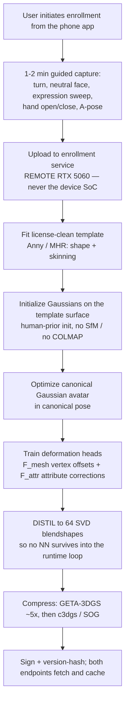

| Enrollment reference | Cost | Tag |
|---|---|---|
| Mon3tr | 1–2 min capture → **~33 s build** (from a 32× 12 MP offline rig) | [MEASURED, 2601.07518] |
| Apple Persona | **<10 s, on-device on M5** | [PUBLISHED — vendor + hands-on report] |
| Meta Codec Avatars | **~1 hour of server GPU** | [PUBLISHED] |
| HUGS | **~30 min on RTX 3090Ti** (96× faster than Vid2Avatar, 336× than NeuMan) | [MEASURED, arXiv [2311.17910](https://arxiv.org/abs/2311.17910)] |
| RealityAvatar | **~0.6 h** | [MEASURED, arXiv [2504.01559](https://arxiv.org/abs/2504.01559)] |
| GauHuman | **1–2 min** (~13k Gaussians) | [PUBLISHED] |
| Animatable Gaussians — *what to avoid* | **16–47 cameras, ~2 days on a 4090, renders at 10 fps**, Tsinghua non-commercial | [PUBLISHED] |
| **TAYF on an RTX 5060** | **budget 1–2 h, asynchronous** — a 5060 is slower than the 3090Ti/4090 references, so the ~33 s headline does not transfer | **[ESTIMATE]** — measurement #7 |

**Capture path for v1: the device's own cameras**, recording a guided 1–2 min sequence uploaded to the enrollment service. Lower quality than a phone orbit (fixed viewpoints, short baseline) but zero extra hardware and it works when the user has no phone at hand. The phone-orbit alternative is real — Meta's LCA demonstrates full-body avatars with finger-level articulation from unconstrained phone capture, pretrained on 1M in-the-wild videos [PUBLISHED, arXiv [2604.02320](https://arxiv.org/abs/2604.02320)] — but **Meta publishes no inference numbers and no release**, so it is a direction, not a dependency.

**Enrollment friction is a product decision, not an engineering detail:** *"The one you can ship is the one with the shortest enrollment."* Budget **≤2 min of user time, ≤2 min of perceived wait**; if the build runs longer, do it asynchronously behind a lower-fidelity provisional avatar.

---

#### Gaussian avatar representation and the LBS covariance transform

##### Why Gaussians

| Representation | Verdict |
|---|---|
| **3D Gaussian splats** | **Chosen.** Confirmed in Apple Personas (Scott Norris on record), Meta Codec Avatars, Evercoast, Canon's CES 2026 prototype, ~100% of 2026 academic work [PUBLISHED]. Rasterizes fast, deforms under LBS **analytically**, compresses well, renders cheaply from many viewpoints |
| Textured mesh | Cannot represent hair, fabric edges, or soft occlusion boundaries without heavy per-vertex density. Apple's Spatial Persona: 78,030 triangles at 0.5 m → 21,036 with viewport adaptation, −39% GPU time [MEASURED, 2405.10422] — workable, with a quality ceiling |
| NeRF / implicit fields | HUGS reports Gaussian rendering **3800–7600× faster** than NeRF/implicit baselines on the same task [MEASURED, 2311.17910]. Disqualified on compute |
| Per-frame volumetric (point cloud / 4DGS) | 20–300 Mbps, and **no real-time 4DGS encoder exists** — 4D-MoDe 0.68 min/frame, 4DGCPro 4.3 min/frame of *offline* optimization [PUBLISHED]. Disqualified on bandwidth |

**The most important architectural detail, from HUGS:** after optimization, the triplane and MLPs *never need to be evaluated again at animation time* — the Gaussians and their learned LBS weights are extracted explicitly, so new poses render by **direct LBS deformation of pre-baked attributes, with no neural inference in the render loop** [PUBLISHED/MEASURED]. That is exactly the computational shape a thermally-limited SoC needs: **bake the network offline, animate with arithmetic online.** Any enrollment design that leaves a network in the per-frame path should be rejected on those grounds alone.

##### The transform

Each canonical Gaussian *i* has position **p**_c ∈ ℝ³ and covariance Σ_c ∈ ℝ^{3×3}, parameterized (as standard in 3DGS) so that positive-semi-definiteness is structural rather than enforced:

$$\Sigma_c = R_c S_c S_c^{\top} R_c^{\top}, \qquad R_c = R(q),\; S_c = \mathrm{diag}(s)$$

Given a decoded `DrivingState`, LBS blends per-joint transforms by skinning weight ω_k [PUBLISHED, 2510.10492]:

$$\mathbf{A} = \sum_k \omega_k \mathbf{A}_k, \qquad \mathbf{b} = \sum_k \omega_k \mathbf{b}_k, \qquad \hat p_t = \mathbf{A}\,p_c + \mathbf{b}$$

and the covariance transforms as

$$\boxed{\;\Sigma_t = \mathbf{A}\,\Sigma_c\,\mathbf{A}^{\top}\;}$$

**This is the step people skip, and skipping it is why naive avatar animation looks wrong.** Translating a Gaussian without rotating its covariance means an anisotropic splat lying *along* a forearm keeps pointing in its canonical direction when the forearm rotates — the splat visibly *slides* across the surface it represents. `Σ_t = A Σ_c Aᵀ` rotates the Gaussian's **shape** along with the joint, which is what lets skin- and cloth-shaped Gaussians rotate rather than merely translate [PUBLISHED — the formulation; [DERIVED] — the failure-mode explanation].

##### Recovering a renderable (q, s), and the fast path

The renderer wants (q, s), not a raw 3×3. Substituting:

$$\Sigma_t = (\mathbf{A} R_c S_c)(\mathbf{A} R_c S_c)^{\top}$$

Define `M = A R_c S_c` and recover by **polar decomposition** `M = R_t U` with R_t orthogonal, U symmetric PSD; then `q_t = quat(R_t)`, `s_t` from U. When **A** is rigid — the common LBS case — this collapses to the free and exact

$$q_t = q_{\mathbf{A}} \otimes q_c, \qquad s_t = s_c$$

**Implement the rigid fast path; fall back to polar decomposition only when the blended A carries non-negligible shear**, gating on `‖AᵀA − I‖_F` against a threshold. LBS blending of two rotations genuinely does produce non-rigid A (the classic candy-wrapper artifact) but shear magnitude is small away from joint centres. Across ~10⁵ Gaussians on an embedded GPU this is a meaningful per-frame saving [DERIVED — threshold and measured saving both **unset**].

##### Non-rigid correction, and the distillation that makes it embeddable

Pure LBS gives a correct skeleton and a mannequin's skin. Three correction layers, increasing cost:

- **(a) Pose-dependent vertex offsets** (Mon3tr's `F_mesh`) — muscle bulge, joint creasing, garment wrinkle. **Implement.**
- **(b) Gaussian attribute corrections** (Mon3tr's `F_attr`, the "tension field") — ~**500 local controllers** on the canonical mesh, each mapping pose to a displacement potential; a virtual-mass-weighted sum (geodesic distance × skinning-weight similarity) over the **K=3 nearest** controllers gives each Gaussian a dragging force, **projected onto a fixed set of linear deformation bases**. The projection is the load-bearing part: per-frame cost becomes a small matrix multiply, not a network evaluation per Gaussian. **Implement.**
- **(c) History-dependent deformation** — RealityAvatar's LSTM over encoded pose *sequences*: 35k canonical Gaussians, a latentbone encoder splitting pose into four regional groups each concatenated with a learned clothes latent, feeding an LSTM whose hidden state predicts Δx, Δs, Δq via a 3-layer MLP. Measured on I3D-Human: PSNR **31.87**/SSIM 0.9752 novel-view, **30.10**/0.9689 novel-pose in **~0.6 h** training, beating 3DGS-Avatar (30.62/29.21) at ~20× less training time; **the ablation is the useful part — removing the LSTM costs 31.87 → 30.88, the largest single drop** [MEASURED, 2504.01559]. **TAYF: optional.** The subject is seated, so the loose-garment dynamics this targets are largely absent, and the sequential dependency adds per-frame state to the animation loop.

**The embedded-deployment trick, and the most important technique in this section after §6.2** — AGORA-M [MEASURED, arXiv [2512.06438](https://arxiv.org/abs/2512.06438)]:

1. Extract **N = 10,000** sampled posed-minus-neutral Gaussian-attribute residuals.
2. Take their **SVD**.
3. Keep the top **K = 64** singular vectors as shared **Gaussian blendshapes**.
4. Train a **two-layer MLP** to regress the 64 coefficients from (w, ψ, θ).

Per-frame animation reduces to **one neutral Gaussian set plus a linear combination of 64 bases**. Measured: near-identical quality (**FID 3.36 vs 3.17**) at **560 fps on an RTX A6000 and 60 fps on a mobile phone via a WebGL 3DGS renderer.** Mon3tr's tension field is the same idea derived from a physical analogy rather than PCA; both end at *project deformation onto a small fixed linear basis*.

**This is the mechanism by which receive-side animation cost becomes independent of avatar complexity.** Caveats, stated: AGORA is **head/face-only (FLAME-driven)**, single-identity-per-generator-sample rather than few-shot personalization, and addresses neither body nor hands. **The distillation technique generalizes; the model does not** [DERIVED].

---

#### Canonical avatar compression

The canonical payload moves **once per enrolled user per device pair**. It is a session-setup cost, not a bandwidth cost — but it must fit the SoC's shared memory alongside everything else, and download fast enough that the first call is not gated on it.

| Method | Result | License | Tag |
|---|---|---|---|
| **GETA-3DGS** (arXiv [2605.02086](https://arxiv.org/abs/2605.02086)) | **~5× storage reduction over vanilla 3DGS, fully automatic** — no per-scene opacity/scale/SH-degree tuning | — | [PUBLISHED/MEASURED] |
| **c3dgs** | **26–31×**, and **up to 4× faster rendering** | **MIT** | [PUBLISHED] |
| HAC-lowrate / ContextGS-lowrate | 15.3 MB (48×) / 12.7 MB (58×) from a 734 MB 3DGS-30k baseline; most aggressive configs 83–113× | varies | [PUBLISHED] |
| **SOG** (`.sog`) transport container | **~15–20× smaller than PLY**, 2–3× better than compressed PLY; Morton-ordered, GPU-ready, **no load-time processing** | **license not stated — verify** | [PUBLISHED] |

**GETA-3DGS mechanism:** each Gaussian is a group node in a quantization-aware dependency graph with five heterogeneous attribute sub-nodes (μ∈ℝ³, log-scale s∈ℝ³, quaternion q∈ℝ⁴, opacity logit α, degree-aware SH c∈ℝ^{(ℓ+1)²×3} — 48 scalars at ℓ=3). Pruning uses **render-aware saliency** fusing α-blending transmittance-weighted contribution, screen-space gradient magnitude and pixel coverage, explicitly replacing parameter-space Taylor saliency (which the authors show is a poor signal for 3DGS, because occluded/sub-pixel Gaussians carry non-trivial gradients despite negligible visual contribution).

**The finding that governs TAYF's bit allocation:** the **heterogeneous bit-width policy is the dominant rate-distortion lever**, not the saliency choice or the schedule. Forcing a uniform 6-bit cap costs **up to −6.74 dB on view-dependent scenes** versus only **−0.18 to −0.34 dB on texture-uniform scenes**, and the per-attribute bit ordering predicted by an information-theoretic reverse-water-filling model matches empirically converged widths **within ±1 bit** [MEASURED].

Translated to a human: **face and skin are the view-dependent, SH-heavy content that needs bits; clothing and hair bulk are texture-uniform and quantize aggressively.** §9 reaches the identical allocation from psychophysics. **Two independent derivations — rate-distortion theory and human MOS — converging on the same allocation is the strongest evidence available anywhere in this document** [DERIVED].

GETA-3DGS is **complementary to entropy coders** (HAC++/CompGS operate downstream on already-quantized symbols), so they compose. ⚠️ Tooling: `playcanvas/sogs` is **archived**; use `playcanvas/splat-transform`.

---

#### The 215-float DrivingState

##### Schema, as implemented

Normative definition is `pipeline/schema.py`; both endpoints import it and nothing redefines the packet shape [MEASURED — read from the code].

```
DrivingState                        struct fmt "<215f d"
  body_pose        75 × float32     # rig joint rotations
  face_expression  50 × float32     # blendshape / expression coefficients
  hand_pose        90 × float32     # 45 per hand, both hands, MANO-style
  timestamp         1 × float64     # capture_ts from the hardware trigger (§2.5)
  ────────────────────────────────
  PACKED_SIZE_BYTES = 215×4 + 8   = 868 bytes/frame, pre-compression
```

The dataclass validates each field's length in `__post_init__` and raises rather than truncating — the packet is fixed-width by construction. `TOTAL_DIM = 215` is computed, not literal.

##### Bandwidth arithmetic

| Stage | Bytes/frame | Bitrate @60 fps | Tag |
|---|---|---|---|
| 215 floats, fp32 (payload only) | 860 | **0.413 Mbps** | [DERIVED] `860×8×60` |
| + float64 timestamp, as `schema.py` packs it | 868 | 0.417 Mbps | [DERIVED] |
| **fp16 cast, payload only** | **430** | **0.206 Mbps** | [DERIVED] |
| fp16 payload + retained fp64 timestamp | 438 | 0.210 Mbps | [DERIVED] — see caveat |
| **fp16 + LZ4 (~0.6× ratio)** | **~258** | **~0.124 Mbps** | [SUPERSEDED] — the 0.6× ratio was assumed; **§3.4 measured it and it is wrong** (zlib/LZ4 *expands* packed pose floats by 2.6%). Use delta+int8: 215 B, 0.104 Mbps |
| **+ SCTP/DTLS/UDP/IP headers (~80 B/datagram)** | **~338** | **~0.162 Mbps — the real wire rate** | [DERIVED] |
| …one-way including audio and FEC | — | **~0.26 Mbps** against a ≤0.3 Mbps constraint | [ESTIMATE] |

> **Caveat worth carrying:** the 430 B row silently drops the 8-byte timestamp. Halving 215 floats gives 430 B, but `schema.py` also packs an fp64 `timestamp`, so a faithful fp16 frame is **438 B → 0.210 Mbps** unless the timestamp is narrowed or moved into the transport header. A 1.9% error, immaterial to the budget, but it is the kind of drift that turns a spec into folklore. **Recommendation: keep the fp64 timestamp and quote 438 B.**

At 60 packets/s with a ~258-byte payload, **protocol headers are ~24% of the wire cost** [DERIVED]. This is precisely why Mon3tr reports "<0.2 Mbps" rather than 0.124: anyone quoting 0.124 Mbps as the delivered rate is quoting payload, not bandwidth. Both are correct; they measure different things.

**The comparison that justifies the architecture:**

| Architecture | Bitrate | Ratio vs TAYF |
|---|---|---|
| **TAYF / Mon3tr parametric state** | **~0.16–0.2 Mbps** | 1× |
| Apple Spatial Persona [MEASURED, 2405.10422] | 0.7 Mbps | 4× |
| 1080p30 2D talking head | ~1–3 Mbps *(industry common knowledge, not a citable measurement)* | 6–19× |
| MIV (6DoF multi-view + depth), HEVC L5.2 | 15–30 Mbps | 90–190× |
| Project Starline 2021 research prototype | 30–100 Mbps | 190–600× |
| 4DGS — QUEEN | 168 Mbps | ~1000× |
| Raw 8i VFB (42 cameras, 30 fps, ~1M pts/frame) | ~1.0 Gbps | ~6000× |

**TAYF's stream is cheaper than 2D video of the same person.** The parametric architecture is not merely competitive with a video call; it is strictly less expensive [DERIVED].

##### fp16 is safe here — with one specific exception

Casting pose parameters to fp16 costs ~3 decimal digits. For joint rotations in radians (range ~±π), fp16's step near 1.0 is **~0.001 rad ≈ 0.06°** — far below the estimator's own noise floor and any perceptual threshold [DERIVED]. Blendshape coefficients in [0,1] are finer still.

> **Where fp16 is not safe: global translation.** If the 75-dim body vector carries a root translation in metres, fp16's step at 10 m is **~10 mm** — visible drift [DERIVED]. **Either keep global translation in fp32 as a separate field, or express it in a normalized capture-box frame where the range is ~[−1, 1].** This is a real bug waiting inside a naive "cast the whole array to fp16" implementation, and it must be handled when the rig's parameter layout is pinned (§4.2).

##### Why the wire carries `rig_id`, not just numbers

**A 215-float array is self-describing about nothing.** If one endpoint ships an updated rig with different joint ordering, every packet still parses and the far end renders a person whose elbows bend backwards. `HELLO` therefore negotiates `schema_version`, `rig_id`, `dims {body:75, face:50, hand:90}`, `rotation_convention`, `fps`, `avatar_hash`, `region_mask`, `caps` — **and a mismatch is fatal to the session. Fail loudly; never reinterpret** [PUBLISHED — repo-normative, `docs/03` §12.1].

`region_mask` (the phone app's body-region selector) **changes which sub-estimators run on the sender, not the packet width.** Unselected regions transmit as zeros or a held neutral pose; LZ4 compresses the constant runs to almost nothing, so a torso-only session shrinks naturally with no format variant [DERIVED].

---

#### Perceptual allocation — where the bits and the Gaussians go

Uniform allocation across a human body is wrong by a large factor: the information a conversation carries lives in micro-expressions, gaze and finger articulation — *"exactly the regions with the fewest pixels and fastest motion."* Three independent lines of evidence, all from Track 4 (Perception), say the same thing.

##### Expressiveness beats timing — the strongest single result

**arXiv [2503.20308](https://arxiv.org/abs/2503.20308)**, "Perceptually Accurate 3D Talking Head Generation." Forced-choice A/B human study:

- **(A)** precise temporal sync, flat/inexpressive lip motion
- **(B)** expressive, speech-intensity-matched lip motion, with **100 ms audio-lip asynchrony** — *double* the classical ~50 ms threshold

**82.6% of participants preferred (B)** [MEASURED]. A second study confirmed preference for lip-movement intensity that *matches speech intensity* over intensity-mismatched-but-technically-correct lip shapes. The paper also carries an audiovisual-sync JND — noticeable when speech **leads** lip movement by >50 ms or **lags** by >220 ms — cited from Vatakis et al. 2006, so a **secondary citation, not this paper's own measurement** [PUBLISHED, second-hand].

Three consequences, all directly actionable:

- Mon3tr's ~80 ms end-to-end sits **well under the 220 ms lag JND**, so there is more slack than the raw ITU-T G.114 150 ms figure implies [DERIVED].
- **If a trade is forced, preserve motion amplitude over timing precision.** A slightly late full-amplitude smile beats an on-time flat one, 82.6% to 17.4%.
- Concretely: temporal filtering on `face_expression` stays **light**, and **no adaptive-degradation rung may ever respond to congestion by attenuating expression amplitude.**

##### What distortion axes actually hurt

**arXiv [2510.03874](https://arxiv.org/abs/2510.03874)** — DHQA-4D, subjective MOS over 32 real-scanned dynamic clothed-human 4D mesh sequences (1920 textured + 832 non-textured distorted variants, 11 distortion types) [MEASURED]:

| Distortion axis | Perceptual impact |
|---|---|
| **Temporal discontinuity (frame-to-frame jitter)** | **Relatively high MOS — well tolerated**, both subsets |
| **UV-map coordinate compression** | **Little perceptual impact** |
| Texture-map compression | **Dominant driver**, spans full MOS range 10–90 |
| Geometry + texture compression | **Dominant driver**, full range |
| Position compression | **Dominant driver**, full range |

**Viewers tolerate temporal jitter in a dynamic human better than they tolerate texture or geometry distortion.** Therefore geometry and texture fidelity outrank temporal smoothness and UV precision whenever the budget is spent unevenly. It is a **relative-sensitivity ranking, not an absolute threshold** — the paper gives no "X% is enough" cutoff.

Two consequences: **spend GETA-3DGS bits on position and SH colour, save them on anything UV-parameterized**; and **drop the occasional frame under network stress rather than shipping a coarser avatar** — dropping a frame costs less perceptually [DERIVED].

##### A cheap, reference-free runtime quality gate

**arXiv [2505.23301](https://arxiv.org/abs/2505.23301)** — 4DHumanPercept: 250 acquired-vs-distorted pairs, 24–48 raters per stimulus, ITU DSIS methodology. Mixed-design ANOVA over 48 participants finds **distortion strength is the only factor with consistently large effect across all 6 distortion types (partial η² = 0.52–0.81)**; identity, gender, clothing and motion type give smaller distortion-specific interactions — *tolerance is not a universal threshold, it interacts with body identity and context* [MEASURED].

The deliverable, **4DHumanQA**, is a linear regression over 7 cheap features (Chamfer/Hausdorff, foot-contact error, global-translation error, velocity difference, log-dimensionless-jerk smoothness difference, per-joint MPJPE) predicting MOS at **SROCC 0.961 / PLCC 0.917**, versus **LPIPS at 0.76 / 0.729** on the same held-out set [MEASURED].

**Use it.** It is computed from joint/vertex error, not rendered pixels, so it costs microseconds and needs no reference image — TAYF can score the *reconstructed* pose stream frame-by-frame and request a keyframe or resynchronization **before** the optical engine commits to rendering. A cheap kinematic metric that beats a deep perceptual metric by that margin is a gift.

##### Do not trust PSNR/SSIM

- arXiv [2501.08072](https://arxiv.org/abs/2501.08072) — MOS over five NVS methods: NeRFacto 42.3, K-Planes 25.4, GS 52.6, **GS-fewer-iterations 54.2**, STGFS 57.3. A GS variant trained with **fewer** iterations scored **higher** than the fully-converged one in **9/13 multi-view and 11/13 single-view scenes** — non-monotonic fidelity/perception, attributed to overfitting artifacts at convergence [MEASURED]. *"Train the enrollment longer" is not automatically better.*
- arXiv [2404.09003](https://arxiv.org/abs/2404.09003) — THQA: 800 talking-head videos, 40 subjects, 32,000 ratings. Mainstream objective IQA/VQA metrics correlate poorly with MOS for talking-head content, and **reference-based metrics (FID, CSIM) are unusable in deployment because no clean reference exists for an end user** [MEASURED].

##### The allocation policy, consolidated

`research/notes.md` §39's canonical renderer priority order, with the measured rationale and concrete policy attached to each rung:

| Rank | Channel | Measured rationale | Policy |
|---|---|---|---|
| 1 | **Face — expression amplitude** | 82.6% expressive-over-timed (2503.20308); 5× rate headroom (377 fps) | **Never attenuate.** Light temporal filtering. Highest wire precision |
| 2 | **Eyes / gaze** | Named primary conversational carrier | Highest-fidelity avatar region; most SH bits under GETA-3DGS |
| 3 | **Mouth** | Lip readability is one of 2503.20308's three criteria; mouth interior is a named failure region | High Gaussian density; never coarsen under load |
| 4 | **Hands / fingers** | Second named carrier; also the rate-limiting branch | ROI-gated estimation; full wire precision; **do not decimate hand DoF** |
| 5 | **Body pose** | Slow, low-frequency, heavily smoothed anyway | Interpolate between estimates under load; **first channel to downrate** |
| 6 | **Silhouette** | Matting errors become persistent floating geometry in 3D | Outline beats interior detail; the capture-box clip protects it cheaply |
| 7 | **Garment / hair bulk** | Texture-uniform; quantizes at −0.18 to −0.34 dB (GETA-3DGS) | Aggressive quantization in the canonical avatar |
| 8 | **Temporal and UV precision, low-saliency detail** | Both "well tolerated" (2510.03874); 220 ms lag JND | **Cheapest things to spend.** Drop frames before degrading quality |

**Quantifying the gain:** concentrating 80% of a budget into the 20% of solid angle containing face and hands gives density `0.8/0.2 = 4` there against `0.2/0.8 = 0.25` elsewhere — **a 16× relative density ratio where it matters** [DERIVED, `docs/01` §10].

> **⚠ One warning on saliency-driven adaptive streaming.** arXiv [2507.14454](https://arxiv.org/abs/2507.14454) is a complete system for this — rendering-weight importance sampling `w_i = σ_i·√det(Σ_i)`, luminance-weighted local-discrepancy encoding, a temporal-contrast branch, 5 saliency-weighted quality tiers, and a meta-RL ABR controller validated on real 4G/5G traces, reaching **84.9% of full-data QoE with 20% of training data**. The mechanisms are sound. **But its saliency ground truth is VR-headset FoV and head-trajectory prediction, which does not map onto a viewer of a free-space optical reconstruction from an untracked position. Take the ABR controller, not the viewport model.**

##### Three findings that complicate the story

Stated because they constrain what this pipeline should *try* to achieve:

- **(a) A flat 2D cutout scored as well as a rigged 3D avatar on co-presence — and better on fidelity.** arXiv [2401.02171](https://arxiv.org/abs/2401.02171): life-size 2D video cutout vs full rigged 3D avatar in an AR HMD. Co-presence **5.2 vs 5.3** (7-point, statistically indistinguishable); **fidelity 5.1 vs 3.7, p<.001 — favouring the flat cutout** [MEASURED]. Caveat, and it is decisive: this was a *single tracked viewpoint inside a headset*, i.e. the wrong device class. But it warns that a low-fidelity 3D avatar can be **worse than no 3D at all**, and it is why enrollment quality outranks view count.
- **(b) TAYF's use case is the hardest one.** arXiv [2509.17748](https://arxiv.org/abs/2509.17748): realistic avatars raise identification *and* eeriness, and **people judge avatars of themselves and of people they know most harshly** [MEASURED]. A telepresence device is by construction used to talk to people you know. **There is no regime in which TAYF's avatars are judged leniently.**
- **(c) Self-view does not drive presence; the remote party does.** arXiv [2409.08577](https://arxiv.org/abs/2409.08577) [PUBLISHED]. Product consequence: **do not spend device compute rendering the local user a view of themselves.**

---

#### License table — every non-commercial trap, flagged

**Policy, verbatim from `research/LICENSING.md`:** *"Apache-2.0 repository" is not sufficient — check the model **weights** license separately from the code license.* A permissively-licensed training/inference codebase routinely ships non-commercial pretrained weights. Every row must be re-verified before any commercialization step; **"verified once" is not "verified now."**

##### The commercially-safe stack

| Component | Repo | Code license | Weights license | Role | Verified in this repo? |
|---|---|---|---|---|---|
| **gsplat** | `nerfstudio-project/gsplat` | **Apache-2.0** | n/a | Gaussian rasterizer/training. 4× less VRAM, 15% less time than INRIA at equal PSNR | Researched, **not re-verified against the repo** |
| **Brush** | `ArthurBrussee/brush` | **Apache-2.0** | n/a | WebGPU renderer, **no CUDA**; candidate, not wired in | Researched only |
| **Anny (NAVER)** | `naver/anny` | **Apache-2.0** | **Apache-2.0**, no registration, no gated download | **Recommended rig.** Built from anthropometric + WHO calibration data — **no 3D scans ⇒ no biometric-privacy exposure**. Positioned as a drop-in SMPL-X replacement. Ships Anny-One (800k+ synthetic images, Apache-2.0) | Researched only |
| **MHR** (Meta Momentum Human Rig) | via `facebookresearch/sam-3d-body` | permissive direction | **VERIFY EXACT TERMS** | Alternative rig; decouples skeleton from surface shape | **UNVERIFIED** |
| **BiRefNet** | `ZhengPeng7/BiRefNet` | **MIT** | MIT | Matting (§3.2) | Researched only |
| **MODNet** | `ZHKKKe/MODNet` | **Apache-2.0** | Apache-2.0 | Matting fallback | Researched only |
| **LAM** | `aigc3d/LAM` | **Apache-2.0** | Apache-2.0 | Feed-forward head avatar: **1.4 s build on A100; 562.9 fps A100 / 110+ fps Xiaomi 14**. Best-licensed serious enrollment option | Researched only |
| **c3dgs** | `KeKsBoTer/c3dgs` | **MIT** | n/a | Canonical compression, 26–31×, up to 4× render fps | Researched only |
| **SuperSplat** | `playcanvas/supersplat` | **MIT** | n/a | Viewer/tooling | Researched only |
| **splat-transform** | `playcanvas/splat-transform` | — | — | SOG tooling (`playcanvas/sogs` is **archived**) | **License not recorded** |
| **aiortc** | — | **BSD** | n/a | WebRTC in Python | Researched only |
| **lz4 / Opus** | — | BSD | n/a | State compression / audio | Researched only |
| **CaptureStudio** | `irc-hslu/capturestudio` | **LICENSE present, type unconfirmed** | — | Multi-Orbbec RGB-D capture for enrollment-rig experiments | **UNVERIFIED** |

##### The traps — do not build on these

| Component | The trap | Consequence |
|---|---|---|
| **SMPL / SMPL-X** | **Non-commercial**, and the license **bans training networks for commercial use**, tainting anything fine-tuned on it | **EXCLUDED.** This is the single most consequential license decision in the project |
| **Meshcapade** (the commercial SMPL escape hatch) | Reported acquired by Epic Games, platforms shut 18 April 2026 | **[UNVERIFIED]** — asserted in `docs/03` §13.2 with **no source given**. Would be confirmed by an Epic or Meshcapade announcement. **Do not repeat this in external material until checked** |
| **FLAME / MANO** | Same Max Planck licensing family. Mon3tr's SPMM3 template fuses FLAME + MANO + SMPL-X skinning weights | **UNVERIFIED — assume encumbered until proven otherwise.** Verify before any code is written against them |
| **INRIA 3DGS rasterizer** | **Non-commercial** | **Most human-avatar repos depend on it even when their own badge says MIT.** Use gsplat or Brush |
| **GPS-Gaussian+** | MIT repo, **requires the INRIA rasterizer** | Unshippable as-is |
| **3DGS-Avatar / GaussianAvatar / ExAvatar** | MIT repos, **require SMPL/SMPL-X** | Unshippable as-is |
| **NLF** | **MIT code, NON-COMMERCIAL weights** | The purest form of the trap |
| **WiLoR** | **CC-BY-NC-ND + AGPL + MANO — three mutually incompatible obligations** | Fastest hand estimator (130–175 fps), completely unusable |
| **RobustVideoMatting** | **GPL-3.0** | Throughput champion (172 fps HD), hard blocker for closed source |
| **MatAnyone / MatAnyone 2** | **NTU S-Lab License 1.0, non-commercial** | Current matting SOTA, excluded |
| **Animatable Gaussians** | **Tsinghua non-commercial** | Also 16–47 cameras and ~2 days on a 4090 per avatar |
| **SAM 3 / SAM 3D Body** | **Custom SAM License** | **Verify terms.** SAM 3 is detection/tracking only — no alpha |
| **Multi-HMR** | **Custom NAVER license** — *not* the same as Anny's Apache-2.0 | Verify |
| **Video Depth Anything** | **Small = Apache-2.0; Base/Large = CC-BY-NC-4.0** | Per-size license split — the easiest kind of mistake to make |
| **network-as-code** (Nokia NaC SDK) | Vendor SDK | Verify redistribution terms **if TAYF ships the client**, not merely uses it |
| **SOG spec** | **License not stated** | Verify before shipping |

##### What remains UNVERIFIED — stated plainly

| Item | Status | What would resolve it |
|---|---|---|
| **GVHMR** (body estimator) | **UNVERIFIED.** Absent from `research/LICENSING.md`. Presumed SMPL-family output | Read the repo's LICENSE + weights terms |
| **SMIRK** (face estimator) | **UNVERIFIED.** Presumed FLAME dependency | Same |
| **HaMeR** (hands estimator) | **UNVERIFIED.** Presumed MANO dependency | Same |
| **FLAME / MANO exact terms** | **UNVERIFIED** | Read the Max Planck license text directly |
| **MHR exact terms** | **UNVERIFIED** | Read the `sam-3d-body` license |
| **SOG spec, CaptureStudio, splat-transform** | **UNVERIFIED / not stated** | Read the repos |
| **Every "Promising" row in `research/LICENSING.md`** | Recorded as *"as researched"* — **not independently re-verified against the upstream repositories by this project** | A one-day audit pass reading every LICENSE file and every weights-download term |

> **This is the largest outstanding non-technical risk in the capture pipeline.** The three estimators the capture module is currently specified against are named only as *"-class"* references from Mon3tr's description, and **none has been license-verified here.** Two resolutions: **(a)** verify and, if clean, use them; **(b)** treat them as swappable behind the §4.2 rig-space adapter and select whichever verified-clean estimator meets the rate target. **(b) is the safe default and should be the architecture regardless of how (a) resolves.** `docs/06` lists M-A1 (commit to Anny or MHR, never SMPL-X) as a blocker on *all* pipeline code — it is a one-decision item, not research, and it is still open.

---

#### The principal risk, stated honestly

> **Mon3tr's numbers assume an RTX 5090-class PC as the sender and a Snapdragon XR2-class Quest 3 as the receiver. TAYF's deployed compute is a Jetson Orin Nano-class module at 7–15 W in a sealed enclosure, doing *both* jobs simultaneously. The port is UNVALIDATED. Nothing in this section has been benchmarked on that part.**

Every fps figure above is *published elsewhere*, not *measured here*. Specifically at risk:

| # | Risk | Number it must beat | Tag |
|---|---|---|---|
| 1 | **Sender-side estimator throughput.** Three estimators + matting + receive-side animation + render, concurrently, on one GPU/NPU in a thermally-limited box. The "parallel" branches may serialise | Mon3tr 73.6 / 377 / 71.2 fps → 58.2 fps synchronised, on a 5090-class part | [UNVERIFIED] |
| 2 | **Thermal sustain.** Peak fps and 30-minute-sustained fps are different numbers and only one of them matters | ≈16 W total at the 48 °C touch limit (`docs/01` §5), against 7–15 W for the SoC alone | [DERIVED] |
| 3 | **Memory.** BiRefNet alone reports **3.45 GB**; Mon3tr's reconstruction path 3.9 GB VRAM. An 8 GB *unified* pool must hold the avatar, three estimators, the matting net and the render buffers | 8 GB shared CPU+GPU | [PUBLISHED] |
| 4 | **Ingest.** 3.80 Gbps into an Orin-class ISP while four estimator stacks run | §2.1 | [UNVERIFIED] |
| 5 | **Multi-view fusion benefit.** TAYF-original, no published reference, unmeasured | Must beat single-camera pose error through head turns and cross-body gestures | [UNVERIFIED] |

**Mitigations, in priority order:** quantize every model to INT8 for the NPU (the largest single lever, and what the NPU exists for); run matting at reduced resolution *and* reduced rate, or swap to MODNet; **bake all deformation networks to linear bases** (§6.4 — AGORA-M's 64 SVD blendshapes at FID 3.36 vs 3.17, 60 fps on a phone); compress the canonical avatar aggressively (c3dgs's 31× also gives up to 4× render fps — compression that pays twice); share one decoded frame buffer across matting and all three estimators rather than letting each stage copy.

**Measurement order, and nothing above #3 should be optimized before it is measured:**

| # | Measurement | Invalidates if it fails |
|---|---|---|
| **1** | **Three estimators, concurrent, sustained 30 min on the real module in the real enclosure.** Report peak fps, 30-min-sustained fps and thermal-throttle onset **separately** | The entire per-frame budget. **Do this first.** Peak fps is a marketing number; sustained fps is the product |
| 2 | BiRefNet at 512² and at ROI scale — fps and peak memory | Forces the MODNet swap or a matting redesign |
| 3 | Baseline wire bandwidth: **delta+int8** (per §3.4), 60 Hz, real WebRTC, measured at the interface **including headers**. The fp16+LZ4 variant is retained only as a control | §8.2's budget. Also the mandatory baseline before any delta-encoding work |
| 4 | Delta-encoding gain against #3 — residual entropy on **real captured pose streams** | Whether delta coding is built at all |
| 5 | Per-stage latency, `capture_ts` → render, on real hardware | The latency budget |
| 6 | **Multi-view fusion quality** — does 4 cameras measurably reduce pose error vs 1 through head turns and cross-body gestures? | §2.1's entire justification for a camera array |
| 7 | Enrollment on the RTX 5060 — wall-clock, and avatar quality from device cameras vs a phone orbit | §5.1's enrollment path choice |

**Every branch of `experiments/` is currently "not started."** #1, #2, #5 and #7 are blocked only on hardware arriving, which makes them the ones to schedule first. The two most likely surprises, ranked: **(a)** the estimators do not hit 30 fps sustained under thermal load; **(b)** matting memory forces a model change. Both have specified mitigations; **neither invalidates the architecture, only the model selection inside it.**

---

#### What this section does not know

1. **Whether it fits the power and thermal envelope.** Every fps number here was measured on a desktop GPU or a Quest 3. `hardware/power-thermal.md` is a worksheet in which every cell is TBD — no wattage exists for the SoC, cameras, modem or panel. Measurement #1 is what turns this from a plan into a result.
2. **Whether the enrolled avatar is good enough to be worth rendering in 3D at all.** §9.6(a) found a flat 2D cutout beating a rigged 3D avatar on fidelity at statistically identical co-presence, and §9.6(b) found people judge avatars of people they know most harshly — which is TAYF's only use case.
3. **What the 75 body dimensions actually are.** 24×3+3 or 25×3 is unresolved against Mon3tr's text, and it is normative: it must be pinned against the chosen rig before `pipeline/capture` writes into `DrivingState.body_pose`.
4. **The LZ4 ratio.** The 0.6× figure underpinning the 0.124 Mbps payload row is an assumption that has never been measured on a real pose stream.
5. **Whether four cameras beat one.** The array is the only TAYF-original component in the capture front end and its benefit is entirely unmeasured.

---

## 6. Network transmission and the agent layer

The network carries a person's *state*, not their picture. Every number in this section follows from that one decision: 215 floats per frame, a fixed-width struct, one datagram per captured frame set, and a wire rate that sits two to three orders of magnitude below every volumetric-telepresence system ever measured. This section specifies the wire format exactly, derives the bitrate ladder from packing arithmetic rather than quoting it, reports the first direct measurement of the compression assumption underneath the headline number, gives the per-stage latency accounting against ITU-T G.114, and specifies the CAMARA/Nokia Network-as-Code agent layer that defends the path.

**Scope note, so no optical claim is implied.** Nothing in this section depends on which aperture mode the receiving device uses. The state vector describes the *person*; whether the far end renders them in the viewer's own space (`W_image ≤ D_aperture`) or beyond the device (`W = D·(b/a)`, which may exceed `D`) — `01_SYSTEM_MASTER_SPEC.md` §4.3b — changes only the receiver's view-synthesis stage and its per-frame pixel count, never the packet. This is why one transport spec serves all six device forms in `09_DEVICE_DESIGNS.md`. The single place the optics reach back into this section is latency: the head-tracked architecture (§4.4) puts observer tracking inside the loop, and §8 below budgets it.

---

#### The wire format

**Normative definition: `pipeline/schema.py`. Both endpoints import it; nothing redefines the packet shape.** [MEASURED — read directly from the repo]

```
DrivingState:
  body_pose        75 × float32   # rig joint rotations (SMPL-family parameterization)
  face_expression  50 × float32   # blendshape / expression coefficients
  hand_pose        90 × float32   # 45 per hand, MANO-style, both hands
  timestamp         1 × float64   # capture_ts from the hardware trigger
                   ─────────────
  struct fmt  "<215f d"  →  215×4 + 8 = 868 bytes/frame raw
```

`PACKED_SIZE_BYTES = struct.calcsize("<215f d")` evaluates to **868** — verified by execution, not by hand-count. [DERIVED, verified]

The 75/50/90 split is not arbitrary and is not TAYF's invention: it is Mon3tr's measured driving-parameter set (arXiv [2601.07518](https://arxiv.org/abs/2601.07518) — body pose θ_b ∈ ℝ⁷⁵, facial expression ψ ∈ ℝ⁵⁰, hand pose θ_h ∈ ℝ⁹⁰, extracted by parallel monocular estimators and streamed over a WebRTC data channel after FP16+LZ4 compression). [PUBLISHED — entry present in `research/deepseek_research.md`, verified by grep for the ID]

**On-wire packet framing** (`03_...TRANSPORT.md` §12.2), which is what actually enters SCTP — note that it is *not* 430 B, a distinction §3 keeps straight:

| | Keyframe (`type=0x01`) | Delta (`type=0x02`) |
|---|---|---|
| Header | 12 B — `type`(1) `flags`(1) `seq`(2) `capture_ts`(8) | 14 B — as keyframe + `ref_seq`(2) |
| Payload | 430 B (215 × fp16), LZ4 if `flags` bit 0 | variable — entropy-coded quantized residual |
| Trailer | 4 B CRC32 | 4 B CRC32 |
| **Total, uncompressed payload** | **446 B** | — |

**Invariants that the rest of this section depends on** (`03_...TRANSPORT.md` §12.2):

- **One packet per frame, one frame per packet.** Never fragment a state frame across datagrams; at ≤446 B it never approaches an MTU, and fragmentation reintroduces head-of-line coupling on an unreliable channel.
- `capture_ts` is **always** the originating hardware-trigger timestamp, never a send time. It is the only clock the receiver may use for A/V alignment.
- `seq` is monotonic mod 2¹⁶ and is the sole reordering key. **The receiver discards any packet older than the most recently rendered frame** — late is worse than absent.
- A DELTA whose `ref_seq` was never received is **undecodable**: discard, request a keyframe on `ctrl`.

**One design-review observation on the CRC32.** [DERIVED] The 4 B application CRC duplicates protection the path already provides twice over: SCTP carries a CRC32c over the whole packet (RFC 4960 §6.8) and the DTLS AEAD tag authenticates every byte. A corrupted-but-delivered datagram is therefore not a realistic failure on this path; what the app CRC actually guards is corruption *inside* the endpoint — a serialization or memory bug between `pack()` and the socket. That is a legitimate thing to guard, but it should be documented as the reason, because "guards against network corruption" is not true here.

**Where fp16 is not safe: global translation.** [PUBLISHED — `03_...TRANSPORT.md` §8.3] fp16's step at 10 m is ~10 mm, which is visible drift. Either keep global root translation in fp32 as a separate field, or express it in a normalized capture-box frame with range ~[−1, 1]. A naive "cast the whole array to fp16" implementation ships this bug. For joint rotations in radians the fp16 step near 1.0 is ~0.001 rad ≈ 0.06°, far below the estimator noise floor — fp16 is safe there. [DERIVED]

**Negotiated once per session, mismatch is fatal** (`03_...TRANSPORT.md` §12.1): `schema_version`, `rig_id`, `dims {body:75, face:50, hand:90}`, `rotation_convention`, `fps`, `avatar_hash`, `region_mask`, `caps`. A 215-float array is self-describing about nothing; if one cube ships a rig with different joint ordering, every packet still parses and the far end renders a person whose elbows bend backwards.

---

#### The bitrate ladder

##### The published ladder

`01_SYSTEM_MASTER_SPEC.md` §7.1 and `03_...TRANSPORT.md` §8.2, at 60 fps:

| Encoding | Bytes/frame | Bitrate | Tag |
|---|---|---|---|
| 215 × fp32, payload only | 860 | **0.413 Mbps** | [DERIVED] 860×60×8 = 412,800 bit/s |
| + fp64 timestamp (as `schema.py` packs it) | 868 | 0.417 Mbps | [DERIVED] |
| fp16 cast | 430 | **0.206 Mbps** | [DERIVED] 430×60×8 = 206,400 |
| fp16 + LZ4 @ 0.6× ratio, payload only | ~258 | **~0.124 Mbps** | [DERIVED] from an [ESTIMATE] ratio — see §2.3 |
| **+ SCTP/DTLS/UDP/IP headers (~80 B) — the real wire rate** | ~338 | **~0.162 Mbps** | [DERIVED] 338×60×8 = 162,240 |
| …one-way including audio and FEC | — | **~0.26 Mbps** | [DERIVED] §2.5 |

**The 0.124 / 0.162 distinction is not pedantry and it is the reason the project's own reported figure changed.** 0.124 Mbps is payload; 0.162 Mbps is what leaves the NIC. At 60 packets/s with a ~258 B payload, protocol headers are **~24% of the wire cost** (80/338 = 23.7%). This is precisely why Mon3tr reports **"<0.2 Mbps"** rather than 0.124 — Mon3tr measured bandwidth, the project quoted payload. **Both numbers are correct and they measure different things; every budget in this document uses the wire figure.** [DERIVED, reconciles `03_...TRANSPORT.md` §8.2 with the Mon3tr measurement]

##### The header term, derived rather than assumed

The "~80 B" is an approximation. Chunk-level accounting for a WebRTC SCTP DataChannel message over DTLS 1.2 with an AES-GCM cipher suite: [DERIVED from protocol specifications]

| Layer | Bytes | Reference |
|---|---|---|
| IPv4 header | 20 | RFC 791 [PUBLISHED] |
| UDP header | 8 | RFC 768 [PUBLISHED] |
| DTLS 1.2 record header (type 1, version 2, epoch 2, seq 6, length 2) | 13 | RFC 6347 [PUBLISHED] |
| AES-GCM explicit nonce (8) + authentication tag (16) | 24 | RFC 5288 [PUBLISHED] |
| SCTP common header (ports 4, verification tag 4, checksum 4) | 12 | RFC 4960 [PUBLISHED] |
| SCTP DATA chunk header (type/flags/length 4, TSN 4, stream id 2, stream seq 2, PPID 4) | 16 | RFC 4960 [PUBLISHED] |
| **Total, IPv4** | **93** | |
| **Total, IPv6** (40 B network header) | **113** | |

So the true overhead is **93 B on IPv4, 113 B on IPv6**, not 80 B — 16–41% higher than the figure in the ladder. Consequences: the header fraction rises from 23.7% to **26.5%** (IPv4) and the assumed-ratio wire rate from 0.162 to **~0.168 Mbps**; on IPv6, **~0.178 Mbps**. Two further additions the accounting must not forget: RFC 8260 **I-DATA** chunks (used when `ndata` is negotiated) are 20 B rather than 16 B, and a **TURN-relayed** path adds 4 B (ChannelData) or 36 B (Send indication) per packet. [DERIVED] Whether `aiortc` negotiates I-DATA is [UNVERIFIED] — confirm by reading `aiortc/rtcsctptransport.py`; `aiortc` is not currently installed in this repo's environment so it could not be checked here.

**This refines the published number, it does not overturn it: 0.16–0.18 Mbps, still comfortably "<0.2 Mbps".** Use **93 B** as the header constant in all further arithmetic here.

##### The LZ4 ratio is the only unmeasured input — and it was probed

Every figure at or below 0.124 Mbps rests on one number that no document in this repo sources: **the ~0.6× LZ4 ratio.** `03_...TRANSPORT.md` §8.4 itself warns that LZ4 is "a byte-oriented LZ77 variant with no arithmetic model" and is "bad at exploiting [temporal redundancy] on raw fp16 floats" — which is an argument that 0.6× may be optimistic, stated in the same document that assumes 0.6×.

It was measured. Method: synthetic conversational motion (per-channel sums of sinusoids, 0.2–2.5 Hz, body ±0.35 rad, blendshapes clipped to [0,1], hands ±0.4 rad, plus Gaussian estimator noise), 600 frames at 60 fps, cast to fp16, one `lz4.block.compress(..., store_size=False)` per frame. lz4 4.4.5, numpy 1.26.4.

```python
x = stream.astype(np.float16)                     # (600, 215)
sz = [len(lz4.block.compress(f.tobytes(), store_size=False)) for f in x]
```

| Case | LZ4 output | Ratio vs 430 B | State-channel wire rate @60 Hz |
|---|---|---|---|
| Full body, dense motion (σ = 0 / 1e-3 / 5e-3 rad — identical result) | **433.0 B** | **1.007× (expands)** | **0.2525 Mbps** |
| Byte-plane-transposed fp16 (LSB plane ‖ MSB plane) | 433.0 B | 1.007× | 0.2525 Mbps |
| `region_mask`: 90 hand dims exactly zero | **264.0 B** | **0.614×** | 0.1714 Mbps |
| `region_mask`: 140 hand+face dims exactly zero | **163.0 B** | **0.379×** | 0.1229 Mbps |

[MEASURED — real compressor, synthetic input, this session. Not a measurement of a human.]

**The finding: LZ4 achieves nothing on dense full-body fp16 state, and the assumed 0.6× ratio is reproduced almost exactly (0.614×) only when 90 of the 215 dimensions are exact zeros.** The mechanism is not subtle: LZ4's minimum match length is 4 bytes, and byte-interleaved fp16 mantissas of independently-varying channels essentially never contain a repeated 4-byte string. The compressor falls back to literals and pays its own framing — hence 433 B out for 430 B in. LZ4's documented worst case, `LZ4_COMPRESSBOUND(n) = n + n/255 + 16`, is 447 B for n = 430 [PUBLISHED — `lz4.h`], and the measured 433 B sits inside it.

Two things follow, and they point in opposite directions:

1. **The published ~0.6× is achievable — for a region-masked session.** `03_...TRANSPORT.md` §12.1 recommends that `region_mask` zero the unselected dimensions rather than shrink the struct, on the argument that "the LZ4 stage compresses the constant-zero runs to almost nothing anyway." **That argument is now measured and correct**: 90 zeroed dims → 0.614×, 140 → 0.379×. The recommendation is validated; the fixed-width struct costs nothing.
2. **For a full-body session the headline number is optimistic by ~1.6×.** The honest state-channel figure is a *range*, not a point: **0.17 Mbps (masked/compressible) to 0.25 Mbps (full body, LZ4 ineffective).**

**Caveats, stated plainly.** The input is synthetic band-limited motion, not captured human motion; real conversational pose may be smoother (better) or contain estimator jitter in the low mantissa bits (no worse — the probe is already insensitive to noise from 0 to 5e-3 rad, because at every level the mantissas are already incompressible). What this measures is the *format's* compressibility, which is the property in question. `experiments/bandwidth/README.md` protocol step 2 already anticipates exactly this — "compressibility likely varies with motion" — and this probe should be re-run there against real capture the moment `pipeline/transport/` exists.

##### Consolidated wire rates, full accounting

Framing (12 or 14 B) + payload + CRC (4 B) + 93 B headers, at 60 Hz. [DERIVED, from the §2.3 measurements]

| Mode | Message | Wire/pkt | **Wire rate** |
|---|---|---|---|
| fp32, no compression (`schema.py` `pack()` straight to the socket) | 884 B | 977 B | 0.469 Mbps |
| fp16, LZ4 ineffective — **measured full-body case** | 449 B | 542 B | **0.260 Mbps** |
| fp16 + LZ4 @ 0.6× — the spec's assumption | 274 B | 367 B | **0.176 Mbps** |
| fp16 + LZ4, hands region-masked — measured | 280 B | 373 B | 0.179 Mbps |
| Delta + byte-plane + entropy coder — measured bound (§4) | ~178 B | ~271 B | **0.130 Mbps** |
| 64-coefficient distilled basis (AGORA-M style, fp16) | 144 B | 237 B | **0.114 Mbps** |
| Any of the above at 30 Hz | — | — | half the above |

##### One-way total, with audio and loss protection

`03_...TRANSPORT.md` §9.1, recomputed with the 93 B header and the measured LZ4 result: [DERIVED]

| Stream | Rate | Published (assumed LZ4) | **Measured-worst (full body)** |
|---|---|---|---|
| `state` | 60 Hz | 0.176 Mbps | **0.260 Mbps** |
| `audio` — Opus wideband | 50 pkt/s | 0.032 Mbps payload | 0.032 Mbps |
| `audio` — RTP(12)+UDP(8)+IPv4(20)+SRTP tag(10) = 50 B × 50/s × 8 | | **0.020 Mbps** | 0.020 Mbps |
| `ctrl` | <1 Hz | <0.001 Mbps | <0.001 Mbps |
| **Subtotal, no loss protection** | | **~0.23 Mbps** | **~0.31 Mbps** |
| `state` FEC, 1/4-rate XOR as specified | 15 Hz | +0.044 Mbps | +0.065 Mbps |
| **Total one-way** | | **~0.27 Mbps** | **~0.38 Mbps** |
| **Total bidirectional (symmetric, both cubes)** | | ~0.54 Mbps | ~0.76 Mbps |

The RTP overhead term reproduces `03_...TRANSPORT.md` §9.1's "~0.020 Mbps" exactly from first principles, which is a useful check that the same accounting method is being applied on both streams.

**This is the section's most consequential arithmetic and it must not be buried.** `01_SYSTEM_MASTER_SPEC.md` §10 states the optimization constraint `bitrate ≤ 0.3 Mbps`; §12.1 defines minimum viable success as *"measured <0.3 Mbps"*; milestone M-N4 is *"Measured <0.3 Mbps, <150 ms on the real implementation."* **In the measured-worst full-body case, with the specified 1/4-rate FEC enabled, the one-way total is ~0.38 Mbps and that criterion fails.** Without FEC it is ~0.31 Mbps — still marginally over. The failure is not architectural; it is entirely the LZ4 assumption, and §4 and §5 each independently recover more than the shortfall. But **the project should stop quoting 0.124 Mbps and should quote a range with a named condition**, because a demo that streams full-body motion and measures 0.31 Mbps against a published "<0.2 Mbps" is the kind of gap that reads as a credibility failure rather than a rounding error.

---

#### The ~1000× argument

The comparison that justifies the entire architecture. Sources are `03_...TRANSPORT.md` §8.2 and `research/01-volumetric-capture-sota.md` §3; ratios recomputed here against both the published and the measured-worst TAYF wire rate. [DERIVED from [PUBLISHED] operating points]

| Architecture | Bitrate | vs 0.176 Mbps | vs 0.260 Mbps |
|---|---|---|---|
| **TAYF / Mon3tr parametric state** | **0.176–0.26 Mbps** | 1× | 1× |
| Apple FaceTime Spatial Persona — measured, arXiv [2405.10422](https://arxiv.org/abs/2405.10422) | 0.7 Mbps | 4.0× | 2.7× |
| V-PCC research operating points, 1M pts @30 fps (degraded end of the RD curve) | 0.45–0.56 Mbps | 2.6–3.2× | 1.7–2.2× |
| 1080p30 2D talking head *(industry common knowledge, not a citable measurement)* | 1–3 Mbps | 6–17× | 4–12× |
| CPSL layered fallback, arXiv [2511.14927](https://arxiv.org/abs/2511.14927) | 2.3 Mbps | 13× | 9× |
| MIV (6DoF multi-view + depth), HEVC L5.2 | 15–30 Mbps | 85–170× | 58–115× |
| KDDI V-PCC on 8i Voxelized Full Bodies | ~25 Mbps | 142× | 96× |
| Project Starline 2021 research prototype | 30–100 Mbps | 170–568× | 115–385× |
| 4DGS — QUEEN | 168 Mbps | **955×** | 646× |
| Tele-Aloha, arXiv [2405.14866](https://arxiv.org/abs/2405.14866) — *same WebRTC transport, pixels instead of state* | 100 Mbit/s | 568× | 385× |
| 4DGCPro | 79–314 Mbps | 449–1784× | 304–1208× |
| Video-rate holographic telepresence, arXiv [2601.00630](https://arxiv.org/abs/2601.00630) | 896 Mbps | 5091× | 3446× |
| Raw 8i VFB (42 cameras, 30 fps, 1024³) | ~1.0 Gbps | 5682× | 3846× |

Mon3tr's own claim is **>1000× less than point-cloud streaming**; the table brackets it. Read honestly: **the ~1000× figure is true against 4DGS and raw point clouds, ~100× against production volumetric codecs, and ~3× against a well-tuned V-PCC operating point.** The statement that survives every column is the more interesting one anyway: **TAYF's stream is cheaper than 2D video of the same person** — 4–17× cheaper — so the parametric architecture is not merely competitive with a video call, it is strictly less expensive than one.

**Tele-Aloha is the cleanest single datapoint in the table.** Same protocol (WebRTC), same task, same era — 4 cropped camera streams concatenated into a 6000×6000 NVENC input, H.265, measured at 100 Mbit/s. 385–568× TAYF's budget. **The bandwidth win comes from the representation, not from the network stack**, and Tele-Aloha proves it by holding the network stack fixed.

**Headroom check.** [DERIVED] Against a poor residential uplink of ~2 Mbps, TAYF at 0.27–0.38 Mbps one-way consumes **13–19%**; a 1080p video call at 1–3 Mbps consumes 50–150%. Against a 4 Mbps uplink the state channel alone is **15–23× under**. This is the practical, non-theoretical statement of the advantage, and it is why §5 concludes that loss resilience — not throughput — is the only network problem TAYF actually has.

---

#### Temporal and delta encoding

Humans are temporally coherent: `frame(t+1) ≈ frame(t) + Δ` (`research/notes.md` §32). The residual has far lower entropy than the absolute value.

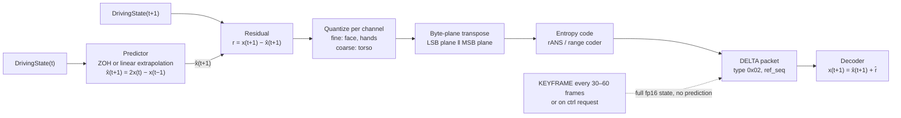

**The design follows HiFi4G's proven residual scheme** (arXiv [2312.03461](https://arxiv.org/abs/2312.03461)): keyframes retain full attributes, non-key frames store motion-compensated residuals only, with **different bit-widths for keyframes vs non-key frames** (HiFi4G: 9-bit appearance / 0-bit motion at keyframes, 7-bit appearance / 11-bit motion at non-key frames), then **rANS entropy-codes the zero-centred residual distribution** — reaching ~25× compression on content vastly larger than TAYF's. [PUBLISHED, in corpus]

**Second proven pattern: FPZIP over concatenated consecutive states.** INV (arXiv [2302.01532](https://arxiv.org/abs/2302.01532)) faces the structurally identical problem and concatenates consecutive frames' parameter matrices before running 16-bit FPZIP, taking 1.12 MB/frame to 0.3 MB/frame after a one-time 3.29 MB shared transfer. Its second result matters more: freezing the appearance layers and transmitting only per-frame structure layers cuts the payload to 24.6% **and provably eliminates flicker**, because appearance is byte-identical across frames. **The reason to hold appearance fixed is not only bandwidth, it is temporal stability.** [PUBLISHED, in corpus]

**Two theoretical results that bound what delta coding can achieve** — both worth knowing before someone designs a clever scheme that cannot work:

- **Shared randomness buys nothing.** arXiv [2203.12467](https://arxiv.org/abs/2203.12467) proves a variable-length-coding lower bound for LQG control — the shape of a pose-tracking loop — at `L ≥ (1/(T+1))·I(x^T → u^T)` in directed information, and shows **shared dither/randomness between encoder and decoder does not change the bound.** Do not design a shared-seed shortcut. [PUBLISHED, in corpus]
- **Perfect realism costs 3 dB.** arXiv [2202.04147](https://arxiv.org/abs/2202.04147): in the Gaussian case perfect realism is achievable iff `R ≥ ½log₂(1/(1−ρ²))`, and **without common randomness, imposing perfect realism costs 3 dB of distortion** versus the classical R-D bound. Binding the moment TAYF claims its decoder output is perceptually indistinguishable rather than merely accurate. [PUBLISHED, in corpus]

##### The gain, measured

`pipeline/transport/README.md` open item 3 is explicit: **do not assume delta-encoding is needed until the baseline shows it is.** That instruction is respected — the following is a probe of the *coding pipeline*, not an argument for building it. Same synthetic stream as §2.3, residual quantized at q = 1e-3 rad (0.057°, at the fp16 step size and below the estimator noise floor), stored as int16.

| Stage | Predictor | Bytes/frame | vs 430 B | Wire rate @60 Hz |
|---|---|---|---|---|
| LZ4 on byte-interleaved int16 residual | ZOH | 432.7 B | 1.006× | 0.2523 Mbps |
| LZ4 on byte-interleaved int16 residual | linear extrap | 362–400 B | 0.84–0.93× | 0.219–0.237 Mbps |
| **+ byte-plane transpose, then LZ4** | ZOH | 343 B | 0.798× | 0.209 Mbps |
| **+ byte-plane transpose, then LZ4** | linear extrap | 339–342 B | 0.79× | 0.207–0.209 Mbps |
| **Order-0 entropy bound (what a range coder reaches)** | ZOH | 238–239 B | 0.55× | 0.159 Mbps |
| **Order-0 entropy bound (what a range coder reaches)** | **linear extrap** | **153–175 B** | **0.36–0.41×** | **0.118–0.129 Mbps** |

Peak residual magnitude: **±24–28 quantizer steps (0.024–0.028 rad) under linear extrapolation** versus **±88–94 steps (0.088–0.094 rad) under zero-order hold** — a 3.4× reduction in dynamic range, which is where most of the entropy saving comes from. [MEASURED — synthetic input, this session]

**Three conclusions, each actionable:**

1. **LZ4 is the wrong tool at every stage of this pipeline.** It does nothing on raw fp16 (1.007×) and almost nothing on byte-interleaved residuals (1.006×). It only works on exact-zero runs. The `03_...TRANSPORT.md` §8.4 prediction — "which is exactly what LZ4 … is bad at exploiting on raw fp16 floats" — is confirmed quantitatively.
2. **Byte-plane transposition is free and worth ~20%.** Splitting all low bytes from all high bytes before compression turns an unmatched interleave into two runs, and LZ4 then finds the near-constant high-byte plane. 343 B vs 433 B for a two-line change. It is the cheapest single win available in the transport stack.
3. **The predictor choice is worth more than the compressor choice.** Linear extrapolation over zero-order hold cuts the entropy-coded size by ~35% (238 → 153–175 B). But note the tradeoff `03_...TRANSPORT.md` §8.4 already flags: **ZOH is the safer default under packet loss**, because linear extrapolation compounds an error across a gap. Under the degradation ladder (§7) the predictor should switch to ZOH the moment loss is detected — accepting ~0.04 Mbps to stop error propagation.

**Rotation representation is a correctness trap, not an optimization.** Delta-encoding axis-angle across the π/−π wrap, or quaternions across the q/−q double cover, produces spurious huge residuals that will destroy every number in the table above. Either delta in a 6D continuous rotation representation or canonicalize the sign/branch before differencing. [PUBLISHED — `03_...TRANSPORT.md` §8.4]

**And the alternative to building any of it: send fewer coefficients.** AGORA-M-style distillation reduces per-frame animation to **64 blendshape coefficients** — 128 B in fp16, a 3.4× smaller payload than 215 floats, with no entropy coder, no predictor state, no keyframe-recovery machinery, and (from §2.4) a **0.114 Mbps** wire rate that beats the full delta pipeline. The cost is that the SVD basis joins the negotiated contract and is avatar-specific, so a rig update invalidates it. **Evaluate this against delta coding before building either.** [PUBLISHED — `03_...TRANSPORT.md` §8.4/§5.4]

**The honest framing of why to build delta coding at all** (`pipeline/transport/README.md` open item 3, restated): the baseline is already 15–23× under a 4 Mbps uplink, so **the reason is not bandwidth — it is packet size.** A per-frame payload well below one MTU with margin lets a keyframe plus several deltas ride in one datagram during recovery, which is the only loss-repair mechanism admissible on an unordered, unreliable channel.

---

#### WebRTC data-channel design

**WebRTC remains the only shipping option for <150 ms conversational media** (`research/01-volumetric-capture-sota.md` §3.5). Mon3tr uses it. TAYF uses `aiortc` (BSD, `research/LICENSING.md`). [PUBLISHED]

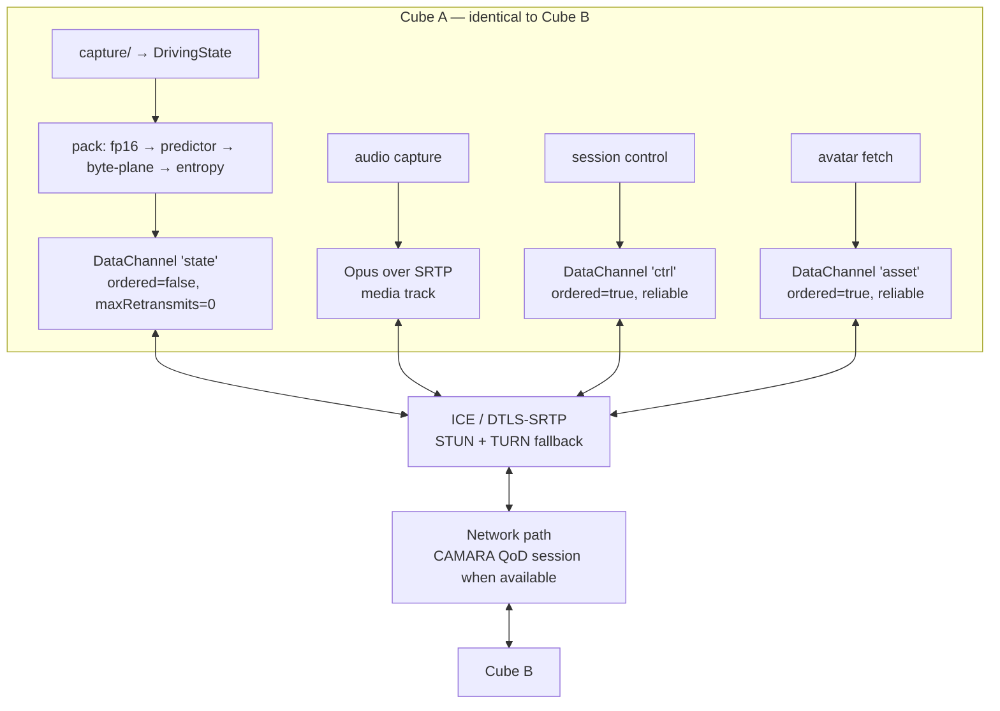

**Four channels, four different reliability contracts — this is the design decision that matters** (`03_...TRANSPORT.md` §8.5):

| Channel | Transport | Reliability | Rate | Why |
|---|---|---|---|---|
| `state` | SCTP DataChannel | **`ordered: false`, `maxRetransmits: 0`** | 60 Hz, 367–542 B/pkt wire | A retransmitted pose frame arrives after it is useless. Late data is *worse* than no data — the receiver would render a stale pose after a newer one. Drop it |
| `audio` | Opus over SRTP media track | Standard RTP with NACK/PLC | 50 pkt/s, 20 ms frames | Audio is the one stream where a gap is immediately audible. Use the media stack's jitter buffer and concealment, not the data channel |
| `ctrl` | SCTP DataChannel | **`ordered: true`, reliable** | Event-driven, <1 Hz | Session setup, avatar version negotiation, keyframe requests, degradation-mode signalling, capture-box updates. Must not be lost |
| `asset` | SCTP DataChannel | **`ordered: true`, reliable** | Bursty, once | Canonical avatar payload if not cached. 10–30 MB after aggressive static compression, out-of-band, before or during early call |

**A property of SCTP that the "unreliable" label hides.** [DERIVED] `maxRetransmits: 0` disables *retransmission*; it does not disable *congestion control*. The SCTP association still runs slow-start and congestion avoidance (RFC 4960 §7), so under loss the stack can delay a send even though it will never resend it — turning a loss event into added latency on a channel whose entire design premise is that latency is unrecoverable. At 542 B/frame this is unlikely to bind (the cwnd floor is several MTUs), but it is the mechanism by which a bad network night could show up as jitter rather than as loss, and the transport module's "conditions degrading" signal (§8, §9) should therefore watch **send-queue depth**, not only loss and RTT. Whether `aiortc` exposes that is [UNVERIFIED] — confirm in `aiortc/rtcsctptransport.py`.

**Audio/state sync.** Both streams are stamped with `capture_ts` from the hardware trigger; the receiver aligns at render time. **Never delay audio to wait for pose.** The licence for this is perceptual: audiovisual desync is noticeable beyond ~50 ms *lead* and ~220 ms *lag* (Vatakis et al. 2006, via arXiv [2503.20308](https://arxiv.org/abs/2503.20308)) [PUBLISHED, in corpus] — a face rendered up to ~220 ms behind the audio is not perceived as desynchronized, provided expression amplitude is preserved. Audio is the higher-priority stream and a late-but-expressive face beats delayed speech.

**Render-rate decoupling is required, not optional.** If the optical engine runs at 90 Hz and state arrives at 60 Hz, the receiver interpolates; if state stalls, it keeps rendering the last good pose with damped extrapolation. **Rendering only on packet arrival makes every network hiccup a visible freeze.** [PUBLISHED — `03_...TRANSPORT.md` §12.3]

**No codec for the state stream, and none is coming.** MPEG's Gaussian Splat Coding is at CDAM (V-PCC path) / Working Draft (G-PCC path); a coding CfP is only *"being prepared"* with no published date and no target IS date; the dynamic test-material call (WG 5 N 422) closes 15 October 2026. MPEG's own consensus is that single-frame compression is essentially solved and the remaining work is temporal. **Anything shipping before ~2029 uses a proprietary or de-facto format.** TAYF's format is `pipeline/schema.py`, and that is fine — 215 floats is not a codec problem. [PUBLISHED — `research/01-volumetric-capture-sota.md` §3.1]

**Media over QUIC is not an option for this.** `draft-ietf-moq-transport-19`, 6 July 2026, **still pre-RFC**; Cloudflare relays claim *"sub-second"*, a **broadcast** target roughly 5× above the conversational budget. Use MoQ for one-to-many volumetric replay, not for calls. [PUBLISHED — `research/01-volumetric-capture-sota.md` §3.5]

---

#### Loss resilience — and an honest statement of how thin the evidence is

**The corpus contains no loss-resilience literature at all.** A keyword sweep of `research/deepseek_research.md` (128 deep-read papers) was re-run for this section with word-boundary matching, and the counts are:

| Term | Hits | Term | Hits |
|---|---|---|---|
| `FEC` | **0** | `CAMARA` | **0** |
| `QUIC` | **0** | `QoD` | **0** |
| `packet loss` | **0** | `congestion control` | **0** |
| `jitter` | 3 — all optical/perceptual (SLM phase jitter, mesh temporal jitter); **zero network jitter buffers** | `WebRTC` | 3 — Mon3tr, Tele-Aloha, and a track heading |

[MEASURED — sweep re-executed against the corpus for this section, not inherited]

**Everything in this subsection beyond the two WebRTC datapoints is standard practice reasoned from first principles, not cited measurement, and must be treated accordingly.** Two caveats attach. First, `research/METHODOLOGY.md` rule 1: a keyword sweep can only return terms you already thought of, so this is evidence *about the corpus*, not about the world — the correct reading is "the corpus was built by a transport-blind keyword pipeline," not "no loss-resilience research exists." Second, and following from that, **this is the one area of the transport design where an outside expert review would be worth more than more reading inside this repo.**

The one relevant published result is **ReVo** (arXiv [2604.27441](https://arxiv.org/abs/2604.27441), via `research/01-volumetric-capture-sota.md` §3.5): cross-layer volumetric videoconferencing on WebRTC with modality-aware separation and **network-layer FEC on critical content**, reporting **up to +32% SSIM (RGB), +13% (depth), −95.7% video freezes** (no Mbps/fps published). **The transferable idea is selectivity: apply FEC to the perceptually critical channel only.** [PUBLISHED]

##### The specified 1/4-rate XOR FEC does not survive its own latency analysis

`03_...TRANSPORT.md` §8.5/§9.1 specifies a 1/4-rate XOR FEC on the state channel at ~0.041 Mbps (0.065 Mbps at the measured packet size), on the argument that it "eliminates most single-packet losses with zero retransmission latency."

**The zero-latency claim does not hold for block FEC.** [DERIVED] An XOR parity packet computed over a group of k = 4 frames cannot be sent until frame 4 exists, so a loss of frame 1 is repaired no earlier than **k frame intervals later — 67 ms at 60 Hz**. By the channel's own governing rule (`seq` older than the last rendered frame is discarded), that repaired frame is dead on arrival. **Block FEC on the state channel spends 0.065 Mbps to reconstruct frames the receiver is contractually obliged to throw away.**

Three replacements, in increasing order of cost, all [DERIVED]:

| Scheme | Recovery latency | Added rate | Verdict |
|---|---|---|---|
| **Duplicate keyframes only** — send each KEYFRAME twice back-to-back | 0 (the copy is adjacent) | 449 B × 2/s at a 30-frame interval = **0.007 Mbps** | **Do this.** 9× cheaper than the specified FEC and it targets the actual failure |
| **Piggyback the previous residual** in each DELTA (Opus's own LBRR in-band-FEC pattern, RFC 6716) | one frame interval = **16.7 ms** | +153–175 B/pkt ⇒ ~+0.077 Mbps on the delta path (total ~0.207 Mbps) | Do this **only if** measurement shows single-packet loss actually degrades perceived motion |
| 1/4-rate XOR block FEC as specified | 4 frame intervals = 67 ms | +0.065 Mbps | **Drop it** — repairs arrive after the discard deadline |

**The reasoning behind "duplicate keyframes only" is the degradation ladder itself.** Rung 1 (isolated packet loss) is already handled *for free* by interpolate/extrapolate-and-damp, and is stated to be imperceptible. The rung that actually hurts is rung 2 — a burst that leaves a DELTA undecodable, forcing a `ctrl` keyframe request whose round trip is 2 × one-way latency (40–120 ms) before motion resumes. **Redundancy belongs where recovery is expensive, and that is the keyframe, not the delta.** At 1–2 keyframes/s, duplication costs 0.007 Mbps and removes the most common path to a visible hold.

**Selective protection, if any is applied.** Per the allocation ranking in `03_...TRANSPORT.md` §7.7, protect the **expression (50) and hand (90) dimensions** before the body (75). This is also the direction ReVo's result points. [PUBLISHED ranking, [ESTIMATE] application]

##### Jitter buffer

**The cheapest latency lever in the entire system, and the one most often set carelessly**: 1–2 frames = **17–33 ms**, adaptive, sized from measured jitter. With a CAMARA QoD session active, run at 1 frame; without one, 2. It must be adaptive and driven by measurement, not fixed. [PUBLISHED — `03_...TRANSPORT.md` §10.2/§12.4]

---

#### Latency budget

Two clocks, and it is easy to lose the distinction (`research/01-volumetric-capture-sota.md` §3.4):

- **Motion-to-photon (<15–20 ms)** — satisfied *locally* by reprojecting an already-received frame. Governs whether the image feels attached to the world. **Under the head-tracked architecture this clock now has a consumer: observer tracking.**
- **Conversational one-way (≤150 ms, ITU-T G.114)** — governs the remote path, capture → estimate → encode → network → decode → animate → render → emit. **This is the binding clock for this section.**

| Threshold | Value | Source |
|---|---|---|
| Mouth-to-ear one-way, "essentially transparent" | **≤150 ms** | ITU-T G.114 [PUBLISHED] |
| One-way, unacceptable | >400 ms | ITU-T G.114 [PUBLISHED] |
| VR motion-to-photon | <15–20 ms | MTP consensus, arXiv 1801.07587 [PUBLISHED] |
| VR conferencing fluency | degrades from 100 ms; **sharp collapse at 300 ms under cognitive load** | arXiv [2603.09261](https://arxiv.org/abs/2603.09261) [PUBLISHED] |
| Audiovisual sync JND | 50 ms lead / **220 ms lag** | Vatakis et al. 2006 via arXiv [2503.20308](https://arxiv.org/abs/2503.20308) [PUBLISHED] |
| Speed-dependent tolerance | ~120 ms at 350 mm/s hand speed; degrades from ~80 ms at 500–650 mm/s | Hoyet et al. via arXiv [2606.25681](https://arxiv.org/abs/2606.25681) [PUBLISHED] |
| Reference achieved end-to-end | **~80 ms** | Mon3tr [MEASURED, PC sender + Quest 3 receiver] |

**The 2026 fluency study matters more than the raw G.114 number:** fluency degrades gradually from 100 ms but **collapses at 300 ms under cognitive load**. A demo that feels fine while two people chat fails the moment they try to work on something together. And note what is *not* binding: the 10 ms and 75 ms sensorimotor thresholds in arXiv 2606.25681 measure a person acting on a delayed representation of *their own* hand. TAYF's user watches a remote person. Those numbers become binding only if TAYF adds a shared-manipulation task. [PUBLISHED — `03_...TRANSPORT.md` §10.1]

##### Per-stage, consolidated

Two budgets exist in the repo and they answer different questions. Both are reproduced, then reconciled.

| Stage | `01` §6 — system envelope | `03` §10.2 — detailed path | Confidence |
|---|---|---|---|
| Sensor exposure + readout | 8–16 ms | 8–17 ms | Vendor-determined; one frame period @60 fps |
| Matting + ROI crop | *(folded into next row)* | ≤5 ms | **UNVALIDATED on Jetson** |
| Pose/face/hand estimation (parallel) | 20–30 ms | **13.78 ms** | [MEASURED] Mon3tr "worker execution" — **PC-class; principal risk** |
| Multi-view fusion + smoothing | *(folded)* | 3.4 ms | [MEASURED] Mon3tr 2.13 sync + 1.27 smoothing; TAYF's fusion is new work |
| Encode + pack | 2–5 ms | <1 ms | [DERIVED] 430 B fp16 cast + one compressor call |
| **Sender subtotal** | — | **~26–40 ms** | |
| Network, one-way | 20–60 ms | 5–40 ms | Apple measured >80 ms RTT US coast-to-coast ⇒ >40 ms one-way; metro/LAN far less. **The variable the agent layer defends** |
| Jitter buffer | *(not itemized)* | 17–33 ms | **The largest tunable** |
| Depacketize + decode | 2–5 ms | <1 ms | [DERIVED] |
| Avatar animation (LBS + Gaussian attrs) | 8–15 ms | ≤5 ms | **UNVALIDATED on Jetson** |
| **Observer tracking** | **5–10 ms** | *(not present)* | **New — enters the loop because of `01` §4.4** |
| View synthesis + CGH | 10–20 ms | ≤10 ms | 0.089 Gpx/s tracked; **UNVALIDATED on Jetson; scales with view count** |
| Optical emission | 1–16 ms | out of scope | Modulator-dependent |
| **Receiver subtotal** | — | **~23–49 ms** | |
| **Total** | **76–177 ms** | **~49–89 ms** | `01`: upper end **violates H4** |

**Reconciliation, because the two tables do not compose and someone will notice.** [DERIVED] `03` §10.2's stated end-to-end range of 49–89 ms is a *typical-path* figure, not a worst-case stack: its own rows sum at the top end to 40 (sender) + 40 (network) + 49 (receiver) = **129 ms**, not 89. Adding `01` §6's two stages that `03` omits — observer tracking (5–10) and optical emission (1–16) — puts the worst case at **~155 ms**, which is over G.114 and consistent with `01` §6's own 177 ms upper bound and its warning that **no stage has slack**. The 89 ms figure should be read as "brackets Mon3tr's measured 80 ms on a good path," and the 155–177 ms figure as the number the design must actually survive. Neither document is wrong; the subtotals are typical, the totals in `01` are enveloped, and quoting 89 ms as the system's latency would be quoting the good night.

**Observer tracking sits on both clocks, and this is worth stating precisely.** [DERIVED] It appears once in the conversational chain (the render cannot be issued until pupil positions are known — hence the 5–10 ms row). But its own closed loop, head-moves → light-steers, is governed by the **motion-to-photon** clock at 15–20 ms, which is the tighter of the two by roughly an order of magnitude. This is the mechanism behind `01` §9's requirement that **prediction is mandatory**: at a natural 0.2 m/s head sway, 100 ms of pipeline latency is 20 mm of pupil-position error — over three pupil diameters — so **untracked prediction error, not tracking accuracy, is the likely failure mode.** The network layer's contribution to that error is its *jitter*, not its mean latency, which is exactly what §8's QoD session buys.

**How to read the margin: it is not comfortable.** Every compute figure above is a desktop-GPU number. If the Jetson is 3× slower on the estimator stage — entirely plausible for a 15 W part versus an RTX 5090 — that stage alone goes 13.78 → ~41 ms and the end-to-end lands near 120 ms before the optical engine is budgeted. This is why the first benchmark in the program is the estimator stage and nothing else.

**And if a tradeoff is forced, spend latency to preserve motion expressiveness rather than the reverse:** viewers preferred *expressive* motion with 100 ms desync over precisely-timed flat motion by **82.6%** (arXiv [2503.20308](https://arxiv.org/abs/2503.20308)). [PUBLISHED, in corpus] The 220 ms lag tolerance is the budget this preference is spent from.

---

#### Graceful degradation ladder

Ordered by severity. Each rung is a defined, testable state, not a fallback that happens by accident. Rates added here from §2.4 (measured-worst packet size, 542 B wire). [PUBLISHED ladder — `03_...TRANSPORT.md` §12.5; rate column [DERIVED]]

| # | Condition | Response | State-channel rate | User-visible effect |
|---|---|---|---|---|
| 0 | Nominal | 60 Hz delta + keyframes, 3–4 cameras, all estimators | 0.26 Mbps | Full fidelity |
| 1 | Isolated packet loss | Interpolate/extrapolate from last good pose, damp toward neutral over ~100 ms | unchanged | Imperceptible |
| 2 | Loss burst; DELTA undecodable (`ref_seq` missing) | Discard deltas, request KEYFRAME on `ctrl`, hold last good pose. **Switch predictor to ZOH** (§4.1) | unchanged | Brief hold, <200 ms |
| 3 | Sustained loss / rising RTT | Signal `agent/`; drop 60 → 30 Hz; **do not reduce expression precision** | **0.130 Mbps** | Slightly less fluid body motion |
| 4 | Bandwidth collapse | 30 → 20 Hz; disable redundancy; body pose to coarser quantization; **face and hands hold full precision** | **0.087 Mbps** | Visibly less fluid body; face intact |
| 5 | Camera fault / lost calibration | Single-camera monocular mode; disable multi-view fusion; widen smoothing | unchanged | More pose jitter, occlusion errors on turns |
| 6 | Face out of frame or occluded | Switch expression source to **audio-driven** (arXiv [2510.01176](https://arxiv.org/abs/2510.01176), <15 ms GPU) | unchanged | Face keeps moving with speech |
| 7 | Estimator stall (thermal throttle, model crash) | Hold last valid pose, damp toward neutral, raise `ctrl` alarm | → 0 | Person "settles" rather than freezing mid-gesture |
| 8 | Avatar not yet cached | Provisional low-fidelity avatar; fetch real asset in background on `asset` | unchanged | Lower-fidelity likeness for the first session |
| 9 | Total state loss >2 s | Freeze avatar in neutral pose; **keep audio live**; surface a connection indicator | 0 | Audio call with a still figure |
| 10 | QoD unavailable | Best-effort path; jitter buffer to 2 frames; enable keyframe duplication | +0.007 Mbps | Slightly higher latency |
| — | *Tracking loss (optical, `01` §9)* | *Widen to a fixed broadcast cone at reduced fidelity rather than dropping output* | unchanged | *Lower angular fidelity, image retained* |

**Two rules govern the whole ladder:**

1. **Audio never degrades before video.** A frozen avatar with clear speech is a usable call; fluid motion with broken audio is not.
2. **Face and hands are the last things to lose precision.** Every rung degrades body pose, frame rate, or redundancy before touching expression or hand channels.

**Explicitly rejected behaviours:** retransmitting state frames (late data renders out of order); blocking the render loop on packet arrival (turns jitter into freezes); silently reinterpreting a `dims`/`rig_id` mismatch (renders a broken human); attenuating expression amplitude under load (contradicts the 82.6% result).

**Note what rungs 3 and 4 imply about the §2.5 budget problem.** [DERIVED] Rung 3 alone — 60 → 30 Hz — takes the measured-worst one-way total from ~0.31 Mbps to ~0.18 Mbps, back inside the 0.3 Mbps criterion with room. The ladder already contains the remedy; what it does not contain is a trigger that fires on *bitrate* rather than on loss/RTT. **Add one:** if the measured wire rate exceeds a session-negotiated ceiling, enter rung 3 regardless of network health.

---

#### The CAMARA / Nokia Network-as-Code agent layer

##### What makes it an agent rather than a QoS thermostat

The network path is best-effort by default. Where the carrier supports it, a **CAMARA Quality-on-Demand session** reserves the latency/throughput profile for the duration of a call. The distinguishing property is not that the system reacts to congestion — every adaptive-bitrate stack does that — but that **CAMARA Congestion Insights returns a prediction for the *upcoming 15 minutes***, so the system can act *before* congestion arrives rather than after latency has already degraded. [PUBLISHED — `agent/nac_client.py` docstring and `agent/README.md`; the API's own response carries `timeIntervalStart`, `timeIntervalStop`, `congestionLevel ∈ {Low, Medium, High}`, `confidenceLevel ∈ 0–100`]

This matters for TAYF specifically because of §7: bandwidth is not the constraint (13–19% of a poor uplink), **jitter and tail latency are**, and jitter is the term that feeds directly into the observer-tracking prediction error. A reactive controller cannot fix a jitter spike it learns about from the spike itself; a 15-minute lookahead can have a QoD session already established when it arrives.

**Separation of concerns, strictly enforced** (`docs/architecture.md`, "Module ownership"): `transport/` does **not** decide when to request a session. It exposes one signal — "network conditions are degrading", derived from the WebRTC stack's loss/RTT trend (and, per §5, send-queue depth) — and `agent/` acts on it. **`agent/` never touches the media pipeline and never handles a frame.**

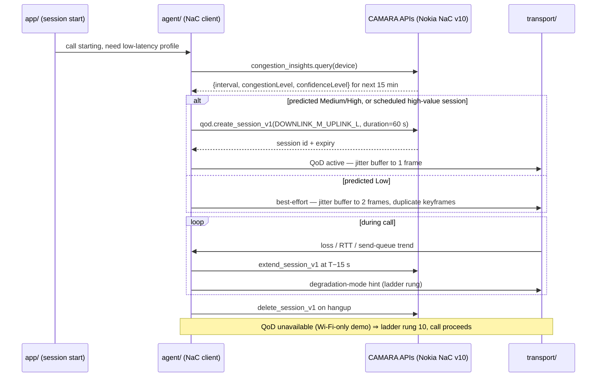

##### Verified SDK v10 call patterns

Nokia Network-as-Code SDK **v10.0.0**, `network_as_code.client.NetworkAsCodeApi`, default base URL `https://network-as-code.p-eu.rapidapi.com`, RapidAPI host `network-as-code.nokia.rapidapi.com`. Source: `agent/nac_client.py`, whose header states the patterns were **verified against Nokia's own integration tests during this project's research pass — not invented syntax.** [PUBLISHED — SDK v10.0.0 as recorded in `agent/nac_client.py`] **[UNVERIFIED against any live or sandbox endpoint — see §9.5.]**

| Call | Signature as implemented | Parameters that matter |
|---|---|---|
| Congestion prediction | `client.congestion_insights.query(device={"phone_number": …})` | Returns `{timeIntervalStart, timeIntervalStop, congestionLevel: Low\|Medium\|High, confidenceLevel: 0–100}` for the **upcoming 15 minutes**. The forward-looking window is the whole point |
| Session create | `client.qod.create_session_v1(device={...}, application_server={"ipv4address": …}, qos_profile=…, duration=…)` | `device` requires **both** `phone_number` and `ipv4Address {publicAddress, privateAddress}`. `qos_profile="DOWNLINK_M_UPLINK_L"`, `duration=60` s default |
| Session extend | `client.qod.extend_session_v1(session_id=…, requested_additional_duration=…)` | A call outlives a 60 s session, so **extension is the normal path, not an exception** |
| Session delete | `client.qod.delete_session_v1(session_id=…)` | Teardown at call end |
| Slice create | `client.slice.create_slice(network_identifier={"mcc","mnc"}, slice_info={"service_type":"eMBB","differentiator":"444444"}, name=…, slice_uplink_throughput={guaranteed,maximum}, device_uplink_throughput={…}, max_data_connections=10, max_devices=5)` then `client.slice.activate(id=result.name)` | `name` must match `^[a-zA-Z0-9][a-zA-Z0-9-]{3,63}[a-zA-Z0-9]$` — a silent 400 otherwise |
| Slice attach | `client.slice.attach_device(device={"phone_number","imsi"}, slice_id=…, traffic_categories={"apps":{"os":app_id,"apps":app_names}})` | **`phone_number` and `imsi` are both mandatory** |

Auth: `NAC_TOKEN` from environment via `python-dotenv`; `RAPIDAPI_HOST` overridable.

**`DOWNLINK_M_UPLINK_L` is the one non-obvious choice in the entire transport stack, and it is right.** [PUBLISHED choice, [DERIVED] justification] In a symmetric two-cube call each endpoint is simultaneously a sender and a receiver of the *same* ~0.18–0.26 Mbps stream (§2.4). The profile must therefore **not** assume the consumer-video asymmetry most QoS profiles are shaped around. TAYF's traffic is the rare case that is genuinely uplink-heavy relative to a video-streaming baseline, and every cube is identical, so the same profile is requested at both ends.

**Session lifecycle, made concrete.** [ESTIMATE — thresholds are untuned, per `agent/README.md` open item 2]

| Event | Action | Rationale |
|---|---|---|
| Call setup | `congestion_insights.query()` once before dialing | The prediction covers the next 15 min; a typical call fits inside one window |
| Predicted `High`, or `Medium` with `confidenceLevel ≥ 70` | `create_session_v1(duration=60)` | Act on the forecast, not the symptom |
| Predicted `Low` | No session; best-effort; jitter buffer at 2 frames | QoD is an optimization, not a dependency |
| T − 15 s before expiry | `extend_session_v1(+60 s)` | A failed extend needs time to fall back to a re-create before the reservation lapses |
| `transport/` reports degrading trend | Re-query prediction; escalate to create/extend; hint ladder rung 3 to `transport/` | The only path by which network state reaches the media pipeline |
| Hangup | `delete_session_v1` | Sessions are billable and finite |
| Scheduled high-value session (a demo) | `create_slice(...)` + `activate` + `attach_device` ahead of time | Slicing is for *predictable* events; QoD is for calls |

**Network slicing is a different instrument from QoD and should not be described as an escalation of it.** [DERIVED] A slice is provisioned ahead of time against an `mcc`/`mnc` with guaranteed/maximum uplink throughput and explicit device attachment — appropriate for a scheduled demo where the failure cost is high and the timing is known. QoD is per-session, on-demand, 60 s at a time. Requesting a slice reactively mid-call is not a supported motion.

##### Hard compliance constraints — read before writing any code in `agent/`

Both were confirmed by direct inspection of the hackathon's mandatory AI Resource & Tooling Guide PDF, not assumed. [PUBLISHED — `agent/compliance.md`]

> **1. No MCP.** MCP (Model Context Protocol) appears **zero times** in the mandatory guide. The tooling rules were written around a different integration approach. **Do not build the agent layer on MCP** — it would not comply with the rules this hackathon actually enforces, regardless of how convenient MCP is for tool-calling elsewhere.
>
> **2. The LLM brain must be Gemini 2.5 or Groq-hosted — not Claude.** The guide's permitted-LLM table does **not include Claude/Anthropic models.** If `agent/`'s decision logic uses an LLM rather than plain threshold rules, it must be built on Gemini 2.5 or a Groq-hosted model.

Three clarifications that keep this from being misapplied:

- **The constraint binds what *ships*, not how the repo was built.** This repository and its research were produced with Claude Code, which is explicitly fine per `agent/compliance.md`. The constraint is on the deployed submission.
- **Both are easy to violate by default**, because MCP and Claude are each the path of least resistance in current agent tooling. That is precisely why `agent/compliance.md` exists as a single stated place rather than as a paragraph in the PDF.
- **v1 does not need an LLM at all.** The decision surface is four thresholds over `congestionLevel`, `confidenceLevel`, an RTT/loss trend, and a session clock. An LLM is a *policy* upgrade for a more sophisticated congestion response, not a requirement. **And whichever brain is used, it must never sit inside the per-frame loop** — `agent/` handles no frames, and a model inference in the 16.7 ms frame interval would violate §7 before it violated anything else.

##### Licensing

`network-as-code` is a **vendor SDK**. `research/LICENSING.md` flags it: **verify redistribution terms if TAYF ships the client rather than merely calling it.** Every other transport-path dependency is clean — `aiortc` BSD, `lz4` BSD-2-Clause, Opus BSD/royalty-free. [PUBLISHED — `research/LICENSING.md`, and the Opus/aiortc terms as recorded there]

##### What is blocking, stated plainly

**Nokia NaC portal registration (milestone M-N1, `FilesPlan.md` §6 item 5, project task #2) is outstanding, and no NaC call in `agent/nac_client.py` has ever been executed against a real or even a sandbox endpoint.** [PUBLISHED — `agent/README.md`, `docs/06` §5.4] It blocks M-N2 (QoD create/extend/delete against sandbox) and M-N3 (the Congestion Insights loop driving real decisions), and it is one of exactly two items blocking the hackathon build — the other being the avatar-model licence decision (M-A1). `docs/06` §6 classifies both as one-decision items: **neither is research.**

The honest status line for this whole subsection: **the call patterns are verified as syntax, the architecture is specified, and the integration is unexecuted.**

---

#### Open items, in the order they should be closed

| # | Item | Why it is first | Tag |
|---|---|---|---|
| 1 | **Measure the real LZ4 ratio on captured human motion** in `experiments/bandwidth/` | It is the only unmeasured input to every published bitrate figure; §2.3 shows the assumed 0.6× is achieved only under region masking, and the full-body case puts the one-way total at ~0.31–0.38 Mbps against a <0.3 Mbps success criterion | [MEASURED synthetic; needs real capture] |
| 2 | **Nokia NaC portal registration (M-N1)** | Blocks M-N2, M-N3, and the hackathon's entire CAMARA claim. Not research | [PUBLISHED blocker] |
| 3 | **Benchmark the estimator stage on Jetson-class hardware** | Every latency figure in §7 is a desktop-GPU number; a 3× slowdown on one stage moves end-to-end from ~89 to ~120 ms before the optical engine is counted | [UNVERIFIED] |
| 4 | Implement `pipeline/transport/` at all — **no transport code exists**; it is a spec document | Nothing above is validated on TAYF's own implementation; all measured numbers are Mon3tr's | [PUBLISHED — `pipeline/transport/README.md` open item 1] |
| 5 | Replace the 1/4-rate XOR FEC with keyframe duplication (§6.1) | The specified scheme repairs frames after the receiver's own discard deadline; the replacement is 9× cheaper | [DERIVED] |
| 6 | Add byte-plane transposition before compression (§4.1) | ~20% for a two-line change, independent of whether delta coding is ever built | [MEASURED synthetic] |
| 7 | Decide 64-coefficient distilled basis **vs** delta coding, before building either | 0.114 vs 0.130 Mbps, and the distilled path needs no entropy coder, predictor state, or keyframe machinery | [PUBLISHED tradeoff, undecided] |
| 8 | Confirm `aiortc`'s SCTP behaviour: I-DATA negotiation, congestion-control exposure, send-queue visibility | Determines whether §5's "unreliable ≠ unpaced" risk is observable at all | [UNVERIFIED] |
| 9 | Pin the global-translation representation before the rig layout freezes | fp16 at 10 m is a 10 mm step — visible drift; a naive whole-array cast ships the bug | [PUBLISHED risk] |
| 10 | Get outside review of the loss-resilience design | §6's sweep confirms the corpus holds **zero** FEC/QUIC/QoD/packet-loss/congestion-control literature; this design is reasoned, not sourced | [UNVERIFIED by construction] |

---

## 7. Hardware, BOM, thermal and the build ladder

#### Scope, and what this section replaces

`docs/04_CUBE_HARDWARE_AND_PROTOTYPE_ENGINEERING.md` is a complete lab manual for a **coherent phase-modulator engine in a sealed 100 mm cube**. That architecture is no longer the selected one. This section is the hardware document for the family the aperture law actually permits — **static retroreflective aerial imaging (AIRR)** per `docs/09_DEVICE_DESIGNS.md` — and it inherits doc 04's *method* (first-principles numbers, formula shown, tags on every unverified figure) while replacing most of its *content*.

The mode is named once and used throughout, per `docs/01` §4.3b: **AIRR forms a real image in the viewer's own space, so `W_image ≤ D_aperture`.** No AIRR device in this section is a portal-mode (`W = D·b/a`) device; where portal mode appears it is labelled.

What the architecture change deletes from doc 04, and therefore from this BOM, this PCB stack, and this test-equipment list:

| Deleted | Was | Why it goes |
|---|---|---|
| Spatial light modulator + driver ASIC | 3–5 W, the largest `[U-SPEC]` in doc 04 §3.5 | No wavefront is synthesised; the source is a display panel |
| RGB laser diodes, collimator, expander, PBS | 1–2 W electrical + the entire Class-3B analysis | No coherent source anywhere in the device |
| Optical-source interlock, shutter, monitor photodiode, safety-MCU enable path | doc 04 §2 commitment 1 | Nothing to interlock. The safety domain collapses to thermal supervision |
| Optical driver board (B3), HV rail, constant-current laser driver | doc 04 §9.1, §10.2 | — |
| 3–5 fold mirrors at λ/10, 20 optical surfaces, baffles, wedged covers, IP5X seal + desiccant | doc 04 §5.2–5.5, §12.2 | Three surfaces total, none in a coherent beam |
| Vapor chamber, 90 × 90 × 3 mm | doc 04 §3.7, "required, not optional" | The dominant heat source is now an area source coincident with the largest external face (§40.6.3) |
| Active-alignment station, CMM, bondline dispenser, autocollimator | doc 04 §15.4 | Alignment tolerance loosens by ~30× (§40.5.2) |
| CGH synthesis, observer tracking in the display path, the ±17.2° steering stage | `docs/01` §4.4, §4.6 | An AIRR image is a real 2D image at a fixed plane; there are no angular views to allocate |

**Confidence legend.** Every load-bearing claim below is tagged `[MEASURED]` (measured on hardware, by us or a named paper), `[PUBLISHED]` (a specific verified paper/datasheet/part number states it), `[DERIVED]` (computed here or in-repo, formula shown), `[ESTIMATE]` (engineering judgement, unsourced), `[UNVERIFIED]` (believed, not confirmed — with the missing item named). Doc 04's older `[U-PRICE]/[U-PN]/[U-SPEC]/[U-STD]` tags all map onto `[UNVERIFIED]` here.

> **Nothing in this section is `[MEASURED]` on TAYF hardware, because no TAYF hardware exists.** Every `[MEASURED]` tag below belongs to a cited third-party result. The build ladder in §40.9 exists precisely to convert the `[ESTIMATE]` and `[UNVERIFIED]` rows into `[MEASURED]` ones, in the cheapest order.

---

#### Hardware block architecture

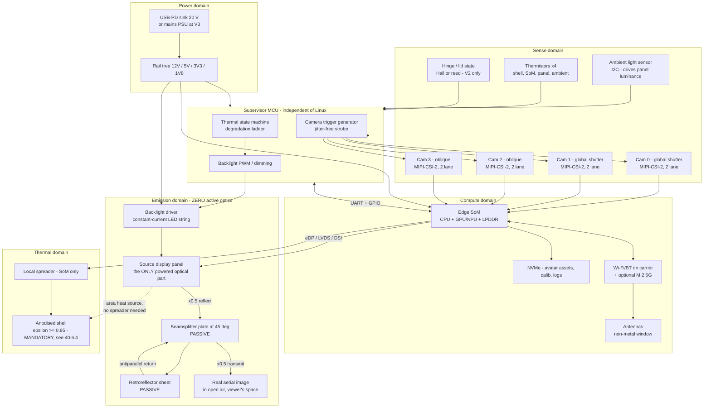

Four architectural commitments encoded there, each a decision rather than a drawing convention:

1. **The emission domain contains exactly one powered component.** The beamsplitter and retroreflector are sheets of glass and film. This is the whole finding of `docs/09` §2 expressed as a block diagram: the box with "optical engine" written on it in doc 04 §2 has been replaced by a display panel and two pieces of passive glass.
2. **The MCU keeps the camera trigger and gains the thermal state machine; it loses the interlock.** Hardware-synchronised multi-view frames still require a jitter-free strobe off a microcontroller rather than a Linux GPIO (`docs/04` §6.5, §2 commitment 2 — carried forward unchanged). The optical-source enable path, which was the MCU's safety-critical function, no longer exists.
3. **No compartment seal.** Doc 04 §3.8 sealed the optical compartment because a dust particle at a beam waist in a *coherent* folded path produces a whole-field diffraction artifact. AIRR is an incoherent imaging system with no beam waist; a dust particle produces a local scatter of its own area. Dust ingress becomes a contrast/cleaning issue, not a physics issue. **The forced-air veto is therefore lifted on optical grounds** — and §40.6 shows the device does not need forced air anyway, which is the better reason to keep the fan out (it would also forfeit the zero-moving-parts property that is the family's principal advantage).
4. **The display link is the highest-rate signal in the box**, replacing doc 04's modulator link. It is the only interface whose routing constrains the board stack (§40.4).

---

#### The optical stack as a hardware problem

Three surfaces, in fixed relative geometry. Everything mechanical, thermal and photometric downstream follows from the geometry, so it is derived here before any part is chosen.

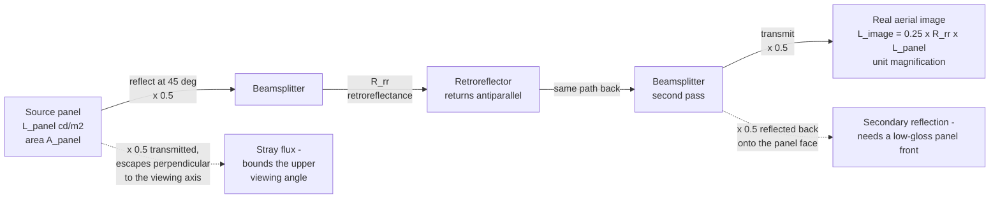

##### The 25 % ceiling is a theorem, not a defect

`docs/09` §3 records "~75 % of source light is lost before the image forms" as an honest caveat. It is stronger than a caveat. Throughput through a non-polarising splitter used once in reflection and once in transmission is `R·T = R(1−R)`, whose maximum over R is **0.25 at R = T = 0.5**. `[DERIVED]`

**η_AIRR = 0.25 · R_rr**, and no choice of splitter ratio improves it. A 50/50 splitter is not a compromise; it is the optimum.

The only escape is to break the symmetry with polarisation, and the geometry invites it: **an LCD emits linearly polarised light for free.** A polarising beamsplitter oriented to reflect the panel's polarisation, plus a quarter-wave retarder in front of the retroreflector, would return light in the orthogonal state and transmit it — giving **η ≈ R_rr instead of 0.25·R_rr, a 4× gain that falls directly out of the source-panel power budget** (§40.6.3). Whether it works depends on one unmeasured property: **does the retroreflector preserve polarisation?** Triple-bounce corner cubes are known to scramble it; bead sheeting depolarises; a dihedral (two-bounce) corner-reflector array may not. `[UNVERIFIED — no measurement, and the AIRR primary literature that would answer it is unread; see docs/09 §3]` The measurement is a rotating linear analyser and a luminance meter, one afternoon at V0 (§40.9.1).

##### Where the image is allowed to sit — plane-mirror geometry

Take the panel horizontal in the base (facing up), the beamsplitter at 45° with its hinge line at the panel's front edge, the retroreflector vertical at the back facing forward. Let the fold line be the origin, `y` run backward along the panel, `z` up.

A ray leaving panel point `(y, 0)` vertically meets the beamsplitter plane at `(y, y)`, reflects to travel horizontally backward, retroreflects, returns, transmits, and converges at `(0, y)`. `[DERIVED]`

Three consequences, all hard geometry:

| Consequence | Statement | Design impact |
|---|---|---|
| **Image plane** | The image is the mirror of the panel plane about the beamsplitter plane: a **vertical plane standing on the fold line**, height = panel depth | The float standoff is *not* a free parameter. The image stands at the device's front lip. A device that puts a head a metre out into the room is not an AIRR device |
| **The √2 tax** | The beamsplitter must span from `(0,0)` to `(L,L)`, a slant length of **L·√2** for a panel of depth L | The closed footprint must be √2 × the image height. `W_image ≤ D_aperture` still holds (`docs/01` §4.3b); AIRR tightens it by a further 1/√2 **in the fold axis only** |
| **Retroreflector extent** | Rays reach the retroreflector at heights 0…L, so it must be L × W and may sit at any distance behind the panel | The retroreflector has slack in every dimension and in angle. It is the forgiving element |

Applied to the portable unit, this materially changes `docs/09` §06's spec:

| Quantity | Value | Basis |
|---|---|---|
| Panel, 10.4″ 4:3 in portrait | 158.4 × 211.2 mm active | `[DERIVED]` from diagonal and aspect: `w = 0.8 × 264.2`, `h = 0.6 × 264.2`; availability `[UNVERIFIED]` |
| Aerial image | **158 wide × 211 tall — a head at ≈ 92 % of life size** (head ≈ 155 × 230 mm) | `[DERIVED]`, unit magnification |
| Beamsplitter slant | 211.2 × √2 = **298.7 mm**, × 158 mm wide | `[DERIVED]` |
| Closed footprint | **≈ 300 × 175 mm** — under A4, not A4 | `[DERIVED]` |
| Free bay left over | (300 − 211) × 158 ≈ **87 × 158 mm** in plan | `[DERIVED]` |

**The beamsplitter's √2 excess length is exactly the electronics bay.** At a 20 mm internal height that bay is ~275 cm³, against doc 04 §8.1's measured-on-paper 63 cm³ for a SoM plus carrier and 29 cm³ for a power board. The portable unit is not volume-constrained. `[DERIVED]`

##### Image quality: what actually degrades it

A plane mirror is stigmatic, so **beamsplitter tilt moves the image, it does not blur it.** The quality budget therefore has only three terms:

| Term | Effect | Requirement | Status |
|---|---|---|---|
| Retroreflector cell pitch → line-spread function | **Dominant.** Sets whether eye and mouth features survive | Resolvable feature ≤ 1 mm at 0.6 m viewing (`docs/01` §8's 1 arcmin at 0.6 m = 0.175 mm; 1 mm is the relaxed engineering target) | `[UNVERIFIED]` — the closed-form LSF model is DOI 10.1007/s10043-026-01034-w (Optical Review 2026), record-level only, content unread |
| Beamsplitter second-surface ghost | A displaced, ~4 % copy of the whole image | Lateral ghost separation for t = 3 mm, n = 1.52, θ = 45°: internal angle 27.7°, in-plane walk `2·t·tan27.7° = 3.15 mm`, perpendicular separation `3.15·cos45° = ` **2.23 mm** | `[DERIVED]`. At a 0.2 mm resolvable spot this is a visible doubled edge. **AR-coat the second surface or wedge the plate 0.5–1°** — mandatory, and cheap only if specified before ordering |
| Beamsplitter surface figure | Slope error δ deviates the ray by 2δ; over ~300 mm of remaining path a 1 mrad slope is 0.6 mm of image error | Slope error ≤ ~1 mrad over the clear aperture `[ESTIMATE]` | Rigid float or borosilicate plate meets this comfortably; **a tensioned pellicle almost certainly does not**, which removes the most attractive folding trick (§40.5.3) |

##### Ambient veiling glare — the contrast term unique to this family

A retroreflector returns light toward its source. Room light entering from the viewer's side transmits the splitter, retroreflects, and transmits back — arriving at the viewer's own eye, registered on the aerial image. Worst case (treating the sheet as a mirror for coaxial light): veiling luminance `= 0.25 · R_rr · L_room`, and a 500 lux room with ρ ≈ 0.3 surfaces sits at `500 × 0.3/π = 47.7 cd/m²`, giving **≈ 8.3 cd/m² of veil**. `[DERIVED]`

Against `docs/02` §7.1's photometric anchors — a real face in that room is **55.7 cd/m²** `[DERIVED, docs/02 §7.1]` and the design target is 200 cd/m² — that is a contrast ratio of 6.7:1 at the "matches a real face" floor and 24:1 at target. Visible haze, not a blocker. The true figure is lower because retroreflective sheeting returns into a narrow cone (typically ~0.5–2° `[UNVERIFIED]`) and most room luminaires are far off the viewer's eye axis, but it is a **first-order term with no analogue in any other display**, it is measurable in an hour, and it is the reason a dark backdrop behind the device matters.

Two published statements bound the viewing geometry and should not be re-derived:

- **Yamamoto (inventor of AIRR), *J. Imaging Soc. Japan* 56(4) 341, 2017: "the aerial image is visible between an eye and the retro-reflector."** `[PUBLISHED]` The viewer must be inside the cone subtended by the retroreflector through the splitter. This, not the panel, sets the viewing zone.
- **Asukanet (ASKA3D), manufacturer: "the size of the projected image and the distance at which an image can be projected depend on the size of the plate."** `[PUBLISHED]` The manufacturer's own statement of `W_image ≤ D_aperture`.
- **Smalley et al., *Nature* 553 486 (2018)** — clipping applies to "all technologies in which the light scattering surface and the image point are physically separate." `[PUBLISHED]` This is why `docs/09` §6's "a device is visible behind the person" is permanent.

##### What the panel must be, in pixels

The image is real, planar, at the front lip, so the viewer distance `a` is the desk distance. At `a = 0.6 m` and 1 arcmin foveal acuity (2.909×10⁻⁴ rad, `docs/01` §4.2):

`pitch ≤ a · 2.909e-4 = 0.175 mm` → **145 ppi** → for a 158 × 211 mm image, **903 × 1206 px**. `[DERIVED]`

| Panel | Pitch | Verdict at 0.6 m |
|---|---|---|
| 10.4″ XGA 1024 × 768 | 0.206 mm | 15 % short — acceptable, visibly pixel-limited at close range |
| 10.4″ UXGA 1600 × 1200 | 0.132 mm | Comfortable, 1.3× margin |
| Phone-class OLED, ≥ 300 ppi | ≤ 0.085 mm | Far beyond need; buys nothing once the retroreflector LSF dominates |

**Do not specify panel resolution above the retroreflector's line-spread function.** Until the LSF is measured (V0 gate, §40.9.1), UXGA-class is the defensible ceiling and anything finer is unpurchased margin.

---

#### Component classes and candidate parts

Every part number below is a *class exemplar*, carried forward from `docs/04` §13 and `docs/03` §1, and every one is `[UNVERIFIED]` at SKU level. The defensible content of these tables is the **class** and the **reason**.

##### Imaging

| Class | Candidates | Requirement, and why | Tag |
|---|---|---|---|
| Global-shutter CMOS | Sony IMX296 (1456×1088, 3.45 µm, 1/2.9″), IMX297, Sony IMX568 (5 MP, 1/1.8″), onsemi AR0234CS (1920×1200) | **Global shutter is non-negotiable** — rolling-shutter skew corrupts the pose estimators' input on fast hand and face motion (`docs/03` §1.2). MIPI-CSI-2 with external trigger input | `[UNVERIFIED]` part/price; class rationale `[PUBLISHED]` (`docs/03` §1.2) |
| Lens | 6 mm M12, < 2 % distortion at 45° | `f = (w/2)/tan(HFOV/2) = 2.51/tan22.5° = 6.06 mm` for 45° HFOV on a 5.02 mm-wide sensor | `[DERIVED, docs/04 §6.1]`; M12 nominal EFL is often ±10 % off — confirm per lot `[UNVERIFIED]` |
| Count | **4** | Pinned by the CSI lane budget, not by field of view: 4 × 2 lanes = 8 lanes, exactly what a Jetson Orin Nano-class module exposes. A fifth camera needs a GMSL2/FPD-Link aggregator (cost, area, ~1 W) | `[DERIVED, docs/04 §6.4]`; lane count `[UNVERIFIED]` |
| Depth sensor | **None** | Stereo at B = 70 mm gives δZ = 1.63 mm at 1 m; the pipeline consumes no depth (monocular regressors → 215 floats) | `[DERIVED, docs/04 §6.3]`, `[PUBLISHED, docs/03 §1.5]` |

**Placement, and why gaze offset is free here.** In a cube, the camera had to sit in a bezel 50 mm off the display centre, producing a 2.9° gaze error, and the classical teleprompter fix cost 50 mm of depth and half the light (`docs/04` §7.3). In the folio the camera sits at the front lip and the image's eyes are ~150 mm above it — a **12.3°** offset at 700 mm `[DERIVED]`, four times worse. It does not matter: **TAYF transmits a parametric state and re-renders at the far end, so gaze is a rendered parameter, not a captured viewpoint.** The estimator recovers head and eye pose in 3D from wherever the camera is, and the renderer aims the avatar's eyes at the *local* viewer, whose position the same cameras already supply. The teleprompter beamsplitter, its 50 mm, and its 2× light cost are deleted from the design. `[DERIVED]` — contingent on estimator accuracy at 12° off-axis, which is `[UNVERIFIED]` and is a V1 measurement.

##### Compute, radio, sensing

| Class | Candidates | Note | Tag |
|---|---|---|---|
| Edge SoM | NVIDIA Jetson Orin Nano 8 GB (7–15 W configurable modes), Orin NX 8/16 GB (10–25 W) | The anchor load of the whole thermal budget | `[PUBLISHED]` module power-mode band (`docs/04` §0 verified set); specific SKU and mode set `[UNVERIFIED]` |
| Alternative SoC | Rockchip RK3588, Qualcomm QCS-class | CUDA port cost is real and is not a recompile | `[UNVERIFIED]` |
| Discrete NPU | Hailo-8L-class M.2, ~13 TOPS at ~1.5–2.5 W | Doc 04 §3.10 Option 2, "the highest-value hardware experiment in the project" — **still unrun** | `[UNVERIFIED]` spec and price |
| Supervisor MCU | STM32G4/H7-class, RP2350-class | Needs hardware watchdog, ≥ 4 ADC, PWM, ≥ 4 timer outputs for trigger fan-out. **No safety-critical function remains** | `[UNVERIFIED]` |
| Storage | M.2 2242 NVMe, ≥ 256 GB | Avatar assets, calibration artifacts, logs | `[UNVERIFIED]` |
| Wi-Fi/BT | M.2 or on-carrier, ~0.6 W | **Thermally preferred default** | `[ESTIMATE]` power |
| 5G modem | Sub-6 M.2, CAMARA QoD-capable carrier | ~2.5 W to carry 0.162 Mbps — 4× Wi-Fi's thermal cost for the same payload. Present in the BOM for the mobility story, off by default | `[ESTIMATE]` power; `[DERIVED, docs/04 §10.4]` the ratio argument |
| Ambient light sensor | Any I²C ALS with lux + approximate CCT | **Load-bearing here, unlike in the cube**: panel luminance must track ambient because §40.2.4's veiling glare scales with room light | `[UNVERIFIED]` |
| IMU / lid sensor | BMI270/BMI088-class, ICM-42688-class; Hall or reed for lid state | Lid state gates panel power at V2 | `[UNVERIFIED]` |

**The compute load is smaller than doc 04 assumed, and the reason is architectural.** With no CGH synthesis, the receive path is a rasterisation of an already-baked Gaussian avatar — `docs/03` §5's HUGS result is that after enrollment the networks are never evaluated again at animation time, so the render loop is direct LBS deformation plus splatting at 60 fps `[PUBLISHED, docs/03 §5]`. The sender-side estimator stack is unchanged and remains the risk: Mon3tr's 73.6 fps body / 377 fps face / 71.2 fps hands are **RTX 5090-class** figures `[MEASURED, arXiv 2601.07518]`, and BiRefNet matting is 17 fps at 1024² on an RTX 4090 `[MEASURED, docs/03 §2]`. Nothing in this section changes doc 04 §17 item 4: **whether the estimator stack runs at rate on any embedded part is still unmeasured, and it is now the largest compute risk by default, because the optical compute that used to dwarf it is gone.**

Latency consequence, recomputing `docs/01` §6's table with tracking and CGH deleted and a 2D raster substituted:

| Stage | Doc 01 §6 | AIRR |
|---|---|---|
| Observer tracking | 5–10 ms | **0 — deleted** |
| View synthesis + CGH | 10–20 ms | 2–5 ms (2D raster) |
| All other stages | unchanged | unchanged |
| **Total one-way** | **76–177 ms** | **63–152 ms** `[DERIVED]` |

Still grazing H4's 150 ms at the pessimistic end, but with ~14 ms of recovered budget and with the single most fragile term in doc 01 §9 — **prediction of pupil position through 100 ms of pipeline latency — removed from the optical path entirely.**

> **Freedom-to-operate note.** `docs/01` §4.4 flags Google US11474597B2 (using an observer estimate to select which angular views a display physically emits, in force to 2040). An AIRR device emits one image into a fixed cone and selects no views, so on its face it does not read on that limitation. **This is an observation, not an FTO opinion** `[UNVERIFIED]`; `docs/05`'s other families (symmetric capture-and-3D-display terminals, parametric-state transport) are unaffected by the engine change and still apply.

##### The source panel — the only powered optical component

| Requirement | Value | Basis |
|---|---|---|
| Active area | = the aerial image, exactly (unit magnification) | `[DERIVED, docs/09 §3]` |
| Luminance | `L_panel = L_image / (0.25·R_rr)` → **≈ 5.7 × L_image** at R_rr = 0.7 | `[DERIVED]` §40.2.1 |
| …for the 55.7 cd/m² "matches a real face" floor | **320 cd/m²** — an ordinary panel | `[DERIVED]` |
| …for the 200 cd/m² design target | **1140 cd/m²** — a high-brightness / outdoor-readable part | `[DERIVED]` |
| Interface | eDP or LVDS at V0/V1; MIPI-DSI acceptable if the SoM drives it natively | `[ESTIMATE]` |
| Front surface | Low-gloss / AG, or a circular polariser | §40.2's second-pass return reflects 50 % of the image beam back onto the panel face; a glossy panel returns a ghost | `[DERIVED]` |
| Backlight control | Analogue or high-frequency PWM dimming, ALS-driven | Panel power is the device's largest variable load; dimming is the primary thermal actuator (§40.6.5) |
| Candidates | V0: 43″-class commodity TV/monitor panel. V1: 8–10″ industrial IPS, ≥ 1000 cd/m². V2: 10.4″ 4:3 portrait. V3: ~38″ portrait | all `[UNVERIFIED]` — no vendor pass has been run |

> **The awkward sourcing fact:** an AIRR image of a head is roughly 3:4, and an image of a bust is roughly 5:4. Standard panels are 16:9, 16:10 and 4:3. **A 4:3 panel rotated to portrait is the only stock aspect that fits a head without wasting area**, which is why the 10.4″ 4:3 sets the folio's geometry above rather than the other way round. Anything else means buying panel area that is switched off — paying for it in money and in the backlight's leakage.

##### Beamsplitter

| Requirement | Value | Tag |
|---|---|---|
| Clear aperture | `L·√2 × W` (§40.2.2) — 299 × 158 mm at the folio; 707 × 500 mm at the disc | `[DERIVED]` |
| Split ratio | 50/50 — the optimum, not a compromise | `[DERIVED]` §40.2.1 |
| Substrate | 2–3 mm float or borosilicate; slope error ≤ ~1 mrad | `[ESTIMATE]` |
| Coating | Front-surface dielectric or Inconel 50/50; **second surface AR-coated, or plate wedged 0.5–1°** | `[DERIVED]` §40.2.3 |
| Polarising variant | Wire-grid / reflective-polariser film laminated to glass + quarter-wave retarder at the retroreflector — **the 4× power lever** | `[UNVERIFIED]`, gated on the retroreflector polarisation measurement |
| Mass | 3 mm float glass at 2500 kg/m³ over 299 × 158 mm = **0.354 kg** | `[DERIVED]` — the single heaviest moving element in the folio and the reason the hinge is a real design problem |

##### Retroreflector — the part with no substitute

| Family | Pitch / structure | Attractions | Problems |
|---|---|---|---|
| Prismatic corner-cube sheeting (road-sign grade) | ~0.2–1 mm cells `[UNVERIFIED]` | Cheap per m², available in rolls | Coarse LSF; triple-bounce depolarises; not see-through |
| Glass-bead sheeting | ~50–100 µm beads `[UNVERIFIED]` | Cheapest; fine cells | Poor return efficiency and poor LSF; strongly depolarising |
| Precision corner-cube array / dihedral corner-reflector array (DCRA), ASKA3D-class plate | mm-scale, engineered | Fine LSF; **see-through variants exist**, which is what would allow an on-axis camera behind the plate | Expensive; **cost scales with area** (`docs/09` §3), which is the family's cost driver |

**Five specs must be measured before any device is committed, and none of them is known:**

| # | Spec | Why it is load-bearing | Status |
|---|---|---|---|
| 1 | Retroreflectance `R_rr` | Enters panel power linearly | `[UNVERIFIED]` — assumed 0.7 `[ESTIMATE]` throughout §40.6 |
| 2 | Polarisation preservation | **4× on panel power** (§40.2.1) | `[UNVERIFIED]` |
| 3 | Cell pitch → LSF | Decides whether eyes and mouth survive | `[UNVERIFIED]`; DOI 10.1007/s10043-026-01034-w would give the closed form |
| 4 | Acceptance angle | Sets how sloppy the retroreflector's own mount may be — and it is generous, which is why the lid hinge is not precision hardware | `[UNVERIFIED]` |
| 5 | Cost per m² | The BOM's dominant unknown at every size above the folio | `[UNVERIFIED]` |

`docs/09` §7 already lists "source a retroreflector sheet and a beamsplitter" as action 3 and "obtain the AIRR primary literature" as action 1. **This section's contribution is to state exactly which five numbers those actions must return, and what each one changes.**

##### Power and enclosure

| Class | Choice | Note | Tag |
|---|---|---|---|
| Input, V0–V2 | USB-C PD sink, 20 V (TPS25750 / CYPD / STUSB class) | PD offers 100 W; the enclosure can reject 17–39 W. **Input power is not the constraint; heat is** | `[UNVERIFIED]` part; `[DERIVED, docs/04 §10.3]` argument |
| Input, V3 | Mains PSU external to the furniture | Chair is not portable; keep conversion heat outside the upholstery | `[ESTIMATE]` |
| Conversion | ≥ 94 % synchronous bucks; **do the 20 V → 12 V step in the brick, not the box** | At 92 % the internal tree contributes 0.8–2.2 W of pure heat — 6–14 % of the budget. Cheapest watt in the design | `[DERIVED, docs/04 §3.5]` |
| Backlight driver | Constant-current LED string boost, ≥ 90 % | On a 8 W backlight a 90 % boost dissipates 0.9 W in the base — non-trivial at folio scale | `[DERIVED]` |
| Battery | **Deferred, not ruled out** | Doc 04 §10.3 ruled it out for a 93 %-packed 1 L cube. The folio has ~275 cm³ of free bay (§40.2.2), so the decision is now open and is a V2 question, not a foregone one | `[ESTIMATE]` |
| Enclosure, V0 | Aluminium extrusion frame, laser-cut plate carriers, fixed angles | No hinge, no ID | — |
| Enclosure, V1 | Folded sheet or machined aluminium tray, bonded plate seats | — | — |
| Enclosure, V2 | Aluminium or magnesium clamshell + the linkage of §40.5 | **Anodised, bead-blasted or painted — never polished** (§40.6.4) | `[DERIVED]` |
| Enclosure, V3 | Furniture-grade frame inside a chair back | Upholstery is a thermal insulator; see §40.6.3 | `[ESTIMATE]` |

---

#### PCB, wiring and interface budget

##### Board partition

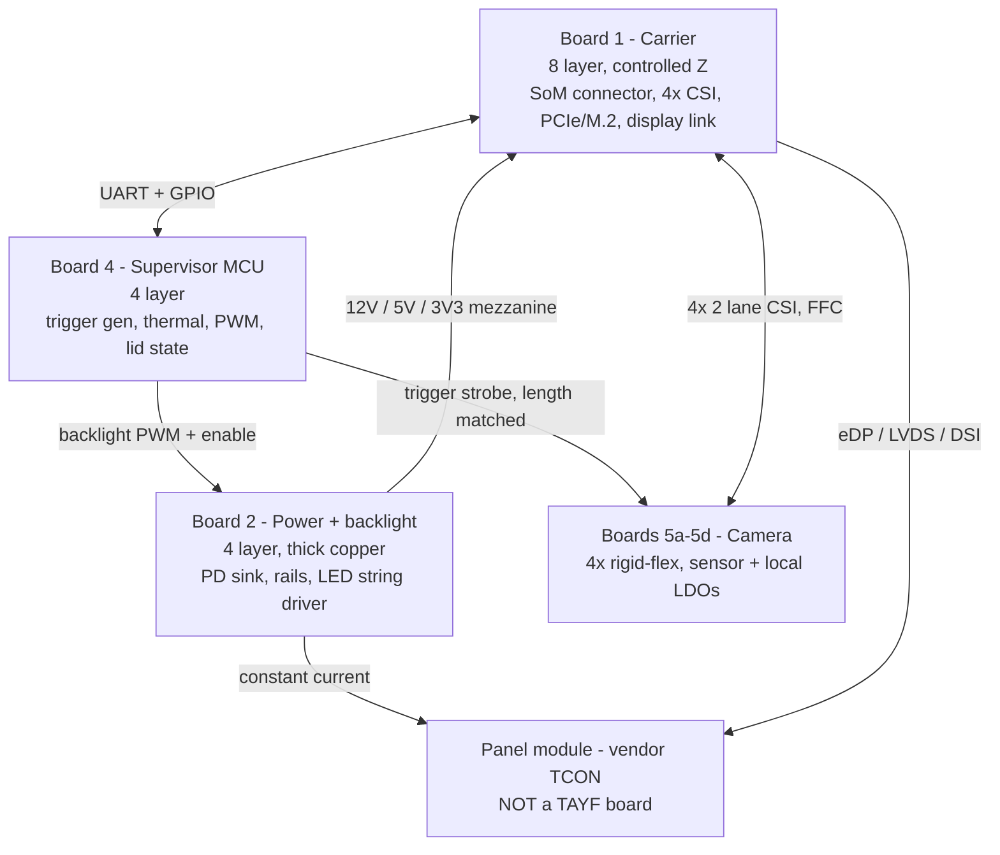

Doc 04's Board 3 (optical driver, 6-layer, HV, laser driver, modulator interface — *"the single biggest `[U-PN]` unknown"*) **does not exist in this architecture.** The panel arrives with its own timing controller; TAYF's obligation is a standard display link and a current source.

##### Interface budget

| Interface | Count | Rate / class | Note |
|---|---|---|---|
| MIPI-CSI-2, 2-lane | 4 | `1456×1088 px × 60 fps × 10 bit = 950 Mbps` each → **3.80 Gbps aggregate** | `[DERIVED, docs/04 §6.4]`. 100 Ω ±10 %, guarded with stitched ground |
| Display link | 1 | XGA: `1024×768×60×24 = 1.13 Gbps`; UXGA: **2.76 Gbps** | `[DERIVED]`. Highest-rate signal in the box; route on an inner layer between planes |
| SoM connector | 1 | 260-pin SO-DIMM class | `[UNVERIFIED]` footprint |
| Carrier ↔ power mezzanine | 1 | 40-pin, ≥ 3 A per rail pin group | — |
| Carrier ↔ MCU | 1 | UART + 4 GPIO + I²C | — |
| MCU → camera trigger | 1 → 4 | Series-terminated, matched to < 5 mm | Requirement is **inter-camera skew < 50 µs**; at 1 m/s hand speed that is 50 µm of motion, below the 0.54 mm/px sampling `[DERIVED, docs/04 §6.5]` |
| MCU → backlight | 1 | PWM + enable, fail-safe **off** | Thermal actuator |
| Backlight output | 1 | Constant-current LED string, up to ~48 V | The only elevated voltage in the device |
| M.2 M-key (NVMe) | 1 | 2242 | — |
| M.2 B-key (5G) | 1, optional | 3042/3052 | Off by default (§40.3.2) |
| Antennas | 2–4 | MHF4/U.FL to a non-metal window | — |
| Thermistors | 4 | Shell, SoM, panel rear, ambient | Was 6 in doc 04; the modulator and power-board channels go away |
| USB-C PD | 1 | Only external connector | — |

**Two numbers worth putting side by side.** The wire that carries a human being across the world runs at **0.162 Mbps** (`docs/01` §7.1, headers included). The wires inside the box run at **3.80 + 2.76 = 6.56 Gbps**. The ratio is **≈ 40,000 : 1** `[DERIVED]`. Every gigabit of that internal traffic exists to be thrown away — the CSI streams are consumed by estimators and discarded, and the display stream is regenerated locally from 868 bytes per frame. This is the architecture's central claim rendered as a signal-integrity problem.

##### Wiring across the fold — zero conductors

The retroreflector is passive. If every powered part stays in the base, **no conductor crosses either hinge.** In a folding consumer device the hinge flex is the canonical wear-out mechanism; deleting it removes the only credible failure mode a zero-moving-parts optical stack would otherwise have re-introduced.

> **Design ruling: all electronics, all cameras and the panel live in the base. The lid carries a sheet of retroreflective film and nothing else.** This survives contact with §40.3.1's gaze analysis only because gaze is corrected parametrically; if a future revision wants an on-axis camera behind a see-through retroreflector, it must also accept the first flex across the hinge, and that trade should be made explicitly.

---

#### Mechanical design

##### Stack-up by rung

| Rung | Optical mounting | Chassis | Assembly |
|---|---|---|---|
| V0 disc | Extrusion frame, fixed machined angle brackets, shimmed | None | Hand, iterative |
| V1 slab | Bonded plate seats in a folded-sheet or machined tray | Sheet aluminium | Hand |
| V2 folio | **Unresolved — see §40.5.3** | Aluminium/magnesium clamshell | Hand + a hinge-setting jig |
| V3 chair | Fixed seats in a furniture frame | Steel/ply frame, upholstered | Furniture assembly |

**Do not use printed plastic for optical seats past V0.** Printed polymers creep under bolt preload and move with humidity, and the failure is silent `[PUBLISHED, docs/04 §12.1]`. That ruling carries over unchanged; it is one of the few doc 04 mechanical results the architecture change does not touch.

##### The alignment tolerance, and why it is 30× looser than the rejected design

A plane mirror does not aberrate. A beamsplitter tilt of δ rotates the image *rigidly* by 2δ about the intersection of the old and new mirror planes; the image stays planar, stays in focus, stays the same size. **Beamsplitter angle sets image pose, not image quality.** `[DERIVED]`

Taking a 2 mm placement error at the top of a 211 mm image as the criterion `[ESTIMATE]`:

`δ ≤ 2 / (2 × 211) = 4.7 mrad = 0.27°` `[DERIVED]`

Against doc 04 §5.4's coherent engine, which required **0.67 mrad (0.038°)** on the pre-modulator fold mirror and forced an active-alignment station:

| Architecture | Tightest optical angular tolerance | Consequence |
|---|---|---|
| Coherent folded CGH engine | 0.67 mrad | Active alignment station, UV-bonded adjuster, unknown yield (`docs/04` §12.3, §17.6) |
| **AIRR** | **4.7 mrad** | **7× looser on the one critical plate; ~30× looser than the RSS-of-four-mirrors case.** A hard stop with a preloaded detent is in range for a consumer hinge |

The retroreflector's own angle is bounded by its acceptance cone (`[UNVERIFIED]`, but generous by construction), and the panel is bonded to the base. **Exactly one angle in the whole device is precision-critical, and it is the one the hinge must set.**

##### The three-surface fold for the portable unit is NOT designed

Stated plainly, because `docs/09` §3 flags it as a caveat and §7 lists it as action 2, and nothing has been done since:

**AIRR requires the panel, the beamsplitter and the retroreflector to hold a fixed relative geometry. Collapsing that into a book-sized hinge is real mechanical design work, and it has not been started.** There is no CAD model, no linkage synthesis, no hinge specification, no cycle-life target, and no prototype. What follows is a statement of the problem's shape and its known constraints — it is not a design.

What is now known, and therefore what the design must satisfy:

| # | Constraint | Source |
|---|---|---|
| 1 | **Two plates must rotate to two different angles from opposite ends of the base**: the retroreflector lid to ~90° at the back, the beamsplitter to **45.0°** hinged at the front lip | `[DERIVED]` §40.2.2 |
| 2 | Only the 45° matters. `±0.27°`, repeatable | `[DERIVED]` §40.5.2 |
| 3 | The beamsplitter is **299 mm long, 158 mm wide, ~0.35 kg of glass** — the heaviest and most fragile moving element | `[DERIVED]` §40.3.4 |
| 4 | It must lie flat when closed, and the closed footprint is already sized to it (300 mm), so it fits — **but the base is only 211 mm deep in panel, so the plate overhangs the electronics bay when closed** | `[DERIVED]` |
| 5 | Zero conductors cross either hinge | `[DERIVED]` §40.4.3 |
| 6 | A single user motion should set both angles, or the device is a two-handed assembly ritual and fails as a bag object | `[ESTIMATE]`, product judgement |

Three candidate mechanisms, none evaluated:

- **Four-bar linkage driving the beamsplitter off the lid.** One user motion, one hard stop, deterministic 45°. Cost: a linkage in the optical volume, and the linkage's own tolerance stack adds to the ±0.27°.
- **Independent beamsplitter strut with a detent.** Simplest, cheapest, most robust; two-handed to open.
- **Tensioned pellicle beamsplitter on a collapsing frame.** Attractive — a membrane has no second-surface ghost at all, deleting §40.2.3's 2.23 mm artifact and the AR-coat cost. **Probably disqualified on figure**: holding ≤ 1 mrad of slope over 299 mm on a stretched film means sub-0.1 mm sag, and film beamsplitters are also fragile in a bag. `[ESTIMATE]` — worth one bench test at V0 before it is abandoned, because the ghost saving is real.

**The one published source that would collapse most of this uncertainty is PMC12111977 (2025)** — an end-to-end integral-photography capture → MMAP aerial display of a human head **with measured misalignment tolerances**, the closest published analogue to this configuration `[UNVERIFIED — record-level only, full text not obtained; docs/02 §6.4]`. Its tolerance table would replace the `[ESTIMATE]` in §40.5.2's criterion with a measured number, which is the difference between specifying a hinge and guessing at one.

> **Honest status: V2 is the only rung in §40.9 whose core mechanism does not exist even on paper.** The ladder is ordered so that V0 and V1 return every optical and thermal number the fold design needs *before* anyone draws it.

---

#### Thermal

##### The corrected model

Sealed enclosure, natural convection plus radiation, `h = 8 W/m²K`, `ε = 0.9`, `T_amb = 25 °C`, per `docs/01` §5 and `docs/04` §3, with both of doc 04's corrections applied:

```
Q = h·A·ΔT + ε·σ·A·(T_s⁴ − T_amb⁴)
```

**Correction 1 — participating area.** Not six faces. The base sits on a desk (stagnant boundary layer, radiating into a surface at its own temperature) and the optical exit is not a radiator. Doc 04 §3.2 uses **5 faces**; for the slab and folio geometries below the participating area is accounted explicitly rather than by face count, because these are not cubes.

**Correction 2 — the touch limit is a safety limit.** IEC 62368-1 caps held or touched **metal at ≈ 48 °C** (glass/ceramic ≈ 51 °C, plastic ≈ 60 °C) `[UNVERIFIED — confirm against IEC 62368-1 Table 38 or the current equivalent clause]`. **A 60 °C metal shell is a safety violation, not a comfort complaint**, and every table row above 48 °C describes a device that cannot ship. The binding constraint is human skin, not silicon: at these loads the junction is comfortable while the hand is not, which is why "let it throttle" is not a solution — throttling protects the die.

At ΔT = 23 K (48 °C shell, 25 °C ambient), per unit area:

```
Q_conv/A = 8 × 23                                            = 184.0 W/m²
Q_rad/A  = 0.9 × 5.670e-8 × (321.15⁴ − 298.15⁴)
         = 0.9 × 5.670e-8 × 2.735e9                          = 139.5 W/m²
Q/A                                                          = 323.5 W/m²
```
`[DERIVED]` — and this reproduces doc 04 §3.4's cube figure exactly: `323.5 × 0.05 m² = ` **16.2 W at 100 mm on 5 faces.** Radiation is **43 %** of it.

##### The load, and what is not in it

| Load | Power | Tag |
|---|---|---|
| Edge SoM, Orin Nano 7 W profile | 7.0 W | `[PUBLISHED]` band; profile choice `[UNVERIFIED]` against TAYF's estimator load |
| Cameras, 4 × global shutter | 1.6 W | `[ESTIMATE]` 0.4 W each |
| Wi-Fi (5G would be +1.9 W) | 0.6 W | `[ESTIMATE]` |
| MCU, sensors, misc | 0.5 W | `[ESTIMATE]` |
| Sub-total | 9.7 W | |
| Conversion loss at 92 % | `9.7 × (1/0.92 − 1) = ` 0.84 W | `[DERIVED]` |
| **Common electronics load** | **10.5 W** | `[DERIVED]` |
| **Source panel** | **see §40.6.3** | `[DERIVED]` from `[ESTIMATE]` inputs |
| Modulator, laser, driver ASIC, scanners, transducers | **0 W — none present** | `[DERIVED, docs/09 §2]` |

##### Panel power — the only load that scales with the device

```
P_panel = [ L_image / (0.25·R_rr) ] × A_panel × π × k_APL / η_panel
```

Inputs: `R_rr = 0.7` `[ESTIMATE]`, average picture level `k_APL = 0.4` for a lit head on a dark field `[ESTIMATE]`, panel luminous efficacy `η_panel = 6 lm/W` (LED backlight at 100–150 lm/W through an LCD stack transmitting 4–8 %; range 4–12 lm/W) `[ESTIMATE — and this is the cheapest measurement in the project: one monitor, one plug-through wattmeter, one luminance meter]`.

This collapses to **`P_panel/A = 1.196 × L_image` W/m² per cd/m²** `[DERIVED]` — i.e. **66.9 W/m²** at the 55.7 cd/m² real-face floor and **239 W/m²** at the 200 cd/m² design target.

| Device | Panel area | P_panel @ 55.7 cd/m² | P_panel @ 200 cd/m² | @ 200 with polarisation recovery (÷4) |
|---|---|---|---|---|
| V0 disc, 500 mm dia | 0.196 m² | 13.1 W | 46.9 W | 11.7 W |
| V1 slab, 200 × 200 mm | 0.040 m² | 2.7 W | 9.6 W | 2.4 W |
| V2 folio, 158 × 211 mm | 0.033 m² | 2.2 W | 8.0 W | 2.0 W |
| V3 chair, 550 × 800 mm | 0.440 m² | 29.4 W | 105 W | 26.3 W |
| *(a hypothetical 100 mm AIRR cube)* | *0.010 m²* | *0.7 W* | *2.4 W* | *0.6 W* |

Two structural facts fall out:

1. **The panel is an area heat source coincident with the largest external face.** There is no hot spot, no spreading resistance to engineer, and **no vapor chamber** — doc 04's 24 cm³ "required, not optional" part is deleted. Only the SoM needs a local spreader, bonded to the electronics-bay wall.
2. **Panel load and heat rejection both scale with aperture area**, so the AIRR family is close to thermally scale-invariant. The fixed 10.5 W of electronics is what breaks the invariance, and it breaks it *at the small end* — the folio, not the chair, is the thermally hardest AIRR device.

##### Emissivity has a veto over industrial design

Linearised, radiation is 43 % of rejection at the touch limit and scales linearly with ε. At 48 °C:

| Finish | ε | Q/A | vs. anodised |
|---|---|---|---|
| Anodised, bead-blasted or painted | 0.9 `[UNVERIFIED — confirm per finish]` | **323.5 W/m²** | — |
| Polished or bare aluminium | 0.05 `[UNVERIFIED]` | `184.0 + 7.75 = ` **191.8 W/m²** | **−40.7 %** |

`[DERIVED]`. Note that `docs/01` §5.2 states the same fact as "a 69 % swing" (`323.5/191.8 = 1.69`, reading from polished up to anodised) while `docs/04` §3.3 states it as "40 %" (reading from anodised down). **They are the same number seen from opposite ends; there is no discrepancy.**

Applied to the folio (participating area with the base underside on the desk and the retroreflector's front face optical: **≈ 0.09 m²** `[ESTIMATE]`):

| Finish | Ceiling | Load @ 55.7 cd/m² (12.7 W) | Load @ 200 cd/m² (18.5 W) |
|---|---|---|---|
| Anodised, ε = 0.9 | 29.1 W | 2.3× margin — **PASS** | 1.57× margin — **PASS** |
| Polished, ε = 0.05 | 17.3 W | 1.36× margin — PASS | **18.5 W > 17.3 W — FAIL** |

> **The finish decision is the brightness decision.** A polished-aluminium folio cannot run at the design luminance. It can run at the "matches a real face" floor, and it can run at design luminance *if* §40.2.1's polarisation recovery works (which drops the load to 12.5 W). **One of the two must happen: anodise the shell, or solve the polarisation.** This is a thermal requirement with an aesthetic consequence, not an aesthetic choice with a thermal consequence — and it is now quantified rather than asserted.

##### Headroom against the rejected architectures

Evaluated at the 100 mm cube where every one of these was assessed, so the comparison is like-for-like: ceiling **16.2 W**, common electronics **10.5 W**, leaving **5.7 W for the engine.**

| Architecture | Engine electrical load | Fraction of the 5.7 W allowance | Verdict |
|---|---|---|---|
| **AIRR (this design)** | **0 W optics + 0.7 W panel** | **0.12×** | **PASS with 5.0 W spare** |
| Pepper's ghost (one splitter pass) | 0 W optics + 0.3 W panel | 0.06× | PASS — but virtual image, fails rule 4 (`docs/09` §3) |
| Holographic CGH | SLM backplane + driver 3–5 W, illumination 1–2 W → **4–7 W** | 0.7–1.2× | **Marginal to failing** — before the CGH compute, which is workstation-GPU-class (`docs/02` §9.2) and pushes the SoC well past 7 W |
| Laser-plasma, sparse wireframe head | **3.6–36 W** | 0.6–6.3× | Marginal at the optimistic bound, **6× over** at the pessimistic one |
| Laser-plasma, dense point cloud | 36–360 W | 6–63× | Dead |
| Laser-plasma, eye resolution | **533 W – 5.3 kW** | **94–930×** | Dead. No laser efficiency improvement closes 250× |
| MATD acoustic trapping, 512 channels | `512 × 0.03–0.1 W = ` **15–51 W** + FPGA | 2.7–9× | Over the *entire device* budget, and unmeasured |
| Swept volume | Rotor + motor | — | `[UNVERIFIED]` — no figure exists in this repo |

Engine-load sources: laser-plasma `[DERIVED, docs/01 §4.7]`; holographic `[ESTIMATE, docs/04 §3.5]` with CGH compute `[PUBLISHED, docs/02 §9.2]`; MATD per-channel figure `[ESTIMATE, docs/08 §9.4]`.

> **Quantified headline: the AIRR optical engine consumes 12 % of the thermal allowance that every other candidate architecture exceeded, and that 12 % is a display panel rather than an engine.** The nearest competitor overruns by 0.7–1.2×; the north-star candidates overrun by 6–930×.
>
> **The reframing that matters:** thermal was ranked risk #1 in `docs/01` §13 and was "the binding constraint" in `docs/04`. **It is not binding on the selected architecture.** Had the aperture law not moved the form factor for *optical* reasons, AIRR would have been the first architecture in this project to close the 10 cm thermal budget — with 5 W to spare. The 10 cm cube was abandoned because a 100 mm aperture shows a 100 mm image (`docs/09` §1), not because it got hot.

##### Per-device thermal summary

| Device | Participating area | Ceiling @ ε=0.9 | Load @ floor | Load @ target | Margin @ target |
|---|---|---|---|---|---|
| V0 disc (bench, mains, open frame) | ~0.38 m² `[ESTIMATE]` | 124 W | 13.1 W (panel only) | 46.9 W | 2.6× |
| V1 slab 200×200×100 | 0.12 m² `[DERIVED]` | 38.9 W | 13.2 W | 20.1 W | 1.9× |
| V2 folio, open | 0.09 m² `[ESTIMATE]` | 29.1 W | 12.7 W | 18.5 W | 1.57× (0.94× if polished — FAIL) |
| V3 chair | ~0.9 m² `[ESTIMATE]`, **less whatever upholstery covers** | 301 W nominal | 39.9 W | 116 W | 2.6× nominal |

**V3's caveat is not the number, it is the fabric.** A chair back is upholstered, and upholstery is an insulator over the largest available radiating surface. The chair's real participating area is the glass aperture plus any uncovered structure, and **the thermal design of V3 is an upholstery-layout problem** — 116 W at design luminance is trivial for 0.9 m² of bare metal and impossible for 0.9 m² of foam and fabric. `[ESTIMATE]` — this is a V3 design task with no work done.

**Actuator ladder** (MCU-owned thermal state machine, per `docs/04` §3.9's requirement, retargeted): reduce panel luminance via ALS-aware dimming → drop panel refresh → drop body-estimator rate before face rate (`docs/03` §3: face carries the perceptual weight and has 5× headroom) → drop camera count → 5G to Wi-Fi. **Panel dimming first, because it is the only load that is both large and continuously variable, and because §40.2.4's veiling glare means the required luminance already tracks ambient.**

---

#### Bill of materials

**Every price and availability line in this section is `[UNVERIFIED]`. The vendor sourcing pass was never completed** (`hardware/bom.md`; `docs/04` §13 records that it was killed mid-run and produced nothing). **Nothing here may be ordered, quoted, or cited as a cost figure.** What is defensible is the class, the requirement, and the reason.

| # | Class | Candidate / spec | Qty per device | Key spec to confirm | Price & availability |
|---|---|---|---|---|---|
| 1 | **Retroreflector sheet or plate** | Prismatic sheeting, bead sheeting, or DCRA/ASKA3D-class plate; area = image area | 1 | **R_rr, polarisation preservation, cell pitch/LSF, acceptance angle** (§40.3.5) | `[UNVERIFIED]` — **no quote, no MOQ, no lead time. Expected #1 cost driver at every size above the folio; cost scales with area (`docs/09` §3)** |
| 2 | **Source panel** | 10.4″ 4:3 portrait (V2); 8–10″ industrial IPS ≥1000 cd/m² (V1); 43″-class commodity (V0); ~38″ portrait (V3) | 1 | Active area, luminance, efficacy in lm/W, interface, dimming method, front-surface gloss | `[UNVERIFIED]` — panel-only availability vs. whole-monitor is itself unknown |
| 3 | **Beamsplitter plate** | 2–3 mm float/borosilicate, 50/50 front surface, **AR rear or wedged 0.5–1°** | 1 | Split ratio flatness, slope error, coating durability | `[UNVERIFIED]` — custom size, expect tooling/minimum charges |
| 3b | *Polarising variant* | Wire-grid/reflective-polariser film on glass + λ/4 retarder | 1 set | Extinction, retardance uniformity over area | `[UNVERIFIED]` — **gated on BOM item 1's polarisation measurement** |
| 4 | **Edge SoM** | Jetson Orin Nano 8 GB; Orin NX; RK3588; + optional Hailo-8L-class M.2 NPU | 1 | Real power at TAYF's estimator load; CSI lane configuration | `[UNVERIFIED]` |
| 5 | **Global-shutter camera modules** | IMX296 / IMX297 / IMX568 / AR0234CS class + 6 mm M12 | 4 | Pixel size, lane count, external-trigger latency and jitter | `[UNVERIFIED]` |
| 6 | **Carrier PCB** | 8-layer, controlled impedance | 1 | — | `[UNVERIFIED]` — NRE dominates at prototype quantities |
| 7 | **Power + backlight PCB** | 4-layer, thick copper, PD sink + rails + LED string driver | 1 | Converter efficiency at the actual operating point (**a thermal spec**) | `[UNVERIFIED]` |
| 8 | **Supervisor MCU PCB** | 4-layer, STM32G4/H7 or RP2350 class | 1 | — | `[UNVERIFIED]` |
| 9 | **Camera flexes** | 4 × rigid-flex, sensor + local LDOs | 4 | Static bend radius | `[UNVERIFIED]` |
| 10 | **Radio** | Wi-Fi/BT M.2 or on-carrier; optional sub-6 5G M.2 | 1–2 | CAMARA QoD carrier support (5G only) | `[UNVERIFIED]` |
| 11 | **Storage** | M.2 2242 NVMe ≥ 256 GB | 1 | — | `[UNVERIFIED]` |
| 12 | **USB-PD sink controller** | TPS25750 / CYPD / STUSB class | 1 | 20 V negotiation | `[UNVERIFIED]` |
| 13 | **Sensors** | ALS (I²C), IMU, 4 × thermistor, lid Hall/reed | 1 set | — | `[UNVERIFIED]` |
| 14 | **Enclosure** | Machined or folded aluminium; **anodised/blasted/painted, ε ≥ 0.85** | 1 | Finish emissivity — **this is a thermal spec (§40.6.4)** | `[UNVERIFIED]` |
| 15 | **Hinge / linkage (V2 only)** | Four-bar or detented strut, ±0.27° repeatable | 1 | Cycle life, angular repeatability after N cycles | `[UNVERIFIED]` — **no design exists (§40.5.3)** |
| 16 | **Cover glass / front window** | AR both faces, scratch-dig 40-20 | 1 | — | `[UNVERIFIED]` |
| 17 | **Local spreader + TIM** | Graphite or copper foil, SoM to bay wall; phase-change or pad TIM | 1 | Controlled thickness | `[UNVERIFIED]` |
| — | ~~Vapor chamber~~ | **Deleted** (§40.6.3) | 0 | — | — |
| — | ~~SLM, laser diodes, PBS, fold mirrors, interlock, photodiode, laser driver, desiccant~~ | **Deleted** (§40.0) | 0 | — | — |

**Cost-driver rank, by expectation and with no figures attached** `[ESTIMATE]`: (1) retroreflector, (2) source panel at the larger apertures, (3) custom beamsplitter with coating, (4) SoM, (5) PCB NRE at prototype volumes, (6) enclosure machining. **Items 1 and 3 have no known supplier relationship of any kind**, and item 1 has no measured performance. That is the BOM's actual state.

---

#### What safety looks like when there is no laser

Recorded because it is the largest deletion in the document and it should not be mistaken for an oversight.

| Hazard | Coherent-engine design | AIRR |
|---|---|---|
| Accessible laser emission | Class 3B source, single-fault analysis mandatory **before power-on**, MCU interlock + monitor photodiode + shutter (`docs/04` §4.5) | **None.** No source above indicator level |
| Retinal MPE | 480× margin nominal, **135× over limit in a zero-order fault** (`docs/01` §4.8) | **Not applicable.** A display panel at ≤ 1200 cd/m² is a display panel |
| Plasma / ionisation | Class 4 enclosure, gaze gating | None |
| High-intensity ultrasound | MATD track | None |
| **Touch temperature** | 48 °C metal | **48 °C metal — this is now the only physical hazard in the device** `[UNVERIFIED — IEC 62368-1 clause]` |
| Glass | — | **New**: 0.35 kg of glass on a hinge in a bag. Laminated or chemically strengthened substrate, or a polymer beamsplitter if the figure allows `[ESTIMATE]` |
| Mains (V3) | — | **New**: furniture-integrated mains needs full IEC 62368-1 compliance testing, a real cost and lead time `[UNVERIFIED]` |

`docs/09` §2's claim — *"rule 10 is satisfied by construction rather than by engineering controls"* — is upheld by this table with two additions: glass in a portable, and mains in furniture.

---

#### The build ladder

Ordered so that **the cheapest rung answers the questions the expensive rungs depend on**, and so that the one undesigned mechanism (§40.5.3) is attempted only after every optical and thermal input to it has been measured.

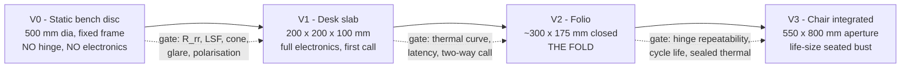

##### V0 — static bench disc

**`docs/09` design 03: 500 mm aperture, 120 mm depth, life-size head and shoulders.** Fixed frame, bolted angles, mains power, a lab PC driving a commodity 43″-class panel. **No hinge, no SoC, no cameras, no network, no enclosure, no thermal constraint.** This rung exists to convert §40.3.5's five unknown retroreflector specs and §40.6.3's efficacy estimate into measurements.

*Cost note:* the optical measurements below are scale-invariant (efficiency, LSF, cone, glare and polarisation are per-area or angular properties), so **a ~150 mm pilot plate should be bought and measured before the 500 mm retroreflector is ordered.** The retroreflector is the BOM's dominant unknown *and* its cost scales with area; de-risking it at 1/11 of the area is the single cheapest decision in the ladder.

**What it proves**

- End-to-end optical efficiency against the derived `0.25·R_rr` ceiling → yields **R_rr**.
- **Polarisation preservation** of the retroreflector — rotating analyser, one afternoon. Decides whether §40.2.1's 4× panel-power lever exists.
- Line-spread function of the retroreflector, from a slanted-edge or bar target displayed on the panel → decides whether eye and mouth features survive, and caps useful panel resolution.
- Viewing cone, sampled with a calibrated camera on a rotation stage; and the **upper angular bound** at which the panel becomes directly visible past the beamsplitter (§40.2, stray path).
- Ambient veiling glare vs. room illuminance → validates or refutes §40.2.4's 8.3 cd/m² upper bound.
- Second-surface ghost separation against the derived 2.23 mm, and whether AR or wedge is required.
- **Panel luminous efficacy in lm/W**, from a wattmeter and a luminance meter — replaces the `[ESTIMATE]` that every thermal number in §40.6 rests on.
- Pellicle feasibility, if a film sample is on hand (§40.5.3).

**Go/no-go to V1**

| Criterion | Threshold | Rationale |
|---|---|---|
| Measured end-to-end efficiency | ≥ 0.15 (i.e. `R_rr ≥ 0.6`) | Below this, panel power in §40.6.3 rises past every margin in the table |
| Aerial image luminance | ≥ **55.7 cd/m²** at 500 lux ambient | `docs/02` §7.1's "matches a real face" floor — the minimum defensible claim |
| Resolvable feature at 0.6 m | ≤ 1 mm | Eyes and mouth must be features, not blobs |
| Viewing cone | ≥ ±15° in both axes with the image intact | `docs/09` §3 predicts ±20–30°; below ±15° a seated conversation breaks |
| Ambient veiling glare | Image-to-veil contrast ≥ 5:1 at 500 lux | Below this the device only works in a dim room, which changes the product |
| **Real-image proof** | **A photodiode placed in mid-air at the image plane registers light; moved ±20 mm along the axis it does not** | The objective, five-dollar demonstration that the image is real and free-space rather than virtual. Log the trace |
| Polarisation result | Recorded either way | Not a pass/fail — it is an input to V2's power budget and to BOM item 3b |

**No-go handling.** If the LSF fails at every available retroreflector grade, the family survives only at larger viewing distances (the LSF requirement relaxes linearly with `a`), which pushes toward V3 and away from V2 — a re-scope, not a failure. If efficiency lands below 0.10, the polarising variant becomes mandatory rather than optional and V1 waits for it.

**Test equipment**

| Instrument | Requirement | Why this requirement |
|---|---|---|
| **Spot luminance meter** | 0.1–1000 cd/m², ≤ 1° acceptance | Every photometric gate above is in cd/m². **A lux meter cannot do this** — lux is incident illuminance on a surface, and the aerial image has no surface to put a meter against (`docs/04` §15.1) |
| **Lux meter** | 1–10,000 lux | Separately required, to characterise the ambient the image competes with |
| **Calibrated camera + motorised rotation stage** | Global shutter, known intrinsics, linear response; ≤ 0.5° step, ≥ ±30° travel | Cone and uniformity sweeps; hand-sampling is slow and unrepeatable |
| **Rotating linear polariser + λ/4 retarder** | Any lab-grade pair | The polarisation experiment. Tens of dollars, 4× of panel power |
| **Slanted-edge / bar targets** | Displayed on the panel itself | Free; the source is a display, so the test chart is software |
| **Plug-through or DC power meter** | ≥ 1 Hz logging | Panel efficacy measurement |
| **Photodiode + transimpedance amp** | Any | The mid-air real-image proof; later reused for the V1 latency rig |
| **Dark room with dimmable ambient** | 0–500 lux, measured | Glare and contrast gates are meaningless without a stated ambient |
| **Not required** | Laser goggles, beam profiler, autocollimator, interferometer, CMM | There is no laser and no precision-optics alignment at this rung |

##### V1 — desk slab, 200 × 200 × 100 mm

**Aperture 200 mm → aerial image 200 mm wide × ~141 mm tall** (the √2 tax applies to the fold axis; a 200 mm-deep base yields a 141 mm image height, or the base grows to 283 mm for a full 200 mm image). Image-in-front mode, `W_image ≤ D_aperture`. First rung with the full electronics stack: SoM, four cameras, radio, power, MCU.

**What it proves**

- **The thermal curve, instrumented.** Measured per-block power replacing six `[ESTIMATE]` line items in §40.6.2, and measured shell temperature against the 38.9 W ceiling. **This is the most schedule-critical output of the rung**, exactly as it was in doc 04 §14.2, and it is now measuring a design that should pass with 1.9× margin rather than one that fails by 1.9×.
- **Whether the estimator stack runs at rate on embedded silicon** — the largest surviving compute risk (§40.3.2).
- Four-camera hardware sync, CSI ingest at 3.80 Gbps, and camera intrinsics/extrinsics calibration.
- **Photon-to-photon latency**, against the recomputed 63–152 ms budget.
- Two-way cube-to-cube session over a live network.
- Gaze correction: whether a 12° off-axis camera still yields a correctly-aimed rendered gaze (§40.3.1).

**Go/no-go to V2**

| Criterion | Threshold |
|---|---|
| Optical performance vs. V0 | Within 15 % on efficiency, LSF and cone after integration into a real chassis |
| Measured total system power, per block | **Recorded with a breakdown. Measurement gate, not a performance gate** |
| Sealed 20-minute run | Shell ≤ 48 °C at design luminance, no throttle event |
| Measured panel efficacy | Within 30 % of the 6 lm/W `[ESTIMATE]` — outside that, re-derive §40.6.3 and the folio margins |
| Four-camera sync skew | < 50 µs, verified on a scope |
| CSI ingest | 4 × 60 fps sustained, no dropped frames |
| End-to-end latency | < 150 ms photon-to-photon with the panel in the loop |
| Two-way call | ≥ 10 minutes continuous, recognisable person |
| Estimator rate on the SoM | ≥ 30 fps sustained for the full stack, or the degradation ladder documented with measured timings |

**No-go handling.** If measured power exceeds 25 W in a 38.9 W enclosure the margin is still real and V2 proceeds; **if it exceeds 29 W, the folio fails on §40.6.4's polished/anodised table and the finish decision is forced before V2's industrial design starts.** If the estimator stack cannot hold 30 fps, that is doc 04 §3.10 Option 2 (discrete NPU) becoming mandatory — a compute decision, not an optical one, and V2 waits for it.

**Test equipment added at this rung**

| Instrument | Requirement | Why |
|---|---|---|
| **Thermal camera** | ≥ 160 × 120, ≤ 0.1 °C NETD, adjustable emissivity | §40.6 validation. **Critical: a metal shell at ε ≈ 0.05 reads ~20 K wrong.** Apply ε ≈ 0.95 tape patches at every measurement point and set the camera to match, or trust nothing it shows on bare metal (`docs/04` §15.2) |
| **Thermocouple datalogger** | 8–16 ch, K-type, ≥ 1 Hz | The numbers that go in the notebook; the camera finds hot spots, thermocouples measure |
| **Inline USB-PD power meter** | 0–100 W, ≥ 10 Hz logging | Total system power over the full run |
| **Per-rail current probes / shunt monitors** | ≥ 0.1 % | Panel vs. SoM vs. conversion — total power alone does not say which is the problem |
| **4-channel oscilloscope** | ≥ 200 MHz, ≥ 1 GSa/s | Camera sync verification; four channels is why the count is four |
| **Photon-to-photon latency rig** | LED in the capture volume, photodiode **at the aerial image plane**, both on one time base | The only way to measure true end-to-end latency without trusting two clocks. Here the photodiode sits in mid-air — the same fixture as V0's real-image proof |
| **ChArUco / checkerboard targets** | Multiple sizes, flat to ≤ 0.1 mm | Camera intrinsics and extrinsics |
| **Network emulator + packet capture** | Configurable latency/jitter/loss | Transport validation under degraded conditions |

##### V2 — A4-class folio, with the fold

**Closed ≈ 300 × 175 × 35–70 mm; image 158 × 211 mm — a head at ~92 % of life size** (§40.2.2). This is the rung that requires the mechanism that does not exist. Two units, because the product is symmetric by H2.

**What it proves**

- **The three-surface fold** (§40.5.3): a linkage or strut that repeats 45.0° ± 0.27°, over cycle life, with 0.35 kg of glass and zero conductors crossing the hinge.
- Whether the aerial image survives being set up by a user rather than a technician.
- Sealed thermal at the tightest area-to-load ratio in the family, at the finish chosen in §40.6.4.
- Transport survivability: a bag object containing a large thin glass plate.
- Battery decision, now that ~275 cm³ of bay exists.

**Go/no-go to V3**

| Criterion | Threshold |
|---|---|
| Hinge angular repeatability | **±0.27° over ≥ 5,000 open/close cycles**, measured, no adjustment |
| Image position repeatability | ≤ 2 mm at the top of the image, cold and after a 20-minute run |
| One-motion setup | A first-time user opens it and gets an image without instruction, ≥ 8/10 attempts `[ESTIMATE — protocol not written]` |
| Sealed 20-minute run | Shell ≤ 48 °C at declared luminance, with the shipped finish |
| Thermal margin | Measured load ≤ 0.8 × the measured ceiling for the chosen finish |
| Two-unit symmetry | Both units pass identically, same procedure, no rework |
| Transport | Survives a documented drop/vibration protocol with the beamsplitter intact `[ESTIMATE — protocol not written]` |
| Acoustics | Silent by construction (no fan). If a fan appears, ≤ 25 dBA at 0.5 m and the zero-moving-parts claim is withdrawn in writing |

**No-go handling.** If no linkage holds ±0.27° at acceptable cost, the fallbacks in order are: (a) a detented strut and a two-handed opening ritual, (b) a rigid non-folding desk object at the same aperture — which is V1 with a nicer shell and remains a shippable product, (c) skip to V3, where nothing folds. **The folio is the only rung whose failure does not threaten the family.**

**Test equipment added**

| Instrument | Requirement | Why |
|---|---|---|
| **Laser lever-arm goniometer** | A laser diode module, a 3 m throw, a scale on the wall | Bounce a beam off the beamsplitter: 2δ × 3000 mm, so **±1 mm read = ±0.0095°**. This resolves the ±0.27° hinge spec 28× over and costs nothing. It is the correct instrument here, not an autocollimator |
| **Motorised hinge cycle fixture** | 5,000–10,000 cycles, logging angle each cycle | Repeatability is a life spec, not a build spec |
| **Environmental chamber or controlled warm room** | 15–40 °C | Thermal-drift measurement needs a controlled ambient, not "the lab in August" |
| **Drop / vibration fixture** | Documented protocol | Glass in a bag |
| **Sound level meter** | Class 2, A-weighted, ≥ 20 dBA floor | Only if a fan is ever fitted; measure and report the empty-room floor first or the number is meaningless |

##### V3 — chair-integrated

**`docs/09`-class design: 550 × 800 mm aperture in a chair back, ~90 mm deep, life-size seated upper body, image-in-front mode.** This is the closest any buildable device comes to `thedream.md` — a person appearing *in the chair* — and it is the rung where the aperture law is finally paying rather than costing, because the aperture is furniture that was already going to be that size.

**What it proves**

- The largest aperture in the family, and therefore the retroreflector cost curve at scale.
- Thermal through upholstery (§40.6.6) — the rung's genuine engineering problem.
- Mains-powered compliance and furniture safety.
- Whether a life-size seated bust at a fixed image plane reads as presence. This is the perceptual question `docs/01` §10 leaves unquantified as Ψ, and it cannot be answered at smaller apertures.

**Acceptance criteria (final gate)**

| Criterion | Threshold |
|---|---|
| Sustained surface temperature | ≤ 48 °C metal, ≤ 60 °C plastic, **and every fabric-covered surface below the fabric's rated continuous temperature** `[UNVERIFIED — no fabric spec exists]` |
| Sustained call | ≥ 30 minutes at declared luminance with no user-visible degradation event |
| Image luminance | ≥ 100 cd/m² across the aperture, uniformity within ±20 %, no view-to-view step > 10 % |
| Viewing zone | The measured cone contains a seated viewer at 1.0–2.0 m with ±0.3 m lateral freedom |
| Acoustics | Silent — sealed, no moving parts, no fan |
| Mains safety | IEC 62368-1 compliance testing passed by an accredited lab |
| Stability | Furniture tip/stability testing passed |
| Perceptual | `experiments/perceptual-quality/` protocol run: no significant regression vs. V2, and the flat-2D-vs-aerial condition measured at least once |

**Test equipment added:** accredited safety and EMC testing (contracted, not bought); furniture stability rig; a large-area luminance-uniformity method (imaging photometer or a mapped spot-meter raster).

---

#### What this section does not resolve

Stated explicitly so nothing above is mistaken for a settled question.

1. **The three-surface fold (§40.5.3).** No linkage, no CAD, no hinge spec, no cycle-life target. The constraints are now bounded and the tolerance is 30× looser than the rejected architecture, which makes it credible mechanical work — but it is work that has not been done.
2. **The retroreflector, in five specs and one supplier relationship (§40.3.5).** No part, no measurement, no quote. **This is the largest open item in the section**: two of the five unknowns — retroreflectance and polarisation preservation — swing source-panel power by 4×, which is exactly the difference between the folio closing thermally at design luminance with a polished shell and failing (§40.6.4). Both are measurable in one afternoon at V0 with equipment that costs less than the plate.
3. **The AIRR primary literature remains unread** (`docs/09` §3, §7 action 1). Every quantitative optical figure here is derived from mechanism, not verified against measurement. Four named sources would each close a specific gap: the LSF model (DOI 10.1007/s10043-026-01034-w), the differentiable renderer for pre-distortion (10.1007/s10043-026-01038-6), MMAP ghost/chromatic suppression (10.3390/jimaging11030075), and **PMC12111977's measured misalignment tolerances, which is the hinge specification** (§40.5.3). All `[UNVERIFIED — record-level only]`.
4. **Panel luminous efficacy**, on which every watt in §40.6 depends, is a 6 lm/W `[ESTIMATE]`. One monitor, one wattmeter, one luminance meter.
5. **Whether the estimator stack runs at rate on embedded silicon** — unchanged from `docs/04` §17.4, and now the dominant compute risk because the optical compute that used to dwarf it has been deleted.
6. **Every price and availability line in §40.7.** The vendor pass has still never been run. This section makes it more tractable by naming exactly what to confirm and what each number changes; it does not substitute for it.
7. **V3's upholstery thermal design** (§40.6.6) — 116 W over bare metal is trivial and over foam is impossible, and nobody has drawn where the fabric goes.
8. **The perceptual question.** A real image at a fixed plane has correct absolute depth and vergence but **no motion parallax within the image** — it is a flat picture floating in air. Whether that reads as presence is unmeasured, and it is the one thing no amount of hardware engineering in this section can decide. (A light-field panel as the AIRR source would restore parallax within the retroreflector's angular acceptance — a real future lever, entirely unevaluated.)

---

## 8. Software architecture and the app

**Scope.** Everything between the photons entering the capture sensors and the frames leaving for the optical engine, plus the phone app that configures it and the simulation suite that validates it. The optical mechanism itself is out of scope here by construction — §50.7 is the argument for why that boundary must be enforced in code, not just in prose.

**Reading rule.** Confidence tags are per-claim. `[MEASURED]` in this section means measured *on this machine, today* unless a paper is named; `[PUBLISHED]` names the arXiv ID or part; `[DERIVED]` shows the formula; `[ESTIMATE]` is engineering judgement; `[UNVERIFIED]` states what would settle it.

---

#### The honest inventory: what code exists

Before any architecture diagram, the current state, because the gap between the specification and the implementation is the single largest fact about TAYF's software.

| Path | Lines | Runs? | Role |
|---|---|---|---|
| `pipeline/schema.py` | **58** | yes | The wire contract. **The entire runtime pipeline implementation.** |
| `pipeline/requirements.txt` | 25 | — | Dependency declaration; never installed on this machine |
| `pipeline/{capture,avatar,view_synthesis,transport}/README.md` | 4 files | — | Specification only — **zero lines of implementation** |
| `agent/nac_client.py` | 79 | no (needs `NAC_TOKEN`) | CAMARA QoD / Congestion Insights call patterns |
| `simulation/s1_waveoptics/propagate.py` | 257 | **yes** | Angular-spectrum propagator + gate-G1 validation suite |
| `simulation/s1_waveoptics/s1_5_tracked_vs_broadcast.py` | 263 | **yes** | The tracked-vs-broadcast kill-shot experiment |
| `simulation/s3_thermal/thermal_sweep.py` | 279 | **yes** | Lumped thermal model, edge-length sweep |
| `models/build_models.py` + `render_png.py` | 646 + 227 | **yes** | True-scale geometry for the six device forms; dependency-free renderer + `viewer.html` |
| `eng/**` (9 files) | ~1,361 | yes | Acoustic-trap (MATD) track — superseded as the engine choice, retained as analysis |
| `research/arxiv/*.py` (4 files) | — | yes | Corpus builders. **`research/METHODOLOGY.md` §1: these are keyword-cluster based; a negative result from them is evidence about the corpus, not the world.** |

[MEASURED] — `wc -l` and `find` over the working tree, 2026-08-16. Total hand-written Python outside `research/arxiv/`: **~3,170 lines, of which 58 are the deployable runtime.**

Three consequences that shape everything below:

1. **The pipeline is a specification, not a codebase.** `pipeline/capture/`, `avatar/`, `view_synthesis/` and `transport/` each contain a README and nothing else. Every fps, latency and bandwidth figure attributed to the pipeline is [PUBLISHED] from Mon3tr (arXiv 2601.07518) or [ESTIMATE], never [MEASURED] here.
2. **`aiortc`, `lz4` and `gsplat` are not installed** — `importlib.metadata` reports them absent; only `numpy 1.26.4` and `torch 2.9.1` are present [MEASURED]. `requirements.txt` has never been exercised, so it is a wish list whose resolvability is [UNVERIFIED].
3. **The code that does run is the code that falsifies things.** `simulation/` is the only part of the repo that has ever changed a claim in `docs/01`. That ratio is correct for this phase (`docs/07` §1) and should be preserved until hardware arrives.

---

#### Module map

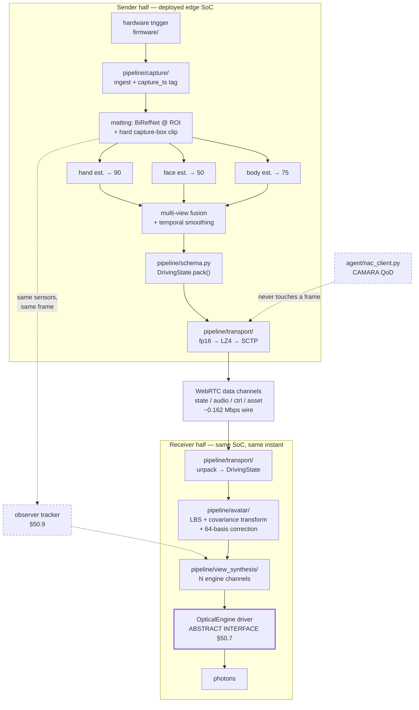

**Ownership table — what each module may and may not do.** These are enforceable review rules, not descriptions.

| Module | Owns | Must never |
|---|---|---|
| `firmware/` | Trigger strobe, sensor bring-up, one monotonic `capture_ts` per frame *set* | Emit per-sensor arrival timestamps as `capture_ts` (`docs/03` §1.4: free-running sensors are ~4 ms mean / 8.3 ms worst-case apart ⇒ ~8 mm of hand travel at 1 m/s) [PUBLISHED, docs/03 §1.4 arithmetic] |
| `pipeline/capture/` | Matting, three estimators, fusion, emit `DrivingState` | Know anything about the network, the display, or the far end |
| `pipeline/transport/` | pack/compress/send/receive/decompress/unpack; expose one *"conditions degrading"* signal | Decide when to request a QoD session — that is `agent/`'s job (`docs/03` §8.6, strict separation) |
| `agent/` | CAMARA QoD / Congestion Insights / slicing decisions | Touch a media frame. `agent/compliance.md` further binds its LLM brain to Gemini 2.5 or Groq-hosted models, no MCP — **so no LLM may sit in the transport loop** |
| `pipeline/avatar/` | Enrollment (offline) + per-frame animation of the cached canonical avatar | Run a neural network in the per-frame path (`docs/03` §4.3, HUGS: bake offline, animate with arithmetic online) |
| `pipeline/view_synthesis/` | Map the animated 3D avatar onto exactly the N channels the engine can emit | Assume a specific optical mechanism |
| optical driver | Engine-specific bytes | Leak engine specifics upward past the interface in §50.7 |

**The symmetry requirement (H2, `docs/01` §1.1) is a software statement, not just a hardware one:** every module above runs on both cubes, in both directions, on the same SoC, concurrently. Any design that works only as "sender" or only as "receiver" is wrong by construction.

---

#### `pipeline/schema.py::DrivingState` — the one shared contract

Normative. Both endpoints **import** this module; neither redefines the packet shape. The file says so in its own docstring, and `docs/01` §7.1 and `docs/03` §8.1 both point at it as the single source of truth.

```
BODY_POSE_DIM        = 75    # SMPL-family joint rotations (rig-space, see below)
FACE_EXPRESSION_DIM  = 50    # blendshape / expression coefficients
HAND_POSE_DIM        = 90    # 45 per hand, MANO-style, both hands
TOTAL_DIM            = 215
_PACK_FMT            = "<215f d"      # little-endian, 215 × float32 + float64 timestamp
PACKED_SIZE_BYTES    = 868            # 215×4 + 8
```

[MEASURED] Executed 2026-08-16: `TOTAL_DIM == 215`, `struct.calcsize("<215f d") == 868`, `len(DrivingState().pack()) == 868`. The dataclass validates all three dimensions in `__post_init__` and raises `ValueError` on mismatch — a cheap, correct guard that should be preserved when the estimators are wired in.

**Bitrate arithmetic, recomputed from the file rather than quoted** [DERIVED]:

| Encoding | Bytes/frame | @60 fps | Note |
|---|---|---|---|
| fp32 payload only (215×4) | 860 | 0.4128 Mbps | |
| fp32 as `schema.py` actually packs it (+fp64 ts) | **868** | **0.41664 Mbps** | verified by execution |
| fp16 cast (215×2) | 430 | 0.2064 Mbps | |
| fp16 + LZ4 (~0.6× ratio, `docs/03` §8.2) | ~258 | ~0.124 Mbps | **payload only — do not quote this as the wire rate** |
| + SCTP/DTLS/UDP/IP headers (~80 B/datagram) | ~338 | **~0.162 Mbps** | the number to use |

The last row is why Mon3tr reports "<0.2 Mbps" rather than 0.124 [PUBLISHED, arXiv 2601.07518 via `docs/03` §8.2]. Headers are ~24% of the wire cost at 60 packets/s because the payload is tiny — the classic small-packet regime.

**What the schema deliberately does not carry, and why that is a latent bug:**

`DrivingState` is 215 anonymous floats. It encodes no rig identity, no joint ordering, no rotation convention. Nothing in the struct prevents Cube A packing Anny-ordered axis-angle rotations and Cube B unpacking them as MHR-ordered 6D — every packet parses, and the far end renders a person whose elbows bend backwards. The defence is the `ctrl`-channel `HELLO` negotiation in `docs/03` §12.1 (`schema_version`, `rig_id`, `dims`, `rotation_convention`, `fps`, `avatar_hash`, `region_mask`, `caps`), and a mismatch must be **fatal to the session, never reinterpreted**. [DERIVED from the schema's own field set; the negotiation itself is specified but unimplemented — [UNVERIFIED] until `ctrl` exists.]

**Two implementation traps recorded before code is written:**

1. **fp16 and global translation.** fp16's quantization step at 10 m is ~10 mm — visible drift. If the 75-dim body vector carries a root translation in metres, a naive `array.astype(np.float16)` introduces it. Either keep translation fp32 in a separate field or normalize to the capture-box frame where the range is ~[−1, 1]. [PUBLISHED reasoning, `docs/03` §8.3]
2. **Rotation representation and delta coding.** Delta-encoding axis-angle across the ±π wrap, or quaternions across the q/−q double cover, produces spurious huge residuals. Recommendation: **6D continuous rotation internally, axis-angle on the wire** (3 floats/joint, which is what fits the 75-dim budget). [PUBLISHED, `docs/03` §3.2, §8.4]

**The 75 dimensions are not yet pinned.** SMPL-family decomposition is either 24 joints × 3 axis-angle + 3 global, or 25 × 3; Mon3tr's text does not disambiguate. **This must be resolved against the chosen rig before `pipeline/capture` writes a single float into `body_pose`.** [UNVERIFIED — resolved by reading the Anny or MHR joint table and writing it into `schema.py` as a named constant.]

---

#### Dependencies and licenses

`pipeline/requirements.txt` verbatim, with license status. Its own header asserts *"Every entry here is Apache-2.0 or MIT"* — **that assertion is false as written**, and `research/LICENSING.md` already contradicts it.

| Entry | Actual license | Status | Note |
|---|---|---|---|
| `gsplat` | Apache-2.0 | [PUBLISHED, `research/LICENSING.md`] | Gaussian rasterizer. Not installed here |
| `birefnet` | MIT | [PUBLISHED, `research/LICENSING.md`, `docs/03` §13.1] | Matting. 17 fps @1024² FP16 / **3.45 GB VRAM** on RTX 4090 — the memory figure is the problem, see §50.8 |
| `aiortc` | **BSD** | [PUBLISHED, `research/LICENSING.md`] | **Contradicts the file header's "Apache-2.0 or MIT" claim** |
| `lz4` | **BSD** | [PUBLISHED, `docs/03` §13.1] | Same contradiction |
| `numpy` | **BSD-3-Clause** | [MEASURED — `importlib.metadata`, v1.26.4 installed] | Same contradiction |
| `torch` | **BSD-3-Clause** | [MEASURED — `importlib.metadata`, v2.9.1 installed] | Same contradiction |
| `anny` (commented out) | Apache-2.0, weights Apache-2.0, no gated download | [PUBLISHED, `docs/03` §13.1] | **Vendored — not on PyPI.** Recommended rig |
| `lam` (commented out) | Apache-2.0 | [PUBLISHED, `research/LICENSING.md`] | Vendored. Enrollment: 1.4 s build on A100, 562.9 fps A100 / 110+ fps Xiaomi 14 |

**Fix required:** amend the header to *"permissive (Apache-2.0 / MIT / BSD-3-Clause)"*, and add a row to `research/LICENSING.md` for `lz4`, `numpy`, `torch` and `Opus` per that file's own Policy 1. The substantive posture is unchanged — everything listed is commercially usable — but a header that overstates the license set is exactly the failure mode `research/LICENSING.md` exists to prevent, and it is trivially fixable. [DERIVED]

**The real license risk is not in this file.** The three estimators the capture module is specified against — GVHMR-class (body), SMIRK-class (face), HaMeR-class (hands) — are **all [UNVERIFIED]** and each is near-certain to carry a Max Planck dependency (SMPL-X / FLAME / MANO respectively), which is non-commercial and whose license *also bans training networks for commercial use* [PUBLISHED, `docs/03` §13.2, §13.3]. `docs/03` calls this "the largest outstanding license risk in the pipeline."

**Architectural answer, which is right regardless of how verification resolves:** the estimator sits behind a **rig-space adapter**. `pipeline/capture/` imports an interface that returns rig-space parameters; which network produces them is a configuration choice. Then a bad license outcome costs a model swap, not a pipeline rewrite. [DERIVED from `docs/03` §3.2, §13.3 recommendation (b)]

Also excluded and worth naming so it is never accidentally pulled in: **the INRIA 3DGS rasterizer is non-commercial, and most human-avatar repos depend on it even when their own badge says MIT** [PUBLISHED, `docs/03` §13.2]. Use `gsplat` or Brush. Any `pip install` that drags in `diff-gaussian-rasterization` is a license incident.

---

#### The enrollment pipeline (offline machine only)

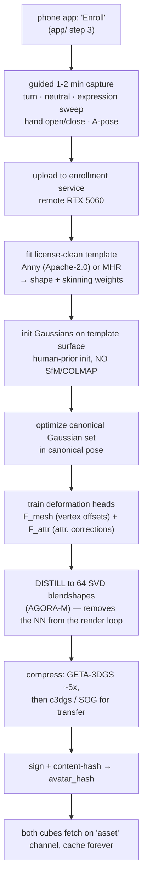

| Property | Value | Confidence |
|---|---|---|
| User time | ≤2 min capture | target, `docs/03` §4.2 |
| Reference build time | ~33 s (Mon3tr, 32× 12 MP rig, non-embedded) | [PUBLISHED, arXiv 2601.07518] |
| **Realistic build time on TAYF's actual RTX 5060** | **1–2 h** — the 5060 is slower than the 3090Ti/4090 the reference avatar papers used | [ESTIMATE, `docs/03` §11.3] |
| Where it runs | **Remote RTX 5060, never the cube** | hard architectural boundary, `docs/03` §11.1 |
| Output size | ~10–30 MB after aggressive static compression (c3dgs 26–31×, HAC-lowrate 48×) | [PUBLISHED, `docs/03` §9.2] |
| Transfer | once per user per device pair, `asset` channel, reliable/ordered | `docs/03` §8.5 |

**The rule that makes this tractable:** *spend arbitrarily on the offline path, spend nothing on the online path* [PUBLISHED framing, `docs/03` §0.2]. A 2-hour enrollment is free; a 3 ms regression in the per-frame loop is not.

**Two design commitments that follow, and they are the load-bearing ones:**

- **Step H is not optional.** Distilling the deformation heads to a fixed linear basis (AGORA-M: N=10,000 sampled posed-minus-neutral residuals → SVD → top K=64 singular vectors → a two-layer MLP regressing the 64 coefficients) makes per-frame animation *one neutral Gaussian set plus a linear combination of 64 bases*. Measured: FID 3.36 vs 3.17 for the full model, **560 fps on an RTX A6000 and 60 fps on a phone via WebGL** [PUBLISHED, arXiv 2512.06438 via `docs/03` §5.4]. This is the mechanism by which receive-side animation cost becomes independent of avatar complexity. Caveat stated: AGORA-M itself is head/face-only and FLAME-driven — **the distillation technique generalizes; the model does not.**
- **Asynchronous, never blocking.** If the build outruns the user's patience, the first call uses a provisional low-fidelity avatar and the real asset lands in the background (`docs/03` §12.5 rung 8).

**Unresolved:** the capture path. Cube-based (the cube's own 3–4 cameras record a guided sequence) is **recommended for v1** because it keeps the product self-contained; phone-orbit capture is higher quality but Meta's LCA (arXiv 2604.02320) publishes no inference numbers and no release, so it is a direction, not a dependency [PUBLISHED, `docs/03` §4.2]. Enrollment UX is explicitly undesigned (`pipeline/avatar/README.md` open item 3).

---

#### The runtime animation loop (deployed edge SoC)

This is the receive half, and it is the only part of the stack with a hard 60 Hz obligation on embedded silicon.

**Per-frame steps, in order, with the invariant each protects:**

1. **Depacketize + validate.** CRC32 check; discard any packet whose `seq` is older than the most recently rendered frame — *late is worse than absent* on an unordered channel. A DELTA whose `ref_seq` was never received is undecodable: discard, request a keyframe on `ctrl`. [PUBLISHED, `docs/03` §12.2]
2. **Unpack → `DrivingState`** via `schema.py`. ~868 B (or 430 B fp16). <1 ms. [DERIVED — LZ4 decompress on a few hundred bytes]
3. **Interpolate to render time.** The render loop runs at the *engine's* native rate, not the packet rate. If state arrives at 60 Hz and the panel runs at 90 Hz, interpolate; if state stalls, keep rendering the last good pose with damped extrapolation toward neutral. **Rendering only on packet arrival converts every network hiccup into a visible freeze** — this decoupling is required, not an optimization. [PUBLISHED, `docs/03` §12.3]
4. **LBS with the covariance transform.** Blend per-joint transforms by skinning weights, then:

   **μ_t = A μ_c + b**  and  **Σ_t = A Σ_c Aᵀ**

   The second equation is the step people skip. Translating a Gaussian without rotating its covariance makes an anisotropic splat lying along a forearm keep pointing in its canonical direction as the forearm rotates — the splat *slides* across the surface it represents. [PUBLISHED, `docs/03` §5.1]
5. **Recover (q, s) from Σ_t on the fast path.** The renderer wants a quaternion and a scale, not a raw 3×3. With M = A R_c S_c, the general recovery is polar decomposition M = R_t U. **But when A is rigid — the common LBS case — this collapses to q_t = q_A ⊗ q_c, s_t = s_c: one quaternion multiply, no scale change.** Gate on ‖AᵀA − I‖_F and fall back to polar decomposition only where blended-rotation shear is non-negligible (near joint centres — the classic candy-wrapper region). Across ~10⁵ Gaussians on an embedded GPU this is a meaningful saving. [PUBLISHED, `docs/03` §5.2]
6. **Apply the 64-coefficient non-rigid correction** from §50.5 step H. One small matrix multiply. **No neural network evaluation in this loop, ever** — the HUGS finding is that after optimization the triplane and MLPs never need re-evaluation at animation time [PUBLISHED, arXiv 2311.17910 via `docs/03` §4.3].
7. **Hand to `pipeline/view_synthesis/`** (§50.7).

**Budget, and how to read it:** `docs/03` §10.2 allocates ≤5 ms to animation and ≤10 ms to view synthesis, giving a ~23–49 ms receiver subtotal and ~49–89 ms end-to-end, against G.114's 150 ms. **Every compute figure in that table is a desktop-GPU or Quest-3 number.** If the Jetson is 3× slower on the estimator stage — entirely plausible for a 15 W part vs. an RTX 5090 — that stage alone goes 13.78 → ~41 ms and end-to-end lands near 120 ms: still inside G.114, with the optical engine unbudgeted and no headroom for a bad network night. [PUBLISHED reasoning, `docs/03` §10.2]

**Structural advantage worth stating because it is genuinely free:** the canonical Gaussian set is *fixed* — same count, same ordering, same appearance — for the whole call. There is no per-frame reconstruction, so there is nothing to boil. TAYF's temporal artifacts are 215-dimensional pose-estimation jitter (a 1.27 ms smoothing problem in Mon3tr), not a 10⁵-Gaussian correspondence problem. HiFi4G needs 81 cameras, a dual-graph tracking structure and **under 7 minutes per frame on an RTX 3090** to buy the same property [PUBLISHED, arXiv 2312.03461 via `docs/03` §5.5].

---

#### The renderer, and why the optical engine must be an abstract interface

##### The evidence for abstraction is this repository's own history

The optical mechanism has been **selected three times in three document revisions**, and each selection was a considered, evidence-backed decision that then lost to better evidence:

| Doc | Date | Engine selected | Why it lost / won |
|---|---|---|---|
| `docs/02`, `docs/01` §4.7 | 2026-08-15 | laser-plasma voxels (north star) | **Excluded on power** — 3.6–36 W for a *sparse wireframe* head against a ~16 W total budget; photoreal is 25–250× outside the envelope, and no efficiency improvement closes 250× |
| `docs/08` §1–2 | 2026-08-15 | MATD acoustic trapping | Selected as verified free-space wireframe engine; 10×10×10 cm³ workspace |
| **`docs/09`** | **2026-08-16** | **AIRR / retroreflective, ZERO moving parts** | **Current.** Static sheet optics; the only dynamic element is pixels on a commodity flat panel |

[PUBLISHED — all three from the repo's own authoritative docs, dates as recorded in their headers.]

**Across all three reselections, `pipeline/` changed by zero lines.** That is not luck; it is `research/notes.md` §10's instruction — *do not lock the invention to one optical mechanism* — realized as an interface boundary (`hardware/optical-engine.md` line 49). A stack that had hard-coded a galvo scan-pattern emitter in 2026-08-15 would have been rewritten twice by 2026-08-16.

##### The interface

Input is the light field restricted to what the engine can physically address; output is whatever that engine eats.

**L(x, y, z, θ, φ, t) → engine-native bytes**

Proposed concrete form [ESTIMATE — this is a design proposal, not existing code]:

```
class OpticalEngine(Protocol):
    # --- static description, read once at boot ---
    def channels(self) -> ChannelSpec:
        """N physical angular channels, their (θ,φ) directions,
           spatial resolution per channel, and native refresh rate."""
    def image_geometry(self) -> ImageGeometry:
        """Where the image is allowed to be: aperture width D, mode
           ('viewer_space' | 'beyond_device'), and the resulting bound
           on image width (docs/01 §4.3b). The renderer must not be
           allowed to request an image the aperture cannot place."""
    def native_rate_hz(self) -> float

    # --- per-frame ---
    def submit(self, frame: EngineFrame) -> None:
        """EngineFrame is a tagged union: PanelFrames | ScanCommands
           | PhaseMaps. The renderer constructs the variant the
           ChannelSpec declares; it never branches on engine brand."""

    # --- optional ---
    def boot_calibration(self) -> LUT | None
```

**`image_geometry()` is the non-obvious member and it is the important one.** The aperture law (`docs/01` §4.3b) is a *property of the engine*, and the renderer must be able to query it rather than assume it:

- **Viewer-space mode** (image nearer than the device — the AIRR family, `docs/09` §1): **W_image ≤ D_aperture.** The renderer must reject a requested image larger than the aperture, at configuration time, with a clear error.
- **Beyond-device mode** (image further than the device — "portal"): **W = D·(b/a)**, which may exceed D. `docs/01` §4.3b, §4.3c.

Both modes are legitimate; the interface exists so the renderer names which one it is driving instead of silently assuming.

##### What each backend costs in software

| Backend | `submit()` payload | Renderer work | Software complexity |
|---|---|---|---|
| **AIRR / Pepper's plate** (`docs/09`, current) | **one framebuffer** to a commodity LCD/OLED | one perspective render of the animated avatar | **Lowest possible.** Unit magnification ⇒ image size = source size; no view multiplexing, no quilt, no LUT |
| Light-field panel (hackathon track) | quilt → device-native via a boot-time LUT | N-view render, view-amortized | Moderate. altiro3D (arXiv 2506.08064) is the fork base |
| Holographic / SLM | phase maps | CGH synthesis at 0.089 Gpx/s tracked | Highest. Real-time CGH is its own research problem |

**The zero-moving-parts finding is also a software finding.** `docs/09` §2 lists it as a hardware advantage — silent, no wear, no drift, no consumables. It is equally a stack simplification: the AIRR backend's `submit()` is *a framebuffer write*, the same call a phone makes. There is no scan-pattern scheduler, no galvo servo loop, no phase-quantization LUT, no per-frame calibration compensation. [DERIVED from `docs/09` §2–§3.]

Two honest caveats carried forward from `docs/09` §3, because the renderer's brightness and view-count assumptions rest on them:

- **~75% of source light is lost** before the image forms (the beamsplitter costs ~50% per pass, twice). The panel must be bright — a power-budget item that lands in `hardware/`, not a software blocker. **This figure is reasoned from the mechanism, not measured** [UNVERIFIED — `docs/09` §7 action 4: measure real optical efficiency and size the panel from the measurement].
- **The AIRR primary literature (Optics Express / OSA Continuum / Optical Review) remains unread** [UNVERIFIED, `docs/09` §3]. Every quantitative AIRR figure the renderer might depend on — brightness, resolution, viewing cone — is reasoned, not verified. This is `docs/09`'s own largest open item and it propagates into the software's view-count assumptions.

##### The view-synthesis rule that survives any backend

Whatever N the engine declares, **render the N views amortized, never as N independent rasterizer passes.** Three independent published results converge on 8–22× from exploiting inter-view redundancy: CoherentRaster 87.7 fps @2K with view-batch 8, PSNR 51.94 dB vs per-view 3DGS (~15× over a 5.8 fps baseline) [PUBLISHED, arXiv 2605.04509]; LFDPR up to 8× faster, per-view buffer 2.63 → 1.32 MB, validated on a *physical* tilted-lens light-field prototype [PUBLISHED, arXiv 2601.19901]; G2LF/V2LF 228 fps for 45-view 512×910 quilts, >60 fps at 90+ views, up to 22× [PUBLISHED, arXiv 2508.18540]. All three are desktop-GPU, static-scene results — **none is a live human avatar and none is a Jetson** [UNVERIFIED on TAYF's target; `docs/03` §6.2 caveat].

And one free win: altiro3D's measured bottleneck is its MiDaS monocular-depth CNN at >50% of inclusive runtime [PUBLISHED, arXiv 2506.08064]. **TAYF has no monocular-depth stage** — it holds an explicit 3D Gaussian avatar, so the depth is known exactly. Forking altiro3D means forking a 10 Hz pipeline whose dominant stage TAYF simply deletes.

---

#### What runs where

| | **Deployed edge SoC** | **Offline enrollment machine** | **Phone** |
|---|---|---|---|
| Part | Jetson Orin Nano-class | Remote RTX 5060 | iPhone (see §50.10) |
| Power | **7–15 W** (Orin Nano) / 10–25 W (Orin NX) datasheet envelope | wall | battery, irrelevant |
| Runs | matting, 3 estimators, fusion, pack, WebRTC, decode, animation, view synthesis, optical driver — **both directions at once** | avatar enrollment **only** | pairing, boundary, enrollment kickoff, call start/stop |
| Frequency | 60 Hz for the whole call | once per user, ever | setup only |
| Binds on | **sustained thermal, then memory, then TOPS** | wall-clock patience | nothing |
| Status | **UNVALIDATED — nothing benchmarked** | available | not built |

[PUBLISHED, `docs/03` §11.1; SoC power envelopes from `docs/01` §5.]

**The hard boundary:** *"Remote RTX 5060 is used only for offline avatar enrollment, never in the runtime loop."* Anything needing the 5060 at runtime is a design error, not an optimization opportunity. [PUBLISHED, `docs/03` §11.1 quoting `docs/architecture.md`]

**Memory is the constraint that is underestimated.** An Orin Nano-class module has a *unified* pool shared by CPU and GPU. BiRefNet alone reports **3.45 GB VRAM at 1024² FP16** [PUBLISHED, `docs/03` §2.2] — most of an 8 GB part before three estimators, the canonical avatar and the render buffers load. Mitigations in priority order, all from `docs/03` §11.2: INT8-quantize every model for the NPU (largest single lever); run matting at 512² or ROI scale and at 15 Hz rather than 60 (human silhouettes do not move 30 px in 16.7 ms); bake all deformation networks to linear bases (§50.5 H); compress the canonical avatar with c3dgs, whose 31× also buys **up to 4× render fps** — compression that pays twice; share one decoded frame buffer across matting and all three estimators.

**The matting quality bar is lower than it looks, and this is the key realization:** TAYF never renders captured pixels — it renders the pre-built avatar. The mask needs to be good enough to *crop*, not good enough to *composite*. [PUBLISHED, `docs/03` §2.2]

**One Python-specific hazard:** `aiortc` is Python, and SCTP/DTLS runs in-process. **Watch for GIL contention if `aiortc` shares a process with anything hot.** Run transport in its own process with a shared-memory ring for `DrivingState`, not in a thread beside the estimators. [PUBLISHED caution, `docs/03` §11.2; the process-split remedy is [ESTIMATE]]

**Thermal reaches into software.** SlimVC's mechanism is the right shape for a thermally-throttled cube: **five runtime width factors [0.25, 0.375, 0.5, 0.75, 1] from a single loaded model**, 73–436 GFLOPs across widths, up to 20× speedup at low rates [PUBLISHED, arXiv 2205.06754 via `docs/03` §8.5]. The important property is not that the codec adapts to the *network* — it is that **one loaded model adapts to the available compute**, which is exactly what happens when the Jetson hits its ceiling mid-call.

---

#### The observer / head-tracking loop and its prediction requirement

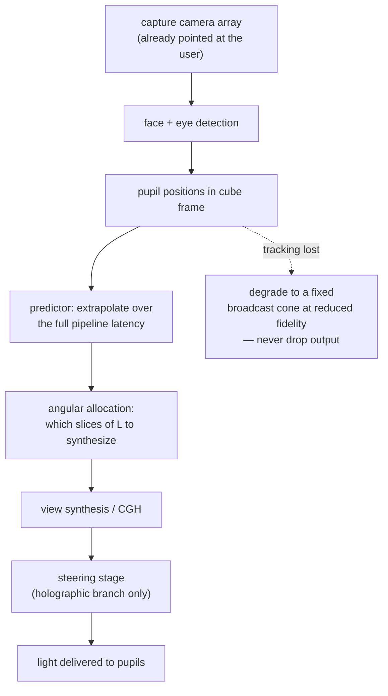

**The architectural free lunch:** the cube's cameras are already pointed at the local user *because it is capturing them for transmission*. Capture and display share one sensor set, and the head pose the view synthesis needs falls out of the body estimator that is already running [PUBLISHED, `docs/01` §3, §4.4; `docs/03` §1.6].

**The prediction requirement, computed:** [DERIVED]

```
head sway velocity  v = 0.2 m/s            (natural seated motion, docs/01 §9)
pipeline latency    τ = 100 ms
positional error    e = v·τ = 0.2 × 0.100 = 0.020 m = 20 mm
pupil diameter      d = 6 mm
                e/d = 20/6 = 3.33 pupil diameters
```

**Untracked prediction error, not tracking accuracy, is the likely failure mode.** Required accuracy is pupil localization better than one pupil diameter at 1 m ≈ 6 mrad; tracking volume is a seated observer, ±0.3 m lateral, 0.6–1.5 m from the cube. [PUBLISHED, `docs/01` §9]

**Which architecture this binds — say it explicitly, per `research/METHODOLOGY.md` §3.** The 20 mm figure is a hard requirement **for the tracked holographic architecture**, where the engine steers a ~6 mm exit pupil at the viewer's eye and a 20 mm miss means the viewer sees nothing. Under the current AIRR selection (`docs/09`) the optics emit a **static ±20–30° viewing cone with no steering stage at all** — the `H` node above does not exist. There, tracking degrades from a hard optical dependency to a rendering-quality feature (view-dependent shading, motion parallax within the cone), and a 20 mm prediction error costs a small perspective error rather than a blank image. **This is a genuine relaxation created by the zero-moving-parts choice, and it should be stated as such rather than carrying the holographic branch's requirement into a design that does not have it.** [DERIVED from `docs/09` §3 (static optics, ±20–30° cone) + `docs/01` §4.6 (steering exists only in the modulator branch); [UNVERIFIED] pending the AIRR literature that would confirm the cone figure — `docs/09` §3 marks it as reasoned, not measured.]

**Implementation spec (both branches):**

| Item | Spec | Confidence |
|---|---|---|
| Predictor candidates | constant-velocity → Kalman → learned, in that order of preference | [ESTIMATE], S6.3 |
| Loop budget | 5–10 ms, inside the 76–177 ms motion-to-photon chain | [PUBLISHED, `docs/01` §6] |
| Loss behaviour | widen to a fixed broadcast cone at reduced fidelity; **never drop output** | [PUBLISHED, `docs/01` §9] |
| Validation data | arXiv 2506.02380 (EyeNavGS) — head-pose and gaze traces from 46 participants; use real motion statistics, not synthetic sway | [PUBLISHED, `docs/07` §8] |
| Decisive experiment | **S6.2** — replay real head-motion traces through the full pipeline latency and check error stays under one pupil diameter | [PUBLISHED, `docs/07` §8: *"the highest-value simulation in the entire plan after S1.5"*] |

**Freedom-to-operate warning that belongs in the software section because it is the software that infringes:** using an observer/eye estimate to select which angular views a display physically emits is claimed by **Google US11474597B2** (granted, in force to 2040). Also relevant: **US10327014B2** (symmetric capture-and-3D-display terminals, to 2037), **Duelight US11683448B2** (parametric-state-instead-of-video transport, to 2038), **Looking Glass US11425363B2** (neural gap-filling between sparse views). §4.4's tracked architecture is the correct engineering choice and is not ours to own; commercialization requires a real FTO opinion. [PUBLISHED, `docs/01` §4.4 citing `docs/05`]

---

#### The phone app

##### Two jobs, and the discipline of refusing a third

`app/README.md` is explicit: **(1) pair with a cube, (2) set the capture boundary.** Enrollment kickoff and call control are thin additions, not a dashboard. *"Apple-minimalist means doing less, not adding a dashboard."*

| Screen | Job | Notes |
|---|---|---|
| **Pair** | discover and connect to a cube | Mechanism **TBD** — depends on the unchosen radio (`hardware/bom.md`, `firmware/README.md`). Local-network discovery or a short-range pairing step. [UNVERIFIED] |
| **Boundary** | draw/adjust the capture volume | Live preview from the cube, or an on-device AR box. This box is enforced in `pipeline/capture/` as a hard geometric clip **before** the matting network runs — the cheapest and most reliable filter in the stack [PUBLISHED, `docs/03` §2.3] |
| **Enroll** (first use) | kick off the 1–2 min guided capture | Fire-and-forget; the build is asynchronous (§50.5) |
| **Call** | start/end | **The call is cube-to-cube. The phone is not in the media path and is not required hardware during a call** [PUBLISHED, `app/README.md`, `research/notes.md` §37–38] |

A screen that is not pairing, boundary-setting, enrollment or call control does not belong in the build (`design/README.md` rule 3).

##### Platform recommendation: SwiftUI, iOS-first

Stated as a recommendation the user can override, with its reasoning exposed [PUBLISHED, `app/README.md`; the reasoning is [ESTIMATE]]:

1. **The design brief is Apple-minimalist glassmorphism** (`design/README.md`). SwiftUI's `.ultraThinMaterial` is real glassmorphism via the system compositor; a cross-platform framework means hand-rolling Apple's visual language as a blur+opacity hack. `design/tokens.md` already specifies the concrete values the implementation consumes: `.ultraThinMaterial` surfaces, 16 pt control radius / 24 pt sheet radius, SF Pro with Dynamic Type, system semantic colors, one accent reserved for state, standard implicit animations only.
2. **Solo builder, hackathon timeline** (`docs/roadmap.md`: Idea Phase closes **23 Aug 2026**, Prototype/live demo **13 Sep 2026**). One platform, one codebase, no cross-platform abstraction tax.
3. **A hackathon demo needs to run on the builder's own phone**, not ship broadly. Android is a real product concern for later, not a September concern.

**Counter-consideration, recorded so the decision is made knowingly:** if the pairing mechanism lands on BLE + a custom GATT profile, the iOS background-execution and permission model is materially more restrictive than Android's, and that cost lands *after* the platform is chosen. Settle the radio before writing pairing code. [ESTIMATE]

##### Body-region selection, and the fixed-schema question

The app exposes a fidelity/cost tradeoff at session setup [PUBLISHED, `app/README.md`]:

| Mode | Meaning |
|---|---|
| **Full body** | default, no region prioritization |
| **High-fidelity** | face, eyes, mouth, hands, fingers prioritized; clothing and hidden geometry get reduced fidelity |
| **Custom region** (head / hands / upper body / torso) | narrows the capture boundary itself — the same box-drawing flow — trading full-body presence for guaranteed quality on a smaller region |

Transmitted **once at call setup, never renegotiated per frame**, as the `region_mask` field of the `ctrl`-channel `HELLO` (`docs/03` §12.1).

**The open question, stated honestly.** `pipeline/schema.py` is a fixed-width struct: `"<215f d"`, 868 bytes, always. `app/README.md` open item 3 flags the interaction as unresolved: *"a true fidelity tradeoff might mean varying which sub-estimators run rather than changing the wire format itself. Needs resolving before this feature is implemented, not just specified."*

**Recommended resolution — `region_mask` changes which sub-estimators run on the sender, not the packet width** [PUBLISHED as the recommendation in `docs/03` §12.1; the supporting arithmetic below is [DERIVED]]:

| Consequence | Detail |
|---|---|
| Wire format | unchanged. `schema.py` needs no variant, no version bump, no conditional parser |
| Unselected regions | transmit as zeros (or a held neutral pose) |
| Compression | LZ4 collapses constant-zero runs to almost nothing. A **head-and-face-only** session leaves 50 of 215 floats varying and zeroes 165 (**76.7%**) — 330 of 430 fp16 bytes become a zero run. A **body-and-face, no-hands** session zeroes 90 (41.9%) |
| Compute | the real saving: the hand branch is the *rate-limiting* estimator (71.2 fps reference vs. body 73.6 and face 377). Not running it is a latency and thermal win, not a bandwidth one |
| Rejected alternative | variable-width packets keyed on the mask — buys a few bytes at the cost of making **every parser conditional on session state**, on an unreliable channel where a lost `HELLO` would make the stream unparseable |

**Why the compute framing is the right one:** the bandwidth is already ~0.162 Mbps, **25× under a 4 Mbps residential uplink** [PUBLISHED, `docs/03` §8.4]. There is no bandwidth problem to solve. What is scarce is the ~17 ms per-frame budget and the ~16 W thermal ceiling. So *"which estimators run"* is a lever on the resource that binds, and *"how wide is the packet"* is a lever on the one that does not. **Region selection is a compute-allocation control wearing a bandwidth control's clothes**, and the UI copy should not promise bandwidth savings it will not deliver. [DERIVED]

**Residual open items on this feature:**

1. **The high-fidelity mode does not map onto the estimator set at all.** "Face, eyes, mouth, hands prioritized" is a statement about *canonical-avatar bit allocation* (a `pipeline/avatar/` enrollment-time decision, GETA-3DGS's heterogeneous bit-width policy) and about *per-channel quantization steps* in the delta coder — not about which sub-estimator runs. Full-body and custom-region are estimator gates; high-fidelity is a different mechanism sharing a UI control. **These should not ship behind one three-way picker until that is resolved**, or the setting will silently do nothing in one of its three positions. [DERIVED — this is a distinction neither `app/README.md` nor `docs/03` §12.1 currently draws.]
2. Zero-vs-neutral for unselected regions is unspecified. Zeros in an axis-angle rig mean identity rotation, which is *usually* a neutral pose — but that is a rig-dependent claim and must be checked against Anny/MHR, not assumed. [UNVERIFIED]
3. `region_mask` must be in the `HELLO` mismatch check: if A sends head-only and B expects full body, B must know, not infer. [DERIVED]

---

#### The simulation suite

`docs/07`'s premise: *nothing gets ordered until the simulation that would have predicted its failure has been run.* Current state:

| Track | Path | Status | Result |
|---|---|---|---|
| **S1.1 validation (gate G1)** | `simulation/s1_waveoptics/propagate.py` | **DONE** | **9 passed, 0 failed → SIMULATOR TRUSTED** |
| **S1.5 tracked vs. broadcast** | `simulation/s1_waveoptics/s1_5_tracked_vs_broadcast.py` | **DONE** | resource claim confirmed; quality claim untested |
| **S3.1/S3.3 thermal** | `simulation/s3_thermal/thermal_sweep.py` | **DONE** | 5-face/48 °C ceiling ≈16 W; 100 mm cornered, 150 mm comfortable |
| S1.2–S1.4, S1.6–S1.9 | — | not started | CGH quality, multiplex gain, 4-bit quantization, metasurface steering |
| S2 optical layout / tolerance | — | not started | **S2.3 (tolerance stack-up) is the one that quietly kills projects** |
| S4 light field | — | not started | fork arXiv 2506.08064, do not build from scratch |
| S5 perceptual | — | not started | **`docs/07` §1: the single highest-leverage move available**, and it needs no optics |
| S6 tracking + prediction | — | not started | **S6.2 is the real kill risk** (§50.9) |
| S7 end-to-end | — | not started | discrete-event latency/bandwidth model |

##### Gate G1 — passed, re-verified today

`python3 simulation/s1_waveoptics/propagate.py` re-run 2026-08-16 [MEASURED]:

| # | Check | Result | Error (tol) |
|---|---|---|---|
| 1a–c | Gaussian w(z) at 0.5/1.0/2.0 z_R vs. analytic w₀√(1+(z/z_R)²) | PASS ×3 | 0.000% (2%) |
| 2 | Energy conservation over lossless propagation | PASS | 0.000% (1%) |
| 3 | Round trip +z then −z recovers the input | PASS | RMS 5.50×10⁻¹⁶ (1×10⁻⁶) |
| 4 | Circular-aperture far field → Airy first null at 1.22λ/D | PASS | 13.4277 vs 13.42 mrad, 0.058% (5%) |
| 5a–c | Grating equation sinθ_max = λ/2p at p = 8 / 3.74 / 1.0 µm | PASS ×3 | ≤0.237% (2%) |

**9/9. `GATE G1: SIMULATOR TRUSTED`.** Nothing downstream in S1 is trustworthy without this, which is why it is a gate and not decoration (`docs/07` §11).

Two engineering details in that file worth preserving verbatim in any rewrite, because both encode a bug that was already made once:
- `max_propagation_distance()` — the angular-spectrum kernel undersamples beyond `L·√((2dx/λ)² − 1)/2` and **silently produces wrong answers** past it. This is exactly the failure a validation suite exists to catch.
- The far-field test uses `fraunhofer()`, not `angular_spectrum()`. The file's own comment: *"an earlier version of this suite used it and reported a 16% error that was pure numerics."* [MEASURED — recorded in-source, per `research/METHODOLOGY.md` §4's report-your-own-errors rule]

##### S1.5 — reproduced today

`python3 s1_5_tracked_vs_broadcast.py` [MEASURED, 2026-08-16]:

| Quantity | Predicted | Measured |
|---|---|---|
| Sub-aperture **area** ratio (broadcast ÷ tracked) | 58× | **59.3×** |
| Linear resolution ratio | — | **7.7×** |
| Hologram-synthesis **compute** ratio | 58× | **58×** |

Internal consistency check [DERIVED]: **√59.3 = 7.70**, exactly the reported linear ratio — area and linear measures agree, which is what you want from two independently computed numbers in the same script.

**Not confirmed, and the script says so itself:** PSNR did **not** separate the cases (spread <2 dB, not even monotonic in sub-aperture size). This is a **metric failure, not evidence against the claim** — Gerchberg–Saxton reconstructions are speckle-dominated and PSNR mostly measures the speckle; larger sub-apertures resolve more real detail *and* more speckle, and the two cancel in a pixel-wise error metric. This mirrors arXiv 2501.08072 / 2404.09003 / 2403.06421, which independently report PSNR/SSIM correlating poorly with human judgement on exactly this content class. **A valid quality test needs a resolution-target metric (resolvable line pairs) or human MOS — that is S5, queued, not done.** [MEASURED + PUBLISHED, as printed by the script]

**The verdict to carry forward: the resource claim survives; the quality claim is untested.**

##### Software-quality standards this suite sets

`docs/07` §12: every track must produce runnable code under `simulation/<track>/`, a results file with the actual numbers, and a one-paragraph verdict on whether the `docs/01` claim it tests survived. **A simulation that does not update a claim in `docs/01` — by confirming, correcting, or killing it — was not worth running.** The three existing scripts all meet this bar; they print their own verdicts, name what they do *not* show, and are dependency-light (`numpy` only, with an optional `torch`/`TAYF_DEVICE=cuda` path for the remote 5060).

---

#### Build order

Ordered by what unblocks the most, with the blocker named. Dates from `docs/roadmap.md`.

| # | Task | Blocked on | Unblocks |
|---|---|---|---|
| 1 | **Commit to Anny or MHR**; write the joint table and rotation convention into `schema.py` as named constants | nothing — a reading task | **Everything in `pipeline/`.** `pipeline/avatar/README.md` open item 1 says this blocks writing animation code at all |
| 2 | Fix the `requirements.txt` license header; add `lz4`/`numpy`/`torch`/`Opus` rows to `research/LICENSING.md` | nothing | License hygiene (Policy 1) |
| 3 | Implement `pipeline/transport/` against `schema.py`: fp16 + LZ4 + `aiortc`, four channels with their four reliability contracts | #1 for the rig, nothing else | Measurement #3 of `docs/03` §14 (baseline wire bandwidth) — **the mandatory baseline before any delta-coding work** |
| 4 | Define the `OpticalEngine` protocol (§50.7.2) and write the **AIRR framebuffer backend** — the simplest possible one | #1 | Renderer development without a panel in hand |
| 5 | Loopback harness: two processes on one machine, `capture` stubbed with recorded pose, full transport + animation + engine path | #3, #4 | Per-stage latency instrumentation (measurement #5) without hardware |
| 6 | Nokia NaC portal registration | external (project task #2) | **The entire CAMARA half of the demo narrative.** `agent/nac_client.py` cannot run against even a sandbox endpoint without it |
| 7 | SwiftUI app: pair → boundary → enroll → call | radio choice for pairing | Boundary enforcement in `capture/`, enrollment UX |
| 8 | S6.2 (prediction under real head-motion traces) and S5 (perceptual battery) | nothing — both are pure simulation | The two riskiest unmeasured claims in the whole project |
| 9 | Jetson benchmarks #1/#2 of `docs/03` §14 — three estimators concurrent, **30 min sustained**, in the actual enclosure | hardware arriving | The per-frame budget. **Peak fps is a marketing number; sustained fps is the product** |

**A benchmark run in the last week is a discovery, not a schedule input** [PUBLISHED, `docs/03` §14.1]. Items 3, 5 and 8 need no hardware at all and should therefore start now.

---

#### Open items, ranked

1. **The rig decision (#1 above) is the keystone and it is a reading task, not a research task.** Until Anny or MHR is chosen and its joint ordering written into `schema.py`, `body_pose`'s 75 dimensions mean nothing specific, no estimator adapter can be written, and every downstream module is specified against a placeholder. This is the largest ratio of blocked-work to effort-required in the software stack. [DERIVED from `pipeline/avatar/README.md` open item 1 + `docs/03` §3.2]
2. **Three estimator licenses are UNVERIFIED** (GVHMR / SMIRK / HaMeR, each presumed to carry SMPL-X / FLAME / MANO). Mitigated architecturally by the rig-space adapter, but the verification is still owed. [PUBLISHED, `docs/03` §13.3]
3. **Nothing has been benchmarked on the target SoC.** Every fps in the stack is a desktop-GPU or Quest-3 number. BiRefNet's 3.45 GB is the most likely forcing function for a model swap. [PUBLISHED, `docs/03` §0.3, §11.2]
4. **The high-fidelity/full-body/custom three-way picker conflates two different mechanisms** (§50.10.3 item 1) and will silently no-op in one position if shipped as designed.
5. **AIRR's quantitative figures are all reasoned, not measured** — including the ~75% optical loss that sizes the source panel the renderer drives. `docs/09` §7 action 1 (obtain the primary literature) is that document's own largest open item and it propagates directly into the renderer's brightness and view-count assumptions. [UNVERIFIED]
6. **Pairing mechanism undecided**, blocking the app's first screen and, transitively, boundary enforcement in `capture/`. [UNVERIFIED, `app/README.md` open item 1]
7. **NaC portal registration outstanding** — no CAMARA call has been executed against a real or sandbox endpoint, so `agent/nac_client.py`'s call patterns are verified-by-reading only. [PUBLISHED, `agent/README.md` open item 1]

---

## 9. Confidence audit, corrections and open problems

This section is the document's warranty. Everything above it argues; this argues with it. It does four things: it tags every load-bearing claim in TAYF with the evidence that actually supports it, it lists the errors this project made and caught, it records the mechanisms that were killed and the arithmetic that killed them, and it ranks what is still unknown. A design document that cannot say which of its numbers were measured, which were computed, and which were guessed is not an engineering document — it is a pitch.

The corrections log (§60.3) is deliberately prominent. Every item in it was a conclusion this project held, acted on, and then reversed. Two of them reversed a *"physically impossible"* verdict into *"fits with margin"*, which is the expensive direction to be wrong in.

---

#### The tagging discipline

| Tag | Means | Standard of proof |
|---|---|---|
| **[MEASURED]** | An instrument produced this number, in this project or in a cited paper, on real hardware | A named apparatus and a reported value |
| **[PUBLISHED]** | A specific verified paper, standard, or datasheet states it | arXiv ID / DOI / patent number / part number given, and the record was fetched |
| **[DERIVED]** | Computed from first principles here or in the repo | Formula and inputs shown so it can be re-run and attacked |
| **[ESTIMATE]** | Engineering judgement | Stated as judgement, with the sensitivity that matters |
| **[UNVERIFIED]** | Believed, not confirmed | Accompanied by the specific artifact that would confirm it |

Four rules govern how these are applied, and they are not stylistic:

1. **Simulation is not measurement.** `simulation/s1_waveoptics/` and `simulation/s3_thermal/` produce numbers that this audit tags **[DERIVED]**, never [MEASURED]. A numerical experiment can only confirm that the analysis was arithmetically self-consistent; it cannot discover that a beamsplitter has a wedge error.
2. **A cited measurement stays [MEASURED] but inherits the source's apparatus.** Mon3tr's 80 ms was measured — on an RTX 5090 sender and a Quest 3 receiver. On a 7 W Jetson it is [UNVERIFIED], and this audit splits those rows.
3. **Vendor claims are [UNVERIFIED] until a datasheet or record is archived in-repo.** Product-page numbers and trade-press figures do not become [PUBLISHED] by being repeated.
4. **A constraint must name the architecture it was evaluated in** (`research/METHODOLOGY.md` §3). An untagged constraint is treated as scoped to nothing and is not load-bearing.

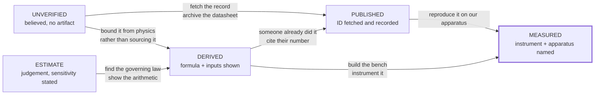

**Only the two rightmost states are safe to design against.** The ledger below exists to show how much of TAYF currently sits on the left.

---

#### Master claim ledger

Every row is a claim the design would change if it were false. Columns: the claim, its value, its tag, where it comes from, and the specific act that would upgrade it one level.

##### Geometry — the aperture law and its escapes

| # | Claim | Value | Tag | Source | Upgrade path |
|---|---|---|---|---|---|
| G1 | Image beyond the device is bounded by the aperture's shadow | **W = D·(b/a)** | [DERIVED] | `01` §4.3b; straight-line propagation through the exit aperture | Not upgradeable — it is geometry. Falsified only by an image outside the aperture's angular silhouette |
| G2 | Image in the viewer's own space is bounded by the aperture itself | **W_image ≤ D_aperture** (b < a ⇒ W < D) | [DERIVED] | `01` §4.3b, `09` §1 | Same as G1 |
| G3 | Aperture required per life-size subject (in-viewer-space mode) | head 25 cm · head+neck 32 · bust 50 · seated 80 · standing 170 | [DERIVED] | `09` §1, from G2 + anthropometry | Anthropometric widths are [ESTIMATE]; upgrade with a percentile table (e.g. ANSUR-class) |
| G4 | Lagrange pixel requirement and the aperture bound are the same statement | **N_x = D·p/(a·λ)**; image distance *b* cancels | [DERIVED] | `01` §4.3a; checked at two evaluation planes (aperture y=50 mm/u=3.00 mrad and image y=125 mm/u=1.20 mrad both → 1,091) | Independent re-derivation by a third party, or a wave-optics propagation showing the same cutoff |
| G5 | Pixel requirement at nominal geometry | 1,091 across (D=100 mm, a=1.0 m, p=6 mm, λ=550 nm) → **3.52× surplus on a 4K panel** | [DERIVED] | `01` §4.3a | S1-class propagation sim reproducing the resolvable-point count |
| G6 | Requirement stays inside 4K across the whole useful viewer-distance range | 1,091 @ a=1.0 m → 3,636 @ a=0.3 m (1.06×) | [DERIVED] | `01` §4.3c | As G5 |
| G7 | Viewer distance *a* is a free design variable and buys image size | cube at 0.3 m + person at 3.0 m ⇒ 1000 mm visible through an 18.9° window | [DERIVED] | `01` §4.3c | Perceptual test: is a 9–19° porthole acceptable for conversation? (Track D, S5) |
| G8 | Clipping is a general theorem for surface-modulating displays, published | "Clipping restricts the utility of all three-dimensional displays that modulate light at a two-dimensional surface with an edge boundary…" | [PUBLISHED] | Smalley et al., *Nature* **553** 486 (2018) | Already terminal; only a counterexample display would move it |
| G9 | AIRR's own inventor states the image lies between eye and retroreflector | direct quotation | [PUBLISHED] | Yamamoto, *J. Imaging Soc. Japan* **56**(4) 341 (2017) | — |
| G10 | Magnification is always paid for in viewing zone | measured trade-off | [MEASURED] | Momosaki et al., *Appl. Opt.* **60** 6748 (2021) | — |
| G11 | Commercial systems obey W = D·(b/a) numerically | LFL SolidLight 28″ panel → 14″ volume ~2 ft in front; Brelyon 30″ → 122″ *behind* | [UNVERIFIED] | `01` §4.3g, manufacturer literature; no datasheet archived in-repo | Archive the two spec sheets in `research/`; then [PUBLISHED] |
| G12 | AR glasses are consistent, not a counterexample | a ≈ 2 cm ⇒ D·(b/a) = 2 m | [DERIVED] | `01` §4.3g | — |
| G13 | No display exists whose image is outside the launch aperture's silhouette with no matter at the image point | survey result | [UNVERIFIED] | `01` §4.3g — three independent searches, all negative | Cannot be upgraded past [UNVERIFIED] by searching; it is a negative over an incompletely-covered corpus (see §60.5 O12) |

##### Optical supply and demand (wavefront branch)

| # | Claim | Value | Tag | Source | Upgrade path |
|---|---|---|---|---|---|
| O1 | Spatial demand for a head at 1 m, 1 arcmin acuity | 859 points across; 7.39×10⁵ spatial samples | [DERIVED] | `01` §4.2 | Track D measurement of the acuity actually needed for presence — likely *reduces* it |
| O2 | Broadcast SBP demand at ±20° (116 views) | 8.57×10⁷ | [DERIVED] | `01` §4.2 | Same as O1; strict Nyquist angular sampling would *double* it (`02` §12 row 1) |
| O3 | Tracked SBP demand (2 pupils) | 1.48×10⁶ → **5.61× surplus** on 4K LCoS @60 Hz | [DERIVED] | `01` §4.4 | S1.5 quality metric that actually separates the cases (see C3 in §60.3) |
| O4 | The tracked collapse is 58× in resource terms | sub-aperture area ratio **59.3×** vs 58× predicted; 58× compute reduction | [DERIVED] (numerical, in-repo) | `simulation/s1_waveoptics/s1_5_tracked_vs_broadcast.py` | Bench reproduction on a real SLM at V0.5 |
| O5 | Best *purchasable* modulator supply | TI DLP MEMS phase 1920×1080 @1440 Hz, 24× mux = 4.98×10⁷ (58% of broadcast need), 4-bit phase | [PUBLISHED] | arXiv 2205.02367 | Buy one and measure achieved mux depth and phase linearity |
| O6 | 4K LCoS @480 Hz, 8× mux = 6.64×10⁷ (77%) | **not a product** | [UNVERIFIED] | `01` §4.3 explicitly flags the row as a projection | Only a vendor shipping the part upgrades this |
| O7 | Honest purchasable broadcast gap | **1.7×** (1.3× against the projected part) | [DERIVED] | `01` §4.3 from O2/O5 | — |
| O8 | The 10 cm aperture is not the optical limit | SBP_max = A·Ω/λ² = 1.25×10¹⁰ at ±20° ⇒ 145× headroom (≈8400× tracked) | [DERIVED] | `01` §4.5 | Most robust claim in the optical chain; follows directly from A·Ω/λ² |
| O9 | Steering range is pitch-limited and short | sin θ_max = λ/2p: 8 µm→±2.0°, 3.74 µm→±4.2°, 1 µm→±16.0°, 0.5 µm→±33.4°; **±17.2° needed** for 30 cm of head sway at 1 m | [DERIVED] | `01` §4.6 | A coarse-steering stage or a metasurface interpolator measured end-to-end |
| O10 | A metasurface pixel-interpolator can reach wide FOV at video rate | 159.4°×159.2°, 45.1% efficiency, 60 Hz, static TiO₂ + LCoS | [MEASURED] (in the cited paper) | arXiv 2511.22639 | Reproduce at our aperture and colour count; it is monochromatic and benchtop |
| O11 | Critical distance of a 4K SLM at green matches the cube | z_c = NΔx²/λ = 97.7 mm | [DERIVED] | `02` §6.2, formula from arXiv 2203.06784, cross-checked against that paper's own system to ~15% | Bench measurement of resolvable-point count vs z |
| O12 | A classic 4f Fourier layout does not fit | f = 680 mm for a 100 mm image | [DERIVED] | `02` §5.2 | Terminal for that layout; not for lensless Fresnel |
| O13 | Real-time CGH compute, not optics, is the thermal constraint for the wavefront branch | every corpus real-time CGH result is workstation/4×A6000 class vs a 7–15 W SoC | [PUBLISHED] | `02` §6.2 table; arXiv 2601.00630, 2409.11049, 2404.10777 | Port one method to Jetson-class and measure watts per frame |
| O14 | Optical output requirement is trivially small | 1.06 lm (face-parity) to 3.79 lm (200 cd/m²); 135 mW laser, 0.7–1.4 W electrical | [DERIVED] | `02` §7.2–7.3 | Ambient-contrast measurement in a 500 lux room (`02` §12 row 6) |
| O15 | A real face in a 500 lux room is ~56 cd/m² | L = Eρ/π, ρ=0.35 | [DERIVED] | `02` §7.1; ρ is [ESTIMATE] | Photometer reading off a real face |

##### The selected emission family (static retroreflective / AIRR)

| # | Claim | Value | Tag | Source | Upgrade path |
|---|---|---|---|---|---|
| A1 | AIRR forms a **real** image in the viewer's own space; Pepper's ghost forms a **virtual** one behind the plane | mechanism distinction | [DERIVED] | `09` §3, from retroreflection geometry | Bench: put a card at the image plane and see whether light lands on it |
| A2 | AIRR is unit magnification by construction | W_image = W_source | [DERIVED] | `02` §6.4 — retroreflector returns each ray antiparallel | A published magnifying AIRR variant would break it (see O1 in §60.5) |
| A3 | Zero moving parts in the whole device | only the display panel's pixels change | [DERIVED] | `09` §2 — three static elements: panel, beamsplitter, retroreflector | Build the disc (design 03) and confirm nothing needs recalibration over weeks |
| A4 | Optical efficiency ≈ 25% (two beamsplitter passes) | ~75% of source light lost | [DERIVED] | `09` §3, 0.5 × 0.5 | **Measure it** — the reasoned figure ignores retroreflector return efficiency and sheet scatter |
| A5 | Required source-panel luminance for face parity | ≥ 56/0.25 ≈ **223 cd/m²** (≈800 cd/m² for the 200 cd/m² design target) | [DERIVED] | from A4 + O15 | Photometer on a candidate panel; commodity-panel comparators are [UNVERIFIED] (no datasheet archived) |
| A6 | Viewing cone ~±20–30° | — | [UNVERIFIED] | `09` §3, reasoned from the mechanism, **not** measured | Goniometric measurement, or the AIRR journal line (§60.5 O1) |
| A7 | AIRR inside a 100 mm cube is bounded at ≤60 mm image / 40 mm standoff | 100 mm float needs a 141 mm beamsplitter diagonal; 40 mm float needs 57 mm | [DERIVED] | `02` §6.4 | Terminal for the cube; irrelevant for the slab designs, which is why they exist |
| A8 | The AIRR primary literature has never been read by this project | Optics Express / OSA Continuum / Optical Review, paywalled | [PUBLISHED] (the *gap* is documented) | `09` §3, `02` §6.4 | Document delivery. **This is the cheapest high-value action in the project** |
| A9 | The mechanism is patented and in force | Utsunomiya US11340475B2 (to 2038); Asukanet US8867136B2 (to 2030); Toppan US11947139B2 (to 2041); NICT/Stanley US8724224B2 (~2032) | [PUBLISHED] | `05` §3.1, tiers [V]/[V]/[R]/[R] | Attorney FTO opinion; buy a licensed plate (exhaustion) |
| A10 | The folio's three-surface fold is unresolved | — | [UNVERIFIED] | `09` §3, §7 item 2 | A CAD kinematic study; it is mechanical design work, not research |

##### Capture, representation, transport

| # | Claim | Value | Tag | Source | Upgrade path |
|---|---|---|---|---|---|
| T1 | A person is drivable from 215 floats/frame | 75 body + 50 expression + 90 hand | [MEASURED] | Mon3tr, arXiv 2601.07518; instantiated in `pipeline/schema.py` | Reproduce on our own capture rig |
| T2 | Raw frame size | 868 B (215×4 + 8 B timestamp) | [DERIVED] | `01` §7.1, struct format | — |
| T3 | fp16 payload rate at 60 fps | 0.206 Mbps | [DERIVED] | 434×8×60 | — |
| T4 | fp16 + LZ4 payload-only | 0.124 Mbps | [DERIVED] | ~0.6× compression assumption | Measure LZ4 ratio on real pose streams |
| T5 | **Wire** rate including SCTP/DTLS/UDP/IP | **~0.162 Mbps** (+24%) | [ESTIMATE] | `01` §7.1; `eng` ledger C-44 labels it ASSUMED/unmeasured | Packet capture at the interface (`experiments/bandwidth/` #3) |
| T6 | End-to-end 80 ms, <0.2 Mbps, ~60 fps receive | measured on RTX 5090 sender + Quest 3 receiver | [MEASURED] | arXiv 2601.07518 | Not transferable — see T7 |
| T7 | The same pipeline on a 7–15 W Jetson, sustained 30 min | — | [UNVERIFIED] | `03` §0.3 states the port is unvalidated | Measurement #1 in `03` §14: peak fps, 30-min sustained fps, and throttle onset reported *separately* |
| T8 | Latency budget sums to 76–177 ms against a 150 ms limit | per-stage table | [DERIVED] from [ESTIMATE] stages | `01` §6; `eng` C-48 labels every stage ASSUMED | Per-stage instrumentation on real hardware (`03` §14 #5) |
| T9 | 150 ms is the conversational threshold | ITU-T G.114 | [PUBLISHED] | standard | — |
| T10 | Expressiveness beats timing | 82.6% preferred expressive motion with 100 ms desync over precisely-timed flat motion | [PUBLISHED] | arXiv 2503.20308 | — |
| T11 | Life-size placement drives co-presence | — | [PUBLISHED] | arXiv 2401.02171 | Replicate free-space rather than flat-panel (Track D) |
| T12 | Avatar build is a one-time ~33 s cost | — | [MEASURED] | arXiv 2601.07518 | Reproduce on RTX 5060 (`03` §14 #7) |
| T13 | Canonical avatar compresses ~5× | — | [PUBLISHED] | arXiv 2605.02086 | — |
| T14 | Parametric transport beats volumetric streaming by 10²–10³ | 0.16 Mbps vs 20–300 Mbps | [DERIVED] from [MEASURED] endpoints | `03` §0.2 | — |
| T15 | Three cameras measurably beat one through head turns | — | [UNVERIFIED] | `03` §14 #6 — "TAYF-original work with no published reference" | The experiment; it is the sole justification for the camera array |

##### Power, thermal, enclosure

| # | Claim | Value | Tag | Source | Upgrade path |
|---|---|---|---|---|---|
| P1 | Sealed-cube rejection model | Q = h·A·ΔT + εσA(T_s⁴−T_a⁴) | [DERIVED] | `04` §3.1; h=8 W/m²K and ε=0.9 are [ESTIMATE] | Thermal-chamber measurement of a dummy load in the real shell |
| P2 | 6-face, 40 °C figure | 12.44 W | [DERIVED] | `04` §3.1 | Superseded by P3 — see correction C1 |
| P3 | **5-face, 48 °C metal touch limit** | **≈16.2 W** (14.0 W for a 45 °C shell) | [DERIVED] | `04` §3.2, §3.4 | — |
| P4 | 48 °C metal touch limit | IEC 62368-1 class figure | [UNVERIFIED] | `04` §3.4 tags it `[U-STD]` | Read IEC 62368-1 Table 38 or the current equivalent clause |
| P5 | Emissivity is a first-order variable | ε 0.9→0.05 costs 4.13 W of 10.37 W at 40 °C (−40%) | [DERIVED] | `04` §3.3 | ε values are `[U-SPEC]`; measure the actual finish |
| P6 | Full-capability config does not fit 100 mm | 27.3 W ⇒ ΔT≈38 K ⇒ 63 °C shell, 15 K over limit | [DERIVED] from [UNVERIFIED] line items | `04` §3.5 Config A | Every load line is `[U-SPEC]`; a sourced BOM upgrades the whole calculation |
| P7 | Thermally-honest config fits with 8% margin | 14.9 W vs 16.2 W | [DERIVED], **weak** | `04` §3.5 Config B — "an 8% margin against a stack of unverified specs is not a margin" | As P6 |
| P8 | Jetson Orin Nano 7–15 W / Orin NX 10–25 W | class figures | [PUBLISHED] | vendor module classes; `04` tags the configurable modes `[U-SPEC]` | Measure the module under TAYF's actual load |
| P9 | 150 mm makes the thermal problem disappear | 28 W at 40 °C | [DERIVED] | `01` §5.1 | — |
| P10 | **The thermal model has never been run for the selected slab form factors** | — | [UNVERIFIED] | `09` designs are 4.4 L folio → 24 L disc → wall panels; `simulation/s3_thermal/thermal_sweep.py` only models a cube | Re-run the sweep with slab geometry and a panel-class load. Cheap; see §60.5 O4 |

##### Safety

| # | Claim | Value | Tag | Source | Upgrade path |
|---|---|---|---|---|---|
| S1 | Wavefront branch is eye-safe in normal operation | 2.05 µW into a pupil vs ~0.98 mW MPE ⇒ **480×** margin | [DERIVED] | `02` §9.3 | Radiometric measurement at the exit aperture |
| S2 | The hazard is faults, not normal operation | undiffracted zero order is **135×** over the limit | [DERIVED] | `02` §9.3 | Bench measurement of zero-order power with a real hologram |
| S3 | Retinal thermal MPE 18·t^0.75 J/m² | 400–700 nm, t = 0.25 s | [UNVERIFIED] | `02` §9.3 — cited from ICNIRP/IEC 60825-1 without fetching the standard | Read IEC 60825-1 before any design sign-off |
| S4 | Plasma is Class 4 by construction | 10¹³–10¹⁴ W/cm² is by definition an ionizing intensity; 1.2–12 µJ at 155 fs ⇒ 8–80 MW peak | [DERIVED] | `02` §9.3 | Moot — branch excluded (§60.4.1) |
| S5 | The AIRR family has no safety envelope to engineer | no coherent source above indicator level, no plasma, no ultrasound | [DERIVED] | `09` §2 | Panel emission measurement (trivially below any limit) |

##### Software licensing (a shipping constraint, not a legal footnote)

| # | Claim | Value | Tag | Source | Upgrade path |
|---|---|---|---|---|---|
| L1 | SMPL/SMPL-X is non-commercial and taints anything trained on it; the sole commercial licensor shut down 18 Apr 2026 | excluded | [PUBLISHED] | `03` §13.2, `research/LICENSING.md` | — |
| L2 | Anny (NAVER) is Apache-2.0 in both code and weights, no gated download | recommended rig | [PUBLISHED] | `03` §13.1 | Confirm at download time (licenses change; `LICENSING.md` Policy 3) |
| L3 | The INRIA 3DGS rasterizer is non-commercial and is a hidden transitive dependency of most "MIT" avatar repos | use gsplat or Brush | [PUBLISHED] | `03` §13.2 | — |
| L4 | **The three named estimators (GVHMR, SMIRK, HaMeR) have never been license-verified** | presumed SMPL/FLAME/MANO dependencies | [UNVERIFIED] | `03` §13.3 — "the largest outstanding license risk in the pipeline" | Read the three licenses; or make the rig-space adapter the architecture regardless |

---

#### Corrections log

Each entry: what was believed, what is true, how it was caught, what it cost, and the rule adopted so it cannot recur. Corrections are appended in place in the source documents rather than silently overwritten (`research/METHODOLOGY.md` §4).

##### C1 — Thermal: 6 faces and a 50 °C shell → 5 faces and the 48 °C metal touch limit

- **Believed:** a sealed 100 mm cube rejects 21.2 W at a 50 °C surface, and 30.3 W at 60 °C, over 6 faces (`04` §3.1). [DERIVED, and arithmetically correct]
- **True:** the bottom face sits on a table and contributes nothing (A_eff = 0.05 m², −17%), and **a 60 °C metal shell is a safety violation, not a comfort complaint** — IEC touch guidance caps metal near 48 °C. The real ceiling is **≈16.2 W at a 48 °C shell on 5 faces** (`04` §3.2, §3.4).
- **Caught by:** asking what temperature a *consumer* may touch, rather than what temperature *silicon* tolerates. Junction temperature was never the constraint; skin was.
- **Cost:** every "PASS at 50 °C" verdict in `simulation/s3_thermal/` had to be re-read as a lab-fixture result. The DT_ACCEPTABLE=25 K case survives only as sensitivity analysis.
- **Rule:** *a limit that involves a human body is a safety limit and outranks the engineering optimum.* Also: state which faces participate.

##### C2 — Lagrange: an "82× wall" that was computed for the rejected architecture, then an arithmetic error inside the correction itself

This is the most instructive entry in the log because it corrected twice, in opposite directions.

| Pass | Claim | Value | What was wrong |
|---|---|---|---|
| Original | 4K panel is **83× short** on étendue placement; needs a component that does not exist | N_x = 3.17×10⁵ across | Correct arithmetic — **for a broadcast display filling ±20° simultaneously**, an architecture `01` §4.4 explicitly rejects |
| Correction 1 | Under tracking the same formula gives a **1.41× surplus** | N_x = 2,727 vs 3,840 available | Right architecture, wrong bookkeeping: it used the *image* half-width with the pupil angle measured at the *aperture* — two different evaluation planes |
| Correction 2 (current) | The requirement collapses to an identity | **N_x = D·p/(a·λ) = 1,091 ⇒ 3.52× surplus**; image distance *b* cancels | Checked at both planes: aperture (y=50 mm, u=3.00 mrad) → 1,091; image (y=125 mm, u=1.20 mrad) → 1,091 |

- **Consequence beyond the number:** the identity showed that the aperture bound `W = D·b/a` and the Lagrange pixel requirement are **the same statement** — the aperture owns a fixed phase-space volume, spendable on image size *or* image distance. Pushing the image further away is free in pixels.
- **Cost:** the project carried "the real optical blocker needs a component that does not exist at this scale in the visible" as its rank-2 risk while the tracked design had 3.5× margin.
- **Residual inconsistency, unfixed:** `research/METHODOLOGY.md` §3 still quotes the superseded 2,727 / 1.41× figures, and `01` §13's risk table still ranks Lagrange as "the real optical blocker" against `01` §4.3a's conclusion that it is not on the critical path for the tracked design. **Both should be updated; the audit flags them rather than silently patching them.**
- **Rule (`METHODOLOGY.md` §3):** *a constraint is a property of physics plus the configuration you evaluate it in. Always name the configuration.* And: evaluate an invariant at one plane, then check it at another.

##### C3 — PSNR used as a hologram quality metric, where it measured speckle rather than resolution

- **Believed:** S1.5 could confirm the tracked-vs-broadcast *quality* claim by comparing PSNR of reconstructions.
- **True:** Gerchberg–Saxton reconstructions are speckle-dominated; PSNR responded to speckle realization, not to resolvable detail, and failed to separate the two architectures. The **resource** claim (59.3× measured area ratio vs 58× predicted, 58× compute) stands; the **quality** claim remains untested (`01` §4.4).
- **Caught by:** reporting the metric failure instead of hunting for a metric that agreed with the hypothesis.
- **Rule (`METHODOLOGY.md` §4, `03` §7.5):** *do not trust PSNR/SSIM for perceptual claims.* A valid test needs a resolution target or human MOS (Track D / S5).

##### C4 — Presence sized to a 1.7 m body when conversation is a face

- **Believed:** free-space presence requires a full standing human, 30–45° of angular subtense — which made every small aperture look useless and, combined with `W ≤ D`, made the entire concept look dead.
- **True:** conversational presence is a **face**: 25 cm at 1 m subtends **12.6°**. Head + shoulders is 50 cm. A 30×21 cm A4 aperture shows a life-size head (`09` §4, design 06); a 50 cm disc shows a bust.
- **Consequence:** the buildable device changed from "impossible" to "fits in a laptop bag" with no change in physics — the subject was mis-specified, not the optics.
- **Cost:** two days spent rejecting designs that worked.
- **Rule:** *specify the subject before sizing the aperture.* The requirement is the framing a video call already uses, not the framing the pitch deck used.

##### C5 — A human proxy model wider than the aperture meant to display it

- **Believed:** the 3D models in `models/` faithfully represented what each design would show.
- **True:** the proxy human carried an **82 cm arm span** — wider than several of the apertures rendered behind it. Under `W_image ≤ D_aperture` that figure could not be displayed by the device it was standing in front of.
- **Caught by:** applying the document's own law to the document's own illustration.
- **Cost:** low in engineering, high in credibility — a render that violates the governing constraint discredits the constraint.
- **Rule:** *illustrations are claims.* Every figure must satisfy the same law as the text, and model dimensions belong in the ledger like any other number.

##### C6 — The research corpus was built from the mechanism list it was supposed to test

- **Believed:** "no aerial-imaging research exists" — a conclusion reached twice, independently.
- **True:** a keyword sweep for "aerial" returned **467 papers, all drone/satellite imagery**, and a 15,783-paper sweep for retroreflective/catadioptric/Fresnel/AIRR/ASKA3D/corner-cube returned zero display-optics hits — because the AIRR line lives in *Optics Express*, *OSA Continuum* and *Optical Review*, which arXiv does not mirror. It is a decade-plus active program (Yamamoto & Suyama, Utsunomiya University; commercialized as ASKA3D) and it is now the family the entire product rests on.
- **The deeper defect:** `research/arxiv/build_telepresence.py` and `build_fast.py` build the corpus from keyword clusters that are **the same list of mechanisms the project already knew**. Every downstream "we found nothing" is therefore partly circular — evidence about the corpus, not about the world. The corpus is 175 deep-read papers over arXiv 2022-01→2026-08 across 14 categories; venues like SPIE, JSID, SID Digest, IDW, IEEE VR/ISMAR are effectively absent.
- **Rule (`METHODOLOGY.md` §1):** *never survey literature by keyword search.* Search for the *physics* of a mechanism, follow citation graphs, check whether the relevant venue is even in the corpus, and write *"did not find in corpus X using approach Y"* — never *"does not exist."*

##### C7 — Fabricated citations, at the start of the project

- **Believed:** three holography citations supplied by an AI tool.
- **True:** a DOI prefix that resolved to SIGGRAPH 2024 rather than the claimed April 2026 paper, and an arXiv ID that was a January 2024 optical-tweezers paper rather than display holography.
- **Cost:** weeks avoided only because they were checked. This single event is why every document in this repository carries evidence tiers, why `05` reports "fabricated, guessed, or reconstructed numbers: **0**" as a metric, and why this audit exists.
- **Rule (`METHODOLOGY.md` §2):** *verify or mark UNVERIFIED — never assert.* Tag vendor pricing, part numbers and non-arXiv figures explicitly; show formula and inputs for anything computed.

##### C8 — A fabricated capability claim inside the acoustic track ("50 particles / 5000% voxel budget")

- **Believed:** the PNAS "mermaid potential" result unlocked ~50 simultaneously levitated particles and a 5000% voxel-budget increase.
- **True:** that paper demonstrates **static self-assembly** of 250–300 µm silver-coated spheres in a 3.4 mm cavity, with expanded states **fragile for n ≥ 6**, and makes **no display claim whatsoever**. The figures were fabricated and were removed from `matd_plan.md` on 2026-08-15; `eng/02_CLAIMS/CLAIM_LEDGER.md` records them as **C-20: FALSE**.
- **Rule:** the claim ledger's master rule — *no number enters a later phase without a label traceable to the ledger.*

##### C9 — Smaller corrections, recorded because a hidden small error is a large one later

| # | Correction | Source |
|---|---|---|
| C9a | Wire bitrate quoted as 0.124 Mbps (payload only); transport headers add ~24% ⇒ **~0.162 Mbps** is the honest wire rate | `01` §7.1 |
| C9b | Bead size stated as 1 mm **diameter**; the source states 1 mm **radius** — an 8× mass error | `eng` C-15 |
| C9c | The acoustic trap law was modelled as a bare twin trap; the twin trap has a planar null, is ~30× weaker axially, and **cannot levitate**. Corrected to a standing-wave node trap | `eng/00_PLAN` Phase 4 |
| C9d | `research/CITATIONS.md` still says the corpus is **128** papers; it is **175** (73 optics + 22 human + 45 transport + 37 perception) | counted this session |
| C9e | Laser-plasma was ranked as a "long-term north star"; it is excluded by thermodynamics, not distance (§60.4.1) | `01` §4.7 |
| C9f | `docs/08` selects MATD as the product engine ("SELECTED", 2026-08-15); `docs/09` (committed *after* it) rules the same mechanism out. **The repository currently states two mutually exclusive engine selections** | git order: `1a693dd` → `f4a9f78` |

---

#### Mechanisms evaluated and ruled out

This subsection is valuable *because* it is negative. Each mechanism below was pursued far enough to produce a number, and each was killed by that number rather than by taste. Anyone re-proposing one of these should be required to attack the specific quantity named.

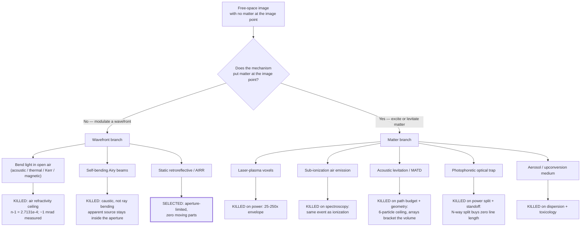

##### Laser-plasma voxels — excluded on power, not on voxel rate

| Content tier | Points | Voxel rate @30 fps | vs JSID 2025 baseline (~10⁴ vox/s) | **Wall-plug @5% efficiency** |
|---|---|---|---|---|
| Sparse wireframe head | 5×10³ | 1.5×10⁵ /s | 15× | **3.6–36 W** |
| Dense point cloud | 5×10⁴ | 1.5×10⁶ /s | 150× | **36–360 W** |
| Eye-resolution head | 7.39×10⁵ | 2.22×10⁷ /s | 2216× | **533 W – 5.3 kW** |

- **The kill:** against a **≈16 W** total cube envelope (§60.2.5 P3), photoreal plasma is **25–250× outside** it. [DERIVED] from E_pulse = I·A·τ (1.22 µJ at 10¹³ W/cm², 12.2 µJ at 10¹⁴, 10 µm spot, 155 fs) and a 5% fs-Yb wall-plug efficiency [ESTIMATE, ±2×].
- **Why no efficiency gain saves it:** a 100× wall-plug improvement does not exist — fs amplifiers are already within an order of magnitude of their quantum-defect limit. **Rate is an engineering curve; power is a wall.**
- **Two independent super-linear penalties:** above ~10 kHz a stationary density-depletion well forms (density stays ~92% between pulses at 100 kHz), so each pulse ionizes already-perturbed air [MEASURED, arXiv 2501.10198] — and JSID's 10 kHz baseline sits exactly at that crossover. Multi-spot CGH parallelism divides per-voxel energy by N (see §60.4.4's theorem).
- **Also:** Class 4 by construction; 8–80 MW peak power; safety case never started.
- **What would reopen it:** a measured air-breakdown threshold well below 10¹³ W/cm² *for the actual focusing geometry*, plus a measured plasma luminous efficiency. Two numbers, one instrumented afternoon, and they decide whether the sparse tier is a 3.6 W device or a 36 W one (`02` §12 rows 4–5).

##### Sub-ionization air emission — excluded on spin selection

The appealing idea: make air *glow* without ionizing it, sidestepping §60.4.1's power wall. It does not exist as a separate regime.

- N₂'s ground state is **X¹Σg⁺ — a singlet**. The emitters responsible for the visible/near-visible glow of excited air are the **Second Positive System (C³Πu → B³Πg, triplet→triplet)** and the **First Negative System of N₂⁺ (B²Σu⁺ → X²Σg⁺)**.
- Populating a triplet from a singlet ground state by photon absorption is **spin-forbidden**; it proceeds by *electron-impact exchange* excitation — i.e. it requires free electrons with ~10 eV of energy. The N₂⁺ emitter is an ion by definition.
- **Therefore "visible air emission" and "free electrons in the air" are the same event.** There is no low-power sub-ionization branch to find; every "make the air glow" proposal inherits §60.4.1's ledger in full.
- **Tags:** the term symbols and the spin-selection argument are [DERIVED] from standard diatomic spectroscopy; the specific threshold energies are **[UNVERIFIED]** in this repository — no spectroscopic table has been fetched or archived. **Confirm against a standard diatomic-constants compilation (Herzberg; NIST Chemistry WebBook) before this argument is used publicly.**
- **What would reopen it:** a seeded medium — which is a different mechanism (§60.4.5), with a different failure mode.

##### Acoustic levitation / MATD — excluded on path budget and, fatally, on geometry

The most seriously pursued matter-branch candidate; `docs/08`, `matd_plan.md` and the whole `eng/` simulation suite exist because of it. Its physics is verified; its product is not.

| Quantity | Value | Tag | Source |
|---|---|---|---|
| Array format / separation | 2 × 16×16 at 40 kHz, **23.4 cm** apart | [MEASURED] | *Nature* 575:320–323, 10.1038/s41586-019-1739-5 |
| Control volume | 10×10×10 cm³ | [MEASURED] | SPIE 10.1117/12.2569328 |
| POV window / frame rate | 0.1 s; 12.5 Hz visual, 10 Hz with audio | [MEASURED] | SPIE 2020 |
| Max speeds | 8.75 m/s vertical, **3.75 m/s horizontal**, corners ≤0.75 m/s | [MEASURED] | Nature 2019 / SPIE 2020 |
| Usable line per frame | **37.5 cm** (horizontal, conservative) | [DERIVED], and **contested** — `eng` C-33 labels it ASSUMED | `08` §5 |
| Multi-particle ceiling | **6 beads**, time-multiplexed | [MEASURED] | Nature 2019 |
| λ/2 trap-separation floor | 4.25 mm at 40 kHz (λ = 8.5 mm) | [DERIVED] | Nature 2019 |

- **Kill 1 — the path budget.** A 7–8 cm wireframe figurine needs ~25–45 cm of line per frame and *just* fits. A recognizable human face — eyes, nose, lips, ears — needs metres of linework [UNVERIFIED, secondary source in `matd_plan.md`]. The gap is not closed by speed: it is closed by particle count, and particle count does not help (§60.4.4).
- **Kill 2 — the 6-particle ceiling and acoustic collapse.** Co-trapped beads attract at short range through the **secondary Bjerknes / acoustic scattering force** and merge into rafts. The published escape (electrostatic "mermaid potential", PNAS 122(50):e2516865122) demonstrates **static self-assembly only**, is **fragile for n ≥ 6**, and contains **no POV display**. No group has shown a multi-bead POV display drawing a complex body.
- **Kill 3 — the geometry, which is decisive.** Two opposed arrays must **bracket** the working volume, 23.4 cm apart. The image therefore forms *inside the machine*, between two ultrasonic panels — not in the viewer's own space. This violates the same requirement AIRR was selected to satisfy, and it is not an engineering detail: the trapping field only exists between the arrays.
- **Kill 4 — scale and fidelity.** 10 cm³ of workspace is a **figurine**, not a life-size person; 4.25 mm minimum feature spacing forecloses facial expression; the verified fidelity tier is a **wireframe**.
- **Honest credits:** it is eye-safe by construction (no laser), low power, its input is a vector stream that matches the 215-float architecture byte-for-byte in spirit, and it delivers audio and localized haptics from the same array. That is why it survived as long as it did.
- **What would reopen it:** a published multi-bead POV display drawing complex geometry, or a single-sided array geometry that does not bracket the volume. Neither exists (StableLev CHI'24 and AAC CHI'26 fight instability rather than solve it).

##### Photophoretic optical traps — excluded on the power-splitting theorem and on standoff

- **Baseline:** a single mechanically-scanned cellulose particle in **<1 cm³**, sub-10 µm voxels, near-360° viewing [MEASURED, Smalley et al., *Nature* **553** 486 (2018) / DOI 10.1038/nature25176]; a 2025 review confirms **no new experimental result since 2018**, with multi-particle scaling only aspirational [PUBLISHED, arXiv 2512.09401]. Its own follow-up states *"Like all volumetric displays, OTDs lack the ability to show virtual images"* [PUBLISHED, Rogers & Smalley, *Sci. Rep.* **11** (2021)].
- **The power-splitting theorem [DERIVED].** For any scanned-particle display, total drawn line per frame is L = Σᵢ vᵢ·t. Split a source of power P across N particles and each gets P/N.
  - *Drag-limited regime:* v = F/(6πηr) ∝ P/N ⇒ **L = N·(P/N)·t/(6πηr) = same as one particle at full power.**
  - *Acceleration-limited regime:* a = F/m ∝ P/(N·m) ⇒ L = N·½(P/Nm)t² = **same again.**
  - **Splitting N ways buys exactly zero line length.** Total path is set by total power, not by particle count. This is the same theorem that kills plasma multi-spot CGH parallelism (§60.4.1) and multi-bead MATD (§60.4.3) — three mechanisms, one arithmetic.
- **The standoff penalty [DERIVED].** Peak intensity at a focus scales as I ∝ P·NA²/λ². For a fixed device aperture D at standoff a, NA ≈ D/2a, so **I ∝ (D/2a)² — trap strength falls as 1/a².** Moving the image from 5 cm to 50 cm from the device costs 100× in trap strength at constant power. A trap display is intrinsically a near-field, in-the-box device.
- **Also:** Class 4 laser, galvos plus a focus-tunable lens (moving parts), particle handling, and BYU US10129517B2 in force to 2036.
- **What would reopen it:** a trapping mechanism whose force does not scale with delivered optical power per particle. None is known.

##### Aerosol and upconversion media — excluded on dispersion and toxicology

- **Dispersion.** The mechanism requires a controlled particle or nanoparticle density *at the image location*, in **open air**, in an ordinary room. Unconfined aerosols disperse under ambient air currents (the environment spec assumes ≤0.3 m/s indoor air movement [ESTIMATE, `eng` C-60]); maintaining density means confining the volume, which reintroduces a surface and forfeits the entire free-space claim. Every published system that works this way (fog screens, Heliodisplay-class, cloud-medium displays) either confines the medium or continuously replenishes it — and their patents are expired precisely because that commercial moment passed (`05` §3.2).
- **Toxicology.** Upconversion nanoparticles (rare-earth-doped, e.g. NaYF₄:Yb,Er-class) are dispensed into the air a user is breathing, at face height, for the duration of a conversation. **Manufacturers' own safety data sheets classify UCNP powders as an inhalation hazard.** [UNVERIFIED — **no SDS has been fetched or archived in this repository.** Confirm by obtaining the SDS for a specific catalogue part and recording its H-phrases and any respirable-fraction warning before this argument is used in a published document.]
- **The decision does not depend on the toxicology being verified.** Even a perfectly inert medium fails the dispersion test and fails rule 8 (nothing else to buy) and rule 9 (any ordinary room) — a consumable that must be replenished is exactly the "no consumables" property the static family was chosen for (`09` §2).
- **What would reopen it:** nothing that keeps the device self-contained and the room ordinary.

##### Curved and self-accelerating (Airy) beams — excluded because the caustic curves, not the light

The most likely counterexample a reader will raise, and a textbook *illustration* of the aperture constraint rather than an escape from it. All five points are [PUBLISHED]:

| Point | Evidence |
|---|---|
| The intensity **centroid travels in a straight line** (Ehrenfest / transverse-momentum conservation) | Efremidis et al., *Optica* **6** 686 (2019): *"the intensity centroid of an optical beam is expected to move in a straight line — without acceleration"* |
| What curves is the **caustic** — the envelope of a fan of perfectly straight rays | Berry, *J. Opt.* **19** 055601 (2017): *"Caustics are curved even though the rays are straight"* |
| **The bend is paid for with aperture.** The curved lobe is fed by rays launched from the far tail of the aperture distribution; bending further requires a *wider* aperture | Kaganovsky & Heyman (IOS Press 2013); Droulias et al., arXiv 2410.08099: *"by reducing the size of the aperture… gradually reducing the ability of a beam to bend"* |
| **A caustic is invisible without matter.** The canonical "visible curved beam" is visible because it ionizes air into a glowing channel | Berry quoting Stavroudis; Polynkin et al., *Science* **324** 229 (2009) |
| The >90° nonparaxial results start from an aperture whose angular cone is *already* a half-space; self-healing is other straight rays that never met the obstruction | Kaminer et al., *PRL* **108** 163901 (2012); Aiello et al., *Opt. Express* **25** 19147 (2017) |

- **The quantitative form of the kill [DERIVED]:** the apparent source of an Airy lobe lands **inside** the launch aperture, and the useful transverse excursion is bounded by the aperture's own extent — for a device of aperture D, the effective image half-width obeys x_eff ≥ 2·δ, where δ is the launch-lobe scale: **bending is a near-field effect of a large aperture, and at normal viewing distance there is no bending budget left.**
- **What would reopen it:** a published image placed outside the launch aperture's angular silhouette with no matter at the image location. None was found in three independent searches (`01` §4.3d, §4.3g) — with the corpus caveat of C6.

##### "Make the air itself a lens" — the refractivity ceiling, for completeness

Included because it is the most intuitively appealing escape and because it fails against a single hard bound rather than against difficulty. Air's **total** refractivity is **(n−1) = 2.7131×10⁻⁴** at 20 °C / 101325 Pa [PUBLISHED, Jones, *J. Res. NBS* **86**(1) 27 (1981)], and n−1 ∝ P/T. No scheme that merely redistributes air can exceed it.

| Mechanism | Achieved Δn | Measured bending | Source | Tag |
|---|---|---|---|---|
| Acoustic, 140 dB SPL | ~10⁻⁷ | **1.5 mrad** over 70 mm × 7 passes | Schrödel et al., *Nat. Photon.* **18** 54 (2024) | [MEASURED] |
| Thermal, 700 K filament core | ~1.4×10⁻⁴ | **0.3 mrad** | Schäfer et al., *Rev. Sci. Instrum.* **83** 103506 (2012) | [MEASURED] |
| Optical Kerr | 1.45×10⁻⁵ at clamping | — | n₂ = 2.9×10⁻¹⁹ cm²/W, Nibbering, *JOSA B* **14** 650 (1997) | [PUBLISHED] |
| Magnetic (Cotton–Mouton) | needs ~6,600 T for 10⁻⁴ | — | Brandi et al., *JOSA B* **15** 1278 (1998) | [PUBLISHED] |

**Two independent measurements — acoustic and thermal, entirely different physics — land within 5× of each other, because both are bounded by the same ceiling.** Three further closures: Bragg deflection angle is set by λ_opt/Λ_acoustic, so 30° at 550 nm needs ~310 MHz in air (two orders beyond the ultrasonic absorption ceiling) [DERIVED]; thermal gradients steer only within ~1° of grazing (√(2Δn/n)) [DERIVED]; and the Kerr route hits the plasma wall first (~7× the ionization intensity), where §60.4.1 applies.

---

#### Ranked open problems

Ranked by **how much of this document dies if the answer is bad**, not by difficulty. Effort is the author's [ESTIMATE].

| # | Open problem | State | What closes it | Effort | Kills what if bad |
|---|---|---|---|---|---|
| **O1** | **Every quantitative AIRR figure is unmeasured** — efficiency (A4), viewing cone (A6), resolution, magnification. The selected engine family rests on reasoning from the mechanism | [UNVERIFIED] | Document-delivery access to *Optics Express*, *OSA Continuum*, *Optical Review* (Yamamoto/Suyama line; the named leads in `02` §6.4 incl. the AIRR line-spread-function model and the head-display tolerance study), **then** a bench build of design 03 | Days, ~$100s | The brightness, resolution and fold budget of every design in `09` |
| **O2** | **The repository states two mutually exclusive engine selections** — `08` selects MATD as "verified, SELECTED"; `09`, committed later, rules the mechanism out | [DERIVED] from git order | An editorial decision plus a dated supersession note in `08` §1, in the `METHODOLOGY.md` §4 style | Hours | Nothing physical; everything reputational. A reader cannot tell what the product is |
| **O3** | **Ψ is unquantified** — the entire budget chain (`06` §1) descends from *assumed* perceptual requirements, and it is also the only source of defensible patentable novelty (`05` §5.2b) | [UNVERIFIED] | The S5 perceptual battery / `experiments/perceptual-quality/` first experiment: minimum channel count and fidelity for conversational presence, MOS not PSNR | Weeks, VR headset + subjects | Potentially relaxes every downstream budget by up to 116×; or shows the optical target was mis-set (failure mode F5) |
| **O4** | **Thermal has never been modelled for the selected form factors.** `simulation/s3_thermal/` models a 100 mm cube; the products are slabs from 4.4 L to wall-scale | [UNVERIFIED] | Re-run `thermal_sweep.py` with slab geometry and a panel-class load; the bright-panel requirement (A5) is the new dominant term | Hours (CPU only) | The binding constraint of the whole prior analysis may simply evaporate — or move to panel backlight power |
| **O5** | **Estimator licenses (GVHMR, SMIRK, HaMeR) unverified**, presumed SMPL/FLAME/MANO-dependent | [UNVERIFIED] | Read three licenses; build the rig-space adapter regardless | Hours | The shipping capture stack. `03` §13.3 calls it the largest license risk |
| **O6** | **The Jetson port is unvalidated** — three estimators concurrent, 30 min sustained, in a sealed enclosure | [UNVERIFIED] | `03` §14 measurement #1, reporting peak fps, sustained fps and throttle onset separately | One Jetson + a week | The latency budget and the on-cube compute premise (H1) |
| **O7** | **FTO on the selected family is the highest-exposure row in `05` §8** — and the design change moved us *onto* it | [PUBLISHED] art, [UNVERIFIED] exposure | Buy a licensed ASKA3D-class plate (patent exhaustion); attorney opinion on Utsunomiya US11340475B2 and Toppan US11947139B2 | Weeks + legal fees | Commercialization, not engineering |
| **O8** | **The folio's three-surface fold is unresolved** — AIRR needs three surfaces in fixed relative geometry, collapsed into a book hinge | [UNVERIFIED] | CAD kinematics + a printed mock-up | Days | Design 06 only (the portable form) |
| **O9** | **Tracking prediction under latency** — pupil error must stay under 6 mm through 76–177 ms; at 0.2 m/s head sway, 100 ms is 20 mm | [DERIVED], untested | S6.2 against real head-motion traces | GPU only | Only the tracked-CGH branch (`06` §2 calls it the highest kill risk there); not the AIRR family, which is untracked |
| **O10** | **Corpus circularity and venue coverage** (C6) — every negative result in this project is a statement about a keyword-built arXiv-only corpus | [DERIVED] | Mechanism-first and citation-graph searching; add SPIE/JSID/SID/IDW/Optical Review coverage | Ongoing | Any "nobody has done X" claim, including G13 |
| **O11** | **Retroreflector cost and availability scale with area**; no sourcing pass has been run | [UNVERIFIED] | Quote a retroreflector sheet and a beamsplitter at 50 cm and at A4 | Hours | The cost model of designs 01–04 |
| **O12** | **The 18-month patent blackout** — anything filed after ~Feb 2025 by Google, IKIN, Looking Glass, Meta, Apple or the aerial-imaging assignees is invisible | [PUBLISHED] structural fact | **No search can close it.** Re-run the landscape in 18 months | — | Any novelty argument |
| **O13** | **Standards cited from memory** — IEC 62368-1 touch limits (P4), IEC 60825-1 MPE (S3) | [UNVERIFIED] | Read the two clauses | Hours | Design sign-off, not design direction |
| **O14** | **Multi-view fusion has no published justification** — the 3–4 camera array's entire rationale | [UNVERIFIED] | `03` §14 measurement #6 | Days | Camera count, and therefore BOM and MIPI budget |

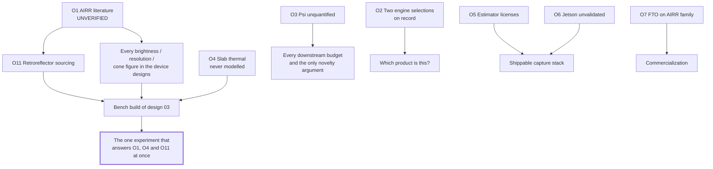

**The single highest-leverage action in this table is the bench build of design 03**, because it converts O1, O4 and O11 from literature questions into measurements simultaneously, using sheet optics and a commodity panel.

---

#### IP and freedom-to-operate summary

Condensed from `05_RESEARCH_PRIOR_ART_AND_PATENT_ARCHITECTURE.md`. **None of this is legal advice**; it is an engineer's prior-art record. Claim scope was judged from claim-1 summaries, not from file histories.

##### The disclosure clocks have already started

`github.com/tamim1089/tayf` is a **public** repository (visibility verified by unauthenticated fetch, 2026-08-15). First public disclosure occurred **on or after 2026-08-14**, and the published content includes the entire architecture, the theory formalism, the wire format in executable form, and all four original candidate inventive concepts verbatim.

| Jurisdiction | Rule | Consequence |
|---|---|---|
| EPO / most of Europe | Absolute novelty (EPC Art. 54; Art. 55 exceptions do not cover a GitHub push) | **Disclosed subject matter very likely unpatentable. Not recoverable.** |
| China (CNIPA) | Absolute novelty, narrow 6-month exceptions | **Very likely unpatentable for disclosed matter.** |
| United States | 35 U.S.C. §102(b)(1), 1-year grace for the inventor's own disclosure | **Any US filing on disclosed matter must be on file by ~2027-08-14.** |
| Japan / Korea | 12-month exception, **procedural** — must be claimed with supporting proof in the statutory window | Salvageable **only if the formalities are executed.** |

- **The upside, which is real:** the repository is now citable prior art against *anyone else's* later application on the same architecture. For a solo project defended by execution speed rather than a litigated portfolio, this is a defensible position that costs nothing to maintain (`05` §2.3).
- **Two further disclosure events were scheduled:** hackathon submission 2026-08-23 and public demo 2026-09-13. **Read the competition's IP terms before submitting** — assignment, licence-grant or mandatory-publication clauses change every calculation above. `05` §12 ranks this the highest value-per-minute action in the document.
- **Newly closed window, flagged by this audit.** `05` §7.4 argued that a **design patent / registered design on the enclosure was "the one piece of IP TAYF has not already given away."** That is no longer true: `models/obj`, `models/png`, `models/viewer.html` and the six device designs are present on `origin/main` (verified this session by `git log origin/main`, HEAD `8e76259`). **The industrial-design disclosure has occurred**, and any registered-design filing now depends on the 12-month grace where one exists and is foreclosed where it does not. [DERIVED from the git ref; upgrade to [PUBLISHED] with an unauthenticated fetch of the repository page confirming those paths are visible.]

##### Novelty: the architecture is the prior art

`05` §4's overlap matrix found **10 of 12 architectural elements anticipated outright**. The most consequential:

| TAYF element | Closest art | Verdict |
|---|---|---|
| Parametric-state-only transmission | **US6044168A** (Texas Instruments, 1996 priority, **expired**) — transmit eigenface parameters instead of the image, reconstruct on a 3D model at the receiver | Anticipated for thirty years. Free to practise; zero novelty |
| Enrolled model + per-frame parameters | **US11683448B2** (Duelight, priority 2018-01-17, **in force to 2038**) — initial face model with nodal points, then real-time nodal-point updates | Anticipated; and the top FTO item |
| Observer-tracked selection of emitted views | **US11474597B2** (Google, **in force to 2040**) — per-eye view rendered from eye-tracker location, displayed only into that eye's viewing zone | Anticipated at exactly the level TAYF stated it |
| Symmetric capture-and-3D-display terminals | **US10327014B2** (Google, to 2037); JP4845336B2 (expired) | Anticipated |
| Free-space image formation | The whole of `05` §3.1–3.2 | Anticipated as a category; an FTO problem before a novelty problem |
| Neural gap-filling between sparse views | US11425363B2 (Looking Glass) | Anticipated in substance |

**The target question — is there a patent on a small cube that both captures a person and displays a remote person in free space? — returned no such patent across three search passes.** That is the only white space found, and `05` §5 explains why it is thin: the near misses each fail on a different axis, and a combination of known elements yielding predictable results is obvious under KSR.

##### Freedom to operate — the watchlist

| Path | Blocking art in force | Exposure | Mitigation |
|---|---|---|---|
| **Retroreflective / AIRR — the selected family** | Utsunomiya **US11340475B2** (2038), Asukanet **US8867136B2** (2030), Toppan US11947139B2 (2041), NICT/Stanley US8724224B2 (~2032) | **High** | **Buy a genuine licensed plate — patent exhaustion. Do not fabricate a corner-reflector array in-house** |
| Eye/observer-tracked view selection | **Google US11474597B2** (2040) | Moderate–high, and it applies to the *software* regardless of panel | The untracked AIRR family is outside it by construction — an accidental but real benefit of the design change |
| Parametric face-model transport | **Duelight US11683448B2** (2038) | Moderate | Body+face+hands over a non-face rig is an argument, not a clearance |
| Laser plasma | Pixie Dust US10228653B2 (2036) | High — but moot, excluded on power | — |
| Photophoretic trap | BYU US10129517B2 (2036) | Moot, excluded on physics | — |
| Acoustic trapping | UCL WO2023227890A1 — **ceased at WO stage, national status unconfirmed** | Moot if MATD stays excluded | Confirm national phase before any acoustic hardware |
| Light-field panel (hackathon instrument) | Looking Glass / Leia / LFL / Google-Raxium portfolios | Low if a commercial panel is purchased (exhaustion) | Do not build a custom multiview optic |

**Note the risk transfer:** the move to the static retroreflective family *reduced* exposure to Google US11474597B2 (no eye tracking) and *increased* exposure to the AIRR patent family, which `05` §8 already rates the highest-exposure row. `05` was written before `09` and does not yet reflect that the highest-exposure path is now the selected one.

##### Search integrity and its limits

| Metric | Value |
|---|---|
| Patent documents recorded | ~95 |
| **[V]** verified against the full record | **15** |
| **[R]** resolved (number + title + assignee seen together) | ~55 |
| **[U]** known art with **no number resolved** | 14 leads |
| **Fabricated, guessed, or reconstructed numbers** | **0** |
| Matrix rows anticipated | 10 of 12 |

Stated gaps, so this is not mistaken for a completed search (`05` §10): no CPC/IPC classification sweep; no citation-graph expansion from the closest references (the highest-yield remaining step); no claim-by-claim reading or file histories; no legal-status verification at national registers; the 18-month publication blackout; under-coverage of JP/KR/CN filings, which dominate aerial imaging; and **no number resolved for Meta (Codec Avatars), Microsoft (Holoportation), or Apple (Persona)** — their absence reflects search failure, not absence of art.

**Strategic reading, unchanged:** TAYF's patent position today is approximately zero because the architecture *is* the prior art. The position becomes non-zero only when a measurement (O3) or an optical build (O1) produces something the literature does not contain. Until then the correct actions are: keep shipping, rely on the defensive publication already achieved, read the hackathon IP terms, and take nothing to an attorney until there is a number to advise on.

---

---

## 10. Build order, and what to do on Monday

Nothing below needs a discovery. Every step is engineering against numbers already in this document.

### 10.1 The critical path

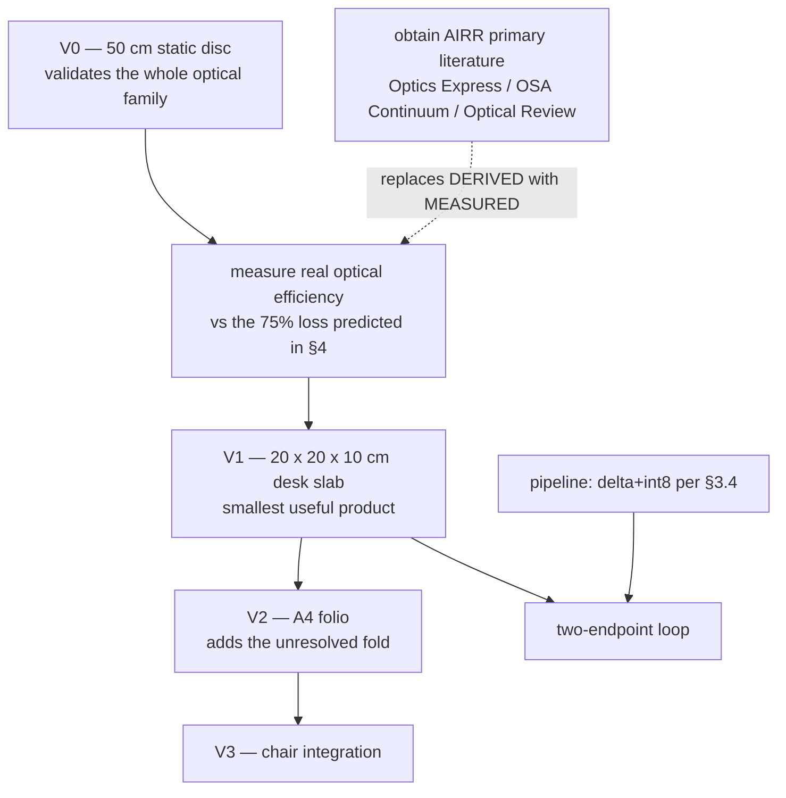

### 10.2 Ordered actions

| # | Action | Why now | Blocked by |
|---|---|---|---|
| 1 | **Build V0, the 50 cm static disc** | Simplest configuration; validates AIRR end to end with no hinge, no folding, no moving parts | Sourcing a retroreflector sheet and a beamsplitter |
| 2 | **Measure optical efficiency** against §4's predicted ~75% loss | Every brightness figure in this document is `[DERIVED]`; one measurement upgrades them all | V0 |
| 3 | **Obtain the AIRR primary literature** | The single largest `[UNVERIFIED]` block. Paywalled in Optics Express / OSA Continuum / Optical Review — not on arXiv, which is exactly how it was missed for two days | Institutional or document-delivery access |
| 4 | **Change `pipeline/schema.py` to delta + int8** | §3.4 measured the current spec wrong; the fix halves bandwidth and removes a dependency | Nothing — **done, see `encode_delta`** |
| 5 | **Commit the avatar-model licence** (Anny or MHR, never SMPL-X) | Blocks writing capture code against a rig topology; SMPL-X is non-commercial and would have to be ripped out later | A decision |
| 6 | **Register on the Nokia NaC portal** | Blocks every live CAMARA call | An account |
| 7 | **Benchmark the estimator stack on Jetson-class silicon** | The single largest inherited assumption: Mon3tr's rates are PC-class and the port is `[UNVERIFIED]` | One Jetson |

Actions 5 and 6 are decisions, not research, and can be closed this week.

### 10.3 What would falsify the design

Stated so the project can be wrong quickly and cheaply rather than slowly and expensively:

| If | Then |
|---|---|
| Measured AIRR efficiency is far below 25% | Source panel luminance becomes the binding constraint; the device grows or dims |
| The three-surface fold proves unmanufacturable at book scale | The folio dies; the disc and the chair are unaffected |
| Jetson-class inference cannot hold the latency budget | Either the estimator stack shrinks or compute moves off-device, weakening self-containment |
| Retroreflector cost scales badly with area | Small formats survive; the mirror and doorway become uneconomic |

None of these threatens the physics. All are measurable with V0 and one Jetson.

---

## 11. Closing statement

The project set out to build a 10 cm cube that would place a whole standing person in your chair. That device cannot be built by anyone, at any budget, and this document records the six independent physical laws that forbid it — clipping, nitrogen's spin selection rule, the plasma power wall, numerical aperture, Bjerknes collapse, and pulmonary toxicology. Each was tested rather than assumed, and each is written up in §9 so nobody has to re-tread them.

What survived is better specified than the original ever was: **a family of devices, sized by geometry rather than by wish, that put a life-size person in open air in an ordinary room — no headset, no glasses, nothing worn, nothing else to buy, and no moving parts.** From a 20 cm slab on a desk to a chair you sit opposite. The capture and transport half is solved and measured. The optical half is static sheet optics and a display panel.

The honest position is not that TAYF is finished. It is that **the remaining work is engineering, and every open item has a name, a number, and a way to close it.**

*Confidence tags in this document are load-bearing. `[MEASURED]` means someone measured it. `[UNVERIFIED]` means we believe it and could be wrong. A document that blurs those two is worth less than no document.*

---

*Rebuild this document with `python3 models/assemble_doc.py`. §1–§3 are hand-written above the assembly marker; §4–§9 are spliced from the section sources; §10–§11 come from `models/doc_footer.md`. Corrections that supersede an authored section are applied by the assembler so they survive every rebuild.*
