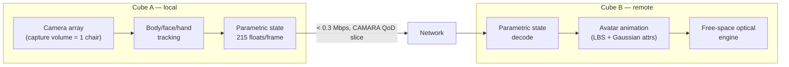
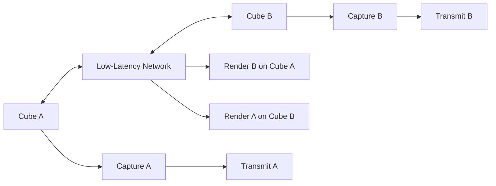

# TAYF System Architecture

Canonical reference — every other doc in this repo links back here. Source: `FilesPlan.md` §1-2, `research/deepseek_research.md`, `research/notes.md`.

## One-sentence description

Two identical ~10×10×10cm cubes. Each captures its local human, computes a compact dynamic representation, streams it over an ordinary network connection, and reconstructs the remote human as free-space light at the other cube. The network carries a person's *state*, not their video.

## Pipeline

## Stage status

| Stage | Status | Evidence | Spec doc |
|---|---|---|---|
| Capture | Solved, off-the-shelf | Mon3tr (arXiv 2601.07518): parallel monocular estimators at 71-377fps | `pipeline/capture/README.md`, `hardware/camera-rig.md` |
| Representation | Solved architecturally | Mon3tr: ~33s one-time avatar build, 215 floats/frame drives it | `pipeline/avatar/README.md`, `pipeline/schema.py` |
| Transport | Solved | Mon3tr: <0.2 Mbps, ~80ms e2e over WebRTC; CAMARA QoD for guaranteed latency | `pipeline/transport/README.md`, `agent/README.md` |
| Free-space optical emission | **Not solved** (photoreal); buildable (light-field/AIP) | JSID 2025: 68×42mm, ~10k voxels/s — sparse, not photoreal | `hardware/optical-engine.md` |

## Module ownership

- **On-cube edge SoC** runs capture → representation → transport (sender side) and decode → animation → optical-engine driver (receiver side). See `hardware/power-thermal.md` for why this, not the remote RTX 5060, is the real constraint.
- **Remote RTX 5060** is used only for offline avatar enrollment (one-time per-user build), never in the runtime loop.
- **Agent layer** (`agent/`) is a separate concern: it watches network conditions via CAMARA Congestion Insights and requests QoD/slicing, it does not touch the media pipeline.

## Environment independence

Per `research/notes.md` §17: the cube must not require a wall, projection surface, special chair, dedicated stage, capture booth, or external tracking infrastructure. Environment sensing can still be useful (e.g. ambient light for the optical engine's brightness compensation), but it is never a mandatory optical display surface — this is a hard constraint on every hardware/software decision in this repo, not a soft preference. `hardware/optical-engine.md`'s hackathon-track light-field/AIP panel is a self-contained emissive surface for exactly this reason (it doesn't project onto anything external).

## Symmetric bidirectional architecture

Both endpoints run the same architecture (`Cube A = Cube B`, not "capture device + separate display system") — every cube simultaneously observes its local user, encodes and transmits local state, receives and renders remote state, per `research/notes.md` §35-36:

This is why `pipeline/` has no separate "sender" and "receiver" codebases — every module (`capture/`, `avatar/`, `transport/`, `view_synthesis/`) runs on both cubes simultaneously, in both directions.

## Two build tracks

See `docs/roadmap.md` for the full hackathon-track vs north-star split and dates. For the theoretical framing underneath both tracks (why the optical problem is hard, what the four research tracks are, the testable hypotheses), see `docs/theory.md`. For how spatial coordinates and observer position are handled, see `docs/calibration.md`.
