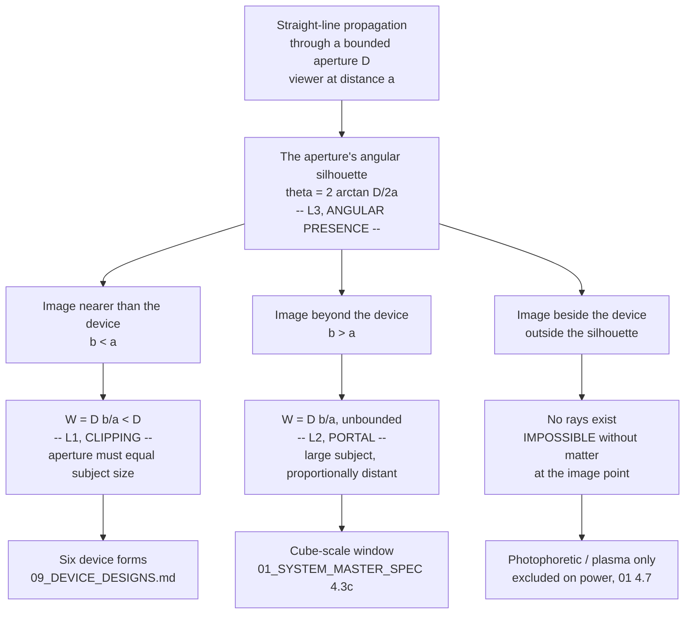
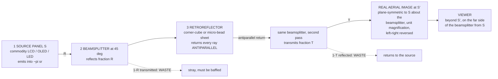

## Optical Engineering — the physics and the engine

**Scope.** Everything between "the receiver has a 215-float driving state and an animated avatar" and "a human sees a person in the room." Three geometric laws set every dimension of every device; one static optical mechanism (AIRR) satisfies them with no moving parts; the remaining engineering is a photometric budget and a resolution budget. This section derives all of it and marks exactly where the evidence stops.

> **Status change, 2026-08-16 — the AIRR primary literature has been read.** `docs/09_DEVICE_DESIGNS.md` §3, `docs/02_FREE_SPACE_OPTICAL_ENGINEERING.md` §6.4 and `experiments/aerial-imaging/README.md` all record that the Yamamoto/Suyama AIRR line was unreachable (JS-gated, login-walled, 403) and that every brightness, resolution and viewing-angle figure in this project was therefore reasoned rather than sourced. **That is no longer true.** Yamamoto's 2017 review is open access on J-Stage and was retrieved and read in full today: 山本裕紹, *「再帰反射による空中結像（AIRR）による空中ディスプレイ」* / "Aerial Display with Aerial Imaging by Retro-Reflection (AIRR)", **日本画像学会誌 (J. Imaging Soc. Japan) 56(4), 341–351 (2017)**, `https://www.jstage.jst.go.jp/article/isj/56/4/56_341/_pdf`. It supplies measured viewing angle, a measured efficiency improvement, a life-scale demonstration at 2.4 m diagonal, and — most consequentially — an alignment-insensitivity result that the zero-moving-parts finding depends on. Where this section contradicts docs 02 or 09, the contradiction is flagged inline with the number that caused it, per `research/METHODOLOGY.md` §4.

---

### 1. The three laws that decide everything

Three statements, each derived below with worked numbers. They are not three independent constraints — §1.4 shows they are one identity read three ways — but they are stated separately because each answers a different design question, and conflating them is how this project previously lost two days.

| Law | Question it answers | Statement |
|---|---|---|
| **L1 Aperture / clipping** | How big can the image be *in my space*? | `W_image ≤ D_aperture` |
| **L2 Portal geometry** | How big can the image be *beyond the device*? | `W = D·(b/a)`, unbounded as `b` grows |
| **L3 Angular presence** | How big must the *device* be? | `θ_image = 2·arctan(D / 2a)`, independent of `b` |

Symbols throughout: `D` = exit-aperture width, `a` = viewer-to-aperture distance, `b` = viewer-to-image distance, `W` = image width, `θ` = angle subtended at the viewer's eye.

#### 1.1 L1 — Aperture and clipping

**Statement.** For an image that is to appear in the viewer's own space — nearer to the viewer than the device is — the image can be no wider than the exit aperture. `W_image ≤ D_aperture`.

**Derivation** [DERIVED, and identical to `01_SYSTEM_MASTER_SPEC.md` §4.3b, which this section does not restate or amend]. Light reaches the eye only along straight lines that pass through the aperture. The set of points the device can illuminate is therefore the cone with apex at the eye and base the aperture rim. At distance `b` from the eye, that cone has width `D·(b/a)`. For `b < a` the ratio is less than one, so `W < D` always. Put a lamp where the eye is: **the region the device can fill with image is exactly the shadow its aperture casts.** In front of the aperture the shadow has not yet spread; beside it there is no shadow at all.

**Worked numbers** [DERIVED]:

| Subject at life size | Width | Minimum aperture for an in-your-space image |
|---|---|---|
| Face | 220 mm | 220 mm |
| Head | 250 mm | 250 mm |
| Head + neck | 320 mm | 320 mm |
| Head + shoulders (bust) | 500 mm | 500 mm |
| Seated upper body | 800 mm | 800 mm |
| Standing full body | 1700 mm | 1700 mm |

This table is `09_DEVICE_DESIGNS.md` §1 with the face row added, and it is the whole reason the six device forms have the sizes they do. **There is no optical cleverness available here.** Pick the subject; the aperture follows.

**The law is published, in a top journal, by the field's own authority, and it has a name.** Smalley et al., *Nature* **553**, 486–490 (2018), DOI `10.1038/nature25176` [PUBLISHED — DOI verified in `02_...OPTICAL_ENGINEERING.md` §13 ledger; quotation transcribed in `01_SYSTEM_MASTER_SPEC.md` §4.3g]:

> *"**Clipping** restricts the utility of all three-dimensional displays that modulate light at a two-dimensional surface with an edge boundary; these include holographic displays, nanophotonic arrays, plasmonic displays, lenticular or lenslet displays and all technologies in which the light scattering surface and the image point are physically separate."*

Two things to extract. First, the enumeration is exhaustive of the redirect class — holography does not escape it, metasurfaces do not escape it, light-field panels do not escape it. Second, the paper names **the sole exception in its own qualifying clause**: technologies in which the scattering surface and the image point are *not* physically separate. That is, **put matter at the image point.** Smalley's own display does exactly that (a photophoretically trapped cellulose particle), and its follow-up (Rogers & Smalley, *Sci. Rep.* **11**, 2021) states the reciprocal limitation — *"Like all volumetric displays, OTDs lack the ability to show virtual images"* [PUBLISHED, cited at record level in `01_...` §4.3g; full text not read here].

**The inventor of AIRR states the same law about his own mechanism** [PUBLISHED, read in full 2026-08-16 — Yamamoto 2017, Fig. 11(a) caption and §3.3]:

> *"In the conventional AIRR, the aerial image is visible between an eye and the retro-reflector."*

and, in the body text: *「従来の AIRR において、形成された空中像を観察できる範囲は、視点位置からビームスプリッターを通して再帰反射素子が見える範囲に限られる」* — "the range over which the formed aerial image can be observed is limited to the range in which the retro-reflector is visible from the viewpoint through the beam splitter." His own fix, in §3.3 of the same paper, is **to enlarge the aperture**: laminate a *transparent* retroreflector over the whole LED panel so the retroreflector-visible region covers the panel-visible region too. He does not attempt to escape the cone, because there is nothing to escape it into.

**Escape routes are closed and documented.** `01_SYSTEM_MASTER_SPEC.md` §4.3d–§4.3g searched the three premises the law rests on — straight-line propagation (attacked with Airy beams), device-only emission (attacked with air-as-a-lens), and fixed aperture extent — and closed all three, the middle one against a hard physical ceiling (air's total refractivity `n−1 = 2.7131×10⁻⁴`, Jones, *J. Res. NBS* **86**(1) 27, 1981). **This section does not reopen them.**

#### 1.2 L2 — Portal geometry

**Statement.** For an image *beyond* the device, `W = D·(b/a)`, and since `b/a` is unbounded, `W` is unbounded. A small aperture can show an arbitrarily large subject, provided the subject appears proportionally far away.

**Derivation** [DERIVED]. Same cone, evaluated at `b > a`. This is not a different law from L1; it is the same expression on the other side of `b = a`.

**Worked table**, for a 50 cm disc (device 03 in `09_DEVICE_DESIGNS.md`) with the viewer at `a = 1.0 m` [DERIVED]:

| Image distance `b` | `b/a` | Max visible width `W = D·b/a` | What that is |
|---|---|---|---|
| 0.5 m | 0.5 | 250 mm | a head, floating half-way to the disc |
| 1.0 m | 1.0 | 500 mm | head + shoulders, at the disc plane |
| 2.0 m | 2.0 | 1.00 m | most of a seated body |
| **3.4 m** | **3.4** | **1.70 m** | **a standing adult, life size** |
| 5.0 m | 5.0 | 2.50 m | a standing adult with room around them |
| **9.0 m** | **9.0** | **4.50 m** | **a car, life size** |
| 20 m | 20 | 10.0 m | a bus, or a building façade |

**Check the two headline rows.** `W = 0.5 × (3.4 / 1.0) = 1.70 m` ✓. `W = 0.5 × (9.0 / 1.0) = 4.50 m` ✓.

The same arithmetic at the cube scale reproduces `01_SYSTEM_MASTER_SPEC.md` §4.3b exactly (`D = 100 mm`, `a = 1 m`, `b = 2.5 m` → 250 mm), which is the consistency check that this section has not drifted from the spec.

**What portal mode costs, stated plainly** [DERIVED]: the viewer sees the subject *through* a window of fixed angular size (§1.3), so lateral head movement slides the visible slice across the subject like a porthole, and the viewer must sit roughly on the aperture→subject axis. It is a window into another space, not a free-roaming hologram. **Both modes are legitimate and every device in this project must declare which one it is using.** The six forms in `09_DEVICE_DESIGNS.md` are all L1 (image in the viewer's space, at or just in front of the aperture plane); the 100 mm cube of the original concept can only work in L2.

#### 1.3 L3 — Angular presence

**Statement.** Presence is an angle, not a size. The perceptual variable is what the retina receives, which is the angle the subject subtends — and the image can never subtend a larger angle than the aperture does.

**Derivation** [DERIVED]. The angle subtended at the viewer by an image of width `W` at distance `b` is `θ = 2·arctan(W / 2b)`. Substituting L2's `W = D·(b/a)`:

```
θ_image = 2·arctan( D·(b/a) / 2b ) = 2·arctan( D / 2a ) = θ_aperture
```

**`b` cancels.** The image subtends exactly the angle the aperture subtends, always, in both modes. Pushing the image further away buys apparent size and apparent distance in exact proportion — a bigger person, correspondingly further off — and buys *no* additional angular presence. **This is the deepest of the three statements and it is the one that tells you what to buy: a device that subtends the subject's angle at the distance you will actually sit from it.**

**Verification against the spec.** `01_SYSTEM_MASTER_SPEC.md` §4.3c tabulates a "window" column for a 100 mm aperture and never states its formula. `2·arctan(D/2a)` reproduces it exactly: `a = 1.0 m → 5.72°` (spec: 5.7°); `a = 0.6 m → 9.53°` (spec: 9.5°); `a = 0.3 m → 18.92°` (spec: 18.9°). [DERIVED — three independent agreements confirm L3 is the identity behind the spec's own table.]

**Reference angles for a human subject** [DERIVED, `θ = 2·arctan(W / 2d)` at `d = 1.0 m`]:

| Subject | Extent | θ at 1 m | Note |
|---|---|---|---|
| **Face** | 0.22 m wide | **12.6°** | `2·arctan(0.11) = 12.56°` |
| Head incl. hair/ears | 0.25 m wide | 14.3° | the figure `01_...` §4.2 uses for the SBP budget |
| **Upper body, seated** | 0.80 m wide | **43.6°** | `2·arctan(0.40) = 43.60°`; shoulder span plus arms |
| **Full body, standing** | 1.70 m tall | **80.7°** | `2·arctan(0.85) = 80.72°`; **this one is vertical** — stature, not breadth |

The full-body number is the vertical subtense of a standing adult; a device serving it needs 1.70 m in the *vertical* direction and only ~0.55 m across (hence device 01, the Mirror, at 55 × 175 cm). Mixing the horizontal and vertical axes here produces apertures that are wrong by 3×.

**The design table: aperture width required, as a function of where the user sits** [DERIVED, `D = 2a·tan(θ/2)`, i.e. `D = 0.22a` / `0.80a` / `1.70a`]:

| Sitting distance `a` | Face (12.6°) | Bust (28.1°)¹ | Seated upper body (43.6°) | Standing full body (80.7°, vertical) |
|---|---|---|---|---|
| 0.3 m | 66 mm | 150 mm | 240 mm | 510 mm |
| 0.4 m | 88 mm | 200 mm | 320 mm | 680 mm |
| 0.5 m | 110 mm | 250 mm | 400 mm | 850 mm |
| **0.6 m** | **132 mm** | **300 mm** | **480 mm** | 1020 mm |
| 0.8 m | 176 mm | 400 mm | 640 mm | 1360 mm |
| **1.0 m** | **220 mm** | **500 mm** | **800 mm** | **1700 mm** |
| 1.5 m | 330 mm | 750 mm | 1200 mm | 2550 mm |
| 2.0 m | 440 mm | 1000 mm | 1600 mm | 3400 mm |

¹ bust = 0.50 m across, `2·arctan(0.25) = 28.07°`.

**Read the diagonal, not the rows.** The A4 folio's 300 × 210 mm aperture delivers a face at 12.6° from **1.36 m** and a bust at 28.1° from **0.60 m** — both natural conversational distances, which is why the smallest bag-portable form is not a compromise. The 50 cm disc delivers a bust at 1.0 m. The 170 cm mirror is the *only* form that delivers a standing adult, and only at 1.0 m; at 2 m you would need 3.4 m of device, which is why "full body across the room" is not on the menu at any price.

**The conversion this makes possible** [DERIVED]: an aperture that is too small for a subject at your current distance becomes adequate if you move closer, in exact linear proportion. This is the same lever `01_...` §4.3c identified (`a` is a free variable) restated in the units a product designer uses. It is also the reason AR glasses are not a counterexample to L1 — at `a ≈ 2 cm`, a 2 cm eyepiece subtends ~53°, so `D·(b/a)` reaches 2 m at 2 m distance without violating anything.

#### 1.4 The three laws are one law



One consequence worth stating because it is repeatedly rediscovered: **an aperture is an emitting *area*, not a solid volume.** Nothing in L1–L3 involves the device's depth. Depth is set only by the source setback (§4.2), which is why every buildable form is a slab and none is a box.

---

### 2. AIRR — the mechanism, in full

**AIRR (Aerial Imaging by Retro-Reflection)** is Yamamoto & Suyama's mechanism (Utsunomiya University; commercialised in the adjacent MMAP form as ASKA3D). Three static elements, no mechanism, and a real image in the viewer's own space.

#### 2.1 The ray construction, and why the image lands where it does



**Why the image forms at `S'`** [DERIVED; confirmed experimentally in Yamamoto 2017 Fig. 2 by intercepting the image on a card]. A ray leaving source point `S` and reflecting off the beamsplitter at point `Q` travels onward as though it had come from `S'`, the mirror image of `S` in the beamsplitter plane. The retroreflector returns it *antiparallel*, so it retraces that same line back through `Q`; the fraction that transmits at `Q` continues along the line toward `S'` and converges there. **Every ray does this, from every point of the retroreflector, so the convergence is exact and the image is real.** Yamamoto verifies it directly: a white card at the plane-symmetric position shows sharp, left-right-reversed characters; move the card fore or aft and they blur (Fig. 2a–c) [MEASURED].

**Three properties fall straight out of that construction, and all three are load-bearing:**

1. **Unit magnification, exactly.** `S'` is a mirror image, and mirror images are the same size. `W_image = W_source`, always. This is the geometric reason `W ≤ D` is *tight* for AIRR rather than merely an upper bound: the aperture and the image are the same object seen twice. [DERIVED; consistent with `02_...` §6.4.]
2. **Image position depends only on the source and the beamsplitter — not on the retroreflector at all.** Retroreflection returns a ray along its own line regardless of where the retroreflective surface sits or which way it faces. Yamamoto demonstrates this with a *curved* retroreflector (Fig. 5) and with retroreflective **fabric** draped in folds (Fig. 6): the aerial image is unaffected by the curvature. His words: *「空中像の位置は光源とハーフミラーの位置で決まり、再帰反射素子の設置位置や形状には依存しない」* — "the position of the aerial image is determined by the positions of the light source and the half mirror, and does not depend on the installation position or shape of the retro-reflector." [MEASURED — Yamamoto 2017 §2.2, Figs. 5–6, citing Yamamoto & Suyama, *Proc. SPIE* **8648**, 86480Q (2013).] **This is the single most important manufacturing fact about AIRR and §3 depends on it.**
3. **Depth of float = source setback, 1:1.** The perpendicular distance from beamsplitter to image equals the perpendicular distance from beamsplitter to source. There is no other knob. [DERIVED + MEASURED, Fig. 2.]

#### 2.2 The three elements, and what each one actually is

| # | Element | What it is | Static? | Notes |
|---|---|---|---|---|
| 1 | Source panel | Commodity LCD, OLED, or direct-view LED | pixels change; **no mechanism** | The only dynamic element in the device |
| 2 | Beamsplitter | Half-mirror glass, architectural "magic mirror", or **transparent vinyl sheet** | fully static | Yamamoto's 96″ build used greenhouse vinyl [MEASURED] |
| 3 | Retroreflector | Corner-cube (prism) or micro-bead sheeting | fully static | Road-sign / life-jacket material; a commodity, not an optic |

**On retroreflector types** [PUBLISHED, Yamamoto 2017 §2]: prism type is three mutually orthogonal faces (the corner of a cube), reversing direction on all three axes. Micro-bead type is a small ball lens with a reflective coating on its far hemisphere; at refractive index exactly 2 the focal length equals the diameter and return is exact. **Commercial sheeting deliberately misses this.** Yamamoto states micro-bead sheeting is manufactured at **n ≈ 1.93**, so the focal length is slightly longer than the bead diameter and the return beam is deliberately *spread* — because in signage the headlight and the driver's eye are not co-located and a perfectly antiparallel return would be invisible. His closing paragraph makes the consequence explicit: signage optimises for spread, *「空中表示用においては、正確な再帰反射が求められる」* — "for aerial display use, accurate retro-reflection is required." **The retroreflector you can buy is optimised against the application you want.** This is the physical origin of AIRR's blur (§5.3) and it is a component problem, not a physics problem.

#### 2.3 What the primary literature actually measures

Everything in this table was read from Yamamoto 2017 today. It replaces reasoned figures in `09_DEVICE_DESIGNS.md` §3 and `02_...` §6.4.

| Quantity | Value | Tag | Where |
|---|---|---|---|
| Image position | plane-symmetric to source about the beamsplitter | [MEASURED] | Fig. 2, card interception |
| Magnification | unity (mirror image, left-right reversed) | [MEASURED] | Fig. 2b |
| Independence from retroreflector shape/position | confirmed with curved plate and draped fabric | [MEASURED] | Figs. 5, 6 |
| **Horizontal viewing range, table-top aerial LED screen** | **170° left-to-right (±85°)** | **[MEASURED]** | §2.2, §3.1 |
| What limits that range | **the LED panel's own emission directivity**, not the AIRR optics | [PUBLISHED] | §3.1 |
| Viewing range with transparent retroreflector over the panel | *「半全天球の範囲」* — "hemispherical range" | [PUBLISHED] | §3.3, ref. Tokuda et al., "AIRR with TRR" |
| **Polarised AIRR (p-AIRR) luminance gain** | **>2.2×** vs conventional AIRR, identical camera settings (1/2 s, F4.8, ISO400, 50 cm) | **[MEASURED]** | Fig. 8; method ref. Nakajima, Onuki, Amimori & Yamamoto, *Proc. IDW* **22**, 429–432 (2015) |
| Float distance demonstrated | **50 cm** from the beamsplitter, *「通常の照明下で十分観察できる明るさ」* — "bright enough to be observed clearly under ordinary lighting" | [MEASURED] | §3.1, Fig. 9 |
| Largest build | **96″ LED panel, 192 × 144 cm (240 cm diagonal), 6 mm pixel pitch**, horizontal, vinyl-sheet beamsplitter at 45°, vertical micro-bead retroreflector → life-scale aerial image | [MEASURED] | §3.2, Fig. 10; ref. Onose et al., *IMID 2016 Digest*, E45-3 |
| Multi-depth capability | stacked LED panels at different depths → aerial images at correspondingly different depths, smooth motion parallax, monocular depth | [MEASURED] | Figs. 3, 4 |
| Stated weaknesses | *「像のぼけと光利用効率が低い」* — image blur and low light-utilisation efficiency, both relative to two-reflection (DCRA/MMAP) elements | [PUBLISHED] | §2.2 |
| PSF spread as a *feature* | AIRR's point-spread blends LED chip colours and fills inter-pixel gaps on coarse-pitch panels | [PUBLISHED] | §2.2, ref. Yamamoto, Tomiyama & Suyama, *Opt. Express* **22**, 26919–26924 (2014) |

> **⚠ Correction to `09_DEVICE_DESIGNS.md` §3 and this project's repeated "±20–30° viewing cone" claim.** That figure is **wrong for AIRR** and right for a different mechanism (§2.5). Measured AIRR viewing range is **170° horizontal**, and the limiter is the source panel's emission profile, which is a source-selection decision, not an optical bound. The ±20–30° number appears to have been inherited from MMAP/ASKA3D plate specifications. Every "not a walk-around hologram" caveat in the repo that cites ±20–30° for AIRR needs re-checking against this. `09_DEVICE_DESIGNS.md` §6's third bullet is the specific line to amend.

> **⚠ Correction to `02_...OPTICAL_ENGINEERING.md` §13 ledger.** The entry "PMC12111977 — IP capture → MMAP aerial display of a human head, misalignment tolerances" resolves to Kurihara & Bao, *"Reduction of Aerial Image Misalignment in Face-to-Face 3D Aerial Display"*, **J. Imaging** (2025), DOI `10.3390/jimaging11050150` [PUBLISHED, read 2026-08-16]. Its measured content is: MMAP plate **ASKA3D-200NT, 200 × 200 mm, 0.3 mm pitch, 40° viewing angle**; 13.3″ 3840 × 2160 source; 22-LPI lenticular array, 3.0 mm thick, n = 1.49; depth-direction misalignment reduced to **1.1 mm** from **20.5 mm** with their method. It is a face-to-face aerial-display alignment paper, not an integral-photography capture chain.

#### 2.4 AIRR versus Pepper's ghost — the same image, the other side of the glass

This distinction decides hard constraint H1 and rule 4 (image in the viewer's space), so it is worth stating precisely rather than by slogan.

**Both mechanisms place light at `S'`, the mirror image of the source in the beamsplitter plane. The difference is which side of the beamsplitter the viewer stands on** [DERIVED]:

- **Pepper's ghost** — viewer on the *same* side as the source, looking at the beamsplitter's reflection. `S'` is therefore on the far side of the plate from the viewer, and the image is **virtual and behind the glass**.
- **AIRR** — the retroreflector folds the light back through the plate, so the viewer stands on the *far* side. `S'` now lies **between the viewer and the plate**, and the image is **real and in front**.

The retroreflector's entire job is to move the viewer to the other side. That is the whole of the difference, and it is the whole of why one satisfies rule 4 and the other does not.

| | **Pepper's ghost** | **AIRR** |
|---|---|---|
| Image type | **Virtual** | **Real** |
| Apparent position | behind the plate | in front of the plate, in the viewer's space |
| Can be caught on a card? | no | **yes** (Yamamoto Fig. 2) [MEASURED] |
| Can a hand pass through it? | no — glass intervenes | yes |
| Occlusion by real objects in front | impossible | possible |
| Elements | panel + beamsplitter | panel + beamsplitter + retroreflector |
| Passes | 1 | 2 |
| Throughput ceiling | `R ≤ 1` (0.3–0.5 typical for see-through) | `R·T ≤ 0.25` (§4.1) |
| Cost per m² at large scale | negligible — one sheet of glass | retroreflector area cost dominates |
| Moving parts | none | none |
| **Rule 4 (in your space)** | **fails** | **passes** |
| Where this project uses it | device 04, shop window (viewer is a passer-by; virtual is acceptable) | devices 01, 02, 03, 05, 06 |

Both obey L1 identically: you see the image only where the source (Pepper's) or the retroreflector (AIRR) is visible through the plate.

#### 2.5 The third static option — MMAP / DCRA, and where the ±20° actually comes from

A dihedral-corner-reflector array (DCRA), sold as **ASKA3D** and generically as a micro-mirror array plate (MMAP), forms a real aerial image by **two orthogonal reflections inside a plate** rather than by retroreflection. It is also fully static and also forms a real image in the viewer's space, so it belongs in the same family.

| | AIRR | MMAP / DCRA (ASKA3D) |
|---|---|---|
| Mechanism | retroreflection through a beamsplitter | double reflection in crossed mirror arrays |
| Elements | 3 (panel, beamsplitter, retroreflector) | 2 (panel, plate) |
| Thickness | needs the 45° fold volume | **plate is millimetres thick** |
| Image sharpness | blurrier — long free-space path + imperfect retroreflection [PUBLISHED, Yamamoto 2017 §2.2] | **sharper** — shorter propagation [PUBLISHED, ibid., citing Maekawa et al., *Proc. SPIE* 6392/6803] |
| Light efficiency | low (§4) | higher, but with single-reflection false images and edge-scatter ghosts [PUBLISHED, ibid.] |
| **Viewing angle** | **170° measured** | **40° (ASKA3D-200NT spec, ±20°)** [PUBLISHED, DOI 10.3390/jimaging11050150] |
| Scalability / cost | **excellent** — mass-produced sheeting, arbitrarily large | large-area plates are the field's stated industrial problem [PUBLISHED, ibid.] |
| Patent status | Utsunomiya **US11340475B2**, active to 2038-12-10 [PUBLISHED, `05_...` §3.1] | Asukanet **US8867136B2**, active to 2030-08-02 [PUBLISHED, ibid.] |

**This table is the resolution of the ±20° confusion: 40° is the ASKA3D plate's number.** Both routes are encumbered — `05_RESEARCH_PRIOR_ART_AND_PATENT_ARCHITECTURE.md` §8 rates Branch C FTO risk **High** and prescribes buying a genuine licensed plate so patent exhaustion applies, rather than fabricating an array in-house. That guidance is unchanged by anything here.

**Selection rule for TAYF** [DERIVED from the two tables]: AIRR where viewing angle and area scaling matter and thickness does not (devices 01, 02, 03, 05); MMAP where thickness is the binding constraint and a 40° cone is acceptable — which is precisely the folio's unresolved three-surface fold (`09_DEVICE_DESIGNS.md` §7 item 2). **The folio should be re-evaluated as an MMAP device, not an AIRR device.** A millimetre-thick plate has no 45° fold to collapse into a hinge, which dissolves the open mechanical problem rather than solving it.

---

### 3. Zero moving parts, and what follows from it

**The finding** [`09_DEVICE_DESIGNS.md` §2]: the AIRR, MMAP and Pepper's-ghost routes contain **no mechanism whatsoever**. The optics are static sheets of glass and film. The only dynamic element in the entire device is pixels changing on a flat panel — the same component as in a phone.

| Approach | Moving parts | Consequence | Status in this project |
|---|---|---|---|
| Laser-plasma voxels | galvo/AOD scanning at 10⁴–10⁵ Hz | wear, alignment drift, acoustic noise, cost | **Excluded on power** — 25–250× outside the thermal envelope [`01_...` §4.7] |
| Acoustic trap (MATD) | a bead flown at 8.75 m/s | bead loss, air-current sensitivity, ~6-particle ceiling | Excluded on particle count |
| Photophoretic trap | galvos + focus-tunable lens | Class-4 laser, alignment, particle handling | Single particle only since 2018 [arXiv 2512.09401] |
| Swept volume (Voxon class) | a physically spinning screen | noise, vibration, sealed housing, service life | The one geometry with true 360° walk-around |
| **AIRR / MMAP / Pepper's plate** | **none** | **silent, no wear, no drift, no consumables** | **The surviving family** |

**Consequences, each with its evidential basis:**

1. **Silent.** No scanner, no rotor, no ultrasound, and — because the optical path dissipates nothing (§4.4 shows the *panel* is the load, not the optics) — no forced-air requirement in the optical compartment. It can sit beside a conversation. [DERIVED]
2. **No wear-out mechanism.** Service life is the display panel's, not a bearing's. [DERIVED]
3. **No alignment drift — and now this is measured, not asserted.** Yamamoto's Fig. 5/Fig. 6 result (§2.1 property 2) says the aerial image's position is *independent of the retroreflector's position and shape*, demonstrated with a curved plate and with draped fabric. **The largest and most awkward optic in the system carries no alignment tolerance at all.** Only the beamsplitter plane and the source position matter, and those are two rigid parts bonded once. Contrast this with `04_CUBE_HARDWARE_AND_PROTOTYPE_ENGINEERING.md` §12.3, which names the alignment step as the schedule risk for the coherent-modulator build. [MEASURED — this is the strongest single argument for the family and it was unavailable to this project until today.]
4. **No consumables.** No beads to reload, no medium to replenish, nothing to inhale.
5. **Safe by construction, not by controls** (§6). Rule 10 is satisfied by the choice of mechanism.
6. **Cheap to manufacture.** Sheet optics and a commodity panel. Yamamoto's 2.4 m-diagonal build used **greenhouse vinyl** as the beamsplitter [MEASURED], which is the most economically informative single detail in the AIRR literature.
7. **Sealed enclosure is viable.** `04_...` §7 rejects venting because a dust particle at a beam waist in a *coherent* system produces a whole-field diffraction artifact. AIRR is incoherent and has no beam waist; a dust particle on the retroreflector removes that particle's area from the aperture and nothing else. **Dust degrades AIRR gracefully and degrades CGH catastrophically.** [DERIVED]

**What it does not fix** [`09_DEVICE_DESIGNS.md` §6, unchanged]: a device is still visible behind the person, because light must come from somewhere and that somewhere must be as wide as the person (L1); and rule 6 (the 10 cm form factor) is broken in every case, which is the law, not a limitation of the designs.

---

### 4. Optical efficiency budget

#### 4.1 The throughput chain, and why 75% loss is the *best* case

Conventional AIRR, per-pass [DERIVED]:

```
eta_AIRR = R  ×  eta_RR  ×  T
           |      |        |
           |      |        +-- beamsplitter transmission, 2nd pass
           |      +----------- retroreflector return efficiency into the useful cone
           +------------------ beamsplitter reflection, 1st pass
```

For a non-polarising beamsplitter, `T = 1 − R` (lossless), so the product `R·T = R(1−R)` is maximised where `d/dR [R − R²] = 1 − 2R = 0`, i.e. **at `R = T = 0.5`, giving `R·T = 0.25`** [DERIVED].

**Therefore ~75% loss is not a typical figure — it is the optimum, and any real beamsplitter does worse.** An architectural half-mirror at 30R/70T gives `R·T = 0.21`; at 20R/80T, 0.16. `09_DEVICE_DESIGNS.md` §3's "~50% per pass, ~75% total" is correct and is now sharpened: **0.25 is a ceiling, reached only by a true 50/50 splitter, before the retroreflector is accounted for at all.**

The two waste channels [DERIVED]:
- **First pass, `1−R`:** transmits straight through, exiting on the retroreflector's far side. Must be baffled or aimed out of the viewer's cone.
- **Second pass, `1−T`:** reflects back toward the source. Harmless if the panel is matte; a source of veiling glare if it is glossy.

**The channel that actually hurts** is not either of these but the direct sight-line to the panel. Where the source panel lies in the viewer's line of sight through the beamsplitter, the viewer sees it at `T·L_source` against an image at `R·T·η_RR·L_source` — i.e. **the bare panel is `1/(R·η_RR) ≈ 2–3× brighter than the floating image it is producing**, and the image washes out. This is exactly Yamamoto's large-panel failure (§3.2: *「水平に設置された LED パネルが見える位置から観察すると空中像が途切れてしまう」* — "observed from a position where the horizontally installed LED panel is visible, the aerial image breaks up") and his fix is the transparent retroreflector of §3.3 [PUBLISHED + DERIVED]. **Design rule: the source panel must lie outside the viewer's cone, or be covered by a transparent retroreflector.** This is a packaging constraint on every one of the six forms.

#### 4.2 Polarised AIRR breaks the 1/4 bound

`R·T ≤ 0.25` binds only because `R` and `T` describe the *same* beam. Replace the half mirror with a **reflective polariser** and put a **quarter-wave retarder** on the retroreflector, and they describe *orthogonal polarisations* instead: S-polarised light is reflected (≈100%) toward the retroreflector; two passes of the QWP rotate it to P; the polariser transmits P (≈100%) [PUBLISHED, Yamamoto 2017 §2.3, Fig. 7b].

| Source | Conventional | p-AIRR, first principles | Gain |
|---|---|---|---|
| **Unpolarised** (LED, OLED) | `0.25·η_RR` | polarise first (×0.5), then ≈1 × 1 → `0.5·η_RR` | **2×** [DERIVED] |
| **Already polarised** (LCD — its output is linearly polarised by construction) | `0.25·η_RR` | ≈1 × 1 → `≈1.0·η_RR` × polariser/QWP losses | **~4×** [DERIVED, UNTESTED] |

**Measured: >2.2×** on an unpolarised LED source under identical camera settings [MEASURED, Yamamoto 2017 Fig. 8] — slightly above the 2× first-principles figure, consistent with a reflective polariser recycling rather than absorbing the rejected state.

> **Design consequence, and it is a big one: use an LCD source, not OLED.** LCD output is already linearly polarised, so p-AIRR costs one retarder film and no light at all, and the predicted gain is ~4× rather than 2×. **This inverts the usual panel-selection instinct** (OLED for contrast) and it is a cheap experiment: build the disc twice, once each way. [DERIVED — the 4× figure is untested and is the highest-value cheap measurement in this section.]

#### 4.3 From throughput to required source luminance

**Luminance transfer is throughput, exactly** [DERIVED]. AIRR is a unit-magnification relay with no angular compression, so étendue is unchanged and radiance is conserved up to loss:

```
L_image = eta_AIRR × L_source
```

**The reference the image must match** [DERIVED, `02_...` §7.1, Lambertian `L = Eρ/π`, skin reflectance ρ ≈ 0.35]:

```
Real face at 500 lux (office):     L = 500 × 0.35 / pi =  55.7 cd/m^2
Real face at 300 lux (living room): L = 300 × 0.35 / pi =  33.4 cd/m^2
Real face at 200 lux (lamp-lit):   L = 200 × 0.35 / pi =  22.3 cd/m^2
```

Design targets, following `02_...` §7.1: **56 cd/m² is the "matches a real face" floor; 200 cd/m² reads as clearly present without looking like a lamp; below ~30 cd/m² it washes out.**

**Required source luminance, `L_source = L_image / η_AIRR`** [DERIVED; `η_RR` is the free parameter and is the one number in this table that is [UNVERIFIED]]:

| `L_image` target | Conventional, `η_RR`=1.0 (η=0.25) | Conventional, `η_RR`=0.6 (η=0.15) | Conventional, `η_RR`=0.35 (η=0.088) | p-AIRR ×2.2, `η_RR`=0.6 (η=0.33) |
|---|---|---|---|---|
| 22 cd/m² (face @200 lux) | 89 | 149 | 255 | 68 |
| **56 cd/m² (face @500 lux)** | **223** | **371** | **637** | **169** |
| 100 cd/m² | 400 | 667 | 1143 | 303 |
| **200 cd/m² (design target)** | **800** | **1333** | **2286** | **606** |
| 500 cd/m² (bright room) | 2000 | 3333 | 5714 | 1515 |

All figures cd/m². Panel classes for comparison: commodity laptop/tablet LCD ~300–500 cd/m²; high-brightness signage LCD ~1000–2500 cd/m²; direct-view LED signage ~1000–5000 cd/m² [all four figures [ESTIMATE] — no datasheet in this repo; a single sourced part number with a luminance spec would convert them to [PUBLISHED], and that belongs in `hardware/bom.md`].

**Reading the table.** Matching a real face (56 cd/m²) needs a **371 cd/m² panel** at a pessimistic `η_RR` — a bog-standard commodity display. Hitting the 200 cd/m² "clearly present" target needs **1333 cd/m²** conventionally (high-brightness signage class) or **606 cd/m²** with p-AIRR (a good tablet panel). **Brightness is not a blocker for AIRR; it is a panel-class purchasing decision, and p-AIRR moves it one class down.**

**Empirical corroboration** [MEASURED, Yamamoto 2017 §3.1]: a table-top AIRR image floating **50 cm** off the beamsplitter was *"bright enough to be observed clearly under ordinary lighting"* with an LED-panel source. That is the qualitative version of the table's conclusion, from hardware.

#### 4.4 The cost nobody has budgeted: source panel power scales with aperture area

**This is a new result and it connects §1 directly to `01_SYSTEM_MASTER_SPEC.md` §5's binding thermal constraint.** L1 says aperture area is set by subject size. §4.3 says the panel must run at ~600–1300 cd/m². Luminous flux from a Lambertian emitter is `Φ = L·A·π`, so **the optical power draw of an AIRR device scales with the square of the subject's linear size.**

Worked for `L_source = 1333 cd/m²` (conventional AIRR, `η_RR` = 0.6, 200 cd/m² image), full-aperture emission and at a realistic 0.35 fill factor for a face on a dark ground [DERIVED; system efficacies are [ESTIMATE] — 20 lm/W for an LCD-plus-backlight stack, 60 lm/W for direct-view LED]:

| Device (`09_DEVICE_DESIGNS.md`) | Aperture | Area | Φ at full fill | **Electrical, LCD @0.35 fill** | **Electrical, LED @0.35 fill** |
|---|---|---|---|---|---|
| **06 Folio** | 300 × 210 mm | 0.063 m² | 264 lm | **4.6 W** | 1.5 W |
| **03 Disc** | 500 mm dia | 0.196 m² | 821 lm | **14 W** | 4.8 W |
| **01 Mirror** | 550 × 1750 mm | 0.963 m² | 4031 lm | **71 W** | 24 W |
| **02 Doorway** | 800 × 2000 mm | 1.60 m² | 6702 lm | **117 W** | 39 W |
| **05 Command table** | 1500 × 1500 mm | 2.25 m² | 9425 lm | **165 W** | 55 W |
| **04 Shop window** (Pepper's, η=0.5 → 400 cd/m²) | 2400 × 2200 mm | 5.28 m² | 6635 lm | **116 W** | 39 W |

**Three conclusions** [DERIVED]:

1. **The folio and the disc are appliance-class** (5–14 W optical) and sit inside a passive thermal envelope of the kind `01_...` §5 analyses. Note that even the folio's 4.6 W is *comparable to the whole optical share* `02_...` §9.2 allocates in a 100 mm cube — the panel, not the optics, is now the optical-engine load.
2. **The mirror, doorway and table are mains appliances** (24–165 W), and their thermal design is a completely different exercise from the cube's. Nothing in this repo has budgeted for that.
3. **`02_...` §7.3's headline "the optical source is not a thermal problem" is true for the CGH branch and false for the AIRR branch.** The CGH branch delivers 1–4 lm into a ±20° cone from a 135 mW laser; AIRR emits Lambertianly into π sr from an area as large as the subject and throws away 75–85% of it. Same image, 100× the source flux. **That is the price of unit magnification with no étendue compression, and it should be recorded as the AIRR family's principal hidden cost.**

Mitigations, in order of value [DERIVED]: p-AIRR (2–4×, §4.2); restricting the panel's emission cone with a brightness-enhancement film or a directional backlight, which trades §5.1's 170° viewing range for luminance in exact proportion (étendue conservation — this is a genuine, tunable knob and it is why Yamamoto's viewing range is source-limited); and driving only the pixels the subject occupies, which is what the 0.35 fill factor above already assumes.

---

### 5. Viewing cone, depth of float, resolution

#### 5.1 Viewing cone

| Mechanism | Cone | Set by | Tag |
|---|---|---|---|
| AIRR, table-top LED source | **170° horizontal** | the source panel's emission directivity | [MEASURED, Yamamoto 2017 §3.1] |
| AIRR + transparent retroreflector over panel | "hemispherical" | as above | [PUBLISHED, ibid. §3.3] |
| MMAP / ASKA3D-200NT plate | **40° (±20°)** | plate geometry | [PUBLISHED, DOI 10.3390/jimaging11050150] |
| Pepper's ghost | source emission × plate extent | as above | [DERIVED] |

**The cone is not the constraint people think it is.** For AIRR, the optics impose essentially nothing; the source panel does. What *does* constrain the viewpoint is L1 applied to the retroreflector: **you see the aerial image only from positions where the retroreflector is visible through the beamsplitter** [PUBLISHED, Yamamoto 2017 Fig. 11a]. That is a geometric coverage requirement on the retroreflector's extent, not an angular bound on the mechanism, and it is why Yamamoto's fix is more retroreflector rather than a different retroreflector.

**Practical statement for TAYF:** a seated conversational geometry needs the retroreflector to subtend the viewer's plausible head-position range from the image, and the panel to emit over that range. Both are met by commodity parts. **Delete "not a walk-around hologram, ±20–30°" from the AIRR device descriptions and replace it with "the retroreflector must be visible from wherever you intend to sit."**

#### 5.2 Depth of float

**Float distance = source setback, exactly and only** [DERIVED + MEASURED, §2.1 property 3]. There is no other parameter. Consequences:

- A device that floats its image `d` in front of the beamsplitter must place its panel `d` behind it, so **device depth ≥ float distance + fold volume**. This is why the aperture law's "an aperture is an area, not a volume" (§1.4) still leaves a depth term: the depth is bought by float distance, never by image size.
- The 45° beamsplitter must have clear diagonal `≥ d·√2` [DERIVED] — the geometry that kills a 100 mm float inside a 100 mm cube (141 mm diagonal required) and permits a 40 mm float (57 mm diagonal), per `02_...` §6.4/Layout C. That arithmetic is unchanged.
- **AIRR relays whatever the source is; it adds no depth of its own.** A flat panel produces a flat aerial plane floating in mid-air — real, catchable on a card, with correct accommodation *to that plane*, but flat. Volume requires the source to have volume: Yamamoto obtains it with **stacked LED panels at different depths**, which produces aerial images at correspondingly different depths with smooth motion parallax and monocular depth perception [MEASURED, Figs. 3–4]. **For TAYF this is the load-bearing architectural fact about the whole family:** a light-field or multi-plane source relayed by AIRR gives a volumetric floating human; an ordinary panel relayed by AIRR gives a floating flat cut-out. The optical stage does not decide which — the source does.
- Consistency with `01_...` §8's ≥0.3 m depth range requirement: that requires ≥0.3 m of source depth structure, which no single flat panel provides. **This is an open specification conflict and it belongs on the risk list.**

#### 5.3 Resolution

**Chain** [DERIVED]. Unit magnification means image resolution = source resolution, convolved with the retroreflector's point-spread function.

**What the eye demands.** 1 arcmin = `2.909×10⁻⁴` rad. At a 1.0 m viewing distance that is **0.29 mm** at the image plane; across a 250 mm head, **859 resolvable points** (`01_...` §4.2, §8).

**What the source supplies.** A 4K panel (3840 px) across a 250 mm head gives a 65 µm pitch — **4.5× finer than the eye can use** [DERIVED]. Even a 1080p panel gives 130 µm, still 2.2× in surplus. **The source panel is not the resolution limit.** Yamamoto's 96″ build used a 6 mm pitch LED panel, which at 1 m subtends 20 arcmin and is coarse by 20× — appropriate for signage at metres, not for a face at one metre.

**What the retroreflector costs.** Three blur terms, none of which this project can currently put a number on:

| Blur term | Mechanism | Number |
|---|---|---|
| Deliberate return-beam spread | signage sheeting built at n ≈ 1.93 instead of 2.0, spreading the return so the driver sees it [PUBLISHED, Yamamoto 2017 §2] | **[UNVERIFIED]** — dominant term, and it is a *component specification*, not a physical limit |
| Element pitch | corner-cube or bead sampling grid | ASKA3D-200NT plate is **0.3 mm** [PUBLISHED] — exactly at the 0.29 mm eye limit, i.e. marginal; micro-bead sheeting bead diameter [UNVERIFIED] |
| Free-space propagation | AIRR's path is longer than DCRA's, and Yamamoto names this as why DCRA is sharper [PUBLISHED, §2.2] | **[UNVERIFIED]** |

**Two honest readings of the same fact.** Yamamoto reports AIRR's PSF spread as *advantageous* for LED panels — it blends chip colours and fills inter-pixel gaps [PUBLISHED, §2.2]. For a 6 mm-pitch signage panel that is a feature. **For a 65 µm-pitch panel showing a face at 1 m it is exactly the failure mode**, and it is the reason a life-size AIRR head could turn out soft even though the panel behind it is not. **This is the single largest technical unknown in the optical section** (§7).

**Closed-form model exists and is unread**: DOI `10.1007/s10043-026-01034-w`, *"Modeling of imaging property in optical system of aerial imaging by retro-reflection (AIRR)"*, Optical Review (2026) — an analytic line-spread-function model, i.e. blur versus geometry in closed form [PUBLISHED at record level; **content UNVERIFIED**, Springer, not open access]. A companion differentiable AIRR renderer (DOI `10.1007/s10043-026-01038-6`) would allow software pre-distortion to partially cancel the measured OTF [record level; content UNVERIFIED].

---

### 6. Eye safety — by construction, not by controls

**The claim.** This device family is eye-safe because of what it is made of, not because of what has been engineered around it. That is a categorically stronger position than the alternatives, and it is worth deriving rather than asserting.

**The derivation** [DERIVED, from conservation of radiance]. Retinal irradiance from an **extended, incoherent, uncollimated** source is set by the source's radiance and the pupil area, and is *independent of viewing distance* — moving closer enlarges the retinal image in exactly the proportion that the collected flux increases. Therefore:

1. The only radiometric quantity that matters is the **panel's own radiance**, which is bounded by its luminance — 300–5000 cd/m² across every panel class in §4.3 [ESTIMATE].
2. **A passive optic at unit magnification cannot increase radiance.** Étendue is conserved; throughput is ≤1; AIRR's is ≤0.25 (or ≤0.55 for p-AIRR). **The aerial image is strictly dimmer than the panel that made it.**
3. Therefore **if the source panel is safe to look at, the device is safe to look at, at every distance, in every failure mode that leaves the optics passive** — and the optics have no active mode to fail out of, because they contain no mechanism (§3).

There is no beam to collimate, no focus to accidentally form, no zero order to block, no source that is Class 3B with the lid off. Contrast this with the wavefront branch, where `02_...` §9.3 finds a comfortable 480× margin in nominal operation *but* a **135×-over-MPE undiffracted zero order in a single-fault condition**, requiring a mandatory hardware beam block and a frame-validity watchdog. **AIRR has no analogous fault.**

| Mechanism | Hazard class | Basis of safety | What can go wrong |
|---|---|---|---|
| **AIRR / MMAP / Pepper's** | **panel-class, non-laser** | **construction** — radiance conservation; no coherent source, no plasma, no ultrasound | nothing in the optical path; the panel is the hazard and it is a phone screen |
| CGH / holographic SLM | Class 3B enclosed | engineering controls | zero-order fault at **135× MPE**; accidental focus; enclosure interlock [`02_...` §9.3] |
| fs-laser plasma | **Class 4 by definition** | structural exclusion + gaze gating | `10¹³–10¹⁴ W/cm²` at focus *is* the operating point; 8–80 MW peak; the converging beam before focus is the hazard, not the plasma [`02_...` §9.3] |
| Photophoretic trap | Class 4 | as above | plus airborne particulate handling |
| Acoustic trap (MATD) | high-intensity ultrasound, 140–157 dB SPL | exposure limits | auditory/tissue exposure; a bead in flight at 8.75 m/s |

**Three further construction-level properties** [DERIVED]: no plasma means no ozone or NOx byproduct and no acoustic shock; no ultrasound means no hearing-exposure case to make; no consumable medium means nothing to inhale. **Hard constraint H5 ("eye-safe under all foreseeable use and failure modes") and rule 10 are satisfied by mechanism choice**, which is the cheapest way any requirement in this project gets met.

**What still has to be done, and it is paperwork rather than physics** [UNVERIFIED — this is a compliance gap, not a technical one]: the applicable standard for a panel-based emitter is **IEC 62471** (photobiological safety of lamps and lamp systems), under which ordinary displays are expected to fall in the Exempt Group. *This project has not read IEC 62471 and has not performed the classification.* What would confirm it: the standard text plus a spectroradiometric measurement of the chosen panel's radiance and blue-light-weighted radiance. Until that is done, "Exempt Group" is a reasonable expectation, not a finding.

---

### 7. The honest optical unknowns

Ranked by how much each would change the design if resolved.

| # | Unknown | Current state | What would close it |
|---|---|---|---|
| **1** | **Absolute photometric transfer: aerial-image luminance in cd/m² for a stated source luminance** | Yamamoto 2017 gives a *ratio* (p-AIRR >2.2×) and qualitative adequacy ("bright enough under ordinary lighting"), never an absolute. `η_RR` is unmeasured, and the widely-repeated "<25% of source light reaches the aerial image" figure is a **search-engine paraphrase** the repo already flagged as not citable [UNVERIFIED]. **Every number in §4.3 is [DERIVED] on an unmeasured `η_RR`.** | One afternoon with a **spot luminance meter** (`04_...` §15 already specifies one): measure `L_source` and `L_image` on a bench AIRR rig. This is the highest leverage-to-cost measurement in the optical section. |
| **2** | **Resolution / line-spread function** — will a life-size face be sharp, given that commercial retroreflective sheeting is *deliberately* built to spread the return? | Qualitative only: AIRR is blurrier than DCRA [PUBLISHED]; PSF spread is a feature at 6 mm pitch and presumably a defect at 65 µm [DERIVED]. **No LSF number exists in this project.** | Either the closed-form model (DOI 10.1007/s10043-026-01034-w, paywalled, content UNVERIFIED) or — cheaper and better — a **USAF-1951 / slanted-edge target** through a bench rig. §5.3 gives the pass threshold: 0.29 mm at 1 m. |
| 3 | **Retroreflector return efficiency `η_RR` into the useful cone** | Unmeasured. Signage sheeting is specified as a *coefficient of retroreflection* (cd/lx/m² at a stated observation angle), which does not convert to a scalar efficiency without knowing the return cone. [UNVERIFIED] | Integrating-sphere or goniophotometric measurement of a candidate sheet; or a vendor datasheet with an angular return profile rather than a single ASTM grade. |
| 4 | **The predicted ~4× p-AIRR gain with an LCD (already-polarised) source** | 2.2× measured on an unpolarised LED source [MEASURED]; the LCD case is [DERIVED, UNTESTED] and would halve every source-luminance figure in §4.3. | Build the disc twice — LCD + reflective polariser vs. LED + half mirror — and photograph both under identical settings, which is exactly Yamamoto's own Fig. 8 protocol. |
| 5 | **Depth: a flat source gives a flat floating image** | Established (§5.2). `01_...` §8 requires ≥0.3 m of depth range. **These are in direct conflict and the conflict is unresolved.** | Decide whether the source is a flat panel (accept a floating flat cut-out, and say so), a stacked multi-plane assembly (Yamamoto's approach, [MEASURED]), or a light-field panel. This is an architecture decision, not a measurement. |
| 6 | **The remaining AIRR journal line** | Yamamoto 2017 is now read. The *quantitative* Optical Review papers are not: the LSF model (`10.1007/s10043-026-01034-w`), the differentiable renderer (`10.1007/s10043-026-01038-6`), the thickness-reduction paper (Optical Review 2023), the two-transparent-spheres resolution paper (Optical Review 2022). Springer, paywalled. **Note that Optics Express and OSA Continuum are open-access and were previously mis-assessed as paywalled** — the block there was JS-gating on `opg.optica.org`, which a PDF-endpoint fetch or a library proxy defeats. | Document delivery or institutional access for the Springer/Optical Review items; a PDF-endpoint retrieval for the Optica items. `09_DEVICE_DESIGNS.md` §7 item 1 can be **downgraded from "largest open item" to "partially closed."** |
| 7 | **Panel luminance and efficacy figures** | §4.3's panel classes and §4.4's 20 / 60 lm/W system efficacies are [ESTIMATE] with no part number behind them. | One sourced panel with a datasheet, into `hardware/bom.md`. Converts two tables from [ESTIMATE] to [PUBLISHED]. |
| 8 | **IEC 62471 classification** | Not read, not performed [UNVERIFIED]. | Standard text plus spectroradiometry on the chosen panel (§6). |

**What is *not* on this list, and deliberately so:** whether the aperture law can be beaten. `01_SYSTEM_MASTER_SPEC.md` §4.3d–§4.3g closed that with three independent searches, and this section's §1 only re-derives and re-cites it. Anyone reopening it should start there rather than here.

---

### 8. Citation ledger for this section

**Read in full, this session (2026-08-16):**

| Source | Used for | Status |
|---|---|---|
| 山本裕紹, "Aerial Display with Aerial Imaging by Retro-Reflection (AIRR)", *J. Imaging Soc. Japan (日本画像学会誌)* **56**(4), 341–351 (2017). `jstage.jst.go.jp/article/isj/56/4/56_341/_pdf` | §2.1–§2.3, §3, §4.1–§4.2, §5.1–§5.3 — viewing angle, p-AIRR gain, alignment insensitivity, 96″ build, retroreflector physics, the clipping statement | **[MEASURED/PUBLISHED] — open access, retrieved and read in full** |
| Kurihara & Bao, "Reduction of Aerial Image Misalignment in Face-to-Face 3D Aerial Display", *J. Imaging* (2025), DOI `10.3390/jimaging11050150` (PMC12111977) | §2.5 — ASKA3D-200NT plate spec (200 × 200 mm, 0.3 mm pitch, 40° viewing angle); misalignment 1.1 mm vs 20.5 mm | **[PUBLISHED] — open access, read** |

**Cited at record level from Yamamoto 2017's own reference list; full texts not read** [PUBLISHED at record level, content UNVERIFIED]: Yamamoto, Tomiyama & Suyama, *Opt. Express* **22**, 26919–26924 (2014) — the founding AIRR paper · Yamamoto & Suyama, *Proc. SPIE* **8648**, 86480Q (2013) — retroreflective-sheeting aerial 3D LED display, the shape-independence result · Nakajima, Onuki, Amimori & Yamamoto, *Proc. IDW* **22**, 429–432 (2015) — p-AIRR polarisation analysis · Onose, Okamoto, Onuki, Takahashi & Yamamoto, *IMID 2016 Digest* E45-3 — the 96″ build · Tokuda et al., "AIRR with Transparent Retro-Reflector" · Maekawa, Nitta & Matoba, *Proc. SPIE* **6392**, 63920E (2006) and **6803**, 68030B (2008) — DCRA/micromirror-array imaging · Burckhardt, Collier & Doherty, *Appl. Opt.* **7**, 627–631 (1968) — earliest retroreflective image formation.

**Inherited from this repository's own verified ledgers** (not re-verified here): Smalley et al., *Nature* **553**, 486–490 (2018), DOI `10.1038/nature25176` — the clipping theorem [verified in `02_...` §13] · Rogers & Smalley, *Sci. Rep.* **11** (2021) [record level] · Jones, *J. Res. NBS* **86**(1) 27 (1981) — air refractivity [`01_...` §4.3e] · Utsunomiya **US11340475B2**, Asukanet **US8867136B2** [`05_...` §3.1, both tier **[V]**] · arXiv `2512.09401` — photophoretic review [`02_...` §13].

**Unresolved / not citable as fact:** the "<25% of source light contributes to the aerial image" figure remains a **search-engine paraphrase** with no located primary source, exactly as `experiments/aerial-imaging/README.md` flagged; §4.1's independently derived `R·T ≤ 0.25` happens to agree with it, which is corroboration of the arithmetic and **not** a verification of the quote. Do not cite the quote. Cite the derivation.

**Computed in this section and re-derivable from the formulas shown:** the L1 aperture table; the L2 portal table including the 1.70 m-at-3.4 m and 4.50 m-at-9 m rows; `θ = 2·arctan(D/2a)` and its three-point agreement with `01_...` §4.3c; the 12.6° / 43.6° / 80.7° subject angles and the `D = 0.22a / 0.80a / 1.70a` device-size table; `R·T ≤ 0.25` and its optimum at `R = 0.5`; the p-AIRR 2× (unpolarised) and ~4× (LCD) first-principles gains; the 22.3 / 33.4 / 55.7 cd/m² real-face luminances; the full `L_source = L_image/η` table; `Φ = L·A·π` and the six-device power table; the 0.29 mm / 859-point eye-resolution thresholds and the 4.5× 4K panel surplus; and the radiance-conservation eye-safety argument.
