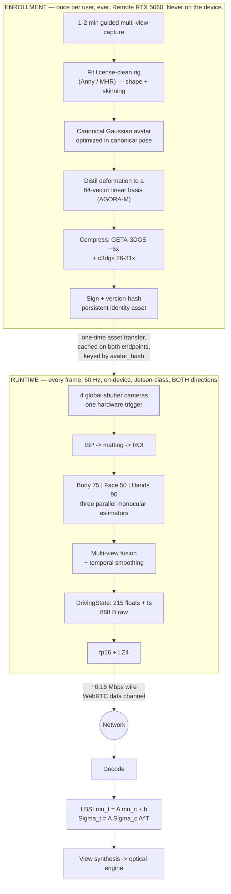
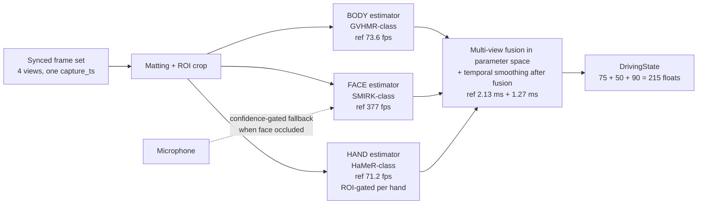
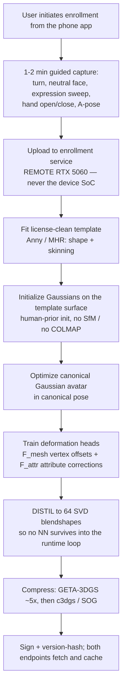

## Capture and Human Representation

This section owns everything between the photons entering the local sensor and the 868-byte packet leaving the local NIC, plus the receive-side inverse: a cached canonical avatar deformed by the arriving state vector. It ends at the renderer's output. Free-space emission is the other half of the system and is not discussed here except where the aperture law changes a capture decision.

The whole section is one thesis with one arithmetic consequence:

> **Identity is a slowly-varying quantity; pose is a fast one. Transmitting them at the same rate is the category error that makes volumetric telepresence cost 20–300 Mbps.** Split them, and the runtime channel is 215 floats — **~0.16 Mbps on the wire** [DERIVED, §8.2].

---

### 1. The amortization split, and the two machines

| Architecture | What crosses the wire per frame | Bitrate | Tag |
|---|---|---|---|
| (a) Stream the volume — point clouds / 4D Gaussians | geometry + appearance | 20–300 Mbps | [PUBLISHED] `research/01-volumetric-capture-sota.md` §3.2 |
| (b) Reconstruct per-frame from sparse views, stream the result (Tele-Aloha class) | reconstructed representation | ~100 Mbps | [PUBLISHED] arXiv [2405.14866](https://arxiv.org/abs/2405.14866) |
| **(c) Pre-build the avatar offline, stream only driving parameters** | **pose/expression state** | **Mon3tr <0.2 Mbps; Apple Spatial Persona 0.7 Mbps** | **[MEASURED]** arXiv [2601.07518](https://arxiv.org/abs/2601.07518); arXiv [2405.10422](https://arxiv.org/abs/2405.10422) |

TAYF is class (c) without qualification. The corollary that governs every decision below: **spend arbitrarily on the offline path, spend nothing on the online path.** A 33-second enrollment on a desktop GPU is free; a 3 ms regression in the per-frame loop is not.



**The two machines are an architectural boundary, not an optimization.** `docs/architecture.md`: *"Remote RTX 5060 is used only for offline avatar enrollment (one-time per-user build), never in the runtime loop."* Anything that needs the 5060 at runtime is a design error [PUBLISHED — repo-normative]. The deployed part is a Jetson Orin Nano-class module at **7–15 W** [PUBLISHED — NVIDIA module power-mode envelope, not a TAYF measurement] running *both* directions concurrently against a **≈16 W total enclosure budget at the ~48 °C metal touch limit** [DERIVED — `docs/01` §5].

---

### 2. Camera architecture

#### 2.1 Count, and what actually pins it

**Four cameras**, tiled across two adjacent faces: 2 on the front face at ~70 mm baseline, 1–2 on an adjacent face for oblique/profile coverage [ESTIMATE — layout is engineering judgement in `hardware/camera-rig.md`, not measured].

The array is **not a stereo reconstruction rig**. The estimators in §4 are monocular — Mon3tr drives its entire system from one sub-$20 webcam [PUBLISHED, 2601.07518]. The array exists as **redundancy against self-occlusion**: a monocular estimator under occlusion does not fail gracefully, it hallucinates a plausible-but-wrong limb configuration, and the receiver renders that error confidently. The fusion layer selects or blends *per body part*; it does not triangulate.

**The count is pinned at 4 by the MIPI lane budget, not by the FOV analysis** [DERIVED — `docs/04` §6.4]:

```
per camera : 1456 × 1088 px × 60 fps × 10 bit = 950.5 Mbps
four cameras                                  = 3.80 Gbps aggregate
at 2 lanes/camera (operating margin)          = 8 CSI-2 lanes
```

8 lanes is exactly what a Jetson Orin Nano-class module exposes `[U-SPEC — confirm the module's CSI configuration]`. A fifth camera requires a GMSL2/FPD-Link aggregator `[U-PN] [U-PRICE]` costing board area and ~1 W, or dropping to one lane per camera.

#### 2.2 Optical geometry, computed

Reference sensor: IMX296-class, 1456 × 1088, 3.45 µm pixel, 5.02 × 3.75 mm active area `[U-PN] [U-SPEC]` — **no part is committed**.

| Quantity | Formula | Value | Tag |
|---|---|---|---|
| Lens focal length at 45° HFOV | `f = (w/2)/tan(HFOV/2) = 2.51/tan 22.5°` | **6.06 mm** (a 6 mm M12) | [DERIVED] |
| Coverage at 1.0 m standoff | `2 · 1.0 · tan 22.5°` | 0.828 m vs 0.6 m volume → **38% margin** | [DERIVED] |
| Angular resolution at 1.0 m | `1000 · (45/1456) · π/180` | **0.539 mm/px** (32.4 px/deg) | [DERIVED] |
| 150 mm face at 1.0 m | `150 / 0.539` | **278 px** across (185 px at 1.5 m) | [DERIVED] |
| 100 mm hand at 1.0 m | — | ~185 px — **marginal** | [DERIVED] |
| Stereo depth precision, B = 70 mm, δd = 0.2 px | `δZ = Z²·δd/(f_px·B)`, `f_px = 1757` | **1.63 mm @ 1.0 m**, 3.66 mm @ 1.5 m | [DERIVED] |

SMIRK-class face estimators typically want ≥100–200 px of face crop `[U-SPEC — model-dependent]`; 278 px clears it. **If hand tracking underperforms, the upgrade axis is sensor resolution, not FOV** [DERIVED — the hand is the marginal case, and FOV is already at 38% margin].

> **Interaction with the aperture law.** `docs/09` replaces the 100 mm cube with slab apertures sized by `W_image ≤ D_aperture` for an image in the viewer's own space (Folio 30 × 21 cm, Disc 50 cm dia). This is a *gift* to capture: the 70 mm stereo baseline was capped by the 100 mm cube, and a 300 mm-wide folio permits ~200 mm. `δZ ∝ 1/B`, so at B = 200 mm the 1.0 m figure falls **1.63 mm → 0.57 mm** [DERIVED]. Nothing else in §2 changes, because every number above depends on standoff and FOV, not on enclosure size.

#### 2.3 Global shutter, non-negotiable

Rolling shutter fails for three compounding reasons, only the first of which is commonly cited:

1. **Geometric skew under motion.** Top and bottom of a frame are sampled tens of ms apart; a hand at conversational speed (~1 m/s) is captured *bent*. The 2D keypoints regressed from that image correspond to no rigid body configuration, so the joint angles jitter.
2. **Cross-camera inconsistency.** Two rolling-shutter cameras at different angles skew the *same* motion *differently*. Multi-view fusion is then reconciling views that disagree about geometry, not merely about occlusion — which is the one thing the array exists to resolve.
3. **It cannot be fixed downstream cheaply.** Rolling-shutter compensation needs a per-row motion model, which needs the pose you are trying to estimate.

Precedent: Tele-Aloha used 4× FLIR BFS-U3-123S6C-C global-shutter machine-vision cameras at 4096×3000/30 Hz for exactly this reason [PUBLISHED, arXiv 2405.14866]. `research/01-volumetric-capture-sota.md` §6.1 states the trap directly: *"Webcams have no sync pin, rolling shutter, and independent auto-exposure/auto-white-balance — three things that will actively fight you."*

**Also mandatory and frequently forgotten:** AE, AWB and AGC locked to a single master or disabled outright. Independent auto-exposure across the array means the same skin patch reports different RGB in different views, which poisons matting and any appearance-based fusion [ESTIMATE — standard multi-camera practice; not measured here].

#### 2.4 MIPI-CSI-2, not USB3

| | MIPI-CSI-2 | USB3 UVC |
|---|---|---|
| Path to SoC | Direct to ISP/VI block | xHCI → USB stack → memory |
| Added latency | Sub-frame, deterministic | Buffering + protocol overhead, jitter under bus contention |
| Hardware trigger | Native `XTRIG`/`XVS` pin on the sensor module | Vendor-dependent, usually absent on UVC |
| CPU cost | DMA into ISP, near-zero | Per-packet interrupts, memcpy |
| 4 uncompressed streams | 8 lanes, budgeted (§2.1) | Shares one bus; saturates |

**Decision: MIPI-CSI-2** [PUBLISHED — repo-normative, `docs/03` §1.3]. On a device whose entire sender budget is Mon3tr's **17.18 ms**, spending 3–5 ms in a USB stack to save integration effort is not a trade worth making [DERIVED]. USB3 is acceptable only on the bench rig where a laptop stands in for the device.

#### 2.5 Hardware trigger sync — the arithmetic that makes software timestamps inadmissible

All sensors share one strobe line, generated on the **safety MCU, not by a Linux GPIO toggle** [PUBLISHED — repo-normative, `docs/04` §2, §6.5]. Requirement: **inter-camera exposure-start skew < 50 µs**, verified on a 4-channel scope with a photodiode per sensor.

The case against software timestamp matching is arithmetic, not preference. Let `T = 1/60 = 16.67 ms`. Free-running sensors have independent oscillators at ±50–100 ppm with **no phase relationship**, so the phase offset between two cameras is uniform on `[0, T)`. Matching each frame to the nearest frame of the other camera leaves a residual uniform on `[0, T/2]`:

| Quantity | Formula | Value | Tag |
|---|---|---|---|
| Mean inter-camera time offset | `T/4` | **4.17 ms** | [DERIVED] |
| Worst-case offset | `T/2` | **8.33 ms** | [DERIVED] |
| Hand travel at 1 m/s, mean case | `1 m/s × 4.17 ms` | **4.2 mm** | [DERIVED] |
| Hand travel at 1 m/s, worst case | `1 m/s × 8.33 ms` | **8.3 mm — larger than a fingertip** | [DERIVED] |
| Same, in pixels at 1.0 m | `8.3 mm / 0.539 mm/px` | **15.4 px** | [DERIVED] |
| **Hardware trigger, at spec** | `1 m/s × 50 µs` | **50 µm = 0.09 px** | [DERIVED] |
| Linux GPIO jitter, ~1 ms | `1 m/s × 1 ms` | 1.0 mm ≈ 1.9 px — **why the trigger is on the MCU** | [DERIVED] |

Three further points close the argument:

- **Drift is worse than offset, because it is non-stationary.** A 100 ppm frequency difference walks the phase at `1e-4 s/s = 100 µs/s`, so the offset traverses the entire frame interval in `16.67 ms / 100 µs/s ≈ 167 s` — **a full slip cycle every ~2.8 minutes** [DERIVED]. A pose estimator downstream of a slowly-cycling geometric error produces *low-frequency wobble*, which is perceptually worse than high-frequency noise because the brain reads it as the person actually moving.
- **It burns latency already committed.** Any software sync scheme needs ≥1 frame of buffer per camera to find the match: **≥16.67 ms added** to a budget where Mon3tr's entire sender side is 17.18 ms [DERIVED from PUBLISHED]. It roughly doubles the sender cost to recover accuracy a PCB trace supplies for free.
- **Calibration and sync are the same dependency.** `research/01-volumetric-capture-sota.md` §6.1: the 25 fps GPS-Gaussian result assumes *calibrated, rigidly mounted, hardware-synchronized* cameras; remove calibration and 2026's best sparse-view method (HiReFF) drops to **3.01 fps on an RTX 4090** [PUBLISHED]. Orbbec's Femto Bolt exposes an 8-pin daisy-chain sync for the same reason `[U-PN]`.

**Firmware contract.** The MCU emits a strobe at nominal frame rate and reports the strobe timestamp to the SoC over UART. Each multi-view frame set is tagged with **one `capture_ts` derived from the trigger edge**, never from an individual sensor's arrival time. That single value propagates into `DrivingState.timestamp` and is the only clock in the entire latency accounting [PUBLISHED — repo-normative].

#### 2.6 RGB only; depth rejected; stereo as a prior

| Option | Buys | Costs | Verdict |
|---|---|---|---|
| **RGB only** | Cheapest, smallest, lowest power, no active illumination, no interference between two devices in one room | Estimators must infer 3D from 2D | **Chosen** |
| Stereo pair | Metric depth in the overlap; scale disambiguation; matting prior | Baseline capped by enclosure; rectification + disparity compute | Used as a **prior**, not a primary channel |
| Active depth (ToF / structured light) | Direct geometry, robust matting | Watts and thermal in a sealed box; IR emitter competes with the optical engine for face area; **two devices facing each other interfere**; second calibration problem | **Rejected for v1** |

Two decisive arguments. **Empirical:** Google Beam dropped the depth sensor — Project Starline used dedicated depth, the shipping HP Dimension is RGB-camera-only + AI [PUBLISHED — `research/01-volumetric-capture-sota.md` §2.1]. **Structural:** *the pipeline does not consume depth.* The estimators are monocular RGB regressors, the representation is a pre-built avatar, the wire format is 215 pose floats. Depth would only improve pose and matting, both of which have adequate RGB-only solutions, and it would spend the two scarcest resources in the device — watts and face area.

Stereo is used opportunistically: the two front cameras with known extrinsics give a disparity prior that fixes absolute scale (a genuine monocular ambiguity — a small person close and a large person far produce identical images) and gates matting (§3.3). §2.2's **1.63 mm at 1.0 m is comfortably adequate**, which is itself the argument that no depth sensor is warranted [DERIVED].

#### 2.7 Calibration, on two schedules

- **Intrinsics + extrinsics, factory / one-time.** The array is rigidly mounted, so extrinsics are fixed by construction and need measuring once, not maintaining. ChArUco/checkerboard, ≥30 poses spanning the volume → per-camera pinhole + radial/tangential distortion → pairwise stereo extrinsics → global bundle adjustment. Stored as a signed blob keyed by serial number [ESTIMATE — standard practice, procedure not yet executed].
- **Online validation, per session.** A rigid rig still loses calibration to thermal expansion in a box running >10 W, or to a drop. At session start, reproject a small set of detected 2D keypoints between views against stored extrinsics; if median reprojection error exceeds threshold, **degrade to single-camera monocular mode and flag for recalibration** rather than silently emitting wrong geometry [ESTIMATE — threshold unset].
- **Deliberately not required:** COLMAP/SfM at runtime, external tracking infrastructure, a calibration wall, a special chair. This is hard constraint H6.
- **Observer tracking is nearly free.** The observer of the remote avatar is the same person the capture array is already imaging, so the pupil positions `docs/01` §4.4 needs for angular allocation fall out of the estimator that is already running [DERIVED — architectural, and the reason the optical budget closes]. Required accuracy is one pupil diameter at 1 m ≈ **6 mrad**; achieved accuracy is **unmeasured**.

---

### 3. Segmentation and matting

#### 3.1 Why it is in the pipeline

Three jobs: **focus the estimators** (a cluttered scene wastes network capacity and occasionally locks onto a person in a photograph or a mirror); **enforce the user-set capture box**; and **privacy**. The third is not decorative — *"A matting error in 2D is a fringe; in 3D it becomes floating geometry that persists across viewpoints and flickers with motion"* [PUBLISHED — `research/01-volumetric-capture-sota.md` §6].

**An under-appreciated property of class-(c) architectures:** because TAYF streams pose parameters and never pixels, a matting error *cannot leak the room to the far end*. The worst case is a corrupted pose estimate, not a transmitted image of someone's bedroom [DERIVED].

#### 3.2 Model selection

| Model | License | Measured speed | Verdict |
|---|---|---|---|
| **BiRefNet** | **MIT** | **17 fps @1024² FP16, 3.45 GB VRAM, RTX 4090**; DIS5K S=0.911; `refine_foreground` accelerated 8× to ~80 ms on RTX 5090 | **Chosen — the only MIT-licensed high-quality option** [PUBLISHED] |
| MODNet | Apache-2.0 | "real-time up to 2K", 7 MB demo model, **no fps table published** | **Fallback** [PUBLISHED] |
| RobustVideoMatting | **GPL-3.0** | 172 fps HD / 154 fps 4K, RTX 3090 FP16 | Throughput champion; **license blocker** [PUBLISHED] |
| MatAnyone / MatAnyone 2 | **NTU S-Lab 1.0, non-commercial** | **no fps published**; both need a first-frame mask | Current SOTA line, **excluded** [PUBLISHED] |
| SAM 3 / SAM 3.1 | **Custom SAM License** | ~30 ms/img with >100 objects on H200; SAM 3.1 32 fps on one H100 | **Detection/tracking — produces no alpha** [PUBLISHED] |

**The uncomfortable number is 17 fps on an RTX 4090**, against a 60 Hz target on a part far below a 4090, and **3.45 GB** against an 8 GB unified pool that must also hold three estimators, the canonical avatar and the render buffers. Three mitigations, in order of preference:

1. **Do not run at full resolution.** The estimators need a person-crop, not a 1024² alpha. **TAYF's matting quality requirement is far lower than a compositing pipeline's — it needs a mask good enough to *crop*, not good enough to *composite*, because TAYF never renders the captured pixels.** This is the key realisation and it is worth stating first [DERIVED].
2. **Do not run every frame.** 15 Hz plus ROI tracking between updates; a human silhouette does not move 30 px in 16.7 ms.
3. **Run only on the primary view.** Oblique views need a bounding box, which a cheap detector supplies.

If BiRefNet at 512² on the target part lands below ~15 Hz, **MODNet becomes mandatory** — this is the single most likely stage to force a model swap, and measurement #2 in §11.

#### 3.3 Auxiliary gates

- **Stereo depth-consistency gate.** Reject mask pixels whose disparity is inconsistent with the subject plane: `|D(u,v) − μᵢ| ≤ τᵢ`, InViStream's test [PUBLISHED, arXiv [2608.11645](https://arxiv.org/abs/2608.11645)]. Kills the classic bleed onto a chair-back or a wall poster.
- **Capture-box clip.** Hard geometric clip to the user-set volume; cheapest and most reliable filter in the stack, and it runs *before* the network.
- **Bystander handling.** InViStream measures private-person detectability dropping **100% → 6.3% (synthetic) / 14.3% (real)** at a cost of **17.4 ms with a MobileNet backbone at chunk size N=5 (57.5 fps; 12.9 fps at N=1)** — i.e. run detection once per chunk, not per frame [PUBLISHED]. **For TAYF the problem is narrower:** a second person in frame is not a privacy leak (nothing of them is transmitted) but an *identity-confusion hazard*, resolved by matching against the enrolled subject rather than by masking [DERIVED].

---

### 4. Body, face, and hand estimation

#### 4.1 The three-branch split



Reference rates are Mon3tr's, measured on an RTX 5090-class sender; the pipeline synchronises to **58.2 fps** overall because the hand branch gates it [MEASURED — by Mon3tr, arXiv 2601.07518, **not by this project**].

**Design consequence, load-bearing:** the branches are independently rate-controllable, the face branch has ~5× headroom over 60 Hz, and §9 says face expressiveness is the most perceptually valuable channel. Therefore **under thermal or compute pressure, degrade body rate before face rate**, and interpolate body pose between estimates rather than dropping expression frames [DERIVED from §9.2].

#### 4.2 Body — 75 dimensions

| Candidate | Rate | Hardware | License | Tag |
|---|---|---|---|---|
| **GVHMR-class** (Mon3tr's choice) | **73.6 fps** | RTX 5090-class | **UNVERIFIED** | [MEASURED by Mon3tr] |
| Multi-HMR (NAVER, ECCV'24) | ViT-S **29 ms (~34 fps)** / ViT-B 43 ms / ViT-L 74 ms @672² | V100-32GB | **Custom NAVER** | [PUBLISHED] |
| SAM 3D Body (arXiv [2602.15989](https://arxiv.org/abs/2602.15989)) | **no fps published** | — | **Custom SAM** | [PUBLISHED] — introduces **MHR**, a Meta-authored SMPL-X replacement; 3DPW 54.8 MPJPE, EMDB 61.7, RICH 60.3 PVE |
| Fast SAM 3D Body (arXiv [2603.15603](https://arxiv.org/abs/2603.15603)) | **up to 10.9× e2e speedup**; no absolute fps, GPU or code availability stated | — | — | [PUBLISHED] — the absence of absolutes is disqualifying until verified |
| SMPLest-X (TPAMI'25) | **8.36 fps** (third-party) | 8.2 GB checkpoint | MIT code | Too slow, too large |
| NLF (NeurIPS'24) | no fps published | — | **MIT code, NON-COMMERCIAL weights** | The purest form of the license trap |
| MediaPipe Pose Landmarker | per-device latency **removed from current Google docs** | CPU/GPU/mobile | Apache-2.0 | Clean license, no numbers; degraded-mode fallback |

**The 75 dimensions are not yet pinned.** They decompose as SMPL-family joint rotations — 24 joints × 3 axis-angle = 72 plus 3 global orientation, or 25 × 3; Mon3tr's available text does not disambiguate [UNVERIFIED — resolving this requires reading Mon3tr's released code or supplementary material]. **Sender and receiver must agree on joint ordering and rotation convention or the far end renders a person whose elbows bend backwards**, which is why `rig_id`, `dims` and `rotation_convention` are negotiated on the wire (§8.4).

Recommendation: **6D continuous rotation internally, axis-angle on the wire** — 6D avoids the gimbal/antipodal discontinuities that make naive delta-encoding of quaternions blow up; axis-angle is 3 floats per joint and matches the 75-dim budget [DERIVED].

**Architectural rule: the rig is the commitment, the estimator is swappable.** The estimator produces joint rotations; the rig defines what those rotations *mean*. Build against Anny (Apache-2.0) or MHR behind one rig-space adapter, and estimator selection stops being a licensing hostage (§10).

#### 4.3 Face — 50 dimensions

**SMIRK-class**, measured at **377 fps** — the fastest branch by 5×, fortunate because §9 shows it matters most [MEASURED by Mon3tr].

50 dimensions is a blendshape/expression coefficient vector, FLAME-compatible in Mon3tr's formulation: its SPMM3 template fuses a scanned body mesh with FLAME face and MANO hand components via rigid alignment, `M_SPMM3 = 𝒰(M_body^masked, 𝒜_f(M_face), 𝒜_h(M_hand))`, with skinning weights transferred from SMPL-X [PUBLISHED, 2601.07518].

> **⚠ That sentence is a license bomb.** Mon3tr's template stands on **SMPL-X + FLAME + MANO**, all Max Planck models. SMPL-X is excluded outright (§10); FLAME and MANO are the same institution and licensing family and their exact terms are **UNVERIFIED in this repository**. The escape is the same as for the body: **the 50-dimensional channel is a contract about *width*, not about whose blendshapes.** Use the license-clean rig's expression basis and retarget. If that basis has a different dimensionality, `pipeline/schema.py` is revised deliberately and both endpoints bump in lockstep — never silently reinterpreted.

**Audio-driven fallback.** Meta's *Audio Driven Real-Time Facial Animation for Social Telepresence* achieves **<15 ms GPU time** with a single-step distilled diffusion model, **100–1000× faster** than offline baselines [PUBLISHED, arXiv [2510.01176](https://arxiv.org/abs/2510.01176)]. For TAYF this is the **degraded mode when the face is occluded or out of frame** — the audio stream is already present, and driving expression from the microphone is strictly better than freezing the face. Wire it as an alternate source for the *same* 50 dimensions, selected by a per-frame confidence gate; not as a separate path.

#### 4.4 Hands — 90 dimensions

**HaMeR-class at 71.2 fps** — the rate-limiting branch [MEASURED by Mon3tr]. 45 dims per hand, both hands, MANO-style, as implemented in `pipeline/schema.py`.

The honest framing from the SOTA survey: *"Hands and faces are where photorealism dies, and they're the whole point... A 4-camera rig will produce a smeared mouth interior, fused fingers, and hair that reads as a helmet"* [PUBLISHED — `research/01-volumetric-capture-sota.md` §6.2]. **But that sentence is about per-frame volumetric reconstruction, and TAYF does not reconstruct per frame.** In class (c) the fingers' *geometry* comes from the enrolled avatar, built offline from good capture; only the *articulation* is estimated live. This converts an ill-posed reconstruction problem into a well-posed 45-DoF regression. Fingers still fuse when the estimator is wrong — but they fuse into correctly-shaped fingers [DERIVED].

| Candidate | Rate | License |
|---|---|---|
| **HaMeR-class** (Mon3tr) | **71.2 fps** RTX 5090-class | **UNVERIFIED** — presumed MANO dependency |
| WiLoR | **>130 fps (medium), 175 fps (small)**, CUDA 11.7 | **CC-BY-NC-ND + AGPL + MANO — triple encumbrance.** Fastest, completely unshippable |
| Multi-HMR | 29–74 ms whole-body incl. hands | Custom NAVER |
| MediaPipe Hand Landmarker | latency removed from docs | Apache-2.0 |

**Mitigation for the bottleneck:** hands leave frame constantly and are frequently occluded. Run the estimator **only on ROIs where a hand is detected, gating each hand independently.** In ordinary seated conversation both hands are fully visible a minority of the time, so mean cost is far below what 71.2 fps implies. **Note precisely what this buys: mean power, not worst-case latency** — worst case is what determines whether frames drop [DERIVED].

#### 4.5 Multi-view fusion — TAYF-original, no published reference

Mon3tr is monocular. The fusion layer has no reference implementation anywhere in the corpus and **must be treated as original work with an unmeasured benefit** [UNVERIFIED — measurement #6 in §11 is its entire justification].

1. Each estimator runs on the **best view per body part**, scored by detected-keypoint confidence × in-frame fraction × distance from image border.
2. When two views both see a part confidently, blend **in parameter space** — quaternion SLERP or rotation-matrix Procrustes averaging weighted by confidence. **Do not triangulate:** the estimators already output 3D and a 70 mm baseline is too short to triangulate usefully at 1.0–1.5 m (§2.2's δZ = 1.63 mm is adequate for gating, not for joint positions).
3. **Hysteresis on view selection.** Switching primary view mid-motion is a step discontinuity that the delta encoder faithfully transmits and the receiver faithfully renders as a twitch. Require a confidence margin and a minimum dwell.
4. **Smooth after fusion, not before.** One-euro or small per-joint-group Kalman, tuned per channel: heavier on the body (slow, jitter very visible), **lighter on the face** (fast, and §9 says amplitude beats precision).

Fusion waits for the slowest branch — budget Mon3tr's **2.13 ms sync + 1.27 ms smoothing**. On a Jetson with three estimators contending for one GPU, the "parallel" branches may **serialise**, which is exactly what measurement #1 exists to find out.

---

### 5. Persistent identity vs dynamic state

| | Persistent identity | Dynamic state |
|---|---|---|
| **Content** | Canonical Gaussian set {μ, s, q, α, SH c}; skinning weights; rig shape params; distilled deformation basis | 215 floats: body pose, expression, hand pose |
| **Size** | Megabytes post-compression | **430 B (fp16 payload)** |
| **Update rate** | Once per enrollment; effectively never during a call | **60 Hz** |
| **Where computed** | Offline, remote RTX 5060 | On-device, Jetson-class |
| **Where stored** | Cached on both endpoints, keyed by identity + version hash | Transient |
| **Transport** | Reliable, ordered, out-of-band, once | Unreliable, unordered, in-band, continuously |

**The entire bandwidth argument reduces to this table.** arXiv [2510.10492](https://arxiv.org/abs/2510.10492) (CityU HK / Alibaba DAMO) makes the identical split and measures it: a canonical 3DGS avatar trained in a star pose and compressed once, plus **94 scalars per frame** (SMPL 72 pose + 10 shape + 3×3 global rotation + 1×3 translation) arithmetic-coded with CABAC → **under 0.2 Mbps on ZJU-MoCap and under 0.26 Mbps on MonoCap at 25 fps**, versus **over 1 Mbps** for G-PCC / GeS-TM / HEVC / VVC / CompactSTG anchors at matched quality [PUBLISHED/MEASURED].

**TAYF's 215 floats is a superset of that paper's 94** — it adds the facial-expression and hand channels 2510.10492 explicitly lacks. That is the correct trade: those are the two channels §9 says carry the conversation [DERIVED].

#### 5.1 Enrollment — one-time, offline, and never on the deployed device



| Enrollment reference | Cost | Tag |
|---|---|---|
| Mon3tr | 1–2 min capture → **~33 s build** (from a 32× 12 MP offline rig) | [MEASURED, 2601.07518] |
| Apple Persona | **<10 s, on-device on M5** | [PUBLISHED — vendor + hands-on report] |
| Meta Codec Avatars | **~1 hour of server GPU** | [PUBLISHED] |
| HUGS | **~30 min on RTX 3090Ti** (96× faster than Vid2Avatar, 336× than NeuMan) | [MEASURED, arXiv [2311.17910](https://arxiv.org/abs/2311.17910)] |
| RealityAvatar | **~0.6 h** | [MEASURED, arXiv [2504.01559](https://arxiv.org/abs/2504.01559)] |
| GauHuman | **1–2 min** (~13k Gaussians) | [PUBLISHED] |
| Animatable Gaussians — *what to avoid* | **16–47 cameras, ~2 days on a 4090, renders at 10 fps**, Tsinghua non-commercial | [PUBLISHED] |
| **TAYF on an RTX 5060** | **budget 1–2 h, asynchronous** — a 5060 is slower than the 3090Ti/4090 references, so the ~33 s headline does not transfer | **[ESTIMATE]** — measurement #7 |

**Capture path for v1: the device's own cameras**, recording a guided 1–2 min sequence uploaded to the enrollment service. Lower quality than a phone orbit (fixed viewpoints, short baseline) but zero extra hardware and it works when the user has no phone at hand. The phone-orbit alternative is real — Meta's LCA demonstrates full-body avatars with finger-level articulation from unconstrained phone capture, pretrained on 1M in-the-wild videos [PUBLISHED, arXiv [2604.02320](https://arxiv.org/abs/2604.02320)] — but **Meta publishes no inference numbers and no release**, so it is a direction, not a dependency.

**Enrollment friction is a product decision, not an engineering detail:** *"The one you can ship is the one with the shortest enrollment."* Budget **≤2 min of user time, ≤2 min of perceived wait**; if the build runs longer, do it asynchronously behind a lower-fidelity provisional avatar.

---

### 6. Gaussian avatar representation and the LBS covariance transform

#### 6.1 Why Gaussians

| Representation | Verdict |
|---|---|
| **3D Gaussian splats** | **Chosen.** Confirmed in Apple Personas (Scott Norris on record), Meta Codec Avatars, Evercoast, Canon's CES 2026 prototype, ~100% of 2026 academic work [PUBLISHED]. Rasterizes fast, deforms under LBS **analytically**, compresses well, renders cheaply from many viewpoints |
| Textured mesh | Cannot represent hair, fabric edges, or soft occlusion boundaries without heavy per-vertex density. Apple's Spatial Persona: 78,030 triangles at 0.5 m → 21,036 with viewport adaptation, −39% GPU time [MEASURED, 2405.10422] — workable, with a quality ceiling |
| NeRF / implicit fields | HUGS reports Gaussian rendering **3800–7600× faster** than NeRF/implicit baselines on the same task [MEASURED, 2311.17910]. Disqualified on compute |
| Per-frame volumetric (point cloud / 4DGS) | 20–300 Mbps, and **no real-time 4DGS encoder exists** — 4D-MoDe 0.68 min/frame, 4DGCPro 4.3 min/frame of *offline* optimization [PUBLISHED]. Disqualified on bandwidth |

**The most important architectural detail, from HUGS:** after optimization, the triplane and MLPs *never need to be evaluated again at animation time* — the Gaussians and their learned LBS weights are extracted explicitly, so new poses render by **direct LBS deformation of pre-baked attributes, with no neural inference in the render loop** [PUBLISHED/MEASURED]. That is exactly the computational shape a thermally-limited SoC needs: **bake the network offline, animate with arithmetic online.** Any enrollment design that leaves a network in the per-frame path should be rejected on those grounds alone.

#### 6.2 The transform

Each canonical Gaussian *i* has position **p**_c ∈ ℝ³ and covariance Σ_c ∈ ℝ^{3×3}, parameterized (as standard in 3DGS) so that positive-semi-definiteness is structural rather than enforced:

$$\Sigma_c = R_c S_c S_c^{\top} R_c^{\top}, \qquad R_c = R(q),\; S_c = \mathrm{diag}(s)$$

Given a decoded `DrivingState`, LBS blends per-joint transforms by skinning weight ω_k [PUBLISHED, 2510.10492]:

$$\mathbf{A} = \sum_k \omega_k \mathbf{A}_k, \qquad \mathbf{b} = \sum_k \omega_k \mathbf{b}_k, \qquad \hat p_t = \mathbf{A}\,p_c + \mathbf{b}$$

and the covariance transforms as

$$\boxed{\;\Sigma_t = \mathbf{A}\,\Sigma_c\,\mathbf{A}^{\top}\;}$$

**This is the step people skip, and skipping it is why naive avatar animation looks wrong.** Translating a Gaussian without rotating its covariance means an anisotropic splat lying *along* a forearm keeps pointing in its canonical direction when the forearm rotates — the splat visibly *slides* across the surface it represents. `Σ_t = A Σ_c Aᵀ` rotates the Gaussian's **shape** along with the joint, which is what lets skin- and cloth-shaped Gaussians rotate rather than merely translate [PUBLISHED — the formulation; [DERIVED] — the failure-mode explanation].

#### 6.3 Recovering a renderable (q, s), and the fast path

The renderer wants (q, s), not a raw 3×3. Substituting:

$$\Sigma_t = (\mathbf{A} R_c S_c)(\mathbf{A} R_c S_c)^{\top}$$

Define `M = A R_c S_c` and recover by **polar decomposition** `M = R_t U` with R_t orthogonal, U symmetric PSD; then `q_t = quat(R_t)`, `s_t` from U. When **A** is rigid — the common LBS case — this collapses to the free and exact

$$q_t = q_{\mathbf{A}} \otimes q_c, \qquad s_t = s_c$$

**Implement the rigid fast path; fall back to polar decomposition only when the blended A carries non-negligible shear**, gating on `‖AᵀA − I‖_F` against a threshold. LBS blending of two rotations genuinely does produce non-rigid A (the classic candy-wrapper artifact) but shear magnitude is small away from joint centres. Across ~10⁵ Gaussians on an embedded GPU this is a meaningful per-frame saving [DERIVED — threshold and measured saving both **unset**].

#### 6.4 Non-rigid correction, and the distillation that makes it embeddable

Pure LBS gives a correct skeleton and a mannequin's skin. Three correction layers, increasing cost:

- **(a) Pose-dependent vertex offsets** (Mon3tr's `F_mesh`) — muscle bulge, joint creasing, garment wrinkle. **Implement.**
- **(b) Gaussian attribute corrections** (Mon3tr's `F_attr`, the "tension field") — ~**500 local controllers** on the canonical mesh, each mapping pose to a displacement potential; a virtual-mass-weighted sum (geodesic distance × skinning-weight similarity) over the **K=3 nearest** controllers gives each Gaussian a dragging force, **projected onto a fixed set of linear deformation bases**. The projection is the load-bearing part: per-frame cost becomes a small matrix multiply, not a network evaluation per Gaussian. **Implement.**
- **(c) History-dependent deformation** — RealityAvatar's LSTM over encoded pose *sequences*: 35k canonical Gaussians, a latentbone encoder splitting pose into four regional groups each concatenated with a learned clothes latent, feeding an LSTM whose hidden state predicts Δx, Δs, Δq via a 3-layer MLP. Measured on I3D-Human: PSNR **31.87**/SSIM 0.9752 novel-view, **30.10**/0.9689 novel-pose in **~0.6 h** training, beating 3DGS-Avatar (30.62/29.21) at ~20× less training time; **the ablation is the useful part — removing the LSTM costs 31.87 → 30.88, the largest single drop** [MEASURED, 2504.01559]. **TAYF: optional.** The subject is seated, so the loose-garment dynamics this targets are largely absent, and the sequential dependency adds per-frame state to the animation loop.

**The embedded-deployment trick, and the most important technique in this section after §6.2** — AGORA-M [MEASURED, arXiv [2512.06438](https://arxiv.org/abs/2512.06438)]:

1. Extract **N = 10,000** sampled posed-minus-neutral Gaussian-attribute residuals.
2. Take their **SVD**.
3. Keep the top **K = 64** singular vectors as shared **Gaussian blendshapes**.
4. Train a **two-layer MLP** to regress the 64 coefficients from (w, ψ, θ).

Per-frame animation reduces to **one neutral Gaussian set plus a linear combination of 64 bases**. Measured: near-identical quality (**FID 3.36 vs 3.17**) at **560 fps on an RTX A6000 and 60 fps on a mobile phone via a WebGL 3DGS renderer.** Mon3tr's tension field is the same idea derived from a physical analogy rather than PCA; both end at *project deformation onto a small fixed linear basis*.

**This is the mechanism by which receive-side animation cost becomes independent of avatar complexity.** Caveats, stated: AGORA is **head/face-only (FLAME-driven)**, single-identity-per-generator-sample rather than few-shot personalization, and addresses neither body nor hands. **The distillation technique generalizes; the model does not** [DERIVED].

---

### 7. Canonical avatar compression

The canonical payload moves **once per enrolled user per device pair**. It is a session-setup cost, not a bandwidth cost — but it must fit the SoC's shared memory alongside everything else, and download fast enough that the first call is not gated on it.

| Method | Result | License | Tag |
|---|---|---|---|
| **GETA-3DGS** (arXiv [2605.02086](https://arxiv.org/abs/2605.02086)) | **~5× storage reduction over vanilla 3DGS, fully automatic** — no per-scene opacity/scale/SH-degree tuning | — | [PUBLISHED/MEASURED] |
| **c3dgs** | **26–31×**, and **up to 4× faster rendering** | **MIT** | [PUBLISHED] |
| HAC-lowrate / ContextGS-lowrate | 15.3 MB (48×) / 12.7 MB (58×) from a 734 MB 3DGS-30k baseline; most aggressive configs 83–113× | varies | [PUBLISHED] |
| **SOG** (`.sog`) transport container | **~15–20× smaller than PLY**, 2–3× better than compressed PLY; Morton-ordered, GPU-ready, **no load-time processing** | **license not stated — verify** | [PUBLISHED] |

**GETA-3DGS mechanism:** each Gaussian is a group node in a quantization-aware dependency graph with five heterogeneous attribute sub-nodes (μ∈ℝ³, log-scale s∈ℝ³, quaternion q∈ℝ⁴, opacity logit α, degree-aware SH c∈ℝ^{(ℓ+1)²×3} — 48 scalars at ℓ=3). Pruning uses **render-aware saliency** fusing α-blending transmittance-weighted contribution, screen-space gradient magnitude and pixel coverage, explicitly replacing parameter-space Taylor saliency (which the authors show is a poor signal for 3DGS, because occluded/sub-pixel Gaussians carry non-trivial gradients despite negligible visual contribution).

**The finding that governs TAYF's bit allocation:** the **heterogeneous bit-width policy is the dominant rate-distortion lever**, not the saliency choice or the schedule. Forcing a uniform 6-bit cap costs **up to −6.74 dB on view-dependent scenes** versus only **−0.18 to −0.34 dB on texture-uniform scenes**, and the per-attribute bit ordering predicted by an information-theoretic reverse-water-filling model matches empirically converged widths **within ±1 bit** [MEASURED].

Translated to a human: **face and skin are the view-dependent, SH-heavy content that needs bits; clothing and hair bulk are texture-uniform and quantize aggressively.** §9 reaches the identical allocation from psychophysics. **Two independent derivations — rate-distortion theory and human MOS — converging on the same allocation is the strongest evidence available anywhere in this document** [DERIVED].

GETA-3DGS is **complementary to entropy coders** (HAC++/CompGS operate downstream on already-quantized symbols), so they compose. ⚠️ Tooling: `playcanvas/sogs` is **archived**; use `playcanvas/splat-transform`.

---

### 8. The 215-float DrivingState

#### 8.1 Schema, as implemented

Normative definition is `pipeline/schema.py`; both endpoints import it and nothing redefines the packet shape [MEASURED — read from the code].

```
DrivingState                        struct fmt "<215f d"
  body_pose        75 × float32     # rig joint rotations
  face_expression  50 × float32     # blendshape / expression coefficients
  hand_pose        90 × float32     # 45 per hand, both hands, MANO-style
  timestamp         1 × float64     # capture_ts from the hardware trigger (§2.5)
  ────────────────────────────────
  PACKED_SIZE_BYTES = 215×4 + 8   = 868 bytes/frame, pre-compression
```

The dataclass validates each field's length in `__post_init__` and raises rather than truncating — the packet is fixed-width by construction. `TOTAL_DIM = 215` is computed, not literal.

#### 8.2 Bandwidth arithmetic

| Stage | Bytes/frame | Bitrate @60 fps | Tag |
|---|---|---|---|
| 215 floats, fp32 (payload only) | 860 | **0.413 Mbps** | [DERIVED] `860×8×60` |
| + float64 timestamp, as `schema.py` packs it | 868 | 0.417 Mbps | [DERIVED] |
| **fp16 cast, payload only** | **430** | **0.206 Mbps** | [DERIVED] |
| fp16 payload + retained fp64 timestamp | 438 | 0.210 Mbps | [DERIVED] — see caveat |
| **fp16 + LZ4 (~0.6× ratio)** | **~258** | **~0.124 Mbps** | [ESTIMATE] — the 0.6× ratio is assumed, **never measured on real pose streams** |
| **+ SCTP/DTLS/UDP/IP headers (~80 B/datagram)** | **~338** | **~0.162 Mbps — the real wire rate** | [DERIVED] |
| …one-way including audio and FEC | — | **~0.26 Mbps** against a ≤0.3 Mbps constraint | [ESTIMATE] |

> **Caveat worth carrying:** the 430 B row silently drops the 8-byte timestamp. Halving 215 floats gives 430 B, but `schema.py` also packs an fp64 `timestamp`, so a faithful fp16 frame is **438 B → 0.210 Mbps** unless the timestamp is narrowed or moved into the transport header. A 1.9% error, immaterial to the budget, but it is the kind of drift that turns a spec into folklore. **Recommendation: keep the fp64 timestamp and quote 438 B.**

At 60 packets/s with a ~258-byte payload, **protocol headers are ~24% of the wire cost** [DERIVED]. This is precisely why Mon3tr reports "<0.2 Mbps" rather than 0.124: anyone quoting 0.124 Mbps as the delivered rate is quoting payload, not bandwidth. Both are correct; they measure different things.

**The comparison that justifies the architecture:**

| Architecture | Bitrate | Ratio vs TAYF |
|---|---|---|
| **TAYF / Mon3tr parametric state** | **~0.16–0.2 Mbps** | 1× |
| Apple Spatial Persona [MEASURED, 2405.10422] | 0.7 Mbps | 4× |
| 1080p30 2D talking head | ~1–3 Mbps *(industry common knowledge, not a citable measurement)* | 6–19× |
| MIV (6DoF multi-view + depth), HEVC L5.2 | 15–30 Mbps | 90–190× |
| Project Starline 2021 research prototype | 30–100 Mbps | 190–600× |
| 4DGS — QUEEN | 168 Mbps | ~1000× |
| Raw 8i VFB (42 cameras, 30 fps, ~1M pts/frame) | ~1.0 Gbps | ~6000× |

**TAYF's stream is cheaper than 2D video of the same person.** The parametric architecture is not merely competitive with a video call; it is strictly less expensive [DERIVED].

#### 8.3 fp16 is safe here — with one specific exception

Casting pose parameters to fp16 costs ~3 decimal digits. For joint rotations in radians (range ~±π), fp16's step near 1.0 is **~0.001 rad ≈ 0.06°** — far below the estimator's own noise floor and any perceptual threshold [DERIVED]. Blendshape coefficients in [0,1] are finer still.

> **Where fp16 is not safe: global translation.** If the 75-dim body vector carries a root translation in metres, fp16's step at 10 m is **~10 mm** — visible drift [DERIVED]. **Either keep global translation in fp32 as a separate field, or express it in a normalized capture-box frame where the range is ~[−1, 1].** This is a real bug waiting inside a naive "cast the whole array to fp16" implementation, and it must be handled when the rig's parameter layout is pinned (§4.2).

#### 8.4 Why the wire carries `rig_id`, not just numbers

**A 215-float array is self-describing about nothing.** If one endpoint ships an updated rig with different joint ordering, every packet still parses and the far end renders a person whose elbows bend backwards. `HELLO` therefore negotiates `schema_version`, `rig_id`, `dims {body:75, face:50, hand:90}`, `rotation_convention`, `fps`, `avatar_hash`, `region_mask`, `caps` — **and a mismatch is fatal to the session. Fail loudly; never reinterpret** [PUBLISHED — repo-normative, `docs/03` §12.1].

`region_mask` (the phone app's body-region selector) **changes which sub-estimators run on the sender, not the packet width.** Unselected regions transmit as zeros or a held neutral pose; LZ4 compresses the constant runs to almost nothing, so a torso-only session shrinks naturally with no format variant [DERIVED].

---

### 9. Perceptual allocation — where the bits and the Gaussians go

Uniform allocation across a human body is wrong by a large factor: the information a conversation carries lives in micro-expressions, gaze and finger articulation — *"exactly the regions with the fewest pixels and fastest motion."* Three independent lines of evidence, all from Track 4 (Perception), say the same thing.

#### 9.1 Expressiveness beats timing — the strongest single result

**arXiv [2503.20308](https://arxiv.org/abs/2503.20308)**, "Perceptually Accurate 3D Talking Head Generation." Forced-choice A/B human study:

- **(A)** precise temporal sync, flat/inexpressive lip motion
- **(B)** expressive, speech-intensity-matched lip motion, with **100 ms audio-lip asynchrony** — *double* the classical ~50 ms threshold

**82.6% of participants preferred (B)** [MEASURED]. A second study confirmed preference for lip-movement intensity that *matches speech intensity* over intensity-mismatched-but-technically-correct lip shapes. The paper also carries an audiovisual-sync JND — noticeable when speech **leads** lip movement by >50 ms or **lags** by >220 ms — cited from Vatakis et al. 2006, so a **secondary citation, not this paper's own measurement** [PUBLISHED, second-hand].

Three consequences, all directly actionable:

- Mon3tr's ~80 ms end-to-end sits **well under the 220 ms lag JND**, so there is more slack than the raw ITU-T G.114 150 ms figure implies [DERIVED].
- **If a trade is forced, preserve motion amplitude over timing precision.** A slightly late full-amplitude smile beats an on-time flat one, 82.6% to 17.4%.
- Concretely: temporal filtering on `face_expression` stays **light**, and **no adaptive-degradation rung may ever respond to congestion by attenuating expression amplitude.**

#### 9.2 What distortion axes actually hurt

**arXiv [2510.03874](https://arxiv.org/abs/2510.03874)** — DHQA-4D, subjective MOS over 32 real-scanned dynamic clothed-human 4D mesh sequences (1920 textured + 832 non-textured distorted variants, 11 distortion types) [MEASURED]:

| Distortion axis | Perceptual impact |
|---|---|
| **Temporal discontinuity (frame-to-frame jitter)** | **Relatively high MOS — well tolerated**, both subsets |
| **UV-map coordinate compression** | **Little perceptual impact** |
| Texture-map compression | **Dominant driver**, spans full MOS range 10–90 |
| Geometry + texture compression | **Dominant driver**, full range |
| Position compression | **Dominant driver**, full range |

**Viewers tolerate temporal jitter in a dynamic human better than they tolerate texture or geometry distortion.** Therefore geometry and texture fidelity outrank temporal smoothness and UV precision whenever the budget is spent unevenly. It is a **relative-sensitivity ranking, not an absolute threshold** — the paper gives no "X% is enough" cutoff.

Two consequences: **spend GETA-3DGS bits on position and SH colour, save them on anything UV-parameterized**; and **drop the occasional frame under network stress rather than shipping a coarser avatar** — dropping a frame costs less perceptually [DERIVED].

#### 9.3 A cheap, reference-free runtime quality gate

**arXiv [2505.23301](https://arxiv.org/abs/2505.23301)** — 4DHumanPercept: 250 acquired-vs-distorted pairs, 24–48 raters per stimulus, ITU DSIS methodology. Mixed-design ANOVA over 48 participants finds **distortion strength is the only factor with consistently large effect across all 6 distortion types (partial η² = 0.52–0.81)**; identity, gender, clothing and motion type give smaller distortion-specific interactions — *tolerance is not a universal threshold, it interacts with body identity and context* [MEASURED].

The deliverable, **4DHumanQA**, is a linear regression over 7 cheap features (Chamfer/Hausdorff, foot-contact error, global-translation error, velocity difference, log-dimensionless-jerk smoothness difference, per-joint MPJPE) predicting MOS at **SROCC 0.961 / PLCC 0.917**, versus **LPIPS at 0.76 / 0.729** on the same held-out set [MEASURED].

**Use it.** It is computed from joint/vertex error, not rendered pixels, so it costs microseconds and needs no reference image — TAYF can score the *reconstructed* pose stream frame-by-frame and request a keyframe or resynchronization **before** the optical engine commits to rendering. A cheap kinematic metric that beats a deep perceptual metric by that margin is a gift.

#### 9.4 Do not trust PSNR/SSIM

- arXiv [2501.08072](https://arxiv.org/abs/2501.08072) — MOS over five NVS methods: NeRFacto 42.3, K-Planes 25.4, GS 52.6, **GS-fewer-iterations 54.2**, STGFS 57.3. A GS variant trained with **fewer** iterations scored **higher** than the fully-converged one in **9/13 multi-view and 11/13 single-view scenes** — non-monotonic fidelity/perception, attributed to overfitting artifacts at convergence [MEASURED]. *"Train the enrollment longer" is not automatically better.*
- arXiv [2404.09003](https://arxiv.org/abs/2404.09003) — THQA: 800 talking-head videos, 40 subjects, 32,000 ratings. Mainstream objective IQA/VQA metrics correlate poorly with MOS for talking-head content, and **reference-based metrics (FID, CSIM) are unusable in deployment because no clean reference exists for an end user** [MEASURED].

#### 9.5 The allocation policy, consolidated

`research/notes.md` §39's canonical renderer priority order, with the measured rationale and concrete policy attached to each rung:

| Rank | Channel | Measured rationale | Policy |
|---|---|---|---|
| 1 | **Face — expression amplitude** | 82.6% expressive-over-timed (2503.20308); 5× rate headroom (377 fps) | **Never attenuate.** Light temporal filtering. Highest wire precision |
| 2 | **Eyes / gaze** | Named primary conversational carrier | Highest-fidelity avatar region; most SH bits under GETA-3DGS |
| 3 | **Mouth** | Lip readability is one of 2503.20308's three criteria; mouth interior is a named failure region | High Gaussian density; never coarsen under load |
| 4 | **Hands / fingers** | Second named carrier; also the rate-limiting branch | ROI-gated estimation; full wire precision; **do not decimate hand DoF** |
| 5 | **Body pose** | Slow, low-frequency, heavily smoothed anyway | Interpolate between estimates under load; **first channel to downrate** |
| 6 | **Silhouette** | Matting errors become persistent floating geometry in 3D | Outline beats interior detail; the capture-box clip protects it cheaply |
| 7 | **Garment / hair bulk** | Texture-uniform; quantizes at −0.18 to −0.34 dB (GETA-3DGS) | Aggressive quantization in the canonical avatar |
| 8 | **Temporal and UV precision, low-saliency detail** | Both "well tolerated" (2510.03874); 220 ms lag JND | **Cheapest things to spend.** Drop frames before degrading quality |

**Quantifying the gain:** concentrating 80% of a budget into the 20% of solid angle containing face and hands gives density `0.8/0.2 = 4` there against `0.2/0.8 = 0.25` elsewhere — **a 16× relative density ratio where it matters** [DERIVED, `docs/01` §10].

> **⚠ One warning on saliency-driven adaptive streaming.** arXiv [2507.14454](https://arxiv.org/abs/2507.14454) is a complete system for this — rendering-weight importance sampling `w_i = σ_i·√det(Σ_i)`, luminance-weighted local-discrepancy encoding, a temporal-contrast branch, 5 saliency-weighted quality tiers, and a meta-RL ABR controller validated on real 4G/5G traces, reaching **84.9% of full-data QoE with 20% of training data**. The mechanisms are sound. **But its saliency ground truth is VR-headset FoV and head-trajectory prediction, which does not map onto a viewer of a free-space optical reconstruction from an untracked position. Take the ABR controller, not the viewport model.**

#### 9.6 Three findings that complicate the story

Stated because they constrain what this pipeline should *try* to achieve:

- **(a) A flat 2D cutout scored as well as a rigged 3D avatar on co-presence — and better on fidelity.** arXiv [2401.02171](https://arxiv.org/abs/2401.02171): life-size 2D video cutout vs full rigged 3D avatar in an AR HMD. Co-presence **5.2 vs 5.3** (7-point, statistically indistinguishable); **fidelity 5.1 vs 3.7, p<.001 — favouring the flat cutout** [MEASURED]. Caveat, and it is decisive: this was a *single tracked viewpoint inside a headset*, i.e. the wrong device class. But it warns that a low-fidelity 3D avatar can be **worse than no 3D at all**, and it is why enrollment quality outranks view count.
- **(b) TAYF's use case is the hardest one.** arXiv [2509.17748](https://arxiv.org/abs/2509.17748): realistic avatars raise identification *and* eeriness, and **people judge avatars of themselves and of people they know most harshly** [MEASURED]. A telepresence device is by construction used to talk to people you know. **There is no regime in which TAYF's avatars are judged leniently.**
- **(c) Self-view does not drive presence; the remote party does.** arXiv [2409.08577](https://arxiv.org/abs/2409.08577) [PUBLISHED]. Product consequence: **do not spend device compute rendering the local user a view of themselves.**

---

### 10. License table — every non-commercial trap, flagged

**Policy, verbatim from `research/LICENSING.md`:** *"Apache-2.0 repository" is not sufficient — check the model **weights** license separately from the code license.* A permissively-licensed training/inference codebase routinely ships non-commercial pretrained weights. Every row must be re-verified before any commercialization step; **"verified once" is not "verified now."**

#### 10.1 The commercially-safe stack

| Component | Repo | Code license | Weights license | Role | Verified in this repo? |
|---|---|---|---|---|---|
| **gsplat** | `nerfstudio-project/gsplat` | **Apache-2.0** | n/a | Gaussian rasterizer/training. 4× less VRAM, 15% less time than INRIA at equal PSNR | Researched, **not re-verified against the repo** |
| **Brush** | `ArthurBrussee/brush` | **Apache-2.0** | n/a | WebGPU renderer, **no CUDA**; candidate, not wired in | Researched only |
| **Anny (NAVER)** | `naver/anny` | **Apache-2.0** | **Apache-2.0**, no registration, no gated download | **Recommended rig.** Built from anthropometric + WHO calibration data — **no 3D scans ⇒ no biometric-privacy exposure**. Positioned as a drop-in SMPL-X replacement. Ships Anny-One (800k+ synthetic images, Apache-2.0) | Researched only |
| **MHR** (Meta Momentum Human Rig) | via `facebookresearch/sam-3d-body` | permissive direction | **VERIFY EXACT TERMS** | Alternative rig; decouples skeleton from surface shape | **UNVERIFIED** |
| **BiRefNet** | `ZhengPeng7/BiRefNet` | **MIT** | MIT | Matting (§3.2) | Researched only |
| **MODNet** | `ZHKKKe/MODNet` | **Apache-2.0** | Apache-2.0 | Matting fallback | Researched only |
| **LAM** | `aigc3d/LAM` | **Apache-2.0** | Apache-2.0 | Feed-forward head avatar: **1.4 s build on A100; 562.9 fps A100 / 110+ fps Xiaomi 14**. Best-licensed serious enrollment option | Researched only |
| **c3dgs** | `KeKsBoTer/c3dgs` | **MIT** | n/a | Canonical compression, 26–31×, up to 4× render fps | Researched only |
| **SuperSplat** | `playcanvas/supersplat` | **MIT** | n/a | Viewer/tooling | Researched only |
| **splat-transform** | `playcanvas/splat-transform` | — | — | SOG tooling (`playcanvas/sogs` is **archived**) | **License not recorded** |
| **aiortc** | — | **BSD** | n/a | WebRTC in Python | Researched only |
| **lz4 / Opus** | — | BSD | n/a | State compression / audio | Researched only |
| **CaptureStudio** | `irc-hslu/capturestudio` | **LICENSE present, type unconfirmed** | — | Multi-Orbbec RGB-D capture for enrollment-rig experiments | **UNVERIFIED** |

#### 10.2 The traps — do not build on these

| Component | The trap | Consequence |
|---|---|---|
| **SMPL / SMPL-X** | **Non-commercial**, and the license **bans training networks for commercial use**, tainting anything fine-tuned on it | **EXCLUDED.** This is the single most consequential license decision in the project |
| **Meshcapade** (the commercial SMPL escape hatch) | Reported acquired by Epic Games, platforms shut 18 April 2026 | **[UNVERIFIED]** — asserted in `docs/03` §13.2 with **no source given**. Would be confirmed by an Epic or Meshcapade announcement. **Do not repeat this in external material until checked** |
| **FLAME / MANO** | Same Max Planck licensing family. Mon3tr's SPMM3 template fuses FLAME + MANO + SMPL-X skinning weights | **UNVERIFIED — assume encumbered until proven otherwise.** Verify before any code is written against them |
| **INRIA 3DGS rasterizer** | **Non-commercial** | **Most human-avatar repos depend on it even when their own badge says MIT.** Use gsplat or Brush |
| **GPS-Gaussian+** | MIT repo, **requires the INRIA rasterizer** | Unshippable as-is |
| **3DGS-Avatar / GaussianAvatar / ExAvatar** | MIT repos, **require SMPL/SMPL-X** | Unshippable as-is |
| **NLF** | **MIT code, NON-COMMERCIAL weights** | The purest form of the trap |
| **WiLoR** | **CC-BY-NC-ND + AGPL + MANO — three mutually incompatible obligations** | Fastest hand estimator (130–175 fps), completely unusable |
| **RobustVideoMatting** | **GPL-3.0** | Throughput champion (172 fps HD), hard blocker for closed source |
| **MatAnyone / MatAnyone 2** | **NTU S-Lab License 1.0, non-commercial** | Current matting SOTA, excluded |
| **Animatable Gaussians** | **Tsinghua non-commercial** | Also 16–47 cameras and ~2 days on a 4090 per avatar |
| **SAM 3 / SAM 3D Body** | **Custom SAM License** | **Verify terms.** SAM 3 is detection/tracking only — no alpha |
| **Multi-HMR** | **Custom NAVER license** — *not* the same as Anny's Apache-2.0 | Verify |
| **Video Depth Anything** | **Small = Apache-2.0; Base/Large = CC-BY-NC-4.0** | Per-size license split — the easiest kind of mistake to make |
| **network-as-code** (Nokia NaC SDK) | Vendor SDK | Verify redistribution terms **if TAYF ships the client**, not merely uses it |
| **SOG spec** | **License not stated** | Verify before shipping |

#### 10.3 What remains UNVERIFIED — stated plainly

| Item | Status | What would resolve it |
|---|---|---|
| **GVHMR** (body estimator) | **UNVERIFIED.** Absent from `research/LICENSING.md`. Presumed SMPL-family output | Read the repo's LICENSE + weights terms |
| **SMIRK** (face estimator) | **UNVERIFIED.** Presumed FLAME dependency | Same |
| **HaMeR** (hands estimator) | **UNVERIFIED.** Presumed MANO dependency | Same |
| **FLAME / MANO exact terms** | **UNVERIFIED** | Read the Max Planck license text directly |
| **MHR exact terms** | **UNVERIFIED** | Read the `sam-3d-body` license |
| **SOG spec, CaptureStudio, splat-transform** | **UNVERIFIED / not stated** | Read the repos |
| **Every "Promising" row in `research/LICENSING.md`** | Recorded as *"as researched"* — **not independently re-verified against the upstream repositories by this project** | A one-day audit pass reading every LICENSE file and every weights-download term |

> **This is the largest outstanding non-technical risk in the capture pipeline.** The three estimators the capture module is currently specified against are named only as *"-class"* references from Mon3tr's description, and **none has been license-verified here.** Two resolutions: **(a)** verify and, if clean, use them; **(b)** treat them as swappable behind the §4.2 rig-space adapter and select whichever verified-clean estimator meets the rate target. **(b) is the safe default and should be the architecture regardless of how (a) resolves.** `docs/06` lists M-A1 (commit to Anny or MHR, never SMPL-X) as a blocker on *all* pipeline code — it is a one-decision item, not research, and it is still open.

---

### 11. The principal risk, stated honestly

> **Mon3tr's numbers assume an RTX 5090-class PC as the sender and a Snapdragon XR2-class Quest 3 as the receiver. TAYF's deployed compute is a Jetson Orin Nano-class module at 7–15 W in a sealed enclosure, doing *both* jobs simultaneously. The port is UNVALIDATED. Nothing in this section has been benchmarked on that part.**

Every fps figure above is *published elsewhere*, not *measured here*. Specifically at risk:

| # | Risk | Number it must beat | Tag |
|---|---|---|---|
| 1 | **Sender-side estimator throughput.** Three estimators + matting + receive-side animation + render, concurrently, on one GPU/NPU in a thermally-limited box. The "parallel" branches may serialise | Mon3tr 73.6 / 377 / 71.2 fps → 58.2 fps synchronised, on a 5090-class part | [UNVERIFIED] |
| 2 | **Thermal sustain.** Peak fps and 30-minute-sustained fps are different numbers and only one of them matters | ≈16 W total at the 48 °C touch limit (`docs/01` §5), against 7–15 W for the SoC alone | [DERIVED] |
| 3 | **Memory.** BiRefNet alone reports **3.45 GB**; Mon3tr's reconstruction path 3.9 GB VRAM. An 8 GB *unified* pool must hold the avatar, three estimators, the matting net and the render buffers | 8 GB shared CPU+GPU | [PUBLISHED] |
| 4 | **Ingest.** 3.80 Gbps into an Orin-class ISP while four estimator stacks run | §2.1 | [UNVERIFIED] |
| 5 | **Multi-view fusion benefit.** TAYF-original, no published reference, unmeasured | Must beat single-camera pose error through head turns and cross-body gestures | [UNVERIFIED] |

**Mitigations, in priority order:** quantize every model to INT8 for the NPU (the largest single lever, and what the NPU exists for); run matting at reduced resolution *and* reduced rate, or swap to MODNet; **bake all deformation networks to linear bases** (§6.4 — AGORA-M's 64 SVD blendshapes at FID 3.36 vs 3.17, 60 fps on a phone); compress the canonical avatar aggressively (c3dgs's 31× also gives up to 4× render fps — compression that pays twice); share one decoded frame buffer across matting and all three estimators rather than letting each stage copy.

**Measurement order, and nothing above #3 should be optimized before it is measured:**

| # | Measurement | Invalidates if it fails |
|---|---|---|
| **1** | **Three estimators, concurrent, sustained 30 min on the real module in the real enclosure.** Report peak fps, 30-min-sustained fps and thermal-throttle onset **separately** | The entire per-frame budget. **Do this first.** Peak fps is a marketing number; sustained fps is the product |
| 2 | BiRefNet at 512² and at ROI scale — fps and peak memory | Forces the MODNet swap or a matting redesign |
| 3 | Baseline wire bandwidth: fp16 + LZ4, 60 Hz, real WebRTC, measured at the interface **including headers** | §8.2's budget. Also the mandatory baseline before any delta-encoding work |
| 4 | Delta-encoding gain against #3 — residual entropy on **real captured pose streams** | Whether delta coding is built at all |
| 5 | Per-stage latency, `capture_ts` → render, on real hardware | The latency budget |
| 6 | **Multi-view fusion quality** — does 4 cameras measurably reduce pose error vs 1 through head turns and cross-body gestures? | §2.1's entire justification for a camera array |
| 7 | Enrollment on the RTX 5060 — wall-clock, and avatar quality from device cameras vs a phone orbit | §5.1's enrollment path choice |

**Every branch of `experiments/` is currently "not started."** #1, #2, #5 and #7 are blocked only on hardware arriving, which makes them the ones to schedule first. The two most likely surprises, ranked: **(a)** the estimators do not hit 30 fps sustained under thermal load; **(b)** matting memory forces a model change. Both have specified mitigations; **neither invalidates the architecture, only the model selection inside it.**

---

### 12. What this section does not know

1. **Whether it fits the power and thermal envelope.** Every fps number here was measured on a desktop GPU or a Quest 3. `hardware/power-thermal.md` is a worksheet in which every cell is TBD — no wattage exists for the SoC, cameras, modem or panel. Measurement #1 is what turns this from a plan into a result.
2. **Whether the enrolled avatar is good enough to be worth rendering in 3D at all.** §9.6(a) found a flat 2D cutout beating a rigged 3D avatar on fidelity at statistically identical co-presence, and §9.6(b) found people judge avatars of people they know most harshly — which is TAYF's only use case.
3. **What the 75 body dimensions actually are.** 24×3+3 or 25×3 is unresolved against Mon3tr's text, and it is normative: it must be pinned against the chosen rig before `pipeline/capture` writes into `DrivingState.body_pose`.
4. **The LZ4 ratio.** The 0.6× figure underpinning the 0.124 Mbps payload row is an assumption that has never been measured on a real pose stream.
5. **Whether four cameras beat one.** The array is the only TAYF-original component in the capture front end and its benefit is entirely unmeasured.
