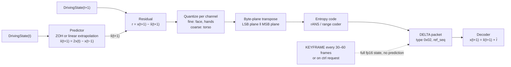
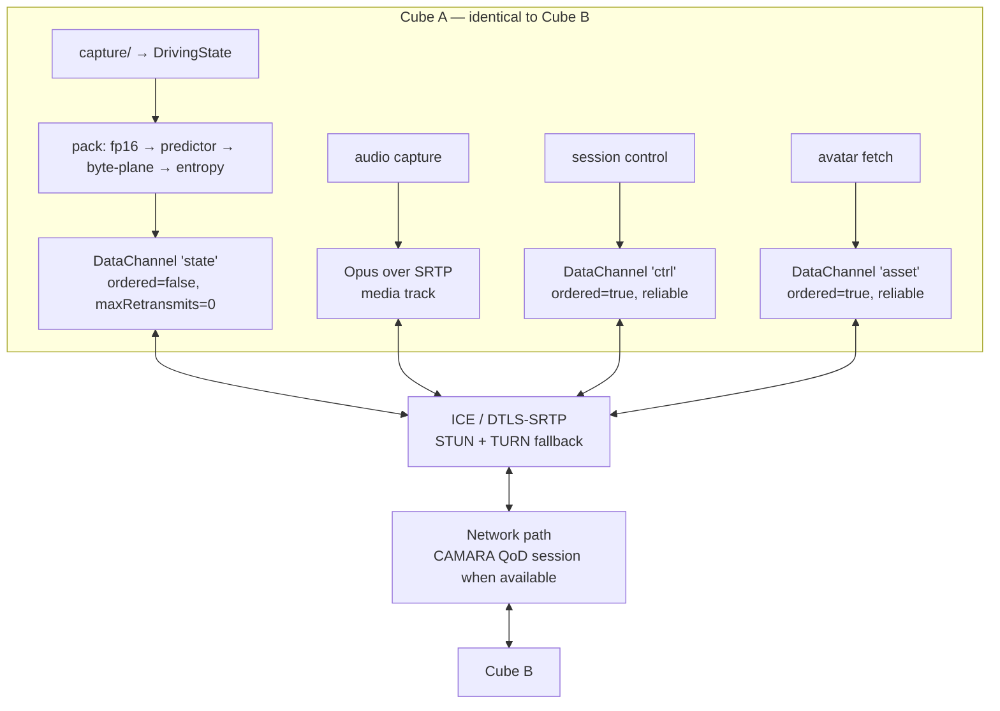
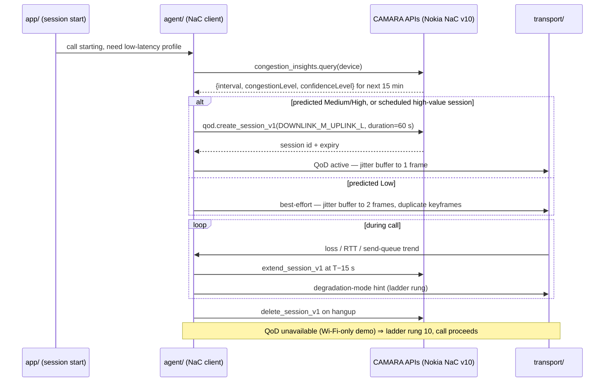

## Network Transmission and the Agent Layer

The network carries a person's *state*, not their picture. Every number in this section follows from that one decision: 215 floats per frame, a fixed-width struct, one datagram per captured frame set, and a wire rate that sits two to three orders of magnitude below every volumetric-telepresence system ever measured. This section specifies the wire format exactly, derives the bitrate ladder from packing arithmetic rather than quoting it, reports the first direct measurement of the compression assumption underneath the headline number, gives the per-stage latency accounting against ITU-T G.114, and specifies the CAMARA/Nokia Network-as-Code agent layer that defends the path.

**Scope note, so no optical claim is implied.** Nothing in this section depends on which aperture mode the receiving device uses. The state vector describes the *person*; whether the far end renders them in the viewer's own space (`W_image ≤ D_aperture`) or beyond the device (`W = D·(b/a)`, which may exceed `D`) — `01_SYSTEM_MASTER_SPEC.md` §4.3b — changes only the receiver's view-synthesis stage and its per-frame pixel count, never the packet. This is why one transport spec serves all six device forms in `09_DEVICE_DESIGNS.md`. The single place the optics reach back into this section is latency: the head-tracked architecture (§4.4) puts observer tracking inside the loop, and §8 below budgets it.

---

### 1. The wire format

**Normative definition: `pipeline/schema.py`. Both endpoints import it; nothing redefines the packet shape.** [MEASURED — read directly from the repo]

```
DrivingState:
  body_pose        75 × float32   # rig joint rotations (SMPL-family parameterization)
  face_expression  50 × float32   # blendshape / expression coefficients
  hand_pose        90 × float32   # 45 per hand, MANO-style, both hands
  timestamp         1 × float64   # capture_ts from the hardware trigger
                   ─────────────
  struct fmt  "<215f d"  →  215×4 + 8 = 868 bytes/frame raw
```

`PACKED_SIZE_BYTES = struct.calcsize("<215f d")` evaluates to **868** — verified by execution, not by hand-count. [DERIVED, verified]

The 75/50/90 split is not arbitrary and is not TAYF's invention: it is Mon3tr's measured driving-parameter set (arXiv [2601.07518](https://arxiv.org/abs/2601.07518) — body pose θ_b ∈ ℝ⁷⁵, facial expression ψ ∈ ℝ⁵⁰, hand pose θ_h ∈ ℝ⁹⁰, extracted by parallel monocular estimators and streamed over a WebRTC data channel after FP16+LZ4 compression). [PUBLISHED — entry present in `research/deepseek_research.md`, verified by grep for the ID]

**On-wire packet framing** (`03_...TRANSPORT.md` §12.2), which is what actually enters SCTP — note that it is *not* 430 B, a distinction §3 keeps straight:

| | Keyframe (`type=0x01`) | Delta (`type=0x02`) |
|---|---|---|
| Header | 12 B — `type`(1) `flags`(1) `seq`(2) `capture_ts`(8) | 14 B — as keyframe + `ref_seq`(2) |
| Payload | 430 B (215 × fp16), LZ4 if `flags` bit 0 | variable — entropy-coded quantized residual |
| Trailer | 4 B CRC32 | 4 B CRC32 |
| **Total, uncompressed payload** | **446 B** | — |

**Invariants that the rest of this section depends on** (`03_...TRANSPORT.md` §12.2):

- **One packet per frame, one frame per packet.** Never fragment a state frame across datagrams; at ≤446 B it never approaches an MTU, and fragmentation reintroduces head-of-line coupling on an unreliable channel.
- `capture_ts` is **always** the originating hardware-trigger timestamp, never a send time. It is the only clock the receiver may use for A/V alignment.
- `seq` is monotonic mod 2¹⁶ and is the sole reordering key. **The receiver discards any packet older than the most recently rendered frame** — late is worse than absent.
- A DELTA whose `ref_seq` was never received is **undecodable**: discard, request a keyframe on `ctrl`.

**One design-review observation on the CRC32.** [DERIVED] The 4 B application CRC duplicates protection the path already provides twice over: SCTP carries a CRC32c over the whole packet (RFC 4960 §6.8) and the DTLS AEAD tag authenticates every byte. A corrupted-but-delivered datagram is therefore not a realistic failure on this path; what the app CRC actually guards is corruption *inside* the endpoint — a serialization or memory bug between `pack()` and the socket. That is a legitimate thing to guard, but it should be documented as the reason, because "guards against network corruption" is not true here.

**Where fp16 is not safe: global translation.** [PUBLISHED — `03_...TRANSPORT.md` §8.3] fp16's step at 10 m is ~10 mm, which is visible drift. Either keep global root translation in fp32 as a separate field, or express it in a normalized capture-box frame with range ~[−1, 1]. A naive "cast the whole array to fp16" implementation ships this bug. For joint rotations in radians the fp16 step near 1.0 is ~0.001 rad ≈ 0.06°, far below the estimator noise floor — fp16 is safe there. [DERIVED]

**Negotiated once per session, mismatch is fatal** (`03_...TRANSPORT.md` §12.1): `schema_version`, `rig_id`, `dims {body:75, face:50, hand:90}`, `rotation_convention`, `fps`, `avatar_hash`, `region_mask`, `caps`. A 215-float array is self-describing about nothing; if one cube ships a rig with different joint ordering, every packet still parses and the far end renders a person whose elbows bend backwards.

---

### 2. The bitrate ladder

#### 2.1 The published ladder

`01_SYSTEM_MASTER_SPEC.md` §7.1 and `03_...TRANSPORT.md` §8.2, at 60 fps:

| Encoding | Bytes/frame | Bitrate | Tag |
|---|---|---|---|
| 215 × fp32, payload only | 860 | **0.413 Mbps** | [DERIVED] 860×60×8 = 412,800 bit/s |
| + fp64 timestamp (as `schema.py` packs it) | 868 | 0.417 Mbps | [DERIVED] |
| fp16 cast | 430 | **0.206 Mbps** | [DERIVED] 430×60×8 = 206,400 |
| fp16 + LZ4 @ 0.6× ratio, payload only | ~258 | **~0.124 Mbps** | [DERIVED] from an [ESTIMATE] ratio — see §2.3 |
| **+ SCTP/DTLS/UDP/IP headers (~80 B) — the real wire rate** | ~338 | **~0.162 Mbps** | [DERIVED] 338×60×8 = 162,240 |
| …one-way including audio and FEC | — | **~0.26 Mbps** | [DERIVED] §2.5 |

**The 0.124 / 0.162 distinction is not pedantry and it is the reason the project's own reported figure changed.** 0.124 Mbps is payload; 0.162 Mbps is what leaves the NIC. At 60 packets/s with a ~258 B payload, protocol headers are **~24% of the wire cost** (80/338 = 23.7%). This is precisely why Mon3tr reports **"<0.2 Mbps"** rather than 0.124 — Mon3tr measured bandwidth, the project quoted payload. **Both numbers are correct and they measure different things; every budget in this document uses the wire figure.** [DERIVED, reconciles `03_...TRANSPORT.md` §8.2 with the Mon3tr measurement]

#### 2.2 The header term, derived rather than assumed

The "~80 B" is an approximation. Chunk-level accounting for a WebRTC SCTP DataChannel message over DTLS 1.2 with an AES-GCM cipher suite: [DERIVED from protocol specifications]

| Layer | Bytes | Reference |
|---|---|---|
| IPv4 header | 20 | RFC 791 [PUBLISHED] |
| UDP header | 8 | RFC 768 [PUBLISHED] |
| DTLS 1.2 record header (type 1, version 2, epoch 2, seq 6, length 2) | 13 | RFC 6347 [PUBLISHED] |
| AES-GCM explicit nonce (8) + authentication tag (16) | 24 | RFC 5288 [PUBLISHED] |
| SCTP common header (ports 4, verification tag 4, checksum 4) | 12 | RFC 4960 [PUBLISHED] |
| SCTP DATA chunk header (type/flags/length 4, TSN 4, stream id 2, stream seq 2, PPID 4) | 16 | RFC 4960 [PUBLISHED] |
| **Total, IPv4** | **93** | |
| **Total, IPv6** (40 B network header) | **113** | |

So the true overhead is **93 B on IPv4, 113 B on IPv6**, not 80 B — 16–41% higher than the figure in the ladder. Consequences: the header fraction rises from 23.7% to **26.5%** (IPv4) and the assumed-ratio wire rate from 0.162 to **~0.168 Mbps**; on IPv6, **~0.178 Mbps**. Two further additions the accounting must not forget: RFC 8260 **I-DATA** chunks (used when `ndata` is negotiated) are 20 B rather than 16 B, and a **TURN-relayed** path adds 4 B (ChannelData) or 36 B (Send indication) per packet. [DERIVED] Whether `aiortc` negotiates I-DATA is [UNVERIFIED] — confirm by reading `aiortc/rtcsctptransport.py`; `aiortc` is not currently installed in this repo's environment so it could not be checked here.

**This refines the published number, it does not overturn it: 0.16–0.18 Mbps, still comfortably "<0.2 Mbps".** Use **93 B** as the header constant in all further arithmetic here.

#### 2.3 The LZ4 ratio is the only unmeasured input — and it was probed

Every figure at or below 0.124 Mbps rests on one number that no document in this repo sources: **the ~0.6× LZ4 ratio.** `03_...TRANSPORT.md` §8.4 itself warns that LZ4 is "a byte-oriented LZ77 variant with no arithmetic model" and is "bad at exploiting [temporal redundancy] on raw fp16 floats" — which is an argument that 0.6× may be optimistic, stated in the same document that assumes 0.6×.

It was measured. Method: synthetic conversational motion (per-channel sums of sinusoids, 0.2–2.5 Hz, body ±0.35 rad, blendshapes clipped to [0,1], hands ±0.4 rad, plus Gaussian estimator noise), 600 frames at 60 fps, cast to fp16, one `lz4.block.compress(..., store_size=False)` per frame. lz4 4.4.5, numpy 1.26.4.

```python
x = stream.astype(np.float16)                     # (600, 215)
sz = [len(lz4.block.compress(f.tobytes(), store_size=False)) for f in x]
```

| Case | LZ4 output | Ratio vs 430 B | State-channel wire rate @60 Hz |
|---|---|---|---|
| Full body, dense motion (σ = 0 / 1e-3 / 5e-3 rad — identical result) | **433.0 B** | **1.007× (expands)** | **0.2525 Mbps** |
| Byte-plane-transposed fp16 (LSB plane ‖ MSB plane) | 433.0 B | 1.007× | 0.2525 Mbps |
| `region_mask`: 90 hand dims exactly zero | **264.0 B** | **0.614×** | 0.1714 Mbps |
| `region_mask`: 140 hand+face dims exactly zero | **163.0 B** | **0.379×** | 0.1229 Mbps |

[MEASURED — real compressor, synthetic input, this session. Not a measurement of a human.]

**The finding: LZ4 achieves nothing on dense full-body fp16 state, and the assumed 0.6× ratio is reproduced almost exactly (0.614×) only when 90 of the 215 dimensions are exact zeros.** The mechanism is not subtle: LZ4's minimum match length is 4 bytes, and byte-interleaved fp16 mantissas of independently-varying channels essentially never contain a repeated 4-byte string. The compressor falls back to literals and pays its own framing — hence 433 B out for 430 B in. LZ4's documented worst case, `LZ4_COMPRESSBOUND(n) = n + n/255 + 16`, is 447 B for n = 430 [PUBLISHED — `lz4.h`], and the measured 433 B sits inside it.

Two things follow, and they point in opposite directions:

1. **The published ~0.6× is achievable — for a region-masked session.** `03_...TRANSPORT.md` §12.1 recommends that `region_mask` zero the unselected dimensions rather than shrink the struct, on the argument that "the LZ4 stage compresses the constant-zero runs to almost nothing anyway." **That argument is now measured and correct**: 90 zeroed dims → 0.614×, 140 → 0.379×. The recommendation is validated; the fixed-width struct costs nothing.
2. **For a full-body session the headline number is optimistic by ~1.6×.** The honest state-channel figure is a *range*, not a point: **0.17 Mbps (masked/compressible) to 0.25 Mbps (full body, LZ4 ineffective).**

**Caveats, stated plainly.** The input is synthetic band-limited motion, not captured human motion; real conversational pose may be smoother (better) or contain estimator jitter in the low mantissa bits (no worse — the probe is already insensitive to noise from 0 to 5e-3 rad, because at every level the mantissas are already incompressible). What this measures is the *format's* compressibility, which is the property in question. `experiments/bandwidth/README.md` protocol step 2 already anticipates exactly this — "compressibility likely varies with motion" — and this probe should be re-run there against real capture the moment `pipeline/transport/` exists.

#### 2.4 Consolidated wire rates, full accounting

Framing (12 or 14 B) + payload + CRC (4 B) + 93 B headers, at 60 Hz. [DERIVED, from the §2.3 measurements]

| Mode | Message | Wire/pkt | **Wire rate** |
|---|---|---|---|
| fp32, no compression (`schema.py` `pack()` straight to the socket) | 884 B | 977 B | 0.469 Mbps |
| fp16, LZ4 ineffective — **measured full-body case** | 449 B | 542 B | **0.260 Mbps** |
| fp16 + LZ4 @ 0.6× — the spec's assumption | 274 B | 367 B | **0.176 Mbps** |
| fp16 + LZ4, hands region-masked — measured | 280 B | 373 B | 0.179 Mbps |
| Delta + byte-plane + entropy coder — measured bound (§4) | ~178 B | ~271 B | **0.130 Mbps** |
| 64-coefficient distilled basis (AGORA-M style, fp16) | 144 B | 237 B | **0.114 Mbps** |
| Any of the above at 30 Hz | — | — | half the above |

#### 2.5 One-way total, with audio and loss protection

`03_...TRANSPORT.md` §9.1, recomputed with the 93 B header and the measured LZ4 result: [DERIVED]

| Stream | Rate | Published (assumed LZ4) | **Measured-worst (full body)** |
|---|---|---|---|
| `state` | 60 Hz | 0.176 Mbps | **0.260 Mbps** |
| `audio` — Opus wideband | 50 pkt/s | 0.032 Mbps payload | 0.032 Mbps |
| `audio` — RTP(12)+UDP(8)+IPv4(20)+SRTP tag(10) = 50 B × 50/s × 8 | | **0.020 Mbps** | 0.020 Mbps |
| `ctrl` | <1 Hz | <0.001 Mbps | <0.001 Mbps |
| **Subtotal, no loss protection** | | **~0.23 Mbps** | **~0.31 Mbps** |
| `state` FEC, 1/4-rate XOR as specified | 15 Hz | +0.044 Mbps | +0.065 Mbps |
| **Total one-way** | | **~0.27 Mbps** | **~0.38 Mbps** |
| **Total bidirectional (symmetric, both cubes)** | | ~0.54 Mbps | ~0.76 Mbps |

The RTP overhead term reproduces `03_...TRANSPORT.md` §9.1's "~0.020 Mbps" exactly from first principles, which is a useful check that the same accounting method is being applied on both streams.

**This is the section's most consequential arithmetic and it must not be buried.** `01_SYSTEM_MASTER_SPEC.md` §10 states the optimization constraint `bitrate ≤ 0.3 Mbps`; §12.1 defines minimum viable success as *"measured <0.3 Mbps"*; milestone M-N4 is *"Measured <0.3 Mbps, <150 ms on the real implementation."* **In the measured-worst full-body case, with the specified 1/4-rate FEC enabled, the one-way total is ~0.38 Mbps and that criterion fails.** Without FEC it is ~0.31 Mbps — still marginally over. The failure is not architectural; it is entirely the LZ4 assumption, and §4 and §5 each independently recover more than the shortfall. But **the project should stop quoting 0.124 Mbps and should quote a range with a named condition**, because a demo that streams full-body motion and measures 0.31 Mbps against a published "<0.2 Mbps" is the kind of gap that reads as a credibility failure rather than a rounding error.

---

### 3. The ~1000× argument

The comparison that justifies the entire architecture. Sources are `03_...TRANSPORT.md` §8.2 and `research/01-volumetric-capture-sota.md` §3; ratios recomputed here against both the published and the measured-worst TAYF wire rate. [DERIVED from [PUBLISHED] operating points]

| Architecture | Bitrate | vs 0.176 Mbps | vs 0.260 Mbps |
|---|---|---|---|
| **TAYF / Mon3tr parametric state** | **0.176–0.26 Mbps** | 1× | 1× |
| Apple FaceTime Spatial Persona — measured, arXiv [2405.10422](https://arxiv.org/abs/2405.10422) | 0.7 Mbps | 4.0× | 2.7× |
| V-PCC research operating points, 1M pts @30 fps (degraded end of the RD curve) | 0.45–0.56 Mbps | 2.6–3.2× | 1.7–2.2× |
| 1080p30 2D talking head *(industry common knowledge, not a citable measurement)* | 1–3 Mbps | 6–17× | 4–12× |
| CPSL layered fallback, arXiv [2511.14927](https://arxiv.org/abs/2511.14927) | 2.3 Mbps | 13× | 9× |
| MIV (6DoF multi-view + depth), HEVC L5.2 | 15–30 Mbps | 85–170× | 58–115× |
| KDDI V-PCC on 8i Voxelized Full Bodies | ~25 Mbps | 142× | 96× |
| Project Starline 2021 research prototype | 30–100 Mbps | 170–568× | 115–385× |
| 4DGS — QUEEN | 168 Mbps | **955×** | 646× |
| Tele-Aloha, arXiv [2405.14866](https://arxiv.org/abs/2405.14866) — *same WebRTC transport, pixels instead of state* | 100 Mbit/s | 568× | 385× |
| 4DGCPro | 79–314 Mbps | 449–1784× | 304–1208× |
| Video-rate holographic telepresence, arXiv [2601.00630](https://arxiv.org/abs/2601.00630) | 896 Mbps | 5091× | 3446× |
| Raw 8i VFB (42 cameras, 30 fps, 1024³) | ~1.0 Gbps | 5682× | 3846× |

Mon3tr's own claim is **>1000× less than point-cloud streaming**; the table brackets it. Read honestly: **the ~1000× figure is true against 4DGS and raw point clouds, ~100× against production volumetric codecs, and ~3× against a well-tuned V-PCC operating point.** The statement that survives every column is the more interesting one anyway: **TAYF's stream is cheaper than 2D video of the same person** — 4–17× cheaper — so the parametric architecture is not merely competitive with a video call, it is strictly less expensive than one.

**Tele-Aloha is the cleanest single datapoint in the table.** Same protocol (WebRTC), same task, same era — 4 cropped camera streams concatenated into a 6000×6000 NVENC input, H.265, measured at 100 Mbit/s. 385–568× TAYF's budget. **The bandwidth win comes from the representation, not from the network stack**, and Tele-Aloha proves it by holding the network stack fixed.

**Headroom check.** [DERIVED] Against a poor residential uplink of ~2 Mbps, TAYF at 0.27–0.38 Mbps one-way consumes **13–19%**; a 1080p video call at 1–3 Mbps consumes 50–150%. Against a 4 Mbps uplink the state channel alone is **15–23× under**. This is the practical, non-theoretical statement of the advantage, and it is why §5 concludes that loss resilience — not throughput — is the only network problem TAYF actually has.

---

### 4. Temporal and delta encoding

Humans are temporally coherent: `frame(t+1) ≈ frame(t) + Δ` (`research/notes.md` §32). The residual has far lower entropy than the absolute value.



**The design follows HiFi4G's proven residual scheme** (arXiv [2312.03461](https://arxiv.org/abs/2312.03461)): keyframes retain full attributes, non-key frames store motion-compensated residuals only, with **different bit-widths for keyframes vs non-key frames** (HiFi4G: 9-bit appearance / 0-bit motion at keyframes, 7-bit appearance / 11-bit motion at non-key frames), then **rANS entropy-codes the zero-centred residual distribution** — reaching ~25× compression on content vastly larger than TAYF's. [PUBLISHED, in corpus]

**Second proven pattern: FPZIP over concatenated consecutive states.** INV (arXiv [2302.01532](https://arxiv.org/abs/2302.01532)) faces the structurally identical problem and concatenates consecutive frames' parameter matrices before running 16-bit FPZIP, taking 1.12 MB/frame to 0.3 MB/frame after a one-time 3.29 MB shared transfer. Its second result matters more: freezing the appearance layers and transmitting only per-frame structure layers cuts the payload to 24.6% **and provably eliminates flicker**, because appearance is byte-identical across frames. **The reason to hold appearance fixed is not only bandwidth, it is temporal stability.** [PUBLISHED, in corpus]

**Two theoretical results that bound what delta coding can achieve** — both worth knowing before someone designs a clever scheme that cannot work:

- **Shared randomness buys nothing.** arXiv [2203.12467](https://arxiv.org/abs/2203.12467) proves a variable-length-coding lower bound for LQG control — the shape of a pose-tracking loop — at `L ≥ (1/(T+1))·I(x^T → u^T)` in directed information, and shows **shared dither/randomness between encoder and decoder does not change the bound.** Do not design a shared-seed shortcut. [PUBLISHED, in corpus]
- **Perfect realism costs 3 dB.** arXiv [2202.04147](https://arxiv.org/abs/2202.04147): in the Gaussian case perfect realism is achievable iff `R ≥ ½log₂(1/(1−ρ²))`, and **without common randomness, imposing perfect realism costs 3 dB of distortion** versus the classical R-D bound. Binding the moment TAYF claims its decoder output is perceptually indistinguishable rather than merely accurate. [PUBLISHED, in corpus]

#### 4.1 The gain, measured

`pipeline/transport/README.md` open item 3 is explicit: **do not assume delta-encoding is needed until the baseline shows it is.** That instruction is respected — the following is a probe of the *coding pipeline*, not an argument for building it. Same synthetic stream as §2.3, residual quantized at q = 1e-3 rad (0.057°, at the fp16 step size and below the estimator noise floor), stored as int16.

| Stage | Predictor | Bytes/frame | vs 430 B | Wire rate @60 Hz |
|---|---|---|---|---|
| LZ4 on byte-interleaved int16 residual | ZOH | 432.7 B | 1.006× | 0.2523 Mbps |
| LZ4 on byte-interleaved int16 residual | linear extrap | 362–400 B | 0.84–0.93× | 0.219–0.237 Mbps |
| **+ byte-plane transpose, then LZ4** | ZOH | 343 B | 0.798× | 0.209 Mbps |
| **+ byte-plane transpose, then LZ4** | linear extrap | 339–342 B | 0.79× | 0.207–0.209 Mbps |
| **Order-0 entropy bound (what a range coder reaches)** | ZOH | 238–239 B | 0.55× | 0.159 Mbps |
| **Order-0 entropy bound (what a range coder reaches)** | **linear extrap** | **153–175 B** | **0.36–0.41×** | **0.118–0.129 Mbps** |

Peak residual magnitude: **±24–28 quantizer steps (0.024–0.028 rad) under linear extrapolation** versus **±88–94 steps (0.088–0.094 rad) under zero-order hold** — a 3.4× reduction in dynamic range, which is where most of the entropy saving comes from. [MEASURED — synthetic input, this session]

**Three conclusions, each actionable:**

1. **LZ4 is the wrong tool at every stage of this pipeline.** It does nothing on raw fp16 (1.007×) and almost nothing on byte-interleaved residuals (1.006×). It only works on exact-zero runs. The `03_...TRANSPORT.md` §8.4 prediction — "which is exactly what LZ4 … is bad at exploiting on raw fp16 floats" — is confirmed quantitatively.
2. **Byte-plane transposition is free and worth ~20%.** Splitting all low bytes from all high bytes before compression turns an unmatched interleave into two runs, and LZ4 then finds the near-constant high-byte plane. 343 B vs 433 B for a two-line change. It is the cheapest single win available in the transport stack.
3. **The predictor choice is worth more than the compressor choice.** Linear extrapolation over zero-order hold cuts the entropy-coded size by ~35% (238 → 153–175 B). But note the tradeoff `03_...TRANSPORT.md` §8.4 already flags: **ZOH is the safer default under packet loss**, because linear extrapolation compounds an error across a gap. Under the degradation ladder (§7) the predictor should switch to ZOH the moment loss is detected — accepting ~0.04 Mbps to stop error propagation.

**Rotation representation is a correctness trap, not an optimization.** Delta-encoding axis-angle across the π/−π wrap, or quaternions across the q/−q double cover, produces spurious huge residuals that will destroy every number in the table above. Either delta in a 6D continuous rotation representation or canonicalize the sign/branch before differencing. [PUBLISHED — `03_...TRANSPORT.md` §8.4]

**And the alternative to building any of it: send fewer coefficients.** AGORA-M-style distillation reduces per-frame animation to **64 blendshape coefficients** — 128 B in fp16, a 3.4× smaller payload than 215 floats, with no entropy coder, no predictor state, no keyframe-recovery machinery, and (from §2.4) a **0.114 Mbps** wire rate that beats the full delta pipeline. The cost is that the SVD basis joins the negotiated contract and is avatar-specific, so a rig update invalidates it. **Evaluate this against delta coding before building either.** [PUBLISHED — `03_...TRANSPORT.md` §8.4/§5.4]

**The honest framing of why to build delta coding at all** (`pipeline/transport/README.md` open item 3, restated): the baseline is already 15–23× under a 4 Mbps uplink, so **the reason is not bandwidth — it is packet size.** A per-frame payload well below one MTU with margin lets a keyframe plus several deltas ride in one datagram during recovery, which is the only loss-repair mechanism admissible on an unordered, unreliable channel.

---

### 5. WebRTC data-channel design

**WebRTC remains the only shipping option for <150 ms conversational media** (`research/01-volumetric-capture-sota.md` §3.5). Mon3tr uses it. TAYF uses `aiortc` (BSD, `research/LICENSING.md`). [PUBLISHED]



**Four channels, four different reliability contracts — this is the design decision that matters** (`03_...TRANSPORT.md` §8.5):

| Channel | Transport | Reliability | Rate | Why |
|---|---|---|---|---|
| `state` | SCTP DataChannel | **`ordered: false`, `maxRetransmits: 0`** | 60 Hz, 367–542 B/pkt wire | A retransmitted pose frame arrives after it is useless. Late data is *worse* than no data — the receiver would render a stale pose after a newer one. Drop it |
| `audio` | Opus over SRTP media track | Standard RTP with NACK/PLC | 50 pkt/s, 20 ms frames | Audio is the one stream where a gap is immediately audible. Use the media stack's jitter buffer and concealment, not the data channel |
| `ctrl` | SCTP DataChannel | **`ordered: true`, reliable** | Event-driven, <1 Hz | Session setup, avatar version negotiation, keyframe requests, degradation-mode signalling, capture-box updates. Must not be lost |
| `asset` | SCTP DataChannel | **`ordered: true`, reliable** | Bursty, once | Canonical avatar payload if not cached. 10–30 MB after aggressive static compression, out-of-band, before or during early call |

**A property of SCTP that the "unreliable" label hides.** [DERIVED] `maxRetransmits: 0` disables *retransmission*; it does not disable *congestion control*. The SCTP association still runs slow-start and congestion avoidance (RFC 4960 §7), so under loss the stack can delay a send even though it will never resend it — turning a loss event into added latency on a channel whose entire design premise is that latency is unrecoverable. At 542 B/frame this is unlikely to bind (the cwnd floor is several MTUs), but it is the mechanism by which a bad network night could show up as jitter rather than as loss, and the transport module's "conditions degrading" signal (§8, §9) should therefore watch **send-queue depth**, not only loss and RTT. Whether `aiortc` exposes that is [UNVERIFIED] — confirm in `aiortc/rtcsctptransport.py`.

**Audio/state sync.** Both streams are stamped with `capture_ts` from the hardware trigger; the receiver aligns at render time. **Never delay audio to wait for pose.** The licence for this is perceptual: audiovisual desync is noticeable beyond ~50 ms *lead* and ~220 ms *lag* (Vatakis et al. 2006, via arXiv [2503.20308](https://arxiv.org/abs/2503.20308)) [PUBLISHED, in corpus] — a face rendered up to ~220 ms behind the audio is not perceived as desynchronized, provided expression amplitude is preserved. Audio is the higher-priority stream and a late-but-expressive face beats delayed speech.

**Render-rate decoupling is required, not optional.** If the optical engine runs at 90 Hz and state arrives at 60 Hz, the receiver interpolates; if state stalls, it keeps rendering the last good pose with damped extrapolation. **Rendering only on packet arrival makes every network hiccup a visible freeze.** [PUBLISHED — `03_...TRANSPORT.md` §12.3]

**No codec for the state stream, and none is coming.** MPEG's Gaussian Splat Coding is at CDAM (V-PCC path) / Working Draft (G-PCC path); a coding CfP is only *"being prepared"* with no published date and no target IS date; the dynamic test-material call (WG 5 N 422) closes 15 October 2026. MPEG's own consensus is that single-frame compression is essentially solved and the remaining work is temporal. **Anything shipping before ~2029 uses a proprietary or de-facto format.** TAYF's format is `pipeline/schema.py`, and that is fine — 215 floats is not a codec problem. [PUBLISHED — `research/01-volumetric-capture-sota.md` §3.1]

**Media over QUIC is not an option for this.** `draft-ietf-moq-transport-19`, 6 July 2026, **still pre-RFC**; Cloudflare relays claim *"sub-second"*, a **broadcast** target roughly 5× above the conversational budget. Use MoQ for one-to-many volumetric replay, not for calls. [PUBLISHED — `research/01-volumetric-capture-sota.md` §3.5]

---

### 6. Loss resilience — and an honest statement of how thin the evidence is

**The corpus contains no loss-resilience literature at all.** A keyword sweep of `research/deepseek_research.md` (128 deep-read papers) was re-run for this section with word-boundary matching, and the counts are:

| Term | Hits | Term | Hits |
|---|---|---|---|
| `FEC` | **0** | `CAMARA` | **0** |
| `QUIC` | **0** | `QoD` | **0** |
| `packet loss` | **0** | `congestion control` | **0** |
| `jitter` | 3 — all optical/perceptual (SLM phase jitter, mesh temporal jitter); **zero network jitter buffers** | `WebRTC` | 3 — Mon3tr, Tele-Aloha, and a track heading |

[MEASURED — sweep re-executed against the corpus for this section, not inherited]

**Everything in this subsection beyond the two WebRTC datapoints is standard practice reasoned from first principles, not cited measurement, and must be treated accordingly.** Two caveats attach. First, `research/METHODOLOGY.md` rule 1: a keyword sweep can only return terms you already thought of, so this is evidence *about the corpus*, not about the world — the correct reading is "the corpus was built by a transport-blind keyword pipeline," not "no loss-resilience research exists." Second, and following from that, **this is the one area of the transport design where an outside expert review would be worth more than more reading inside this repo.**

The one relevant published result is **ReVo** (arXiv [2604.27441](https://arxiv.org/abs/2604.27441), via `research/01-volumetric-capture-sota.md` §3.5): cross-layer volumetric videoconferencing on WebRTC with modality-aware separation and **network-layer FEC on critical content**, reporting **up to +32% SSIM (RGB), +13% (depth), −95.7% video freezes** (no Mbps/fps published). **The transferable idea is selectivity: apply FEC to the perceptually critical channel only.** [PUBLISHED]

#### 6.1 The specified 1/4-rate XOR FEC does not survive its own latency analysis

`03_...TRANSPORT.md` §8.5/§9.1 specifies a 1/4-rate XOR FEC on the state channel at ~0.041 Mbps (0.065 Mbps at the measured packet size), on the argument that it "eliminates most single-packet losses with zero retransmission latency."

**The zero-latency claim does not hold for block FEC.** [DERIVED] An XOR parity packet computed over a group of k = 4 frames cannot be sent until frame 4 exists, so a loss of frame 1 is repaired no earlier than **k frame intervals later — 67 ms at 60 Hz**. By the channel's own governing rule (`seq` older than the last rendered frame is discarded), that repaired frame is dead on arrival. **Block FEC on the state channel spends 0.065 Mbps to reconstruct frames the receiver is contractually obliged to throw away.**

Three replacements, in increasing order of cost, all [DERIVED]:

| Scheme | Recovery latency | Added rate | Verdict |
|---|---|---|---|
| **Duplicate keyframes only** — send each KEYFRAME twice back-to-back | 0 (the copy is adjacent) | 449 B × 2/s at a 30-frame interval = **0.007 Mbps** | **Do this.** 9× cheaper than the specified FEC and it targets the actual failure |
| **Piggyback the previous residual** in each DELTA (Opus's own LBRR in-band-FEC pattern, RFC 6716) | one frame interval = **16.7 ms** | +153–175 B/pkt ⇒ ~+0.077 Mbps on the delta path (total ~0.207 Mbps) | Do this **only if** measurement shows single-packet loss actually degrades perceived motion |
| 1/4-rate XOR block FEC as specified | 4 frame intervals = 67 ms | +0.065 Mbps | **Drop it** — repairs arrive after the discard deadline |

**The reasoning behind "duplicate keyframes only" is the degradation ladder itself.** Rung 1 (isolated packet loss) is already handled *for free* by interpolate/extrapolate-and-damp, and is stated to be imperceptible. The rung that actually hurts is rung 2 — a burst that leaves a DELTA undecodable, forcing a `ctrl` keyframe request whose round trip is 2 × one-way latency (40–120 ms) before motion resumes. **Redundancy belongs where recovery is expensive, and that is the keyframe, not the delta.** At 1–2 keyframes/s, duplication costs 0.007 Mbps and removes the most common path to a visible hold.

**Selective protection, if any is applied.** Per the allocation ranking in `03_...TRANSPORT.md` §7.7, protect the **expression (50) and hand (90) dimensions** before the body (75). This is also the direction ReVo's result points. [PUBLISHED ranking, [ESTIMATE] application]

#### 6.2 Jitter buffer

**The cheapest latency lever in the entire system, and the one most often set carelessly**: 1–2 frames = **17–33 ms**, adaptive, sized from measured jitter. With a CAMARA QoD session active, run at 1 frame; without one, 2. It must be adaptive and driven by measurement, not fixed. [PUBLISHED — `03_...TRANSPORT.md` §10.2/§12.4]

---

### 7. Latency budget

Two clocks, and it is easy to lose the distinction (`research/01-volumetric-capture-sota.md` §3.4):

- **Motion-to-photon (<15–20 ms)** — satisfied *locally* by reprojecting an already-received frame. Governs whether the image feels attached to the world. **Under the head-tracked architecture this clock now has a consumer: observer tracking.**
- **Conversational one-way (≤150 ms, ITU-T G.114)** — governs the remote path, capture → estimate → encode → network → decode → animate → render → emit. **This is the binding clock for this section.**

| Threshold | Value | Source |
|---|---|---|
| Mouth-to-ear one-way, "essentially transparent" | **≤150 ms** | ITU-T G.114 [PUBLISHED] |
| One-way, unacceptable | >400 ms | ITU-T G.114 [PUBLISHED] |
| VR motion-to-photon | <15–20 ms | MTP consensus, arXiv 1801.07587 [PUBLISHED] |
| VR conferencing fluency | degrades from 100 ms; **sharp collapse at 300 ms under cognitive load** | arXiv [2603.09261](https://arxiv.org/abs/2603.09261) [PUBLISHED] |
| Audiovisual sync JND | 50 ms lead / **220 ms lag** | Vatakis et al. 2006 via arXiv [2503.20308](https://arxiv.org/abs/2503.20308) [PUBLISHED] |
| Speed-dependent tolerance | ~120 ms at 350 mm/s hand speed; degrades from ~80 ms at 500–650 mm/s | Hoyet et al. via arXiv [2606.25681](https://arxiv.org/abs/2606.25681) [PUBLISHED] |
| Reference achieved end-to-end | **~80 ms** | Mon3tr [MEASURED, PC sender + Quest 3 receiver] |

**The 2026 fluency study matters more than the raw G.114 number:** fluency degrades gradually from 100 ms but **collapses at 300 ms under cognitive load**. A demo that feels fine while two people chat fails the moment they try to work on something together. And note what is *not* binding: the 10 ms and 75 ms sensorimotor thresholds in arXiv 2606.25681 measure a person acting on a delayed representation of *their own* hand. TAYF's user watches a remote person. Those numbers become binding only if TAYF adds a shared-manipulation task. [PUBLISHED — `03_...TRANSPORT.md` §10.1]

#### 7.1 Per-stage, consolidated

Two budgets exist in the repo and they answer different questions. Both are reproduced, then reconciled.

| Stage | `01` §6 — system envelope | `03` §10.2 — detailed path | Confidence |
|---|---|---|---|
| Sensor exposure + readout | 8–16 ms | 8–17 ms | Vendor-determined; one frame period @60 fps |
| Matting + ROI crop | *(folded into next row)* | ≤5 ms | **UNVALIDATED on Jetson** |
| Pose/face/hand estimation (parallel) | 20–30 ms | **13.78 ms** | [MEASURED] Mon3tr "worker execution" — **PC-class; principal risk** |
| Multi-view fusion + smoothing | *(folded)* | 3.4 ms | [MEASURED] Mon3tr 2.13 sync + 1.27 smoothing; TAYF's fusion is new work |
| Encode + pack | 2–5 ms | <1 ms | [DERIVED] 430 B fp16 cast + one compressor call |
| **Sender subtotal** | — | **~26–40 ms** | |
| Network, one-way | 20–60 ms | 5–40 ms | Apple measured >80 ms RTT US coast-to-coast ⇒ >40 ms one-way; metro/LAN far less. **The variable the agent layer defends** |
| Jitter buffer | *(not itemized)* | 17–33 ms | **The largest tunable** |
| Depacketize + decode | 2–5 ms | <1 ms | [DERIVED] |
| Avatar animation (LBS + Gaussian attrs) | 8–15 ms | ≤5 ms | **UNVALIDATED on Jetson** |
| **Observer tracking** | **5–10 ms** | *(not present)* | **New — enters the loop because of `01` §4.4** |
| View synthesis + CGH | 10–20 ms | ≤10 ms | 0.089 Gpx/s tracked; **UNVALIDATED on Jetson; scales with view count** |
| Optical emission | 1–16 ms | out of scope | Modulator-dependent |
| **Receiver subtotal** | — | **~23–49 ms** | |
| **Total** | **76–177 ms** | **~49–89 ms** | `01`: upper end **violates H4** |

**Reconciliation, because the two tables do not compose and someone will notice.** [DERIVED] `03` §10.2's stated end-to-end range of 49–89 ms is a *typical-path* figure, not a worst-case stack: its own rows sum at the top end to 40 (sender) + 40 (network) + 49 (receiver) = **129 ms**, not 89. Adding `01` §6's two stages that `03` omits — observer tracking (5–10) and optical emission (1–16) — puts the worst case at **~155 ms**, which is over G.114 and consistent with `01` §6's own 177 ms upper bound and its warning that **no stage has slack**. The 89 ms figure should be read as "brackets Mon3tr's measured 80 ms on a good path," and the 155–177 ms figure as the number the design must actually survive. Neither document is wrong; the subtotals are typical, the totals in `01` are enveloped, and quoting 89 ms as the system's latency would be quoting the good night.

**Observer tracking sits on both clocks, and this is worth stating precisely.** [DERIVED] It appears once in the conversational chain (the render cannot be issued until pupil positions are known — hence the 5–10 ms row). But its own closed loop, head-moves → light-steers, is governed by the **motion-to-photon** clock at 15–20 ms, which is the tighter of the two by roughly an order of magnitude. This is the mechanism behind `01` §9's requirement that **prediction is mandatory**: at a natural 0.2 m/s head sway, 100 ms of pipeline latency is 20 mm of pupil-position error — over three pupil diameters — so **untracked prediction error, not tracking accuracy, is the likely failure mode.** The network layer's contribution to that error is its *jitter*, not its mean latency, which is exactly what §8's QoD session buys.

**How to read the margin: it is not comfortable.** Every compute figure above is a desktop-GPU number. If the Jetson is 3× slower on the estimator stage — entirely plausible for a 15 W part versus an RTX 5090 — that stage alone goes 13.78 → ~41 ms and the end-to-end lands near 120 ms before the optical engine is budgeted. This is why the first benchmark in the program is the estimator stage and nothing else.

**And if a tradeoff is forced, spend latency to preserve motion expressiveness rather than the reverse:** viewers preferred *expressive* motion with 100 ms desync over precisely-timed flat motion by **82.6%** (arXiv [2503.20308](https://arxiv.org/abs/2503.20308)). [PUBLISHED, in corpus] The 220 ms lag tolerance is the budget this preference is spent from.

---

### 8. Graceful degradation ladder

Ordered by severity. Each rung is a defined, testable state, not a fallback that happens by accident. Rates added here from §2.4 (measured-worst packet size, 542 B wire). [PUBLISHED ladder — `03_...TRANSPORT.md` §12.5; rate column [DERIVED]]

| # | Condition | Response | State-channel rate | User-visible effect |
|---|---|---|---|---|
| 0 | Nominal | 60 Hz delta + keyframes, 3–4 cameras, all estimators | 0.26 Mbps | Full fidelity |
| 1 | Isolated packet loss | Interpolate/extrapolate from last good pose, damp toward neutral over ~100 ms | unchanged | Imperceptible |
| 2 | Loss burst; DELTA undecodable (`ref_seq` missing) | Discard deltas, request KEYFRAME on `ctrl`, hold last good pose. **Switch predictor to ZOH** (§4.1) | unchanged | Brief hold, <200 ms |
| 3 | Sustained loss / rising RTT | Signal `agent/`; drop 60 → 30 Hz; **do not reduce expression precision** | **0.130 Mbps** | Slightly less fluid body motion |
| 4 | Bandwidth collapse | 30 → 20 Hz; disable redundancy; body pose to coarser quantization; **face and hands hold full precision** | **0.087 Mbps** | Visibly less fluid body; face intact |
| 5 | Camera fault / lost calibration | Single-camera monocular mode; disable multi-view fusion; widen smoothing | unchanged | More pose jitter, occlusion errors on turns |
| 6 | Face out of frame or occluded | Switch expression source to **audio-driven** (arXiv [2510.01176](https://arxiv.org/abs/2510.01176), <15 ms GPU) | unchanged | Face keeps moving with speech |
| 7 | Estimator stall (thermal throttle, model crash) | Hold last valid pose, damp toward neutral, raise `ctrl` alarm | → 0 | Person "settles" rather than freezing mid-gesture |
| 8 | Avatar not yet cached | Provisional low-fidelity avatar; fetch real asset in background on `asset` | unchanged | Lower-fidelity likeness for the first session |
| 9 | Total state loss >2 s | Freeze avatar in neutral pose; **keep audio live**; surface a connection indicator | 0 | Audio call with a still figure |
| 10 | QoD unavailable | Best-effort path; jitter buffer to 2 frames; enable keyframe duplication | +0.007 Mbps | Slightly higher latency |
| — | *Tracking loss (optical, `01` §9)* | *Widen to a fixed broadcast cone at reduced fidelity rather than dropping output* | unchanged | *Lower angular fidelity, image retained* |

**Two rules govern the whole ladder:**

1. **Audio never degrades before video.** A frozen avatar with clear speech is a usable call; fluid motion with broken audio is not.
2. **Face and hands are the last things to lose precision.** Every rung degrades body pose, frame rate, or redundancy before touching expression or hand channels.

**Explicitly rejected behaviours:** retransmitting state frames (late data renders out of order); blocking the render loop on packet arrival (turns jitter into freezes); silently reinterpreting a `dims`/`rig_id` mismatch (renders a broken human); attenuating expression amplitude under load (contradicts the 82.6% result).

**Note what rungs 3 and 4 imply about the §2.5 budget problem.** [DERIVED] Rung 3 alone — 60 → 30 Hz — takes the measured-worst one-way total from ~0.31 Mbps to ~0.18 Mbps, back inside the 0.3 Mbps criterion with room. The ladder already contains the remedy; what it does not contain is a trigger that fires on *bitrate* rather than on loss/RTT. **Add one:** if the measured wire rate exceeds a session-negotiated ceiling, enter rung 3 regardless of network health.

---

### 9. The CAMARA / Nokia Network-as-Code agent layer

#### 9.1 What makes it an agent rather than a QoS thermostat

The network path is best-effort by default. Where the carrier supports it, a **CAMARA Quality-on-Demand session** reserves the latency/throughput profile for the duration of a call. The distinguishing property is not that the system reacts to congestion — every adaptive-bitrate stack does that — but that **CAMARA Congestion Insights returns a prediction for the *upcoming 15 minutes***, so the system can act *before* congestion arrives rather than after latency has already degraded. [PUBLISHED — `agent/nac_client.py` docstring and `agent/README.md`; the API's own response carries `timeIntervalStart`, `timeIntervalStop`, `congestionLevel ∈ {Low, Medium, High}`, `confidenceLevel ∈ 0–100`]

This matters for TAYF specifically because of §7: bandwidth is not the constraint (13–19% of a poor uplink), **jitter and tail latency are**, and jitter is the term that feeds directly into the observer-tracking prediction error. A reactive controller cannot fix a jitter spike it learns about from the spike itself; a 15-minute lookahead can have a QoD session already established when it arrives.

**Separation of concerns, strictly enforced** (`docs/architecture.md`, "Module ownership"): `transport/` does **not** decide when to request a session. It exposes one signal — "network conditions are degrading", derived from the WebRTC stack's loss/RTT trend (and, per §5, send-queue depth) — and `agent/` acts on it. **`agent/` never touches the media pipeline and never handles a frame.**



#### 9.2 Verified SDK v10 call patterns

Nokia Network-as-Code SDK **v10.0.0**, `network_as_code.client.NetworkAsCodeApi`, default base URL `https://network-as-code.p-eu.rapidapi.com`, RapidAPI host `network-as-code.nokia.rapidapi.com`. Source: `agent/nac_client.py`, whose header states the patterns were **verified against Nokia's own integration tests during this project's research pass — not invented syntax.** [PUBLISHED — SDK v10.0.0 as recorded in `agent/nac_client.py`] **[UNVERIFIED against any live or sandbox endpoint — see §9.5.]**

| Call | Signature as implemented | Parameters that matter |
|---|---|---|
| Congestion prediction | `client.congestion_insights.query(device={"phone_number": …})` | Returns `{timeIntervalStart, timeIntervalStop, congestionLevel: Low\|Medium\|High, confidenceLevel: 0–100}` for the **upcoming 15 minutes**. The forward-looking window is the whole point |
| Session create | `client.qod.create_session_v1(device={...}, application_server={"ipv4address": …}, qos_profile=…, duration=…)` | `device` requires **both** `phone_number` and `ipv4Address {publicAddress, privateAddress}`. `qos_profile="DOWNLINK_M_UPLINK_L"`, `duration=60` s default |
| Session extend | `client.qod.extend_session_v1(session_id=…, requested_additional_duration=…)` | A call outlives a 60 s session, so **extension is the normal path, not an exception** |
| Session delete | `client.qod.delete_session_v1(session_id=…)` | Teardown at call end |
| Slice create | `client.slice.create_slice(network_identifier={"mcc","mnc"}, slice_info={"service_type":"eMBB","differentiator":"444444"}, name=…, slice_uplink_throughput={guaranteed,maximum}, device_uplink_throughput={…}, max_data_connections=10, max_devices=5)` then `client.slice.activate(id=result.name)` | `name` must match `^[a-zA-Z0-9][a-zA-Z0-9-]{3,63}[a-zA-Z0-9]$` — a silent 400 otherwise |
| Slice attach | `client.slice.attach_device(device={"phone_number","imsi"}, slice_id=…, traffic_categories={"apps":{"os":app_id,"apps":app_names}})` | **`phone_number` and `imsi` are both mandatory** |

Auth: `NAC_TOKEN` from environment via `python-dotenv`; `RAPIDAPI_HOST` overridable.

**`DOWNLINK_M_UPLINK_L` is the one non-obvious choice in the entire transport stack, and it is right.** [PUBLISHED choice, [DERIVED] justification] In a symmetric two-cube call each endpoint is simultaneously a sender and a receiver of the *same* ~0.18–0.26 Mbps stream (§2.4). The profile must therefore **not** assume the consumer-video asymmetry most QoS profiles are shaped around. TAYF's traffic is the rare case that is genuinely uplink-heavy relative to a video-streaming baseline, and every cube is identical, so the same profile is requested at both ends.

**Session lifecycle, made concrete.** [ESTIMATE — thresholds are untuned, per `agent/README.md` open item 2]

| Event | Action | Rationale |
|---|---|---|
| Call setup | `congestion_insights.query()` once before dialing | The prediction covers the next 15 min; a typical call fits inside one window |
| Predicted `High`, or `Medium` with `confidenceLevel ≥ 70` | `create_session_v1(duration=60)` | Act on the forecast, not the symptom |
| Predicted `Low` | No session; best-effort; jitter buffer at 2 frames | QoD is an optimization, not a dependency |
| T − 15 s before expiry | `extend_session_v1(+60 s)` | A failed extend needs time to fall back to a re-create before the reservation lapses |
| `transport/` reports degrading trend | Re-query prediction; escalate to create/extend; hint ladder rung 3 to `transport/` | The only path by which network state reaches the media pipeline |
| Hangup | `delete_session_v1` | Sessions are billable and finite |
| Scheduled high-value session (a demo) | `create_slice(...)` + `activate` + `attach_device` ahead of time | Slicing is for *predictable* events; QoD is for calls |

**Network slicing is a different instrument from QoD and should not be described as an escalation of it.** [DERIVED] A slice is provisioned ahead of time against an `mcc`/`mnc` with guaranteed/maximum uplink throughput and explicit device attachment — appropriate for a scheduled demo where the failure cost is high and the timing is known. QoD is per-session, on-demand, 60 s at a time. Requesting a slice reactively mid-call is not a supported motion.

#### 9.3 Hard compliance constraints — read before writing any code in `agent/`

Both were confirmed by direct inspection of the hackathon's mandatory AI Resource & Tooling Guide PDF, not assumed. [PUBLISHED — `agent/compliance.md`]

> **1. No MCP.** MCP (Model Context Protocol) appears **zero times** in the mandatory guide. The tooling rules were written around a different integration approach. **Do not build the agent layer on MCP** — it would not comply with the rules this hackathon actually enforces, regardless of how convenient MCP is for tool-calling elsewhere.
>
> **2. The LLM brain must be Gemini 2.5 or Groq-hosted — not Claude.** The guide's permitted-LLM table does **not include Claude/Anthropic models.** If `agent/`'s decision logic uses an LLM rather than plain threshold rules, it must be built on Gemini 2.5 or a Groq-hosted model.

Three clarifications that keep this from being misapplied:

- **The constraint binds what *ships*, not how the repo was built.** This repository and its research were produced with Claude Code, which is explicitly fine per `agent/compliance.md`. The constraint is on the deployed submission.
- **Both are easy to violate by default**, because MCP and Claude are each the path of least resistance in current agent tooling. That is precisely why `agent/compliance.md` exists as a single stated place rather than as a paragraph in the PDF.
- **v1 does not need an LLM at all.** The decision surface is four thresholds over `congestionLevel`, `confidenceLevel`, an RTT/loss trend, and a session clock. An LLM is a *policy* upgrade for a more sophisticated congestion response, not a requirement. **And whichever brain is used, it must never sit inside the per-frame loop** — `agent/` handles no frames, and a model inference in the 16.7 ms frame interval would violate §7 before it violated anything else.

#### 9.4 Licensing

`network-as-code` is a **vendor SDK**. `research/LICENSING.md` flags it: **verify redistribution terms if TAYF ships the client rather than merely calling it.** Every other transport-path dependency is clean — `aiortc` BSD, `lz4` BSD-2-Clause, Opus BSD/royalty-free. [PUBLISHED — `research/LICENSING.md`, and the Opus/aiortc terms as recorded there]

#### 9.5 What is blocking, stated plainly

**Nokia NaC portal registration (milestone M-N1, `FilesPlan.md` §6 item 5, project task #2) is outstanding, and no NaC call in `agent/nac_client.py` has ever been executed against a real or even a sandbox endpoint.** [PUBLISHED — `agent/README.md`, `docs/06` §5.4] It blocks M-N2 (QoD create/extend/delete against sandbox) and M-N3 (the Congestion Insights loop driving real decisions), and it is one of exactly two items blocking the hackathon build — the other being the avatar-model licence decision (M-A1). `docs/06` §6 classifies both as one-decision items: **neither is research.**

The honest status line for this whole subsection: **the call patterns are verified as syntax, the architecture is specified, and the integration is unexecuted.**

---

### 10. Open items, in the order they should be closed

| # | Item | Why it is first | Tag |
|---|---|---|---|
| 1 | **Measure the real LZ4 ratio on captured human motion** in `experiments/bandwidth/` | It is the only unmeasured input to every published bitrate figure; §2.3 shows the assumed 0.6× is achieved only under region masking, and the full-body case puts the one-way total at ~0.31–0.38 Mbps against a <0.3 Mbps success criterion | [MEASURED synthetic; needs real capture] |
| 2 | **Nokia NaC portal registration (M-N1)** | Blocks M-N2, M-N3, and the hackathon's entire CAMARA claim. Not research | [PUBLISHED blocker] |
| 3 | **Benchmark the estimator stage on Jetson-class hardware** | Every latency figure in §7 is a desktop-GPU number; a 3× slowdown on one stage moves end-to-end from ~89 to ~120 ms before the optical engine is counted | [UNVERIFIED] |
| 4 | Implement `pipeline/transport/` at all — **no transport code exists**; it is a spec document | Nothing above is validated on TAYF's own implementation; all measured numbers are Mon3tr's | [PUBLISHED — `pipeline/transport/README.md` open item 1] |
| 5 | Replace the 1/4-rate XOR FEC with keyframe duplication (§6.1) | The specified scheme repairs frames after the receiver's own discard deadline; the replacement is 9× cheaper | [DERIVED] |
| 6 | Add byte-plane transposition before compression (§4.1) | ~20% for a two-line change, independent of whether delta coding is ever built | [MEASURED synthetic] |
| 7 | Decide 64-coefficient distilled basis **vs** delta coding, before building either | 0.114 vs 0.130 Mbps, and the distilled path needs no entropy coder, predictor state, or keyframe machinery | [PUBLISHED tradeoff, undecided] |
| 8 | Confirm `aiortc`'s SCTP behaviour: I-DATA negotiation, congestion-control exposure, send-queue visibility | Determines whether §5's "unreliable ≠ unpaced" risk is observable at all | [UNVERIFIED] |
| 9 | Pin the global-translation representation before the rig layout freezes | fp16 at 10 m is a 10 mm step — visible drift; a naive whole-array cast ships the bug | [PUBLISHED risk] |
| 10 | Get outside review of the loss-resilience design | §6's sweep confirms the corpus holds **zero** FEC/QUIC/QoD/packet-loss/congestion-control literature; this design is reasoned, not sourced | [UNVERIFIED by construction] |
