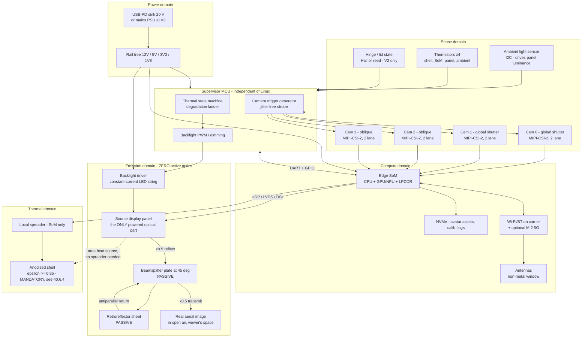
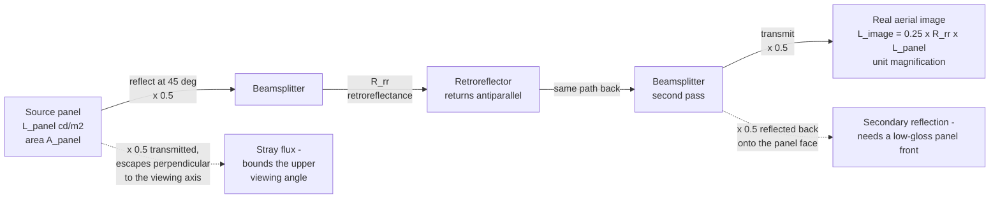
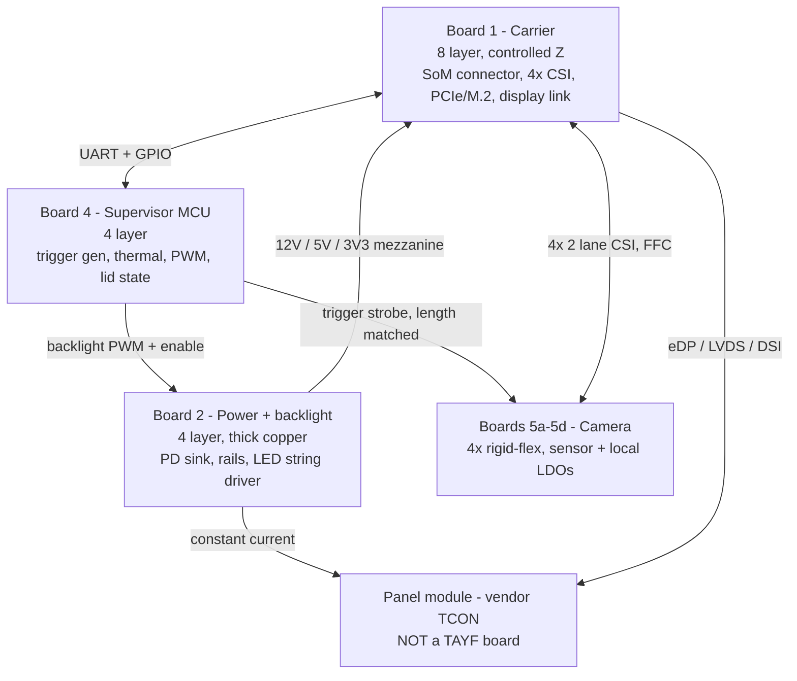
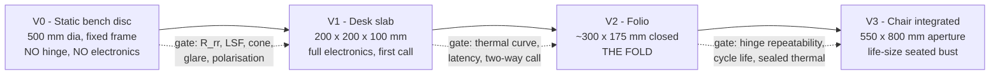

## Hardware, BOM, thermal, and the build ladder

### 40.0 Scope, and what this section replaces

`docs/04_CUBE_HARDWARE_AND_PROTOTYPE_ENGINEERING.md` is a complete lab manual for a **coherent phase-modulator engine in a sealed 100 mm cube**. That architecture is no longer the selected one. This section is the hardware document for the family the aperture law actually permits — **static retroreflective aerial imaging (AIRR)** per `docs/09_DEVICE_DESIGNS.md` — and it inherits doc 04's *method* (first-principles numbers, formula shown, tags on every unverified figure) while replacing most of its *content*.

The mode is named once and used throughout, per `docs/01` §4.3b: **AIRR forms a real image in the viewer's own space, so `W_image ≤ D_aperture`.** No AIRR device in this section is a portal-mode (`W = D·b/a`) device; where portal mode appears it is labelled.

What the architecture change deletes from doc 04, and therefore from this BOM, this PCB stack, and this test-equipment list:

| Deleted | Was | Why it goes |
|---|---|---|
| Spatial light modulator + driver ASIC | 3–5 W, the largest `[U-SPEC]` in doc 04 §3.5 | No wavefront is synthesised; the source is a display panel |
| RGB laser diodes, collimator, expander, PBS | 1–2 W electrical + the entire Class-3B analysis | No coherent source anywhere in the device |
| Optical-source interlock, shutter, monitor photodiode, safety-MCU enable path | doc 04 §2 commitment 1 | Nothing to interlock. The safety domain collapses to thermal supervision |
| Optical driver board (B3), HV rail, constant-current laser driver | doc 04 §9.1, §10.2 | — |
| 3–5 fold mirrors at λ/10, 20 optical surfaces, baffles, wedged covers, IP5X seal + desiccant | doc 04 §5.2–5.5, §12.2 | Three surfaces total, none in a coherent beam |
| Vapor chamber, 90 × 90 × 3 mm | doc 04 §3.7, "required, not optional" | The dominant heat source is now an area source coincident with the largest external face (§40.6.3) |
| Active-alignment station, CMM, bondline dispenser, autocollimator | doc 04 §15.4 | Alignment tolerance loosens by ~30× (§40.5.2) |
| CGH synthesis, observer tracking in the display path, the ±17.2° steering stage | `docs/01` §4.4, §4.6 | An AIRR image is a real 2D image at a fixed plane; there are no angular views to allocate |

**Confidence legend.** Every load-bearing claim below is tagged `[MEASURED]` (measured on hardware, by us or a named paper), `[PUBLISHED]` (a specific verified paper/datasheet/part number states it), `[DERIVED]` (computed here or in-repo, formula shown), `[ESTIMATE]` (engineering judgement, unsourced), `[UNVERIFIED]` (believed, not confirmed — with the missing item named). Doc 04's older `[U-PRICE]/[U-PN]/[U-SPEC]/[U-STD]` tags all map onto `[UNVERIFIED]` here.

> **Nothing in this section is `[MEASURED]` on TAYF hardware, because no TAYF hardware exists.** Every `[MEASURED]` tag below belongs to a cited third-party result. The build ladder in §40.9 exists precisely to convert the `[ESTIMATE]` and `[UNVERIFIED]` rows into `[MEASURED]` ones, in the cheapest order.

---

### 40.1 Hardware block architecture



Four architectural commitments encoded there, each a decision rather than a drawing convention:

1. **The emission domain contains exactly one powered component.** The beamsplitter and retroreflector are sheets of glass and film. This is the whole finding of `docs/09` §2 expressed as a block diagram: the box with "optical engine" written on it in doc 04 §2 has been replaced by a display panel and two pieces of passive glass.
2. **The MCU keeps the camera trigger and gains the thermal state machine; it loses the interlock.** Hardware-synchronised multi-view frames still require a jitter-free strobe off a microcontroller rather than a Linux GPIO (`docs/04` §6.5, §2 commitment 2 — carried forward unchanged). The optical-source enable path, which was the MCU's safety-critical function, no longer exists.
3. **No compartment seal.** Doc 04 §3.8 sealed the optical compartment because a dust particle at a beam waist in a *coherent* folded path produces a whole-field diffraction artifact. AIRR is an incoherent imaging system with no beam waist; a dust particle produces a local scatter of its own area. Dust ingress becomes a contrast/cleaning issue, not a physics issue. **The forced-air veto is therefore lifted on optical grounds** — and §40.6 shows the device does not need forced air anyway, which is the better reason to keep the fan out (it would also forfeit the zero-moving-parts property that is the family's principal advantage).
4. **The display link is the highest-rate signal in the box**, replacing doc 04's modulator link. It is the only interface whose routing constrains the board stack (§40.4).

---

### 40.2 The optical stack as a hardware problem

Three surfaces, in fixed relative geometry. Everything mechanical, thermal and photometric downstream follows from the geometry, so it is derived here before any part is chosen.



#### 40.2.1 The 25 % ceiling is a theorem, not a defect

`docs/09` §3 records "~75 % of source light is lost before the image forms" as an honest caveat. It is stronger than a caveat. Throughput through a non-polarising splitter used once in reflection and once in transmission is `R·T = R(1−R)`, whose maximum over R is **0.25 at R = T = 0.5**. `[DERIVED]`

**η_AIRR = 0.25 · R_rr**, and no choice of splitter ratio improves it. A 50/50 splitter is not a compromise; it is the optimum.

The only escape is to break the symmetry with polarisation, and the geometry invites it: **an LCD emits linearly polarised light for free.** A polarising beamsplitter oriented to reflect the panel's polarisation, plus a quarter-wave retarder in front of the retroreflector, would return light in the orthogonal state and transmit it — giving **η ≈ R_rr instead of 0.25·R_rr, a 4× gain that falls directly out of the source-panel power budget** (§40.6.3). Whether it works depends on one unmeasured property: **does the retroreflector preserve polarisation?** Triple-bounce corner cubes are known to scramble it; bead sheeting depolarises; a dihedral (two-bounce) corner-reflector array may not. `[UNVERIFIED — no measurement, and the AIRR primary literature that would answer it is unread; see docs/09 §3]` The measurement is a rotating linear analyser and a luminance meter, one afternoon at V0 (§40.9.1).

#### 40.2.2 Where the image is allowed to sit — plane-mirror geometry

Take the panel horizontal in the base (facing up), the beamsplitter at 45° with its hinge line at the panel's front edge, the retroreflector vertical at the back facing forward. Let the fold line be the origin, `y` run backward along the panel, `z` up.

A ray leaving panel point `(y, 0)` vertically meets the beamsplitter plane at `(y, y)`, reflects to travel horizontally backward, retroreflects, returns, transmits, and converges at `(0, y)`. `[DERIVED]`

Three consequences, all hard geometry:

| Consequence | Statement | Design impact |
|---|---|---|
| **Image plane** | The image is the mirror of the panel plane about the beamsplitter plane: a **vertical plane standing on the fold line**, height = panel depth | The float standoff is *not* a free parameter. The image stands at the device's front lip. A device that puts a head a metre out into the room is not an AIRR device |
| **The √2 tax** | The beamsplitter must span from `(0,0)` to `(L,L)`, a slant length of **L·√2** for a panel of depth L | The closed footprint must be √2 × the image height. `W_image ≤ D_aperture` still holds (`docs/01` §4.3b); AIRR tightens it by a further 1/√2 **in the fold axis only** |
| **Retroreflector extent** | Rays reach the retroreflector at heights 0…L, so it must be L × W and may sit at any distance behind the panel | The retroreflector has slack in every dimension and in angle. It is the forgiving element |

Applied to the portable unit, this materially changes `docs/09` §06's spec:

| Quantity | Value | Basis |
|---|---|---|
| Panel, 10.4″ 4:3 in portrait | 158.4 × 211.2 mm active | `[DERIVED]` from diagonal and aspect: `w = 0.8 × 264.2`, `h = 0.6 × 264.2`; availability `[UNVERIFIED]` |
| Aerial image | **158 wide × 211 tall — a head at ≈ 92 % of life size** (head ≈ 155 × 230 mm) | `[DERIVED]`, unit magnification |
| Beamsplitter slant | 211.2 × √2 = **298.7 mm**, × 158 mm wide | `[DERIVED]` |
| Closed footprint | **≈ 300 × 175 mm** — under A4, not A4 | `[DERIVED]` |
| Free bay left over | (300 − 211) × 158 ≈ **87 × 158 mm** in plan | `[DERIVED]` |

**The beamsplitter's √2 excess length is exactly the electronics bay.** At a 20 mm internal height that bay is ~275 cm³, against doc 04 §8.1's measured-on-paper 63 cm³ for a SoM plus carrier and 29 cm³ for a power board. The portable unit is not volume-constrained. `[DERIVED]`

#### 40.2.3 Image quality: what actually degrades it

A plane mirror is stigmatic, so **beamsplitter tilt moves the image, it does not blur it.** The quality budget therefore has only three terms:

| Term | Effect | Requirement | Status |
|---|---|---|---|
| Retroreflector cell pitch → line-spread function | **Dominant.** Sets whether eye and mouth features survive | Resolvable feature ≤ 1 mm at 0.6 m viewing (`docs/01` §8's 1 arcmin at 0.6 m = 0.175 mm; 1 mm is the relaxed engineering target) | `[UNVERIFIED]` — the closed-form LSF model is DOI 10.1007/s10043-026-01034-w (Optical Review 2026), record-level only, content unread |
| Beamsplitter second-surface ghost | A displaced, ~4 % copy of the whole image | Lateral ghost separation for t = 3 mm, n = 1.52, θ = 45°: internal angle 27.7°, in-plane walk `2·t·tan27.7° = 3.15 mm`, perpendicular separation `3.15·cos45° = ` **2.23 mm** | `[DERIVED]`. At a 0.2 mm resolvable spot this is a visible doubled edge. **AR-coat the second surface or wedge the plate 0.5–1°** — mandatory, and cheap only if specified before ordering |
| Beamsplitter surface figure | Slope error δ deviates the ray by 2δ; over ~300 mm of remaining path a 1 mrad slope is 0.6 mm of image error | Slope error ≤ ~1 mrad over the clear aperture `[ESTIMATE]` | Rigid float or borosilicate plate meets this comfortably; **a tensioned pellicle almost certainly does not**, which removes the most attractive folding trick (§40.5.3) |

#### 40.2.4 Ambient veiling glare — the contrast term unique to this family

A retroreflector returns light toward its source. Room light entering from the viewer's side transmits the splitter, retroreflects, and transmits back — arriving at the viewer's own eye, registered on the aerial image. Worst case (treating the sheet as a mirror for coaxial light): veiling luminance `= 0.25 · R_rr · L_room`, and a 500 lux room with ρ ≈ 0.3 surfaces sits at `500 × 0.3/π = 47.7 cd/m²`, giving **≈ 8.3 cd/m² of veil**. `[DERIVED]`

Against `docs/02` §7.1's photometric anchors — a real face in that room is **55.7 cd/m²** `[DERIVED, docs/02 §7.1]` and the design target is 200 cd/m² — that is a contrast ratio of 6.7:1 at the "matches a real face" floor and 24:1 at target. Visible haze, not a blocker. The true figure is lower because retroreflective sheeting returns into a narrow cone (typically ~0.5–2° `[UNVERIFIED]`) and most room luminaires are far off the viewer's eye axis, but it is a **first-order term with no analogue in any other display**, it is measurable in an hour, and it is the reason a dark backdrop behind the device matters.

Two published statements bound the viewing geometry and should not be re-derived:

- **Yamamoto (inventor of AIRR), *J. Imaging Soc. Japan* 56(4) 341, 2017: "the aerial image is visible between an eye and the retro-reflector."** `[PUBLISHED]` The viewer must be inside the cone subtended by the retroreflector through the splitter. This, not the panel, sets the viewing zone.
- **Asukanet (ASKA3D), manufacturer: "the size of the projected image and the distance at which an image can be projected depend on the size of the plate."** `[PUBLISHED]` The manufacturer's own statement of `W_image ≤ D_aperture`.
- **Smalley et al., *Nature* 553 486 (2018)** — clipping applies to "all technologies in which the light scattering surface and the image point are physically separate." `[PUBLISHED]` This is why `docs/09` §6's "a device is visible behind the person" is permanent.

#### 40.2.5 What the panel must be, in pixels

The image is real, planar, at the front lip, so the viewer distance `a` is the desk distance. At `a = 0.6 m` and 1 arcmin foveal acuity (2.909×10⁻⁴ rad, `docs/01` §4.2):

`pitch ≤ a · 2.909e-4 = 0.175 mm` → **145 ppi** → for a 158 × 211 mm image, **903 × 1206 px**. `[DERIVED]`

| Panel | Pitch | Verdict at 0.6 m |
|---|---|---|
| 10.4″ XGA 1024 × 768 | 0.206 mm | 15 % short — acceptable, visibly pixel-limited at close range |
| 10.4″ UXGA 1600 × 1200 | 0.132 mm | Comfortable, 1.3× margin |
| Phone-class OLED, ≥ 300 ppi | ≤ 0.085 mm | Far beyond need; buys nothing once the retroreflector LSF dominates |

**Do not specify panel resolution above the retroreflector's line-spread function.** Until the LSF is measured (V0 gate, §40.9.1), UXGA-class is the defensible ceiling and anything finer is unpurchased margin.

---

### 40.3 Component classes and candidate parts

Every part number below is a *class exemplar*, carried forward from `docs/04` §13 and `docs/03` §1, and every one is `[UNVERIFIED]` at SKU level. The defensible content of these tables is the **class** and the **reason**.

#### 40.3.1 Imaging

| Class | Candidates | Requirement, and why | Tag |
|---|---|---|---|
| Global-shutter CMOS | Sony IMX296 (1456×1088, 3.45 µm, 1/2.9″), IMX297, Sony IMX568 (5 MP, 1/1.8″), onsemi AR0234CS (1920×1200) | **Global shutter is non-negotiable** — rolling-shutter skew corrupts the pose estimators' input on fast hand and face motion (`docs/03` §1.2). MIPI-CSI-2 with external trigger input | `[UNVERIFIED]` part/price; class rationale `[PUBLISHED]` (`docs/03` §1.2) |
| Lens | 6 mm M12, < 2 % distortion at 45° | `f = (w/2)/tan(HFOV/2) = 2.51/tan22.5° = 6.06 mm` for 45° HFOV on a 5.02 mm-wide sensor | `[DERIVED, docs/04 §6.1]`; M12 nominal EFL is often ±10 % off — confirm per lot `[UNVERIFIED]` |
| Count | **4** | Pinned by the CSI lane budget, not by field of view: 4 × 2 lanes = 8 lanes, exactly what a Jetson Orin Nano-class module exposes. A fifth camera needs a GMSL2/FPD-Link aggregator (cost, area, ~1 W) | `[DERIVED, docs/04 §6.4]`; lane count `[UNVERIFIED]` |
| Depth sensor | **None** | Stereo at B = 70 mm gives δZ = 1.63 mm at 1 m; the pipeline consumes no depth (monocular regressors → 215 floats) | `[DERIVED, docs/04 §6.3]`, `[PUBLISHED, docs/03 §1.5]` |

**Placement, and why gaze offset is free here.** In a cube, the camera had to sit in a bezel 50 mm off the display centre, producing a 2.9° gaze error, and the classical teleprompter fix cost 50 mm of depth and half the light (`docs/04` §7.3). In the folio the camera sits at the front lip and the image's eyes are ~150 mm above it — a **12.3°** offset at 700 mm `[DERIVED]`, four times worse. It does not matter: **TAYF transmits a parametric state and re-renders at the far end, so gaze is a rendered parameter, not a captured viewpoint.** The estimator recovers head and eye pose in 3D from wherever the camera is, and the renderer aims the avatar's eyes at the *local* viewer, whose position the same cameras already supply. The teleprompter beamsplitter, its 50 mm, and its 2× light cost are deleted from the design. `[DERIVED]` — contingent on estimator accuracy at 12° off-axis, which is `[UNVERIFIED]` and is a V1 measurement.

#### 40.3.2 Compute, radio, sensing

| Class | Candidates | Note | Tag |
|---|---|---|---|
| Edge SoM | NVIDIA Jetson Orin Nano 8 GB (7–15 W configurable modes), Orin NX 8/16 GB (10–25 W) | The anchor load of the whole thermal budget | `[PUBLISHED]` module power-mode band (`docs/04` §0 verified set); specific SKU and mode set `[UNVERIFIED]` |
| Alternative SoC | Rockchip RK3588, Qualcomm QCS-class | CUDA port cost is real and is not a recompile | `[UNVERIFIED]` |
| Discrete NPU | Hailo-8L-class M.2, ~13 TOPS at ~1.5–2.5 W | Doc 04 §3.10 Option 2, "the highest-value hardware experiment in the project" — **still unrun** | `[UNVERIFIED]` spec and price |
| Supervisor MCU | STM32G4/H7-class, RP2350-class | Needs hardware watchdog, ≥ 4 ADC, PWM, ≥ 4 timer outputs for trigger fan-out. **No safety-critical function remains** | `[UNVERIFIED]` |
| Storage | M.2 2242 NVMe, ≥ 256 GB | Avatar assets, calibration artifacts, logs | `[UNVERIFIED]` |
| Wi-Fi/BT | M.2 or on-carrier, ~0.6 W | **Thermally preferred default** | `[ESTIMATE]` power |
| 5G modem | Sub-6 M.2, CAMARA QoD-capable carrier | ~2.5 W to carry 0.162 Mbps — 4× Wi-Fi's thermal cost for the same payload. Present in the BOM for the mobility story, off by default | `[ESTIMATE]` power; `[DERIVED, docs/04 §10.4]` the ratio argument |
| Ambient light sensor | Any I²C ALS with lux + approximate CCT | **Load-bearing here, unlike in the cube**: panel luminance must track ambient because §40.2.4's veiling glare scales with room light | `[UNVERIFIED]` |
| IMU / lid sensor | BMI270/BMI088-class, ICM-42688-class; Hall or reed for lid state | Lid state gates panel power at V2 | `[UNVERIFIED]` |

**The compute load is smaller than doc 04 assumed, and the reason is architectural.** With no CGH synthesis, the receive path is a rasterisation of an already-baked Gaussian avatar — `docs/03` §5's HUGS result is that after enrollment the networks are never evaluated again at animation time, so the render loop is direct LBS deformation plus splatting at 60 fps `[PUBLISHED, docs/03 §5]`. The sender-side estimator stack is unchanged and remains the risk: Mon3tr's 73.6 fps body / 377 fps face / 71.2 fps hands are **RTX 5090-class** figures `[MEASURED, arXiv 2601.07518]`, and BiRefNet matting is 17 fps at 1024² on an RTX 4090 `[MEASURED, docs/03 §2]`. Nothing in this section changes doc 04 §17 item 4: **whether the estimator stack runs at rate on any embedded part is still unmeasured, and it is now the largest compute risk by default, because the optical compute that used to dwarf it is gone.**

Latency consequence, recomputing `docs/01` §6's table with tracking and CGH deleted and a 2D raster substituted:

| Stage | Doc 01 §6 | AIRR |
|---|---|---|
| Observer tracking | 5–10 ms | **0 — deleted** |
| View synthesis + CGH | 10–20 ms | 2–5 ms (2D raster) |
| All other stages | unchanged | unchanged |
| **Total one-way** | **76–177 ms** | **63–152 ms** `[DERIVED]` |

Still grazing H4's 150 ms at the pessimistic end, but with ~14 ms of recovered budget and with the single most fragile term in doc 01 §9 — **prediction of pupil position through 100 ms of pipeline latency — removed from the optical path entirely.**

> **Freedom-to-operate note.** `docs/01` §4.4 flags Google US11474597B2 (using an observer estimate to select which angular views a display physically emits, in force to 2040). An AIRR device emits one image into a fixed cone and selects no views, so on its face it does not read on that limitation. **This is an observation, not an FTO opinion** `[UNVERIFIED]`; `docs/05`'s other families (symmetric capture-and-3D-display terminals, parametric-state transport) are unaffected by the engine change and still apply.

#### 40.3.3 The source panel — the only powered optical component

| Requirement | Value | Basis |
|---|---|---|
| Active area | = the aerial image, exactly (unit magnification) | `[DERIVED, docs/09 §3]` |
| Luminance | `L_panel = L_image / (0.25·R_rr)` → **≈ 5.7 × L_image** at R_rr = 0.7 | `[DERIVED]` §40.2.1 |
| …for the 55.7 cd/m² "matches a real face" floor | **320 cd/m²** — an ordinary panel | `[DERIVED]` |
| …for the 200 cd/m² design target | **1140 cd/m²** — a high-brightness / outdoor-readable part | `[DERIVED]` |
| Interface | eDP or LVDS at V0/V1; MIPI-DSI acceptable if the SoM drives it natively | `[ESTIMATE]` |
| Front surface | Low-gloss / AG, or a circular polariser | §40.2's second-pass return reflects 50 % of the image beam back onto the panel face; a glossy panel returns a ghost | `[DERIVED]` |
| Backlight control | Analogue or high-frequency PWM dimming, ALS-driven | Panel power is the device's largest variable load; dimming is the primary thermal actuator (§40.6.5) |
| Candidates | V0: 43″-class commodity TV/monitor panel. V1: 8–10″ industrial IPS, ≥ 1000 cd/m². V2: 10.4″ 4:3 portrait. V3: ~38″ portrait | all `[UNVERIFIED]` — no vendor pass has been run |

> **The awkward sourcing fact:** an AIRR image of a head is roughly 3:4, and an image of a bust is roughly 5:4. Standard panels are 16:9, 16:10 and 4:3. **A 4:3 panel rotated to portrait is the only stock aspect that fits a head without wasting area**, which is why the 10.4″ 4:3 sets the folio's geometry above rather than the other way round. Anything else means buying panel area that is switched off — paying for it in money and in the backlight's leakage.

#### 40.3.4 Beamsplitter

| Requirement | Value | Tag |
|---|---|---|
| Clear aperture | `L·√2 × W` (§40.2.2) — 299 × 158 mm at the folio; 707 × 500 mm at the disc | `[DERIVED]` |
| Split ratio | 50/50 — the optimum, not a compromise | `[DERIVED]` §40.2.1 |
| Substrate | 2–3 mm float or borosilicate; slope error ≤ ~1 mrad | `[ESTIMATE]` |
| Coating | Front-surface dielectric or Inconel 50/50; **second surface AR-coated, or plate wedged 0.5–1°** | `[DERIVED]` §40.2.3 |
| Polarising variant | Wire-grid / reflective-polariser film laminated to glass + quarter-wave retarder at the retroreflector — **the 4× power lever** | `[UNVERIFIED]`, gated on the retroreflector polarisation measurement |
| Mass | 3 mm float glass at 2500 kg/m³ over 299 × 158 mm = **0.354 kg** | `[DERIVED]` — the single heaviest moving element in the folio and the reason the hinge is a real design problem |

#### 40.3.5 Retroreflector — the part with no substitute

| Family | Pitch / structure | Attractions | Problems |
|---|---|---|---|
| Prismatic corner-cube sheeting (road-sign grade) | ~0.2–1 mm cells `[UNVERIFIED]` | Cheap per m², available in rolls | Coarse LSF; triple-bounce depolarises; not see-through |
| Glass-bead sheeting | ~50–100 µm beads `[UNVERIFIED]` | Cheapest; fine cells | Poor return efficiency and poor LSF; strongly depolarising |
| Precision corner-cube array / dihedral corner-reflector array (DCRA), ASKA3D-class plate | mm-scale, engineered | Fine LSF; **see-through variants exist**, which is what would allow an on-axis camera behind the plate | Expensive; **cost scales with area** (`docs/09` §3), which is the family's cost driver |

**Five specs must be measured before any device is committed, and none of them is known:**

| # | Spec | Why it is load-bearing | Status |
|---|---|---|---|
| 1 | Retroreflectance `R_rr` | Enters panel power linearly | `[UNVERIFIED]` — assumed 0.7 `[ESTIMATE]` throughout §40.6 |
| 2 | Polarisation preservation | **4× on panel power** (§40.2.1) | `[UNVERIFIED]` |
| 3 | Cell pitch → LSF | Decides whether eyes and mouth survive | `[UNVERIFIED]`; DOI 10.1007/s10043-026-01034-w would give the closed form |
| 4 | Acceptance angle | Sets how sloppy the retroreflector's own mount may be — and it is generous, which is why the lid hinge is not precision hardware | `[UNVERIFIED]` |
| 5 | Cost per m² | The BOM's dominant unknown at every size above the folio | `[UNVERIFIED]` |

`docs/09` §7 already lists "source a retroreflector sheet and a beamsplitter" as action 3 and "obtain the AIRR primary literature" as action 1. **This section's contribution is to state exactly which five numbers those actions must return, and what each one changes.**

#### 40.3.6 Power and enclosure

| Class | Choice | Note | Tag |
|---|---|---|---|
| Input, V0–V2 | USB-C PD sink, 20 V (TPS25750 / CYPD / STUSB class) | PD offers 100 W; the enclosure can reject 17–39 W. **Input power is not the constraint; heat is** | `[UNVERIFIED]` part; `[DERIVED, docs/04 §10.3]` argument |
| Input, V3 | Mains PSU external to the furniture | Chair is not portable; keep conversion heat outside the upholstery | `[ESTIMATE]` |
| Conversion | ≥ 94 % synchronous bucks; **do the 20 V → 12 V step in the brick, not the box** | At 92 % the internal tree contributes 0.8–2.2 W of pure heat — 6–14 % of the budget. Cheapest watt in the design | `[DERIVED, docs/04 §3.5]` |
| Backlight driver | Constant-current LED string boost, ≥ 90 % | On a 8 W backlight a 90 % boost dissipates 0.9 W in the base — non-trivial at folio scale | `[DERIVED]` |
| Battery | **Deferred, not ruled out** | Doc 04 §10.3 ruled it out for a 93 %-packed 1 L cube. The folio has ~275 cm³ of free bay (§40.2.2), so the decision is now open and is a V2 question, not a foregone one | `[ESTIMATE]` |
| Enclosure, V0 | Aluminium extrusion frame, laser-cut plate carriers, fixed angles | No hinge, no ID | — |
| Enclosure, V1 | Folded sheet or machined aluminium tray, bonded plate seats | — | — |
| Enclosure, V2 | Aluminium or magnesium clamshell + the linkage of §40.5 | **Anodised, bead-blasted or painted — never polished** (§40.6.4) | `[DERIVED]` |
| Enclosure, V3 | Furniture-grade frame inside a chair back | Upholstery is a thermal insulator; see §40.6.3 | `[ESTIMATE]` |

---

### 40.4 PCB, wiring and interface budget

#### 40.4.1 Board partition



Doc 04's Board 3 (optical driver, 6-layer, HV, laser driver, modulator interface — *"the single biggest `[U-PN]` unknown"*) **does not exist in this architecture.** The panel arrives with its own timing controller; TAYF's obligation is a standard display link and a current source.

#### 40.4.2 Interface budget

| Interface | Count | Rate / class | Note |
|---|---|---|---|
| MIPI-CSI-2, 2-lane | 4 | `1456×1088 px × 60 fps × 10 bit = 950 Mbps` each → **3.80 Gbps aggregate** | `[DERIVED, docs/04 §6.4]`. 100 Ω ±10 %, guarded with stitched ground |
| Display link | 1 | XGA: `1024×768×60×24 = 1.13 Gbps`; UXGA: **2.76 Gbps** | `[DERIVED]`. Highest-rate signal in the box; route on an inner layer between planes |
| SoM connector | 1 | 260-pin SO-DIMM class | `[UNVERIFIED]` footprint |
| Carrier ↔ power mezzanine | 1 | 40-pin, ≥ 3 A per rail pin group | — |
| Carrier ↔ MCU | 1 | UART + 4 GPIO + I²C | — |
| MCU → camera trigger | 1 → 4 | Series-terminated, matched to < 5 mm | Requirement is **inter-camera skew < 50 µs**; at 1 m/s hand speed that is 50 µm of motion, below the 0.54 mm/px sampling `[DERIVED, docs/04 §6.5]` |
| MCU → backlight | 1 | PWM + enable, fail-safe **off** | Thermal actuator |
| Backlight output | 1 | Constant-current LED string, up to ~48 V | The only elevated voltage in the device |
| M.2 M-key (NVMe) | 1 | 2242 | — |
| M.2 B-key (5G) | 1, optional | 3042/3052 | Off by default (§40.3.2) |
| Antennas | 2–4 | MHF4/U.FL to a non-metal window | — |
| Thermistors | 4 | Shell, SoM, panel rear, ambient | Was 6 in doc 04; the modulator and power-board channels go away |
| USB-C PD | 1 | Only external connector | — |

**Two numbers worth putting side by side.** The wire that carries a human being across the world runs at **0.162 Mbps** (`docs/01` §7.1, headers included). The wires inside the box run at **3.80 + 2.76 = 6.56 Gbps**. The ratio is **≈ 40,000 : 1** `[DERIVED]`. Every gigabit of that internal traffic exists to be thrown away — the CSI streams are consumed by estimators and discarded, and the display stream is regenerated locally from 868 bytes per frame. This is the architecture's central claim rendered as a signal-integrity problem.

#### 40.4.3 Wiring across the fold — zero conductors

The retroreflector is passive. If every powered part stays in the base, **no conductor crosses either hinge.** In a folding consumer device the hinge flex is the canonical wear-out mechanism; deleting it removes the only credible failure mode a zero-moving-parts optical stack would otherwise have re-introduced.

> **Design ruling: all electronics, all cameras and the panel live in the base. The lid carries a sheet of retroreflective film and nothing else.** This survives contact with §40.3.1's gaze analysis only because gaze is corrected parametrically; if a future revision wants an on-axis camera behind a see-through retroreflector, it must also accept the first flex across the hinge, and that trade should be made explicitly.

---

### 40.5 Mechanical design

#### 40.5.1 Stack-up by rung

| Rung | Optical mounting | Chassis | Assembly |
|---|---|---|---|
| V0 disc | Extrusion frame, fixed machined angle brackets, shimmed | None | Hand, iterative |
| V1 slab | Bonded plate seats in a folded-sheet or machined tray | Sheet aluminium | Hand |
| V2 folio | **Unresolved — see §40.5.3** | Aluminium/magnesium clamshell | Hand + a hinge-setting jig |
| V3 chair | Fixed seats in a furniture frame | Steel/ply frame, upholstered | Furniture assembly |

**Do not use printed plastic for optical seats past V0.** Printed polymers creep under bolt preload and move with humidity, and the failure is silent `[PUBLISHED, docs/04 §12.1]`. That ruling carries over unchanged; it is one of the few doc 04 mechanical results the architecture change does not touch.

#### 40.5.2 The alignment tolerance, and why it is 30× looser than the rejected design

A plane mirror does not aberrate. A beamsplitter tilt of δ rotates the image *rigidly* by 2δ about the intersection of the old and new mirror planes; the image stays planar, stays in focus, stays the same size. **Beamsplitter angle sets image pose, not image quality.** `[DERIVED]`

Taking a 2 mm placement error at the top of a 211 mm image as the criterion `[ESTIMATE]`:

`δ ≤ 2 / (2 × 211) = 4.7 mrad = 0.27°` `[DERIVED]`

Against doc 04 §5.4's coherent engine, which required **0.67 mrad (0.038°)** on the pre-modulator fold mirror and forced an active-alignment station:

| Architecture | Tightest optical angular tolerance | Consequence |
|---|---|---|
| Coherent folded CGH engine | 0.67 mrad | Active alignment station, UV-bonded adjuster, unknown yield (`docs/04` §12.3, §17.6) |
| **AIRR** | **4.7 mrad** | **7× looser on the one critical plate; ~30× looser than the RSS-of-four-mirrors case.** A hard stop with a preloaded detent is in range for a consumer hinge |

The retroreflector's own angle is bounded by its acceptance cone (`[UNVERIFIED]`, but generous by construction), and the panel is bonded to the base. **Exactly one angle in the whole device is precision-critical, and it is the one the hinge must set.**

#### 40.5.3 The three-surface fold for the portable unit is NOT designed

Stated plainly, because `docs/09` §3 flags it as a caveat and §7 lists it as action 2, and nothing has been done since:

**AIRR requires the panel, the beamsplitter and the retroreflector to hold a fixed relative geometry. Collapsing that into a book-sized hinge is real mechanical design work, and it has not been started.** There is no CAD model, no linkage synthesis, no hinge specification, no cycle-life target, and no prototype. What follows is a statement of the problem's shape and its known constraints — it is not a design.

What is now known, and therefore what the design must satisfy:

| # | Constraint | Source |
|---|---|---|
| 1 | **Two plates must rotate to two different angles from opposite ends of the base**: the retroreflector lid to ~90° at the back, the beamsplitter to **45.0°** hinged at the front lip | `[DERIVED]` §40.2.2 |
| 2 | Only the 45° matters. `±0.27°`, repeatable | `[DERIVED]` §40.5.2 |
| 3 | The beamsplitter is **299 mm long, 158 mm wide, ~0.35 kg of glass** — the heaviest and most fragile moving element | `[DERIVED]` §40.3.4 |
| 4 | It must lie flat when closed, and the closed footprint is already sized to it (300 mm), so it fits — **but the base is only 211 mm deep in panel, so the plate overhangs the electronics bay when closed** | `[DERIVED]` |
| 5 | Zero conductors cross either hinge | `[DERIVED]` §40.4.3 |
| 6 | A single user motion should set both angles, or the device is a two-handed assembly ritual and fails as a bag object | `[ESTIMATE]`, product judgement |

Three candidate mechanisms, none evaluated:

- **Four-bar linkage driving the beamsplitter off the lid.** One user motion, one hard stop, deterministic 45°. Cost: a linkage in the optical volume, and the linkage's own tolerance stack adds to the ±0.27°.
- **Independent beamsplitter strut with a detent.** Simplest, cheapest, most robust; two-handed to open.
- **Tensioned pellicle beamsplitter on a collapsing frame.** Attractive — a membrane has no second-surface ghost at all, deleting §40.2.3's 2.23 mm artifact and the AR-coat cost. **Probably disqualified on figure**: holding ≤ 1 mrad of slope over 299 mm on a stretched film means sub-0.1 mm sag, and film beamsplitters are also fragile in a bag. `[ESTIMATE]` — worth one bench test at V0 before it is abandoned, because the ghost saving is real.

**The one published source that would collapse most of this uncertainty is PMC12111977 (2025)** — an end-to-end integral-photography capture → MMAP aerial display of a human head **with measured misalignment tolerances**, the closest published analogue to this configuration `[UNVERIFIED — record-level only, full text not obtained; docs/02 §6.4]`. Its tolerance table would replace the `[ESTIMATE]` in §40.5.2's criterion with a measured number, which is the difference between specifying a hinge and guessing at one.

> **Honest status: V2 is the only rung in §40.9 whose core mechanism does not exist even on paper.** The ladder is ordered so that V0 and V1 return every optical and thermal number the fold design needs *before* anyone draws it.

---

### 40.6 Thermal

#### 40.6.1 The corrected model

Sealed enclosure, natural convection plus radiation, `h = 8 W/m²K`, `ε = 0.9`, `T_amb = 25 °C`, per `docs/01` §5 and `docs/04` §3, with both of doc 04's corrections applied:

```
Q = h·A·ΔT + ε·σ·A·(T_s⁴ − T_amb⁴)
```

**Correction 1 — participating area.** Not six faces. The base sits on a desk (stagnant boundary layer, radiating into a surface at its own temperature) and the optical exit is not a radiator. Doc 04 §3.2 uses **5 faces**; for the slab and folio geometries below the participating area is accounted explicitly rather than by face count, because these are not cubes.

**Correction 2 — the touch limit is a safety limit.** IEC 62368-1 caps held or touched **metal at ≈ 48 °C** (glass/ceramic ≈ 51 °C, plastic ≈ 60 °C) `[UNVERIFIED — confirm against IEC 62368-1 Table 38 or the current equivalent clause]`. **A 60 °C metal shell is a safety violation, not a comfort complaint**, and every table row above 48 °C describes a device that cannot ship. The binding constraint is human skin, not silicon: at these loads the junction is comfortable while the hand is not, which is why "let it throttle" is not a solution — throttling protects the die.

At ΔT = 23 K (48 °C shell, 25 °C ambient), per unit area:

```
Q_conv/A = 8 × 23                                            = 184.0 W/m²
Q_rad/A  = 0.9 × 5.670e-8 × (321.15⁴ − 298.15⁴)
         = 0.9 × 5.670e-8 × 2.735e9                          = 139.5 W/m²
Q/A                                                          = 323.5 W/m²
```
`[DERIVED]` — and this reproduces doc 04 §3.4's cube figure exactly: `323.5 × 0.05 m² = ` **16.2 W at 100 mm on 5 faces.** Radiation is **43 %** of it.

#### 40.6.2 The load, and what is not in it

| Load | Power | Tag |
|---|---|---|
| Edge SoM, Orin Nano 7 W profile | 7.0 W | `[PUBLISHED]` band; profile choice `[UNVERIFIED]` against TAYF's estimator load |
| Cameras, 4 × global shutter | 1.6 W | `[ESTIMATE]` 0.4 W each |
| Wi-Fi (5G would be +1.9 W) | 0.6 W | `[ESTIMATE]` |
| MCU, sensors, misc | 0.5 W | `[ESTIMATE]` |
| Sub-total | 9.7 W | |
| Conversion loss at 92 % | `9.7 × (1/0.92 − 1) = ` 0.84 W | `[DERIVED]` |
| **Common electronics load** | **10.5 W** | `[DERIVED]` |
| **Source panel** | **see §40.6.3** | `[DERIVED]` from `[ESTIMATE]` inputs |
| Modulator, laser, driver ASIC, scanners, transducers | **0 W — none present** | `[DERIVED, docs/09 §2]` |

#### 40.6.3 Panel power — the only load that scales with the device

```
P_panel = [ L_image / (0.25·R_rr) ] × A_panel × π × k_APL / η_panel
```

Inputs: `R_rr = 0.7` `[ESTIMATE]`, average picture level `k_APL = 0.4` for a lit head on a dark field `[ESTIMATE]`, panel luminous efficacy `η_panel = 6 lm/W` (LED backlight at 100–150 lm/W through an LCD stack transmitting 4–8 %; range 4–12 lm/W) `[ESTIMATE — and this is the cheapest measurement in the project: one monitor, one plug-through wattmeter, one luminance meter]`.

This collapses to **`P_panel/A = 1.196 × L_image` W/m² per cd/m²** `[DERIVED]` — i.e. **66.9 W/m²** at the 55.7 cd/m² real-face floor and **239 W/m²** at the 200 cd/m² design target.

| Device | Panel area | P_panel @ 55.7 cd/m² | P_panel @ 200 cd/m² | @ 200 with polarisation recovery (÷4) |
|---|---|---|---|---|
| V0 disc, 500 mm dia | 0.196 m² | 13.1 W | 46.9 W | 11.7 W |
| V1 slab, 200 × 200 mm | 0.040 m² | 2.7 W | 9.6 W | 2.4 W |
| V2 folio, 158 × 211 mm | 0.033 m² | 2.2 W | 8.0 W | 2.0 W |
| V3 chair, 550 × 800 mm | 0.440 m² | 29.4 W | 105 W | 26.3 W |
| *(a hypothetical 100 mm AIRR cube)* | *0.010 m²* | *0.7 W* | *2.4 W* | *0.6 W* |

Two structural facts fall out:

1. **The panel is an area heat source coincident with the largest external face.** There is no hot spot, no spreading resistance to engineer, and **no vapor chamber** — doc 04's 24 cm³ "required, not optional" part is deleted. Only the SoM needs a local spreader, bonded to the electronics-bay wall.
2. **Panel load and heat rejection both scale with aperture area**, so the AIRR family is close to thermally scale-invariant. The fixed 10.5 W of electronics is what breaks the invariance, and it breaks it *at the small end* — the folio, not the chair, is the thermally hardest AIRR device.

#### 40.6.4 Emissivity has a veto over industrial design

Linearised, radiation is 43 % of rejection at the touch limit and scales linearly with ε. At 48 °C:

| Finish | ε | Q/A | vs. anodised |
|---|---|---|---|
| Anodised, bead-blasted or painted | 0.9 `[UNVERIFIED — confirm per finish]` | **323.5 W/m²** | — |
| Polished or bare aluminium | 0.05 `[UNVERIFIED]` | `184.0 + 7.75 = ` **191.8 W/m²** | **−40.7 %** |

`[DERIVED]`. Note that `docs/01` §5.2 states the same fact as "a 69 % swing" (`323.5/191.8 = 1.69`, reading from polished up to anodised) while `docs/04` §3.3 states it as "40 %" (reading from anodised down). **They are the same number seen from opposite ends; there is no discrepancy.**

Applied to the folio (participating area with the base underside on the desk and the retroreflector's front face optical: **≈ 0.09 m²** `[ESTIMATE]`):

| Finish | Ceiling | Load @ 55.7 cd/m² (12.7 W) | Load @ 200 cd/m² (18.5 W) |
|---|---|---|---|
| Anodised, ε = 0.9 | 29.1 W | 2.3× margin — **PASS** | 1.57× margin — **PASS** |
| Polished, ε = 0.05 | 17.3 W | 1.36× margin — PASS | **18.5 W > 17.3 W — FAIL** |

> **The finish decision is the brightness decision.** A polished-aluminium folio cannot run at the design luminance. It can run at the "matches a real face" floor, and it can run at design luminance *if* §40.2.1's polarisation recovery works (which drops the load to 12.5 W). **One of the two must happen: anodise the shell, or solve the polarisation.** This is a thermal requirement with an aesthetic consequence, not an aesthetic choice with a thermal consequence — and it is now quantified rather than asserted.

#### 40.6.5 Headroom against the rejected architectures

Evaluated at the 100 mm cube where every one of these was assessed, so the comparison is like-for-like: ceiling **16.2 W**, common electronics **10.5 W**, leaving **5.7 W for the engine.**

| Architecture | Engine electrical load | Fraction of the 5.7 W allowance | Verdict |
|---|---|---|---|
| **AIRR (this design)** | **0 W optics + 0.7 W panel** | **0.12×** | **PASS with 5.0 W spare** |
| Pepper's ghost (one splitter pass) | 0 W optics + 0.3 W panel | 0.06× | PASS — but virtual image, fails rule 4 (`docs/09` §3) |
| Holographic CGH | SLM backplane + driver 3–5 W, illumination 1–2 W → **4–7 W** | 0.7–1.2× | **Marginal to failing** — before the CGH compute, which is workstation-GPU-class (`docs/02` §9.2) and pushes the SoC well past 7 W |
| Laser-plasma, sparse wireframe head | **3.6–36 W** | 0.6–6.3× | Marginal at the optimistic bound, **6× over** at the pessimistic one |
| Laser-plasma, dense point cloud | 36–360 W | 6–63× | Dead |
| Laser-plasma, eye resolution | **533 W – 5.3 kW** | **94–930×** | Dead. No laser efficiency improvement closes 250× |
| MATD acoustic trapping, 512 channels | `512 × 0.03–0.1 W = ` **15–51 W** + FPGA | 2.7–9× | Over the *entire device* budget, and unmeasured |
| Swept volume | Rotor + motor | — | `[UNVERIFIED]` — no figure exists in this repo |

Engine-load sources: laser-plasma `[DERIVED, docs/01 §4.7]`; holographic `[ESTIMATE, docs/04 §3.5]` with CGH compute `[PUBLISHED, docs/02 §9.2]`; MATD per-channel figure `[ESTIMATE, docs/08 §9.4]`.

> **Quantified headline: the AIRR optical engine consumes 12 % of the thermal allowance that every other candidate architecture exceeded, and that 12 % is a display panel rather than an engine.** The nearest competitor overruns by 0.7–1.2×; the north-star candidates overrun by 6–930×.
>
> **The reframing that matters:** thermal was ranked risk #1 in `docs/01` §13 and was "the binding constraint" in `docs/04`. **It is not binding on the selected architecture.** Had the aperture law not moved the form factor for *optical* reasons, AIRR would have been the first architecture in this project to close the 10 cm thermal budget — with 5 W to spare. The 10 cm cube was abandoned because a 100 mm aperture shows a 100 mm image (`docs/09` §1), not because it got hot.

#### 40.6.6 Per-device thermal summary

| Device | Participating area | Ceiling @ ε=0.9 | Load @ floor | Load @ target | Margin @ target |
|---|---|---|---|---|---|
| V0 disc (bench, mains, open frame) | ~0.38 m² `[ESTIMATE]` | 124 W | 13.1 W (panel only) | 46.9 W | 2.6× |
| V1 slab 200×200×100 | 0.12 m² `[DERIVED]` | 38.9 W | 13.2 W | 20.1 W | 1.9× |
| V2 folio, open | 0.09 m² `[ESTIMATE]` | 29.1 W | 12.7 W | 18.5 W | 1.57× (0.94× if polished — FAIL) |
| V3 chair | ~0.9 m² `[ESTIMATE]`, **less whatever upholstery covers** | 301 W nominal | 39.9 W | 116 W | 2.6× nominal |

**V3's caveat is not the number, it is the fabric.** A chair back is upholstered, and upholstery is an insulator over the largest available radiating surface. The chair's real participating area is the glass aperture plus any uncovered structure, and **the thermal design of V3 is an upholstery-layout problem** — 116 W at design luminance is trivial for 0.9 m² of bare metal and impossible for 0.9 m² of foam and fabric. `[ESTIMATE]` — this is a V3 design task with no work done.

**Actuator ladder** (MCU-owned thermal state machine, per `docs/04` §3.9's requirement, retargeted): reduce panel luminance via ALS-aware dimming → drop panel refresh → drop body-estimator rate before face rate (`docs/03` §3: face carries the perceptual weight and has 5× headroom) → drop camera count → 5G to Wi-Fi. **Panel dimming first, because it is the only load that is both large and continuously variable, and because §40.2.4's veiling glare means the required luminance already tracks ambient.**

---

### 40.7 Bill of materials

**Every price and availability line in this section is `[UNVERIFIED]`. The vendor sourcing pass was never completed** (`hardware/bom.md`; `docs/04` §13 records that it was killed mid-run and produced nothing). **Nothing here may be ordered, quoted, or cited as a cost figure.** What is defensible is the class, the requirement, and the reason.

| # | Class | Candidate / spec | Qty per device | Key spec to confirm | Price & availability |
|---|---|---|---|---|---|
| 1 | **Retroreflector sheet or plate** | Prismatic sheeting, bead sheeting, or DCRA/ASKA3D-class plate; area = image area | 1 | **R_rr, polarisation preservation, cell pitch/LSF, acceptance angle** (§40.3.5) | `[UNVERIFIED]` — **no quote, no MOQ, no lead time. Expected #1 cost driver at every size above the folio; cost scales with area (`docs/09` §3)** |
| 2 | **Source panel** | 10.4″ 4:3 portrait (V2); 8–10″ industrial IPS ≥1000 cd/m² (V1); 43″-class commodity (V0); ~38″ portrait (V3) | 1 | Active area, luminance, efficacy in lm/W, interface, dimming method, front-surface gloss | `[UNVERIFIED]` — panel-only availability vs. whole-monitor is itself unknown |
| 3 | **Beamsplitter plate** | 2–3 mm float/borosilicate, 50/50 front surface, **AR rear or wedged 0.5–1°** | 1 | Split ratio flatness, slope error, coating durability | `[UNVERIFIED]` — custom size, expect tooling/minimum charges |
| 3b | *Polarising variant* | Wire-grid/reflective-polariser film on glass + λ/4 retarder | 1 set | Extinction, retardance uniformity over area | `[UNVERIFIED]` — **gated on BOM item 1's polarisation measurement** |
| 4 | **Edge SoM** | Jetson Orin Nano 8 GB; Orin NX; RK3588; + optional Hailo-8L-class M.2 NPU | 1 | Real power at TAYF's estimator load; CSI lane configuration | `[UNVERIFIED]` |
| 5 | **Global-shutter camera modules** | IMX296 / IMX297 / IMX568 / AR0234CS class + 6 mm M12 | 4 | Pixel size, lane count, external-trigger latency and jitter | `[UNVERIFIED]` |
| 6 | **Carrier PCB** | 8-layer, controlled impedance | 1 | — | `[UNVERIFIED]` — NRE dominates at prototype quantities |
| 7 | **Power + backlight PCB** | 4-layer, thick copper, PD sink + rails + LED string driver | 1 | Converter efficiency at the actual operating point (**a thermal spec**) | `[UNVERIFIED]` |
| 8 | **Supervisor MCU PCB** | 4-layer, STM32G4/H7 or RP2350 class | 1 | — | `[UNVERIFIED]` |
| 9 | **Camera flexes** | 4 × rigid-flex, sensor + local LDOs | 4 | Static bend radius | `[UNVERIFIED]` |
| 10 | **Radio** | Wi-Fi/BT M.2 or on-carrier; optional sub-6 5G M.2 | 1–2 | CAMARA QoD carrier support (5G only) | `[UNVERIFIED]` |
| 11 | **Storage** | M.2 2242 NVMe ≥ 256 GB | 1 | — | `[UNVERIFIED]` |
| 12 | **USB-PD sink controller** | TPS25750 / CYPD / STUSB class | 1 | 20 V negotiation | `[UNVERIFIED]` |
| 13 | **Sensors** | ALS (I²C), IMU, 4 × thermistor, lid Hall/reed | 1 set | — | `[UNVERIFIED]` |
| 14 | **Enclosure** | Machined or folded aluminium; **anodised/blasted/painted, ε ≥ 0.85** | 1 | Finish emissivity — **this is a thermal spec (§40.6.4)** | `[UNVERIFIED]` |
| 15 | **Hinge / linkage (V2 only)** | Four-bar or detented strut, ±0.27° repeatable | 1 | Cycle life, angular repeatability after N cycles | `[UNVERIFIED]` — **no design exists (§40.5.3)** |
| 16 | **Cover glass / front window** | AR both faces, scratch-dig 40-20 | 1 | — | `[UNVERIFIED]` |
| 17 | **Local spreader + TIM** | Graphite or copper foil, SoM to bay wall; phase-change or pad TIM | 1 | Controlled thickness | `[UNVERIFIED]` |
| — | ~~Vapor chamber~~ | **Deleted** (§40.6.3) | 0 | — | — |
| — | ~~SLM, laser diodes, PBS, fold mirrors, interlock, photodiode, laser driver, desiccant~~ | **Deleted** (§40.0) | 0 | — | — |

**Cost-driver rank, by expectation and with no figures attached** `[ESTIMATE]`: (1) retroreflector, (2) source panel at the larger apertures, (3) custom beamsplitter with coating, (4) SoM, (5) PCB NRE at prototype volumes, (6) enclosure machining. **Items 1 and 3 have no known supplier relationship of any kind**, and item 1 has no measured performance. That is the BOM's actual state.

---

### 40.8 What safety looks like when there is no laser

Recorded because it is the largest deletion in the document and it should not be mistaken for an oversight.

| Hazard | Coherent-engine design | AIRR |
|---|---|---|
| Accessible laser emission | Class 3B source, single-fault analysis mandatory **before power-on**, MCU interlock + monitor photodiode + shutter (`docs/04` §4.5) | **None.** No source above indicator level |
| Retinal MPE | 480× margin nominal, **135× over limit in a zero-order fault** (`docs/01` §4.8) | **Not applicable.** A display panel at ≤ 1200 cd/m² is a display panel |
| Plasma / ionisation | Class 4 enclosure, gaze gating | None |
| High-intensity ultrasound | MATD track | None |
| **Touch temperature** | 48 °C metal | **48 °C metal — this is now the only physical hazard in the device** `[UNVERIFIED — IEC 62368-1 clause]` |
| Glass | — | **New**: 0.35 kg of glass on a hinge in a bag. Laminated or chemically strengthened substrate, or a polymer beamsplitter if the figure allows `[ESTIMATE]` |
| Mains (V3) | — | **New**: furniture-integrated mains needs full IEC 62368-1 compliance testing, a real cost and lead time `[UNVERIFIED]` |

`docs/09` §2's claim — *"rule 10 is satisfied by construction rather than by engineering controls"* — is upheld by this table with two additions: glass in a portable, and mains in furniture.

---

### 40.9 The build ladder

Ordered so that **the cheapest rung answers the questions the expensive rungs depend on**, and so that the one undesigned mechanism (§40.5.3) is attempted only after every optical and thermal input to it has been measured.



#### 40.9.1 V0 — static bench disc

**`docs/09` design 03: 500 mm aperture, 120 mm depth, life-size head and shoulders.** Fixed frame, bolted angles, mains power, a lab PC driving a commodity 43″-class panel. **No hinge, no SoC, no cameras, no network, no enclosure, no thermal constraint.** This rung exists to convert §40.3.5's five unknown retroreflector specs and §40.6.3's efficacy estimate into measurements.

*Cost note:* the optical measurements below are scale-invariant (efficiency, LSF, cone, glare and polarisation are per-area or angular properties), so **a ~150 mm pilot plate should be bought and measured before the 500 mm retroreflector is ordered.** The retroreflector is the BOM's dominant unknown *and* its cost scales with area; de-risking it at 1/11 of the area is the single cheapest decision in the ladder.

**What it proves**

- End-to-end optical efficiency against the derived `0.25·R_rr` ceiling → yields **R_rr**.
- **Polarisation preservation** of the retroreflector — rotating analyser, one afternoon. Decides whether §40.2.1's 4× panel-power lever exists.
- Line-spread function of the retroreflector, from a slanted-edge or bar target displayed on the panel → decides whether eye and mouth features survive, and caps useful panel resolution.
- Viewing cone, sampled with a calibrated camera on a rotation stage; and the **upper angular bound** at which the panel becomes directly visible past the beamsplitter (§40.2, stray path).
- Ambient veiling glare vs. room illuminance → validates or refutes §40.2.4's 8.3 cd/m² upper bound.
- Second-surface ghost separation against the derived 2.23 mm, and whether AR or wedge is required.
- **Panel luminous efficacy in lm/W**, from a wattmeter and a luminance meter — replaces the `[ESTIMATE]` that every thermal number in §40.6 rests on.
- Pellicle feasibility, if a film sample is on hand (§40.5.3).

**Go/no-go to V1**

| Criterion | Threshold | Rationale |
|---|---|---|
| Measured end-to-end efficiency | ≥ 0.15 (i.e. `R_rr ≥ 0.6`) | Below this, panel power in §40.6.3 rises past every margin in the table |
| Aerial image luminance | ≥ **55.7 cd/m²** at 500 lux ambient | `docs/02` §7.1's "matches a real face" floor — the minimum defensible claim |
| Resolvable feature at 0.6 m | ≤ 1 mm | Eyes and mouth must be features, not blobs |
| Viewing cone | ≥ ±15° in both axes with the image intact | `docs/09` §3 predicts ±20–30°; below ±15° a seated conversation breaks |
| Ambient veiling glare | Image-to-veil contrast ≥ 5:1 at 500 lux | Below this the device only works in a dim room, which changes the product |
| **Real-image proof** | **A photodiode placed in mid-air at the image plane registers light; moved ±20 mm along the axis it does not** | The objective, five-dollar demonstration that the image is real and free-space rather than virtual. Log the trace |
| Polarisation result | Recorded either way | Not a pass/fail — it is an input to V2's power budget and to BOM item 3b |

**No-go handling.** If the LSF fails at every available retroreflector grade, the family survives only at larger viewing distances (the LSF requirement relaxes linearly with `a`), which pushes toward V3 and away from V2 — a re-scope, not a failure. If efficiency lands below 0.10, the polarising variant becomes mandatory rather than optional and V1 waits for it.

**Test equipment**

| Instrument | Requirement | Why this requirement |
|---|---|---|
| **Spot luminance meter** | 0.1–1000 cd/m², ≤ 1° acceptance | Every photometric gate above is in cd/m². **A lux meter cannot do this** — lux is incident illuminance on a surface, and the aerial image has no surface to put a meter against (`docs/04` §15.1) |
| **Lux meter** | 1–10,000 lux | Separately required, to characterise the ambient the image competes with |
| **Calibrated camera + motorised rotation stage** | Global shutter, known intrinsics, linear response; ≤ 0.5° step, ≥ ±30° travel | Cone and uniformity sweeps; hand-sampling is slow and unrepeatable |
| **Rotating linear polariser + λ/4 retarder** | Any lab-grade pair | The polarisation experiment. Tens of dollars, 4× of panel power |
| **Slanted-edge / bar targets** | Displayed on the panel itself | Free; the source is a display, so the test chart is software |
| **Plug-through or DC power meter** | ≥ 1 Hz logging | Panel efficacy measurement |
| **Photodiode + transimpedance amp** | Any | The mid-air real-image proof; later reused for the V1 latency rig |
| **Dark room with dimmable ambient** | 0–500 lux, measured | Glare and contrast gates are meaningless without a stated ambient |
| **Not required** | Laser goggles, beam profiler, autocollimator, interferometer, CMM | There is no laser and no precision-optics alignment at this rung |

#### 40.9.2 V1 — desk slab, 200 × 200 × 100 mm

**Aperture 200 mm → aerial image 200 mm wide × ~141 mm tall** (the √2 tax applies to the fold axis; a 200 mm-deep base yields a 141 mm image height, or the base grows to 283 mm for a full 200 mm image). Image-in-front mode, `W_image ≤ D_aperture`. First rung with the full electronics stack: SoM, four cameras, radio, power, MCU.

**What it proves**

- **The thermal curve, instrumented.** Measured per-block power replacing six `[ESTIMATE]` line items in §40.6.2, and measured shell temperature against the 38.9 W ceiling. **This is the most schedule-critical output of the rung**, exactly as it was in doc 04 §14.2, and it is now measuring a design that should pass with 1.9× margin rather than one that fails by 1.9×.
- **Whether the estimator stack runs at rate on embedded silicon** — the largest surviving compute risk (§40.3.2).
- Four-camera hardware sync, CSI ingest at 3.80 Gbps, and camera intrinsics/extrinsics calibration.
- **Photon-to-photon latency**, against the recomputed 63–152 ms budget.
- Two-way cube-to-cube session over a live network.
- Gaze correction: whether a 12° off-axis camera still yields a correctly-aimed rendered gaze (§40.3.1).

**Go/no-go to V2**

| Criterion | Threshold |
|---|---|
| Optical performance vs. V0 | Within 15 % on efficiency, LSF and cone after integration into a real chassis |
| Measured total system power, per block | **Recorded with a breakdown. Measurement gate, not a performance gate** |
| Sealed 20-minute run | Shell ≤ 48 °C at design luminance, no throttle event |
| Measured panel efficacy | Within 30 % of the 6 lm/W `[ESTIMATE]` — outside that, re-derive §40.6.3 and the folio margins |
| Four-camera sync skew | < 50 µs, verified on a scope |
| CSI ingest | 4 × 60 fps sustained, no dropped frames |
| End-to-end latency | < 150 ms photon-to-photon with the panel in the loop |
| Two-way call | ≥ 10 minutes continuous, recognisable person |
| Estimator rate on the SoM | ≥ 30 fps sustained for the full stack, or the degradation ladder documented with measured timings |

**No-go handling.** If measured power exceeds 25 W in a 38.9 W enclosure the margin is still real and V2 proceeds; **if it exceeds 29 W, the folio fails on §40.6.4's polished/anodised table and the finish decision is forced before V2's industrial design starts.** If the estimator stack cannot hold 30 fps, that is doc 04 §3.10 Option 2 (discrete NPU) becoming mandatory — a compute decision, not an optical one, and V2 waits for it.

**Test equipment added at this rung**

| Instrument | Requirement | Why |
|---|---|---|
| **Thermal camera** | ≥ 160 × 120, ≤ 0.1 °C NETD, adjustable emissivity | §40.6 validation. **Critical: a metal shell at ε ≈ 0.05 reads ~20 K wrong.** Apply ε ≈ 0.95 tape patches at every measurement point and set the camera to match, or trust nothing it shows on bare metal (`docs/04` §15.2) |
| **Thermocouple datalogger** | 8–16 ch, K-type, ≥ 1 Hz | The numbers that go in the notebook; the camera finds hot spots, thermocouples measure |
| **Inline USB-PD power meter** | 0–100 W, ≥ 10 Hz logging | Total system power over the full run |
| **Per-rail current probes / shunt monitors** | ≥ 0.1 % | Panel vs. SoM vs. conversion — total power alone does not say which is the problem |
| **4-channel oscilloscope** | ≥ 200 MHz, ≥ 1 GSa/s | Camera sync verification; four channels is why the count is four |
| **Photon-to-photon latency rig** | LED in the capture volume, photodiode **at the aerial image plane**, both on one time base | The only way to measure true end-to-end latency without trusting two clocks. Here the photodiode sits in mid-air — the same fixture as V0's real-image proof |
| **ChArUco / checkerboard targets** | Multiple sizes, flat to ≤ 0.1 mm | Camera intrinsics and extrinsics |
| **Network emulator + packet capture** | Configurable latency/jitter/loss | Transport validation under degraded conditions |

#### 40.9.3 V2 — A4-class folio, with the fold

**Closed ≈ 300 × 175 × 35–70 mm; image 158 × 211 mm — a head at ~92 % of life size** (§40.2.2). This is the rung that requires the mechanism that does not exist. Two units, because the product is symmetric by H2.

**What it proves**

- **The three-surface fold** (§40.5.3): a linkage or strut that repeats 45.0° ± 0.27°, over cycle life, with 0.35 kg of glass and zero conductors crossing the hinge.
- Whether the aerial image survives being set up by a user rather than a technician.
- Sealed thermal at the tightest area-to-load ratio in the family, at the finish chosen in §40.6.4.
- Transport survivability: a bag object containing a large thin glass plate.
- Battery decision, now that ~275 cm³ of bay exists.

**Go/no-go to V3**

| Criterion | Threshold |
|---|---|
| Hinge angular repeatability | **±0.27° over ≥ 5,000 open/close cycles**, measured, no adjustment |
| Image position repeatability | ≤ 2 mm at the top of the image, cold and after a 20-minute run |
| One-motion setup | A first-time user opens it and gets an image without instruction, ≥ 8/10 attempts `[ESTIMATE — protocol not written]` |
| Sealed 20-minute run | Shell ≤ 48 °C at declared luminance, with the shipped finish |
| Thermal margin | Measured load ≤ 0.8 × the measured ceiling for the chosen finish |
| Two-unit symmetry | Both units pass identically, same procedure, no rework |
| Transport | Survives a documented drop/vibration protocol with the beamsplitter intact `[ESTIMATE — protocol not written]` |
| Acoustics | Silent by construction (no fan). If a fan appears, ≤ 25 dBA at 0.5 m and the zero-moving-parts claim is withdrawn in writing |

**No-go handling.** If no linkage holds ±0.27° at acceptable cost, the fallbacks in order are: (a) a detented strut and a two-handed opening ritual, (b) a rigid non-folding desk object at the same aperture — which is V1 with a nicer shell and remains a shippable product, (c) skip to V3, where nothing folds. **The folio is the only rung whose failure does not threaten the family.**

**Test equipment added**

| Instrument | Requirement | Why |
|---|---|---|
| **Laser lever-arm goniometer** | A laser diode module, a 3 m throw, a scale on the wall | Bounce a beam off the beamsplitter: 2δ × 3000 mm, so **±1 mm read = ±0.0095°**. This resolves the ±0.27° hinge spec 28× over and costs nothing. It is the correct instrument here, not an autocollimator |
| **Motorised hinge cycle fixture** | 5,000–10,000 cycles, logging angle each cycle | Repeatability is a life spec, not a build spec |
| **Environmental chamber or controlled warm room** | 15–40 °C | Thermal-drift measurement needs a controlled ambient, not "the lab in August" |
| **Drop / vibration fixture** | Documented protocol | Glass in a bag |
| **Sound level meter** | Class 2, A-weighted, ≥ 20 dBA floor | Only if a fan is ever fitted; measure and report the empty-room floor first or the number is meaningless |

#### 40.9.4 V3 — chair-integrated

**`docs/09`-class design: 550 × 800 mm aperture in a chair back, ~90 mm deep, life-size seated upper body, image-in-front mode.** This is the closest any buildable device comes to `thedream.md` — a person appearing *in the chair* — and it is the rung where the aperture law is finally paying rather than costing, because the aperture is furniture that was already going to be that size.

**What it proves**

- The largest aperture in the family, and therefore the retroreflector cost curve at scale.
- Thermal through upholstery (§40.6.6) — the rung's genuine engineering problem.
- Mains-powered compliance and furniture safety.
- Whether a life-size seated bust at a fixed image plane reads as presence. This is the perceptual question `docs/01` §10 leaves unquantified as Ψ, and it cannot be answered at smaller apertures.

**Acceptance criteria (final gate)**

| Criterion | Threshold |
|---|---|
| Sustained surface temperature | ≤ 48 °C metal, ≤ 60 °C plastic, **and every fabric-covered surface below the fabric's rated continuous temperature** `[UNVERIFIED — no fabric spec exists]` |
| Sustained call | ≥ 30 minutes at declared luminance with no user-visible degradation event |
| Image luminance | ≥ 100 cd/m² across the aperture, uniformity within ±20 %, no view-to-view step > 10 % |
| Viewing zone | The measured cone contains a seated viewer at 1.0–2.0 m with ±0.3 m lateral freedom |
| Acoustics | Silent — sealed, no moving parts, no fan |
| Mains safety | IEC 62368-1 compliance testing passed by an accredited lab |
| Stability | Furniture tip/stability testing passed |
| Perceptual | `experiments/perceptual-quality/` protocol run: no significant regression vs. V2, and the flat-2D-vs-aerial condition measured at least once |

**Test equipment added:** accredited safety and EMC testing (contracted, not bought); furniture stability rig; a large-area luminance-uniformity method (imaging photometer or a mapped spot-meter raster).

---

### 40.10 What this section does not resolve

Stated explicitly so nothing above is mistaken for a settled question.

1. **The three-surface fold (§40.5.3).** No linkage, no CAD, no hinge spec, no cycle-life target. The constraints are now bounded and the tolerance is 30× looser than the rejected architecture, which makes it credible mechanical work — but it is work that has not been done.
2. **The retroreflector, in five specs and one supplier relationship (§40.3.5).** No part, no measurement, no quote. **This is the largest open item in the section**: two of the five unknowns — retroreflectance and polarisation preservation — swing source-panel power by 4×, which is exactly the difference between the folio closing thermally at design luminance with a polished shell and failing (§40.6.4). Both are measurable in one afternoon at V0 with equipment that costs less than the plate.
3. **The AIRR primary literature remains unread** (`docs/09` §3, §7 action 1). Every quantitative optical figure here is derived from mechanism, not verified against measurement. Four named sources would each close a specific gap: the LSF model (DOI 10.1007/s10043-026-01034-w), the differentiable renderer for pre-distortion (10.1007/s10043-026-01038-6), MMAP ghost/chromatic suppression (10.3390/jimaging11030075), and **PMC12111977's measured misalignment tolerances, which is the hinge specification** (§40.5.3). All `[UNVERIFIED — record-level only]`.
4. **Panel luminous efficacy**, on which every watt in §40.6 depends, is a 6 lm/W `[ESTIMATE]`. One monitor, one wattmeter, one luminance meter.
5. **Whether the estimator stack runs at rate on embedded silicon** — unchanged from `docs/04` §17.4, and now the dominant compute risk because the optical compute that used to dwarf it has been deleted.
6. **Every price and availability line in §40.7.** The vendor pass has still never been run. This section makes it more tractable by naming exactly what to confirm and what each number changes; it does not substitute for it.
7. **V3's upholstery thermal design** (§40.6.6) — 116 W over bare metal is trivial and over foam is impossible, and nobody has drawn where the fabric goes.
8. **The perceptual question.** A real image at a fixed plane has correct absolute depth and vergence but **no motion parallax within the image** — it is a flat picture floating in air. Whether that reads as presence is unmeasured, and it is the one thing no amount of hardware engineering in this section can decide. (A light-field panel as the AIRR source would restore parallax within the retroreflector's angular acceptance — a real future lever, entirely unevaluated.)
