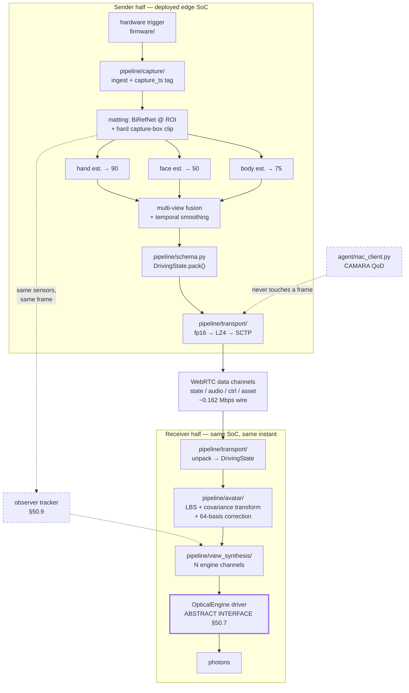
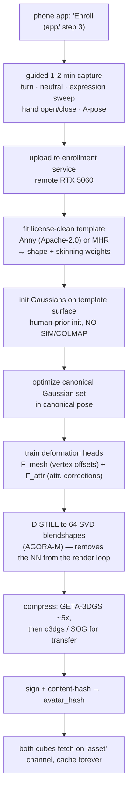
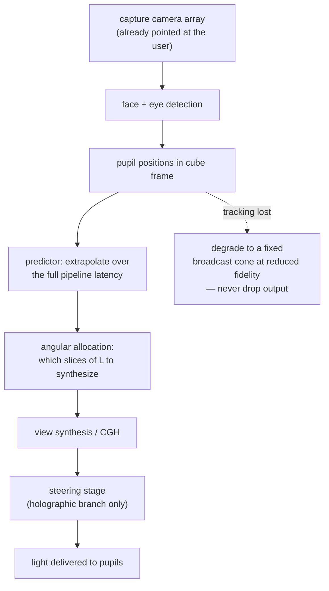

## Software Architecture and the App

**Scope.** Everything between the photons entering the capture sensors and the frames leaving for the optical engine, plus the phone app that configures it and the simulation suite that validates it. The optical mechanism itself is out of scope here by construction — §50.7 is the argument for why that boundary must be enforced in code, not just in prose.

**Reading rule.** Confidence tags are per-claim. `[MEASURED]` in this section means measured *on this machine, today* unless a paper is named; `[PUBLISHED]` names the arXiv ID or part; `[DERIVED]` shows the formula; `[ESTIMATE]` is engineering judgement; `[UNVERIFIED]` states what would settle it.

---

### 50.1 The honest inventory: what code exists

Before any architecture diagram, the current state, because the gap between the specification and the implementation is the single largest fact about TAYF's software.

| Path | Lines | Runs? | Role |
|---|---|---|---|
| `pipeline/schema.py` | **58** | yes | The wire contract. **The entire runtime pipeline implementation.** |
| `pipeline/requirements.txt` | 25 | — | Dependency declaration; never installed on this machine |
| `pipeline/{capture,avatar,view_synthesis,transport}/README.md` | 4 files | — | Specification only — **zero lines of implementation** |
| `agent/nac_client.py` | 79 | no (needs `NAC_TOKEN`) | CAMARA QoD / Congestion Insights call patterns |
| `simulation/s1_waveoptics/propagate.py` | 257 | **yes** | Angular-spectrum propagator + gate-G1 validation suite |
| `simulation/s1_waveoptics/s1_5_tracked_vs_broadcast.py` | 263 | **yes** | The tracked-vs-broadcast kill-shot experiment |
| `simulation/s3_thermal/thermal_sweep.py` | 279 | **yes** | Lumped thermal model, edge-length sweep |
| `models/build_models.py` + `render_png.py` | 646 + 227 | **yes** | True-scale geometry for the six device forms; dependency-free renderer + `viewer.html` |
| `eng/**` (9 files) | ~1,361 | yes | Acoustic-trap (MATD) track — superseded as the engine choice, retained as analysis |
| `research/arxiv/*.py` (4 files) | — | yes | Corpus builders. **`research/METHODOLOGY.md` §1: these are keyword-cluster based; a negative result from them is evidence about the corpus, not the world.** |

[MEASURED] — `wc -l` and `find` over the working tree, 2026-08-16. Total hand-written Python outside `research/arxiv/`: **~3,170 lines, of which 58 are the deployable runtime.**

Three consequences that shape everything below:

1. **The pipeline is a specification, not a codebase.** `pipeline/capture/`, `avatar/`, `view_synthesis/` and `transport/` each contain a README and nothing else. Every fps, latency and bandwidth figure attributed to the pipeline is [PUBLISHED] from Mon3tr (arXiv 2601.07518) or [ESTIMATE], never [MEASURED] here.
2. **`aiortc`, `lz4` and `gsplat` are not installed** — `importlib.metadata` reports them absent; only `numpy 1.26.4` and `torch 2.9.1` are present [MEASURED]. `requirements.txt` has never been exercised, so it is a wish list whose resolvability is [UNVERIFIED].
3. **The code that does run is the code that falsifies things.** `simulation/` is the only part of the repo that has ever changed a claim in `docs/01`. That ratio is correct for this phase (`docs/07` §1) and should be preserved until hardware arrives.

---

### 50.2 Module map



**Ownership table — what each module may and may not do.** These are enforceable review rules, not descriptions.

| Module | Owns | Must never |
|---|---|---|
| `firmware/` | Trigger strobe, sensor bring-up, one monotonic `capture_ts` per frame *set* | Emit per-sensor arrival timestamps as `capture_ts` (`docs/03` §1.4: free-running sensors are ~4 ms mean / 8.3 ms worst-case apart ⇒ ~8 mm of hand travel at 1 m/s) [PUBLISHED, docs/03 §1.4 arithmetic] |
| `pipeline/capture/` | Matting, three estimators, fusion, emit `DrivingState` | Know anything about the network, the display, or the far end |
| `pipeline/transport/` | pack/compress/send/receive/decompress/unpack; expose one *"conditions degrading"* signal | Decide when to request a QoD session — that is `agent/`'s job (`docs/03` §8.6, strict separation) |
| `agent/` | CAMARA QoD / Congestion Insights / slicing decisions | Touch a media frame. `agent/compliance.md` further binds its LLM brain to Gemini 2.5 or Groq-hosted models, no MCP — **so no LLM may sit in the transport loop** |
| `pipeline/avatar/` | Enrollment (offline) + per-frame animation of the cached canonical avatar | Run a neural network in the per-frame path (`docs/03` §4.3, HUGS: bake offline, animate with arithmetic online) |
| `pipeline/view_synthesis/` | Map the animated 3D avatar onto exactly the N channels the engine can emit | Assume a specific optical mechanism |
| optical driver | Engine-specific bytes | Leak engine specifics upward past the interface in §50.7 |

**The symmetry requirement (H2, `docs/01` §1.1) is a software statement, not just a hardware one:** every module above runs on both cubes, in both directions, on the same SoC, concurrently. Any design that works only as "sender" or only as "receiver" is wrong by construction.

---

### 50.3 `pipeline/schema.py::DrivingState` — the one shared contract

Normative. Both endpoints **import** this module; neither redefines the packet shape. The file says so in its own docstring, and `docs/01` §7.1 and `docs/03` §8.1 both point at it as the single source of truth.

```
BODY_POSE_DIM        = 75    # SMPL-family joint rotations (rig-space, see below)
FACE_EXPRESSION_DIM  = 50    # blendshape / expression coefficients
HAND_POSE_DIM        = 90    # 45 per hand, MANO-style, both hands
TOTAL_DIM            = 215
_PACK_FMT            = "<215f d"      # little-endian, 215 × float32 + float64 timestamp
PACKED_SIZE_BYTES    = 868            # 215×4 + 8
```

[MEASURED] Executed 2026-08-16: `TOTAL_DIM == 215`, `struct.calcsize("<215f d") == 868`, `len(DrivingState().pack()) == 868`. The dataclass validates all three dimensions in `__post_init__` and raises `ValueError` on mismatch — a cheap, correct guard that should be preserved when the estimators are wired in.

**Bitrate arithmetic, recomputed from the file rather than quoted** [DERIVED]:

| Encoding | Bytes/frame | @60 fps | Note |
|---|---|---|---|
| fp32 payload only (215×4) | 860 | 0.4128 Mbps | |
| fp32 as `schema.py` actually packs it (+fp64 ts) | **868** | **0.41664 Mbps** | verified by execution |
| fp16 cast (215×2) | 430 | 0.2064 Mbps | |
| fp16 + LZ4 (~0.6× ratio, `docs/03` §8.2) | ~258 | ~0.124 Mbps | **payload only — do not quote this as the wire rate** |
| + SCTP/DTLS/UDP/IP headers (~80 B/datagram) | ~338 | **~0.162 Mbps** | the number to use |

The last row is why Mon3tr reports "<0.2 Mbps" rather than 0.124 [PUBLISHED, arXiv 2601.07518 via `docs/03` §8.2]. Headers are ~24% of the wire cost at 60 packets/s because the payload is tiny — the classic small-packet regime.

**What the schema deliberately does not carry, and why that is a latent bug:**

`DrivingState` is 215 anonymous floats. It encodes no rig identity, no joint ordering, no rotation convention. Nothing in the struct prevents Cube A packing Anny-ordered axis-angle rotations and Cube B unpacking them as MHR-ordered 6D — every packet parses, and the far end renders a person whose elbows bend backwards. The defence is the `ctrl`-channel `HELLO` negotiation in `docs/03` §12.1 (`schema_version`, `rig_id`, `dims`, `rotation_convention`, `fps`, `avatar_hash`, `region_mask`, `caps`), and a mismatch must be **fatal to the session, never reinterpreted**. [DERIVED from the schema's own field set; the negotiation itself is specified but unimplemented — [UNVERIFIED] until `ctrl` exists.]

**Two implementation traps recorded before code is written:**

1. **fp16 and global translation.** fp16's quantization step at 10 m is ~10 mm — visible drift. If the 75-dim body vector carries a root translation in metres, a naive `array.astype(np.float16)` introduces it. Either keep translation fp32 in a separate field or normalize to the capture-box frame where the range is ~[−1, 1]. [PUBLISHED reasoning, `docs/03` §8.3]
2. **Rotation representation and delta coding.** Delta-encoding axis-angle across the ±π wrap, or quaternions across the q/−q double cover, produces spurious huge residuals. Recommendation: **6D continuous rotation internally, axis-angle on the wire** (3 floats/joint, which is what fits the 75-dim budget). [PUBLISHED, `docs/03` §3.2, §8.4]

**The 75 dimensions are not yet pinned.** SMPL-family decomposition is either 24 joints × 3 axis-angle + 3 global, or 25 × 3; Mon3tr's text does not disambiguate. **This must be resolved against the chosen rig before `pipeline/capture` writes a single float into `body_pose`.** [UNVERIFIED — resolved by reading the Anny or MHR joint table and writing it into `schema.py` as a named constant.]

---

### 50.4 Dependencies and licenses

`pipeline/requirements.txt` verbatim, with license status. Its own header asserts *"Every entry here is Apache-2.0 or MIT"* — **that assertion is false as written**, and `research/LICENSING.md` already contradicts it.

| Entry | Actual license | Status | Note |
|---|---|---|---|
| `gsplat` | Apache-2.0 | [PUBLISHED, `research/LICENSING.md`] | Gaussian rasterizer. Not installed here |
| `birefnet` | MIT | [PUBLISHED, `research/LICENSING.md`, `docs/03` §13.1] | Matting. 17 fps @1024² FP16 / **3.45 GB VRAM** on RTX 4090 — the memory figure is the problem, see §50.8 |
| `aiortc` | **BSD** | [PUBLISHED, `research/LICENSING.md`] | **Contradicts the file header's "Apache-2.0 or MIT" claim** |
| `lz4` | **BSD** | [PUBLISHED, `docs/03` §13.1] | Same contradiction |
| `numpy` | **BSD-3-Clause** | [MEASURED — `importlib.metadata`, v1.26.4 installed] | Same contradiction |
| `torch` | **BSD-3-Clause** | [MEASURED — `importlib.metadata`, v2.9.1 installed] | Same contradiction |
| `anny` (commented out) | Apache-2.0, weights Apache-2.0, no gated download | [PUBLISHED, `docs/03` §13.1] | **Vendored — not on PyPI.** Recommended rig |
| `lam` (commented out) | Apache-2.0 | [PUBLISHED, `research/LICENSING.md`] | Vendored. Enrollment: 1.4 s build on A100, 562.9 fps A100 / 110+ fps Xiaomi 14 |

**Fix required:** amend the header to *"permissive (Apache-2.0 / MIT / BSD-3-Clause)"*, and add a row to `research/LICENSING.md` for `lz4`, `numpy`, `torch` and `Opus` per that file's own Policy 1. The substantive posture is unchanged — everything listed is commercially usable — but a header that overstates the license set is exactly the failure mode `research/LICENSING.md` exists to prevent, and it is trivially fixable. [DERIVED]

**The real license risk is not in this file.** The three estimators the capture module is specified against — GVHMR-class (body), SMIRK-class (face), HaMeR-class (hands) — are **all [UNVERIFIED]** and each is near-certain to carry a Max Planck dependency (SMPL-X / FLAME / MANO respectively), which is non-commercial and whose license *also bans training networks for commercial use* [PUBLISHED, `docs/03` §13.2, §13.3]. `docs/03` calls this "the largest outstanding license risk in the pipeline."

**Architectural answer, which is right regardless of how verification resolves:** the estimator sits behind a **rig-space adapter**. `pipeline/capture/` imports an interface that returns rig-space parameters; which network produces them is a configuration choice. Then a bad license outcome costs a model swap, not a pipeline rewrite. [DERIVED from `docs/03` §3.2, §13.3 recommendation (b)]

Also excluded and worth naming so it is never accidentally pulled in: **the INRIA 3DGS rasterizer is non-commercial, and most human-avatar repos depend on it even when their own badge says MIT** [PUBLISHED, `docs/03` §13.2]. Use `gsplat` or Brush. Any `pip install` that drags in `diff-gaussian-rasterization` is a license incident.

---

### 50.5 The enrollment pipeline (offline machine only)



| Property | Value | Confidence |
|---|---|---|
| User time | ≤2 min capture | target, `docs/03` §4.2 |
| Reference build time | ~33 s (Mon3tr, 32× 12 MP rig, non-embedded) | [PUBLISHED, arXiv 2601.07518] |
| **Realistic build time on TAYF's actual RTX 5060** | **1–2 h** — the 5060 is slower than the 3090Ti/4090 the reference avatar papers used | [ESTIMATE, `docs/03` §11.3] |
| Where it runs | **Remote RTX 5060, never the cube** | hard architectural boundary, `docs/03` §11.1 |
| Output size | ~10–30 MB after aggressive static compression (c3dgs 26–31×, HAC-lowrate 48×) | [PUBLISHED, `docs/03` §9.2] |
| Transfer | once per user per device pair, `asset` channel, reliable/ordered | `docs/03` §8.5 |

**The rule that makes this tractable:** *spend arbitrarily on the offline path, spend nothing on the online path* [PUBLISHED framing, `docs/03` §0.2]. A 2-hour enrollment is free; a 3 ms regression in the per-frame loop is not.

**Two design commitments that follow, and they are the load-bearing ones:**

- **Step H is not optional.** Distilling the deformation heads to a fixed linear basis (AGORA-M: N=10,000 sampled posed-minus-neutral residuals → SVD → top K=64 singular vectors → a two-layer MLP regressing the 64 coefficients) makes per-frame animation *one neutral Gaussian set plus a linear combination of 64 bases*. Measured: FID 3.36 vs 3.17 for the full model, **560 fps on an RTX A6000 and 60 fps on a phone via WebGL** [PUBLISHED, arXiv 2512.06438 via `docs/03` §5.4]. This is the mechanism by which receive-side animation cost becomes independent of avatar complexity. Caveat stated: AGORA-M itself is head/face-only and FLAME-driven — **the distillation technique generalizes; the model does not.**
- **Asynchronous, never blocking.** If the build outruns the user's patience, the first call uses a provisional low-fidelity avatar and the real asset lands in the background (`docs/03` §12.5 rung 8).

**Unresolved:** the capture path. Cube-based (the cube's own 3–4 cameras record a guided sequence) is **recommended for v1** because it keeps the product self-contained; phone-orbit capture is higher quality but Meta's LCA (arXiv 2604.02320) publishes no inference numbers and no release, so it is a direction, not a dependency [PUBLISHED, `docs/03` §4.2]. Enrollment UX is explicitly undesigned (`pipeline/avatar/README.md` open item 3).

---

### 50.6 The runtime animation loop (deployed edge SoC)

This is the receive half, and it is the only part of the stack with a hard 60 Hz obligation on embedded silicon.

**Per-frame steps, in order, with the invariant each protects:**

1. **Depacketize + validate.** CRC32 check; discard any packet whose `seq` is older than the most recently rendered frame — *late is worse than absent* on an unordered channel. A DELTA whose `ref_seq` was never received is undecodable: discard, request a keyframe on `ctrl`. [PUBLISHED, `docs/03` §12.2]
2. **Unpack → `DrivingState`** via `schema.py`. ~868 B (or 430 B fp16). <1 ms. [DERIVED — LZ4 decompress on a few hundred bytes]
3. **Interpolate to render time.** The render loop runs at the *engine's* native rate, not the packet rate. If state arrives at 60 Hz and the panel runs at 90 Hz, interpolate; if state stalls, keep rendering the last good pose with damped extrapolation toward neutral. **Rendering only on packet arrival converts every network hiccup into a visible freeze** — this decoupling is required, not an optimization. [PUBLISHED, `docs/03` §12.3]
4. **LBS with the covariance transform.** Blend per-joint transforms by skinning weights, then:

   **μ_t = A μ_c + b**  and  **Σ_t = A Σ_c Aᵀ**

   The second equation is the step people skip. Translating a Gaussian without rotating its covariance makes an anisotropic splat lying along a forearm keep pointing in its canonical direction as the forearm rotates — the splat *slides* across the surface it represents. [PUBLISHED, `docs/03` §5.1]
5. **Recover (q, s) from Σ_t on the fast path.** The renderer wants a quaternion and a scale, not a raw 3×3. With M = A R_c S_c, the general recovery is polar decomposition M = R_t U. **But when A is rigid — the common LBS case — this collapses to q_t = q_A ⊗ q_c, s_t = s_c: one quaternion multiply, no scale change.** Gate on ‖AᵀA − I‖_F and fall back to polar decomposition only where blended-rotation shear is non-negligible (near joint centres — the classic candy-wrapper region). Across ~10⁵ Gaussians on an embedded GPU this is a meaningful saving. [PUBLISHED, `docs/03` §5.2]
6. **Apply the 64-coefficient non-rigid correction** from §50.5 step H. One small matrix multiply. **No neural network evaluation in this loop, ever** — the HUGS finding is that after optimization the triplane and MLPs never need re-evaluation at animation time [PUBLISHED, arXiv 2311.17910 via `docs/03` §4.3].
7. **Hand to `pipeline/view_synthesis/`** (§50.7).

**Budget, and how to read it:** `docs/03` §10.2 allocates ≤5 ms to animation and ≤10 ms to view synthesis, giving a ~23–49 ms receiver subtotal and ~49–89 ms end-to-end, against G.114's 150 ms. **Every compute figure in that table is a desktop-GPU or Quest-3 number.** If the Jetson is 3× slower on the estimator stage — entirely plausible for a 15 W part vs. an RTX 5090 — that stage alone goes 13.78 → ~41 ms and end-to-end lands near 120 ms: still inside G.114, with the optical engine unbudgeted and no headroom for a bad network night. [PUBLISHED reasoning, `docs/03` §10.2]

**Structural advantage worth stating because it is genuinely free:** the canonical Gaussian set is *fixed* — same count, same ordering, same appearance — for the whole call. There is no per-frame reconstruction, so there is nothing to boil. TAYF's temporal artifacts are 215-dimensional pose-estimation jitter (a 1.27 ms smoothing problem in Mon3tr), not a 10⁵-Gaussian correspondence problem. HiFi4G needs 81 cameras, a dual-graph tracking structure and **under 7 minutes per frame on an RTX 3090** to buy the same property [PUBLISHED, arXiv 2312.03461 via `docs/03` §5.5].

---

### 50.7 The renderer, and why the optical engine must be an abstract interface

#### 50.7.1 The evidence for abstraction is this repository's own history

The optical mechanism has been **selected three times in three document revisions**, and each selection was a considered, evidence-backed decision that then lost to better evidence:

| Doc | Date | Engine selected | Why it lost / won |
|---|---|---|---|
| `docs/02`, `docs/01` §4.7 | 2026-08-15 | laser-plasma voxels (north star) | **Excluded on power** — 3.6–36 W for a *sparse wireframe* head against a ~16 W total budget; photoreal is 25–250× outside the envelope, and no efficiency improvement closes 250× |
| `docs/08` §1–2 | 2026-08-15 | MATD acoustic trapping | Selected as verified free-space wireframe engine; 10×10×10 cm³ workspace |
| **`docs/09`** | **2026-08-16** | **AIRR / retroreflective, ZERO moving parts** | **Current.** Static sheet optics; the only dynamic element is pixels on a commodity flat panel |

[PUBLISHED — all three from the repo's own authoritative docs, dates as recorded in their headers.]

**Across all three reselections, `pipeline/` changed by zero lines.** That is not luck; it is `research/notes.md` §10's instruction — *do not lock the invention to one optical mechanism* — realized as an interface boundary (`hardware/optical-engine.md` line 49). A stack that had hard-coded a galvo scan-pattern emitter in 2026-08-15 would have been rewritten twice by 2026-08-16.

#### 50.7.2 The interface

Input is the light field restricted to what the engine can physically address; output is whatever that engine eats.

**L(x, y, z, θ, φ, t) → engine-native bytes**

Proposed concrete form [ESTIMATE — this is a design proposal, not existing code]:

```
class OpticalEngine(Protocol):
    # --- static description, read once at boot ---
    def channels(self) -> ChannelSpec:
        """N physical angular channels, their (θ,φ) directions,
           spatial resolution per channel, and native refresh rate."""
    def image_geometry(self) -> ImageGeometry:
        """Where the image is allowed to be: aperture width D, mode
           ('viewer_space' | 'beyond_device'), and the resulting bound
           on image width (docs/01 §4.3b). The renderer must not be
           allowed to request an image the aperture cannot place."""
    def native_rate_hz(self) -> float

    # --- per-frame ---
    def submit(self, frame: EngineFrame) -> None:
        """EngineFrame is a tagged union: PanelFrames | ScanCommands
           | PhaseMaps. The renderer constructs the variant the
           ChannelSpec declares; it never branches on engine brand."""

    # --- optional ---
    def boot_calibration(self) -> LUT | None
```

**`image_geometry()` is the non-obvious member and it is the important one.** The aperture law (`docs/01` §4.3b) is a *property of the engine*, and the renderer must be able to query it rather than assume it:

- **Viewer-space mode** (image nearer than the device — the AIRR family, `docs/09` §1): **W_image ≤ D_aperture.** The renderer must reject a requested image larger than the aperture, at configuration time, with a clear error.
- **Beyond-device mode** (image further than the device — "portal"): **W = D·(b/a)**, which may exceed D. `docs/01` §4.3b, §4.3c.

Both modes are legitimate; the interface exists so the renderer names which one it is driving instead of silently assuming.

#### 50.7.3 What each backend costs in software

| Backend | `submit()` payload | Renderer work | Software complexity |
|---|---|---|---|
| **AIRR / Pepper's plate** (`docs/09`, current) | **one framebuffer** to a commodity LCD/OLED | one perspective render of the animated avatar | **Lowest possible.** Unit magnification ⇒ image size = source size; no view multiplexing, no quilt, no LUT |
| Light-field panel (hackathon track) | quilt → device-native via a boot-time LUT | N-view render, view-amortized | Moderate. altiro3D (arXiv 2506.08064) is the fork base |
| Holographic / SLM | phase maps | CGH synthesis at 0.089 Gpx/s tracked | Highest. Real-time CGH is its own research problem |

**The zero-moving-parts finding is also a software finding.** `docs/09` §2 lists it as a hardware advantage — silent, no wear, no drift, no consumables. It is equally a stack simplification: the AIRR backend's `submit()` is *a framebuffer write*, the same call a phone makes. There is no scan-pattern scheduler, no galvo servo loop, no phase-quantization LUT, no per-frame calibration compensation. [DERIVED from `docs/09` §2–§3.]

Two honest caveats carried forward from `docs/09` §3, because the renderer's brightness and view-count assumptions rest on them:

- **~75% of source light is lost** before the image forms (the beamsplitter costs ~50% per pass, twice). The panel must be bright — a power-budget item that lands in `hardware/`, not a software blocker. **This figure is reasoned from the mechanism, not measured** [UNVERIFIED — `docs/09` §7 action 4: measure real optical efficiency and size the panel from the measurement].
- **The AIRR primary literature (Optics Express / OSA Continuum / Optical Review) remains unread** [UNVERIFIED, `docs/09` §3]. Every quantitative AIRR figure the renderer might depend on — brightness, resolution, viewing cone — is reasoned, not verified. This is `docs/09`'s own largest open item and it propagates into the software's view-count assumptions.

#### 50.7.4 The view-synthesis rule that survives any backend

Whatever N the engine declares, **render the N views amortized, never as N independent rasterizer passes.** Three independent published results converge on 8–22× from exploiting inter-view redundancy: CoherentRaster 87.7 fps @2K with view-batch 8, PSNR 51.94 dB vs per-view 3DGS (~15× over a 5.8 fps baseline) [PUBLISHED, arXiv 2605.04509]; LFDPR up to 8× faster, per-view buffer 2.63 → 1.32 MB, validated on a *physical* tilted-lens light-field prototype [PUBLISHED, arXiv 2601.19901]; G2LF/V2LF 228 fps for 45-view 512×910 quilts, >60 fps at 90+ views, up to 22× [PUBLISHED, arXiv 2508.18540]. All three are desktop-GPU, static-scene results — **none is a live human avatar and none is a Jetson** [UNVERIFIED on TAYF's target; `docs/03` §6.2 caveat].

And one free win: altiro3D's measured bottleneck is its MiDaS monocular-depth CNN at >50% of inclusive runtime [PUBLISHED, arXiv 2506.08064]. **TAYF has no monocular-depth stage** — it holds an explicit 3D Gaussian avatar, so the depth is known exactly. Forking altiro3D means forking a 10 Hz pipeline whose dominant stage TAYF simply deletes.

---

### 50.8 What runs where

| | **Deployed edge SoC** | **Offline enrollment machine** | **Phone** |
|---|---|---|---|
| Part | Jetson Orin Nano-class | Remote RTX 5060 | iPhone (see §50.10) |
| Power | **7–15 W** (Orin Nano) / 10–25 W (Orin NX) datasheet envelope | wall | battery, irrelevant |
| Runs | matting, 3 estimators, fusion, pack, WebRTC, decode, animation, view synthesis, optical driver — **both directions at once** | avatar enrollment **only** | pairing, boundary, enrollment kickoff, call start/stop |
| Frequency | 60 Hz for the whole call | once per user, ever | setup only |
| Binds on | **sustained thermal, then memory, then TOPS** | wall-clock patience | nothing |
| Status | **UNVALIDATED — nothing benchmarked** | available | not built |

[PUBLISHED, `docs/03` §11.1; SoC power envelopes from `docs/01` §5.]

**The hard boundary:** *"Remote RTX 5060 is used only for offline avatar enrollment, never in the runtime loop."* Anything needing the 5060 at runtime is a design error, not an optimization opportunity. [PUBLISHED, `docs/03` §11.1 quoting `docs/architecture.md`]

**Memory is the constraint that is underestimated.** An Orin Nano-class module has a *unified* pool shared by CPU and GPU. BiRefNet alone reports **3.45 GB VRAM at 1024² FP16** [PUBLISHED, `docs/03` §2.2] — most of an 8 GB part before three estimators, the canonical avatar and the render buffers load. Mitigations in priority order, all from `docs/03` §11.2: INT8-quantize every model for the NPU (largest single lever); run matting at 512² or ROI scale and at 15 Hz rather than 60 (human silhouettes do not move 30 px in 16.7 ms); bake all deformation networks to linear bases (§50.5 H); compress the canonical avatar with c3dgs, whose 31× also buys **up to 4× render fps** — compression that pays twice; share one decoded frame buffer across matting and all three estimators.

**The matting quality bar is lower than it looks, and this is the key realization:** TAYF never renders captured pixels — it renders the pre-built avatar. The mask needs to be good enough to *crop*, not good enough to *composite*. [PUBLISHED, `docs/03` §2.2]

**One Python-specific hazard:** `aiortc` is Python, and SCTP/DTLS runs in-process. **Watch for GIL contention if `aiortc` shares a process with anything hot.** Run transport in its own process with a shared-memory ring for `DrivingState`, not in a thread beside the estimators. [PUBLISHED caution, `docs/03` §11.2; the process-split remedy is [ESTIMATE]]

**Thermal reaches into software.** SlimVC's mechanism is the right shape for a thermally-throttled cube: **five runtime width factors [0.25, 0.375, 0.5, 0.75, 1] from a single loaded model**, 73–436 GFLOPs across widths, up to 20× speedup at low rates [PUBLISHED, arXiv 2205.06754 via `docs/03` §8.5]. The important property is not that the codec adapts to the *network* — it is that **one loaded model adapts to the available compute**, which is exactly what happens when the Jetson hits its ceiling mid-call.

---

### 50.9 The observer / head-tracking loop and its prediction requirement



**The architectural free lunch:** the cube's cameras are already pointed at the local user *because it is capturing them for transmission*. Capture and display share one sensor set, and the head pose the view synthesis needs falls out of the body estimator that is already running [PUBLISHED, `docs/01` §3, §4.4; `docs/03` §1.6].

**The prediction requirement, computed:** [DERIVED]

```
head sway velocity  v = 0.2 m/s            (natural seated motion, docs/01 §9)
pipeline latency    τ = 100 ms
positional error    e = v·τ = 0.2 × 0.100 = 0.020 m = 20 mm
pupil diameter      d = 6 mm
                e/d = 20/6 = 3.33 pupil diameters
```

**Untracked prediction error, not tracking accuracy, is the likely failure mode.** Required accuracy is pupil localization better than one pupil diameter at 1 m ≈ 6 mrad; tracking volume is a seated observer, ±0.3 m lateral, 0.6–1.5 m from the cube. [PUBLISHED, `docs/01` §9]

**Which architecture this binds — say it explicitly, per `research/METHODOLOGY.md` §3.** The 20 mm figure is a hard requirement **for the tracked holographic architecture**, where the engine steers a ~6 mm exit pupil at the viewer's eye and a 20 mm miss means the viewer sees nothing. Under the current AIRR selection (`docs/09`) the optics emit a **static ±20–30° viewing cone with no steering stage at all** — the `H` node above does not exist. There, tracking degrades from a hard optical dependency to a rendering-quality feature (view-dependent shading, motion parallax within the cone), and a 20 mm prediction error costs a small perspective error rather than a blank image. **This is a genuine relaxation created by the zero-moving-parts choice, and it should be stated as such rather than carrying the holographic branch's requirement into a design that does not have it.** [DERIVED from `docs/09` §3 (static optics, ±20–30° cone) + `docs/01` §4.6 (steering exists only in the modulator branch); [UNVERIFIED] pending the AIRR literature that would confirm the cone figure — `docs/09` §3 marks it as reasoned, not measured.]

**Implementation spec (both branches):**

| Item | Spec | Confidence |
|---|---|---|
| Predictor candidates | constant-velocity → Kalman → learned, in that order of preference | [ESTIMATE], S6.3 |
| Loop budget | 5–10 ms, inside the 76–177 ms motion-to-photon chain | [PUBLISHED, `docs/01` §6] |
| Loss behaviour | widen to a fixed broadcast cone at reduced fidelity; **never drop output** | [PUBLISHED, `docs/01` §9] |
| Validation data | arXiv 2506.02380 (EyeNavGS) — head-pose and gaze traces from 46 participants; use real motion statistics, not synthetic sway | [PUBLISHED, `docs/07` §8] |
| Decisive experiment | **S6.2** — replay real head-motion traces through the full pipeline latency and check error stays under one pupil diameter | [PUBLISHED, `docs/07` §8: *"the highest-value simulation in the entire plan after S1.5"*] |

**Freedom-to-operate warning that belongs in the software section because it is the software that infringes:** using an observer/eye estimate to select which angular views a display physically emits is claimed by **Google US11474597B2** (granted, in force to 2040). Also relevant: **US10327014B2** (symmetric capture-and-3D-display terminals, to 2037), **Duelight US11683448B2** (parametric-state-instead-of-video transport, to 2038), **Looking Glass US11425363B2** (neural gap-filling between sparse views). §4.4's tracked architecture is the correct engineering choice and is not ours to own; commercialization requires a real FTO opinion. [PUBLISHED, `docs/01` §4.4 citing `docs/05`]

---

### 50.10 The phone app

#### 50.10.1 Two jobs, and the discipline of refusing a third

`app/README.md` is explicit: **(1) pair with a cube, (2) set the capture boundary.** Enrollment kickoff and call control are thin additions, not a dashboard. *"Apple-minimalist means doing less, not adding a dashboard."*

| Screen | Job | Notes |
|---|---|---|
| **Pair** | discover and connect to a cube | Mechanism **TBD** — depends on the unchosen radio (`hardware/bom.md`, `firmware/README.md`). Local-network discovery or a short-range pairing step. [UNVERIFIED] |
| **Boundary** | draw/adjust the capture volume | Live preview from the cube, or an on-device AR box. This box is enforced in `pipeline/capture/` as a hard geometric clip **before** the matting network runs — the cheapest and most reliable filter in the stack [PUBLISHED, `docs/03` §2.3] |
| **Enroll** (first use) | kick off the 1–2 min guided capture | Fire-and-forget; the build is asynchronous (§50.5) |
| **Call** | start/end | **The call is cube-to-cube. The phone is not in the media path and is not required hardware during a call** [PUBLISHED, `app/README.md`, `research/notes.md` §37–38] |

A screen that is not pairing, boundary-setting, enrollment or call control does not belong in the build (`design/README.md` rule 3).

#### 50.10.2 Platform recommendation: SwiftUI, iOS-first

Stated as a recommendation the user can override, with its reasoning exposed [PUBLISHED, `app/README.md`; the reasoning is [ESTIMATE]]:

1. **The design brief is Apple-minimalist glassmorphism** (`design/README.md`). SwiftUI's `.ultraThinMaterial` is real glassmorphism via the system compositor; a cross-platform framework means hand-rolling Apple's visual language as a blur+opacity hack. `design/tokens.md` already specifies the concrete values the implementation consumes: `.ultraThinMaterial` surfaces, 16 pt control radius / 24 pt sheet radius, SF Pro with Dynamic Type, system semantic colors, one accent reserved for state, standard implicit animations only.
2. **Solo builder, hackathon timeline** (`docs/roadmap.md`: Idea Phase closes **23 Aug 2026**, Prototype/live demo **13 Sep 2026**). One platform, one codebase, no cross-platform abstraction tax.
3. **A hackathon demo needs to run on the builder's own phone**, not ship broadly. Android is a real product concern for later, not a September concern.

**Counter-consideration, recorded so the decision is made knowingly:** if the pairing mechanism lands on BLE + a custom GATT profile, the iOS background-execution and permission model is materially more restrictive than Android's, and that cost lands *after* the platform is chosen. Settle the radio before writing pairing code. [ESTIMATE]

#### 50.10.3 Body-region selection, and the fixed-schema question

The app exposes a fidelity/cost tradeoff at session setup [PUBLISHED, `app/README.md`]:

| Mode | Meaning |
|---|---|
| **Full body** | default, no region prioritization |
| **High-fidelity** | face, eyes, mouth, hands, fingers prioritized; clothing and hidden geometry get reduced fidelity |
| **Custom region** (head / hands / upper body / torso) | narrows the capture boundary itself — the same box-drawing flow — trading full-body presence for guaranteed quality on a smaller region |

Transmitted **once at call setup, never renegotiated per frame**, as the `region_mask` field of the `ctrl`-channel `HELLO` (`docs/03` §12.1).

**The open question, stated honestly.** `pipeline/schema.py` is a fixed-width struct: `"<215f d"`, 868 bytes, always. `app/README.md` open item 3 flags the interaction as unresolved: *"a true fidelity tradeoff might mean varying which sub-estimators run rather than changing the wire format itself. Needs resolving before this feature is implemented, not just specified."*

**Recommended resolution — `region_mask` changes which sub-estimators run on the sender, not the packet width** [PUBLISHED as the recommendation in `docs/03` §12.1; the supporting arithmetic below is [DERIVED]]:

| Consequence | Detail |
|---|---|
| Wire format | unchanged. `schema.py` needs no variant, no version bump, no conditional parser |
| Unselected regions | transmit as zeros (or a held neutral pose) |
| Compression | LZ4 collapses constant-zero runs to almost nothing. A **head-and-face-only** session leaves 50 of 215 floats varying and zeroes 165 (**76.7%**) — 330 of 430 fp16 bytes become a zero run. A **body-and-face, no-hands** session zeroes 90 (41.9%) |
| Compute | the real saving: the hand branch is the *rate-limiting* estimator (71.2 fps reference vs. body 73.6 and face 377). Not running it is a latency and thermal win, not a bandwidth one |
| Rejected alternative | variable-width packets keyed on the mask — buys a few bytes at the cost of making **every parser conditional on session state**, on an unreliable channel where a lost `HELLO` would make the stream unparseable |

**Why the compute framing is the right one:** the bandwidth is already ~0.162 Mbps, **25× under a 4 Mbps residential uplink** [PUBLISHED, `docs/03` §8.4]. There is no bandwidth problem to solve. What is scarce is the ~17 ms per-frame budget and the ~16 W thermal ceiling. So *"which estimators run"* is a lever on the resource that binds, and *"how wide is the packet"* is a lever on the one that does not. **Region selection is a compute-allocation control wearing a bandwidth control's clothes**, and the UI copy should not promise bandwidth savings it will not deliver. [DERIVED]

**Residual open items on this feature:**

1. **The high-fidelity mode does not map onto the estimator set at all.** "Face, eyes, mouth, hands prioritized" is a statement about *canonical-avatar bit allocation* (a `pipeline/avatar/` enrollment-time decision, GETA-3DGS's heterogeneous bit-width policy) and about *per-channel quantization steps* in the delta coder — not about which sub-estimator runs. Full-body and custom-region are estimator gates; high-fidelity is a different mechanism sharing a UI control. **These should not ship behind one three-way picker until that is resolved**, or the setting will silently do nothing in one of its three positions. [DERIVED — this is a distinction neither `app/README.md` nor `docs/03` §12.1 currently draws.]
2. Zero-vs-neutral for unselected regions is unspecified. Zeros in an axis-angle rig mean identity rotation, which is *usually* a neutral pose — but that is a rig-dependent claim and must be checked against Anny/MHR, not assumed. [UNVERIFIED]
3. `region_mask` must be in the `HELLO` mismatch check: if A sends head-only and B expects full body, B must know, not infer. [DERIVED]

---

### 50.11 The simulation suite

`docs/07`'s premise: *nothing gets ordered until the simulation that would have predicted its failure has been run.* Current state:

| Track | Path | Status | Result |
|---|---|---|---|
| **S1.1 validation (gate G1)** | `simulation/s1_waveoptics/propagate.py` | **DONE** | **9 passed, 0 failed → SIMULATOR TRUSTED** |
| **S1.5 tracked vs. broadcast** | `simulation/s1_waveoptics/s1_5_tracked_vs_broadcast.py` | **DONE** | resource claim confirmed; quality claim untested |
| **S3.1/S3.3 thermal** | `simulation/s3_thermal/thermal_sweep.py` | **DONE** | 5-face/48 °C ceiling ≈16 W; 100 mm cornered, 150 mm comfortable |
| S1.2–S1.4, S1.6–S1.9 | — | not started | CGH quality, multiplex gain, 4-bit quantization, metasurface steering |
| S2 optical layout / tolerance | — | not started | **S2.3 (tolerance stack-up) is the one that quietly kills projects** |
| S4 light field | — | not started | fork arXiv 2506.08064, do not build from scratch |
| S5 perceptual | — | not started | **`docs/07` §1: the single highest-leverage move available**, and it needs no optics |
| S6 tracking + prediction | — | not started | **S6.2 is the real kill risk** (§50.9) |
| S7 end-to-end | — | not started | discrete-event latency/bandwidth model |

#### Gate G1 — passed, re-verified today

`python3 simulation/s1_waveoptics/propagate.py` re-run 2026-08-16 [MEASURED]:

| # | Check | Result | Error (tol) |
|---|---|---|---|
| 1a–c | Gaussian w(z) at 0.5/1.0/2.0 z_R vs. analytic w₀√(1+(z/z_R)²) | PASS ×3 | 0.000% (2%) |
| 2 | Energy conservation over lossless propagation | PASS | 0.000% (1%) |
| 3 | Round trip +z then −z recovers the input | PASS | RMS 5.50×10⁻¹⁶ (1×10⁻⁶) |
| 4 | Circular-aperture far field → Airy first null at 1.22λ/D | PASS | 13.4277 vs 13.42 mrad, 0.058% (5%) |
| 5a–c | Grating equation sinθ_max = λ/2p at p = 8 / 3.74 / 1.0 µm | PASS ×3 | ≤0.237% (2%) |

**9/9. `GATE G1: SIMULATOR TRUSTED`.** Nothing downstream in S1 is trustworthy without this, which is why it is a gate and not decoration (`docs/07` §11).

Two engineering details in that file worth preserving verbatim in any rewrite, because both encode a bug that was already made once:
- `max_propagation_distance()` — the angular-spectrum kernel undersamples beyond `L·√((2dx/λ)² − 1)/2` and **silently produces wrong answers** past it. This is exactly the failure a validation suite exists to catch.
- The far-field test uses `fraunhofer()`, not `angular_spectrum()`. The file's own comment: *"an earlier version of this suite used it and reported a 16% error that was pure numerics."* [MEASURED — recorded in-source, per `research/METHODOLOGY.md` §4's report-your-own-errors rule]

#### S1.5 — reproduced today

`python3 s1_5_tracked_vs_broadcast.py` [MEASURED, 2026-08-16]:

| Quantity | Predicted | Measured |
|---|---|---|
| Sub-aperture **area** ratio (broadcast ÷ tracked) | 58× | **59.3×** |
| Linear resolution ratio | — | **7.7×** |
| Hologram-synthesis **compute** ratio | 58× | **58×** |

Internal consistency check [DERIVED]: **√59.3 = 7.70**, exactly the reported linear ratio — area and linear measures agree, which is what you want from two independently computed numbers in the same script.

**Not confirmed, and the script says so itself:** PSNR did **not** separate the cases (spread <2 dB, not even monotonic in sub-aperture size). This is a **metric failure, not evidence against the claim** — Gerchberg–Saxton reconstructions are speckle-dominated and PSNR mostly measures the speckle; larger sub-apertures resolve more real detail *and* more speckle, and the two cancel in a pixel-wise error metric. This mirrors arXiv 2501.08072 / 2404.09003 / 2403.06421, which independently report PSNR/SSIM correlating poorly with human judgement on exactly this content class. **A valid quality test needs a resolution-target metric (resolvable line pairs) or human MOS — that is S5, queued, not done.** [MEASURED + PUBLISHED, as printed by the script]

**The verdict to carry forward: the resource claim survives; the quality claim is untested.**

#### Software-quality standards this suite sets

`docs/07` §12: every track must produce runnable code under `simulation/<track>/`, a results file with the actual numbers, and a one-paragraph verdict on whether the `docs/01` claim it tests survived. **A simulation that does not update a claim in `docs/01` — by confirming, correcting, or killing it — was not worth running.** The three existing scripts all meet this bar; they print their own verdicts, name what they do *not* show, and are dependency-light (`numpy` only, with an optional `torch`/`TAYF_DEVICE=cuda` path for the remote 5060).

---

### 50.12 Build order

Ordered by what unblocks the most, with the blocker named. Dates from `docs/roadmap.md`.

| # | Task | Blocked on | Unblocks |
|---|---|---|---|
| 1 | **Commit to Anny or MHR**; write the joint table and rotation convention into `schema.py` as named constants | nothing — a reading task | **Everything in `pipeline/`.** `pipeline/avatar/README.md` open item 1 says this blocks writing animation code at all |
| 2 | Fix the `requirements.txt` license header; add `lz4`/`numpy`/`torch`/`Opus` rows to `research/LICENSING.md` | nothing | License hygiene (Policy 1) |
| 3 | Implement `pipeline/transport/` against `schema.py`: fp16 + LZ4 + `aiortc`, four channels with their four reliability contracts | #1 for the rig, nothing else | Measurement #3 of `docs/03` §14 (baseline wire bandwidth) — **the mandatory baseline before any delta-coding work** |
| 4 | Define the `OpticalEngine` protocol (§50.7.2) and write the **AIRR framebuffer backend** — the simplest possible one | #1 | Renderer development without a panel in hand |
| 5 | Loopback harness: two processes on one machine, `capture` stubbed with recorded pose, full transport + animation + engine path | #3, #4 | Per-stage latency instrumentation (measurement #5) without hardware |
| 6 | Nokia NaC portal registration | external (project task #2) | **The entire CAMARA half of the demo narrative.** `agent/nac_client.py` cannot run against even a sandbox endpoint without it |
| 7 | SwiftUI app: pair → boundary → enroll → call | radio choice for pairing | Boundary enforcement in `capture/`, enrollment UX |
| 8 | S6.2 (prediction under real head-motion traces) and S5 (perceptual battery) | nothing — both are pure simulation | The two riskiest unmeasured claims in the whole project |
| 9 | Jetson benchmarks #1/#2 of `docs/03` §14 — three estimators concurrent, **30 min sustained**, in the actual enclosure | hardware arriving | The per-frame budget. **Peak fps is a marketing number; sustained fps is the product** |

**A benchmark run in the last week is a discovery, not a schedule input** [PUBLISHED, `docs/03` §14.1]. Items 3, 5 and 8 need no hardware at all and should therefore start now.

---

### 50.13 Open items, ranked

1. **The rig decision (#1 above) is the keystone and it is a reading task, not a research task.** Until Anny or MHR is chosen and its joint ordering written into `schema.py`, `body_pose`'s 75 dimensions mean nothing specific, no estimator adapter can be written, and every downstream module is specified against a placeholder. This is the largest ratio of blocked-work to effort-required in the software stack. [DERIVED from `pipeline/avatar/README.md` open item 1 + `docs/03` §3.2]
2. **Three estimator licenses are UNVERIFIED** (GVHMR / SMIRK / HaMeR, each presumed to carry SMPL-X / FLAME / MANO). Mitigated architecturally by the rig-space adapter, but the verification is still owed. [PUBLISHED, `docs/03` §13.3]
3. **Nothing has been benchmarked on the target SoC.** Every fps in the stack is a desktop-GPU or Quest-3 number. BiRefNet's 3.45 GB is the most likely forcing function for a model swap. [PUBLISHED, `docs/03` §0.3, §11.2]
4. **The high-fidelity/full-body/custom three-way picker conflates two different mechanisms** (§50.10.3 item 1) and will silently no-op in one position if shipped as designed.
5. **AIRR's quantitative figures are all reasoned, not measured** — including the ~75% optical loss that sizes the source panel the renderer drives. `docs/09` §7 action 1 (obtain the primary literature) is that document's own largest open item and it propagates directly into the renderer's brightness and view-count assumptions. [UNVERIFIED]
6. **Pairing mechanism undecided**, blocking the app's first screen and, transitively, boundary enforcement in `capture/`. [UNVERIFIED, `app/README.md` open item 1]
7. **NaC portal registration outstanding** — no CAMARA call has been executed against a real or sandbox endpoint, so `agent/nac_client.py`'s call patterns are verified-by-reading only. [PUBLISHED, `agent/README.md` open item 1]
