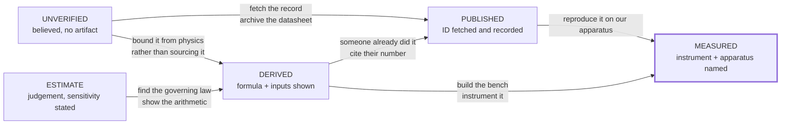
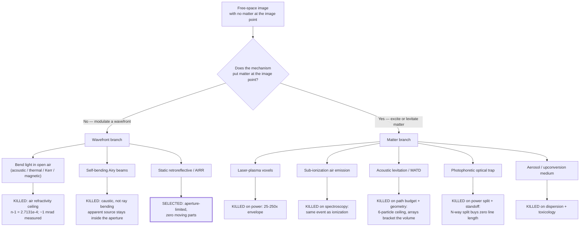
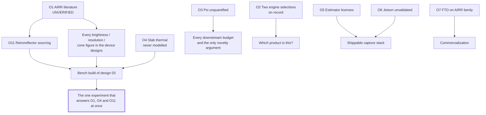

## Confidence Audit and Open Problems

This section is the document's warranty. Everything above it argues; this argues with it. It does four things: it tags every load-bearing claim in TAYF with the evidence that actually supports it, it lists the errors this project made and caught, it records the mechanisms that were killed and the arithmetic that killed them, and it ranks what is still unknown. A design document that cannot say which of its numbers were measured, which were computed, and which were guessed is not an engineering document — it is a pitch.

The corrections log (§60.3) is deliberately prominent. Every item in it was a conclusion this project held, acted on, and then reversed. Two of them reversed a *"physically impossible"* verdict into *"fits with margin"*, which is the expensive direction to be wrong in.

---

### 60.1 The tagging discipline

| Tag | Means | Standard of proof |
|---|---|---|
| **[MEASURED]** | An instrument produced this number, in this project or in a cited paper, on real hardware | A named apparatus and a reported value |
| **[PUBLISHED]** | A specific verified paper, standard, or datasheet states it | arXiv ID / DOI / patent number / part number given, and the record was fetched |
| **[DERIVED]** | Computed from first principles here or in the repo | Formula and inputs shown so it can be re-run and attacked |
| **[ESTIMATE]** | Engineering judgement | Stated as judgement, with the sensitivity that matters |
| **[UNVERIFIED]** | Believed, not confirmed | Accompanied by the specific artifact that would confirm it |

Four rules govern how these are applied, and they are not stylistic:

1. **Simulation is not measurement.** `simulation/s1_waveoptics/` and `simulation/s3_thermal/` produce numbers that this audit tags **[DERIVED]**, never [MEASURED]. A numerical experiment can only confirm that the analysis was arithmetically self-consistent; it cannot discover that a beamsplitter has a wedge error.
2. **A cited measurement stays [MEASURED] but inherits the source's apparatus.** Mon3tr's 80 ms was measured — on an RTX 5090 sender and a Quest 3 receiver. On a 7 W Jetson it is [UNVERIFIED], and this audit splits those rows.
3. **Vendor claims are [UNVERIFIED] until a datasheet or record is archived in-repo.** Product-page numbers and trade-press figures do not become [PUBLISHED] by being repeated.
4. **A constraint must name the architecture it was evaluated in** (`research/METHODOLOGY.md` §3). An untagged constraint is treated as scoped to nothing and is not load-bearing.

**Only the two rightmost states are safe to design against.** The ledger below exists to show how much of TAYF currently sits on the left.

---

### 60.2 Master claim ledger

Every row is a claim the design would change if it were false. Columns: the claim, its value, its tag, where it comes from, and the specific act that would upgrade it one level.

#### 60.2.1 Geometry — the aperture law and its escapes

| # | Claim | Value | Tag | Source | Upgrade path |
|---|---|---|---|---|---|
| G1 | Image beyond the device is bounded by the aperture's shadow | **W = D·(b/a)** | [DERIVED] | `01` §4.3b; straight-line propagation through the exit aperture | Not upgradeable — it is geometry. Falsified only by an image outside the aperture's angular silhouette |
| G2 | Image in the viewer's own space is bounded by the aperture itself | **W_image ≤ D_aperture** (b < a ⇒ W < D) | [DERIVED] | `01` §4.3b, `09` §1 | Same as G1 |
| G3 | Aperture required per life-size subject (in-viewer-space mode) | head 25 cm · head+neck 32 · bust 50 · seated 80 · standing 170 | [DERIVED] | `09` §1, from G2 + anthropometry | Anthropometric widths are [ESTIMATE]; upgrade with a percentile table (e.g. ANSUR-class) |
| G4 | Lagrange pixel requirement and the aperture bound are the same statement | **N_x = D·p/(a·λ)**; image distance *b* cancels | [DERIVED] | `01` §4.3a; checked at two evaluation planes (aperture y=50 mm/u=3.00 mrad and image y=125 mm/u=1.20 mrad both → 1,091) | Independent re-derivation by a third party, or a wave-optics propagation showing the same cutoff |
| G5 | Pixel requirement at nominal geometry | 1,091 across (D=100 mm, a=1.0 m, p=6 mm, λ=550 nm) → **3.52× surplus on a 4K panel** | [DERIVED] | `01` §4.3a | S1-class propagation sim reproducing the resolvable-point count |
| G6 | Requirement stays inside 4K across the whole useful viewer-distance range | 1,091 @ a=1.0 m → 3,636 @ a=0.3 m (1.06×) | [DERIVED] | `01` §4.3c | As G5 |
| G7 | Viewer distance *a* is a free design variable and buys image size | cube at 0.3 m + person at 3.0 m ⇒ 1000 mm visible through an 18.9° window | [DERIVED] | `01` §4.3c | Perceptual test: is a 9–19° porthole acceptable for conversation? (Track D, S5) |
| G8 | Clipping is a general theorem for surface-modulating displays, published | "Clipping restricts the utility of all three-dimensional displays that modulate light at a two-dimensional surface with an edge boundary…" | [PUBLISHED] | Smalley et al., *Nature* **553** 486 (2018) | Already terminal; only a counterexample display would move it |
| G9 | AIRR's own inventor states the image lies between eye and retroreflector | direct quotation | [PUBLISHED] | Yamamoto, *J. Imaging Soc. Japan* **56**(4) 341 (2017) | — |
| G10 | Magnification is always paid for in viewing zone | measured trade-off | [MEASURED] | Momosaki et al., *Appl. Opt.* **60** 6748 (2021) | — |
| G11 | Commercial systems obey W = D·(b/a) numerically | LFL SolidLight 28″ panel → 14″ volume ~2 ft in front; Brelyon 30″ → 122″ *behind* | [UNVERIFIED] | `01` §4.3g, manufacturer literature; no datasheet archived in-repo | Archive the two spec sheets in `research/`; then [PUBLISHED] |
| G12 | AR glasses are consistent, not a counterexample | a ≈ 2 cm ⇒ D·(b/a) = 2 m | [DERIVED] | `01` §4.3g | — |
| G13 | No display exists whose image is outside the launch aperture's silhouette with no matter at the image point | survey result | [UNVERIFIED] | `01` §4.3g — three independent searches, all negative | Cannot be upgraded past [UNVERIFIED] by searching; it is a negative over an incompletely-covered corpus (see §60.5 O12) |

#### 60.2.2 Optical supply and demand (wavefront branch)

| # | Claim | Value | Tag | Source | Upgrade path |
|---|---|---|---|---|---|
| O1 | Spatial demand for a head at 1 m, 1 arcmin acuity | 859 points across; 7.39×10⁵ spatial samples | [DERIVED] | `01` §4.2 | Track D measurement of the acuity actually needed for presence — likely *reduces* it |
| O2 | Broadcast SBP demand at ±20° (116 views) | 8.57×10⁷ | [DERIVED] | `01` §4.2 | Same as O1; strict Nyquist angular sampling would *double* it (`02` §12 row 1) |
| O3 | Tracked SBP demand (2 pupils) | 1.48×10⁶ → **5.61× surplus** on 4K LCoS @60 Hz | [DERIVED] | `01` §4.4 | S1.5 quality metric that actually separates the cases (see C3 in §60.3) |
| O4 | The tracked collapse is 58× in resource terms | sub-aperture area ratio **59.3×** vs 58× predicted; 58× compute reduction | [DERIVED] (numerical, in-repo) | `simulation/s1_waveoptics/s1_5_tracked_vs_broadcast.py` | Bench reproduction on a real SLM at V0.5 |
| O5 | Best *purchasable* modulator supply | TI DLP MEMS phase 1920×1080 @1440 Hz, 24× mux = 4.98×10⁷ (58% of broadcast need), 4-bit phase | [PUBLISHED] | arXiv 2205.02367 | Buy one and measure achieved mux depth and phase linearity |
| O6 | 4K LCoS @480 Hz, 8× mux = 6.64×10⁷ (77%) | **not a product** | [UNVERIFIED] | `01` §4.3 explicitly flags the row as a projection | Only a vendor shipping the part upgrades this |
| O7 | Honest purchasable broadcast gap | **1.7×** (1.3× against the projected part) | [DERIVED] | `01` §4.3 from O2/O5 | — |
| O8 | The 10 cm aperture is not the optical limit | SBP_max = A·Ω/λ² = 1.25×10¹⁰ at ±20° ⇒ 145× headroom (≈8400× tracked) | [DERIVED] | `01` §4.5 | Most robust claim in the optical chain; follows directly from A·Ω/λ² |
| O9 | Steering range is pitch-limited and short | sin θ_max = λ/2p: 8 µm→±2.0°, 3.74 µm→±4.2°, 1 µm→±16.0°, 0.5 µm→±33.4°; **±17.2° needed** for 30 cm of head sway at 1 m | [DERIVED] | `01` §4.6 | A coarse-steering stage or a metasurface interpolator measured end-to-end |
| O10 | A metasurface pixel-interpolator can reach wide FOV at video rate | 159.4°×159.2°, 45.1% efficiency, 60 Hz, static TiO₂ + LCoS | [MEASURED] (in the cited paper) | arXiv 2511.22639 | Reproduce at our aperture and colour count; it is monochromatic and benchtop |
| O11 | Critical distance of a 4K SLM at green matches the cube | z_c = NΔx²/λ = 97.7 mm | [DERIVED] | `02` §6.2, formula from arXiv 2203.06784, cross-checked against that paper's own system to ~15% | Bench measurement of resolvable-point count vs z |
| O12 | A classic 4f Fourier layout does not fit | f = 680 mm for a 100 mm image | [DERIVED] | `02` §5.2 | Terminal for that layout; not for lensless Fresnel |
| O13 | Real-time CGH compute, not optics, is the thermal constraint for the wavefront branch | every corpus real-time CGH result is workstation/4×A6000 class vs a 7–15 W SoC | [PUBLISHED] | `02` §6.2 table; arXiv 2601.00630, 2409.11049, 2404.10777 | Port one method to Jetson-class and measure watts per frame |
| O14 | Optical output requirement is trivially small | 1.06 lm (face-parity) to 3.79 lm (200 cd/m²); 135 mW laser, 0.7–1.4 W electrical | [DERIVED] | `02` §7.2–7.3 | Ambient-contrast measurement in a 500 lux room (`02` §12 row 6) |
| O15 | A real face in a 500 lux room is ~56 cd/m² | L = Eρ/π, ρ=0.35 | [DERIVED] | `02` §7.1; ρ is [ESTIMATE] | Photometer reading off a real face |

#### 60.2.3 The selected emission family (static retroreflective / AIRR)

| # | Claim | Value | Tag | Source | Upgrade path |
|---|---|---|---|---|---|
| A1 | AIRR forms a **real** image in the viewer's own space; Pepper's ghost forms a **virtual** one behind the plane | mechanism distinction | [DERIVED] | `09` §3, from retroreflection geometry | Bench: put a card at the image plane and see whether light lands on it |
| A2 | AIRR is unit magnification by construction | W_image = W_source | [DERIVED] | `02` §6.4 — retroreflector returns each ray antiparallel | A published magnifying AIRR variant would break it (see O1 in §60.5) |
| A3 | Zero moving parts in the whole device | only the display panel's pixels change | [DERIVED] | `09` §2 — three static elements: panel, beamsplitter, retroreflector | Build the disc (design 03) and confirm nothing needs recalibration over weeks |
| A4 | Optical efficiency ≈ 25% (two beamsplitter passes) | ~75% of source light lost | [DERIVED] | `09` §3, 0.5 × 0.5 | **Measure it** — the reasoned figure ignores retroreflector return efficiency and sheet scatter |
| A5 | Required source-panel luminance for face parity | ≥ 56/0.25 ≈ **223 cd/m²** (≈800 cd/m² for the 200 cd/m² design target) | [DERIVED] | from A4 + O15 | Photometer on a candidate panel; commodity-panel comparators are [UNVERIFIED] (no datasheet archived) |
| A6 | Viewing cone ~±20–30° | — | [UNVERIFIED] | `09` §3, reasoned from the mechanism, **not** measured | Goniometric measurement, or the AIRR journal line (§60.5 O1) |
| A7 | AIRR inside a 100 mm cube is bounded at ≤60 mm image / 40 mm standoff | 100 mm float needs a 141 mm beamsplitter diagonal; 40 mm float needs 57 mm | [DERIVED] | `02` §6.4 | Terminal for the cube; irrelevant for the slab designs, which is why they exist |
| A8 | The AIRR primary literature has never been read by this project | Optics Express / OSA Continuum / Optical Review, paywalled | [PUBLISHED] (the *gap* is documented) | `09` §3, `02` §6.4 | Document delivery. **This is the cheapest high-value action in the project** |
| A9 | The mechanism is patented and in force | Utsunomiya US11340475B2 (to 2038); Asukanet US8867136B2 (to 2030); Toppan US11947139B2 (to 2041); NICT/Stanley US8724224B2 (~2032) | [PUBLISHED] | `05` §3.1, tiers [V]/[V]/[R]/[R] | Attorney FTO opinion; buy a licensed plate (exhaustion) |
| A10 | The folio's three-surface fold is unresolved | — | [UNVERIFIED] | `09` §3, §7 item 2 | A CAD kinematic study; it is mechanical design work, not research |

#### 60.2.4 Capture, representation, transport

| # | Claim | Value | Tag | Source | Upgrade path |
|---|---|---|---|---|---|
| T1 | A person is drivable from 215 floats/frame | 75 body + 50 expression + 90 hand | [MEASURED] | Mon3tr, arXiv 2601.07518; instantiated in `pipeline/schema.py` | Reproduce on our own capture rig |
| T2 | Raw frame size | 868 B (215×4 + 8 B timestamp) | [DERIVED] | `01` §7.1, struct format | — |
| T3 | fp16 payload rate at 60 fps | 0.206 Mbps | [DERIVED] | 434×8×60 | — |
| T4 | fp16 + LZ4 payload-only | 0.124 Mbps | [DERIVED] | ~0.6× compression assumption | Measure LZ4 ratio on real pose streams |
| T5 | **Wire** rate including SCTP/DTLS/UDP/IP | **~0.162 Mbps** (+24%) | [ESTIMATE] | `01` §7.1; `eng` ledger C-44 labels it ASSUMED/unmeasured | Packet capture at the interface (`experiments/bandwidth/` #3) |
| T6 | End-to-end 80 ms, <0.2 Mbps, ~60 fps receive | measured on RTX 5090 sender + Quest 3 receiver | [MEASURED] | arXiv 2601.07518 | Not transferable — see T7 |
| T7 | The same pipeline on a 7–15 W Jetson, sustained 30 min | — | [UNVERIFIED] | `03` §0.3 states the port is unvalidated | Measurement #1 in `03` §14: peak fps, 30-min sustained fps, and throttle onset reported *separately* |
| T8 | Latency budget sums to 76–177 ms against a 150 ms limit | per-stage table | [DERIVED] from [ESTIMATE] stages | `01` §6; `eng` C-48 labels every stage ASSUMED | Per-stage instrumentation on real hardware (`03` §14 #5) |
| T9 | 150 ms is the conversational threshold | ITU-T G.114 | [PUBLISHED] | standard | — |
| T10 | Expressiveness beats timing | 82.6% preferred expressive motion with 100 ms desync over precisely-timed flat motion | [PUBLISHED] | arXiv 2503.20308 | — |
| T11 | Life-size placement drives co-presence | — | [PUBLISHED] | arXiv 2401.02171 | Replicate free-space rather than flat-panel (Track D) |
| T12 | Avatar build is a one-time ~33 s cost | — | [MEASURED] | arXiv 2601.07518 | Reproduce on RTX 5060 (`03` §14 #7) |
| T13 | Canonical avatar compresses ~5× | — | [PUBLISHED] | arXiv 2605.02086 | — |
| T14 | Parametric transport beats volumetric streaming by 10²–10³ | 0.16 Mbps vs 20–300 Mbps | [DERIVED] from [MEASURED] endpoints | `03` §0.2 | — |
| T15 | Three cameras measurably beat one through head turns | — | [UNVERIFIED] | `03` §14 #6 — "TAYF-original work with no published reference" | The experiment; it is the sole justification for the camera array |

#### 60.2.5 Power, thermal, enclosure

| # | Claim | Value | Tag | Source | Upgrade path |
|---|---|---|---|---|---|
| P1 | Sealed-cube rejection model | Q = h·A·ΔT + εσA(T_s⁴−T_a⁴) | [DERIVED] | `04` §3.1; h=8 W/m²K and ε=0.9 are [ESTIMATE] | Thermal-chamber measurement of a dummy load in the real shell |
| P2 | 6-face, 40 °C figure | 12.44 W | [DERIVED] | `04` §3.1 | Superseded by P3 — see correction C1 |
| P3 | **5-face, 48 °C metal touch limit** | **≈16.2 W** (14.0 W for a 45 °C shell) | [DERIVED] | `04` §3.2, §3.4 | — |
| P4 | 48 °C metal touch limit | IEC 62368-1 class figure | [UNVERIFIED] | `04` §3.4 tags it `[U-STD]` | Read IEC 62368-1 Table 38 or the current equivalent clause |
| P5 | Emissivity is a first-order variable | ε 0.9→0.05 costs 4.13 W of 10.37 W at 40 °C (−40%) | [DERIVED] | `04` §3.3 | ε values are `[U-SPEC]`; measure the actual finish |
| P6 | Full-capability config does not fit 100 mm | 27.3 W ⇒ ΔT≈38 K ⇒ 63 °C shell, 15 K over limit | [DERIVED] from [UNVERIFIED] line items | `04` §3.5 Config A | Every load line is `[U-SPEC]`; a sourced BOM upgrades the whole calculation |
| P7 | Thermally-honest config fits with 8% margin | 14.9 W vs 16.2 W | [DERIVED], **weak** | `04` §3.5 Config B — "an 8% margin against a stack of unverified specs is not a margin" | As P6 |
| P8 | Jetson Orin Nano 7–15 W / Orin NX 10–25 W | class figures | [PUBLISHED] | vendor module classes; `04` tags the configurable modes `[U-SPEC]` | Measure the module under TAYF's actual load |
| P9 | 150 mm makes the thermal problem disappear | 28 W at 40 °C | [DERIVED] | `01` §5.1 | — |
| P10 | **The thermal model has never been run for the selected slab form factors** | — | [UNVERIFIED] | `09` designs are 4.4 L folio → 24 L disc → wall panels; `simulation/s3_thermal/thermal_sweep.py` only models a cube | Re-run the sweep with slab geometry and a panel-class load. Cheap; see §60.5 O4 |

#### 60.2.6 Safety

| # | Claim | Value | Tag | Source | Upgrade path |
|---|---|---|---|---|---|
| S1 | Wavefront branch is eye-safe in normal operation | 2.05 µW into a pupil vs ~0.98 mW MPE ⇒ **480×** margin | [DERIVED] | `02` §9.3 | Radiometric measurement at the exit aperture |
| S2 | The hazard is faults, not normal operation | undiffracted zero order is **135×** over the limit | [DERIVED] | `02` §9.3 | Bench measurement of zero-order power with a real hologram |
| S3 | Retinal thermal MPE 18·t^0.75 J/m² | 400–700 nm, t = 0.25 s | [UNVERIFIED] | `02` §9.3 — cited from ICNIRP/IEC 60825-1 without fetching the standard | Read IEC 60825-1 before any design sign-off |
| S4 | Plasma is Class 4 by construction | 10¹³–10¹⁴ W/cm² is by definition an ionizing intensity; 1.2–12 µJ at 155 fs ⇒ 8–80 MW peak | [DERIVED] | `02` §9.3 | Moot — branch excluded (§60.4.1) |
| S5 | The AIRR family has no safety envelope to engineer | no coherent source above indicator level, no plasma, no ultrasound | [DERIVED] | `09` §2 | Panel emission measurement (trivially below any limit) |

#### 60.2.7 Software licensing (a shipping constraint, not a legal footnote)

| # | Claim | Value | Tag | Source | Upgrade path |
|---|---|---|---|---|---|
| L1 | SMPL/SMPL-X is non-commercial and taints anything trained on it; the sole commercial licensor shut down 18 Apr 2026 | excluded | [PUBLISHED] | `03` §13.2, `research/LICENSING.md` | — |
| L2 | Anny (NAVER) is Apache-2.0 in both code and weights, no gated download | recommended rig | [PUBLISHED] | `03` §13.1 | Confirm at download time (licenses change; `LICENSING.md` Policy 3) |
| L3 | The INRIA 3DGS rasterizer is non-commercial and is a hidden transitive dependency of most "MIT" avatar repos | use gsplat or Brush | [PUBLISHED] | `03` §13.2 | — |
| L4 | **The three named estimators (GVHMR, SMIRK, HaMeR) have never been license-verified** | presumed SMPL/FLAME/MANO dependencies | [UNVERIFIED] | `03` §13.3 — "the largest outstanding license risk in the pipeline" | Read the three licenses; or make the rig-space adapter the architecture regardless |

---

### 60.3 Corrections log

Each entry: what was believed, what is true, how it was caught, what it cost, and the rule adopted so it cannot recur. Corrections are appended in place in the source documents rather than silently overwritten (`research/METHODOLOGY.md` §4).

#### C1 — Thermal: 6 faces and a 50 °C shell → 5 faces and the 48 °C metal touch limit

- **Believed:** a sealed 100 mm cube rejects 21.2 W at a 50 °C surface, and 30.3 W at 60 °C, over 6 faces (`04` §3.1). [DERIVED, and arithmetically correct]
- **True:** the bottom face sits on a table and contributes nothing (A_eff = 0.05 m², −17%), and **a 60 °C metal shell is a safety violation, not a comfort complaint** — IEC touch guidance caps metal near 48 °C. The real ceiling is **≈16.2 W at a 48 °C shell on 5 faces** (`04` §3.2, §3.4).
- **Caught by:** asking what temperature a *consumer* may touch, rather than what temperature *silicon* tolerates. Junction temperature was never the constraint; skin was.
- **Cost:** every "PASS at 50 °C" verdict in `simulation/s3_thermal/` had to be re-read as a lab-fixture result. The DT_ACCEPTABLE=25 K case survives only as sensitivity analysis.
- **Rule:** *a limit that involves a human body is a safety limit and outranks the engineering optimum.* Also: state which faces participate.

#### C2 — Lagrange: an "82× wall" that was computed for the rejected architecture, then an arithmetic error inside the correction itself

This is the most instructive entry in the log because it corrected twice, in opposite directions.

| Pass | Claim | Value | What was wrong |
|---|---|---|---|
| Original | 4K panel is **83× short** on étendue placement; needs a component that does not exist | N_x = 3.17×10⁵ across | Correct arithmetic — **for a broadcast display filling ±20° simultaneously**, an architecture `01` §4.4 explicitly rejects |
| Correction 1 | Under tracking the same formula gives a **1.41× surplus** | N_x = 2,727 vs 3,840 available | Right architecture, wrong bookkeeping: it used the *image* half-width with the pupil angle measured at the *aperture* — two different evaluation planes |
| Correction 2 (current) | The requirement collapses to an identity | **N_x = D·p/(a·λ) = 1,091 ⇒ 3.52× surplus**; image distance *b* cancels | Checked at both planes: aperture (y=50 mm, u=3.00 mrad) → 1,091; image (y=125 mm, u=1.20 mrad) → 1,091 |

- **Consequence beyond the number:** the identity showed that the aperture bound `W = D·b/a` and the Lagrange pixel requirement are **the same statement** — the aperture owns a fixed phase-space volume, spendable on image size *or* image distance. Pushing the image further away is free in pixels.
- **Cost:** the project carried "the real optical blocker needs a component that does not exist at this scale in the visible" as its rank-2 risk while the tracked design had 3.5× margin.
- **Residual inconsistency, unfixed:** `research/METHODOLOGY.md` §3 still quotes the superseded 2,727 / 1.41× figures, and `01` §13's risk table still ranks Lagrange as "the real optical blocker" against `01` §4.3a's conclusion that it is not on the critical path for the tracked design. **Both should be updated; the audit flags them rather than silently patching them.**
- **Rule (`METHODOLOGY.md` §3):** *a constraint is a property of physics plus the configuration you evaluate it in. Always name the configuration.* And: evaluate an invariant at one plane, then check it at another.

#### C3 — PSNR used as a hologram quality metric, where it measured speckle rather than resolution

- **Believed:** S1.5 could confirm the tracked-vs-broadcast *quality* claim by comparing PSNR of reconstructions.
- **True:** Gerchberg–Saxton reconstructions are speckle-dominated; PSNR responded to speckle realization, not to resolvable detail, and failed to separate the two architectures. The **resource** claim (59.3× measured area ratio vs 58× predicted, 58× compute) stands; the **quality** claim remains untested (`01` §4.4).
- **Caught by:** reporting the metric failure instead of hunting for a metric that agreed with the hypothesis.
- **Rule (`METHODOLOGY.md` §4, `03` §7.5):** *do not trust PSNR/SSIM for perceptual claims.* A valid test needs a resolution target or human MOS (Track D / S5).

#### C4 — Presence sized to a 1.7 m body when conversation is a face

- **Believed:** free-space presence requires a full standing human, 30–45° of angular subtense — which made every small aperture look useless and, combined with `W ≤ D`, made the entire concept look dead.
- **True:** conversational presence is a **face**: 25 cm at 1 m subtends **12.6°**. Head + shoulders is 50 cm. A 30×21 cm A4 aperture shows a life-size head (`09` §4, design 06); a 50 cm disc shows a bust.
- **Consequence:** the buildable device changed from "impossible" to "fits in a laptop bag" with no change in physics — the subject was mis-specified, not the optics.
- **Cost:** two days spent rejecting designs that worked.
- **Rule:** *specify the subject before sizing the aperture.* The requirement is the framing a video call already uses, not the framing the pitch deck used.

#### C5 — A human proxy model wider than the aperture meant to display it

- **Believed:** the 3D models in `models/` faithfully represented what each design would show.
- **True:** the proxy human carried an **82 cm arm span** — wider than several of the apertures rendered behind it. Under `W_image ≤ D_aperture` that figure could not be displayed by the device it was standing in front of.
- **Caught by:** applying the document's own law to the document's own illustration.
- **Cost:** low in engineering, high in credibility — a render that violates the governing constraint discredits the constraint.
- **Rule:** *illustrations are claims.* Every figure must satisfy the same law as the text, and model dimensions belong in the ledger like any other number.

#### C6 — The research corpus was built from the mechanism list it was supposed to test

- **Believed:** "no aerial-imaging research exists" — a conclusion reached twice, independently.
- **True:** a keyword sweep for "aerial" returned **467 papers, all drone/satellite imagery**, and a 15,783-paper sweep for retroreflective/catadioptric/Fresnel/AIRR/ASKA3D/corner-cube returned zero display-optics hits — because the AIRR line lives in *Optics Express*, *OSA Continuum* and *Optical Review*, which arXiv does not mirror. It is a decade-plus active program (Yamamoto & Suyama, Utsunomiya University; commercialized as ASKA3D) and it is now the family the entire product rests on.
- **The deeper defect:** `research/arxiv/build_telepresence.py` and `build_fast.py` build the corpus from keyword clusters that are **the same list of mechanisms the project already knew**. Every downstream "we found nothing" is therefore partly circular — evidence about the corpus, not about the world. The corpus is 175 deep-read papers over arXiv 2022-01→2026-08 across 14 categories; venues like SPIE, JSID, SID Digest, IDW, IEEE VR/ISMAR are effectively absent.
- **Rule (`METHODOLOGY.md` §1):** *never survey literature by keyword search.* Search for the *physics* of a mechanism, follow citation graphs, check whether the relevant venue is even in the corpus, and write *"did not find in corpus X using approach Y"* — never *"does not exist."*

#### C7 — Fabricated citations, at the start of the project

- **Believed:** three holography citations supplied by an AI tool.
- **True:** a DOI prefix that resolved to SIGGRAPH 2024 rather than the claimed April 2026 paper, and an arXiv ID that was a January 2024 optical-tweezers paper rather than display holography.
- **Cost:** weeks avoided only because they were checked. This single event is why every document in this repository carries evidence tiers, why `05` reports "fabricated, guessed, or reconstructed numbers: **0**" as a metric, and why this audit exists.
- **Rule (`METHODOLOGY.md` §2):** *verify or mark UNVERIFIED — never assert.* Tag vendor pricing, part numbers and non-arXiv figures explicitly; show formula and inputs for anything computed.

#### C8 — A fabricated capability claim inside the acoustic track ("50 particles / 5000% voxel budget")

- **Believed:** the PNAS "mermaid potential" result unlocked ~50 simultaneously levitated particles and a 5000% voxel-budget increase.
- **True:** that paper demonstrates **static self-assembly** of 250–300 µm silver-coated spheres in a 3.4 mm cavity, with expanded states **fragile for n ≥ 6**, and makes **no display claim whatsoever**. The figures were fabricated and were removed from `matd_plan.md` on 2026-08-15; `eng/02_CLAIMS/CLAIM_LEDGER.md` records them as **C-20: FALSE**.
- **Rule:** the claim ledger's master rule — *no number enters a later phase without a label traceable to the ledger.*

#### C9 — Smaller corrections, recorded because a hidden small error is a large one later

| # | Correction | Source |
|---|---|---|
| C9a | Wire bitrate quoted as 0.124 Mbps (payload only); transport headers add ~24% ⇒ **~0.162 Mbps** is the honest wire rate | `01` §7.1 |
| C9b | Bead size stated as 1 mm **diameter**; the source states 1 mm **radius** — an 8× mass error | `eng` C-15 |
| C9c | The acoustic trap law was modelled as a bare twin trap; the twin trap has a planar null, is ~30× weaker axially, and **cannot levitate**. Corrected to a standing-wave node trap | `eng/00_PLAN` Phase 4 |
| C9d | `research/CITATIONS.md` still says the corpus is **128** papers; it is **175** (73 optics + 22 human + 45 transport + 37 perception) | counted this session |
| C9e | Laser-plasma was ranked as a "long-term north star"; it is excluded by thermodynamics, not distance (§60.4.1) | `01` §4.7 |
| C9f | `docs/08` selects MATD as the product engine ("SELECTED", 2026-08-15); `docs/09` (committed *after* it) rules the same mechanism out. **The repository currently states two mutually exclusive engine selections** | git order: `1a693dd` → `f4a9f78` |

---

### 60.4 Mechanisms evaluated and ruled out

This subsection is valuable *because* it is negative. Each mechanism below was pursued far enough to produce a number, and each was killed by that number rather than by taste. Anyone re-proposing one of these should be required to attack the specific quantity named.

#### 60.4.1 Laser-plasma voxels — excluded on power, not on voxel rate

| Content tier | Points | Voxel rate @30 fps | vs JSID 2025 baseline (~10⁴ vox/s) | **Wall-plug @5% efficiency** |
|---|---|---|---|---|
| Sparse wireframe head | 5×10³ | 1.5×10⁵ /s | 15× | **3.6–36 W** |
| Dense point cloud | 5×10⁴ | 1.5×10⁶ /s | 150× | **36–360 W** |
| Eye-resolution head | 7.39×10⁵ | 2.22×10⁷ /s | 2216× | **533 W – 5.3 kW** |

- **The kill:** against a **≈16 W** total cube envelope (§60.2.5 P3), photoreal plasma is **25–250× outside** it. [DERIVED] from E_pulse = I·A·τ (1.22 µJ at 10¹³ W/cm², 12.2 µJ at 10¹⁴, 10 µm spot, 155 fs) and a 5% fs-Yb wall-plug efficiency [ESTIMATE, ±2×].
- **Why no efficiency gain saves it:** a 100× wall-plug improvement does not exist — fs amplifiers are already within an order of magnitude of their quantum-defect limit. **Rate is an engineering curve; power is a wall.**
- **Two independent super-linear penalties:** above ~10 kHz a stationary density-depletion well forms (density stays ~92% between pulses at 100 kHz), so each pulse ionizes already-perturbed air [MEASURED, arXiv 2501.10198] — and JSID's 10 kHz baseline sits exactly at that crossover. Multi-spot CGH parallelism divides per-voxel energy by N (see §60.4.4's theorem).
- **Also:** Class 4 by construction; 8–80 MW peak power; safety case never started.
- **What would reopen it:** a measured air-breakdown threshold well below 10¹³ W/cm² *for the actual focusing geometry*, plus a measured plasma luminous efficiency. Two numbers, one instrumented afternoon, and they decide whether the sparse tier is a 3.6 W device or a 36 W one (`02` §12 rows 4–5).

#### 60.4.2 Sub-ionization air emission — excluded on spin selection

The appealing idea: make air *glow* without ionizing it, sidestepping §60.4.1's power wall. It does not exist as a separate regime.

- N₂'s ground state is **X¹Σg⁺ — a singlet**. The emitters responsible for the visible/near-visible glow of excited air are the **Second Positive System (C³Πu → B³Πg, triplet→triplet)** and the **First Negative System of N₂⁺ (B²Σu⁺ → X²Σg⁺)**.
- Populating a triplet from a singlet ground state by photon absorption is **spin-forbidden**; it proceeds by *electron-impact exchange* excitation — i.e. it requires free electrons with ~10 eV of energy. The N₂⁺ emitter is an ion by definition.
- **Therefore "visible air emission" and "free electrons in the air" are the same event.** There is no low-power sub-ionization branch to find; every "make the air glow" proposal inherits §60.4.1's ledger in full.
- **Tags:** the term symbols and the spin-selection argument are [DERIVED] from standard diatomic spectroscopy; the specific threshold energies are **[UNVERIFIED]** in this repository — no spectroscopic table has been fetched or archived. **Confirm against a standard diatomic-constants compilation (Herzberg; NIST Chemistry WebBook) before this argument is used publicly.**
- **What would reopen it:** a seeded medium — which is a different mechanism (§60.4.5), with a different failure mode.

#### 60.4.3 Acoustic levitation / MATD — excluded on path budget and, fatally, on geometry

The most seriously pursued matter-branch candidate; `docs/08`, `matd_plan.md` and the whole `eng/` simulation suite exist because of it. Its physics is verified; its product is not.

| Quantity | Value | Tag | Source |
|---|---|---|---|
| Array format / separation | 2 × 16×16 at 40 kHz, **23.4 cm** apart | [MEASURED] | *Nature* 575:320–323, 10.1038/s41586-019-1739-5 |
| Control volume | 10×10×10 cm³ | [MEASURED] | SPIE 10.1117/12.2569328 |
| POV window / frame rate | 0.1 s; 12.5 Hz visual, 10 Hz with audio | [MEASURED] | SPIE 2020 |
| Max speeds | 8.75 m/s vertical, **3.75 m/s horizontal**, corners ≤0.75 m/s | [MEASURED] | Nature 2019 / SPIE 2020 |
| Usable line per frame | **37.5 cm** (horizontal, conservative) | [DERIVED], and **contested** — `eng` C-33 labels it ASSUMED | `08` §5 |
| Multi-particle ceiling | **6 beads**, time-multiplexed | [MEASURED] | Nature 2019 |
| λ/2 trap-separation floor | 4.25 mm at 40 kHz (λ = 8.5 mm) | [DERIVED] | Nature 2019 |

- **Kill 1 — the path budget.** A 7–8 cm wireframe figurine needs ~25–45 cm of line per frame and *just* fits. A recognizable human face — eyes, nose, lips, ears — needs metres of linework [UNVERIFIED, secondary source in `matd_plan.md`]. The gap is not closed by speed: it is closed by particle count, and particle count does not help (§60.4.4).
- **Kill 2 — the 6-particle ceiling and acoustic collapse.** Co-trapped beads attract at short range through the **secondary Bjerknes / acoustic scattering force** and merge into rafts. The published escape (electrostatic "mermaid potential", PNAS 122(50):e2516865122) demonstrates **static self-assembly only**, is **fragile for n ≥ 6**, and contains **no POV display**. No group has shown a multi-bead POV display drawing a complex body.
- **Kill 3 — the geometry, which is decisive.** Two opposed arrays must **bracket** the working volume, 23.4 cm apart. The image therefore forms *inside the machine*, between two ultrasonic panels — not in the viewer's own space. This violates the same requirement AIRR was selected to satisfy, and it is not an engineering detail: the trapping field only exists between the arrays.
- **Kill 4 — scale and fidelity.** 10 cm³ of workspace is a **figurine**, not a life-size person; 4.25 mm minimum feature spacing forecloses facial expression; the verified fidelity tier is a **wireframe**.
- **Honest credits:** it is eye-safe by construction (no laser), low power, its input is a vector stream that matches the 215-float architecture byte-for-byte in spirit, and it delivers audio and localized haptics from the same array. That is why it survived as long as it did.
- **What would reopen it:** a published multi-bead POV display drawing complex geometry, or a single-sided array geometry that does not bracket the volume. Neither exists (StableLev CHI'24 and AAC CHI'26 fight instability rather than solve it).

#### 60.4.4 Photophoretic optical traps — excluded on the power-splitting theorem and on standoff

- **Baseline:** a single mechanically-scanned cellulose particle in **<1 cm³**, sub-10 µm voxels, near-360° viewing [MEASURED, Smalley et al., *Nature* **553** 486 (2018) / DOI 10.1038/nature25176]; a 2025 review confirms **no new experimental result since 2018**, with multi-particle scaling only aspirational [PUBLISHED, arXiv 2512.09401]. Its own follow-up states *"Like all volumetric displays, OTDs lack the ability to show virtual images"* [PUBLISHED, Rogers & Smalley, *Sci. Rep.* **11** (2021)].
- **The power-splitting theorem [DERIVED].** For any scanned-particle display, total drawn line per frame is L = Σᵢ vᵢ·t. Split a source of power P across N particles and each gets P/N.
  - *Drag-limited regime:* v = F/(6πηr) ∝ P/N ⇒ **L = N·(P/N)·t/(6πηr) = same as one particle at full power.**
  - *Acceleration-limited regime:* a = F/m ∝ P/(N·m) ⇒ L = N·½(P/Nm)t² = **same again.**
  - **Splitting N ways buys exactly zero line length.** Total path is set by total power, not by particle count. This is the same theorem that kills plasma multi-spot CGH parallelism (§60.4.1) and multi-bead MATD (§60.4.3) — three mechanisms, one arithmetic.
- **The standoff penalty [DERIVED].** Peak intensity at a focus scales as I ∝ P·NA²/λ². For a fixed device aperture D at standoff a, NA ≈ D/2a, so **I ∝ (D/2a)² — trap strength falls as 1/a².** Moving the image from 5 cm to 50 cm from the device costs 100× in trap strength at constant power. A trap display is intrinsically a near-field, in-the-box device.
- **Also:** Class 4 laser, galvos plus a focus-tunable lens (moving parts), particle handling, and BYU US10129517B2 in force to 2036.
- **What would reopen it:** a trapping mechanism whose force does not scale with delivered optical power per particle. None is known.

#### 60.4.5 Aerosol and upconversion media — excluded on dispersion and toxicology

- **Dispersion.** The mechanism requires a controlled particle or nanoparticle density *at the image location*, in **open air**, in an ordinary room. Unconfined aerosols disperse under ambient air currents (the environment spec assumes ≤0.3 m/s indoor air movement [ESTIMATE, `eng` C-60]); maintaining density means confining the volume, which reintroduces a surface and forfeits the entire free-space claim. Every published system that works this way (fog screens, Heliodisplay-class, cloud-medium displays) either confines the medium or continuously replenishes it — and their patents are expired precisely because that commercial moment passed (`05` §3.2).
- **Toxicology.** Upconversion nanoparticles (rare-earth-doped, e.g. NaYF₄:Yb,Er-class) are dispensed into the air a user is breathing, at face height, for the duration of a conversation. **Manufacturers' own safety data sheets classify UCNP powders as an inhalation hazard.** [UNVERIFIED — **no SDS has been fetched or archived in this repository.** Confirm by obtaining the SDS for a specific catalogue part and recording its H-phrases and any respirable-fraction warning before this argument is used in a published document.]
- **The decision does not depend on the toxicology being verified.** Even a perfectly inert medium fails the dispersion test and fails rule 8 (nothing else to buy) and rule 9 (any ordinary room) — a consumable that must be replenished is exactly the "no consumables" property the static family was chosen for (`09` §2).
- **What would reopen it:** nothing that keeps the device self-contained and the room ordinary.

#### 60.4.6 Curved and self-accelerating (Airy) beams — excluded because the caustic curves, not the light

The most likely counterexample a reader will raise, and a textbook *illustration* of the aperture constraint rather than an escape from it. All five points are [PUBLISHED]:

| Point | Evidence |
|---|---|
| The intensity **centroid travels in a straight line** (Ehrenfest / transverse-momentum conservation) | Efremidis et al., *Optica* **6** 686 (2019): *"the intensity centroid of an optical beam is expected to move in a straight line — without acceleration"* |
| What curves is the **caustic** — the envelope of a fan of perfectly straight rays | Berry, *J. Opt.* **19** 055601 (2017): *"Caustics are curved even though the rays are straight"* |
| **The bend is paid for with aperture.** The curved lobe is fed by rays launched from the far tail of the aperture distribution; bending further requires a *wider* aperture | Kaganovsky & Heyman (IOS Press 2013); Droulias et al., arXiv 2410.08099: *"by reducing the size of the aperture… gradually reducing the ability of a beam to bend"* |
| **A caustic is invisible without matter.** The canonical "visible curved beam" is visible because it ionizes air into a glowing channel | Berry quoting Stavroudis; Polynkin et al., *Science* **324** 229 (2009) |
| The >90° nonparaxial results start from an aperture whose angular cone is *already* a half-space; self-healing is other straight rays that never met the obstruction | Kaminer et al., *PRL* **108** 163901 (2012); Aiello et al., *Opt. Express* **25** 19147 (2017) |

- **The quantitative form of the kill [DERIVED]:** the apparent source of an Airy lobe lands **inside** the launch aperture, and the useful transverse excursion is bounded by the aperture's own extent — for a device of aperture D, the effective image half-width obeys x_eff ≥ 2·δ, where δ is the launch-lobe scale: **bending is a near-field effect of a large aperture, and at normal viewing distance there is no bending budget left.**
- **What would reopen it:** a published image placed outside the launch aperture's angular silhouette with no matter at the image location. None was found in three independent searches (`01` §4.3d, §4.3g) — with the corpus caveat of C6.

#### 60.4.7 "Make the air itself a lens" — the refractivity ceiling, for completeness

Included because it is the most intuitively appealing escape and because it fails against a single hard bound rather than against difficulty. Air's **total** refractivity is **(n−1) = 2.7131×10⁻⁴** at 20 °C / 101325 Pa [PUBLISHED, Jones, *J. Res. NBS* **86**(1) 27 (1981)], and n−1 ∝ P/T. No scheme that merely redistributes air can exceed it.

| Mechanism | Achieved Δn | Measured bending | Source | Tag |
|---|---|---|---|---|
| Acoustic, 140 dB SPL | ~10⁻⁷ | **1.5 mrad** over 70 mm × 7 passes | Schrödel et al., *Nat. Photon.* **18** 54 (2024) | [MEASURED] |
| Thermal, 700 K filament core | ~1.4×10⁻⁴ | **0.3 mrad** | Schäfer et al., *Rev. Sci. Instrum.* **83** 103506 (2012) | [MEASURED] |
| Optical Kerr | 1.45×10⁻⁵ at clamping | — | n₂ = 2.9×10⁻¹⁹ cm²/W, Nibbering, *JOSA B* **14** 650 (1997) | [PUBLISHED] |
| Magnetic (Cotton–Mouton) | needs ~6,600 T for 10⁻⁴ | — | Brandi et al., *JOSA B* **15** 1278 (1998) | [PUBLISHED] |

**Two independent measurements — acoustic and thermal, entirely different physics — land within 5× of each other, because both are bounded by the same ceiling.** Three further closures: Bragg deflection angle is set by λ_opt/Λ_acoustic, so 30° at 550 nm needs ~310 MHz in air (two orders beyond the ultrasonic absorption ceiling) [DERIVED]; thermal gradients steer only within ~1° of grazing (√(2Δn/n)) [DERIVED]; and the Kerr route hits the plasma wall first (~7× the ionization intensity), where §60.4.1 applies.

---

### 60.5 Ranked open problems

Ranked by **how much of this document dies if the answer is bad**, not by difficulty. Effort is the author's [ESTIMATE].

| # | Open problem | State | What closes it | Effort | Kills what if bad |
|---|---|---|---|---|---|
| **O1** | **Every quantitative AIRR figure is unmeasured** — efficiency (A4), viewing cone (A6), resolution, magnification. The selected engine family rests on reasoning from the mechanism | [UNVERIFIED] | Document-delivery access to *Optics Express*, *OSA Continuum*, *Optical Review* (Yamamoto/Suyama line; the named leads in `02` §6.4 incl. the AIRR line-spread-function model and the head-display tolerance study), **then** a bench build of design 03 | Days, ~$100s | The brightness, resolution and fold budget of every design in `09` |
| **O2** | **The repository states two mutually exclusive engine selections** — `08` selects MATD as "verified, SELECTED"; `09`, committed later, rules the mechanism out | [DERIVED] from git order | An editorial decision plus a dated supersession note in `08` §1, in the `METHODOLOGY.md` §4 style | Hours | Nothing physical; everything reputational. A reader cannot tell what the product is |
| **O3** | **Ψ is unquantified** — the entire budget chain (`06` §1) descends from *assumed* perceptual requirements, and it is also the only source of defensible patentable novelty (`05` §5.2b) | [UNVERIFIED] | The S5 perceptual battery / `experiments/perceptual-quality/` first experiment: minimum channel count and fidelity for conversational presence, MOS not PSNR | Weeks, VR headset + subjects | Potentially relaxes every downstream budget by up to 116×; or shows the optical target was mis-set (failure mode F5) |
| **O4** | **Thermal has never been modelled for the selected form factors.** `simulation/s3_thermal/` models a 100 mm cube; the products are slabs from 4.4 L to wall-scale | [UNVERIFIED] | Re-run `thermal_sweep.py` with slab geometry and a panel-class load; the bright-panel requirement (A5) is the new dominant term | Hours (CPU only) | The binding constraint of the whole prior analysis may simply evaporate — or move to panel backlight power |
| **O5** | **Estimator licenses (GVHMR, SMIRK, HaMeR) unverified**, presumed SMPL/FLAME/MANO-dependent | [UNVERIFIED] | Read three licenses; build the rig-space adapter regardless | Hours | The shipping capture stack. `03` §13.3 calls it the largest license risk |
| **O6** | **The Jetson port is unvalidated** — three estimators concurrent, 30 min sustained, in a sealed enclosure | [UNVERIFIED] | `03` §14 measurement #1, reporting peak fps, sustained fps and throttle onset separately | One Jetson + a week | The latency budget and the on-cube compute premise (H1) |
| **O7** | **FTO on the selected family is the highest-exposure row in `05` §8** — and the design change moved us *onto* it | [PUBLISHED] art, [UNVERIFIED] exposure | Buy a licensed ASKA3D-class plate (patent exhaustion); attorney opinion on Utsunomiya US11340475B2 and Toppan US11947139B2 | Weeks + legal fees | Commercialization, not engineering |
| **O8** | **The folio's three-surface fold is unresolved** — AIRR needs three surfaces in fixed relative geometry, collapsed into a book hinge | [UNVERIFIED] | CAD kinematics + a printed mock-up | Days | Design 06 only (the portable form) |
| **O9** | **Tracking prediction under latency** — pupil error must stay under 6 mm through 76–177 ms; at 0.2 m/s head sway, 100 ms is 20 mm | [DERIVED], untested | S6.2 against real head-motion traces | GPU only | Only the tracked-CGH branch (`06` §2 calls it the highest kill risk there); not the AIRR family, which is untracked |
| **O10** | **Corpus circularity and venue coverage** (C6) — every negative result in this project is a statement about a keyword-built arXiv-only corpus | [DERIVED] | Mechanism-first and citation-graph searching; add SPIE/JSID/SID/IDW/Optical Review coverage | Ongoing | Any "nobody has done X" claim, including G13 |
| **O11** | **Retroreflector cost and availability scale with area**; no sourcing pass has been run | [UNVERIFIED] | Quote a retroreflector sheet and a beamsplitter at 50 cm and at A4 | Hours | The cost model of designs 01–04 |
| **O12** | **The 18-month patent blackout** — anything filed after ~Feb 2025 by Google, IKIN, Looking Glass, Meta, Apple or the aerial-imaging assignees is invisible | [PUBLISHED] structural fact | **No search can close it.** Re-run the landscape in 18 months | — | Any novelty argument |
| **O13** | **Standards cited from memory** — IEC 62368-1 touch limits (P4), IEC 60825-1 MPE (S3) | [UNVERIFIED] | Read the two clauses | Hours | Design sign-off, not design direction |
| **O14** | **Multi-view fusion has no published justification** — the 3–4 camera array's entire rationale | [UNVERIFIED] | `03` §14 measurement #6 | Days | Camera count, and therefore BOM and MIPI budget |

**The single highest-leverage action in this table is the bench build of design 03**, because it converts O1, O4 and O11 from literature questions into measurements simultaneously, using sheet optics and a commodity panel.

---

### 60.6 IP and freedom-to-operate summary

Condensed from `05_RESEARCH_PRIOR_ART_AND_PATENT_ARCHITECTURE.md`. **None of this is legal advice**; it is an engineer's prior-art record. Claim scope was judged from claim-1 summaries, not from file histories.

#### 60.6.1 The disclosure clocks have already started

`github.com/tamim1089/tayf` is a **public** repository (visibility verified by unauthenticated fetch, 2026-08-15). First public disclosure occurred **on or after 2026-08-14**, and the published content includes the entire architecture, the theory formalism, the wire format in executable form, and all four original candidate inventive concepts verbatim.

| Jurisdiction | Rule | Consequence |
|---|---|---|
| EPO / most of Europe | Absolute novelty (EPC Art. 54; Art. 55 exceptions do not cover a GitHub push) | **Disclosed subject matter very likely unpatentable. Not recoverable.** |
| China (CNIPA) | Absolute novelty, narrow 6-month exceptions | **Very likely unpatentable for disclosed matter.** |
| United States | 35 U.S.C. §102(b)(1), 1-year grace for the inventor's own disclosure | **Any US filing on disclosed matter must be on file by ~2027-08-14.** |
| Japan / Korea | 12-month exception, **procedural** — must be claimed with supporting proof in the statutory window | Salvageable **only if the formalities are executed.** |

- **The upside, which is real:** the repository is now citable prior art against *anyone else's* later application on the same architecture. For a solo project defended by execution speed rather than a litigated portfolio, this is a defensible position that costs nothing to maintain (`05` §2.3).
- **Two further disclosure events were scheduled:** hackathon submission 2026-08-23 and public demo 2026-09-13. **Read the competition's IP terms before submitting** — assignment, licence-grant or mandatory-publication clauses change every calculation above. `05` §12 ranks this the highest value-per-minute action in the document.
- **Newly closed window, flagged by this audit.** `05` §7.4 argued that a **design patent / registered design on the enclosure was "the one piece of IP TAYF has not already given away."** That is no longer true: `models/obj`, `models/png`, `models/viewer.html` and the six device designs are present on `origin/main` (verified this session by `git log origin/main`, HEAD `8e76259`). **The industrial-design disclosure has occurred**, and any registered-design filing now depends on the 12-month grace where one exists and is foreclosed where it does not. [DERIVED from the git ref; upgrade to [PUBLISHED] with an unauthenticated fetch of the repository page confirming those paths are visible.]

#### 60.6.2 Novelty: the architecture is the prior art

`05` §4's overlap matrix found **10 of 12 architectural elements anticipated outright**. The most consequential:

| TAYF element | Closest art | Verdict |
|---|---|---|
| Parametric-state-only transmission | **US6044168A** (Texas Instruments, 1996 priority, **expired**) — transmit eigenface parameters instead of the image, reconstruct on a 3D model at the receiver | Anticipated for thirty years. Free to practise; zero novelty |
| Enrolled model + per-frame parameters | **US11683448B2** (Duelight, priority 2018-01-17, **in force to 2038**) — initial face model with nodal points, then real-time nodal-point updates | Anticipated; and the top FTO item |
| Observer-tracked selection of emitted views | **US11474597B2** (Google, **in force to 2040**) — per-eye view rendered from eye-tracker location, displayed only into that eye's viewing zone | Anticipated at exactly the level TAYF stated it |
| Symmetric capture-and-3D-display terminals | **US10327014B2** (Google, to 2037); JP4845336B2 (expired) | Anticipated |
| Free-space image formation | The whole of `05` §3.1–3.2 | Anticipated as a category; an FTO problem before a novelty problem |
| Neural gap-filling between sparse views | US11425363B2 (Looking Glass) | Anticipated in substance |

**The target question — is there a patent on a small cube that both captures a person and displays a remote person in free space? — returned no such patent across three search passes.** That is the only white space found, and `05` §5 explains why it is thin: the near misses each fail on a different axis, and a combination of known elements yielding predictable results is obvious under KSR.

#### 60.6.3 Freedom to operate — the watchlist

| Path | Blocking art in force | Exposure | Mitigation |
|---|---|---|---|
| **Retroreflective / AIRR — the selected family** | Utsunomiya **US11340475B2** (2038), Asukanet **US8867136B2** (2030), Toppan US11947139B2 (2041), NICT/Stanley US8724224B2 (~2032) | **High** | **Buy a genuine licensed plate — patent exhaustion. Do not fabricate a corner-reflector array in-house** |
| Eye/observer-tracked view selection | **Google US11474597B2** (2040) | Moderate–high, and it applies to the *software* regardless of panel | The untracked AIRR family is outside it by construction — an accidental but real benefit of the design change |
| Parametric face-model transport | **Duelight US11683448B2** (2038) | Moderate | Body+face+hands over a non-face rig is an argument, not a clearance |
| Laser plasma | Pixie Dust US10228653B2 (2036) | High — but moot, excluded on power | — |
| Photophoretic trap | BYU US10129517B2 (2036) | Moot, excluded on physics | — |
| Acoustic trapping | UCL WO2023227890A1 — **ceased at WO stage, national status unconfirmed** | Moot if MATD stays excluded | Confirm national phase before any acoustic hardware |
| Light-field panel (hackathon instrument) | Looking Glass / Leia / LFL / Google-Raxium portfolios | Low if a commercial panel is purchased (exhaustion) | Do not build a custom multiview optic |

**Note the risk transfer:** the move to the static retroreflective family *reduced* exposure to Google US11474597B2 (no eye tracking) and *increased* exposure to the AIRR patent family, which `05` §8 already rates the highest-exposure row. `05` was written before `09` and does not yet reflect that the highest-exposure path is now the selected one.

#### 60.6.4 Search integrity and its limits

| Metric | Value |
|---|---|
| Patent documents recorded | ~95 |
| **[V]** verified against the full record | **15** |
| **[R]** resolved (number + title + assignee seen together) | ~55 |
| **[U]** known art with **no number resolved** | 14 leads |
| **Fabricated, guessed, or reconstructed numbers** | **0** |
| Matrix rows anticipated | 10 of 12 |

Stated gaps, so this is not mistaken for a completed search (`05` §10): no CPC/IPC classification sweep; no citation-graph expansion from the closest references (the highest-yield remaining step); no claim-by-claim reading or file histories; no legal-status verification at national registers; the 18-month publication blackout; under-coverage of JP/KR/CN filings, which dominate aerial imaging; and **no number resolved for Meta (Codec Avatars), Microsoft (Holoportation), or Apple (Persona)** — their absence reflects search failure, not absence of art.

**Strategic reading, unchanged:** TAYF's patent position today is approximately zero because the architecture *is* the prior art. The position becomes non-zero only when a measurement (O3) or an optical build (O1) produces something the literature does not contain. Until then the correct actions are: keep shipping, rely on the defensive publication already achieved, read the hackathon IP terms, and take nothing to an attorney until there is a number to advise on.
