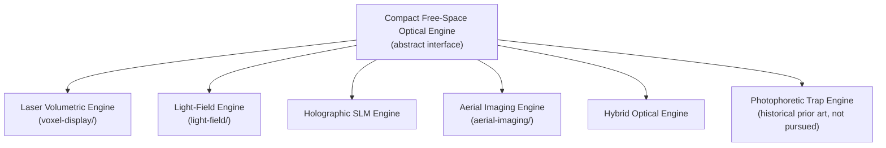

# Optical Engine — Two-Track Spec

> ## ⚠ THE CHOICE IS MADE — updated 2026-08-21
>
> This document framed the optical engine as a two-track decision still open. It is closed.
>
> **Engine: DMD + LED + fixed-focus relay.** No swept element, no varifocal, no phase SLM,
> no scanned beam. 15 of them in a ring, `N = 2πz/D` (`docs/13` §1).
>
> - The **swept-focus element is deleted**, not chosen — a person fits inside one depth-of-field
>   slab at pod distance, so the plane count is 1–2 rather than 24–32 (`docs/15` §2). The
>   2,700 Hz requirement and the $10–50k component it implied were artefacts of sizing depth
>   geometrically instead of perceptually.
> - **Scanned beam is rejected on throughput** by two orders of magnitude (`docs/13` §7).
> - **Phase SLM is rejected on cost** — 15 × $10k against 15 × $900.
> - **Sources are LEDs, not lasers** — ~1,000× light headroom (`docs/13` §4) spent on the easier
>   regulatory path (IEC 62471 rather than IEC 60825-1) and on lower export-control exposure.
>
> What remains genuinely open is **not** the engine: it is the **HOE relay band**, which has to be
> invented rather than bought, and which `docs/14` §5 identifies as the only surviving moat.
> Read `docs/13` §2 and §7 and `docs/15` §2 in place of the two-track framing below.

Source: `FilesPlan.md` §3, `research/arxiv/online_findings.md`. This is the single most consequential hardware decision in the project — nothing else in the display stage can proceed until the hackathon-track choice below is made.

## The physics constraint (why this is hard)

Free space has no scattering medium. Making a volume of ordinary air emit or redirect light without a physical surface requires one of: emitting light directly from points in the volume (plasma, particles, an emissive medium), or redirecting light so a viewer's eyes reconstruct depth (a coherent wavefront/SLM, angular multiplexing, a light-field panel). There is no way to make air glow directly from a phone-driven display. This rules out the literal "the phone blows the 3D shape into the air" framing as a plug-and-play mechanism and narrows the real design space to the five mechanisms below.

## Ranked mechanisms

| Mechanism | Cube-scale evidence | Fidelity ceiling | Verdict |
|---|---|---|---|
| Laser-plasma ionization (aerial voxels) | JSID 2025: 68×42mm, ~10k voxels/s. Dual-path scaling exists (SIGGRAPH 2026, DOI 10.1145/3816042) | Sparse/wireframe, not photoreal | North-star track |
| Acoustic levitation / ultrasonic particle display | MATD (Nature 2019) — room-scale, single/few particles, very low refresh | Cannot render a moving human at any published scale | Ruled out |
| Volumetric cloud/medium display | Optica 2025 — denser than air-plasma, but current form factor far exceeds 10cm; medium maintenance inside a sealed cube is unsolved | Better voxel density, unproven at this scale | Not the prototype |
| Holographic SLM / CGH | Real, mature field. **Updated Aug 2026 (see §"Literature update" below): angle, speed, and speckle each now have independent real point-solutions** — 159°×159° dynamic FOV (2511.22639), 60Hz full-color speckle-free video (2409.11049), 30dB speckle suppression (2604.16237) | No paper combines angle+speed+speckle; none evaluated at 10cm-cube scale, power/safety budget, or on a moving photoreal human face rather than test patterns | Individually de-risked sub-problems; the combined, human-face, cube-scale system remains unbuilt |
| **Light-field / retroreflective panel** (Looking Glass-class, AIP) | Commercial products exist today. **Software side now de-risked** — three real-time many-view rendering papers plus an already-working open-source webcam-to-panel pipeline (see literature update below) | Not free space — bound to a physical panel — but real depth cues, works today | **Hackathon track** |
| Photophoretic optical trap display | Smalley et al., Nature 2018 — single mechanically-scanned particle, sub-10µm voxels, near-360° viewing. **Added Aug 2026:** a 2025 review (2512.09401) confirms no new experimental result since 2018; multi-particle scaling is aspirational only (cites a 2016 SPIE paper, not demonstrated) | Single-particle only; multi-particle scaling has no positive demonstrated result | Real historical prior art, not a pursued candidate — no path to human-scale voxel counts shown anywhere in the literature |

## Literature update, Aug 2026 sweep (research task: "reduce the 15% gap")

A dedicated pass through ~742 previously-fetched, unread OPTICS-track papers (full write-ups in `research/deepseek_research.md` Track 1) was run specifically to try to narrow the free-space-display gap. Verdict, stated as plainly as the research pass itself stated it: **nothing found closes or comes close to closing the gap. The ~85%/15% split in `FilesPlan.md` stands.** What did change is more nuanced than "still exactly as unsolved":

- **CGH's narrow-viewing-angle problem is now measurably outdated.** 2511.22639 (a static metasurface pixel-interpolating a conventional LCoS SLM) demonstrates a real, hardware-validated 159.4°×159.2° dynamic hologram FOV at 60Hz — a ~7×7 area improvement over the ~few-degree figure previously cited (was sourced to arXiv 2203.06784). Monochromatic, small benchtop scale (95mm image at 8.4mm), precomputed-frame playback (not live generation) — but angle itself is no longer the blocking constraint it was.

  > **⚠ Correction (2026-08-15): the paragraph above over-reads this result** — see `docs/02_FREE_SPACE_OPTICAL_ENGINEERING.md` §5.3. The metasurface is *static and passive*: it interpolates, it does not add information. The dynamic mode count remains the SLM's 4×10⁶. Spending that across ±20° (116 views) leaves 4×10⁶/116 ≈ 34,500 = **186×186 spatial points against the 859×859 requirement**. The meta-projector **buys angle by spending resolution at a fixed mode budget.** This does not diminish the result — it is exactly the right *kind* of component (an étendue expander) — but "wide FOV achieved" and "wide FOV at usable resolution" are different claims, and every compact wide-FOV holographic claim in this literature should be audited this way.
- **Generic real-time CGH is achievable today**, just not of a human face: 2601.00630 (28fps holographic replay of real physical objects, measured not rendered, but needs 4×datacenter GPUs and an optical bench), 2409.11049 (HoloTile RGB — 60Hz full-color speckle-free video on a commodity SLM, >100× faster than conventional CGH), and 2205.02367 (exploits an existing 1440Hz commercial MEMS phase SLM). None has been run on a moving photoreal face — the closest content is three dice and a swimming dolphin.
- **Speckle has a strong but slow fix.** 2604.16237 (Ellipsography — joint phase+polarization modulation) gets ~30dB PSNR, 10dB better than the prior best real-display speckle-suppression technique, but runs at ~2.2s/frame and needs non-standard optics — it trades the speckle problem for no improvement on the speed problem.
- **The laser-plasma north-star track gets a caution, not a scaling win.** 2501.10198 shows a real physical reason (cumulative air-density depletion above ~10kHz pulse repetition rate — JSID 2025's baseline sits right at this crossover) why naively raising rep rate to scale voxels/s likely isn't linear. 2601.08906 (a >10 million-effective-fps arbitrary 2D beam-addressing SLM) is a genuinely remarkable physics result but is a neutral-atom-quantum-computing tool with single-digit-to-tens demonstrated spot count, no depth/z mechanism, and a multi-meter optical path — a "watch this," not evidence voxel counts can jump orders of magnitude. Both added as research questions to `experiments/voxel-display/README.md`.
- **Aerial-imaging magnification (Branch C) turned up nothing** in this pass — exactly as unaddressed as before.
- **Track D (perceptual threshold) could not be assessed** — psychophysics/presence papers are tagged PERCEPTION not OPTICS in the corpus, so this sweep (scoped to unread OPTICS papers) had no material to check. `docs/theory.md`'s engineering hypothesis remains exactly as unverified as `experiments/perceptual-quality/README.md` already states.
- **The hackathon-track light-field panel choice got a real, unrelated-to-the-gap win**: three independent papers (2605.04509 CoherentRaster, 2601.19901 LFDPR, 2508.18540 — all real-time many-view rendering from Gaussian/voxel content, one at 228fps on an actual commercial Looking-Glass-class panel) plus 2506.08064 — an already-working, open-source, single-webcam-to-Looking-Glass-Portrait live pipeline that explicitly names video conferencing as a use case — show the hackathon track's *entire* capture→view-synthesis→panel pipeline is buildable today on commodity hardware. See `pipeline/view_synthesis/README.md` and `experiments/light-field/README.md`.

## Literature update, second pass (three targeted follow-ups on the blind spots the first pass flagged)

The first sweep explicitly flagged three gaps in its own coverage rather than treating silence as a verdict. A dedicated second pass (three agents, capped, no large sub-fleets) chased each down. **Verdict unchanged: the 85%/15% split stands.** What's new:

- **Track D (perception) was finally checked — 55-60 papers read from the 208 PERCEPTION-tagged pool.** No paper gives the clean numeric threshold `docs/theory.md` wants ("N views is enough," "X% fidelity suffices"). But the strongest single finding across both passes combined is **2401.02171**: in an AR-HMD study, a life-size, correctly-placed **flat 2D video cutout** (no volumetric geometry, no parallax) produced co-presence statistically indistinguishable from a full rigged 3D avatar (5.2 vs 5.3 on a 7-point scale), while beating the 3D avatar's fidelity rating by a wide margin (5.1 vs 3.7, p<.001). If this generalizes to TAYF's free-space multi-viewer case (untested — the study used a single tracked viewpoint), it's a real candidate for revising the engineering hypothesis toward "parallax/volumetric structure may not be the load-bearing term for single-viewer conversational presence." Second finding worth designing around: **2509.17748** shows people are hardest on avatars of *themselves or people they know* — TAYF's actual deployment scenario (calling family/colleagues) is a harder perceptual bar than the stranger-recognition tasks most digital-human papers validate against. Full detail and three more supporting findings: `experiments/perceptual-quality/README.md`.
- **Branch C (aerial imaging) — the "zero papers" result was a venue-coverage artifact, not a physics verdict.** A 467-paper triage plus a full-corpus keyword sweep found zero genuine aerial-display-optics papers on arXiv (same false-positive pattern as "plasma" matching particle physics — here "aerial" almost entirely means drone/satellite imagery). External search confirms real, decade-plus, active research exists — Aerial Imaging by Retro-Reflection (AIRR, Yamamoto/Suyama et al., Utsunomiya University, commercialized as ASKA3D) — published in Optics Express / OSA Continuum / Optical Review, venues arXiv doesn't mirror. Full text couldn't be obtained (JS-gated / login-walled / 403s), so no numbers are verified. Branch C's row above is now "unassessed — wrong venue searched," not "ruled out." See the full note in `research/deepseek_research.md` Track 1 and `experiments/aerial-imaging/README.md`.
- **Laser-plasma scaling — still no positive result, and a second physical reason scaling is hard.** No paper beats or approaches JSID 2025's ~10k voxels/s. New information is negative-leaning: patent-literature background confirms naive multi-spot parallelism (splitting one laser's energy across N simultaneous spots) trades brightness for voxel count rather than multiplying throughput — a second physical constraint alongside 2501.10198's air-density-depletion effect. One unverified lead: Tsai, Kumagai, Quan, Luo, Hayasaki, *Applied Optics* 65, G69–G74 (2026) reportedly shows 1.82× per-voxel brightness enhancement via adaptive pulse shaping — not on arXiv (journal-only, same lab as the SIGGRAPH 2026 dual-path system), unverified beyond its public abstract, and a brightness fix, not a rate fix.
- **HUMAN×OPTICS cross-track search — confirms the gap and explains why it's structurally hard to find.** Every paper pairing an avatar with a "holographic display" turns out, on reading past the abstract, to be one of three things: a Looking-Glass-class lenticular panel called "holographic" loosely (VOODOO 3D 2312.04651, 2502.08085, and the already-documented LentiAvatar/Tele-Aloha/Mon3tr); a real coherent-wavefront CGH method explicitly scoped to near-eye AR/VR with zero human content (2607.19731, 2508.17480, likely 2505.06582); or pure marketing language with no display component at all (2503.17032, 2606.29333). The closest thing to a bridge — **2505.06582 / 2508.17480**, a Stanford Gaussian-splat-to-hologram transform, methodologically exactly the missing link between `pipeline/avatar/`'s representation and a holographic engine — has never been pointed at human content by its own authors and targets near-eye, not free space. Worth flagging as a concrete "someone should just try this" research direction rather than a solved bridge.

## Hackathon track (buildable now)

Compact light-field or retroreflective aerial-imaging panel, driven by the renderer in `pipeline/transport/README.md`'s receiver stage. Not literal free space; presented on stage honestly as the buildable interim output stage while the display track described below is the acknowledged open R&D item. Vendor/part selection is an open item — first task for the rerun of `hardware/bom.md`'s research pass.

## The engine must stay pluggable

Per `research/notes.md` §10: do not lock the invention to one optical mechanism. `pipeline/`'s renderer targets an abstract optical-engine interface (input: `L(x,y,z,θ,φ,t)` samples per `docs/theory.md`; output: whatever the physical engine needs — panel frames, scan-pattern commands, hologram phase maps), so swapping the hackathon-track panel for a different candidate, or eventually swapping in a north-star engine, does not require touching `pipeline/avatar/` or `pipeline/capture/`.

## Research variables per candidate (what each branch actually measures — see `experiments/`)

- **Laser-plasma (Branch A):** voxel size, voxel density, drawing volume, laser energy, scan speed, repetition rate, axial resolution, lateral resolution, safety margin, optical efficiency, temporal stability. Protocol: `experiments/voxel-display/README.md`.
- **Directional light-field / holographic (Branch B):** number of views needed for convincing 3D, achievable emitter compactness, neural-interpolation compatibility for missing angles. Protocol: `experiments/light-field/README.md`, `pipeline/view_synthesis/README.md`.
- **360° directional light field:** a light-field variant using multiple compact optical channels (candidate: 8+ views) combined with neural interpolation between physical channels — same underlying research question as Branch B at a wider angular target. Not separately branched in `experiments/`; treated as a light-field configuration, not a distinct mechanism.
- **Aerial imaging (Branch C):** achievable magnification vs. brightness/resolution tradeoff for transforming a small source into a larger apparent volume (Fresnel optics, catadioptric systems, retroreflective corner-cube arrays). Protocol: `experiments/aerial-imaging/README.md`.
- **Holographic SLM (Branch D):** achievable field of view, required hologram resolution, required laser power, whether the optical path fits inside 10cm at all. Not separately branched in `experiments/` yet — folded into north-star track pending resource priority after Branch A/B.
- **Hybrid (Branch E):** combinations such as light-field + aerial optics + neural rendering, or laser voxels + directional light field, or holographic SLM + aerial imaging. Explicitly not attempted before the individual branches produce real measurements — combining unmeasured mechanisms compounds unknowns rather than resolving them.

## North-star track (not a hackathon deliverable)

Laser-plasma or hybrid plasma-in-medium aerial display, scaled from the JSID 2025 baseline toward 10^5-10^6 points/s. This is a multi-year program, not a four-week one — see `docs/roadmap.md`.

### Eye safety — applies to BOTH tracks, not just the laser one

> **⚠ Scoping correction (2026-08-15).** This section previously appeared only under the north-star track, which was wrong and is a real safety error. Per `docs/04_CUBE_HARDWARE_AND_PROTOTYPE_ENGINEERING.md`: **the hackathon track is not automatically safe.** A 150–250 mW visible source — entirely plausible for a compact illumination engine driving a light-field or holographic output — is **Class 3B in the single-fault case** (e.g. a failed diffuser, a scanner that stops mid-sweep leaving a static focused beam, or a collimated zero-order leak from an SLM). Any TAYF prototype with a visible source above roughly 1 mW accessible emission requires a hazard analysis before it is pointed at a person, regardless of which track it belongs to. Single-fault behaviour — not nominal operation — is what the analysis must cover.

Femtosecond laser-plasma ionization is additionally a Class 4 hazard by nature of the mechanism (it has to be intense enough to ionize air at focus). A device meant to sit near a person's face has no margin for skipping this. Before any optical hardware with a non-trivial source is powered on near a person:

1. Full exposure/pulse-energy analysis against applicable laser safety limits (not yet started).
2. Engineering controls to consider: physical exclusion zone around the focal volume, gaze/proximity-triggered pulse gating, interlocks.
3. This section stays a placeholder — not a checklist to skip — until real analysis exists. No demo, however informal, proceeds without it.
