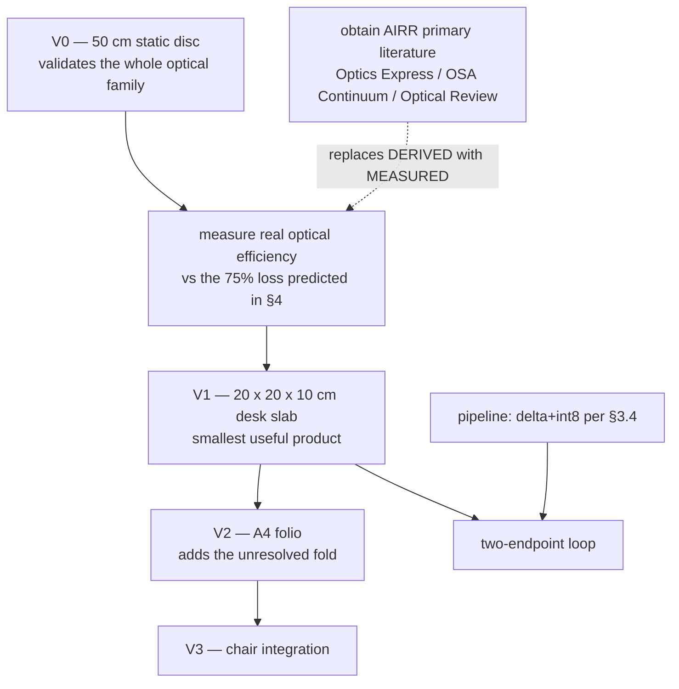

---

## 10. Build order, and what to do on Monday

Nothing below needs a discovery. Every step is engineering against numbers already in this document.

### 10.1 The critical path

### 10.2 Ordered actions

| # | Action | Why now | Blocked by |
|---|---|---|---|
| 1 | **Build V0, the 50 cm static disc** | Simplest configuration; validates AIRR end to end with no hinge, no folding, no moving parts | Sourcing a retroreflector sheet and a beamsplitter |
| 2 | **Measure optical efficiency** against §4's predicted ~75% loss | Every brightness figure in this document is `[DERIVED]`; one measurement upgrades them all | V0 |
| 3 | **Obtain the AIRR primary literature** | The single largest `[UNVERIFIED]` block. Paywalled in Optics Express / OSA Continuum / Optical Review — not on arXiv, which is exactly how it was missed for two days | Institutional or document-delivery access |
| 4 | **Change `pipeline/schema.py` to delta + int8** | §3.4 measured the current spec wrong; the fix halves bandwidth and removes a dependency | Nothing — **done, see `encode_delta`** |
| 5 | **Commit the avatar-model licence** (Anny or MHR, never SMPL-X) | Blocks writing capture code against a rig topology; SMPL-X is non-commercial and would have to be ripped out later | A decision |
| 6 | **Register on the Nokia NaC portal** | Blocks every live CAMARA call | An account |
| 7 | **Benchmark the estimator stack on Jetson-class silicon** | The single largest inherited assumption: Mon3tr's rates are PC-class and the port is `[UNVERIFIED]` | One Jetson |

Actions 5 and 6 are decisions, not research, and can be closed this week.

### 10.3 What would falsify the design

Stated so the project can be wrong quickly and cheaply rather than slowly and expensively:

| If | Then |
|---|---|
| Measured AIRR efficiency is far below 25% | Source panel luminance becomes the binding constraint; the device grows or dims |
| The three-surface fold proves unmanufacturable at book scale | The folio dies; the disc and the chair are unaffected |
| Jetson-class inference cannot hold the latency budget | Either the estimator stack shrinks or compute moves off-device, weakening self-containment |
| Retroreflector cost scales badly with area | Small formats survive; the mirror and doorway become uneconomic |

None of these threatens the physics. All are measurable with V0 and one Jetson.

---

## 11. Closing statement

The project set out to build a 10 cm cube that would place a whole standing person in your chair. That device cannot be built by anyone, at any budget, and this document records the six independent physical laws that forbid it — clipping, nitrogen's spin selection rule, the plasma power wall, numerical aperture, Bjerknes collapse, and pulmonary toxicology. Each was tested rather than assumed, and each is written up in §9 so nobody has to re-tread them.

What survived is better specified than the original ever was: **a family of devices, sized by geometry rather than by wish, that put a life-size person in open air in an ordinary room — no headset, no glasses, nothing worn, nothing else to buy, and no moving parts.** From a 20 cm slab on a desk to a chair you sit opposite. The capture and transport half is solved and measured. The optical half is static sheet optics and a display panel.

The honest position is not that TAYF is finished. It is that **the remaining work is engineering, and every open item has a name, a number, and a way to close it.**

*Confidence tags in this document are load-bearing. `[MEASURED]` means someone measured it. `[UNVERIFIED]` means we believe it and could be wrong. A document that blurs those two is worth less than no document.*

---

*Rebuild this document with `python3 models/assemble_doc.py`. §1–§3 are hand-written above the assembly marker; §4–§9 are spliced from the section sources; §10–§11 come from `models/doc_footer.md`. Corrections that supersede an authored section are applied by the assembler so they survive every rebuild.*
