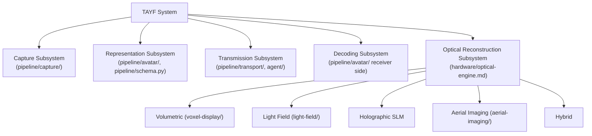

# Claim Map — Architecture to Potential Claim Scope

Draft mapping only — see `patent/PATENT_NOTES.md`. Maps `docs/architecture.md`'s subsystems to where `patent/invention-disclosure.md`'s four concepts might anchor, if an attorney finds real scope after a prior-art search.

## Guidance carried from `research/notes.md` §43

The core claimed relationship, if pursued, should potentially be the **system-level combination** — the specific coupling between subsystems (Concepts A-D in `patent/invention-disclosure.md`) — rather than a single projector/optical-engine geometry. A claim anchored to one specific optical mechanism (e.g. "laser-plasma voxel display for telepresence") is both easier to design around and closer to existing prior art (`patent/prior-art.md`) than a claim anchored to the cross-subsystem coupling.

## Explicit non-strategy

Do not lock the invention disclosure to one optical mechanism (`hardware/optical-engine.md` deliberately keeps the optical engine pluggable/abstracted for this same reason — engineering and IP strategy align here, not by coincidence).

## Status

Unreviewed by counsel. Not to be treated as an actual claim map until it is.
