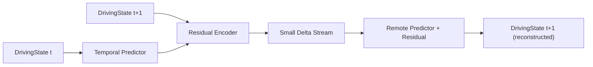
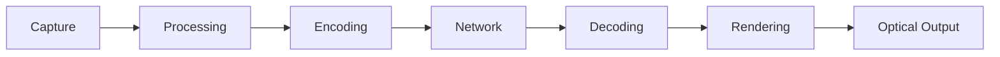

# Transport Module

Responsibility: get a `pipeline/schema.py::DrivingState` stream from the sending cube's `capture/` module to the receiving cube's `avatar/` module, compressed, over a network path with a guaranteed latency budget.

## Path

1. **Pack:** `DrivingState.pack()` → 868 bytes/frame (pre-compression, per `schema.py`).
2. **Compress:** FP16 + LZ4, matching Mon3tr's approach — gets sustained bandwidth under 0.2 Mbps at ~60fps.
3. **Send:** WebRTC data channel (via `aiortc`, per `pipeline/requirements.txt`).
4. **Network path:** where possible, a CAMARA QoD session (`agent/README.md`) guarantees the latency/throughput profile for the duration of the call rather than relying on best-effort routing.
5. **Receive/decompress/unpack:** mirror of steps 1-2 on the receiving cube, handing a `DrivingState` to `avatar/`.

## Where the agent layer plugs in

`transport/` does not itself decide when to request a QoD session or a network slice — that decision logic lives in `agent/`, driven by CAMARA Congestion Insights' 15-minute-ahead prediction. `transport/` exposes a simple "network conditions are degrading" signal (packet loss / RTT trend from the WebRTC stack) that the agent layer can act on.

## Target numbers (Mon3tr reference, unvalidated on TAYF's actual target hardware)

- <0.2 Mbps sustained
- ~80ms end-to-end latency
- ~60fps

Validated (or not) empirically per `experiments/bandwidth/README.md` and `experiments/latency/README.md` — these are targets, not yet measured results on TAYF hardware.

## Temporal / delta compression

Per `research/notes.md` §32: humans are temporally coherent, so `frame(t+1) ≈ frame(t) + Δ`. Rather than sending every `DrivingState` (`pipeline/schema.py`) in full each frame, the sender can run a lightweight temporal predictor and transmit only the residual:

This is additive to the FP16+LZ4 compression above, not a replacement for it — LZ4 compresses whatever bytes are actually sent, whether that's the full 868-byte frame or a much smaller residual. Not yet implemented; first candidate optimization once the baseline (full-frame FP16+LZ4) path is measured in `experiments/bandwidth/README.md`, so any gain from delta-encoding is measured against a real baseline rather than assumed.

## Latency budget (per-stage, target <150ms total)

<150ms end-to-end is the ITU-T G.114 conversational one-way threshold; Mon3tr's ~80ms reference leaves real margin, but that margin is unvalidated on TAYF's Jetson-class target hardware (see `experiments/latency/README.md` for the per-stage instrumentation plan — no stage has been measured on real hardware yet).

## Open items

1. No implementation exists yet — this is the next concrete coding task once the avatar-model license decision unblocks `pipeline/avatar/`.
2. Fallback behavior when no CAMARA QoD session is available (e.g., Wi-Fi-only demo environment) is not designed.
3. Delta-encoding gain is unmeasured — do not assume it's needed until the baseline in `experiments/bandwidth/README.md` shows it is.
