Absolutely. I’m preserving the core idea from the previous answer, but reorganizing it into a single AI-readable engineering/research document. I have **removed the ASCII diagrams entirely** and replaced them with Mermaid diagrams and formal/verbal descriptions. The uploaded material supports the core constraints and the three optical directions summarized below. 

```
# Compact Free-Space Spatial Telepresence Node
## Research, Engineering, Optical Architecture, Prototype Program, and Patent Concept

> Working concept:
>
> Two identical approximately 10 cm × 10 cm × 10 cm autonomous cubes exist at two remote locations.
> One cube may be in the United States and the other in China.
> Each cube captures its local human, computes a compact dynamic representation of that human, transmits the representation over an ordinary network, and reconstructs the remote human directly into free space at the opposite cube.
>
> The system does not depend on:
>
> - a wall
> - a chair
> - a projection screen
> - an external projector
> - a headset
> - a room-sized capture/display system
> - an external display apparatus
>
> The long-term objective is a self-contained spatial-telepresence device in which the cube itself contains the sensing, computation, networking, and optical engine.

---

# 1. The Core Idea

The invention should not be framed as:

> "A hologram cube."

A stronger research framing is:

> **Compact Free-Space Spatial Telepresence Node**

The fundamental idea is:

**human capture → compact dynamic human representation → network transmission → remote reconstruction → free-space optical emission**

The two physical devices are functionally symmetric.
````

```mermaid
flowchart LR
    US["Cube A<br/>United States"] --> NET["Network<br/>WebRTC / future transport"] --> CN["Cube B<br/>China"]
    CN --> NET --> US

    US --> A["Capture + Human Representation"]
    A --> B["Compact Dynamic State"]
    B --> C["Transmission"]

    CN --> D["Reception + Decode"]
    D --> E["Spatial Reconstruction"]
    E --> F["Free-Space Optical Engine"]
    F --> G["Remote Human Appears in Space"]

    style US stroke-width:2px
    style CN stroke-width:2px
    style NET stroke-width:2px
````

The critical requirement is that the remote person is not displayed on another physical surface.

The desired result is a luminous spatial image or directional light field existing in the physical volume surrounding the cube.

---

# 2. Hard System Constraints

These constraints define the invention.

## Physical constraints

Each endpoint should ultimately be approximately:

**10 cm × 10 cm × 10 cm**

The cube itself must contain the required hardware.

There should be no mandatory external:

* screen
* wall
* projection surface
* headset
* tracking rig
* room-sized capture array
* room-sized display
* external optical projector

The cube should be the entire endpoint.

## Telepresence constraints

The system should support:

* a moving human
* body motion
* head motion
* facial motion
* hand motion
* potentially finger articulation
* view-dependent appearance
* low enough latency for conversation
* sufficiently high visual consistency to produce a convincing sense of presence

## Optical constraints

The desired display should:

* exist in free space
* not require a physical projection surface
* provide useful depth perception
* support multiple viewing directions or a large angular field
* ideally support 360° or near-360° viewing
* generate different optical information for different viewing directions
* eventually support spatially localized representation of a human

---

# 3. The Most Important Interpretation of "Limited Light"

A major insight is that the system does not necessarily need to illuminate every point equally in every direction.

The desired optical field can be thought of as a function:

L(x, y, z, θ, φ, t)

where:

* x, y, z = spatial position
* θ, φ = viewing direction
* t = time

The optical system therefore attempts to synthesize the correct light as a function of both:

1. where the apparent object is
2. from which direction the observer is looking

This is effectively a dynamic 4D light field.

The neural/computational system determines what optical information should exist.

The hardware approximates that optical field.

This is important because it means the goal is not necessarily:

> physically illuminate every volumetric point from every direction.

Instead, the goal can be:

> **emit only the light necessary to produce the correct perceptual image from the relevant viewing directions.**

That can drastically reduce the optical burden.

---

# 4. Why This Is Not Simply "A Projector"

A conventional projector performs approximately:

image → photons → physical surface

Your system instead wants approximately:

3D representation → controlled optical field → free-space image

The key distinction is therefore:

**surface projection vs. spatial optical reconstruction**

A normal projector cannot simply project a human into empty space because the photons require something with which to interact.

The research direction therefore moves toward optical systems capable of:

* creating visible voxels in air
* producing aerial images
* producing directional light fields
* reconstructing holographic wavefronts
* transforming a small source into a larger apparent aerial volume

---

# 5. Candidate Optical Architecture I:

# Laser-Excited Aerial Volumetric Display

This is the most literal interpretation of the idea.

The system creates actual visible luminous points within free space.

A 2025 fist-sized aerial volumetric display demonstrated visible voxels directly in air using femtosecond-laser drawing, with an experimentally achieved drawing volume of approximately:

* 68 mm lateral
* 42 mm axial

The research explicitly discusses telecommunications and person/avatar projection as possible applications.

The critical limitation is scale.

Current demonstrations are centimeter-scale rather than life-size.

That means the research problem becomes:

> How far can the volumetric optical volume be scaled while keeping the optical engine sufficiently small, safe, efficient, and fast?

Conceptual architecture:

```mermaid
flowchart TB
    S["Remote Human Representation"] --> N["Network"]
    N --> D["Decoded Dynamic 3D State"]
    D --> R["Voxel / Spatial Renderer"]
    R --> L["Femtosecond Laser"]
    L --> O["Scanning / Focusing Optics"]
    O --> V["Free-Space Excitation Volume"]
    V --> H["Visible Spatial Image"]
```

The key research variables become:

* voxel size
* voxel density
* drawing volume
* laser energy
* scan speed
* repetition rate
* axial resolution
* lateral resolution
* safety
* optical efficiency
* temporal stability

---

# 6. Candidate Optical Architecture II:

# Holographic / Light-Field Ray Generation

This may be the more important long-term route.

Instead of generating a literal luminous point for every component of the person's body, the system can attempt to generate the correct outgoing light rays.

The observer sees the correct image because the optical system produces the appropriate angular distribution.

Conceptual model:

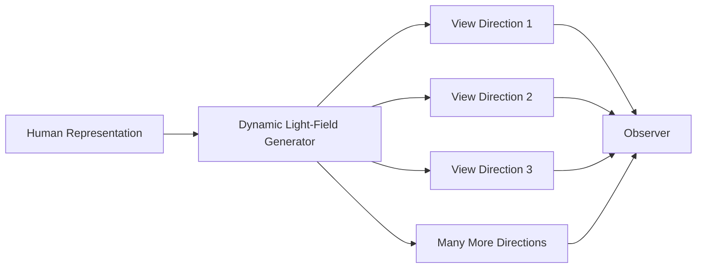

When the observer moves, the rays reaching the observer change.

Therefore the person can remain spatially convincing even though the optical system is not physically generating a complete solid body in every direction.

This is especially compatible with the concept:

> **generate the right light rather than generate the entire object physically.**

---

# 7. Candidate Optical Architecture III:

# 360-Degree Directional Light Field

A 360° display can be designed as a collection of directional views.

Existing research has demonstrated 360° transparent light-field display architectures with many distinct viewpoints.

This suggests a possible architecture in which the cube contains multiple compact optical channels.

Conceptually:

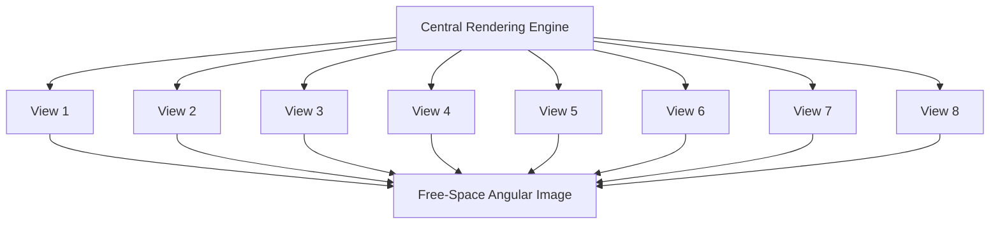

The crucial possibility is that a modest number of physical optical views might be combined with neural interpolation.

Therefore:

**physical optical views + neural view synthesis**

may produce many more apparent viewpoints than the number of physical emitters.

---

# 8. Candidate Optical Architecture IV:

# Aerial Imaging

Another route is to generate a real image that appears to exist in mid-air.

The optical chain becomes:

**small display/source → optical transformation → apparent image in free space**

This is potentially very interesting for the 10 cm constraint.

Instead of physically constructing a huge light-emitting volume, the optical system attempts to transform a smaller source into a larger apparent aerial volume.

Relevant optical concepts include:

* aerial imaging
* reflective imaging
* Fresnel optics
* free-space imaging
* catadioptric systems
* optical transformation
* light-field magnification

Conceptual architecture:


---

# 9. Candidate Optical Architecture V:

# Holographic SLM System

A spatial light modulator can be used to encode optical phase/amplitude information.

A possible system can contain:

* laser source
* spatial light modulator
* beam steering
* focusing optics
* phase control
* possibly multiple optical paths

Recent volumetric work has combined:

* femtosecond lasers
* spatial light modulators
* galvanometer scanning
* varifocal optics

for laser-excited volumetric displays.

This establishes another credible experimental direction.

---

# 10. Do Not Lock the Invention to One Optical Mechanism

This is extremely important for the research and patent architecture.

The overall invention should not depend on one particular display technology.

The display subsystem should be abstracted as:

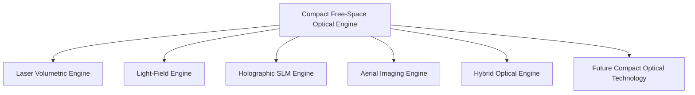

The core invention remains:

**capture → compact representation → transmission → reconstruction → free-space spatial optical output**

The optical implementation is one replaceable subsystem.

This keeps the research architecture broader and potentially makes the eventual intellectual-property strategy more flexible.

---

# 11. The Computational Half Is Already Moving Toward Feasibility

The optical display is not the only challenge.

The computational system also needs to represent humans efficiently.

The uploaded SOTA research identifies three broad architectures:

1. Stream the actual volumetric representation.
2. Reconstruct each frame and transmit the result.
3. Build a persistent avatar and transmit only driving parameters.

The third architecture is especially attractive.

Reported numbers in the research include:

* approximately 0.7 Mbps for measured Apple Spatial Persona traffic
* below 0.2 Mbps for Mon3tr
* much larger bandwidth requirements for direct volumetric streaming

This creates a major architectural lesson:

> **Do not transmit the entire 3D human every frame if the remote endpoint can reconstruct the human from a compact representation.**

---

# 12. The Preferred Telepresence Pipeline

The complete system should therefore look like:


The exact models can change.

The architecture should remain stable.

---

# 13. Capture Subsystem

The cube must eventually capture enough information to reconstruct the human.

Possible sensors include:

* RGB cameras
* depth cameras
* stereo cameras
* multiple miniature cameras
* event sensors
* optical-flow sensing
* inertial sensors

The cube does not necessarily need to reconstruct every detail from scratch.

The research direction is:

**capture enough information to infer the human state required by the receiver.**

---

# 14. Human Representation

The system can represent a human using several possible representations.

Potential representations include:

* parametric body representation
* neural avatar
* Gaussian avatar
* dynamic Gaussian representation
* mesh + texture
* neural radiance representation
* hybrid skeletal + neural representation
* pose/expression parameters
* learned latent representation

The ideal representation should separate:

### Persistent information

Examples:

* body shape
* face identity
* skin appearance
* hair structure
* clothing appearance
* avatar geometry

from:

### Dynamic information

Examples:

* body pose
* facial expression
* gaze
* hand pose
* finger articulation
* mouth motion
* temporal deformation

That lets the system transmit mostly the dynamic state.

---

# 15. Avatar Enrollment

One plausible architecture is:

## Once

The person creates a personal avatar.

Potential enrollment:

* phone capture
* cube capture
* short calibration session
* multiple facial expressions
* body movement
* hand movement

Then the persistent avatar is stored.

## During conversation

Only the dynamic state needs to be transmitted.

This is the same general architectural advantage demonstrated by low-bandwidth avatar telepresence systems.

---

# 16. Network Architecture

The preferred initial transport is WebRTC because conversational telepresence requires low latency.

Conceptually:

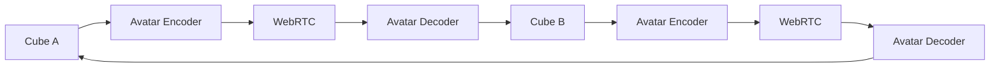

The primary transmitted object should ideally be:

**avatar state / latent state / pose / expression / appearance deltas**

rather than:

**raw multi-camera video / raw point cloud / raw 4D Gaussian frames**

---

# 17. Environment Independence

The final concept specifically rejects dependence on the environment.

The cube should not need:

* a wall
* a projection surface
* a special chair
* a dedicated stage
* a capture booth
* external tracking infrastructure

The display itself must create the spatial output.

Environment sensing can still be useful, but it must not be a mandatory optical display surface.

---

# 18. Spatial Registration

Even though the display is free-space, the system should know where the apparent remote person is supposed to exist.

The cube therefore defines a local spatial coordinate frame.

The system can then establish:

* origin
* orientation
* apparent human location
* apparent human scale
* viewing volume
* optical coordinate system

Conceptually:

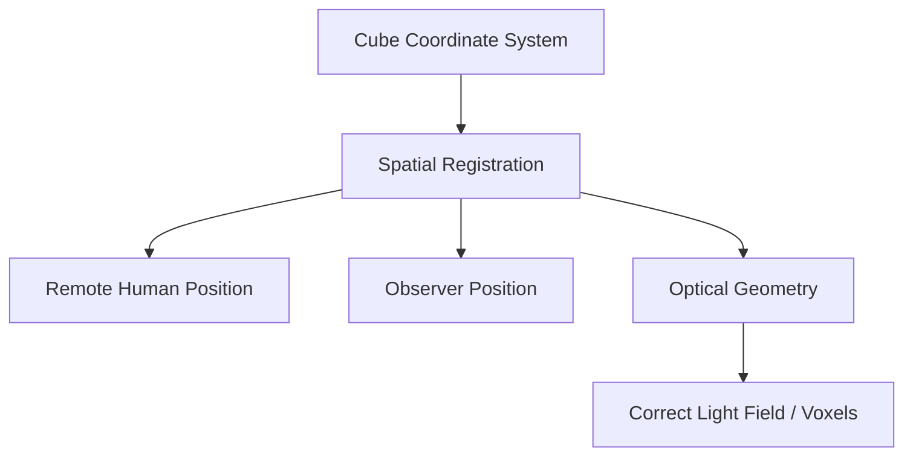

---

# 19. Viewpoint Dependency

The cube should ideally estimate observer position.

Possible methods include:

* camera-based eye tracking
* depth sensing
* computer vision
* multiple observers
* directional optical emission
* broad angular sampling

The renderer then computes the appropriate light field.

A simplified conceptual function is:

**L(x, y, z, θ, φ, t)**

where:

* `(x, y, z)` = location
* `(θ, φ)` = direction
* `t` = time

This gives a mathematical framework for the optical renderer.

---

# 20. Neural View Synthesis

This may be one of the strongest ideas in the entire project.

You may not need a physically dense optical display containing every view.

Instead:

**few physical optical views → neural interpolation → many apparent views**

Conceptually:


This creates an important research question:

> What is the minimum number of physical optical channels required when neural rendering fills the angular gaps?

---

# 21. Human Appearance Does Not Need Equal Fidelity Everywhere

A useful research direction is perceptual allocation.

The system could allocate more representation and rendering resources to:

* face
* eyes
* mouth
* hands
* fingers

and fewer resources to:

* hidden clothing regions
* low-saliency surfaces
* regions outside current viewpoint
* occluded regions

This produces:

**perceptual compression + perceptual optical rendering**

rather than uniform volumetric fidelity.

---

# 22. The Real Research Problem

The central question is not:

> Can we make a hologram?

That is already a mature research field.

The much stronger question is:

> **Can a centimeter-scale self-contained optical engine synthesize a sufficiently dense and angularly selective free-space light field to represent a moving human at useful perceptual scale?**

A second major question is:

> **Can a learned compact human representation reduce the optical information required enough that a physically tiny emitter can reconstruct the perceptually important structure of a person?**

A third question is:

> **Can neural view synthesis compensate for the limited number of physical optical channels in a miniature free-space display?**

A fourth:

> **Can the resulting system achieve conversational latency while preserving temporal stability and human identity?**

---

# 23. The Three Major Engineering Frontiers

The project can be divided into three major subsystems.

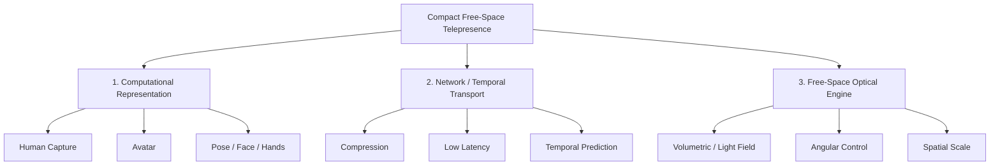

The first two are increasingly accessible.

The optical subsystem is likely the hardest.

---

# 24. The 10 cm Cube Is a Final Engineering Constraint

The first prototype should not attempt to satisfy every final requirement simultaneously.

The logical progression is:

1. prove free-space optical generation
2. prove stable small-volume 3D imagery
3. prove dynamic imagery
4. prove human reconstruction
5. prove view-dependent rendering
6. reduce optical volume
7. reduce hardware
8. integrate capture and display
9. shrink the entire system
10. target 10 × 10 × 10 cm

The first successful prototype does not need to be the final physical size.

---

# 25. First Optical Prototype

The first experiment should be intentionally simple.

Target:

* approximately 10 cm optical housing
* approximately 5–10 cm free-space display volume
* very simple geometry
* no human subject required initially

Display progression:

1. point
2. line
3. triangle
4. cube
5. rotating cube
6. sphere
7. simple face
8. hand
9. head
10. upper body
11. human figure

Each experiment answers:

> How much spatial and angular information is required before the observer perceives a stable three-dimensional object?

---

# 26. Why This Progression Matters

A human is a terrible first experiment because a human requires:

* complex geometry
* skin
* hair
* cloth
* hands
* facial expression
* temporal consistency
* occlusion
* lighting
* identity preservation

A simple geometric object isolates the optical problem.

Therefore:

**solve the optical engine before solving photorealistic human capture.**

---

# 27. Suggested Experimental Ladder


At every stage measure:

* spatial resolution
* angular resolution
* image stability
* latency
* brightness
* viewing angle
* apparent depth
* persistence
* optical efficiency
* power consumption

---

# 28. Optical Research Branches

The experiments should proceed in parallel.

## Branch A

Laser-excited volumetric voxels.

Questions:

* how large can the voxel volume become?
* how fast can voxels be generated?
* how safe is the laser system?
* how many voxels are required?
* can selective voxels approximate a human?

## Branch B

Directional light field.

Questions:

* how many views are necessary?
* can directional control produce convincing 3D?
* how compact can the emitter become?
* can neural rendering interpolate missing angles?

## Branch C

Aerial image optics.

Questions:

* can small optics produce a large apparent volume?
* how much magnification is possible?
* what happens to brightness?
* what happens to spatial resolution?

## Branch D

Holographic SLM.

Questions:

* what field of view is achievable?
* what hologram resolution is needed?
* what laser power is required?
* can the optical path fit inside 10 cm?

## Branch E

Hybrid architecture.

Potentially:

**light field + aerial optics + neural rendering**

or:

**laser voxels + directional light field**

or:

**holographic SLM + aerial imaging**

---

# 29. Hybrid Optical Engine

A potentially powerful architecture is:

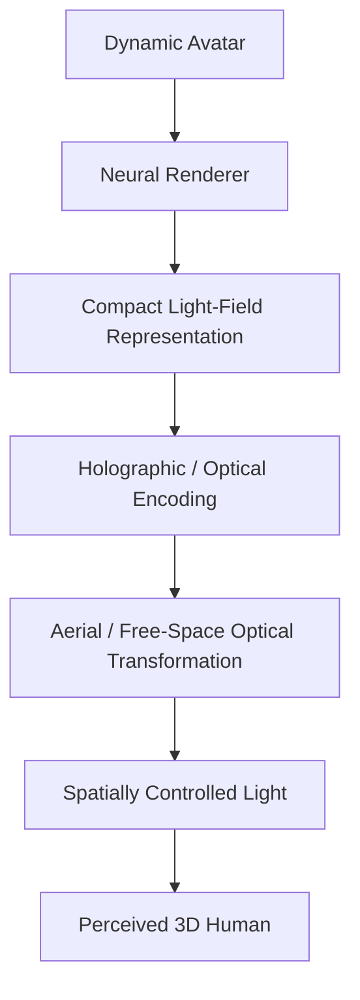

This separates:

**what light should exist**

from:

**how the optics physically generate that light**

This separation is central to the research.

---

# 30. Latency Budget

The system must eventually stay within a conversational latency budget.

A useful conceptual budget is:


Each subsystem receives only part of the total latency budget.

The practical target should be:

**<150 ms end-to-end**

with an eventual goal of getting significantly lower where possible.

---

# 31. Bandwidth Strategy

The system should optimize for:

**semantic transmission**

rather than:

**raw volumetric transmission**

Instead of transmitting:

* millions of 3D points
* millions of Gaussian parameters
* raw multi-camera frames

prefer transmitting:

* avatar identity
* skeletal pose
* face state
* hand state
* expression state
* latent appearance deltas
* temporal residuals

The receiver reconstructs the visible result locally.

---

# 32. Temporal Compression

Humans are temporally coherent.

Therefore:

frame(t+1) ≈ frame(t) + Δ

The network should exploit this.

Possible data model:

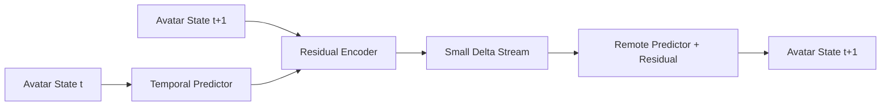

This can reduce network load dramatically.

---

# 33. The Cube's Logical Internal Architecture

A future cube can contain:

## Capture subsystem

* miniature cameras
* optional depth sensing
* synchronization
* sensor processing

## Compute subsystem

* neural inference
* avatar tracking
* temporal prediction
* encoding/decoding

## Network subsystem

* Wi-Fi / Ethernet during development
* WebRTC transport
* optional future custom protocol

## Optical subsystem

* laser or light source
* SLM or directional optical element
* beam steering
* focusing optics
* aerial optics
* optical calibration

## Control subsystem

* microcontroller
* power regulation
* thermal management
* optical synchronization

---

# 34. Conceptual Cube Hardware Partition

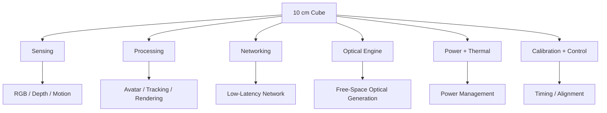

---

# 35. The Device Must Eventually Be Symmetric

Both endpoints should contain essentially the same architecture.

This gives:

**Cube A = Cube B**

rather than:

**capture device + separate display system**

That greatly simplifies the system concept and strengthens the idea of the cube as a spatial communication endpoint.

---

# 36. Bidirectional Conversation

The user should be able to speak and move naturally.

The same cube simultaneously:

1. observes the local user
2. reconstructs the local avatar
3. sends the local state
4. receives the remote state
5. renders the remote user
6. captures again

Conceptually:

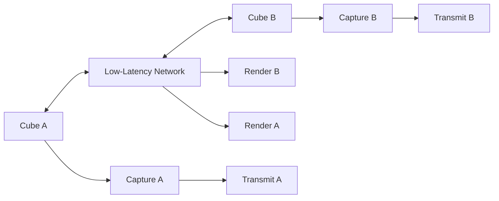

This creates a true spatial communication endpoint.

---

# 37. The Phone

The phone should not be required during normal communication.

It can be used for:

* setup
* enrollment
* configuration
* identity management
* body-region selection
* quality selection
* diagnostics
* software updates
* calibration assistance

But the long-term vision is:

**phone = controller**

not:

**phone = required external display/capture hardware**

---

# 38. Body-Region Selection

The phone interface can expose options such as:

* full body
* head
* face
* hands
* upper body
* torso
* custom region

The user can trade fidelity against computation/bandwidth.

For example:

**high fidelity mode**

* face
* eyes
* mouth
* hands
* fingers

while lower-saliency regions use lower fidelity.

---

# 39. Perceptual Rendering Strategy

The system should not necessarily optimize every voxel equally.

A useful objective is:

**maximize perceived human presence per unit of optical complexity**

That suggests perceptual optimization.

The renderer can prioritize:

1. face
2. eyes
3. mouth
4. hands
5. pose
6. silhouette
7. clothing
8. low-saliency details

This is likely more efficient than brute-force volumetric rendering.

---

# 40. Candidate Representation Stack

A commercially oriented research stack could investigate:

* gsplat
* Apache-compatible avatar representations
* MHR-based body representation
* neural avatar approaches
* compact Gaussian representations
* learned latent representations

The uploaded SOTA research highlights:

* gsplat
* Brush
* Anny
* MHR
* LAM
* BiRefNet
* SAM 3D Body

as particularly interesting components to investigate, while warning about research-only and non-commercial dependencies.

---

# 41. Licensing Strategy

This matters if the goal is eventually commercialization.

Do not assume:

> MIT repository = commercially safe system

Dependencies may contain separate restrictions.

The research review specifically warns about:

* non-commercial Gaussian-splatting dependencies
* SMPL / SMPL-X restrictions
* research-only model weights
* datasets with restrictive licenses
* transitive dependency restrictions

Therefore every component should eventually have a licensing table.

Example:

| Component   | Purpose              | License              | Commercial Status  |
| ----------- | -------------------- | -------------------- | ------------------ |
| gsplat      | Gaussian rendering   | Apache-2.0           | promising          |
| Brush       | WebGPU rendering     | Apache-2.0           | promising          |
| Anny        | Human representation | Apache-2.0           | promising          |
| MHR         | Human rig            | permissive direction | verify exact terms |
| BiRefNet    | Matting              | MIT                  | promising          |
| SAM 3D Body | Body estimation      | custom               | verify             |
| LAM         | Avatar generation    | Apache-2.0           | promising          |

Always independently re-check licenses before commercialization.

---

# 42. Patent Strategy

Do not attempt to patent:

> "A hologram cube."

Do not attempt to patent:

> "Displaying a person holographically."

Those concepts have extensive prior art.

Instead, investigate patentable novelty around combinations such as:

### Potential inventive concept A

A compact self-contained telepresence node that:

* captures a human
* generates a compact dynamic representation
* transmits the representation
* reconstructs the human at a remote node
* produces a free-space optical representation

### Potential inventive concept B

A miniature optical engine where:

* neural rendering determines required angular information
* physical optical channels generate only selected directional components
* neural synthesis fills angular gaps

### Potential inventive concept C

A telepresence node where:

* the human representation
* spatial coordinate system
* optical coordinate system
* viewing direction
* temporal state

are jointly optimized.

### Potential inventive concept D

A hybrid system in which:

* sparse optical emission
* compact human representation
* neural view synthesis

cooperate to produce a perceptually complete 3D remote person.

These are research directions, not claims of patentability.

A professional prior-art search and patent attorney should determine actual novelty and claim scope before filing.

---

# 43. The Patent Should Describe the Architecture Broadly

A future patent architecture could conceptually separate:

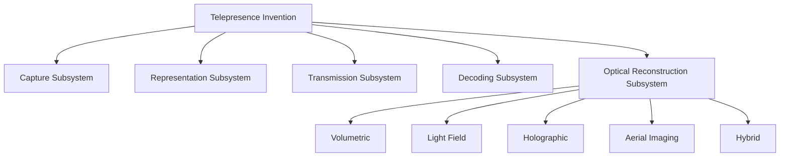

The core claimed relationship should potentially be the system-level combination rather than a single projector geometry.

---

# 44. Important Patent Timing Warning

Do not publish detailed novel implementation details publicly before obtaining appropriate patent advice.

GitHub is excellent for:

* reproducibility
* open research
* documentation
* experiment tracking

But public disclosure can create patent complications depending on jurisdiction.

A sensible research process is:

1. maintain private invention records
2. document experiments
3. run prior-art searches
4. prepare invention disclosure
5. consider provisional/patent filing strategy
6. then publish appropriate material

---

# 45. The GitHub Research Repository

Recommended structure:

```text
spatial-telepresence-cube/
├── README.md
├── ROADMAP.md
├── THEORY.md
├── SYSTEM_ARCHITECTURE.md
├── OPTICAL_ENGINE.md
├── HUMAN_REPRESENTATION.md
├── NETWORK_PROTOCOL.md
├── VIEW_SYNTHESIS.md
├── CALIBRATION.md
├── EXPERIMENTS.md
├── PATENT_NOTES.md
├── PRIOR_ART.md
├── CITATIONS.md
│
├── hardware/
│   ├── cube-v0/
│   ├── cube-v1/
│   ├── optics/
│   ├── electronics/
│   ├── pcb/
│   └── cad/
│
├── software/
│   ├── capture/
│   ├── segmentation/
│   ├── tracking/
│   ├── avatar/
│   ├── encoder/
│   ├── decoder/
│   ├── network/
│   ├── renderer/
│   └── calibration/
│
├── experiments/
│   ├── voxel-display/
│   ├── light-field/
│   ├── aerial-imaging/
│   ├── angular-resolution/
│   ├── bandwidth/
│   ├── latency/
│   └── perceptual-quality/
│
└── patent/
    ├── invention-disclosure.md
    ├── claim-map.md
    ├── prior-art/
    └── figures/
```

---

# 46. Research Notebook Structure

Every experiment should document:

## Hardware

* exact components
* dimensions
* optical geometry
* optical power
* power consumption
* temperatures

## Software

* model
* model version
* weights
* inference latency
* GPU
* CPU
* memory

## Network

* bitrate
* jitter
* packet loss
* RTT
* end-to-end latency

## Optical

* viewing angle
* spatial resolution
* brightness
* voxel size
* optical efficiency
* stability
* apparent depth
* ghosting
* persistence

## Perception

* identity similarity
* depth perception
* 3D stability
* motion quality
* view consistency
* human preference

---

# 47. Core Experiments

## Experiment 1 — Free-Space Point

Goal:

Create one stable visible point in free space.

Success metric:

Stable voxel at a known 3D coordinate.

---

## Experiment 2 — Free-Space Geometry

Goal:

Create a simple 3D object.

Success metric:

Observer perceives a stable three-dimensional object without a physical display surface.

---

## Experiment 3 — Rotation

Goal:

Create a rotating 3D object.

Success metric:

Angular consistency.

---

## Experiment 4 — Viewpoint Change

Goal:

Move observer around the optical volume.

Success metric:

Correct view-dependent image.

---

## Experiment 5 — Dynamic Human Primitive

Goal:

Render a head or hand.

Success metric:

recognizable motion and stable depth.

---

## Experiment 6 — Avatar Transmission

Goal:

Send a human representation through the network.

Success metric:

acceptable quality at less than approximately 1 Mbps.

---

## Experiment 7 — End-to-End Telepresence

Goal:

Two remote nodes communicate.

Success metric:

human-to-human spatial conversation.

---

## Experiment 8 — Cube Miniaturization

Goal:

Reduce optical system size.

Success metric:

maintain acceptable perceptual quality while approaching 10 cm × 10 cm × 10 cm.

---

# 48. Metrics

The research should report numerical measurements rather than only demonstrations.

## Optical

* voxel size
* voxel count
* volume
* angular resolution
* spatial resolution
* brightness
* optical efficiency

## Temporal

* FPS
* capture latency
* inference latency
* render latency
* transport latency
* end-to-end latency

## Network

* Mbps
* jitter
* packet loss
* retransmission rate

## Human quality

* face similarity
* body similarity
* hand fidelity
* finger fidelity
* temporal consistency
* identity preservation

## Perception

* perceived depth
* spatial presence
* viewpoint consistency
* motion realism
* viewer preference

---

# 49. Primary Failure Modes

The system should specifically investigate:

## Optical scaling

Can the free-space volume become large enough?

## Angular resolution

Can the viewer move without the image breaking?

## Brightness

Can enough photons reach the observer?

## Safety

Can the system operate without dangerous laser exposure?

## Heat

Can the optical engine fit inside a small thermal envelope?

## Temporal coherence

Does the human flicker or "boil" during motion?

## Hands

Do fingers merge or disappear?

## Face

Do eyes and mouth remain convincing?

## Hair

Does hair collapse into an unnatural structure?

## Optical artifacts

* ghost images
* speckle
* diffraction artifacts
* chromatic artifacts
* aliasing
* view discontinuities

---

# 50. The Most Important Scaling Problem

The biggest question is not necessarily:

> "Can we produce a voxel?"

We already know we can.

The question is:

> **Can we produce enough useful optical information inside a tiny volume to create the perception of a much larger human?**

That is the central scaling problem.

---

# 51. Potential Strategy for Scale

A promising idea is to decouple:

**physical optical volume**

from:

**perceived image scale**

Possible mechanisms:

* optical magnification
* aerial imaging
* angular expansion
* view synthesis
* holographic wavefront reconstruction
* perceptual sparsification
* selective rendering

Therefore the cube does not necessarily need to physically contain the entire optical complexity of a human-sized volumetric object.

---

# 52. Perceptual Human Reconstruction

The system only needs enough information for the human visual system to conclude:

> "There is another person here."

That means the research can study the threshold between:

**physical completeness**

and

**perceptual completeness**

This is potentially much more tractable.

---

# 53. The Central Optimization Problem

The whole system can be framed as:

> Maximize perceived telepresence subject to constraints on optical volume, optical complexity, computation, bandwidth, latency, power, and physical device size.

Conceptually:

maximize:

**Perceived Presence**

subject to:

* cube volume ≤ target
* bandwidth ≤ target
* latency ≤ target
* power ≤ target
* thermal load ≤ target
* optical safety ≤ target

This turns the concept into a rigorous engineering optimization problem.

---

# 54. Possible Research Contribution

A strong paper could eventually be titled:

**Compact Free-Space Spatial Telepresence Through Neural Human Representation and Angularly Controlled Optical Reconstruction**

Alternative:

**A 10-cm Bidirectional Spatial Telepresence Node Using Neural Avatar Compression and Free-Space Light-Field Reconstruction**

Alternative:

**Neural-Optical Spatial Telepresence: Compact Free-Space Reconstruction of Remote Humans from Low-Bandwidth Dynamic Representations**

---

# 55. The Strongest Scientific Hypothesis

The project can be stated as a hypothesis:

> **A remote human can be perceptually reconstructed in free space using a physically compact optical engine if the human is represented by a sufficiently efficient dynamic neural representation and the optical system is optimized to generate only perceptually necessary spatial and angular information.**

That is a scientifically testable statement.

---

# 56. The Strongest Engineering Hypothesis

> **The optical complexity required for convincing human telepresence is substantially lower than the complexity required to reproduce the complete volumetric light field of a human at uniform fidelity.**

This motivates:

* perceptual rendering
* adaptive quality
* sparse optical channels
* neural view interpolation
* angularly selective emission

---

# 57. The Ultimate System

The final vision is:

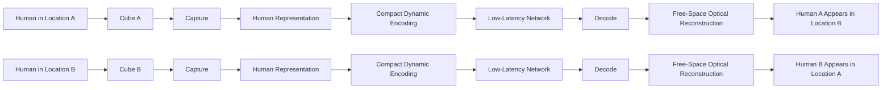

---

# 58. Final Concept

The ultimate device is:

**Two identical compact spatial nodes.**

Each node:

1. captures its user
2. understands the user's body
3. builds or accesses a persistent avatar
4. tracks dynamic movement
5. compresses the dynamic state
6. transmits it over a low-latency connection
7. reconstructs the remote avatar
8. computes the required spatial/angular optical information
9. generates that information directly into free space
10. continuously updates it as the human moves

The remote user therefore does not appear on:

* a wall
* a television
* a projection screen
* a headset display

Instead, the remote person's appearance is reconstructed as a **free-space spatial optical phenomenon produced by the cube itself**.

---

# 59. The Three Optical Technologies to Attack First

Priority order for research:

## 1. Laser-excited aerial volumetric display

Why:

* genuinely free-space
* actual luminous voxels
* directly aligned with the vision
* already experimentally demonstrated
* clear scaling research problem

## 2. Directional light-field / holographic reconstruction

Why:

* potentially much more efficient than literal voxel generation
* supports view-dependent imagery
* naturally compatible with angularly selective light
* potentially compatible with neural view synthesis

## 3. Aerial imaging + light-field optics

Why:

* potentially useful for compact hardware
* can transform small optical sources into larger apparent aerial images
* directly relevant to the 10-cm physical constraint

---

# 60. One Strategic Decision

Do not prematurely decide:

> "The cube must use lasers."

Do not prematurely decide:

> "The cube must use holography."

Do not prematurely decide:

> "The cube must use Gaussian splats."

The invention is the **system architecture**.

The optical engine is an experimental frontier.

The representation engine is another experimental frontier.

The final product may eventually combine technologies that do not yet exist in exactly the required form.

---

# 61. The Actual Research Program

The project should therefore proceed in four parallel tracks:

## Track A — Human Representation

Solve:

**What is the smallest representation that preserves human identity, body motion, face, and hands?**

## Track B — Communication

Solve:

**What is the smallest dynamic state that can be transmitted while maintaining conversational quality?**

## Track C — Free-Space Optics

Solve:

**How much spatial and angular optical information can a 10-cm optical engine generate?**

## Track D — Perception

Solve:

**How little optical information is actually required for a human observer to perceive convincing remote presence?**

The breakthrough may come from the interaction between all four rather than from one subsystem individually.

---

# 62. The Central Architecture in One Line

**Capture the human semantically, transmit the human dynamically, and reconstruct only the optical information that the observer actually needs.**

---

# 63. The Ultimate One-Sentence Vision

> **Two identical approximately 10-cm cubes, located anywhere on Earth, capture their users and exchange compact dynamic human representations; each cube then reconstructs the remote human directly into free space using angularly controlled volumetric, holographic, light-field, aerial-imaging, or hybrid optical techniques, creating the perception of remote physical presence without walls, screens, headsets, external projectors, or any room-sized infrastructure.**

---

# 64. The Core Research Question

> **Can a tiny autonomous optical-computational device generate enough controlled free-space light-field information for the human brain to perceive a remote moving human as physically present?**

That is the question the entire project should attack.

---

# 65. The Core Vision

The goal is not to make a better video call.

The goal is to make the **physical location of the person become irrelevant**.

The network carries the person's dynamic state.

The cube converts that state back into spatial light.

The human sees:

**the person, not the video of the person.**

That is the essence of the project.

```
```
